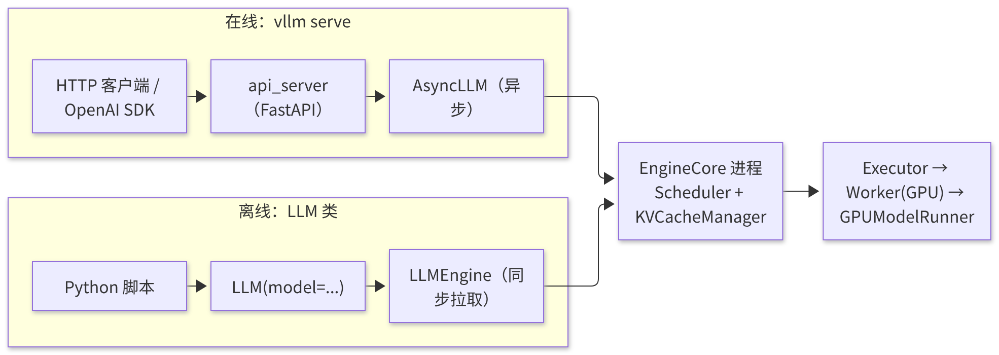
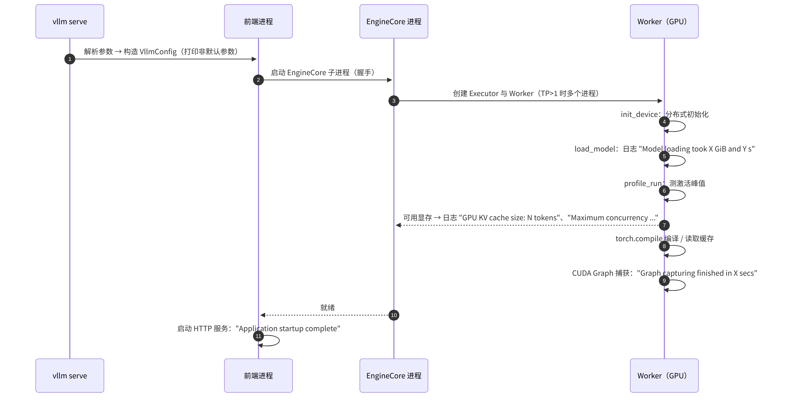

# A1 · 环境搭建与离线/在线推理

> **版本**：vLLM 0.30.x（V1 引擎）｜**模块**：A-上手与调试｜**对应原课**：第 1 课（已删除推广内容，并统一版本表述）
> **导航**：上一课：无（本课为课程起点，建议先阅读《00-学习路径与总索引》） → **本课 A1** → 下一课：[B1-Engine与流式执行]
> **练习**：`exercises/A1_env_smoke`（仅需 CPU）｜**源码标注**：标有【待核】之处以 0.30.x tag 的源码为准。

## 0. 先修要求与学习目标

先修要求：Python 3.10 及以上版本、虚拟环境工具（venv/uv/conda）；Linux 命令行操作；PyTorch 张量基础；了解 GPU 驱动版本与 CUDA 运行时版本之间的区别。建议具备 NVIDIA GPU；不具备 GPU 的条件下亦可完成本课练习。

完成本课学习后，学习者应能够：

1. 正确安装 vLLM 0.30.x，并阐明 vLLM、PyTorch、CUDA 与驱动之间的版本约束；
2. 使用 `LLM` 类执行离线批量推理，使用 `vllm serve` 启动 OpenAI 兼容服务，并说明各关键参数所作用的系统层次；
3. 解读启动日志中的各个阶段，并依据日志信息手工计算键值缓存（KV Cache）的容量；
4. 掌握源码调试所需的四项配置开关，为模块 B 的源码阅读做好准备；
5. 使用 `vllm bench` 完成首次基准测试，并解读首词元时延（TTFT）、词元间时延（ITL）与吞吐量三项指标。

---

## 1. 动机：环境构建的必要性

vLLM 是与硬件紧密耦合的系统：它包含大量预编译的 CUDA 内核（kernel），依赖特定版本的 PyTorch；PyTorch 又依赖特定版本的 CUDA 运行时，而 CUDA 运行时要求驱动版本不低于某一下限。上述任一环节版本不匹配，均可能导致"可以 import，但运行时报告找不到 kernel"或"可以运行，但性能异常"等问题。此外，后续所有源码课程均要求学习者能够在本地以"可设置断点"的方式运行 vLLM，这要求理解其多进程结构与调试开关。因此，本课的目标不仅是使程序正常运行，而是**建立一套可复现、可调试的环境**。

## 2. 安装与版本约束

```bash
# 推荐：uv 创建隔离环境
uv venv --python 3.12 && source .venv/bin/activate
uv pip install "vllm==0.30.*" --torch-backend=auto   # 自动匹配 CUDA 版本的 PyTorch 轮子【待核：参数名】
python -c "import vllm, torch; print(vllm.__version__, torch.__version__, torch.version.cuda)"
vllm collect-env   # 打印驱动、CUDA、GPU、关键依赖版本，提 issue 时必附
```

版本关系的要点如下：

- **驱动**具有向后兼容性：新版驱动可运行旧版 CUDA 运行时，反之则不成立。`nvidia-smi` 右上角显示的是该驱动所支持的最高 CUDA 版本，而非已安装的运行时版本。
- **vLLM 安装包（wheel）**与特定 PyTorch 版本绑定，因此安装 vLLM 之后不应单独升级 torch。
- **基于源码开发**：若仅修改 Python 代码，可使用 `VLLM_USE_PRECOMPILED=1 uv pip install -e .` 复用预编译 kernel，安装过程约需数分钟；仅当需要修改 CUDA kernel 时才需完整编译（耗时可能超过半小时，并应设置 `MAX_JOBS` 以控制并行度，避免内存不足）。

## 3. 两种使用方式在架构中的位置



<p align="center"><em>图1：离线（LLM）与在线（API Server）两种入口共用同一 EngineCore 执行栈</em></p>

离线方式与在线方式的区别仅在于"入口"，其下层为同一个 EngineCore 与执行栈（B1、B6 将作深入讨论）。因此，在离线模式下验证过的参数，在在线模式下具有完全相同的含义。


**离线与在线的选择。** 二者的选择取决于任务形态。离线 `LLM` 适用于"一次性处理大批量数据"的场景，例如评测、数据合成与批量标注：由于所有请求在开始时即已确定，调度器（Scheduler）可从第一步起组成最大批次（batch），因此吞吐量最高，且不存在 HTTP 与序列化开销。在线服务适用于"请求随时到达"的场景，需关注每个请求的时延。一种常见的错误做法是：使用在线服务并由客户端循环逐个发送请求来完成批量离线任务，其吞吐量仅为离线模式的数分之一，原因在于服务端在同一时刻只接收到一个请求，batch 大小始终为 1。正确的做法是改用离线 `LLM`，或在客户端以足够的并发度发送请求。

## 4. 离线推理

```python
from vllm import LLM, SamplingParams

llm = LLM(
    model="Qwen/Qwen3-0.6B",
    max_model_len=4096,            # 单请求最大上下文（prompt + 输出）
    gpu_memory_utilization=0.85,   # 本实例可用显存占总显存比例
    tensor_parallel_size=1,
)
params = SamplingParams(temperature=0.7, top_p=0.9, max_tokens=128)
outs = llm.generate(["用一句话解释 PagedAttention。", "什么是 KV Cache？"], params)
for o in outs:
    print(o.prompt, "->", o.outputs[0].text)

# 对话模型推荐用 chat，自动套用 chat template
msgs = [{"role": "user", "content": "你好，介绍一下 vLLM。"}]
print(llm.chat(msgs, params)[0].outputs[0].text)
```

**要点**：`generate` 接受一批提示词（prompt）并一次性返回全部结果，其内部持续调度直至所有请求完成。将 1 000 条 prompt 一次性传入，比循环调用 1 000 次快一至两个数量级，原因在于前者使调度器能够组成大 batch（B3）。

## 4.5 SamplingParams 各字段说明

`SamplingParams` 是用户与 vLLM 交互最频繁的对象，其每个字段最终都在 EngineCore 或 ModelRunner 的特定位置生效（F1 将深入讨论采样实现）。本节先建立基本认识：

- **temperature**：将 logits 除以温度后再执行 softmax。取值为 0 表示贪心解码（始终选择概率最大的词元（token）），输出是确定的；取值越大，输出随机性越强。需注意，当 temperature 很小但不为 0 时（如 0.01），其数值结果近似于贪心解码，但执行的仍是随机采样路径。
- **top_p / top_k / min_p**：用于截断候选集。top_k 仅保留概率最高的 k 个 token；top_p 保留累计概率达到 p 的最小集合；min_p 保留概率不低于"最大概率 × min_p"的 token。三者可组合使用，其执行顺序取决于具体实现。
- **max_tokens / min_tokens**：输出长度的上界与下界。在 min_tokens 生效期间，EOS 与停止 token 的 logits 将被屏蔽。
- **stop / stop_token_ids**：停止字符串在前端（OutputProcessor）判定，停止 token 在 EngineCore 判定（B1 阐述了这一分工）。
- **presence_penalty / frequency_penalty / repetition_penalty**：用于抑制重复。前两者为 OpenAI 风格的加性惩罚，后者为乘性惩罚；由于后者需要统计每个请求中已出现的 token，因此存在额外开销。
- **n**：为每个 prompt 生成多条输出；其内部拆分为多个子请求，并共享 prompt 的 KV 块（前缀缓存自动生效）。
- **seed**：为该请求设置独立的随机数生成器，使随机采样结果可复现；但同一 batch 中其他请求的变化可能影响数值结果，因此不保证跨 batch 组合的严格逐位复现。
- **logprobs / prompt_logprobs**：返回概率最高的若干 token 的对数概率。prompt_logprobs 需要对 prompt 的每个位置计算 logits，会显著增加预填充（Prefill）阶段的开销（B6 指出 logits 通常仅对最后一个位置计算）。
- **结构化输出**（如 JSON schema）：通过 guided decoding 相关参数指定，此类请求将首先进入等待语法编译的状态（B3）。

在在线服务中，上述字段由 OpenAI 兼容接口的请求体映射而来；不属于 OpenAI 规范的字段（如 top_k、min_p、repetition_penalty）可作为额外字段直接置于请求体中。

## 5. 在线服务

```bash
vllm serve Qwen/Qwen3-0.6B \
  --port 8000 \
  --max-model-len 4096 \
  --gpu-memory-utilization 0.85 \
  -tp 1 \
  --max-num-seqs 128

curl http://localhost:8000/v1/chat/completions -H "Content-Type: application/json" -d '{
  "model": "Qwen/Qwen3-0.6B",
  "messages": [{"role": "user", "content": "你好"}],
  "max_tokens": 64, "stream": true}'
```

常用参数及其作用层次：

| 参数 | 影响 | 详见 |
|---|---|---|
| `--max-model-len` | 单请求最大长度；取值过大可能导致启动时因 KV 容量不足而报错 | B4 |
| `--gpu-memory-utilization` | 可用显存比例，决定 KV 块数 | B2 |
| `--max-num-seqs` / `--max-num-batched-tokens` | 并发请求数上限 / 每步 token 数上限 | B3 |
| `-tp` / `-pp` / `-dp` | 张量并行（TP）/ 流水线并行（PP）/ 数据并行（DP） | E1、E2 |
| `--enforce-eager` | 关闭 CUDA Graph 与编译；启动较快、便于调试，但运行较慢 | C2、C3 |
| `--quantization` / `--kv-cache-dtype` | 权重量化 / KV 精度 | D2 |
| `--enable-prefix-caching` | 前缀缓存（V1 中默认开启） | B4 |

## 6. 启动日志解读：一次完整启动的时序



<p align="center"><em>图2：一次完整启动的时序：从参数解析到 KV 容量分配与服务就绪</em></p>

**数值示例：手工计算 KV 容量**。Qwen3-0.6B 的配置为：28 层、8 个 KV 头、head_dim 为 128，数据类型为 bf16。每个 token 的 KV 占用 = 2 × 28 × 8 × 128 × 2 B = 114 688 B = 112 KiB。在 24 GB 显存的显卡上、`gpu_memory_utilization=0.85` 的条件下：可用显存约为 20.4 GB；权重约为 1.2 GB（约 6 亿参数 × 2 B）；激活峰值与 CUDA Graph 约为 1.5～2.5 GB；非 torch 显存约为 0.5 GB。由此 KV 可用约 16～17 GB，可容纳约 16.5×1024×1024/112 ≈ 15.4 万个 token。当 `max_model_len=4096` 时，日志中的最大并发倍数约为 154 000 / 4 096 ≈ 37.6。若将 `max_model_len` 设为 40 960，并发倍数降至 3.8；若单个请求所需的 token 数超过 KV 总容量，则启动时将报错，并提示减小 `max_model_len` 或提高显存比例。

需注意：小模型每个 token 的 KV 占用并不小。0.6B 模型每个 token 占用 112 KiB，与 8B 模型的 128 KiB 相差不大，原因在于两者的 KV 头数与 head_dim 相同，仅层数不同。**KV 容量由注意力结构决定，而非由参数量决定**，这是初学者最常见的误判之一。

## 7. 调试配置

阅读源码时，需要使 vLLM 以"单进程、可设置断点、可复现"的方式运行，相关配置如下：

1. `VLLM_ENABLE_V1_MULTIPROCESSING=0`：将前端与 EngineCore 合并至同一进程（使用 `InprocClient`），从而可在调度器内部直接设置断点。需注意，当 TP>1 时 Worker 仍为独立进程，因此调试时应使用单卡。
2. `--enforce-eager`（离线方式下为 `enforce_eager=True`）：关闭 CUDA Graph 与编译，前向计算在 Python 中逐层执行，从而可在模型代码中设置断点并打印张量。
3. `VLLM_LOGGING_LEVEL=DEBUG`：输出更详细的内部日志。
4. `CUDA_LAUNCH_BLOCKING=1`：使 CUDA 错误在出错的 kernel 处同步报告，定位非法内存访问时必须启用（运行速度将显著下降）。

此外，`--load-format dummy` 可使用随机权重快速启动（无需下载模型），适用于调试显存与并行拓扑；`--max-model-len 512` 与小模型配合使用，可将启动时间缩短至十余秒。

## 7.5 源码目录导览：模块 B 的准备

安装源码版本后，建议先用约十分钟熟悉目录结构，后续各课均会频繁涉及以下目录：

- `vllm/entrypoints/`：入口层，包括 `llm.py`（离线 LLM 类）、`openai/`（在线 API 服务）与 `cli/`（`vllm serve`、`vllm bench` 等命令）。
- `vllm/engine/arg_utils.py` 与 `vllm/config/`：定义命令行参数转换为 `VllmConfig` 的过程，几乎所有参数的默认值与校验逻辑均位于此处。
- `vllm/v1/engine/`：前端引擎与 EngineCore（B1）。
- `vllm/v1/core/`：调度器与 KV 块管理（B3、B4）。
- `vllm/v1/executor/` 与 `vllm/v1/worker/`：执行器、Worker 与 ModelRunner（B2、B5、B6）。
- `vllm/v1/attention/` 与 `vllm/attention/`：注意力后端与算子（C1）。
- `vllm/model_executor/`：模型定义、并行线性层、权重加载、量化与 MoE（B5、D2、E3）。
- `vllm/compilation/`：torch.compile 集成与 CUDA Graph 封装（C2、C3）。
- `vllm/distributed/`：并行状态、通信器与 KV 传输（E 模块、F3）。
- `csrc/`：CUDA/C++ kernel 源码。

一种有效的阅读方法是：遇到命令行参数时，首先在 `arg_utils.py` 中定位其对应的配置字段，然后通过全文搜索确定该字段在哪些模块中被读取。采用这一方法，可以较快地建立"参数 → 配置 → 行为"的对应关系，而无需机械记忆参数表。

## 7.6 环境问题的排查决策树

启动失败时，可按以下顺序判断问题类别。第一，判断报错发生在 import 阶段还是运行阶段：import 阶段的报错多由版本不匹配引起（驱动、CUDA、PyTorch、vLLM 四者之一），可使用 `vllm collect-env` 对照官方要求进行核查。第二，若在模型加载阶段失败，应区分"找不到模型或下载失败"（涉及网络、权限或本地路径）与"架构不受支持"（模型的 architectures 字段不在注册表中，需升级 vLLM 或使用 Transformers 后端）。第三，若在显存相关阶段失败，应按第 6 节的方法重新计算，确认原因是 `max_model_len` 过大、显存比例过低，还是显卡已被占用。第四，若在编译或图捕获阶段失败，可先使用 `--enforce-eager` 绕过，确定问题范围后再参阅 C2、C3。第五，若服务能够启动但请求报错，通常属于请求参数问题（如 prompt 长度超过 `max_model_len`、缺少 chat template），应查阅服务端日志中的具体校验信息。该顺序与第 6 节所述的启动时序一一对应：**按时序确定"最后一个成功完成的阶段"，问题即位于其后一阶段**。

## 8. 首次基准测试

```bash
# 服务已启动后，在另一个终端：
vllm bench serve --model Qwen/Qwen3-0.6B \
  --dataset-name random --random-input-len 1024 --random-output-len 128 \
  --num-prompts 200 --request-rate 8
```

输出中的三项核心指标：

- **TTFT（Time To First Token，首词元时延）**：从发送请求到收到第一个 token 的时间，主要由排队时间与 Prefill 决定；
- **ITL / TPOT（Inter-Token Latency / Time Per Output Token，词元间时延 / 单个输出词元耗时）**：相邻输出 token 之间的间隔，主要由解码（Decode）步长决定；
- **吞吐量**：每秒输出的 token 数与每秒处理的请求数。

**解读练习**：若 `request-rate` 由 8 提高至 32，吞吐量上升而 TTFT 的 P99 急剧增大，则表明系统已进入排队区，瓶颈在于容量；若 ITL 随并发数线性上升，则表明每步的 batch 增大导致步长增加，属于正常现象。更系统的分析方法见 F2。

## 9. 常见问题与故障模式

1. **驱动版本过旧**：`nvidia-smi` 显示的 CUDA 版本低于 PyTorch 安装包的要求，导入时报告 CUDA 初始化错误。应升级驱动，而非降级 vLLM。
2. **显存被其他进程占用**：`gpu_memory_utilization` 按总显存计算；若显卡上已运行其他进程，启动时将报告可用显存不足。
3. **`max_model_len` 过大**：其默认值取自模型配置中的最大长度（可能为 128K），在显存较小的显卡上启动时即报告 KV 容量不足。应显式设置合理的取值。
4. **容器共享内存不足**：多卡运行时，若 `/dev/shm` 过小将导致 Bus error；启动容器时应添加 `--ipc=host` 或增大 `--shm-size`。
5. **对 chat 模型使用 generate 直接输入原始文本**：由于未套用 chat template，输出质量较差或无法正常停止。应使用 `llm.chat` 或在线 chat 接口。
6. **调试时未关闭多进程**：设置在调度器中的断点始终不会被命中，原因在于调度器运行于另一个进程中。
7. **模型下载缓慢或失败**：可设置 `HF_ENDPOINT` 镜像，或预先将模型下载至本地目录后以本地路径启动；可使用 `HF_HOME` 指定缓存目录以避免重复下载。

## 10. 实践练习

- 目录：`exercises/A1_env_smoke`
- 任务：
  1. 实现 `parse_serve_args(argv)`：解析 `--model/-m`、`--port/-p`、`--tensor-parallel-size/-tp`；缺少 model 参数时抛出 `ValueError`，遇到未知参数时跳过；
  2. 实现 `check_version_compatible(current, minimum)`：按"主版本.次版本.修订号"比较版本，支持前缀 `v` 与省略的版本段（如 `0.30` 视为 `0.30.0`）。
- 运行方式（在仓库根目录下执行）：

```bash
python -m pytest exercises/A1_env_smoke -q
```

- 验收标准：上述测试全部通过。
- 进阶任务：扩展解析器以支持 `--max-model-len` 与 `--gpu-memory-utilization`，并编写一个函数，依据第 6 节的公式估算 KV 可容纳的 token 数；使用 Qwen3-0.6B 与 Llama-3-8B 的配置编写测试，预期每 token KV 占用分别为 112 KiB 与 128 KiB。

## 11. 自测题

- [ ] 能否阐明驱动、CUDA 运行时、PyTorch、vLLM 四者之间的版本约束，并使用 `vllm collect-env` 进行排查
- [ ] 能否依据模型配置与显存容量，手工计算启动日志中的 KV token 数与最大并发倍数
- [ ] 能否通过本课第 7 节的调试配置，使 vLLM 在单进程中命中调度器内的断点

## 12. 延伸阅读

- vLLM 官方文档：Installation、Quickstart、Engine Arguments、Benchmark CLI
- 本课程 B1（多进程结构）、B2（显存分析）、F2（性能分析方法）

---

**课程导航**　上一课：无（课程起点）｜下一课：[B1 · Engine 与流式执行](https://qcngm3vce6yt.feishu.cn/docx/Sg5hdyoxqoE9nZx10DAcrGCknph)｜[返回索引](https://qcngm3vce6yt.feishu.cn/docx/KUn5dKSejoQSAJxaf7YcvNVDnCd)

相关章节：
- [B3 · 调度器 Scheduler](https://qcngm3vce6yt.feishu.cn/docx/PgNQdFEp2oajjSxApwKcSUIvnTb)——见本课「4. 离线推理」：“使调度器能够组成大 batch（B3）。”
- [B6 · V1 架构总览与推理主路径](https://qcngm3vce6yt.feishu.cn/docx/FV3gdoLxEo55VtxFlnkc41Lhn6g)——见本课「3. 两种使用方式在架构中的位置」：“同一个 EngineCore 与执行栈（B1、B6 将作深入讨论）。”
- [B4 · PagedAttention 与 KV Cache 显存管理](https://qcngm3vce6yt.feishu.cn/docx/OOo7d5yZvoKv2ZxauPOcBDOincb)——见本课「5. 在线服务」：“表格行「--max-model-len」中的 B4”
