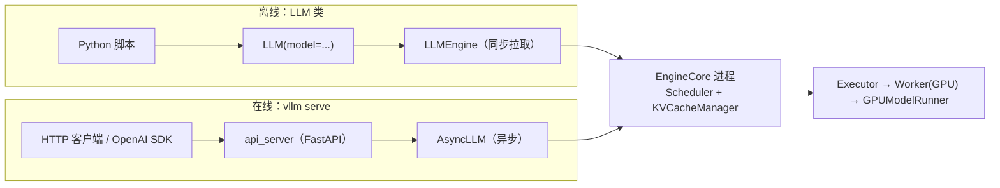
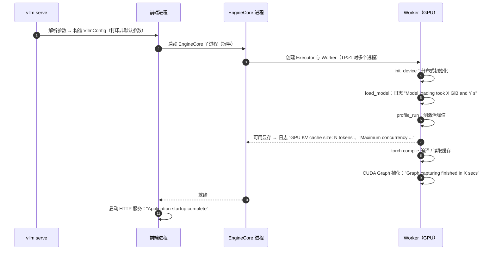

# A1 · 环境搭建与离线/在线推理（深度版）

> **版本**：vLLM 0.30.x（V1 引擎）｜**模块**：A-上手与调试｜**对应原课**：第 1 课（已去除推广内容，统一版本口径）
> **导航**：上一课：无（课程起点，先读《00-学习路径与总索引》） → **本课 A1** → 下一课：[B1-Engine与流式执行]
> **练习**：`exercises/A1_env_smoke`（纯 CPU）｜**源码标注**：标【待核】处以 0.30.x tag 为准。

## 0. 先修与本课目标

先修：Python 3.10+、虚拟环境（venv/uv/conda）；Linux 命令行；PyTorch 张量基础；知道 GPU 驱动、CUDA 运行时版本的区别。有 NVIDIA GPU 最好；没有 GPU 也能完成本课练习。

学完本课你应能：

1. 正确安装 vLLM 0.30.x，理解 vLLM、PyTorch、CUDA、驱动之间的版本约束；
2. 用 `LLM` 类做离线批量推理、用 `vllm serve` 启动 OpenAI 兼容服务，并理解每个关键参数影响的是系统的哪一部分；
3. 读懂启动日志中的每个阶段，并能根据日志手算 KV 容量；
4. 掌握源码调试的"四件套"开关，为模块 B 的源码阅读做好准备；
5. 用 `vllm bench` 做第一次基准测试，读懂 TTFT、ITL、吞吐三个指标。

---

## 1. 动机：为什么第一课不是"pip install 就完事"

vLLM 是一个与硬件强绑定的系统：它包含大量预编译的 CUDA kernel，依赖特定版本的 PyTorch，而 PyTorch 又依赖特定版本的 CUDA 运行时，CUDA 运行时又要求驱动不低于某个版本。任何一环不匹配，都可能出现"能 import 但一跑就报 kernel 找不到"或者"能跑但性能异常"的问题。另外，后续所有源码课都需要你能在本地以"可打断点"的方式运行 vLLM，这要求你理解它的多进程结构与调试开关。因此本课的目标不只是跑通，而是**建立一套可复现、可调试的环境**。

## 2. 安装与版本约束

```bash
# 推荐：uv 创建隔离环境
uv venv --python 3.12 && source .venv/bin/activate
uv pip install "vllm==0.30.*" --torch-backend=auto   # 自动匹配 CUDA 版本的 PyTorch 轮子【待核：参数名】
python -c "import vllm, torch; print(vllm.__version__, torch.__version__, torch.version.cuda)"
vllm collect-env   # 打印驱动、CUDA、GPU、关键依赖版本，提 issue 时必附
```

版本关系的要点：

- **驱动**向后兼容：新驱动能跑旧 CUDA 运行时，反之不行。`nvidia-smi` 右上角显示的是驱动支持的最高 CUDA 版本，不是已安装的运行时版本。
- **vLLM 轮子**与特定 PyTorch 版本绑定，不要在装好 vLLM 后单独升级 torch。
- **从源码开发**：若只改 Python 代码，用 `VLLM_USE_PRECOMPILED=1 uv pip install -e .` 复用预编译 kernel，几分钟即可装好；若要改 CUDA kernel，才需要完整编译（可能需要半小时以上，并设置 `MAX_JOBS` 控制并行度以免内存不足）。

## 3. 两种使用方式在架构中的位置



离线与在线只是"入口"不同，底下是同一个 EngineCore 与执行栈（B1、B6 会深入）。所以在离线模式下调通的参数，在线模式下含义完全一样。


**离线还是在线？** 两者的选择取决于你的任务形态。离线 `LLM` 适合"一次性处理一大批数据"的场景，例如评测、数据合成、批量打标：所有请求一开始就已知，调度器可以从第一步起就组成最大 batch，吞吐最高，也没有 HTTP 与序列化开销。在线服务适合"请求随时到达"的场景，需要关注每个请求的延迟。很多团队会犯一个错误：用在线服务配合客户端循环逐个发请求来做批量离线任务，结果吞吐只有离线模式的几分之一，原因就是同一时刻服务端只看到一个请求，batch 始终为 1。要么改用离线 `LLM`，要么在客户端以足够的并发度发送请求。

## 4. 离线推理

```python
from vllm import LLM, SamplingParams

llm = LLM(
    model="Qwen/Qwen3-0.6B",
    max_model_len=4096,            # 单请求最大上下文（prompt + 输出）
    gpu_memory_utilization=0.85,   # 本实例可用显存占总显存比例
    tensor_parallel_size=1,
)
params = SamplingParams(temperature=0.7, top_p=0.9, max_tokens=128)
outs = llm.generate(["用一句话解释 PagedAttention。", "什么是 KV Cache？"], params)
for o in outs:
    print(o.prompt, "->", o.outputs[0].text)

# 对话模型推荐用 chat，自动套用 chat template
msgs = [{"role": "user", "content": "你好，介绍一下 vLLM。"}]
print(llm.chat(msgs, params)[0].outputs[0].text)
```

**关键点**：`generate` 接受一批 prompt 并一次返回全部结果，内部会连续调度直到所有请求完成。把 1 000 条 prompt 一次传入，比循环调用 1 000 次快一到两个数量级，因为前者让调度器能组成大 batch（B3）。

## 4.5 SamplingParams 逐项理解

`SamplingParams` 是用户与 vLLM 交互最频繁的对象，它的每个字段最终都会在 EngineCore 或 ModelRunner 的某个位置生效（F1 会深入采样实现），这里先建立直觉：

- **temperature**：把 logits 除以温度再做 softmax。0 表示贪心解码（总选概率最大的 token），输出确定；越大越随机。注意 temperature 很小但不为 0 时（如 0.01），在数值上几乎等同贪心，但仍走随机采样路径。
- **top_p / top_k / min_p**：截断候选集。top_k 只保留概率最高的 k 个；top_p 保留累计概率达到 p 的最小集合；min_p 保留概率不低于"最大概率 × min_p"的 token。它们可以组合使用，执行顺序与具体实现有关。
- **max_tokens / min_tokens**：输出长度的上下界。min_tokens 生效期间，EOS 与停止 token 的 logits 会被屏蔽。
- **stop / stop_token_ids**：停止字符串在前端（OutputProcessor）判定，停止 token 在 EngineCore 判定（B1 解释了这个分工）。
- **presence_penalty / frequency_penalty / repetition_penalty**：抑制重复。前两者是 OpenAI 风格的加性惩罚，后者是乘性惩罚，需要统计每个请求已出现的 token，因此有额外开销。
- **n**：每个 prompt 生成多条输出，内部拆为多个子请求并共享 prompt 的 KV 块（前缀缓存自动生效）。
- **seed**：为该请求设置独立随机数生成器，使随机采样可复现；但同一 batch 中其他请求的变化可能影响数值，跨 batch 组合的严格逐位复现并不保证。
- **logprobs / prompt_logprobs**：返回 top 若干 token 的对数概率。prompt_logprobs 需要对 prompt 的每个位置计算 logits，会显著增加 prefill 的开销（B6 中提到 logits 通常只对最后位置计算）。
- **结构化输出**（如 JSON schema）：通过 guided decoding 相关参数指定，会让请求先进入等待语法编译的状态（B3）。

在线服务中，这些字段由 OpenAI 兼容接口的请求体映射而来；不在 OpenAI 规范内的字段（如 top_k、min_p、repetition_penalty）可以作为额外字段直接放进请求体。

## 5. 在线服务

```bash
vllm serve Qwen/Qwen3-0.6B \
  --port 8000 \
  --max-model-len 4096 \
  --gpu-memory-utilization 0.85 \
  -tp 1 \
  --max-num-seqs 128

curl http://localhost:8000/v1/chat/completions -H "Content-Type: application/json" -d '{
  "model": "Qwen/Qwen3-0.6B",
  "messages": [{"role": "user", "content": "你好"}],
  "max_tokens": 64, "stream": true}'
```

常用参数与影响的层次：

| 参数 | 影响 | 详见 |
|---|---|---|
| `--max-model-len` | 单请求最大长度；过大可能导致启动时 KV 不足报错 | B4 |
| `--gpu-memory-utilization` | 可用显存比例，决定 KV 块数 | B2 |
| `--max-num-seqs` / `--max-num-batched-tokens` | 并发请求数上限 / 每步 token 上限 | B3 |
| `-tp` / `-pp` / `-dp` | 张量 / 流水 / 数据并行 | E1、E2 |
| `--enforce-eager` | 关闭 CUDA Graph 与编译，启动快、便于调试，但更慢 | C2、C3 |
| `--quantization` / `--kv-cache-dtype` | 权重量化 / KV 精度 | D2 |
| `--enable-prefix-caching` | 前缀缓存（V1 默认开启） | B4 |

## 6. 读懂启动日志：一次完整启动的时序



**数字例子：手算 KV 容量**。Qwen3-0.6B：28 层、8 个 KV 头、head_dim 128，bf16。每 token KV = 2 × 28 × 8 × 128 × 2 B = 114 688 B = 112 KiB。在 24 GB 显卡、`gpu_memory_utilization=0.85` 下：可用 ≈ 20.4 GB；权重 ≈ 1.2 GB（约 6 亿参数 × 2 B）；激活峰值与 CUDA Graph 约 1.5～2.5 GB；非 torch 显存约 0.5 GB。KV 约 16～17 GB，可放约 16.5×1024×1024/112 ≈ 15.4 万 token。`max_model_len=4096` 时，日志中的最大并发约为 154 000 / 4 096 ≈ 37.6 倍。如果把 `max_model_len` 设为 40 960，并发倍数降到 3.8；若单个请求所需 token 超过 KV 总量，启动就会报错并提示减小 `max_model_len` 或提高显存比例。

注意：小模型的 KV 每 token 并不小。0.6B 模型每 token 112 KiB，与 8B 模型的 128 KiB 相差不大，因为两者的 KV 头数与 head_dim 相同，只有层数不同。**KV 容量由注意力结构决定，而不是参数量**，这是新手最常见的误判之一。

## 7. 调试四件套

阅读源码时，你需要让 vLLM 以"单进程、可断点、可复现"的方式运行：

1. `VLLM_ENABLE_V1_MULTIPROCESSING=0`：前端与 EngineCore 合并到同一进程（使用 `InprocClient`），可以直接在调度器里打断点。注意 TP>1 时 Worker 仍是独立进程，调试时请用单卡。
2. `--enforce-eager`（离线为 `enforce_eager=True`）：关闭 CUDA Graph 与编译，前向在 Python 中逐层执行，可以在模型代码里打断点、打印张量。
3. `VLLM_LOGGING_LEVEL=DEBUG`：打印更多内部日志。
4. `CUDA_LAUNCH_BLOCKING=1`：让 CUDA 错误在出错的 kernel 处同步报告，定位非法访存时必用（会显著变慢）。

另外，`--load-format dummy` 可以用随机权重快速启动（不下载模型），适合调试显存与并行拓扑；`--max-model-len 512` 与小模型配合能把启动时间压到十几秒。

## 7.5 源码目录导览：为模块 B 做准备

安装源码版之后，先花十分钟熟悉目录结构，后续每一课都会在这些目录之间穿梭：

- `vllm/entrypoints/`：入口层，`llm.py`（离线 LLM 类）、`openai/`（在线 API 服务）、`cli/`（`vllm serve`、`vllm bench` 等命令）。
- `vllm/engine/arg_utils.py` 与 `vllm/config/`：命令行参数如何变成 `VllmConfig`，几乎所有参数的默认值与校验逻辑都在这里。
- `vllm/v1/engine/`：前端引擎与 EngineCore（B1）。
- `vllm/v1/core/`：调度器与 KV 块管理（B3、B4）。
- `vllm/v1/executor/` 与 `vllm/v1/worker/`：执行器、Worker、ModelRunner（B2、B5、B6）。
- `vllm/v1/attention/` 与 `vllm/attention/`：注意力后端与算子（C1）。
- `vllm/model_executor/`：模型定义、并行线性层、权重加载、量化、MoE（B5、D2、E3）。
- `vllm/compilation/`：torch.compile 集成与 CUDA Graph 包装（C2、C3）。
- `vllm/distributed/`：并行状态、通信器、KV 传输（E 模块、F3）。
- `csrc/`：CUDA/C++ kernel 源码。

一个实用的阅读习惯是：遇到命令行参数时，先在 `arg_utils.py` 中找到它对应的配置字段，再用全文搜索查找该字段在哪些模块被读取。这样你会很快建立起"参数 → 配置 → 行为"的对应关系，而不是死记参数表。

## 7.6 环境问题的排查决策树

遇到启动失败时，可以按以下顺序快速判断问题类别。第一，看报错发生在 import 阶段还是运行阶段：import 阶段报错多为版本不匹配（驱动、CUDA、PyTorch、vLLM 四者之一），用 `vllm collect-env` 对照官方要求即可。第二，若在加载模型阶段失败，区分是"找不到模型/下载失败"（网络、权限、本地路径）还是"架构不支持"（模型的 architectures 字段不在注册表中，需要升级 vLLM 或使用 Transformers 后端）。第三，若在显存相关阶段失败，按第 6 节手算一遍，确认是 `max_model_len` 过大、显存比例过低还是卡被占用。第四，若在编译或图捕获阶段失败，先用 `--enforce-eager` 绕过，确认问题范围后再查 C2、C3。第五，若服务能启动但请求报错，多半是请求参数问题（如超过 `max_model_len` 的 prompt、chat template 缺失），看服务端日志中的具体校验信息。这个顺序与第 6 节的启动时序一一对应：**按时序找到"最后一个成功的阶段"，问题就在它的下一步**。

## 8. 第一次基准测试

```bash
# 服务已启动后，在另一个终端：
vllm bench serve --model Qwen/Qwen3-0.6B \
  --dataset-name random --random-input-len 1024 --random-output-len 128 \
  --num-prompts 200 --request-rate 8
```

输出中的三个核心指标：

- **TTFT（Time To First Token）**：从发送请求到收到第一个 token 的时间，主要由排队与 prefill 决定；
- **ITL / TPOT（Inter-Token Latency / Time Per Output Token）**：相邻输出 token 的间隔，主要由 decode 步长决定；
- **吞吐**：每秒输出 token 数与每秒请求数。

**解读练习**：若 `request-rate` 从 8 提到 32，吞吐上升但 TTFT P99 急剧变大，说明系统进入排队区，瓶颈在容量；若 ITL 随并发线性上升，说明每步的 batch 变大导致步长增加，属于正常现象。更系统的方法见 F2。

## 9. 常见坑 / 故障模式

1. **驱动太旧**：`nvidia-smi` 显示的 CUDA 版本低于 PyTorch 轮子要求，导入时报 CUDA 初始化错误。升级驱动而不是降级 vLLM。
2. **显存被其他进程占用**：`gpu_memory_utilization` 按总显存计算，若卡上已有其他进程，启动时报可用显存不足。
3. **`max_model_len` 过大**：默认取模型配置中的最大长度（可能是 128K），小显存卡上启动即报 KV 不足。显式设置一个合理值。
4. **容器共享内存不足**：多卡时 `/dev/shm` 太小导致 Bus error，启动容器时加 `--ipc=host` 或增大 `--shm-size`。
5. **chat 模型用 generate 直接喂裸文本**：没有套用 chat template，输出质量差或不停止。用 `llm.chat` 或在线的 chat 接口。
6. **调试时忘了关多进程**：断点打在调度器里永远不会命中，因为它在另一个进程中运行。
7. **模型下载慢或失败**：设置 `HF_ENDPOINT` 镜像或提前下载到本地目录后用本地路径启动；用 `HF_HOME` 指定缓存目录避免重复下载。

## 10. 动手练习

- 目录：`exercises/A1_env_smoke`
- 任务：
  1. `parse_serve_args(argv)`：解析 `--model/-m`、`--port/-p`、`--tensor-parallel-size/-tp`，缺少 model 时抛 `ValueError`，未知参数跳过；
  2. `check_version_compatible(current, minimum)`：按"主.次.补"比较版本，支持前缀 `v` 与缺省段（如 `0.30` 视为 `0.30.0`）。
- 运行（在仓库根目录）：

```bash
python -m pytest exercises/A1_env_smoke -q
```

- 进阶：扩展解析器支持 `--max-model-len` 与 `--gpu-memory-utilization`，并写一个函数根据第 6 节的公式估算 KV token 数，用 Qwen3-0.6B 与 Llama-3-8B 的配置写测试。

## 11. 自测清单

- [ ] 我能说清驱动、CUDA 运行时、PyTorch、vLLM 四者的版本约束，并会用 `vllm collect-env` 排查
- [ ] 我能根据模型配置与显存手算启动日志里的 KV token 数和最大并发倍数
- [ ] 我能用调试四件套让 vLLM 在单进程中命中调度器断点

## 12. 延伸阅读

- vLLM 官方文档：Installation、Quickstart、Engine Arguments、Benchmark CLI
- 本课程 B1（多进程结构）、B2（显存 profile）、F2（性能分析方法）
