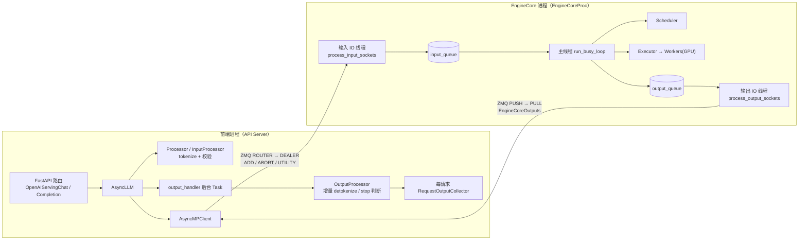
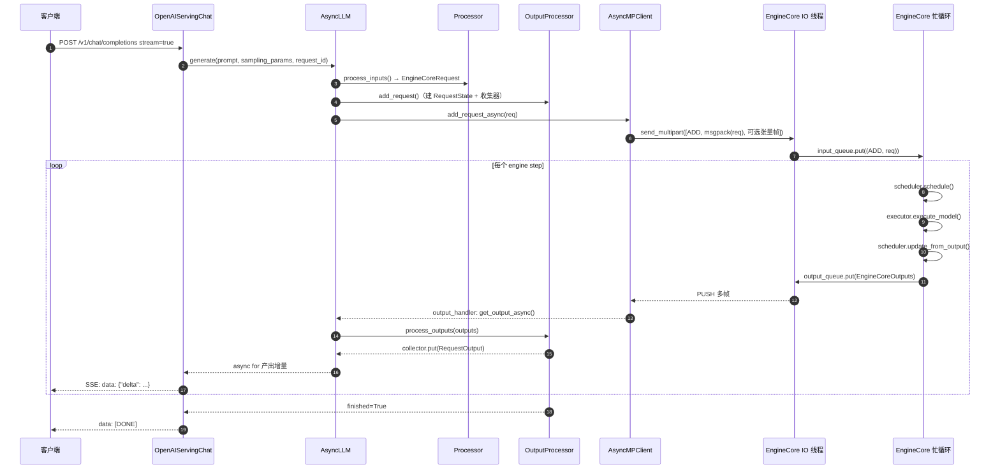

# B1 · Engine 与流式执行（深度版）

> **版本**：vLLM 0.30.x（V1 引擎）｜**模块**：B-运行时内核｜**对应原课**：第 2 课
> **导航**：上一课：[A1-环境搭建] → **本课 B1** → 下一课：[B2-Worker与Executor]
> **练习**：`exercises/B1_zmq_patterns`｜**源码标注约定**：未标注的路径/符号在 V1 主线中长期稳定；标【待核】的表示在 0.30.x 中可能已改名或拆分，请以 `git checkout v0.30.x` 后 `rg` 结果为准。

## 0. 先修与本课目标

先修：A1（能跑通 `LLM.generate` 与 `vllm serve`）；Python `asyncio`（协程、`asyncio.Queue`、后台 Task）；知道"进程"和"线程"在 Python 里的区别（GIL）。

学完本课你应能：

1. 画出 V1 的"前端进程 ↔ EngineCore 进程"结构，并用数字说明拆分带来的收益；
2. 逐个方法说出一个流式请求从 HTTP 进入、到第一个 token 以 SSE 返回的完整调用链；
3. 解释 ZMQ 在 vLLM 中的两条通道（输入 ROUTER/DEALER、输出 PUSH/PULL）、多帧消息与零拷贝张量帧；
4. 区分 `InprocClient` / `SyncMPClient` / `AsyncMPClient` / DP 客户端，并知道调试时该切到哪一个；
5. 识别"客户端断开不 abort""output_handler 被阻塞"等典型线上故障。

---

## 1. 动机：为什么要把引擎拆成两个进程

一次 decode step 在 GPU 上可能只需要 10～30 ms。在这 10 多毫秒内，CPU 侧还要做很多事：HTTP 解析、chat template 渲染与 tokenize、对上百个请求做增量 detokenize、检查 stop string、拼 JSON 并写 SSE。V0 时代这些逻辑与调度、模型执行跑在同一个 Python 进程里，受 GIL 约束只能串行，GPU 就会出现"等 CPU"的空泡。

**用数字感受一下**：假设 batch=256 的 decode step GPU 耗时 15 ms；前端为 256 个请求做增量 detokenize + 组装输出约需 4 ms，调度 + 准备输入约 3 ms。单进程串行时每步 22 ms，GPU 利用率 15/22≈68%。把前端工作挪到另一个进程后，EngineCore 每步只剩 3 ms CPU + 15 ms GPU = 18 ms（若再开 async scheduling，调度还能与 GPU 重叠，逼近 15 ms），吞吐提升约 22%～45%。这就是 V1 进程拆分最直接的收益。

V1 的分工原则：

- **前端进程（API Server / AsyncLLM 所在进程）**：网络 IO、输入预处理（tokenize、多模态预处理、参数校验）、输出后处理（detokenize、stop string、logprobs 组装）。
- **EngineCore 进程**：只跑一个忙循环——取新请求 → 调度 → 驱动 Executor 执行模型 → 更新请求状态 → 推出结果。它不碰字符串，只处理 token id。

## 2. 架构图：进程、线程与套接字



要点：

- EngineCore 进程内部又分 **三个线程**：输入 IO 线程、主忙循环线程、输出 IO 线程。msgpack 解码/编码和 socket 收发在 IO 线程里完成，ZMQ 与 msgspec 的底层工作会释放 GIL，因此主循环几乎不被 IO 拖慢。
- 输入方向用 **ROUTER（前端）/ DEALER（引擎）**：ROUTER 能按 identity 把消息路由到指定引擎，这在 DP 多引擎时是必须的（见 E1）。输出方向用 **PUSH/PULL**：多个引擎可以把结果推到同一个前端 PULL socket。
- 套接字地址通常是 `ipc://` 临时文件（同机）或 `tcp://`（跨机 DP/headless）。

## 3. 时序图：一个流式请求的完整生命周期



## 4. 源码走读：按调用顺序（V1，0.30.x）

下面按"请求进入 → 引擎处理 → 结果返回"三段列出模块、类与方法。

### 4.1 前端：请求进入

1. `vllm/entrypoints/openai/api_server.py`：`build_async_engine_client()` 创建 `AsyncLLM`（`AsyncLLM.from_vllm_config`）；路由 `/v1/chat/completions` 交给 `OpenAIServingChat.create_chat_completion()`（`serving_chat.py`）。【待核：0.30.x 中 serving 类可能拆到 `entrypoints/openai/chat_completion/` 等子目录】
2. `OpenAIServingChat` 渲染 chat template、tokenize，然后调用 `engine_client.generate(...)`，拿到一个异步生成器；`chat_completion_stream_generator()` 遍历它并拼 SSE。
3. `vllm/v1/engine/async_llm.py`：`AsyncLLM.generate()` → `AsyncLLM.add_request()`：
   - `self.processor.process_inputs(...)`（`vllm/v1/engine/processor.py`，【待核：新版本命名为 `input_processor.py` / `InputProcessor`】）把 prompt、`SamplingParams`、多模态输入规整为 `EngineCoreRequest`（定义在 `vllm/v1/engine/__init__.py`，是 `msgspec.Struct`，字段含 `request_id`、`prompt_token_ids`、`sampling_params`、`arrival_time`、`mm_features` 等）；
   - `self.output_processor.add_request(request, prompt, parent_req, index, queue)`：为该请求建 `RequestState`，其中挂一个 `RequestOutputCollector`；
   - `await self.engine_core.add_request_async(request)`。
   - `n>1` 时会拆成多个子请求（`ParentRequest`），在 OutputProcessor 中再合并。
4. `vllm/v1/engine/core_client.py`：`AsyncMPClient.add_request_async()` → `_send_input(EngineCoreRequestType.ADD, request)` → `MsgpackEncoder.encode()` → `input_socket.send_multipart(...)`。

### 4.2 EngineCore：忙循环

5. `vllm/v1/engine/core.py`：`EngineCoreProc.run_engine_core()` 是子进程入口，构造 `EngineCoreProc` 后调用 `run_busy_loop()`。
6. 输入 IO 线程 `process_input_sockets()`：`MsgpackDecoder(EngineCoreRequest).decode(frames)`，然后 `input_queue.put_nowait((request_type, request))`。
7. `run_busy_loop()` 每轮：
   - `_process_input_queue()`：若当前无任何未完成请求，就阻塞等待 `input_queue.get()`；否则非阻塞取空队列，交给 `_handle_client_request()` → `self.add_request()` → `Request.from_engine_core_request()` → `self.scheduler.add_request(req)`；ABORT 则 `scheduler.finish_requests(ids, FINISHED_ABORTED)`。
   - `_process_engine_step()` → `self.step_fn()`，即 `step()`；PP>1 或开启 async scheduling 时为 `step_with_batch_queue()`（多批次在途，见 E2/F4）。
8. `EngineCore.step()`：`scheduler_output = self.scheduler.schedule()` → `model_output = self.model_executor.execute_model(scheduler_output)` → `engine_core_outputs = self.scheduler.update_from_output(scheduler_output, model_output)`，返回按 `client_index` 分组的 `EngineCoreOutputs`。【待核：新版本中 `execute_model` 与 `sample_tokens` 可能分为两次调用】
9. 结果放入 `output_queue`；输出 IO 线程 `process_output_sockets()` 编码并 `send_multipart` 到 PUSH socket。

### 4.3 前端：结果返回

10. `AsyncLLM._run_output_handler()` 启动的后台 Task 循环：`outputs = await engine_core.get_output_async()` → 按 `VLLM_V1_OUTPUT_PROC_CHUNK_SIZE`（默认 128）切块调用 `output_processor.process_outputs(chunk)`，每块之间 `await asyncio.sleep(0)` 让出事件循环，避免一次处理几千个请求导致 HTTP 侧卡顿；随后把 `reqs_to_abort`（如命中 stop string 的请求）发回引擎。
11. `vllm/v1/engine/output_processor.py`：对每个 `EngineCoreOutput`：`req_state.detokenizer.update(new_token_ids, stop_terminated)`（`detokenizer.py`，fast tokenizer 走 `FastIncrementalDetokenizer`，用 `tokenizers` 的 `DecodeStream`）→ 检查 stop string → `make_request_output()` → `collector.put()`。
12. `AsyncLLM.generate()` 中 `out = q.get_nowait() or await q.get()`，`yield out`；`finished=True` 时退出。

**一个关键设计**：`RequestOutputCollector.put()` 在消费者来不及取时会把新的增量**合并**进已有输出（DELTA 模式下拼接 token），而不是无限堆积。因此慢客户端不会让前端内存暴涨，只是一次拿到更多 token。

## 5. ZMQ 与序列化：消息边界与零拷贝

ZMQ 是"消息"语义而不是"字节流"语义：一次 `send_multipart([f0, f1, f2])`，对端一次 `recv_multipart()` 拿到完整三帧，不存在 TCP 粘包问题。但只要你自己在字节流（TCP 原生 socket、管道、文件）上传消息，就必须自己定义边界——最常见的就是**长度前缀**，这正是本课练习要实现的。

vLLM 的多帧编码（`vllm/v1/serial_utils.py`）：

- `MsgpackEncoder.encode(obj)` 返回 `list[bytes | memoryview]`：第 0 帧是 msgpack 主体；遇到 `torch.Tensor` / `np.ndarray` 时，小于阈值 `VLLM_MSGPACK_ZERO_COPY_THRESHOLD`（默认 256 B）的直接内联，大于阈值的把底层 buffer 作为**额外帧**追加，主体里只记录 `(dtype, shape, 帧索引)`。
- 发送端用 `copy=False` 发送大帧，避免把几 MB 的图像特征复制一遍；接收端 `MsgpackDecoder` 用帧 buffer 直接 `torch.frombuffer` 重建张量。

**数字例子：长度前缀的上限**

| 前缀宽度 | 最大 payload | 适用 |
|---|---|---|
| 2 字节（`>H`） | 65 535 B ≈ 64 KiB | 一张 336×336 RGB 图（338 688 B）就放不下 |
| 4 字节（`>I`） | 4 294 967 295 B ≈ 4 GiB | 练习采用；足够覆盖单条请求 |
| 8 字节（`>Q`） | 16 EiB | 一般无必要 |

一个 `EngineCoreRequest`（2 000 token prompt）：`prompt_token_ids` 作为 int 列表 msgpack 编码，每个 token id（<65536 用 3 字节，否则 5 字节）约 2 000×3≈6 KB，加采样参数约 7 KB；而一张 1024×1024 图像预处理后的 `pixel_values`（bf16，3×1024×1024）有 6 MB，必须走零拷贝帧，否则每次复制就要 1～2 ms。

**数字例子：输出消息量**。batch=256 的一个 decode step，每个请求 1 个新 token，`EngineCoreOutputs` 中每个 `EngineCoreOutput` 约 40～60 字节，总共约 13 KB；以每步 15 ms 计，约 0.9 MB/s，IPC 带宽完全不是瓶颈，瓶颈在 Python 对象构造与 detokenize——这也解释了为什么 vLLM 要用 `msgspec.Struct`（array_like 编码）而不是 pickle。

## 6. 四种 EngineCoreClient

`EngineCoreClient.make_client(multiprocess_mode, asyncio_mode, vllm_config, executor_class, log_stats)` 按两个开关选实现：

| multiprocess | asyncio | 实现类 | 使用者 |
|---|---|---|---|
| False | False | `InprocClient` | `VLLM_ENABLE_V1_MULTIPROCESSING=0` 时的 `LLM`/`LLMEngine` |
| True | False | `SyncMPClient` | 默认的离线 `LLM` |
| True | True | `AsyncMPClient` | `AsyncLLM`（在线服务） |
| True | True + DP | `DPAsyncMPClient` / `DPLBAsyncMPClient` | 数据并行（E1） |

`InprocClient` 直接在当前进程里持有一个 `EngineCore` 对象，`get_output()` 就是同步调用 `engine_core.step()`。这让你可以在 IDE 中对 `Scheduler.schedule()` 打断点——这是读源码时最重要的调试技巧（注意它只影响前端/EngineCore 拆分，TP>1 时 Worker 仍是独立进程）。

同步前端 `LLMEngine`（`vllm/v1/engine/llm_engine.py`）是拉取式：`add_request()` + 循环 `step()`；`LLM.generate()` 内部 `_run_engine()` 就在跑这个循环，直到所有请求完成。

## 6.5 设计取舍：为什么不是"多线程 + pickle"

初学者常问：既然问题是 CPU 工作挡住了 GPU，为什么不在同一进程里开线程？原因有三。第一，Python 的 GIL 让纯 Python 的 detokenize、stop 判断、对象构造无法与调度逻辑真正并行，线程只能缓解 IO 等待，不能缓解 CPU 计算。第二，进程边界天然隔离故障：前端因为某个畸形请求抛异常，不会把持有 GPU 显存与 CUDA 上下文的引擎进程一起带崩；反之引擎崩溃时，前端还能向客户端返回明确的错误。第三，进程边界让"前端水平扩展"成为可能：多个 API Server 进程可以共享同一组引擎。

至于序列化，pickle 的问题是慢且不安全（反序列化可执行任意代码，跨机 DP 场景下风险更大）。msgspec 的 msgpack 编码对 `Struct` 采用"按字段顺序的数组"形式，不重复写字段名，编码速度通常比 pickle 快数倍，同时只允许解码成预先声明的类型。代价是新增字段必须同时更新两端定义，所以升级 vLLM 时前端与引擎必须是同一版本——混用版本会出现难以理解的解码错误。

## 7. 中止（abort）与背压

- 客户端断开：FastAPI 检测到连接关闭时取消生成器，`AsyncLLM.generate()` 的 `except asyncio.CancelledError` 分支调用 `self.abort(request_id)` → `output_processor.abort_requests()` + `engine_core.abort_requests_async()` → EngineCore 中 `scheduler.finish_requests(..., FINISHED_ABORTED)` → `kv_cache_manager.free()` 释放 KV 块。
- stop string 是在**前端**判定的（EngineCore 不知道字符串），所以前端判停后还要回发 abort；在这个往返期间引擎可能多跑 1～2 步，这些 token 会被丢弃——这是正常现象。
- 背压：引擎侧没有显式背压，靠调度器的 `max_num_seqs` / KV 容量把多余请求留在 waiting 队列；前端侧靠 collector 合并增量。

## 7.5 把 TTFT 拆开看：一个请求的时间都花在哪

TTFT（首 token 时延）是在线服务最常被问到的指标。理解了上面的调用链，就可以把它拆成可度量的几段。以 8B 模型、单卡 H100、prompt 2 000 token、系统中已有 64 个 decode 请求为例（数字为量级估计，用来训练"拆账"的思维）：

| 阶段 | 发生位置 | 估计耗时 | 说明 |
|---|---|---|---|
| HTTP 解析 + chat template + tokenize | 前端进程 | 1～3 ms | 长 prompt、复杂模板时更高；fast tokenizer 约每千 token 0.5 ms |
| msgpack 编码 + IPC 发送 + 解码 | 前端 → IO 线程 | 0.1～0.3 ms | 无大张量时可忽略 |
| 在 waiting 队列中排队 | EngineCore | 0～数百 ms | 取决于当前 step 何时结束、KV 是否够用、`max_num_seqs` 是否已满 |
| prefill 计算 | GPU | 约 40～60 ms | 2 000 token 与 64 个 decode token 一起在同一步里算（chunked prefill 混批） |
| 采样 + `update_from_output` + 推送 | EngineCore | 0.5～1 ms | |
| detokenize + SSE 写出 | 前端进程 | 0.1～0.5 ms | |

可以看到，**真正可控的大头是"排队"和"prefill 计算"**。如果你测到 TTFT 高但 GPU 利用率低，优先怀疑前端（tokenize 慢、事件循环被阻塞）；如果 GPU 很忙且 waiting 队列长，则是容量问题，该去 B3 调 `max_num_batched_tokens`、或在 E1 加 DP 副本。

另外注意 chunked prefill 的影响：若 `max_num_batched_tokens=2048`，64 个 decode 请求已占 64 个 token 预算，那么这条 2 000 token 的 prompt 本步只能算 1 984 个 token，剩下 16 个要等下一步，TTFT 就多了一个完整 step（约 15～25 ms）。这类"差一点就能一步算完"的现象在压测中很常见，它是调度器的预算规则造成的，而不是通信或前端的问题。

## 7.6 动手观测：把调用链"看见"

建议按下面三步亲手验证本课内容，而不是只读源码：

1. **单进程打断点**：`VLLM_ENABLE_V1_MULTIPROCESSING=0 python offline.py`，在 `EngineCore.step`、`Scheduler.schedule`、`OutputProcessor.process_outputs` 三处打断点，观察同一个 `request_id` 依次经过它们，确认"引擎只见 token id、前端才见文本"。
2. **多进程看线程**：正常启动 `vllm serve` 后，用 `py-spy dump --pid <EngineCore 进程 pid>` 查看线程栈，你应能看到主线程停在 `run_busy_loop` / `step`，另外两个线程分别停在 `process_input_sockets` 与 `process_output_sockets` 的 socket 调用上。前端进程则能看到 uvicorn 事件循环与 `output_handler`。
3. **压测中看前端是否成为瓶颈**：用 `vllm bench serve` 打高并发，同时 `py-spy top` 前端进程；若 `process_outputs` 与 `detokenizer` 占据 CPU 接近 100%，说明单个 API Server 已饱和，此时可以用 `--api-server-count N` 启动多个前端进程（它们共享同一组 EngineCore，通过 DP 协调器路由，见 E1），这是 V1 拆分架构带来的另一个好处：前端可以水平扩展，而不必复制 GPU 引擎。

做完这三步，你应能回答一个面试常见问题："vLLM 流式输出时，第 N 个 token 从 GPU 算出来到客户端收到，中间经过了几次进程/线程切换？"答案是：GPU → EngineCore 主线程（`update_from_output`）→ 输出 IO 线程（编码、PUSH）→ 前端进程 PULL（事件循环中的 `output_handler` 协程）→ 该请求的生成器协程 → HTTP 写出。共一次跨进程、两次跨线程/协程交接。

## 8. 常见坑 / 故障模式

1. **在 output_handler 路径里做重活**：自定义 logits processor 或输出后处理里做同步网络调用，会阻塞事件循环，所有流式请求同时卡顿，表现为 ITL 周期性尖刺。
2. **断开不 abort**：自己封装的代理层吞掉了断开事件，引擎持续为"幽灵请求"生成，KV 使用率高但无人收结果。排查：`vllm:num_requests_running` 与网关在途连接数对不上。
3. **误以为 `VLLM_ENABLE_V1_MULTIPROCESSING=0` 能单进程调 TP**：它只合并前端与 EngineCore；TP>1 时 Worker 仍是多进程。
4. **EngineCore 子进程崩溃**：前端报 `EngineDeadError`，真正的栈在子进程日志里（搜 `EngineCore encountered a fatal error`）；不要只看前端栈。
5. **ipc 路径/端口冲突**：容器内多个实例共享 `/tmp` 或 DP 的 `--data-parallel-rpc-port` 冲突时，握手超时。
6. **大张量未走零拷贝**：自定义多模态处理器把特征转成 list 再传，序列化耗时从微秒级升到几十毫秒。
7. **把流式当成"引擎每步推文本"**：文本拼接、UTF-8 半字符处理全部在前端 detokenizer 中，多字节字符被拆在两个 token 时，前一步可能输出空 delta，这是预期行为。

## 9. 动手练习

- 目录：`exercises/B1_zmq_patterns`（仓库 https://github.com/Wedsonlin/vllm_code ；PR #1 合并前用分支 `cursor/vllm-course-exercises-75c8`）
- 任务（用 `queue.Queue` 仿真，无需 pyzmq）：
  1. `frame_message(payload: bytes) -> bytes`：前缀 4 字节大端长度（`struct.pack(">I", len(payload))`）；
  2. `unframe_message(framed: bytes) -> bytes`：校验长度一致后还原 payload，长度不符应报错；
  3. `ReqRepBus.request(payload, handler)`：客户端发帧、服务端 `serve_once` 解帧 → 调 handler → 回帧，往返一致。
- 运行（在仓库根目录）：

```bash
python -m pytest exercises/B1_zmq_patterns -q
```

- 进阶：仿照 `MsgpackEncoder`，把一个"主体 + 若干大 buffer"的对象编码成多帧 `list[bytes]`，并写测试验证 buffer 未被复制（比较 `memoryview` 的 `obj`）。

## 10. 自测清单

- [ ] 我能画出 EngineCore 进程的三个线程，并说明 msgpack 编解码为什么放在 IO 线程
- [ ] 我能按顺序说出 `generate → add_request → process_inputs → add_request_async → run_busy_loop → step → process_outputs → collector` 这条链
- [ ] 我能解释 stop string 为什么在前端判定、以及判停后多跑的 1～2 步去了哪里

## 11. 延伸阅读

- 源码：`vllm/v1/engine/{async_llm,core,core_client,output_processor,detokenizer}.py`、`vllm/v1/serial_utils.py`
- ZMQ Guide 第 1～3 章（REQ/REP、PUSH/PULL、ROUTER/DEALER）
- vLLM 官方博客：V1 架构介绍（2025）
