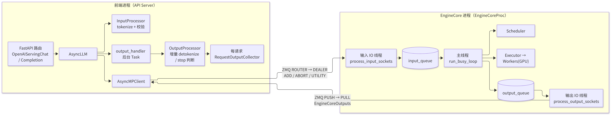
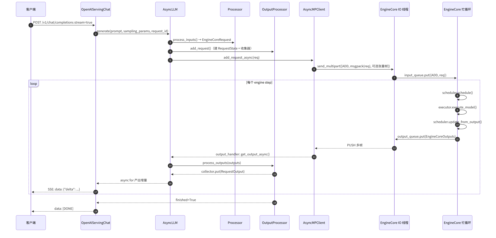

# B1 · Engine 与流式执行

> **版本**：vLLM 0.30.x（V1 引擎）｜**模块**：B-运行时内核｜**对应原课**：第 2 课
> **导航**：上一课：[A1-环境搭建] → **本课 B1** → 下一课：[B2-Worker与Executor]
> **练习**：`exercises/B1_zmq_patterns`｜**源码标注约定**：文中路径与符号已对照 vLLM v0.30.0 tag 的源码核实；如需自行复核，可在执行 `git checkout v0.30.0` 后以 `rg` 检索。

## 0. 先修要求与学习目标

先修要求：A1（能够成功运行 `LLM.generate` 与 `vllm serve`）；Python `asyncio`（协程、`asyncio.Queue`、后台 Task）；了解 Python 中"进程"与"线程"的区别（GIL）。

完成本课学习后，学习者应能够：

1. 绘制 V1 的"前端进程 ↔ EngineCore 进程"结构图，并以定量数据说明进程拆分带来的收益；
2. 按方法逐一陈述一个流式请求从 HTTP 进入、直至第一个词元（token）以 SSE 形式返回的完整调用链；
3. 阐述 ZMQ 在 vLLM 中的两条通道（输入方向 ROUTER/DEALER、输出方向 PUSH/PULL）、多帧消息与零拷贝张量帧；
4. 区分 `InprocClient` / `SyncMPClient` / `AsyncMPClient` / DP 客户端，并明确调试时应切换至哪一种；
5. 识别"客户端断开后未执行 abort""output_handler 被阻塞"等典型线上故障。

---

## 1. 动机：引擎拆分为两个进程的原因

一次解码（Decode）步在 GPU 上的耗时可能仅为 10～30 ms。在这十余毫秒内，CPU 侧需要完成多项工作：HTTP 解析、chat template 渲染与分词（tokenize）、对上百个请求执行增量反分词（detokenize）、检查停止字符串（stop string）、组装 JSON 并写出 SSE。在 V0 中，这些逻辑与调度、模型执行运行于同一个 Python 进程内，受 GIL 约束只能串行执行，因此 GPU 会出现"等待 CPU"的空闲间隙（bubble）。

**定量示例**：设 batch=256 的 Decode 步 GPU 耗时为 15 ms；前端为 256 个请求执行增量 detokenize 并组装输出约需 4 ms，调度与输入准备约需 3 ms。单进程串行执行时每步耗时 22 ms，GPU 利用率为 15/22≈68%。将前端工作移至另一个进程后，EngineCore 每步仅需 3 ms CPU + 15 ms GPU = 18 ms（若再启用异步调度（async scheduling），调度可与 GPU 计算重叠，每步耗时趋近 15 ms），吞吐量提升约 22%～45%。这是 V1 进程拆分最直接的收益。

V1 的分工原则如下：

- **前端进程（API Server / AsyncLLM 所在进程）**：负责网络 IO、输入预处理（tokenize、多模态预处理、参数校验）与输出后处理（detokenize、stop string 判定、logprobs 组装）。
- **EngineCore 进程**：仅运行一个忙循环（busy loop）——获取新请求 → 调度 → 驱动 Executor 执行模型 → 更新请求状态 → 推送结果。该进程不处理字符串，仅处理 token id。

## 2. 架构图：进程、线程与套接字



<p align="center"><em>图1：V1 进程/线程/套接字架构：前端进程与 EngineCore 忙循环</em></p>

要点如下：

- EngineCore 进程内部进一步划分为**三个线程**：输入 IO 线程、主忙循环线程与输出 IO 线程。msgpack 的解码/编码与 socket 收发均在 IO 线程中完成；由于 ZMQ 与 msgspec 的底层操作会释放 GIL，主循环基本不受 IO 拖累。
- 输入方向采用 **ROUTER（前端）/ DEALER（引擎）**：ROUTER 能够按 identity 将消息路由至指定引擎，这在数据并行（DP）多引擎场景下是必需的（见 E1）。输出方向采用 **PUSH/PULL**：多个引擎可将结果推送至同一个前端 PULL socket。
- 套接字地址通常为 `ipc://` 临时文件（同一主机）或 `tcp://`（跨主机 DP/headless 模式）。

## 3. 时序图：一个流式请求的完整生命周期



<p align="center"><em>图2：一个流式请求从提交到逐 token 返回的完整生命周期</em></p>

## 4. 源码分析：按调用顺序（V1，0.30.x）

以下按"请求进入 → 引擎处理 → 结果返回"三个阶段列出相关模块、类与方法。

### 4.1 前端：请求进入

1. `vllm/entrypoints/launchers/api_server/entry.py`：`build_async_engine_client()` 创建 `AsyncLLM`（`AsyncLLM.from_vllm_config`；原 `vllm/entrypoints/openai/api_server.py` 在 v0.30.0 中仅为带弃用警告的转发模块）；路由 `/v1/chat/completions` 定义于 `vllm/entrypoints/openai/chat_completion/api_router.py`，交由 `OpenAIServingChat.create_chat_completion()`（`vllm/entrypoints/openai/chat_completion/serving.py`）处理。
2. `OpenAIServingChat` 渲染 chat template 并执行 tokenize，随后调用 `engine_client.generate(...)` 获得一个异步生成器；`chat_completion_stream_generator()` 遍历该生成器并组装 SSE。
3. `vllm/v1/engine/async_llm.py`：`AsyncLLM.generate()` → `AsyncLLM.add_request()`：
   - `self.input_processor.process_inputs(...)`（`vllm/v1/engine/input_processor.py` 中的 `InputProcessor`）将 prompt、`SamplingParams` 与多模态输入规整为 `EngineCoreRequest`（定义于 `vllm/v1/engine/__init__.py`，类型为 `msgspec.Struct`，字段包括 `request_id`、`prompt_token_ids`、`sampling_params`、`arrival_time`、`mm_features` 等）；
   - `self.output_processor.add_request(request, prompt, parent_req, index, queue)`：为该请求创建 `RequestState`，其中挂载一个 `RequestOutputCollector`；
   - `await self.engine_core.add_request_async(request)`。
   - 当 `n>1` 时，请求将拆分为多个子请求（`ParentRequest`），并在 OutputProcessor 中重新合并。
4. `vllm/v1/engine/core_client.py`：`AsyncMPClient.add_request_async()` → `_send_input(EngineCoreRequestType.ADD, request)` → `MsgpackEncoder.encode()` → `input_socket.send_multipart(...)`。

### 4.2 EngineCore：忙循环

5. `vllm/v1/engine/core.py`：`EngineCoreProc.run_engine_core()` 为子进程入口，其构造 `EngineCoreProc` 后调用 `run_busy_loop()`。
6. 输入 IO 线程 `process_input_sockets()`：执行 `MsgpackDecoder(EngineCoreRequest).decode(frames)`，随后执行 `input_queue.put_nowait((request_type, request))`。
7. `run_busy_loop()` 的每一轮：
   - `_process_input_queue()`：若当前不存在任何未完成请求，则阻塞等待 `input_queue.get()`；否则以非阻塞方式取空队列，并交由 `_handle_client_request()` → `self.add_request()` → `Request.from_engine_core_request()` → `self.scheduler.add_request(req)` 处理；若为 ABORT 请求，则执行 `scheduler.finish_requests(ids, FINISHED_ABORTED)`。
   - `_process_engine_step()` → `self.step_fn()`，即 `step()`；当流水线并行度 PP>1 或启用异步调度时，该函数为 `step_with_batch_queue()`（多个批次同时在途，见 E2/F4）。
8. `EngineCore.step()`：`scheduler_output = self.scheduler.schedule()` → `future = self.model_executor.execute_model(scheduler_output, non_block=True)` → `grammar_output = self.scheduler.get_grammar_bitmask(scheduler_output)` → `model_output = future.result()`；若其为 `None`（即前向计算与采样已拆分为两次调用），则再执行 `model_output = self.model_executor.sample_tokens(grammar_output)` → `engine_core_outputs = self.scheduler.update_from_output(scheduler_output, model_output)`，返回按 `client_index` 分组的 `EngineCoreOutputs`。
9. 结果放入 `output_queue`；输出 IO 线程 `process_output_sockets()` 对其编码，并通过 `send_multipart` 发送至 PUSH socket。

### 4.3 前端：结果返回

10. 由 `AsyncLLM._run_output_handler()` 启动的后台 Task 循环执行：`outputs = await engine_core.get_output_async()` → 按 `VLLM_V1_OUTPUT_PROC_CHUNK_SIZE`（默认值 128）分块调用 `output_processor.process_outputs(chunk)`，各块之间执行 `await asyncio.sleep(0)` 以让出事件循环，从而避免一次处理数千个请求导致 HTTP 侧响应停滞；随后将 `reqs_to_abort`（如命中 stop string 的请求）发回引擎。
11. `vllm/v1/engine/output_processor.py`：对每个 `EngineCoreOutput` 依次执行 `req_state.detokenizer.update(new_token_ids, stop_terminated)`（`detokenizer.py`；fast tokenizer 采用 `FastIncrementalDetokenizer`，其基于 `tokenizers` 的 `DecodeStream`）→ 检查 stop string → `make_request_output()` → `collector.put()`。
12. `AsyncLLM.generate()` 中执行 `out = q.get_nowait() or await q.get()` 并 `yield out`；当 `finished=True` 时退出。

**关键设计**：当消费者来不及取走输出时，`RequestOutputCollector.put()` 会将新的增量**合并**至已有输出（DELTA 模式下拼接 token），而不是无限累积。因此，慢速客户端不会导致前端内存急剧增长，仅表现为单次获得更多 token。

## 5. ZMQ 与序列化：消息边界与零拷贝

ZMQ 采用"消息"语义而非"字节流"语义：一次 `send_multipart([f0, f1, f2])` 发送的内容，对端通过一次 `recv_multipart()` 即可获得完整的三帧，不存在 TCP 粘包问题。然而，凡是在字节流（TCP 原生 socket、管道、文件）上自行传输消息，都必须自行定义消息边界，最常用的方式是**长度前缀**，这正是本课练习所要实现的内容。

vLLM 的多帧编码（`vllm/v1/serial_utils.py`）：

- `MsgpackEncoder.encode(obj)` 返回 `list[bytes | memoryview]`：第 0 帧为 msgpack 主体；遇到 `torch.Tensor` / `np.ndarray` 时，小于阈值 `VLLM_MSGPACK_ZERO_COPY_THRESHOLD`（默认值 256 B）者直接内联，大于阈值者将其底层 buffer 作为**额外帧**追加，主体中仅记录 `(dtype, shape, 帧索引)`。
- 发送端以 `copy=False` 发送大帧，从而避免复制数 MB 的图像特征；接收端 `MsgpackDecoder` 直接利用帧 buffer 通过 `torch.frombuffer` 重建张量。

**数值示例：长度前缀的上限**

| 前缀宽度 | 最大 payload | 适用情形 |
|---|---|---|
| 2 字节（`>H`） | 65 535 B ≈ 64 KiB | 无法容纳一张 336×336 RGB 图像（338 688 B） |
| 4 字节（`>I`） | 4 294 967 295 B ≈ 4 GiB | 本课练习采用；足以覆盖单条请求 |
| 8 字节（`>Q`） | 16 EiB | 一般无此必要 |

以一个 `EngineCoreRequest`（prompt 长度为 2 000 token）为例：`prompt_token_ids` 作为 int 列表进行 msgpack 编码，每个 token id 在小于 65536 时占 3 字节，否则占 5 字节，合计约 2 000×3≈6 KB，加上采样参数约为 7 KB；而一张 1024×1024 图像经预处理后的 `pixel_values`（bf16，3×1024×1024）大小为 6 MB，必须采用零拷贝帧，否则每次复制需耗时 1～2 ms。

**数值示例：输出消息量**。在 batch=256 的一个 Decode 步中，每个请求产生 1 个新 token，`EngineCoreOutputs` 中每个 `EngineCoreOutput` 约为 40～60 字节，合计约 13 KB；按每步 15 ms 计算，数据率约为 0.9 MB/s。由此可见，IPC 带宽并非瓶颈，瓶颈在于 Python 对象构造与 detokenize。这也说明了 vLLM 采用 `msgspec.Struct`（array_like 编码）而非 pickle 的原因。

## 6. 四种 EngineCoreClient

`EngineCoreClient.make_client(multiprocess_mode, asyncio_mode, vllm_config, executor_class, log_stats)` 依据两个开关选择具体实现：

| multiprocess | asyncio | 实现类 | 使用者 |
|---|---|---|---|
| False | False | `InprocClient` | `VLLM_ENABLE_V1_MULTIPROCESSING=0` 时的 `LLM`/`LLMEngine` |
| True | False | `SyncMPClient` | 默认的离线 `LLM` |
| True | True | `AsyncMPClient` | `AsyncLLM`（在线服务） |
| True | True + DP | `DPAsyncMPClient` / `DPLBAsyncMPClient` | 数据并行（E1） |

`InprocClient` 直接在当前进程中持有一个 `EngineCore` 对象，其 `get_output()` 即同步调用 `engine_core.step()`。由此可在 IDE 中对 `Scheduler.schedule()` 设置断点，这是阅读源码时最重要的调试手段（需注意，该方式仅影响前端与 EngineCore 的拆分；当 TP>1 时，Worker 仍为独立进程）。

同步前端 `LLMEngine`（`vllm/v1/engine/llm_engine.py`）采用拉取模式：`add_request()` 加循环调用 `step()`；`LLM.generate()` 内部的 `_run_engine()` 即执行该循环，直至所有请求完成。

## 6.5 设计取舍：不采用"多线程 + pickle"的原因

一个常见的疑问是：既然问题在于 CPU 工作阻塞了 GPU，为何不在同一进程内使用多线程。原因有三。第一，Python 的 GIL 使纯 Python 实现的 detokenize、停止判定与对象构造无法与调度逻辑真正并行，多线程只能缓解 IO 等待，无法缓解 CPU 计算负载。第二，进程边界天然具有故障隔离作用：前端因某个格式异常的请求抛出异常时，不会导致持有 GPU 显存与 CUDA 上下文的引擎进程一同崩溃；反之，引擎崩溃时前端仍可向客户端返回明确的错误信息。第三，进程边界使"前端水平扩展"成为可能：多个 API Server 进程可共享同一组引擎。

就序列化而言，pickle 的缺陷在于速度较慢且不安全（反序列化可执行任意代码，在跨主机 DP 场景下风险更高）。msgspec 的 msgpack 编码对 `Struct` 采用"按字段顺序排列的数组"形式，不重复写入字段名，编码速度通常为 pickle 的数倍，且仅允许解码为预先声明的类型。其代价是新增字段时必须同步更新两端的定义，因此升级 vLLM 时前端与引擎必须为同一版本，混用版本将导致难以诊断的解码错误。

## 7. 中止（abort）与背压

- 客户端断开：FastAPI 检测到连接关闭时取消生成器，`AsyncLLM.generate()` 的 `except asyncio.CancelledError` 分支调用 `self.abort(request_id)` → `output_processor.abort_requests()` + `engine_core.abort_requests_async()` → EngineCore 中执行 `scheduler.finish_requests(..., FINISHED_ABORTED)` → `kv_cache_manager.free()` 释放 KV 块。
- stop string 在**前端**判定（EngineCore 不感知字符串），因此前端判定停止后还需回发 abort；在这一往返期间，引擎可能多执行 1～2 步，所产生的 token 将被丢弃，这属于正常现象。
- 背压：引擎侧不存在显式背压机制，而是依靠调度器的 `max_num_seqs` 与键值缓存（KV Cache）容量将超出的请求保留在 waiting 队列中；前端侧则依靠 collector 合并增量。

## 7.5 TTFT 分解：请求耗时的构成

首词元时延（TTFT）是在线服务中最受关注的指标。基于上述调用链，可将其分解为若干可度量的阶段。以 8B 模型、单卡 H100、prompt 长度 2 000 token、系统中已有 64 个 Decode 请求为例（以下数值为量级估计，用于训练耗时分解的分析方法）：

| 阶段 | 发生位置 | 估计耗时 | 说明 |
|---|---|---|---|
| HTTP 解析 + chat template + tokenize | 前端进程 | 1～3 ms | prompt 较长或模板复杂时更高；fast tokenizer 约为每千 token 0.5 ms |
| msgpack 编码 + IPC 发送 + 解码 | 前端 → IO 线程 | 0.1～0.3 ms | 无大张量时可忽略 |
| 在 waiting 队列中排队 | EngineCore | 0～数百 ms | 取决于当前 step 的结束时间、KV 容量是否充足、`max_num_seqs` 是否已满 |
| 预填充（Prefill）计算 | GPU | 约 40～60 ms | 2 000 个 token 与 64 个 Decode token 在同一步中计算（chunked prefill 混合批处理） |
| 采样 + `update_from_output` + 推送 | EngineCore | 0.5～1 ms | |
| detokenize + SSE 写出 | 前端进程 | 0.1～0.5 ms | |

由上表可知，**可控的主要耗时在于"排队"与"Prefill 计算"**。若测得 TTFT 较高而 GPU 利用率较低，应优先排查前端（tokenize 缓慢、事件循环被阻塞）；若 GPU 负载较高且 waiting 队列较长，则属于容量问题，应参照 B3 调整 `max_num_batched_tokens`，或参照 E1 增加 DP 副本。

此外需注意分块预填充（chunked prefill）的影响：若 `max_num_batched_tokens=2048`，且 64 个 Decode 请求已占用 64 个 token 预算，则该条 2 000 token 的 prompt 在本步仅能计算 1 984 个 token，其余 16 个需等待下一步，从而使 TTFT 增加一个完整 step（约 15～25 ms）。此类"仅差少量 token 即可一步完成"的现象在压力测试中较为常见，其成因是调度器的预算规则，而非通信或前端问题。

## 7.6 实践观测：调用链的验证

建议按以下三个步骤亲自验证本课内容，而非仅阅读源码：

1. **单进程断点调试**：执行 `VLLM_ENABLE_V1_MULTIPROCESSING=0 python offline.py`，在 `EngineCore.step`、`Scheduler.schedule`、`OutputProcessor.process_outputs` 三处设置断点，观察同一 `request_id` 依次经过上述位置，从而确认"引擎仅处理 token id，前端才处理文本"。
2. **多进程线程观测**：正常启动 `vllm serve` 后，使用 `py-spy dump --pid <EngineCore 进程 pid>` 查看线程栈，预期可观察到主线程停留在 `run_busy_loop` / `step`，另外两个线程分别停留在 `process_input_sockets` 与 `process_output_sockets` 的 socket 调用上。在前端进程中则可观察到 uvicorn 事件循环与 `output_handler`。
3. **压测中判断前端是否构成瓶颈**：使用 `vllm bench serve` 施加高并发负载，同时对前端进程执行 `py-spy top`；若 `process_outputs` 与 `detokenizer` 的 CPU 占用接近 100%，则表明单个 API Server 已饱和。此时可使用 `--api-server-count N` 启动多个前端进程（它们共享同一组 EngineCore，并通过 DP 协调器进行路由，见 E1）。这是 V1 拆分架构的另一项优势：前端可水平扩展，而无需复制 GPU 引擎。

完成以上三步后，学习者应能回答一个常见的面试问题："vLLM 流式输出时，第 N 个 token 从 GPU 计算得出到客户端接收，中间经历了几次进程/线程切换？"答案为：GPU → EngineCore 主线程（`update_from_output`）→ 输出 IO 线程（编码、PUSH）→ 前端进程 PULL（事件循环中的 `output_handler` 协程）→ 该请求的生成器协程 → HTTP 写出。共计一次跨进程交接、两次跨线程/协程交接。

## 8. 常见问题与故障模式

1. **在 output_handler 路径中执行耗时操作**：若在自定义 logits processor 或输出后处理中执行同步网络调用，将阻塞事件循环，导致所有流式请求同时停滞，表现为 ITL 出现周期性尖峰。
2. **断开连接后未执行 abort**：自行封装的代理层吞掉了断开事件，引擎持续为"幽灵请求"生成输出，KV 使用率较高但无人接收结果。排查方法：比较 `vllm:num_requests_running` 与网关在途连接数是否一致。
3. **误认为 `VLLM_ENABLE_V1_MULTIPROCESSING=0` 可在单进程中调试 TP**：该开关仅合并前端与 EngineCore；当 TP>1 时 Worker 仍为多进程。
4. **EngineCore 子进程崩溃**：前端报告 `EngineDeadError`，而真正的调用栈位于子进程日志中（检索 `EngineCore encountered a fatal error`）；不应仅查看前端调用栈。
5. **ipc 路径或端口冲突**：当容器内多个实例共享 `/tmp`，或 DP 的 `--data-parallel-rpc-port` 发生冲突时，将出现握手超时。
6. **大张量未采用零拷贝**：自定义多模态处理器将特征转换为 list 后再传输，序列化耗时由微秒级上升至数十毫秒。
7. **误将流式输出理解为"引擎每步推送文本"**：文本拼接与 UTF-8 不完整字符处理均在前端 detokenizer 中完成；当一个多字节字符被拆分至两个 token 时，前一步可能输出空 delta，这属于预期行为。

## 9. 实践练习

- 目录：`exercises/B1_zmq_patterns`（仓库 https://github.com/Wedsonlin/vllm_code ；PR #1 合并之前请使用分支 `cursor/vllm-course-exercises-75c8`）
- 任务（使用 `queue.Queue` 进行仿真，无需安装 pyzmq）：
  1. 实现 `frame_message(payload: bytes) -> bytes`：添加 4 字节大端序长度前缀（`struct.pack(">I", len(payload))`）；
  2. 实现 `unframe_message(framed: bytes) -> bytes`：校验长度一致后还原 payload，长度不一致时应抛出错误；
  3. 实现 `ReqRepBus.request(payload, handler)`：客户端发送帧，服务端通过 `serve_once` 解帧 → 调用 handler → 回送帧，往返结果应保持一致。
- 运行方式（在仓库根目录下执行）：

```bash
python -m pytest exercises/B1_zmq_patterns -q
```

- 验收标准：上述测试全部通过。
- 进阶任务：参照 `MsgpackEncoder`，将一个由"主体 + 若干大 buffer"构成的对象编码为多帧 `list[bytes]`，并编写测试验证 buffer 未被复制（比较 `memoryview` 的 `obj`）。

## 10. 自测题

- [ ] 能否绘制 EngineCore 进程的三个线程，并说明将 msgpack 编解码置于 IO 线程的原因
- [ ] 能否按顺序陈述 `generate → add_request → process_inputs → add_request_async → run_busy_loop → step → process_outputs → collector` 这一调用链
- [ ] 能否解释 stop string 在前端判定的原因，以及判定停止后多执行的 1～2 步所产生 token 的去向

## 11. 延伸阅读

- 源码：`vllm/v1/engine/{async_llm,core,core_client,output_processor,detokenizer}.py`、`vllm/v1/serial_utils.py`
- ZMQ Guide 第 1～3 章（REQ/REP、PUSH/PULL、ROUTER/DEALER）
- vLLM 官方博客：V1 架构介绍（2025）

---

**课程导航**　上一课：[A1 · 环境搭建与离线/在线推理](https://qcngm3vce6yt.feishu.cn/docx/GwNvdrUqpoqTzKxxtfec5HRAnRd)｜下一课：[B2 · Worker 与 Executor](https://qcngm3vce6yt.feishu.cn/docx/VnbqdbxnnojzIQxyLJCc0x5bnI2)｜[返回索引](https://qcngm3vce6yt.feishu.cn/docx/KUn5dKSejoQSAJxaf7YcvNVDnCd)

相关章节：
- [E1 · 数据并行 DP](https://qcngm3vce6yt.feishu.cn/docx/WmsNdoxVDoVE0ix9DchclYB8nYe)——见本课「2. 架构图：进程、线程与套接字」：“这在数据并行（DP）多引擎场景下是必需的（见 E1）。”
- [E2 · 张量并行 TP 与流水并行 PP](https://qcngm3vce6yt.feishu.cn/docx/SORgdnCh8ojUyyxzam7cXu7AnMW)——见本课「4.2 EngineCore：忙循环」：“（多个批次同时在途，见 E2/F4）。”
- [B3 · 调度器 Scheduler](https://qcngm3vce6yt.feishu.cn/docx/PgNQdFEp2oajjSxApwKcSUIvnTb)——见本课「7.5 TTFT 分解：请求耗时的构成」：“则属于容量问题，应参照 B3 调整 max_num_batched_tokens”
