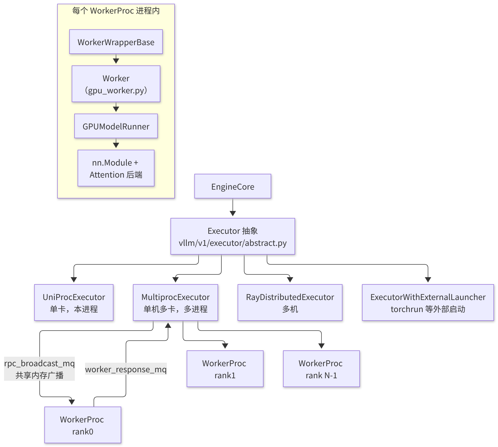
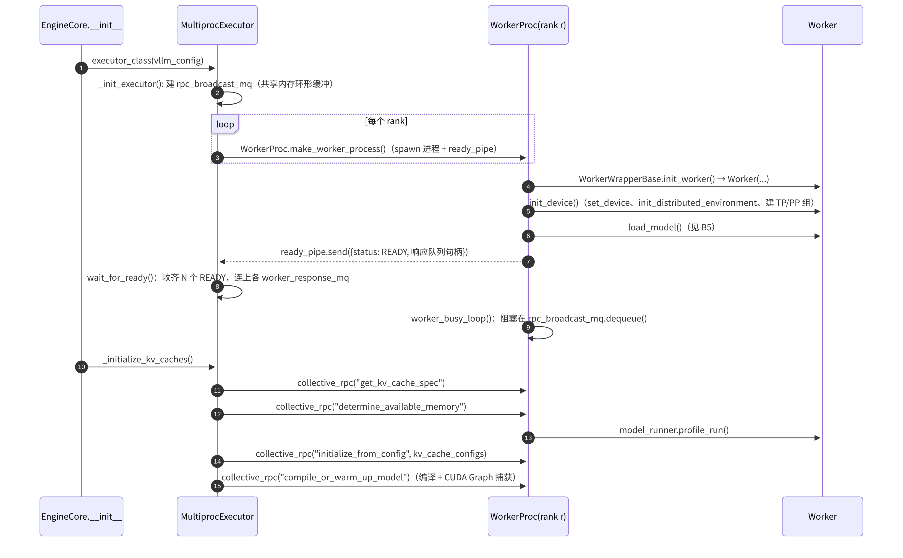
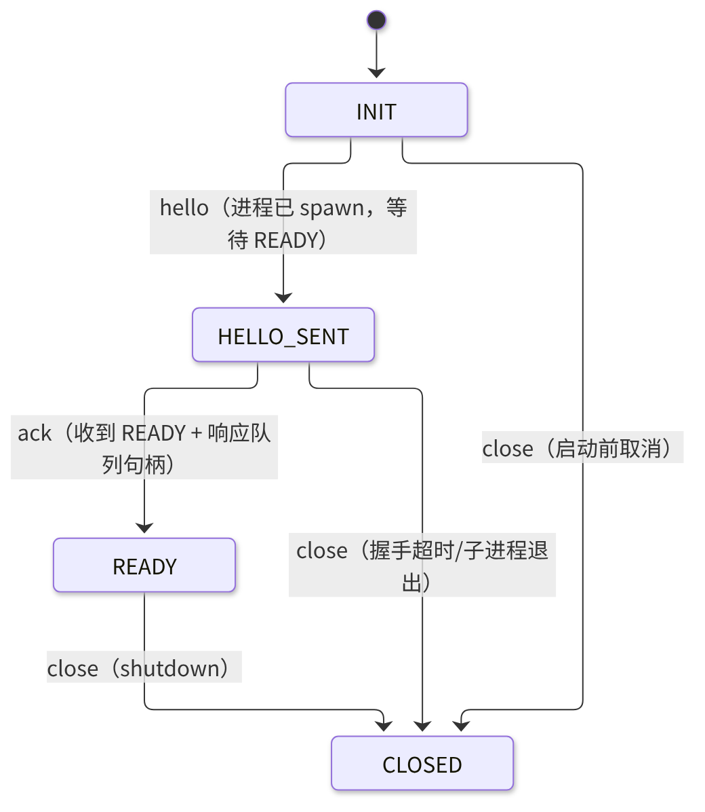

# B2 · Worker 与 Executor

> **版本**：vLLM 0.30.x（V1 引擎）｜**模块**：B-运行时内核｜**对应原课**：第 3 课
> **导航**：上一课：[B1-Engine与流式执行] → **本课 B2** → 下一课：[B3-调度器]
> **练习**：`exercises/B2_executor_handshake_sim`｜**源码标注**：文中涉及的源码路径、符号与参数已对照 vLLM v0.30.0 tag 的源码核实。

## 0. 先修要求与学习目标

先修要求：B1（EngineCore 忙循环）；`multiprocessing` 中 spawn 与 fork 的区别；NCCL / `torch.distributed` 中 rank 与 world_size 的概念。

完成本课学习后，学习者应能够：

1. 阐明 Executor 的职责边界：它是 EngineCore 与"N 个 GPU Worker"之间唯一的桥梁；
2. 按顺序陈述 `MultiprocExecutor` 启动 Worker 的握手流程，以及失败时流程停滞于哪一步；
3. 说明 `collective_rpc` 与共享内存广播队列（`MessageQueue`）相较于"每个 Worker 使用一个 socket"更快的原因；
4. 手工计算 `determine_available_memory` 给出的键值缓存（KV Cache）预算，并解释启动时需执行一次 profile run 的原因；
5. 完成练习：以状态机仿真 Executor ↔ Worker 握手过程，并理解拒绝非法状态转移的意义。

---

## 1. 动机：Executor 抽象层的必要性

EngineCore 仅关心"提交一个 `SchedulerOutput`，取回一个 `ModelRunnerOutput`"。然而底层的执行形态差异显著：单卡在本进程中执行；单机 8 卡张量并行（TP）需要 8 个进程；多机需要 Ray 或外部启动器；流水线并行（PP）需要多个批次同时在途。若由调度器（Scheduler）直接处理这些差异，代码复杂度将迅速失控。因此，V1 引入 `Executor` 抽象，对上层仅暴露以下方法：

- `execute_model(scheduler_output)`：执行一步；
- `collective_rpc(method, args, kwargs, unique_reply_rank)`：在所有 Worker 上调用同名方法；
- `determine_available_memory()` / `get_kv_cache_specs()` / `initialize_from_config()`：KV 初始化的三个方法；
- `check_health()`、`shutdown()`、`max_concurrent_batches`（PP 场景下大于 1）。


Executor 可被视为一个"远程过程调用的扇出器"：上层仅调用一次，由它负责将调用复制到每个 Worker，并将多个返回值汇聚为一个。正因为接口如此精简，后续分布式课程（E1～E4）中的各种并行形态才能在不修改调度器的前提下接入——调度器所见始终是"一个逻辑上的大 GPU"。

## 2. 架构图：Executor 家族与 Worker 内部结构



<p align="center"><em>图1：Executor 家族（uni/mp/ray/external_launcher）与 Worker 内部结构</em></p>

`--distributed-executor-backend` 决定所选用的实现：`uni`、`mp`、`ray`、`external_launcher`。默认规则为：world_size=1 时使用 `uni`；单机多卡时使用 `mp`；Ray 已初始化或跨节点部署时使用 `ray`。选择逻辑位于 `Executor.get_class(vllm_config)`。

## 3. 启动握手时序



<p align="center"><em>图2：Executor 与 Worker 的启动握手时序（进程级就绪与功能级就绪）</em></p>

需注意，握手分为两个阶段：**进程级就绪**（READY 消息经 pipe 传递，内容包括 Worker 的响应队列句柄）与**功能级就绪**（KV 初始化完成、CUDA Graph 捕获完成）。仅当两个阶段均完成后，EngineCore 才开始执行 `run_busy_loop`，API Server 才开始监听端口。这解释了大模型执行 `vllm serve` 启动需要数分钟的原因：权重加载、profile、编译与图捕获均在此阶段完成。

## 4. 源码分析（按调用顺序）

1. `vllm/v1/engine/core.py`：`EngineCore.__init__` → `self.model_executor = executor_class(vllm_config)` → `self._initialize_kv_caches(vllm_config)` → 根据 `num_gpu_blocks` 构造 `Scheduler`。
2. `vllm/v1/executor/abstract.py`：`Executor.get_class()`；`Executor.__init__` 调用 `_init_executor()`；单进程执行器 `UniProcExecutor` 定义于同目录的 `uniproc_executor.py`。
3. `vllm/v1/executor/multiproc_executor.py`：
   - `MultiprocExecutor._init_executor()`：校验 `world_size == tp × pp`（× PCP 等），设置 `distributed_init_method`（本机 tcp 端口）；创建 `self.rpc_broadcast_mq = MessageQueue(world_size, local_world_size, max_chunk_bytes=...)`，并将其 `handle` 传递给子进程；循环调用 `WorkerProc.make_worker_process(...)`；执行 `WorkerProc.wait_for_ready(unready_workers)`；启动 `worker_monitor` 线程以监视子进程的意外退出。
   - `WorkerProc.worker_main()`：子进程入口；`WorkerProc(...)` 的构造过程依次执行 `wrapper.init_worker()`、`worker.init_device()`、`worker.load_model()`，随后经 `ready_pipe` 回报 READY，并进入 `worker_busy_loop()`。
   - `worker_busy_loop()`：`method, args, kwargs, output_rank = self.rpc_broadcast_mq.dequeue()` → `func = getattr(self.worker, method)` → `output = func(*args, **kwargs)` → 若 `output_rank is None or self.rank == output_rank`，则执行 `worker_response_mq.enqueue((SUCCESS, output))`；发生异常时返回 `FAILURE` 及 traceback 字符串。
   - `MultiprocExecutor.collective_rpc()`：执行 `rpc_broadcast_mq.enqueue((method, args, kwargs, output_rank))`，随后从响应队列执行 `dequeue(timeout)`。`execute_model()` 将 `unique_reply_rank` 设为 `self.output_rank`（通常为最后一个 PP stage 的 TP rank 0），因此仅有一个 Worker 回传 `ModelRunnerOutput`，从而避免产生 N 份重复结果。
4. `vllm/distributed/device_communicators/shm_broadcast.py`：`MessageQueue`。本机读者通过共享内存环形缓冲区读取数据，写者写入一次、N 个读者各读取一次；跨机读者经由 ZMQ XPUB/SUB 读取。小消息直接存放于共享内存块，超过 `max_chunk_bytes` 的消息经 ZMQ 溢出路径传输。
5. `vllm/v1/worker/gpu_worker.py`：`Worker.init_device()`（`torch.accelerator.set_device_index`、记录初始显存快照、`init_worker_distributed_environment()` → `ensure_model_parallel_initialized(tp, pp)`）、`load_model()`、`determine_available_memory()`、`initialize_from_config()`、`compile_or_warm_up_model()`、`execute_model()`。

## 4.5 Worker 内部的三层分工

阅读源码时，`WorkerWrapperBase`、`Worker`、`GPUModelRunner` 三者的边界常被混淆。本节依据"各自拥有何种资源"对其加以区分：

- **WorkerWrapperBase（`vllm/v1/worker/worker_base.py`）** 仅是一个"延迟构造器"。Executor 启动子进程时尚不知道（也不应在父进程中导入）具体的 Worker 类，因此先传递一个包装器；待子进程中的环境变量与 CUDA 设备设置完成后，再由 `init_worker()` 根据 `parallel_config.worker_cls` 动态导入实际的 Worker。这也是插件机制的扩展点：硬件厂商可替换 Worker 类，而无需修改 Executor。
- **Worker（`gpu_worker.py`）** 拥有"设备与进程级资源"：当前 GPU、分布式通信组、显存快照、睡眠模式（sleep/wake_up，用于在 RLHF 场景中释放显存）以及 profiler 开关。它所回答的问题是"该卡尚可使用多少显存""通信组是否就绪"。
- **GPUModelRunner（`gpu_model_runner.py`）** 拥有"模型及单步推理的全部状态"：模型权重、KV Cache 张量、持久化的 InputBatch、CUDA Graph 与采样器。它所回答的问题是"给定本步的调度结果，如何将输入组装为张量、执行前向计算并采样"。

概括而言：**Executor 管理进程，Worker 管理设备，ModelRunner 管理张量**。B5 与 F4 将深入讨论 ModelRunner；本课仅需了解，Worker 的大部分方法均为"完成少量设备相关准备后，转而调用 ModelRunner"。

## 5. 采用共享内存广播而非逐个发送消息的原因

每一步中，EngineCore 都需将 `SchedulerOutput` 发送给全部 TP Worker。设 TP=8、每步消息大小为 50 KB：

- 方案 A：使用 8 个点对点 socket，需执行 8 次 pickle 与 8 次写入，每次约 60 µs，合计约 0.5 ms/步；
- 方案 B：序列化 1 次并写入共享内存，8 个读者轮询同一块内存，总开销约为 50～80 µs/步。

解码（Decode）步本身耗时 10～20 ms，0.5 ms 的开销意味着 3%～5% 的吞吐量损失；在 batch 较小、步长仅为 5 ms 的低时延场景中，损失接近 10%。这正是 `shm_broadcast` 存在的理由。其代价是读者需要忙轮询（`VLLM_RINGBUFFER_WARNING_INTERVAL` 控制空等告警的间隔），因此空闲时 CPU 占用略高。

## 5.5 单步执行的往返细节与异步化

在一个普通的 Decode 步中，`MultiprocExecutor.execute_model()` 的往返过程可追踪如下：EngineCore 主线程将 `("execute_model", (scheduler_output,), {}, output_rank)` 写入广播队列；8 个 Worker 几乎同时读取同一条消息，各自在本卡上准备输入并执行前向计算；TP 层内部通过 NCCL 或自定义 all-reduce 进行同步；最后仅由 output_rank 对应的 Worker 将采样结果写回其响应队列；EngineCore 读取该结果后进入 `update_from_output`。

此处存在一个容易被忽视的性能因素：在 EngineCore 等待响应期间，CPU 主线程处于空闲状态。V1 在启用异步调度（`--async-scheduling`）后，会使 `execute_model` 以 non-blocking 方式返回一个 Future，EngineCore 可先执行下一步的调度，待需要结果时再行获取，从而将"调度的 CPU 时间"隐藏于"GPU 计算时间"之后。当 PP>1 时，`max_concurrent_batches` 等于 PP 大小，EngineCore 通过 `step_with_batch_queue()` 使多个批次同时处于流水线中，这同样依赖于 Executor 返回 Future 的能力。在 v0.30.0 中，`async_scheduling` 的默认值为 `None`，即在不存在不兼容项时自动开启（可用 `--no-async-scheduling` 关闭）；以下情形将自动关闭（显式开启时则直接报错）：池化（pooling）模型、EAGLE/MTP/draft_model/ngram_gpu/DSpark 以外的投机解码方法（如 CPU 上的 `ngram`）、`disable_padded_drafter_batch=True`、不支持异步调度的分布式执行后端，以及 ROCm 上的 DeepEP 高吞吐 DBO 组合。启用异步调度时，`max_concurrent_batches` 在 PP=1 时为 2；在 PP>1 时，V1 ModelRunner 为 PP 大小，ModelRunner V2 为 PP 大小加 1（`vllm/config/vllm.py:589-599,1407-1487`）。

## 6. 显存预算：determine_available_memory 的手工计算

`Worker.determine_available_memory()` 的核心逻辑（简化版）如下：

```
requested = total_gpu_memory × gpu_memory_utilization
non_kv    = 权重显存 + profile_run 中观测到的激活峰值 + 非 torch 显存（NCCL/cuBLAS workspace 等）
available_kv = requested − non_kv
```

`profile_run()` 使用 `max_num_batched_tokens` 个 dummy token（并考虑多模态编码器的最大输入）执行一次前向计算与采样，通过 `torch.cuda.memory_stats()` 记录峰值，从而得到激活峰值。

**数值示例**：H100 80 GB，Llama-3-8B，bf16，TP=1，`gpu_memory_utilization=0.9`，`max_num_batched_tokens=8192`。

- requested = 80 × 0.9 = 72 GB（按 GiB 近似计算）
- 权重 ≈ 8.03 B × 2 B ≈ 16.1 GB
- 激活峰值：8 192 个 token × 隐藏层维度 4 096 × 若干中间张量；MLP 中间维度为 14 336，`gate_up` 输出为 8192×28672×2 B ≈ 470 MB，加上 logits（仅对需要采样的位置计算）与临时 buffer，合计约 1.5～2.5 GB
- 非 torch 显存（NCCL、cuBLAS workspace、CUDA 上下文）≈ 0.5～1 GB
- available_kv ≈ 72 − 16.1 − 2 − 0.8 ≈ 53 GB

每个词元（token）的 KV 占用 = 2 × 32 层 × 8 个 KV 头 × 128 × 2 B = 128 KiB，因此可容纳约 53×1024×1024/128 ≈ 43 万个 token；当 block_size=16 时，约为 2.7 万个块。启动日志中的 `GPU KV cache size: xxx tokens` 与 `Maximum concurrency for 8192 tokens per request: xx.xx x` 即为上述计算的结果（后者 ≈ 430 000 / 8 192 ≈ 52 倍）。

当 TP=2 时，每卡权重减半（≈8 GB），每卡 KV 头数亦减半（4 个），每个 token 在每卡上的 KV 占用变为 64 KiB；每卡可用 KV 显存 ≈ 61 GB，全系统可容纳的 token 数约为 61×1024×1024/64 ≈ 100 万。这说明"增加显卡不仅增加算力，而且以超线性的方式增加 KV 容量"。

## 6.5 健康检查、故障传播与 Ray 路径

**故障传播**。Worker 端的任何异常均由 `worker_busy_loop` 捕获并以 FAILURE 消息返回，由 Executor 重新抛出；EngineCore 随即进入致命错误处理并通知前端，前端将所有在途请求以错误结束，随后 API Server 退出。若 Worker 进程直接崩溃（例如 CUDA 非法访问导致进程被终止），`worker_monitor` 线程将检测到子进程退出，并同样触发整体关停。V1 的设计原则是"快速失败"：一旦 GPU 状态不再可信，宁可整体退出并由外部系统（Kubernetes 等）重启，也不尝试局部恢复。

**健康检查**。`/health` 接口最终调用 `check_health()`；在 `MultiprocExecutor` 中，该方法主要检查引擎与 Worker 是否仍然存活。它无法发现"NCCL 已挂起但进程仍存活"的情形，因此生产环境需配合请求级超时，以及针对 `vllm:num_requests_running` 长时间不变的告警。

**Ray 路径的差异**。`RayDistributedExecutor` 以 Ray actor 取代子进程，并借助 Ray 的编译图（compiled DAG）将 `execute_model` 调用固化为通道传输；跨机时通过 Ray 的对象传输或 NCCL 通道在 PP stage 之间传递中间张量。其优点是天然支持多机放置（placement group），缺点是增加一层依赖、启动较慢，且排错时需同时查阅 Ray 日志。单机场景应优先使用 `mp`。

## 6.6 设计问答

**问：EngineCore 为何不直接持有 GPUModelRunner？** 答：EngineCore 进程不应持有 CUDA 上下文。若引擎进程自身也占用一张卡，则在 TP 场景下它会与 rank 0 Worker 争用同一张卡的资源，且引擎崩溃将连带丢失显存状态。保持"EngineCore 仅使用 CPU、Worker 独占 GPU"的划分，可使职责与故障域更加清晰（单卡 `uni` 模式例外：为节省一次进程间通信，该模式在本进程中执行）。

**问：KV 预算为何需要所有 rank 共同计算？** 答：各 rank 的可用显存可能不同（某张卡上运行着其他进程，或 PP 不同 stage 的层数不同）。Executor 收集所有 rank 的可用显存后取最小值以确定全局块数，从而保证同一块号在每个 rank 上均有效——调度器仅维护一张逻辑块表，各 rank 必须保持"块号对齐"。

**问：在同一台机器上启动两个 vLLM 实例需注意哪些事项？** 答：除显存比例外，还需避免端口与共享内存命名冲突，并分别通过 `CUDA_VISIBLE_DEVICES` 隔离显卡。当两个实例共享一张卡时，第二个实例在 profile 阶段观察到的空闲显存已被第一个实例占用，因此 `gpu_memory_utilization` 应按"本实例占总显存的比例"重新设置。

## 7. 状态机视角：练习所仿真的对象

从 Executor 的视角，可将一个 Worker 的生命周期抽象如下：



<p align="center"><em>图3：Executor 视角下的 Worker 生命周期状态机</em></p>

非法转移应抛出异常而非被忽略，原因如下：在真实系统中，未就绪的 Worker 若接收到 `execute_model`，将在未初始化的 CUDA 上下文上执行，其结果是段错误或 NCCL 挂起，其排查难度远高于异常。状态机可使错误在最早的位置暴露。

## 8. 常见问题与故障模式

1. **停滞于 `wait_for_ready`**：最常见的原因是某个 rank 在 `init_device` 阶段 NCCL 初始化挂起（网卡选择错误、未设置 `NCCL_SOCKET_IFNAME`、容器缺少 `--ipc=host` 导致共享内存不足）。排查方法：设置 `NCCL_DEBUG=INFO`，确认哪个 rank 未打印初始化完成信息。
2. **`/dev/shm` 过小**：Docker 默认值为 64 MB，而 `MessageQueue` 与 NCCL 均依赖共享内存，表现为 `Bus error`。应使用 `--shm-size=16g` 或 `--ipc=host`。
3. **对 `gpu_memory_utilization` 的理解有误**：该参数表示"本实例可用显存占总显存的比例"，而非"KV 占比"。当同卡上存在其他进程时，若初始空闲显存小于 `total × util`，启动将报错。
4. **profile 低估激活峰值**：自定义模型在 profile 路径与实际路径中执行了不同的分支（例如仅在长序列时分配额外 buffer），导致运行期间发生 OOM。对策：降低 `gpu_memory_utilization`，或使 dummy 输入覆盖最坏情况。
5. **fork 与 CUDA**：在已初始化 CUDA 的进程中 fork 子进程将导致错误。V1 默认对 Worker 使用 spawn（`VLLM_WORKER_MULTIPROC_METHOD`）；自行编写脚本时应注意添加 `if __name__ == "__main__":` 保护。
6. **仅查看 rank 0 日志**：其余 rank 的异常或以字符串形式经响应队列返回，或直接导致进程退出并被 `worker_monitor` 捕获；务必检索 `Worker proc VllmWorker-N died unexpectedly`。

## 8.5 排障实践：启动停滞时的排查顺序

启动阶段的问题在线上工单中占比较高。建议依照握手时序"由前至后"进行排查，而非凭经验随意修改参数：

1. **进程是否全部启动**：通过 `nvidia-smi` 确认每张卡上均有一个 vLLM Worker 进程且占用数百 MB 显存（CUDA 上下文）。若缺少一个，说明 spawn 阶段即已失败，应查看该 rank 的第一条报错信息。
2. **分布式初始化是否完成**：启用 `NCCL_DEBUG=INFO`，每个 rank 均应打印通信器初始化信息。若流程停滞于此，通常是网络接口、防火墙或共享内存问题。
3. **权重是否正在加载**：日志会打印加载进度及 `Model loading took xx GiB and yy seconds`。若长时间停滞于加载阶段，应检查存储带宽（以 200 MB/s 从网络盘读取 16 GB 权重需 80 秒以上）或是否存在重复下载。
4. **profile 与 KV 初始化**：日志会打印可用 KV 显存与 token 数。若此处报告"显存不足"，应按第 6 节的方法重新计算，并调整 `gpu_memory_utilization`、`max_num_batched_tokens` 或 `max_model_len`。
5. **编译与图捕获**：日志会打印 torch.compile 耗时与 `Graph capturing finished`。首次编译可能需要一分钟以上；若流程停滞，可先添加 `--enforce-eager` 以验证是否为捕获问题（详见 C2、C3）。

上述顺序与第 3 节的时序图一一对应。掌握该时序图后，排障时即可依据"最后一条正常日志"迅速确定流程停滞于哪一握手阶段。

## 9. 实践练习

- 目录：`exercises/B2_executor_handshake_sim`
- 任务：实现 `Handshake`，其状态转移为 `INIT → HELLO_SENT → READY → CLOSED`，并允许从 INIT / HELLO_SENT 直接 close；任何其他 `(state, event)` 组合均应抛出 `IllegalTransition`；`is_ready` 属性仅在 READY 状态下为真。
- 运行方式：

```bash
python -m pytest exercises/B2_executor_handshake_sim -q
```

- 验收标准：上述测试全部通过。
- 进阶任务：为 `Handshake` 增加 `timeout` 事件（仅在 HELLO_SENT 状态下可用，转移至 CLOSED），并模拟"8 个 Worker 中第 5 个超时"的情形，给出 Executor 清理其余已处于 READY 状态的 Worker 的方式（提示：实际代码在 `shutdown()` 中向所有子进程发送 SIGTERM 并执行 join）。

## 10. 自测题

- [ ] 能否陈述 `uni / mp / ray / external_launcher` 各自的适用场景与选择规则
- [ ] 能否解释 `execute_model` 仅由一个 rank 回传结果的原因，并指出该 rank 是哪一个
- [ ] 能否依据模型配置与 `gpu_memory_utilization` 估算启动日志中的 KV token 数

## 11. 延伸阅读

- 源码：`vllm/v1/executor/`、`vllm/v1/worker/gpu_worker.py`、`vllm/v1/worker/worker_base.py`、`vllm/distributed/device_communicators/shm_broadcast.py`、`vllm/distributed/parallel_state.py`
- PyTorch 文档：`torch.distributed` 的初始化方式；NCCL 环境变量说明

---

**课程导航**　上一课：[B1 · Engine 与流式执行](https://qcngm3vce6yt.feishu.cn/docx/Sg5hdyoxqoE9nZx10DAcrGCknph)｜下一课：[B3 · 调度器 Scheduler](https://qcngm3vce6yt.feishu.cn/docx/PgNQdFEp2oajjSxApwKcSUIvnTb)｜[返回索引](https://qcngm3vce6yt.feishu.cn/docx/KUn5dKSejoQSAJxaf7YcvNVDnCd)

相关章节：
- [E1 · 数据并行 DP](https://qcngm3vce6yt.feishu.cn/docx/WmsNdoxVDoVE0ix9DchclYB8nYe)——见本课「1. 动机：Executor 抽象层的必要性」：“后续分布式课程（E1～E4）中的各种并行形态才能在不修改调度器的前提下接入”
- [E4 · EP 负载均衡 EPLB](https://qcngm3vce6yt.feishu.cn/docx/VNJEdOLkHo0dubxr2xxce4Vbnae)——见本课「1. 动机：Executor 抽象层的必要性」：“后续分布式课程（E1～E4）中的各种并行形态才能在不修改调度器的前提下接入”
- [B5 · ModelRunner 与权重加载](https://qcngm3vce6yt.feishu.cn/docx/FWYldjMhdomAz0xTxOTcBfYpn7e)——见本课「4.5 Worker 内部的三层分工」：“B5 与 F4 将深入讨论 ModelRunner”
