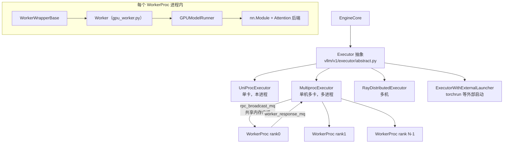
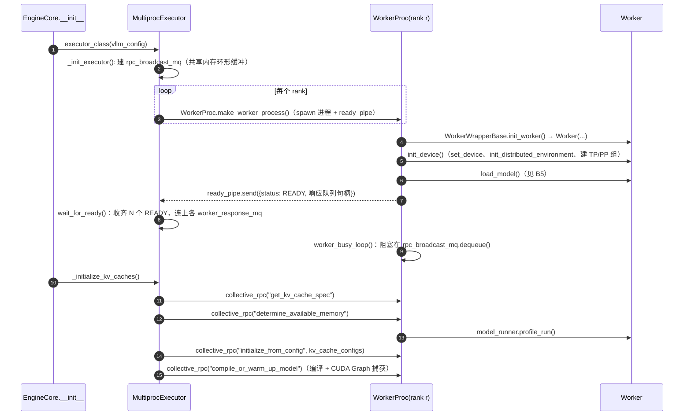
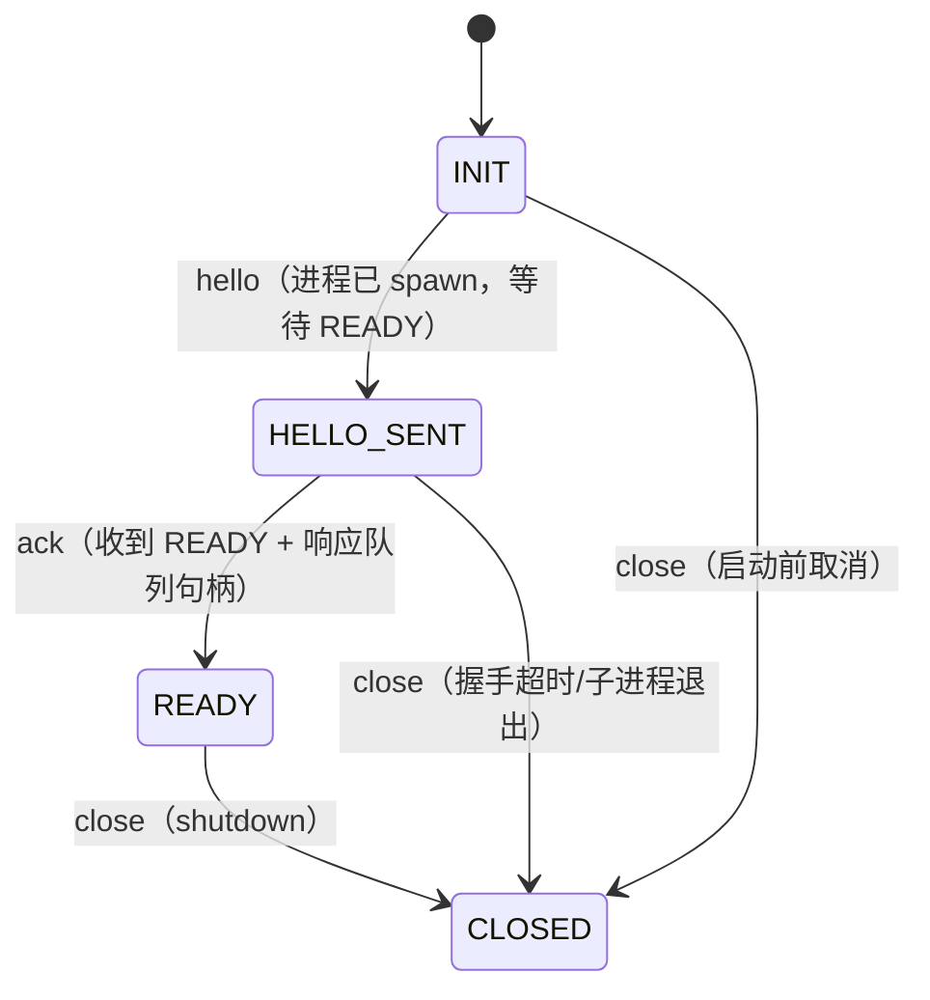

# B2 · Worker 与 Executor（深度版）

> **版本**：vLLM 0.30.x（V1 引擎）｜**模块**：B-运行时内核｜**对应原课**：第 3 课
> **导航**：上一课：[B1-Engine与流式执行] → **本课 B2** → 下一课：[B3-调度器]
> **练习**：`exercises/B2_executor_handshake_sim`｜**源码标注**：标【待核】的路径或符号在 0.30.x 可能已调整，以 tag 源码为准。

## 0. 先修与本课目标

先修：B1（EngineCore 忙循环）；`multiprocessing` 的 spawn/fork 区别；NCCL / `torch.distributed` 的 rank、world_size 概念。

学完本课你应能：

1. 说清 Executor 的职责边界：它是 EngineCore 与"N 个 GPU Worker"之间的唯一桥梁；
2. 按顺序说出 `MultiprocExecutor` 启动 Worker 的握手流程，以及失败时卡在哪一步；
3. 理解 `collective_rpc` + 共享内存广播队列（`MessageQueue`）为什么比"每个 Worker 一个 socket"快；
4. 手算 `determine_available_memory` 给出的 KV 预算，并解释为何启动时要做一次 profile run；
5. 完成练习：用状态机仿真 Executor ↔ Worker 握手，理解非法转移的意义。

---

## 1. 动机：为什么需要 Executor 这层抽象

EngineCore 只关心"我给出一个 `SchedulerOutput`，拿回一个 `ModelRunnerOutput`"。但底下的执行形态千差万别：单卡在本进程里跑；单机 8 卡 TP 需要 8 个进程；多机需要 Ray 或外部启动器；PP 需要多批次在途。如果让调度器直接管理这些差异，代码会迅速失控。因此 V1 引入 `Executor` 抽象，对上只暴露几个方法：

- `execute_model(scheduler_output)`：执行一步；
- `collective_rpc(method, args, kwargs, unique_reply_rank)`：在所有 Worker 上调用同名方法；
- `determine_available_memory()` / `get_kv_cache_specs()` / `initialize_from_config()`：KV 初始化三件套；
- `check_health()`、`shutdown()`、`max_concurrent_batches`（PP 时 >1）。


可以把 Executor 理解为一个"远程过程调用的扇出器"：上层只调用一次，它负责把调用复制到每个 Worker，并把多个返回值收敛成一个。正因为接口这么窄，后面的分布式课（E1～E4）里各种并行形态才能在不改调度器的情况下接入——调度器永远只看到"一个逻辑上的大 GPU"。

## 2. 架构图：Executor 家族与 Worker 内部



`--distributed-executor-backend` 决定选哪一个：`uni`、`mp`、`ray`、`external_launcher`。默认规则：world_size=1 用 `uni`；单机多卡用 `mp`；Ray 已初始化或跨节点时用 `ray`。选择逻辑在 `Executor.get_class(vllm_config)`。

## 3. 启动握手时序



注意握手分两段：**进程级就绪**（READY 走 pipe，内容包括 Worker 的响应队列句柄）和**功能级就绪**（KV 初始化完成、CUDA Graph 捕获完成）。只有两段都完成，EngineCore 才开始 `run_busy_loop`，API Server 才开始监听端口。这就是为什么大模型 `vllm serve` 启动要几分钟：权重加载 + profile + 编译 + 捕获都在这里。

## 4. 源码走读（调用顺序）

1. `vllm/v1/engine/core.py`：`EngineCore.__init__` → `self.model_executor = executor_class(vllm_config)` → `self._initialize_kv_caches(vllm_config)` → 根据 `num_gpu_blocks` 构造 `Scheduler`。
2. `vllm/v1/executor/abstract.py`：`Executor.get_class()`；`Executor.__init__` 调 `_init_executor()`。【待核：0.30.x 可能把 `UniProcExecutor` 移到 `uniproc_executor.py`】
3. `vllm/v1/executor/multiproc_executor.py`：
   - `MultiprocExecutor._init_executor()`：校验 `world_size == tp × pp`（× PCP 等），设置 `distributed_init_method`（本机 tcp 端口）；创建 `self.rpc_broadcast_mq = MessageQueue(world_size, local_world_size, max_chunk_bytes=...)`，取其 `handle` 传给子进程；循环 `WorkerProc.make_worker_process(...)`；`WorkerProc.wait_for_ready(unready_workers)`；启动 `worker_monitor` 线程监视子进程意外退出。
   - `WorkerProc.worker_main()`：子进程入口，`WorkerProc(...)` 构造中依次执行 `wrapper.init_worker()`、`worker.init_device()`、`worker.load_model()`，然后经 `ready_pipe` 回报 READY 并进入 `worker_busy_loop()`。
   - `worker_busy_loop()`：`method, args, kwargs, output_rank = self.rpc_broadcast_mq.dequeue()` → `func = getattr(self.worker, method)` → `output = func(*args, **kwargs)` → 若 `output_rank is None or self.rank == output_rank` 则 `worker_response_mq.enqueue((SUCCESS, output))`；异常时回 `FAILURE` 与 traceback 字符串。
   - `MultiprocExecutor.collective_rpc()`：`rpc_broadcast_mq.enqueue((method, args, kwargs, output_rank))`，然后从响应队列 `dequeue(timeout)`。`execute_model()` 会把 `unique_reply_rank` 设为 `self.output_rank`（通常是最后一个 PP stage 的 TP rank 0），所以只有一个 Worker 回传 `ModelRunnerOutput`，避免 N 份重复结果。
4. `vllm/distributed/device_communicators/shm_broadcast.py`：`MessageQueue`。本机读者通过共享内存环形缓冲读取，写者写一次、N 个读者各读一次；跨机读者走 ZMQ XPUB/SUB。小消息直接放进共享内存块，超过 `max_chunk_bytes` 的走 ZMQ 溢出路径。
5. `vllm/v1/worker/gpu_worker.py`：`Worker.init_device()`（`torch.cuda.set_device`、记录初始显存快照、`init_worker_distributed_environment()` → `ensure_model_parallel_initialized(tp, pp)`）、`load_model()`、`determine_available_memory()`、`initialize_from_config()`、`compile_or_warm_up_model()`、`execute_model()`。

## 4.5 Worker 内部的三层分工

很多同学读源码时分不清 `WorkerWrapperBase`、`Worker`、`GPUModelRunner` 三者的界限，这里用"谁拥有什么"来区分：

- **WorkerWrapperBase（`vllm/v1/worker/worker_base.py`）** 只是一个"延迟构造器"。Executor 在启动子进程时还不知道（也不应该在父进程里导入）具体的 Worker 类，于是先传一个包装器，等到子进程里设置好环境变量、CUDA 设备之后，再由 `init_worker()` 根据 `parallel_config.worker_cls` 动态导入真正的 Worker。这也是插件机制的扩展点：硬件厂商可以替换 Worker 类，而不必修改 Executor。
- **Worker（`gpu_worker.py`）** 拥有"设备与进程级资源"：当前 GPU、分布式通信组、显存快照、睡眠模式（sleep/wake_up，用于 RLHF 场景释放显存）、profiler 开关。它回答的问题是"这张卡还能用多少显存""通信组是否就绪"。
- **GPUModelRunner（`gpu_model_runner.py`）** 拥有"模型与一步推理的全部状态"：模型权重、KV Cache 张量、持久化的 InputBatch、CUDA Graph、采样器。它回答的问题是"给定这一步的调度结果，怎样把输入拼成张量、跑前向、采样"。

一句话记忆：**Executor 管进程，Worker 管设备，ModelRunner 管张量**。B5 与 F4 会深入 ModelRunner，本课只需要知道 Worker 的大部分方法都是"做一点设备相关准备，然后转调 ModelRunner"。

## 5. 为什么用共享内存广播而不是逐个发消息

每一步 EngineCore 都要把 `SchedulerOutput` 发给全部 TP Worker。假设 TP=8、每步消息 50 KB：

- 方案 A：8 个点对点 socket，pickle 8 次、写 8 次，每次 ~60 µs → 约 0.5 ms/步；
- 方案 B：序列化 1 次写入共享内存，8 个读者轮询同一块内存，总开销 ~50～80 µs/步。

decode 步本身 10～20 ms，0.5 ms 意味着 3%～5% 的吞吐损失；在 batch 小、步长只有 5 ms 的低延迟场景，损失接近 10%。这就是 `shm_broadcast` 存在的理由。代价是读者需要忙轮询（`VLLM_RINGBUFFER_WARNING_INTERVAL` 控制空等告警），空闲时 CPU 占用略高。

## 5.5 一步执行的往返细节与异步化

在一个普通 decode step 中，`MultiprocExecutor.execute_model()` 的往返可以这样追踪：EngineCore 主线程把 `("execute_model", (scheduler_output,), {}, output_rank)` 写进广播队列；8 个 Worker 几乎同时读到同一条消息，各自在本卡上准备输入、跑前向；TP 层内部通过 NCCL 或自定义 all-reduce 同步；最后只有 output_rank 那个 Worker 把采样结果写回自己的响应队列；EngineCore 读到后进入 `update_from_output`。

这里有一个容易忽略的性能点：在 EngineCore 等待响应期间，CPU 主线程是空闲的。V1 在开启 async scheduling（`--async-scheduling`）后会让 `execute_model` 以 non-blocking 方式返回一个 Future，EngineCore 可以先去做下一步的调度，等需要结果时再取，从而把"调度 CPU 时间"藏到"GPU 计算时间"后面。PP>1 时 `max_concurrent_batches` 等于 PP 大小，EngineCore 用 `step_with_batch_queue()` 让多个批次同时在流水线上，这也依赖 Executor 返回 Future 的能力。【待核：0.30.x 中 async scheduling 是否默认开启，以及与投机解码、PP 的兼容范围】

## 6. 显存预算：determine_available_memory 手算

`Worker.determine_available_memory()` 的核心逻辑（简化）：

```
requested = total_gpu_memory × gpu_memory_utilization
non_kv    = 权重显存 + profile_run 中观测到的激活峰值 + 非 torch 显存（NCCL/cuBLAS workspace 等）
available_kv = requested − non_kv
```

`profile_run()` 用 `max_num_batched_tokens` 个 dummy token（并考虑多模态编码器的最大输入）跑一次前向与采样，用 `torch.cuda.memory_stats()` 记录峰值，从而得到激活峰值。

**数字例子**：H100 80 GB，Llama-3-8B，bf16，TP=1，`gpu_memory_utilization=0.9`，`max_num_batched_tokens=8192`。

- requested = 80 × 0.9 = 72 GB（GiB 口径近似）
- 权重 ≈ 8.03 B × 2 B ≈ 16.1 GB
- 激活峰值：8 192 token × 隐层 4 096 × 若干中间张量；MLP 中间维 14 336，`gate_up` 输出 8192×28672×2 B ≈ 470 MB，加上 logits（只对需要采样的位置算）与临时 buffer，约 1.5～2.5 GB
- 非 torch 显存（NCCL、cuBLAS workspace、CUDA 上下文）≈ 0.5～1 GB
- available_kv ≈ 72 − 16.1 − 2 − 0.8 ≈ 53 GB

每 token KV = 2 × 32 层 × 8 KV 头 × 128 × 2 B = 128 KiB，因此能放约 53×1024×1024/128 ≈ 43 万 token，block_size=16 时约 2.7 万个块。启动日志里的 `GPU KV cache size: xxx tokens` 与 `Maximum concurrency for 8192 tokens per request: xx.xx x` 就是这个计算的结果（后者 ≈ 430 000 / 8 192 ≈ 52 倍）。

TP=2 时每卡权重减半（≈8 GB）、每卡 KV 头减半（4 个），每 token 每卡 KV 变为 64 KiB；每卡可用 KV ≈ 61 GB，全系统可容纳 token 数约 61×1024×1024/64 ≈ 100 万。这就是"加卡不只是加算力，还线性以上地增加 KV 容量"的原因。

## 6.5 健康检查、故障传播与 Ray 路径

**故障传播**。Worker 端任何异常都会被 `worker_busy_loop` 捕获并以 FAILURE 消息返回，Executor 重新抛出，EngineCore 进入致命错误处理并通知前端，前端把在途请求全部以错误结束，随后 API Server 退出。如果是 Worker 进程直接崩溃（例如 CUDA 非法访问导致进程被杀），`worker_monitor` 线程检测到子进程退出，同样触发整体关停。V1 的设计哲学是"快速失败"：GPU 状态一旦不可信，宁可整体退出由外部（Kubernetes 等）重启，也不尝试局部恢复。

**健康检查**。`/health` 接口最终调用 `check_health()`，在 `MultiprocExecutor` 中主要检查引擎与 Worker 是否仍存活；它不能发现"NCCL 卡住但进程还活着"的情形，生产环境需要配合请求级超时与 `vllm:num_requests_running` 长时间不变的告警。

**Ray 路径的差异**。`RayDistributedExecutor` 用 Ray actor 代替子进程，用 Ray 的编译图（compiled DAG）把 `execute_model` 调用固化为通道传输，跨机时通过 Ray 的对象传输或 NCCL 通道在 PP stage 之间传中间张量。它的优点是天然支持多机放置（placement group），缺点是多一层依赖、启动更慢、排错时要同时看 Ray 日志。单机场景优先用 `mp`。

## 6.6 设计问答

**问：为什么 EngineCore 不直接持有 GPUModelRunner？** 因为 EngineCore 进程不应持有 CUDA 上下文。若引擎进程自己也占一张卡，TP 时它会与 rank 0 Worker 争用同一张卡的资源，并且引擎崩溃会连带丢失显存状态。保持"EngineCore 纯 CPU、Worker 独占 GPU"使职责与故障域都更清晰（单卡 `uni` 模式例外，为了省一次进程间通信而在本进程执行）。

**问：为什么 KV 预算要所有 rank 一起算？** 因为各 rank 的可用显存可能不同（某张卡上有别的进程、或 PP 不同 stage 层数不同）。Executor 收集所有 rank 的可用显存后取最小值来决定全局块数，保证同一个块号在每个 rank 上都有效——调度器只维护一张逻辑块表，各 rank 必须"块号对齐"。

**问：同一台机器起两个 vLLM 实例需要注意什么？** 除了显存比例，还要避免端口与共享内存命名冲突，并分别用 `CUDA_VISIBLE_DEVICES` 隔离卡。两个实例共享一张卡时，第二个实例 profile 时看到的空闲显存已被第一个占用，`gpu_memory_utilization` 要按"本实例占总显存的比例"重新设置。

## 7. 状态机视角：练习在仿真什么

把一个 Worker 从 Executor 视角的生命周期抽象为：



为什么"非法转移要抛异常"而不是忽略？真实系统里，未就绪的 Worker 若收到 `execute_model`，会在未初始化的 CUDA 上下文上执行，结果是段错误或 NCCL 挂死，比抛异常难排查得多。状态机让错误在最早的位置暴露。

## 8. 常见坑 / 故障模式

1. **卡在 `wait_for_ready`**：最常见原因是某个 rank 在 `init_device` 时 NCCL 初始化挂住（网卡选择错误、`NCCL_SOCKET_IFNAME` 未设、容器缺 `--ipc=host` 导致共享内存不足）。排查：`NCCL_DEBUG=INFO`，看哪个 rank 没有打印 init 完成。
2. **`/dev/shm` 太小**：Docker 默认 64 MB，`MessageQueue` 与 NCCL 都依赖共享内存，表现为 `Bus error`。用 `--shm-size=16g` 或 `--ipc=host`。
3. **`gpu_memory_utilization` 理解错误**：它是"本实例可用显存占总显存的比例"，不是"KV 占比"。同卡上还有别的进程时，若初始空闲显存小于 `total × util`，启动报错。
4. **profile 低估激活峰值**：自定义模型在 profile 路径与真实路径走了不同分支（例如只在长序列时分配额外 buffer），运行中 OOM。对策：降低 `gpu_memory_utilization` 或让 dummy 输入覆盖最坏情况。
5. **fork 与 CUDA**：在已初始化 CUDA 的进程里 fork 子进程会出错，V1 默认对 Worker 使用 spawn（`VLLM_WORKER_MULTIPROC_METHOD`），自己写脚本时注意 `if __name__ == "__main__":` 保护。
6. **只看 rank 0 日志**：其余 rank 的异常通过响应队列以字符串返回，或直接导致进程退出被 `worker_monitor` 捕获；务必搜索 `Worker proc VllmWorker-N died unexpectedly`。

## 8.5 排障实战：启动卡住时按什么顺序查

启动阶段的问题占线上工单的很大比例，建议按照握手时序"从前往后"排查，而不是凭感觉改参数：

1. **进程是否都起来了**：`nvidia-smi` 看每张卡上是否都有一个 vLLM Worker 进程且占用了几百 MB（CUDA 上下文）。少一个说明 spawn 阶段就失败了，去看该 rank 的第一条报错。
2. **分布式是否初始化完成**：打开 `NCCL_DEBUG=INFO`，每个 rank 都应打印通信器初始化信息。若停在这里，多半是网络接口、防火墙或共享内存问题。
3. **权重是否在加载**：日志会打印加载进度与 `Model loading took xx GiB and yy seconds`。如果长时间停在加载，检查存储带宽（网络盘读 16 GB 权重在 200 MB/s 下要 80 秒以上）或是否在重复下载。
4. **profile 与 KV 初始化**：日志打印可用 KV 显存与 token 数。若这里报"没有足够显存"，按第 6 节手算，调整 `gpu_memory_utilization`、`max_num_batched_tokens` 或 `max_model_len`。
5. **编译与图捕获**：打印 torch.compile 耗时与 `Graph capturing finished`。首次编译可能需要一分钟以上；若卡住，先加 `--enforce-eager` 验证是否是捕获问题（详见 C2、C3）。

这套顺序与第 3 节时序图一一对应。把时序图记在脑子里，排障时就能根据"最后一条正常日志"立即定位到卡在哪个握手阶段。

## 9. 动手练习

- 目录：`exercises/B2_executor_handshake_sim`
- 任务：实现 `Handshake`：状态 `INIT → HELLO_SENT → READY → CLOSED`，允许从 INIT / HELLO_SENT 直接 close；其他任何 `(state, event)` 组合抛 `IllegalTransition`；`is_ready` 属性仅在 READY 为真。
- 运行：

```bash
python -m pytest exercises/B2_executor_handshake_sim -q
```

- 进阶：为 `Handshake` 增加 `timeout` 事件（仅 HELLO_SENT 可用，转到 CLOSED），并模拟"8 个 Worker 中第 5 个超时"时，Executor 应如何清理其余已 READY 的 Worker（提示：真实代码在 `shutdown()` 中对所有子进程发 SIGTERM 并 join）。

## 10. 自测清单

- [ ] 我能说出 `uni / mp / ray / external_launcher` 各自的适用场景与选择规则
- [ ] 我能解释 `execute_model` 为何只让一个 rank 回传结果，以及这个 rank 是谁
- [ ] 我能根据模型配置与 `gpu_memory_utilization` 估算启动日志里的 KV token 数

## 11. 延伸阅读

- 源码：`vllm/v1/executor/`、`vllm/v1/worker/gpu_worker.py`、`vllm/v1/worker/worker_base.py`、`vllm/distributed/device_communicators/shm_broadcast.py`、`vllm/distributed/parallel_state.py`
- PyTorch 文档：`torch.distributed` 初始化方式；NCCL 环境变量说明
