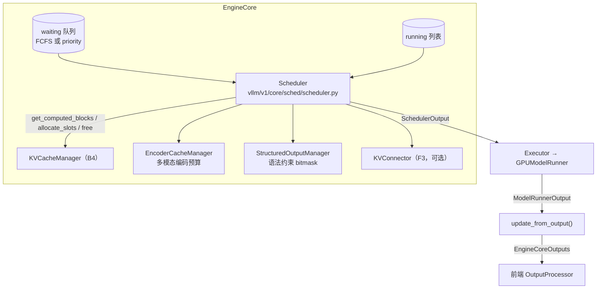
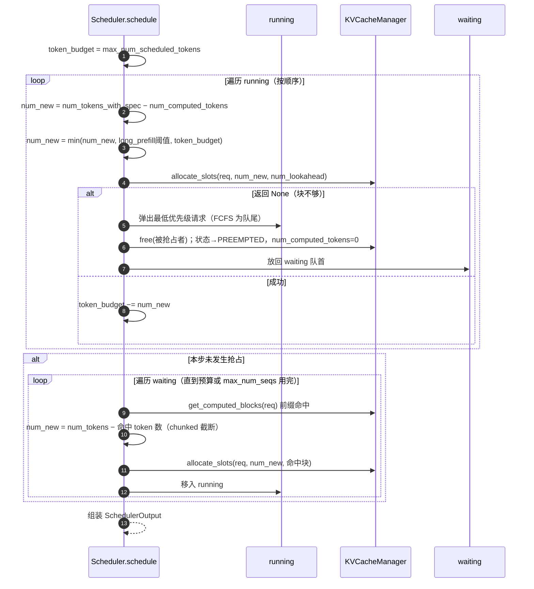

# B3 · 调度器 Scheduler（深度版）

> **版本**：vLLM 0.30.x（V1 引擎）｜**模块**：B-运行时内核｜**对应原课**：第 4 课
> **导航**：上一课：[B2-Worker与Executor] → **本课 B3** → 下一课：[B4-PagedAttention]
> **练习**：`exercises/B3_scheduler_token_budget`｜**源码标注**：标【待核】处以 0.30.x tag 为准。

## 0. 先修与本课目标

先修：B1（EngineCore.step 的三段式）、B2（KV 预算从哪里来）；了解 prefill 与 decode 的计算特征差异。

学完本课你应能：

1. 用一句话说出 V1 调度器的核心抽象：**每个请求只有一个数字 `num_computed_tokens`，调度就是决定这一步让它前进多少 token**；
2. 按代码顺序复述 `Scheduler.schedule()` 的两大循环（running 优先、再 waiting）与抢占逻辑；
3. 手算一步调度中 token 预算如何在 decode、chunked prefill、新请求之间分配；
4. 理解 `SchedulerOutput` 中每个字段被 ModelRunner 怎样消费；
5. 解释调度参数（`max_num_batched_tokens`、`max_num_seqs`、`long_prefill_token_threshold`）对 TTFT 与 ITL 的影响。

---

## 1. 动机：从"两阶段"到"统一 token 预算"

V0 时代调度器区分 prefill 批与 decode 批：一步要么全是 prefill、要么全是 decode。问题很明显——一个 3 万 token 的长 prompt 进来，整个 decode 队列要停下来等它算完，所有正在流式输出的用户都会感到一次长卡顿（ITL 尖刺）。

V1 把这个问题抽象得非常干净：**不区分 prefill 与 decode**。每个请求有 `num_tokens`（prompt + 已生成，若有投机 token 则用 `num_tokens_with_spec`）与 `num_computed_tokens`（KV 已写入的 token 数）。两者之差就是"欠账"。decode 请求欠 1 个 token；新请求欠整个 prompt；被 chunked 的长 prompt 欠剩余部分；投机解码请求欠 1+k 个。调度器每一步只做一件事：在 token 预算（`max_num_batched_tokens`）和 KV 容量的约束下，决定每个请求这一步"还多少账"。这一个抽象同时覆盖了 chunked prefill、前缀缓存（命中部分直接计入已计算）、投机解码、PD 分离中的远端 KV（把远端传来的部分计入已计算）。

## 1.5 先建立直觉：调度器在优化什么

调度器同时在平衡三件事：**GPU 效率**（每步尽量塞满 token，让矩阵乘足够大）、**延迟公平**（不让任何一类请求长期饥饿，也不让长请求拖慢所有人）、**显存安全**（不准入超过 KV 容量的请求，否则只能抢占）。decode 请求每步只贡献 1 个 token，计算量小但必须每步都被调度，否则用户就会看到输出停顿；prefill 贡献大量 token，是填满 GPU 的主要来源，但一次放太多会拉长这一步的耗时。V1 的"running 优先"规则保证了已经在输出的用户先被照顾，"剩余预算再给新请求"保证了 GPU 尽量被填满，"块不够就抢占最晚到达者"保证了显存不会溢出。后面所有源码细节，都是这三条原则的具体实现。

## 2. 架构图：调度器与它的协作者



## 3. schedule() 一步的数据流



## 4. 源码走读（调用顺序）

1. `vllm/v1/core/sched/scheduler.py`：`Scheduler.__init__` 读取 `scheduler_config.max_num_batched_tokens`（即 `max_num_scheduled_tokens`）、`max_num_seqs`（即 `max_num_running_reqs`）、`policy`，构造 `KVCacheManager`（传入 B2 算出的 `kv_cache_config`）、`EncoderCacheManager`，以及可选的 `KVConnector`。
2. `add_request(request)`：`self.waiting.add_request(request)`，并记入 `self.requests` 字典。waiting 的实现在 `request_queue.py`：`FCFSRequestQueue`（deque）或 `PriorityRequestQueue`（堆，按 `(priority, arrival_time)`）。
3. `schedule()` 第一段：遍历 `self.running`。
   - 计算 `num_new_tokens = request.num_tokens_with_spec + request.num_output_placeholders − request.num_computed_tokens`（`num_output_placeholders` 用于 async scheduling，表示"已调度但结果还没回来"的 token）【待核】；
   - 若 `0 < long_prefill_token_threshold < num_new_tokens` 则截断；再 `min(num_new_tokens, token_budget)`；还要保证不超过 `max_model_len`；
   - 多模态：`_try_schedule_encoder_inputs()` 检查本步涉及的图像 token 区间是否需要先跑视觉编码器，以及编码器预算是否足够；
   - `new_blocks = self.kv_cache_manager.allocate_slots(request, num_new_tokens, num_lookahead_tokens=self.num_lookahead_tokens)`；
   - 失败时进入抢占循环：`preempted_req = self.running.pop()`（FCFS）或按 `max(priority, arrival_time)` 选择；`_preempt_request()` 中 `kv_cache_manager.free(preempted_req)`、状态置 `PREEMPTED`、`num_computed_tokens = 0`、`self.waiting.prepend_request(preempted_req)`；若被抢占的恰是自己则放弃本请求。
4. `schedule()` 第二段：若本步没有抢占（`if not preempted_reqs`），遍历 waiting。
   - 检查 `len(self.running) == self.max_num_running_reqs` 则停止；
   - 处理特殊状态：`WAITING_FOR_FSM`（结构化输出语法未编译完）跳过，`WAITING_FOR_REMOTE_KVS`（PD 远端 KV 未到，F3）跳过；
   - 首次调度：`new_computed_blocks, num_new_local_computed_tokens = self.kv_cache_manager.get_computed_blocks(request)`；若有 connector，再加 `connector.get_num_new_matched_tokens()` 的远端命中数；
   - `num_new_tokens = request.num_tokens − num_computed_tokens`，若未开启 chunked prefill 且超过预算则 `break`；开启时截断为 `token_budget`；
   - `allocate_slots(request, num_new_tokens + num_external, num_new_local_computed_tokens, new_computed_blocks, ...)`，失败则 `break`（新请求不抢占别人）；
   - 移入 running，状态 `RUNNING`，`token_budget -= num_new_tokens`。
5. 组装 `SchedulerOutput`（`vllm/v1/core/sched/output.py`）：
   - `scheduled_new_reqs: list[NewRequestData]`：首次上卡的请求，带完整 prompt token、采样参数、block_ids；
   - `scheduled_cached_reqs: CachedRequestData`：已在卡上的请求只发增量（新块 id、`num_computed_tokens`、是否从抢占中恢复），以减少每步消息体积；
   - `num_scheduled_tokens: dict[req_id, int]`、`total_num_scheduled_tokens`；
   - `scheduled_spec_decode_tokens`、`scheduled_encoder_inputs`、`num_common_prefix_blocks`（级联注意力用）、`finished_req_ids`、`free_encoder_mm_hashes`、结构化输出 bitmask 相关字段。
6. `_update_after_schedule()`：**乐观地**把 `request.num_computed_tokens += num_scheduled_tokens`。也就是说调度一结束就认为这些 token 会被算完，下一步可以直接基于新值调度，这正是 async scheduling 可行的前提。
7. `update_from_output(scheduler_output, model_runner_output)`：对每个请求取 `sampled_token_ids`；投机解码时根据被接受的数量回退 `num_computed_tokens`；`request.append_output_token_ids()`；`check_stop()`（`sched/utils.py`：EOS、`max_tokens`、`stop_token_ids`、`max_model_len`）；结束的请求 `_free_request()` 释放 KV（有 connector 时可能延迟释放，F3）；构造 `EngineCoreOutput` 并按 `client_index` 分组。

## 5. 数字例子：一步调度如何分预算

配置：`max_num_batched_tokens = 2048`，`max_num_seqs = 256`，`long_prefill_token_threshold = 0`（不启用），block_size=16，KV 充足。

当前状态：

- running：R1～R60 为 decode，各欠 1 token；R61 是被 chunk 的长 prompt，总 5 000 token，已算 2 048，欠 2 952；
- waiting：W1（prompt 800 token，前 512 token 命中前缀缓存）、W2（1 500 token，无命中）。

第一段（running）：R1～R60 各 1 token，用掉 60，剩 1 988；R61 欠 2 952，截到 1 988，预算归零。第二段因预算为 0 直接结束。本步 `total_num_scheduled_tokens = 2048`，W1、W2 继续等待。

下一步：R1～R60 用 60；R61 剩 964，全给，剩 1 024；W1：命中 512（32 块），还需算 288，剩 736；W2 需要 1 500，chunk 为 736。本步 W1 一步完成 prefill，W2 开始分块。

**观察**：

- R61 这条 5 000 token 的 prompt 用了 3 步才算完，每步都和 60 个 decode 混在一起，decode 用户的 ITL 只从约 12 ms 上升到约 30 ms，而不是 V0 那样卡顿 300 ms 以上；
- W1 的 TTFT 受益于前缀缓存，只需算 288 token；
- `max_num_batched_tokens` 调大（如 8192）→ prefill 更快完成、TTFT 降低，但每步更重、ITL 升高；调小 → ITL 平稳但 TTFT 变差。这是调度器最核心的一组权衡。

**抢占的代价估算**：被抢占的请求 KV 被释放、`num_computed_tokens` 归零（V1 只支持重算式抢占，不做 swap）。若它已有 3 000 token 上下文，恢复时要重新 prefill 3 000 token；好在其完整块大多仍在前缀缓存的空闲队列中，若未被驱逐可直接命中，实际重算量往往远小于 3 000。日志中 `vllm:num_preemptions_total` 持续增长说明 KV 不足，应减小 `max_num_seqs` 或增加显存/卡数。

## 5.5 请求的生命周期状态

调度器围绕 `Request`（`vllm/v1/request.py`）对象工作。理解它的状态枚举 `RequestStatus`，几乎就理解了调度器的所有分支：

- **WAITING**：在 waiting 队列，等待首次准入或被抢占后重新准入；
- **WAITING_FOR_FSM**：使用了结构化输出（JSON schema、正则、语法），但语法的有限状态机还在后台线程编译，编译好之前不能调度，否则第一步就没有 bitmask 可用；
- **WAITING_FOR_REMOTE_KVS**：PD 分离的 decode 端，KV 正在从 prefill 端异步拉取（F3），拉取完成后才转回 WAITING 参与调度；
- **RUNNING**：在 running 列表中，每步都会被考虑；
- **PREEMPTED**：被抢占，KV 已释放，放回 waiting 队首；
- **FINISHED_STOPPED / FINISHED_LENGTH_CAPPED / FINISHED_ABORTED / FINISHED_IGNORED**：分别对应命中停止条件、达到长度上限、被取消、因过长被直接忽略。

状态判断有一个重要约定：所有 FINISHED_* 都大于某个阈值，代码中用 `RequestStatus.is_finished(status)` 统一判断。另一个值得注意的点是，**被抢占的请求放回 waiting 队首而不是队尾**，这样它能在下一次有空间时最先恢复，避免反复被抢占造成饥饿。

## 5.6 调度器与其他特性的交互

调度器之所以是 vLLM 中修改最频繁的文件之一，是因为几乎每个新特性都要在这里"开个口子"。读源码时可以按特性分类理解这些分支：

**投机解码（F1）**。请求的 `spec_token_ids` 由上一步的 drafter 产生，`num_tokens_with_spec` 因此比 `num_tokens` 多 k。调度器在分配 KV 时额外预留 `num_lookahead_tokens` 个槽位，并在 `scheduled_spec_decode_tokens` 中告诉 ModelRunner 哪些位置是草稿。`update_from_output` 拿到被接受的数量后，把多算的 `num_computed_tokens` 回退，未接受位置写入的 KV 在下一步被覆盖即可，不需要显式清理。

**结构化输出**。调度器在组装输出时，为本步涉及的结构化请求收集语法 bitmask 的索引信息；真正的 bitmask 计算由 `StructuredOutputManager` 完成，ModelRunner 在采样前把 bitmask 应用到 logits 上。每个请求采样出 token 后，调度器要推进它的语法状态机，若语法已到达终止状态则结束请求。

**异步调度**。开启后，调度器在上一步结果尚未返回时就开始调度下一步。为此每个请求有 `num_output_placeholders`：已调度但尚未拿到结果的 token 数。下一步调度时它们被当作"已存在"，ModelRunner 端用上一步在 GPU 上留下的采样结果直接填充输入，从而避免 CPU 等待 GPU。代价是停止判断会滞后一步，命中 EOS 的请求可能多算一个 token，最后被丢弃。

**前缀缓存与 LoRA、多模态**。命中判断依赖块哈希（B4），而哈希中包含 LoRA 名称与多模态输入哈希等"额外键"，因此使用不同 LoRA 的两个请求即使 prompt 相同也不会互相命中。这是正确性要求，而不是缓存失效。

## 5.7 调参实战：从症状反推参数

调度参数没有通用最优值，正确的做法是根据业务目标和观测到的症状来调：

- **目标是低 ITL（对话类、流式体验）**：保持 `max_num_batched_tokens` 适中（如 2 048～4 096），开启 `long_prefill_token_threshold`（如设为预算的一半），让长 prompt 被切得更细，decode 步不会被拖得太重。
- **目标是高吞吐（离线批处理）**：把 `max_num_batched_tokens` 调到 8 192～16 384 甚至更高，`max_num_seqs` 提到 KV 能承受的上限，接受较高的 ITL。
- **TTFT 长但 GPU 不满**：看 waiting 队列是否有积压，若积压而 running 数已达 `max_num_seqs`，说明并发上限太低；若 running 数不高，则可能是 KV 不足导致准入失败。
- **吞吐随并发上升反而下降**：通常是抢占风暴或 CUDA Graph 失效（batch 超过最大捕获尺寸后回退 eager），分别看抢占计数与 C2 的图命中情况。

每次只改一个参数，并用固定的压测脚本（F2 的 `vllm bench serve`）对比 TTFT、ITL 的 P50/P99 与吞吐，才能得出可信结论。

## 6. 练习对应的简化模型

练习把"第二段：遍历 waiting 准入"抽象为一个贪心问题：给定按到达顺序排列的请求列表，每个请求有 `num_tokens`，在不超过 `budget` 的前提下按顺序准入，**放不下的跳过，继续看后面的**（first-fit）。注意这与 vLLM 默认行为有一处不同：真实 FCFS 调度在遇到放不下的新请求（且未开 chunked prefill）时会 `break`，以保证公平、避免长请求饿死；练习选择 first-fit 是为了让你思考"打包效率 vs 公平"的取舍。做完后请对比两种策略在输入 `[1500, 900, 300, 200]`、预算 2 048 时的结果：first-fit 准入 1500、300、200（共 2 000）；严格 FCFS 遇到 900 放不下即停止，只准入 1500。前者利用率高，后者让 900 不会被后来的短请求持续"插队"。

## 7. 调度策略与参数速查

| 参数 | 默认（量级） | 影响 |
|---|---|---|
| `--max-num-batched-tokens` | 依场景 2 048～16 384【待核：0.30.x 按显卡与用途有不同默认】 | 每步 token 上限；大→吞吐与 TTFT 好，小→ITL 稳 |
| `--max-num-seqs` | 256～1 024 | 同时 running 的请求上限；也决定 CUDA Graph 最大捕获尺寸 |
| `--long-prefill-token-threshold` | 0 | 单请求每步最多算多少 prompt token，防止一条长 prompt 吃掉整步预算 |
| `--max-num-partial-prefills` | 1 | 同时允许多少条请求处于"部分 prefill"状态 |
| `--scheduling-policy` | fcfs | `priority` 时按请求的 `priority` 字段排序并可据此抢占 |
| `--async-scheduling` | 视版本 | 调度与执行重叠，降低 CPU 开销对 ITL 的影响 |

## 8. 常见坑 / 故障模式

1. **把 `max_num_batched_tokens` 设得小于 `max_model_len` 又关闭 chunked prefill**：长 prompt 永远无法被调度。V1 默认开启 chunked prefill，但某些模型/特性组合会自动关闭它，务必看启动日志。
2. **抢占风暴**：`max_num_seqs` 很大而 KV 很小，大量请求被准入后在 decode 中途因块不够互相抢占，吞吐反而下降。症状：`num_preemptions_total` 快速上升、GPU 利用率锯齿。
3. **误读 `num_computed_tokens`**：它在调度后就被乐观更新，因此在 `update_from_output` 之前读取会比"真正算完"的值大；投机解码拒绝后会回退。
4. **前缀缓存与 `num_computed_tokens` 的边界**：最多只能命中到 `num_tokens − 1`，最后一个 token 必须实际计算以得到 logits。整段 prompt 都命中时也至少算 1 个 token。
5. **priority 调度未传 priority**：所有请求优先级相同，退化为按到达时间排序，误以为功能失效。
6. **多模态编码器预算不足**：大图请求被一直跳过，表现为个别请求 TTFT 极长，需要调整编码器缓存相关参数。

## 9. 动手练习

- 目录：`exercises/B3_scheduler_token_budget`
- 任务：实现 `admit(requests, budget)`（按输入顺序 first-fit 准入、保持相对顺序、负数预算或负 token 抛 `ValueError`）与 `remaining_budget(requests, budget)`。
- 运行：

```bash
python -m pytest exercises/B3_scheduler_token_budget -q
```

- 进阶 1：增加参数 `strict_fcfs=True`，遇到放不下即停止，写测试复现第 6 节的对比。
- 进阶 2：给 `Request` 增加 `num_computed_tokens`，实现"running 先、waiting 后、chunked 截断"的两段式调度，并用第 5 节的数字写一条测试。

## 10. 自测清单

- [ ] 我能解释为什么 V1 调度器不需要区分 prefill 与 decode
- [ ] 我能手算第 5 节两步调度后各请求的 `num_computed_tokens`
- [ ] 我能说出抢占发生的条件、选择被抢占者的规则以及恢复时的代价

## 11. 延伸阅读

- 源码：`vllm/v1/core/sched/{scheduler,output,request_queue,utils}.py`、`vllm/v1/request.py`
- 论文：Sarathi-Serve（chunked prefill 与 stall-free batching）；Orca（iteration-level scheduling）
