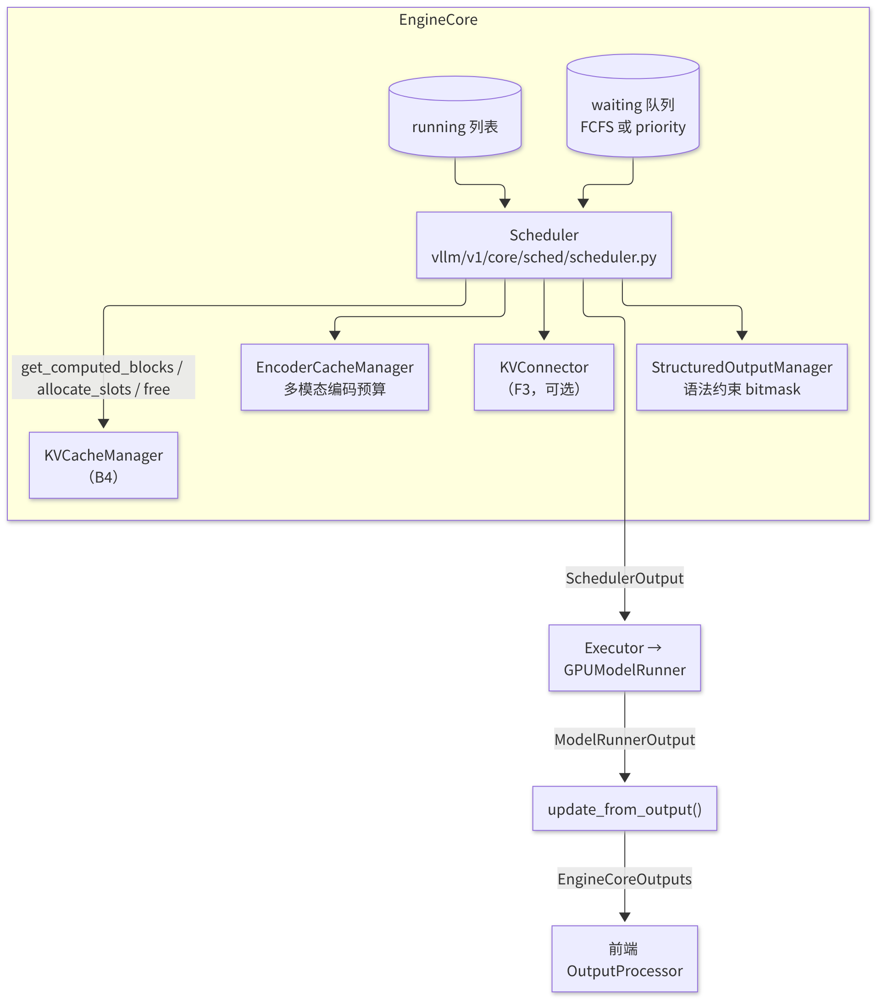
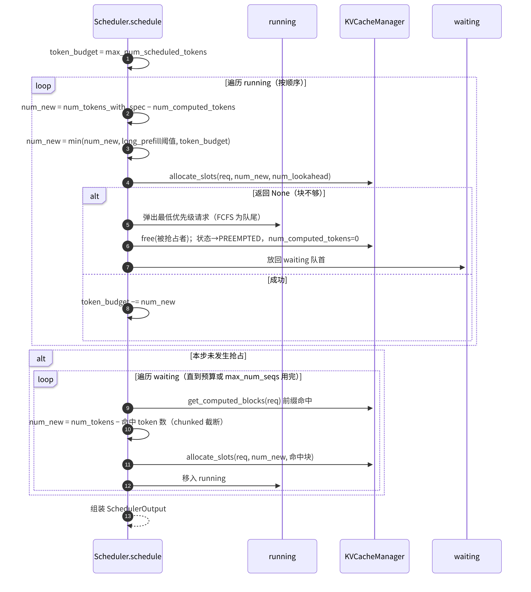

# B3 · 调度器 Scheduler

> **版本**：vLLM 0.30.x（V1 引擎）｜**模块**：B-运行时内核｜**对应原课**：第 4 课
> **导航**：上一课：[B2-Worker与Executor] → **本课 B3** → 下一课：[B4-PagedAttention]
> **练习**：`exercises/B3_scheduler_token_budget`｜**源码标注**：文中涉及的源码路径、符号与参数已对照 vLLM v0.30.0 tag 的源码核实。

## 0. 先修要求与学习目标

先修要求：B1（EngineCore.step 的三段式结构）、B2（KV 预算的来源）；了解预填充（Prefill）与解码（Decode）在计算特征上的差异。

完成本课学习后，学习者应能够：

1. 简要概括 V1 调度器（Scheduler）的核心抽象：**每个请求仅由一个数值 `num_computed_tokens` 描述其进度，调度即决定该请求在本步前进多少个词元（token）**；
2. 按代码顺序复述 `Scheduler.schedule()` 的两大循环（先处理 running、再处理 waiting）与抢占逻辑；
3. 手工计算单步调度中 token 预算在 Decode、分块预填充（chunked prefill）与新请求之间的分配；
4. 说明 `SchedulerOutput` 中各字段被 ModelRunner 消费的方式；
5. 解释调度参数（`max_num_batched_tokens`、`max_num_seqs`、`long_prefill_token_threshold`）对首词元时延（TTFT）与词元间时延（ITL）的影响。

---

## 1. 动机：从"两阶段"到"统一 token 预算"

V0 的调度器区分 Prefill 批次与 Decode 批次：一步之内要么全部为 Prefill，要么全部为 Decode。其缺陷十分明显：当一个长度为 3 万 token 的长 prompt 到达时，整个 Decode 队列须暂停以等待其计算完成，所有正在接收流式输出的用户都会经历一次较长的停顿（ITL 尖峰）。

V1 对这一问题进行了简洁的抽象：**不区分 Prefill 与 Decode**。每个请求具有 `num_tokens`（prompt 长度与已生成长度之和；若存在投机 token，则使用 `num_tokens_with_spec`）与 `num_computed_tokens`（KV 已写入的 token 数）。二者之差即为该请求尚待计算的 token 数。Decode 请求待计算 1 个 token；新请求待计算整个 prompt；被分块的长 prompt 待计算剩余部分；投机解码请求待计算 1+k 个 token。调度器每一步仅完成一项工作：在 token 预算（`max_num_batched_tokens`）与键值缓存（KV Cache）容量的约束下，决定每个请求在本步计算多少个待计算 token。这一抽象同时涵盖了 chunked prefill、前缀缓存（命中部分直接计入已计算）、投机解码，以及 PD 分离中的远端 KV（将远端传来的部分计入已计算）。

## 1.5 基本认识：调度器的优化目标

调度器同时权衡三个目标：**GPU 效率**（每步尽可能填满 token，使矩阵乘法规模足够大）、**时延公平性**（不使任何一类请求长期处于饥饿状态，也不使长请求拖慢全部请求）以及**显存安全**（不准入超出 KV 容量的请求，否则只能执行抢占）。Decode 请求每步仅贡献 1 个 token，计算量较小，但必须每步都被调度，否则用户将观察到输出停顿；Prefill 贡献大量 token，是填满 GPU 的主要来源，但一次放入过多会延长该步的耗时。V1 的"running 优先"规则保证正在输出的请求优先得到处理，"剩余预算分配给新请求"保证 GPU 尽可能被填满，"块不足时抢占最晚到达的请求"保证显存不会溢出。后续所有源码细节均为上述三项原则的具体实现。

## 2. 架构图：调度器及其协作组件



<p align="center"><em>图1：调度器 Scheduler 及其协作组件（KVCacheManager、请求队列、Executor）</em></p>

## 3. schedule() 单步的数据流



<p align="center"><em>图2：schedule() 单步的数据流：预算、分配、抢占与 SchedulerOutput</em></p>

## 4. 源码分析（按调用顺序）

1. `vllm/v1/core/sched/scheduler.py`：`Scheduler.__init__` 读取 `scheduler_config.max_num_batched_tokens`（即 `max_num_scheduled_tokens`）、`max_num_seqs`（即 `max_num_running_reqs`）与 `policy`，构造 `KVCacheManager`（传入 B2 中计算得到的 `kv_cache_config`）、`EncoderCacheManager`，以及可选的 `KVConnector`。
2. `add_request(request)`：执行 `self.waiting.add_request(request)`，并将请求记入 `self.requests` 字典。waiting 队列的实现位于 `request_queue.py`：`FCFSRequestQueue`（deque）或 `PriorityRequestQueue`（堆，按 `(priority, arrival_time)` 排序）。
3. `schedule()` 第一阶段：遍历 `self.running`。
   - 计算 `num_new_tokens = request.num_tokens_with_spec + request.num_output_placeholders − request.num_computed_tokens`（`num_output_placeholders` 用于 async scheduling，表示"已调度但结果尚未返回"的 token）；
   - 若 `0 < long_prefill_token_threshold < num_new_tokens`，则进行截断；再取 `min(num_new_tokens, token_budget)`；同时须保证不超过 `max_model_len`；
   - 多模态：`_try_schedule_encoder_inputs()` 检查本步涉及的图像 token 区间是否需要先执行视觉编码器，以及编码器预算是否充足；
   - `new_blocks = self.kv_cache_manager.allocate_slots(request, num_new_tokens, num_lookahead_tokens=self.num_lookahead_tokens)`；
   - 分配失败时进入抢占循环：`preempted_req = self.running.pop()`（FCFS），或按 `max(priority, arrival_time)` 选择被抢占者；`_preempt_request()` 中执行 `kv_cache_manager.free(preempted_req)`，将状态置为 `PREEMPTED`，令 `num_computed_tokens = 0`，并执行 `self.waiting.prepend_request(preempted_req)`；若被抢占者恰为当前请求本身，则放弃调度该请求。
4. `schedule()` 第二阶段：若本步未发生抢占（`if not preempted_reqs`），则遍历 waiting 队列。
   - 若 `len(self.running) == self.max_num_running_reqs`，则停止；
   - 处理特殊状态：`WAITING_FOR_FSM`（结构化输出的语法尚未编译完成）跳过；`WAITING_FOR_REMOTE_KVS`（PD 分离场景下远端 KV 尚未到达，见 F3）跳过；
   - 首次调度：`new_computed_blocks, num_new_local_computed_tokens = self.kv_cache_manager.get_computed_blocks(request)`；若存在 connector，再加上 `connector.get_num_new_matched_tokens()` 返回的远端命中数；
   - `num_new_tokens = request.num_tokens − num_computed_tokens`；若未启用 chunked prefill 且超出预算，则执行 `break`；若已启用，则截断为 `token_budget`；
   - 执行 `allocate_slots(request, num_new_tokens + num_external, num_new_local_computed_tokens, new_computed_blocks, ...)`，失败则执行 `break`（新请求不会抢占其他请求）；
   - 将请求移入 running，状态置为 `RUNNING`，并执行 `token_budget -= num_new_tokens`。
5. 组装 `SchedulerOutput`（`vllm/v1/core/sched/output.py`）：
   - `scheduled_new_reqs: list[NewRequestData]`：首次被调度上卡的请求，携带完整的 prompt token、采样参数与 block_ids；
   - `scheduled_cached_reqs: CachedRequestData`：对已在卡上的请求仅发送增量（新块 id、`num_computed_tokens`、是否从抢占中恢复），以减小每步的消息体积；
   - `num_scheduled_tokens: dict[req_id, int]`、`total_num_scheduled_tokens`；
   - `scheduled_spec_decode_tokens`、`scheduled_encoder_inputs`、`num_common_prefix_blocks`（用于级联注意力）、`finished_req_ids`、`free_encoder_mm_hashes`，以及结构化输出 bitmask 相关字段。
6. `_update_after_schedule()`：**乐观地**执行 `request.num_computed_tokens += num_scheduled_tokens`。即调度一经完成，即视这些 token 将被计算完毕，下一步可直接基于更新后的值进行调度，这正是 async scheduling 得以实现的前提。
7. `update_from_output(scheduler_output, model_runner_output)`：对每个请求取得 `sampled_token_ids`；在投机解码场景下，根据被接受的 token 数回退 `num_computed_tokens`；执行 `request.append_output_token_ids()`；执行 `check_stop()`（`sched/utils.py`：EOS、`max_tokens`、`stop_token_ids`、`max_model_len`）；对已结束的请求执行 `_free_request()` 以释放 KV（存在 connector 时可能延迟释放，见 F3）；构造 `EngineCoreOutput` 并按 `client_index` 分组。

## 5. 数值示例：单步调度的预算分配

配置：`max_num_batched_tokens = 2048`，`max_num_seqs = 256`，`long_prefill_token_threshold = 0`（不启用），block_size=16，KV 容量充足。

当前状态：

- running：R1～R60 处于 Decode 阶段，各待计算 1 个 token；R61 为被分块的长 prompt，共 5 000 token，已计算 2 048 个，待计算 2 952 个；
- waiting：W1（prompt 长度 800 token，其中前 512 token 命中前缀缓存）、W2（1 500 token，无命中）。

第一阶段（running）：R1～R60 各占用 1 个 token，共计 60 个，剩余 1 988；R61 待计算 2 952 个，截断为 1 988 个，预算归零。第二阶段因预算为 0 而直接结束。本步 `total_num_scheduled_tokens = 2048`，W1、W2 继续等待。

下一步：R1～R60 占用 60 个；R61 剩余 964 个，全部分配，剩余预算 1 024；W1 命中 512 个 token（32 块），尚需计算 288 个，剩余预算 736；W2 需要 1 500 个，本步分块为 736 个。因此本步 W1 一次完成 Prefill，W2 开始分块计算。

**分析**：

- R61 这条 5 000 token 的 prompt 历经 3 步方计算完成，每步均与 60 个 Decode 请求混合执行，Decode 用户的 ITL 仅从约 12 ms 上升至约 30 ms，而非如 V0 那样出现 300 ms 以上的停顿；
- W1 的 TTFT 受益于前缀缓存，仅需计算 288 个 token；
- 增大 `max_num_batched_tokens`（如设为 8192）→ Prefill 更快完成、TTFT 降低，但每步负载更重、ITL 升高；减小该值 → ITL 平稳，但 TTFT 变差。这是调度器最核心的一组权衡。

**抢占代价估算**：被抢占请求的 KV 被释放，`num_computed_tokens` 归零（V1 仅支持重计算式抢占，不执行 swap）。若该请求已有 3 000 token 的上下文，则恢复时需重新执行 3 000 token 的 Prefill；不过，其完整块大多仍保留于前缀缓存的空闲队列中，若尚未被驱逐即可直接命中，因此实际重计算量通常远小于 3 000。若日志中的 `vllm:num_preemptions_total` 持续增长，则表明 KV 容量不足，应减小 `max_num_seqs` 或增加显存/显卡数量。

## 5.5 请求的生命周期状态

调度器围绕 `Request`（`vllm/v1/request.py`）对象工作。理解其状态枚举 `RequestStatus`，即可基本理解调度器的全部分支：

- **WAITING**：位于 waiting 队列中，等待首次准入，或在被抢占后等待重新准入；
- **WAITING_FOR_FSM**：使用了结构化输出（JSON schema、正则表达式、语法），但语法的有限状态机仍在后台线程中编译；编译完成前不可调度，否则第一步将没有可用的 bitmask；
- **WAITING_FOR_REMOTE_KVS**：PD 分离的 Decode 端，KV 正在从 Prefill 端异步拉取（F3），拉取完成后方转回 WAITING 状态参与调度；
- **RUNNING**：位于 running 列表中，每一步均被纳入考虑；
- **PREEMPTED**：已被抢占，KV 已释放，并被放回 waiting 队列首部；
- **FINISHED_STOPPED / FINISHED_LENGTH_CAPPED / FINISHED_ABORTED / FINISHED_IGNORED**：分别对应命中停止条件、达到长度上限、被取消，以及因长度过长而被直接忽略。

状态判断存在一项重要约定：所有 FINISHED_* 状态的取值均大于某一阈值，代码中统一使用 `RequestStatus.is_finished(status)` 进行判断。另一值得注意之处是，**被抢占的请求被放回 waiting 队列首部而非尾部**，从而使其在下一次出现空闲空间时最先恢复，避免因反复被抢占而造成饥饿。

## 5.6 调度器与其他特性的交互

调度器是 vLLM 中修改最频繁的文件之一，原因在于几乎每项新特性都需要在此处增加相应的处理分支。阅读源码时，可按特性对这些分支进行分类理解：

**投机解码（F1）**。请求的 `spec_token_ids` 由上一步的 drafter 产生，因此 `num_tokens_with_spec` 比 `num_tokens` 多 k。调度器在分配 KV 时额外预留 `num_lookahead_tokens` 个槽位，并通过 `scheduled_spec_decode_tokens` 告知 ModelRunner 哪些位置为草稿 token。`update_from_output` 获得被接受的 token 数后，回退多计入的 `num_computed_tokens`；未被接受位置写入的 KV 将在下一步被覆盖，因此无需显式清理。

**结构化输出**。调度器在组装输出时，为本步涉及的结构化请求收集语法 bitmask 的索引信息；实际的 bitmask 计算由 `StructuredOutputManager` 完成，ModelRunner 在采样前将 bitmask 应用于 logits。每个请求采样得到 token 后，调度器须推进其语法状态机；若语法已到达终止状态，则结束该请求。

**异步调度**。启用后，调度器在上一步结果尚未返回时即开始调度下一步。为此，每个请求维护 `num_output_placeholders`，即已调度但尚未取得结果的 token 数。下一步调度时，这些 token 被视为"已存在"，ModelRunner 端直接使用上一步留在 GPU 上的采样结果填充输入，从而避免 CPU 等待 GPU。其代价是停止判定滞后一步，命中 EOS 的请求可能多计算一个 token，该 token 最终被丢弃。

**前缀缓存与 LoRA、多模态**。命中判断依赖块哈希（B4），而哈希中包含 LoRA 名称与多模态输入哈希等"额外键"；因此，即使两个请求的 prompt 相同，若使用不同的 LoRA，二者亦不会互相命中。这是正确性要求，而非缓存失效。

## 5.7 参数调优实践：由症状反推参数

调度参数不存在通用的最优值，应依据业务目标与观测到的症状进行调整：

- **目标为低 ITL（对话类、流式体验）**：将 `max_num_batched_tokens` 保持在适中水平（如 2 048～4 096），并启用 `long_prefill_token_threshold`（如设为预算的一半），使长 prompt 被切分得更细，从而避免 Decode 步负载过重。
- **目标为高吞吐量（离线批处理）**：将 `max_num_batched_tokens` 调至 8 192～16 384 或更高，将 `max_num_seqs` 提高至 KV 容量所能承受的上限，并接受较高的 ITL。
- **TTFT 较长但 GPU 未满载**：检查 waiting 队列是否存在积压；若存在积压且 running 数已达 `max_num_seqs`，则说明并发上限过低；若 running 数不高，则可能是 KV 不足导致准入失败。
- **吞吐量随并发增加反而下降**：通常由抢占风暴或 CUDA Graph 失效（batch 超过最大捕获尺寸后回退至 eager 模式）引起，应分别检查抢占计数与 C2 所述的图命中情况。

每次仅修改一个参数，并使用固定的压测脚本（F2 中的 `vllm bench serve`）对比 TTFT、ITL 的 P50/P99 与吞吐量，方可得出可信的结论。

## 6. 练习对应的简化模型

练习将"第二阶段：遍历 waiting 队列执行准入"抽象为一个贪心问题：给定按到达顺序排列的请求列表，每个请求具有 `num_tokens`，在不超过 `budget` 的前提下按顺序准入，**无法容纳的请求跳过，继续考察后续请求**（first-fit）。需注意，该模型与 vLLM 的默认行为存在一处差异：真实的 FCFS 调度在遇到无法容纳的新请求（且未启用 chunked prefill）时执行 `break`，以保证公平性并避免长请求饥饿；练习采用 first-fit，旨在引导学习者思考"打包效率与公平性"之间的取舍。完成练习后，应对比两种策略在输入 `[1500, 900, 300, 200]`、预算为 2 048 时的结果：first-fit 准入 1500、300、200（共 2 000）；严格 FCFS 在遇到无法容纳的 900 时即停止，仅准入 1500。前者利用率较高，后者则保证 900 不会被后到达的短请求持续"插队"。

## 7. 调度策略与参数速查

| 参数 | 默认值（量级） | 影响 |
|---|---|---|
| `--max-num-batched-tokens` | GPU 上依显存与入口而定：显存 ≥ 160 GB 时为 16 384；≥ 70 GB 且非 A100 时，`LLM` 类为 16 384、API 服务为 8 192；其余 GPU 分别为 8 192 / 2 048；`--performance-mode throughput` 时加倍 | 每步 token 上限；取值大→吞吐量与 TTFT 较优，取值小→ITL 较平稳 |
| `--max-num-seqs` | 256～1 024 | 同时处于 running 状态的请求上限；同时决定 CUDA Graph 的最大捕获尺寸 |
| `--long-prefill-token-threshold` | 0 | 单个请求每步最多计算的 prompt token 数，用于防止一条长 prompt 占用整步预算 |
| `--max-num-partial-prefills` | —（v0.30.0 中已移除） | 旧版本中用于限制同时处于"部分 Prefill"状态的请求数；v0.30.0 的调度器配置中已无此参数 |
| `--scheduling-policy` | fcfs | 取值为 `priority` 时，按请求的 `priority` 字段排序，并可据此执行抢占 |
| `--async-scheduling` | 自动（v0.30.0 中默认值为 None：不存在不兼容项时自动开启，可用 `--no-async-scheduling` 关闭） | 使调度与执行重叠，降低 CPU 开销对 ITL 的影响 |

## 8. 常见问题与故障模式

1. **将 `max_num_batched_tokens` 设为小于 `max_model_len` 且关闭 chunked prefill**：长 prompt 将永远无法被调度。V1 默认启用 chunked prefill，但某些模型/特性组合会自动将其关闭，务必查阅启动日志。
2. **抢占风暴**：`max_num_seqs` 很大而 KV 容量较小时，大量请求被准入后在 Decode 过程中因块不足而相互抢占，吞吐量反而下降。症状：`num_preemptions_total` 快速上升，GPU 利用率呈锯齿状波动。
3. **误读 `num_computed_tokens`**：该值在调度后即被乐观更新，因此在 `update_from_output` 之前读取时，会大于"实际计算完成"的值；投机解码中的 token 被拒绝后，该值会回退。
4. **前缀缓存与 `num_computed_tokens` 的边界**：命中最多只能到达 `num_tokens − 1`，最后一个 token 必须实际计算以得到 logits。因此即使整段 prompt 全部命中，也至少需计算 1 个 token。
5. **使用 priority 调度但未传入 priority**：所有请求的优先级相同，退化为按到达时间排序，容易被误判为功能失效。
6. **多模态编码器预算不足**：包含大图的请求持续被跳过，表现为个别请求的 TTFT 极长，需调整编码器缓存的相关参数。

## 9. 实践练习

- 目录：`exercises/B3_scheduler_token_budget`
- 任务：实现 `admit(requests, budget)`（按输入顺序执行 first-fit 准入，保持相对顺序；预算为负或 token 数为负时抛出 `ValueError`）与 `remaining_budget(requests, budget)`。
- 运行方式：

```bash
python -m pytest exercises/B3_scheduler_token_budget -q
```

- 验收标准：上述测试全部通过。
- 进阶任务 1：增加参数 `strict_fcfs=True`，使准入在遇到无法容纳的请求时即停止；编写测试复现第 6 节的对比结果（first-fit 准入 1500、300、200；严格 FCFS 仅准入 1500）。
- 进阶任务 2：为 `Request` 增加 `num_computed_tokens`，实现"先 running、后 waiting、chunked 截断"的两阶段调度，并以第 5 节的数值编写一条测试。

## 10. 自测题

- [ ] 能否解释 V1 调度器无需区分 Prefill 与 Decode 的原因
- [ ] 能否手工计算第 5 节两步调度完成后各请求的 `num_computed_tokens`
- [ ] 能否陈述抢占发生的条件、选择被抢占者的规则以及恢复时的代价

## 11. 延伸阅读

- 源码：`vllm/v1/core/sched/{scheduler,output,request_queue,utils}.py`、`vllm/v1/request.py`
- 论文：Sarathi-Serve（chunked prefill 与 stall-free batching）；Orca（iteration-level scheduling）

---

**课程导航**　上一课：[B2 · Worker 与 Executor](https://qcngm3vce6yt.feishu.cn/docx/VnbqdbxnnojzIQxyLJCc0x5bnI2)｜下一课：[B4 · PagedAttention 与 KV Cache 显存管理](https://qcngm3vce6yt.feishu.cn/docx/OOo7d5yZvoKv2ZxauPOcBDOincb)｜[返回索引](https://qcngm3vce6yt.feishu.cn/docx/KUn5dKSejoQSAJxaf7YcvNVDnCd)

相关章节：
- [F3 · PD 分离部署](https://qcngm3vce6yt.feishu.cn/docx/AXNadrgJYoxuwmxYzDAc15lXnpd)——见本课「4. 源码分析（按调用顺序）」：“WAITING_FOR_REMOTE_KVS（PD 分离场景下远端 KV 尚未到达，见 F3）跳过；”
- [B1 · Engine 与流式执行](https://qcngm3vce6yt.feishu.cn/docx/Sg5hdyoxqoE9nZx10DAcrGCknph)——见本课「0. 先修要求与学习目标」：“先修要求：B1（EngineCore.step 的三段式结构）”
- [F1 · 采样与投机解码](https://qcngm3vce6yt.feishu.cn/docx/HCfVd3TDLo9JIRx0nRuckXjvnUf)——见本课「5.6 调度器与其他特性的交互」：“投机解码（F1）。请求的 spec_token_ids 由上一步的 drafter 产生”
