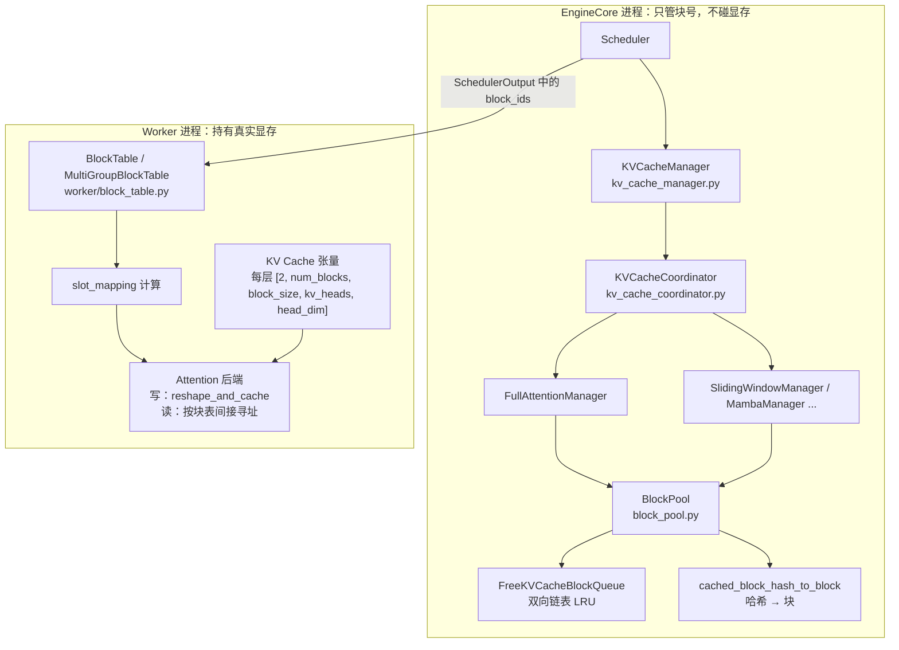
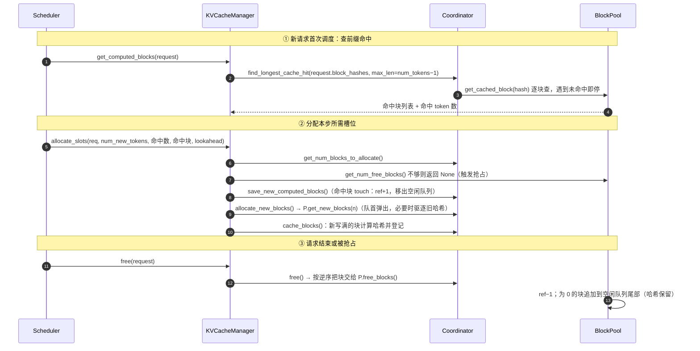
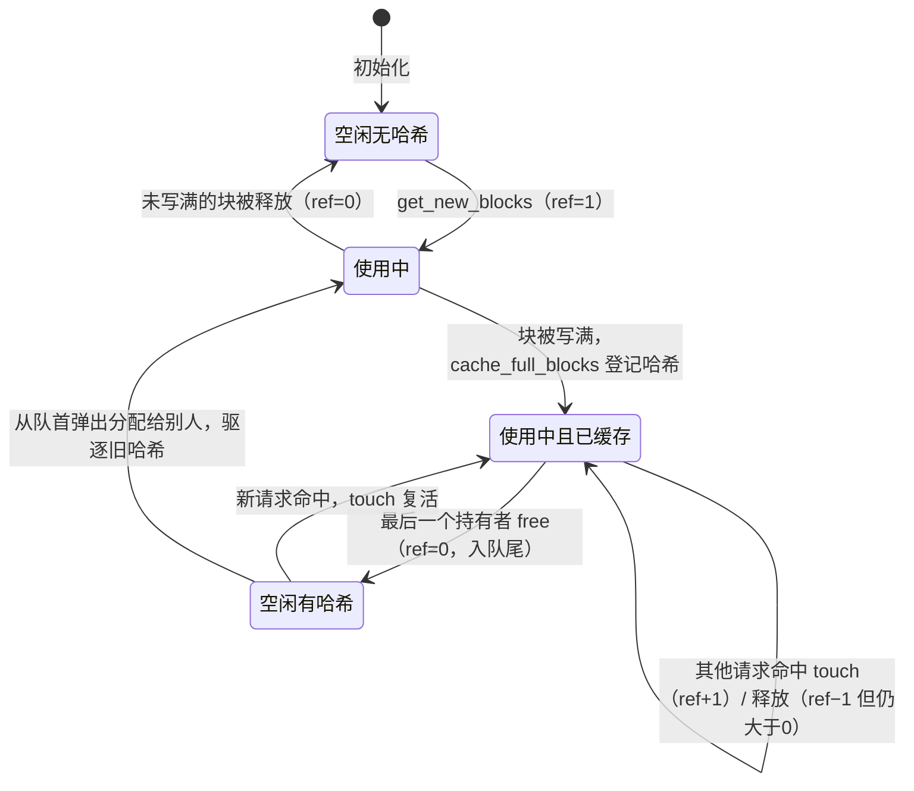

# B4 · PagedAttention 与 KV Cache 显存管理（深度版）

> **版本**：vLLM 0.30.x（V1 引擎）｜**模块**：B-运行时内核｜**对应原课**：第 5 课
> **导航**：上一课：[B3-调度器] → **本课 B4** → 下一课：[B5-ModelRunner加载]
> **练习**：`exercises/B4_block_pool`｜**源码标注**：标【待核】处以 0.30.x tag 为准。

## 0. 先修与本课目标

先修：B3（调度器何时调用 `get_computed_blocks` / `allocate_slots` / `free`）；Transformer 自回归推理中 KV Cache 的作用；操作系统分页的基本概念（页表、物理页、引用计数、写时复制）。

学完本课你应能：

1. 用碎片率的数字说明 PagedAttention 为什么能把吞吐提升数倍；
2. 手算任意模型的每 token KV 字节数、每块字节数、给定显存可容纳的块数；
3. 按调用顺序复述 `KVCacheManager` → `KVCacheCoordinator` → `SingleTypeKVCacheManager` → `BlockPool` 的分配、命中、释放路径；
4. 解释前缀缓存的链式哈希、"ref=0 但保留哈希"的延迟驱逐、以及最后一个 token 不能命中的原因；
5. 从调度器的逻辑块号一路追到 Worker 端的 `slot_mapping` 与 attention kernel 的寻址公式。

---

## 1. 动机：连续分配的三种浪费

在 PagedAttention 之前，推理系统为每个请求按 `max_model_len` 预留一段连续 KV 空间。设 `max_model_len = 4096`，而真实请求平均 prompt 600 + 输出 300 = 900 token，则：

- **预留浪费（内部碎片）**：每个请求实际只用 900/4096 ≈ 22%，78% 空着；
- **外部碎片**：请求长度不同、结束时间不同，释放后留下大小不一的空洞，新的大请求放不进去；
- **无法共享**：同一系统提示词被 100 个请求重复存 100 份。

PagedAttention 的做法与操作系统虚拟内存完全同构：把 KV 显存切成固定大小的**块**（block，默认 16 token），每个请求维护一张**块表**（block table）把逻辑块号映射到物理块号；块按需分配，浪费只发生在每个请求的最后一个块中（平均半个块，即 8 token）。对上面的例子，900 token 只浪费约 8/900 ≈ 0.9%。原论文报告 KV 利用率从 20%～40% 提升到 96% 以上，对应吞吐提升 2～4 倍，原因很简单：同样的显存能并发更多请求，decode 的 batch 更大。

## 2. 架构图：管理端（EngineCore）与执行端（Worker）



关键认识：**EngineCore 中的 BlockPool 只是一个"块号账本"**，它不持有任何 GPU 张量；真正的 KV 张量在每个 Worker 里，按块号切片。调度器把"请求 R 的块表追加了块 37、52"作为增量放进 `SchedulerOutput`，Worker 更新自己的块表张量。各 TP rank 的块号是对齐的（B2 讲过全局块数取各 rank 最小值），所以一份账本足够。

## 3. 显存手算：从模型配置到块数

每 token、每层的 KV 字节数：`2（K 与 V）× num_kv_heads × head_dim × dtype_bytes`。每块每层字节数（V1 中称 page size）：再乘 `block_size`。

**例 1：Llama-3-8B（32 层、8 KV 头、head_dim 128、bf16）**

- 每 token 每层：2 × 8 × 128 × 2 = 4 096 B = 4 KiB
- 每 token 全模型：4 KiB × 32 = 128 KiB
- 每块每层（16 token）：64 KiB；每块全模型：2 MiB
- 可用 KV 53 GB（B2 的结果）→ 约 53×1024/2 ≈ 27 100 块 ≈ 43.4 万 token

**例 2：同一模型若是 MHA（32 KV 头）**：每 token 512 KiB，同样显存只能放约 10.8 万 token，是 GQA 的 1/4。这就是 GQA/MLA 等结构演进的动机（见 R1）。

**例 3：fp8 KV Cache（`--kv-cache-dtype fp8`）**：dtype_bytes 变为 1，容量翻倍到约 87 万 token，代价是轻微精度损失与需要 scale（D2）。

**例 4：一个请求占多少块**：prompt 1 000 + 输出 500 = 1 500 token → ceil(1500/16) = 94 块；最后一块只用了 1500 − 93×16 = 12 个槽位，浪费 4 个槽位，占 0.27%。

**例 5：并发上限**：43.4 万 token / 每请求 1 500 token ≈ 289 个请求。如果 `max_num_seqs=512`，会有请求因 KV 不够而在 decode 中被抢占；把 `max_num_seqs` 设在 256 左右更稳。

## 4. 分配、命中、释放的调用顺序



源码要点（`vllm/v1/core/`）：

1. `kv_cache_manager.py`：`KVCacheManager.get_computed_blocks()`、`allocate_slots()`、`free()`、`get_num_common_prefix_blocks()`（级联注意力用）、`take_events()`（KV 事件，供外部路由器感知缓存）。
2. `kv_cache_coordinator.py`：`UnitaryKVCacheCoordinator`（只有一种注意力类型）、`HybridKVCacheCoordinator`（全注意力 + 滑动窗口等混合模型）、`KVCacheCoordinatorNoPrefixCache`。【待核：类名】
3. `single_type_kv_cache_manager.py`：`FullAttentionManager.find_longest_cache_hit()`；`SlidingWindowManager.remove_skipped_blocks()` 把窗口外的块替换为 null block 并提前释放。
4. `block_pool.py`：`BlockPool.get_new_blocks()`、`touch()`、`free_blocks()`、`cache_full_blocks()`、`_maybe_evict_cached_block()`、`reset_prefix_cache()`；块 0 是保留的 `null_block`，永不分配给请求。
5. `kv_cache_utils.py`：`KVCacheBlock`（`block_id`、`ref_cnt`、`_block_hash`、链表指针）、`FreeKVCacheBlockQueue`（O(1) 中间删除）、`hash_block_tokens()`、`get_request_block_hasher()`、`get_kv_cache_configs()` / `get_num_blocks()`（显存 → 块数）。

## 5. 前缀缓存的三个精妙之处

**（1）链式哈希**。块 i 的哈希 = `H(块 i−1 的哈希, 块 i 的 16 个 token id, 额外键)`。因为包含父哈希，"块哈希相同"等价于"从开头到该块为止的整个前缀相同"，所以命中查找可以逐块进行，遇到第一个未命中就停止。额外键包括 LoRA 名称、多模态输入的内容哈希、`cache_salt`（多租户隔离，防止通过缓存命中时延推测别人的 prompt）。哈希函数可选 `--prefix-caching-hash-algo`（如 sha256 系列），在需要防碰撞的多租户场景使用强哈希。

**（2）只哈希写满的块**。未写满的块内容还会变化，不能作为缓存键。因此 1 500 token 的请求只有前 93 个块可被他人命中。

**（3）延迟驱逐**。请求结束时块的 ref 降到 0，块被追加到空闲队列**尾部**，但哈希映射保留。之后若有新请求命中它，`touch()` 把它从空闲队列中摘出（O(1)），ref 回到 1，相当于"复活"；只有当它从队首被 `get_new_blocks()` 弹出用于新分配时，才调用 `_maybe_evict_cached_block()` 删除哈希。这就是一个天然的 LRU：最久未使用的空闲块最先被复用。`free()` 按**逆序**释放块（尾块先入队），使得一个请求的后缀块比前缀块更早被驱逐——前缀被共享的概率更高，应该活得更久。

**为什么最后一个 token 不能命中**：即使整段 prompt 都在缓存中，也必须至少对最后一个位置做一次前向，才能得到下一个 token 的 logits。因此 `max_cache_hit_length = num_tokens − 1`，命中按块向下取整。

**数字例子**：系统提示词 1 024 token（64 块）被 200 个并发请求共享。无前缀缓存需要 200×64 = 12 800 块；有前缀缓存只需 64 块被共享（ref=200），节省 12 736 块 ≈ 24.9 GiB（按每块 2 MiB）。同时每个请求的 TTFT 少算 1 024 token 的 prefill。

## 5.5 一个物理块的一生

把单个物理块的状态画出来，有助于把引用计数和哈希两条线索合在一起理解：



几个细节值得反复体会。第一，"空闲有哈希"是前缀缓存真正发挥作用的状态：没有任何请求在用它，但它的内容仍然有效，随时可以被复活。系统负载低时，大量块处于这个状态，相当于一个免费的缓存；负载高时，它们从队首被逐个回收，缓存自然收缩，不需要任何单独的淘汰线程。第二，同一时刻多个请求共享一个块时，它们只会**读**这个块，绝不会写，因为共享的一定是写满的块，而每个请求的新 token 总是写进它自己独占的最后一块。因此 V1 不需要操作系统那种写时复制机制。第三，"使用中"和"使用中且已缓存"的区别只在于有没有哈希；一个块从分配到写满可能跨越多个调度步，期间它只属于一个请求。

## 5.6 为什么 V1 不做 swap，以及 KV 事件

V0 支持在 KV 不足时把被抢占请求的块换出到 CPU 内存，V1 则只做重算式抢占。原因是：在 chunked prefill 与前缀缓存的帮助下，重算的代价通常比想象中小（被抢占请求的前缀块大概率仍在空闲队列中可以复活），而 swap 需要在调度路径中引入 CPU 与 GPU 之间的同步拷贝，复杂度高且会拖慢每一步。需要更大缓存容量时，V1 的思路是通过 KV Connector 做**分层卸载**（CPU 内存、本地磁盘、远端存储），这与 PD 分离共享同一套接口，详见 F3。

另一个常被忽视的功能是 **KV 事件**。开启后，BlockPool 在块被登记哈希或被驱逐时产生事件，EngineCore 通过 ZMQ 发布出去。外部的智能路由器订阅这些事件，就能知道"哪台实例上缓存了哪些前缀"，从而把共享前缀的请求路由到同一实例，在多副本部署中显著提升命中率。这也说明了把块账本放在 EngineCore 而不是 Worker 中的好处：一个进程就掌握了全局缓存视图。

## 5.7 级联注意力：共享前缀的计算也能省

前缀缓存节省的是**显存与 prefill 计算**，但 decode 时每个请求仍要各自读取共享前缀的 KV。若 200 个请求共享 1 024 token 前缀，每个 decode 步就要把同一份前缀 KV 读 200 次。级联注意力（cascade attention）把注意力拆成两段：先对共享前缀做一次"所有 query 对同一组 KV"的注意力，再对各自私有部分做常规注意力，最后用 log-sum-exp 合并。调度器提供的 `num_common_prefix_blocks` 就是告诉 ModelRunner 当前 batch 中所有请求共同拥有的前缀块数，后端据此决定是否启用。它在共享前缀很长、batch 很大时收益明显，否则额外的合并开销反而不划算，因此由启发式条件决定是否开启。

## 6. Worker 端：从块表到 slot_mapping

Worker 的 `BlockTable`（`vllm/v1/worker/block_table.py`）维护一个形如 `[max_num_reqs, max_num_blocks_per_req]` 的 int32 张量（CPU 端 numpy + pinned 内存，异步拷到 GPU）。每步对本次要计算的每个 token 位置 pos 计算物理槽位：

```
slot = block_table[req_idx, pos // block_size] * block_size + pos % block_size
```

例如块表 `[7, 2, 9]`、block_size=16，位置 37 → 逻辑块 2 → 物理块 9 → slot = 9×16 + 5 = 149。

- **写入**：每层 attention 前向时，`reshape_and_cache_flash(key, value, key_cache, value_cache, slot_mapping, ...)` 按 slot 把新算出的 K/V 散写进缓存；
- **读取**：attention kernel 拿到 `block_table` 与 `seq_lens`，对每个 query 按块循环，按块号间接寻址读取 K/V。物理不连续对 kernel 来说只是多一次间接寻址，而块内 16 个 token 是连续的，访存仍然高效。

KV 张量布局由后端决定：`AttentionBackend.get_kv_cache_shape(num_blocks, block_size, num_kv_heads, head_size)`，FlashAttention 后端为 `(2, num_blocks, block_size, num_kv_heads, head_size)`；FlashInfer 可选 NHD/HND 布局（PD 传输时布局影响连续性，见 F3）。

## 7. 混合模型：一个请求多种块

V1 用 `KVCacheSpec`（`vllm/v1/kv_cache_interface.py`）描述每层的需求：`FullAttentionSpec`、`SlidingWindowSpec`、`MLAAttentionSpec`、`MambaSpec` 等。层被分成若干 **KV cache group**，每组共享一张块表，由各自的 SingleTypeManager 管理。例如 Gemma 类模型中全注意力层与滑动窗口层交替，窗口为 4 096：一个 3 万 token 的请求在全注意力组需要 1 875 块，在窗口组只需保留约 256+1 块，其余块可提前释放，整体 KV 占用大幅下降。为了让不同组共用同一块池，V1 要求各组的 page size 一致（不一致时会调整 block_size 或做填充）。

## 8. 常见坑 / 故障模式

1. **把 `block_size` 当作越大越好**：块越大，最后一块浪费越多、前缀命中粒度越粗（命中按整块计）；越小则块表越长、kernel 间接寻址越多。多数后端默认 16，个别后端（如部分 MLA kernel）要求 64 或更大，由后端自动约束。
2. **以为 `gpu_memory_utilization` 调高就能放更多请求**：它确实增加 KV，但也压缩了激活余量，突发长 prompt 可能 OOM。
3. **前缀缓存命中率低**：prompt 中在前部插入了时间戳、请求 ID 等动态内容，导致从第一块起哈希就不同。把动态内容放到 prompt 末尾。
4. **多租户泄露风险**：共享前缀缓存可能被用作时间侧信道，需要用 `cache_salt` 隔离租户。
5. **ref_cnt 不平衡**：自己改造 BlockPool 时，重复 free 或漏 free 会导致块"永远不回收"或"被两个请求同时写"，后者表现为输出乱码，极难排查。练习中的 `KeyError`、`BlockPoolExhausted` 就是在训练"尽早失败"。
6. **启动报 KV 不足以容纳一个 `max_model_len` 请求**：说明 `max_model_len` 对应的块数大于总块数，应减小 `max_model_len` 或增加显存/TP。

## 9. 动手练习

- 目录：`exercises/B4_block_pool`
- 任务：实现引用计数 `BlockPool(num_blocks)`：`allocate()` 返回 ref=1 的块，无空闲块抛 `BlockPoolExhausted`；`retain(id)` 使 ref+1；`free(id)` 使 ref−1，到 0 回到空闲列表；未知 id 抛 `KeyError`；`free_count`、`refcount(id)` 查询。
- 运行：

```bash
python -m pytest exercises/B4_block_pool -q
```

- 进阶：给块加上 `block_hash`，实现 `cache(id, h)`、`lookup(h)`；ref 降为 0 时放入有序空闲队列尾部但保留哈希；`allocate()` 从队首取块时才清除其哈希。写测试验证"释放后立即查询仍能命中、被重新分配后不再命中"。

## 10. 自测清单

- [ ] 我能手算 Llama-3-8B 在 50 GB KV 预算下的块数与 token 数，并说出 fp8 KV 的影响
- [ ] 我能解释为什么空闲块放回队尾且保留哈希，以及为什么按逆序释放
- [ ] 我能根据块表与 block_size 计算任意位置的 slot

## 11. 延伸阅读

- 论文：Efficient Memory Management for Large Language Model Serving with PagedAttention（SOSP'23）
- 源码：`vllm/v1/core/{kv_cache_manager,kv_cache_coordinator,single_type_kv_cache_manager,block_pool,kv_cache_utils}.py`、`vllm/v1/worker/block_table.py`
- vLLM 文档：Automatic Prefix Caching 设计说明
