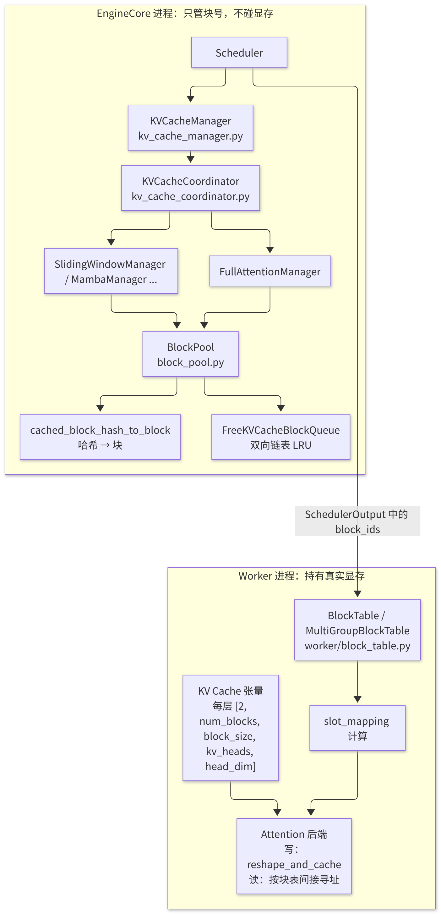
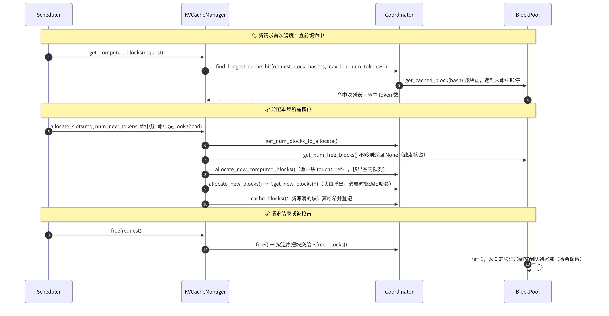
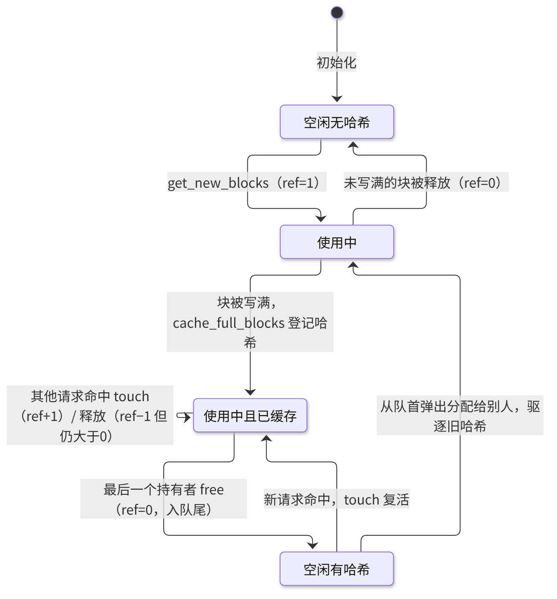

# B4 · PagedAttention 与 KV Cache 显存管理

> **版本**：vLLM 0.30.x（V1 引擎）｜**模块**：B-运行时内核｜**对应原课**：第 5 课
> **导航**：上一课：[B3-调度器] → **本课 B4** → 下一课：[B5-ModelRunner加载]
> **练习**：`exercises/B4_block_pool`｜**源码标注**：文中涉及的源码路径、符号与参数已对照 vLLM v0.30.0 tag 的源码核实。

## 0. 先修要求与学习目标

先修要求：B3（调度器调用 `get_computed_blocks` / `allocate_slots` / `free` 的时机）；Transformer 自回归推理中键值缓存（KV Cache）的作用；操作系统分页机制的基本概念（页表、物理页、引用计数、写时复制）。

完成本课学习后，学习者应能够：

1. 以碎片率的定量数据说明 PagedAttention 能够将吞吐量提升数倍的原因；
2. 对任意模型手工计算每个词元（token）的 KV 字节数、每块字节数，以及给定显存可容纳的块数；
3. 按调用顺序复述 `KVCacheManager` → `KVCacheCoordinator` → `SingleTypeKVCacheManager` → `BlockPool` 的分配、命中与释放路径；
4. 解释前缀缓存的链式哈希、"引用计数为 0 但保留哈希"的延迟驱逐机制，以及最后一个 token 无法命中的原因；
5. 从调度器的逻辑块号出发，逐步追踪至 Worker 端的 `slot_mapping` 与注意力内核（attention kernel）的寻址公式。

---

## 1. 动机：连续分配方式的三类浪费

在 PagedAttention 出现之前，推理系统为每个请求按 `max_model_len` 预留一段连续的 KV 空间。设 `max_model_len = 4096`，而实际请求的平均长度为 prompt 600 + 输出 300 = 900 token，则存在以下浪费：

- **预留浪费（内部碎片）**：每个请求实际仅使用 900/4096 ≈ 22% 的预留空间，其余 78% 处于闲置状态；
- **外部碎片**：由于各请求的长度与结束时间不同，释放后留下大小不一的空洞，新到达的大请求无法放入；
- **无法共享**：同一系统提示词被 100 个请求重复存储 100 份。

PagedAttention 的做法与操作系统的虚拟内存机制完全同构：将 KV 显存划分为固定大小的**块**（block，默认 16 个 token），每个请求维护一张**块表**（block table），将逻辑块号映射至物理块号；块按需分配，浪费仅发生于每个请求的最后一个块中（平均为半个块，即 8 个 token）。就上述示例而言，900 个 token 仅浪费约 8/900 ≈ 0.9%。原论文报告 KV 利用率由 20%～40% 提升至 96% 以上，对应吞吐量提升 2～4 倍，其原因在于：相同的显存可容纳更多并发请求，从而使解码（Decode）阶段的 batch 更大。

## 2. 架构图：管理端（EngineCore）与执行端（Worker）



<p align="center"><em>图1：KV Cache 管理：EngineCore 侧的块号记录与 Worker 侧的实际显存</em></p>

关键认识：**EngineCore 中的 BlockPool 仅是一份"块号记录表"**，它不持有任何 GPU 张量；实际的 KV 张量位于各 Worker 中，并按块号切片。调度器将"请求 R 的块表追加了块 37、52"作为增量写入 `SchedulerOutput`，由 Worker 更新其自身的块表张量。由于各 TP rank 的块号保持对齐（B2 已说明全局块数取各 rank 的最小值），因此一份记录表即可满足需要。

## 3. 显存的手工计算：从模型配置到块数

每个 token、每一层的 KV 字节数为：`2（K 与 V）× num_kv_heads × head_dim × dtype_bytes`。每块每层的字节数（V1 中称为 page size）在此基础上再乘以 `block_size`。

**例 1：Llama-3-8B（32 层、8 个 KV 头、head_dim 为 128、bf16）**

- 每 token 每层：2 × 8 × 128 × 2 = 4 096 B = 4 KiB
- 每 token 全模型：4 KiB × 32 = 128 KiB
- 每块每层（16 token）：64 KiB；每块全模型：2 MiB
- 可用 KV 显存为 53 GB（B2 的计算结果）→ 约 53×1024/2 ≈ 27 100 块 ≈ 43.4 万个 token

**例 2：若同一模型采用 MHA（32 个 KV 头）**：每 token 占用 512 KiB，相同显存仅能容纳约 10.8 万个 token，为 GQA 的 1/4。这正是 GQA/MLA 等结构演进的动机（见 R1）。

**例 3：fp8 KV Cache（`--kv-cache-dtype fp8`）**：dtype_bytes 变为 1，容量翻倍至约 87 万个 token，代价是轻微的精度损失，并需要缩放因子（scale）（D2）。

**例 4：单个请求占用的块数**：prompt 1 000 + 输出 500 = 1 500 token → ceil(1500/16) = 94 块；最后一块仅使用了 1500 − 93×16 = 12 个槽位，浪费 4 个槽位，占比 0.27%。

**例 5：并发上限**：43.4 万 token / 每请求 1 500 token ≈ 289 个请求。若 `max_num_seqs=512`，则会有请求因 KV 不足而在 Decode 过程中被抢占；将 `max_num_seqs` 设置在 256 左右更为稳妥。

## 4. 分配、命中与释放的调用顺序



<p align="center"><em>图2：块的分配、前缀缓存命中与释放的调用顺序</em></p>

源码要点（`vllm/v1/core/`）：

1. `kv_cache_manager.py`：`KVCacheManager.get_computed_blocks()`、`allocate_slots()`、`free()`、`get_num_common_prefix_blocks()`（用于级联注意力）、`take_events()`（KV 事件，供外部路由器感知缓存状态）。
2. `kv_cache_coordinator.py`：`UnitaryKVCacheCoordinator`（仅含一种注意力类型）、`HybridKVCacheCoordinator`（全注意力与滑动窗口等混合模型）、`KVCacheCoordinatorNoPrefixCache`。
3. `single_type_kv_cache_manager.py`：`FullAttentionManager.find_longest_cache_hit()`；`SlidingWindowManager.remove_skipped_blocks()` 将窗口外的块替换为 null block 并提前释放。
4. `block_pool.py`：`BlockPool.get_new_blocks()`、`touch()`、`free_blocks()`、`cache_full_blocks()`、`_maybe_evict_cached_block()`、`reset_prefix_cache()`；块 0 为保留的 `null_block`，永不分配给请求。
5. `kv_cache_utils.py`：`KVCacheBlock`（`block_id`、`ref_cnt`、`_block_hash`、链表指针）、`FreeKVCacheBlockQueue`（支持 O(1) 的中间删除）、`hash_block_tokens()`、`get_request_block_hasher()`、`get_kv_cache_configs()` / `get_num_blocks()`（由显存计算块数）。

## 5. 前缀缓存的三项关键设计

**（1）链式哈希**。块 i 的哈希 = `H(块 i−1 的哈希, 块 i 的 16 个 token id, 额外键)`。由于其中包含父块哈希，"块哈希相同"等价于"从开头至该块为止的整个前缀相同"，因此命中查找可逐块进行，遇到第一个未命中的块即停止。额外键包括 LoRA 名称、多模态输入的内容哈希以及 `cache_salt`（用于多租户隔离，防止他人通过缓存命中时延推测其他租户的 prompt）。哈希函数可通过 `--prefix-caching-hash-algo` 选择（如 sha256 系列）；在需要防止哈希碰撞的多租户场景中，应使用强哈希。

**（2）仅对已写满的块计算哈希**。未写满的块内容仍会变化，不能作为缓存键。因此，一个 1 500 token 的请求仅有前 93 个块可被其他请求命中。

**（3）延迟驱逐**。请求结束时，块的引用计数降至 0，块被追加至空闲队列**尾部**，但其哈希映射予以保留。此后若有新请求命中该块，`touch()` 将其从空闲队列中摘除（O(1)），引用计数恢复为 1，即该块被重新启用；仅当该块从队首被 `get_new_blocks()` 弹出以用于新的分配时，才调用 `_maybe_evict_cached_block()` 删除其哈希。这一机制自然构成了 LRU 策略：最久未使用的空闲块最先被复用。`free()` 按**逆序**释放块（尾块先入队），使得一个请求的后缀块比前缀块更早被驱逐——由于前缀被共享的概率更高，应当保留更长时间。

**最后一个 token 无法命中的原因**：即使整段 prompt 均位于缓存中，也必须至少对最后一个位置执行一次前向计算，才能得到下一个 token 的 logits。因此 `max_cache_hit_length = num_tokens − 1`，命中长度按块向下取整。

**数值示例**：长度为 1 024 token（64 块）的系统提示词被 200 个并发请求共享。若无前缀缓存，需要 200×64 = 12 800 块；启用前缀缓存后，仅需共享 64 块（引用计数为 200），节省 12 736 块，约合 24.9 GiB（按每块 2 MiB 计算）。同时，每个请求的预填充（Prefill）减少 1 024 个 token 的计算，从而降低 TTFT。

## 5.5 物理块的生命周期

绘制单个物理块的状态图，有助于将引用计数与哈希这两条线索结合起来理解：



<p align="center"><em>图3：物理块的生命周期：引用计数与哈希状态机</em></p>

以下细节值得深入理解。第一，"空闲且持有哈希"是前缀缓存实际发挥作用的状态：此时没有任何请求在使用该块，但其内容仍然有效，可随时被重新启用。系统负载较低时，大量块处于该状态，构成一份无额外开销的缓存；负载较高时，这些块从队首被逐个回收，缓存容量随之自然收缩，无需任何独立的淘汰线程。第二，多个请求同时共享一个块时，它们仅**读取**该块而不会写入，原因在于被共享的必然是已写满的块，而每个请求的新 token 总是写入其独占的最后一个块。因此，V1 无需操作系统中的写时复制机制。第三，"使用中"与"使用中且已缓存"的区别仅在于是否持有哈希；一个块从分配到写满可能跨越多个调度步，在此期间它仅属于一个请求。

## 5.6 V1 不采用 swap 的原因，以及 KV 事件

V0 支持在 KV 不足时将被抢占请求的块换出至 CPU 内存，而 V1 仅采用重计算式抢占。原因在于：借助 chunked prefill 与前缀缓存，重计算的代价通常低于预期（被抢占请求的前缀块大概率仍位于空闲队列中，可被重新启用）；而 swap 需要在调度路径中引入 CPU 与 GPU 之间的同步拷贝，复杂度高且会拖慢每一步。当需要更大的缓存容量时，V1 的方案是通过 KV Connector 实现**分层卸载**（CPU 内存、本地磁盘、远端存储），该机制与 PD 分离共用同一套接口，详见 F3。

另一项常被忽视的功能是 **KV 事件**。启用后，BlockPool 在块被登记哈希或被驱逐时产生事件，由 EngineCore 通过 ZMQ 对外发布。外部的智能路由器订阅这些事件后，即可获知"哪台实例缓存了哪些前缀"，从而将共享前缀的请求路由至同一实例，在多副本部署中显著提高命中率。这也说明了将块记录表置于 EngineCore 而非 Worker 中的优势：单个进程即可掌握全局缓存视图。

## 5.7 级联注意力：共享前缀的计算优化

前缀缓存节省的是**显存与 Prefill 计算**，但在 Decode 阶段，每个请求仍需各自读取共享前缀的 KV。若 200 个请求共享长度为 1 024 token 的前缀，则每个 Decode 步需将同一份前缀 KV 读取 200 次。级联注意力（cascade attention）将注意力计算拆分为两段：先对共享前缀执行一次"所有 query 对同一组 KV"的注意力计算，再对各请求的私有部分执行常规注意力计算，最后通过 log-sum-exp 合并结果。调度器提供的 `num_common_prefix_blocks` 用于告知 ModelRunner 当前 batch 中所有请求共同拥有的前缀块数，后端据此决定是否启用该机制。当共享前缀很长且 batch 很大时，其收益明显；否则额外的合并开销反而得不偿失，因此是否启用由启发式条件决定。

## 6. Worker 端：从块表到 slot_mapping

Worker 的 `BlockTable`（`vllm/v1/worker/block_table.py`）维护一个形状为 `[max_num_reqs, max_num_blocks_per_req]` 的 int32 张量（CPU 端采用 numpy 与 pinned 内存，并异步拷贝至 GPU）。每一步对本次需计算的每个 token 位置 pos 计算其物理槽位：

```
slot = block_table[req_idx, pos // block_size] * block_size + pos % block_size
```

例如，块表为 `[7, 2, 9]`、block_size=16 时，位置 37 → 逻辑块 2 → 物理块 9 → slot = 9×16 + 5 = 149。

- **写入**：每层注意力前向计算时，`reshape_and_cache_flash(key, value, key_cache, value_cache, slot_mapping, ...)` 按 slot 将新计算得到的 K/V 分散写入缓存；
- **读取**：attention kernel 获取 `block_table` 与 `seq_lens`，对每个 query 按块循环，并按块号间接寻址读取 K/V。物理上的不连续对 kernel 而言仅增加一次间接寻址，而块内 16 个 token 在物理上连续，因此访存仍然高效。

KV 张量布局由后端决定：`AttentionBackend.get_kv_cache_shape(num_blocks, block_size, num_kv_heads, head_size)`；FlashAttention 后端的布局为 `(2, num_blocks, block_size, num_kv_heads, head_size)`；FlashInfer 可选择 NHD/HND 布局（PD 传输时布局会影响数据连续性，见 F3）。

## 7. 混合模型：单个请求包含多种块

V1 使用 `KVCacheSpec`（`vllm/v1/kv_cache_interface.py`）描述每一层的需求：`FullAttentionSpec`、`SlidingWindowSpec`、`MLAAttentionSpec`、`MambaSpec` 等。各层被划分为若干 **KV cache group**，每组共享一张块表，并由各自的 SingleTypeManager 管理。例如，在 Gemma 类模型中，全注意力层与滑动窗口层交替排列，窗口大小为 4 096：一个 3 万 token 的请求在全注意力组需要 1 875 块，在窗口组仅需保留约 256+1 块，其余块可提前释放，从而使整体 KV 占用大幅下降。为使不同组共用同一块池，V1 要求各组的 page size 一致（不一致时将调整 block_size 或进行填充）。

## 8. 常见问题与故障模式

1. **误认为 `block_size` 越大越好**：块越大，最后一块的浪费越多，前缀命中的粒度也越粗（命中按整块计算）；块越小，则块表越长，kernel 的间接寻址次数越多。多数后端的默认值为 16，个别后端（如部分 MLA kernel）要求 64 或更大，该约束由后端自动施加。
2. **误认为调高 `gpu_memory_utilization` 即可容纳更多请求**：该参数确实会增加 KV 容量，但同时压缩了激活所需的余量，突发的长 prompt 可能导致 OOM。
3. **前缀缓存命中率偏低**：prompt 的前部插入了时间戳、请求 ID 等动态内容，导致从第一块起哈希即不相同。应将动态内容置于 prompt 末尾。
4. **多租户信息泄露风险**：共享的前缀缓存可能被用作时间侧信道，需使用 `cache_salt` 对租户进行隔离。
5. **ref_cnt 不平衡**：自行改造 BlockPool 时，重复执行 free 或遗漏 free 会导致块"永远不被回收"或"被两个请求同时写入"，后者表现为输出乱码，排查难度极高。练习中的 `KeyError`、`BlockPoolExhausted` 即用于训练"尽早失败"的设计习惯。
6. **启动时报告 KV 不足以容纳一个 `max_model_len` 长度的请求**：说明 `max_model_len` 对应的块数大于总块数，应减小 `max_model_len` 或增加显存/TP 规模。

## 9. 实践练习

- 目录：`exercises/B4_block_pool`
- 任务：实现带引用计数的 `BlockPool(num_blocks)`：`allocate()` 返回引用计数为 1 的块，无空闲块时抛出 `BlockPoolExhausted`；`retain(id)` 使引用计数加 1；`free(id)` 使引用计数减 1，降至 0 时将块返回空闲列表；对未知 id 抛出 `KeyError`；提供 `free_count`、`refcount(id)` 查询接口。
- 运行方式：

```bash
python -m pytest exercises/B4_block_pool -q
```

- 验收标准：上述测试全部通过。
- 进阶任务：为块增加 `block_hash`，实现 `cache(id, h)` 与 `lookup(h)`；引用计数降为 0 时将块放入有序空闲队列尾部，但保留其哈希；仅当 `allocate()` 从队首取出该块时才清除其哈希。编写测试验证"释放后立即查询仍能命中，被重新分配后不再命中"。

## 10. 自测题

- [ ] 能否手工计算 Llama-3-8B 在 50 GB KV 预算下的块数与 token 数，并说明 fp8 KV 的影响
- [ ] 能否解释空闲块被放回队尾且保留哈希的原因，以及按逆序释放的原因
- [ ] 能否依据块表与 block_size 计算任意位置的 slot

## 11. 延伸阅读

- 论文：Efficient Memory Management for Large Language Model Serving with PagedAttention（SOSP'23）
- 源码：`vllm/v1/core/{kv_cache_manager,kv_cache_coordinator,single_type_kv_cache_manager,block_pool,kv_cache_utils}.py`、`vllm/v1/worker/block_table.py`
- vLLM 文档：Automatic Prefix Caching 设计说明

---

**课程导航**　上一课：[B3 · 调度器 Scheduler](https://qcngm3vce6yt.feishu.cn/docx/PgNQdFEp2oajjSxApwKcSUIvnTb)｜下一课：[B5 · ModelRunner 与权重加载](https://qcngm3vce6yt.feishu.cn/docx/FWYldjMhdomAz0xTxOTcBfYpn7e)｜[返回索引](https://qcngm3vce6yt.feishu.cn/docx/KUn5dKSejoQSAJxaf7YcvNVDnCd)

相关章节：
- [B2 · Worker 与 Executor](https://qcngm3vce6yt.feishu.cn/docx/VnbqdbxnnojzIQxyLJCc0x5bnI2)——见本课「2. 架构图：管理端（EngineCore）与执行端（Worker）」：“B2 已说明全局块数取各 rank 的最小值”
- [F3 · PD 分离部署](https://qcngm3vce6yt.feishu.cn/docx/AXNadrgJYoxuwmxYzDAc15lXnpd)——见本课「5.6 V1 不采用 swap 的原因，以及 KV 事件」：“该机制与 PD 分离共用同一套接口，详见 F3。”
- [R1 · 参考阅读：Attention 架构变体](https://qcngm3vce6yt.feishu.cn/docx/DzBbdzc3ZosKjuxbudScOPNonZf)——见本课「3. 显存的手工计算：从模型配置到块数」：“这正是 GQA/MLA 等结构演进的动机（见 R1）。”
