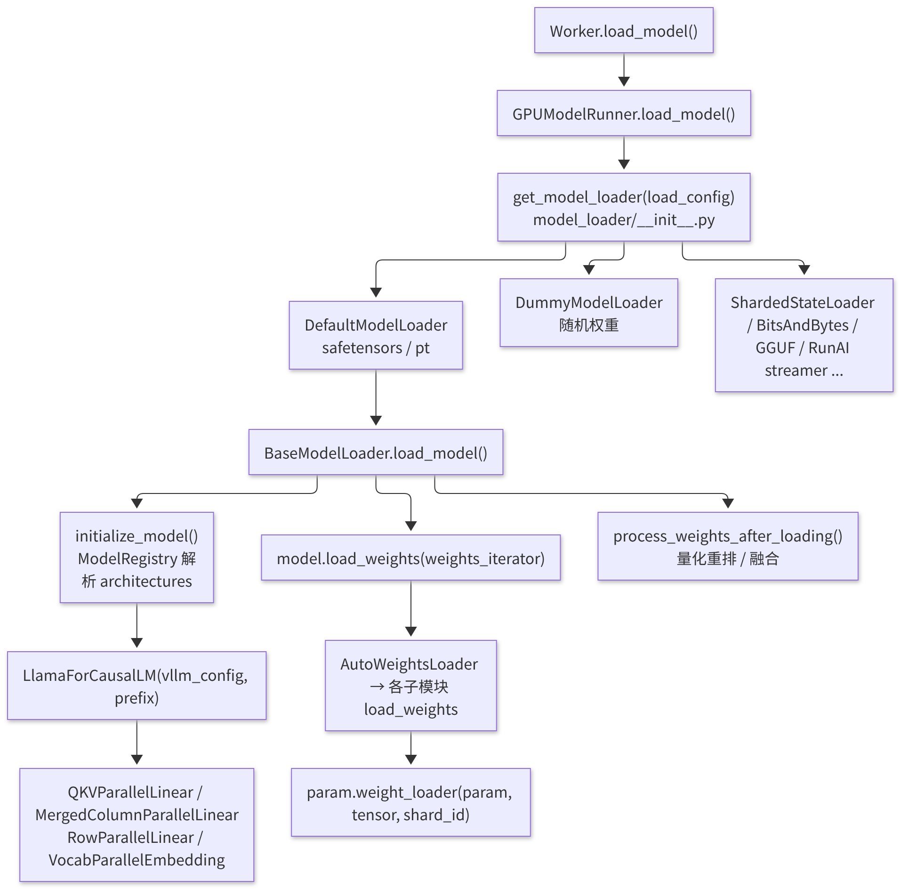
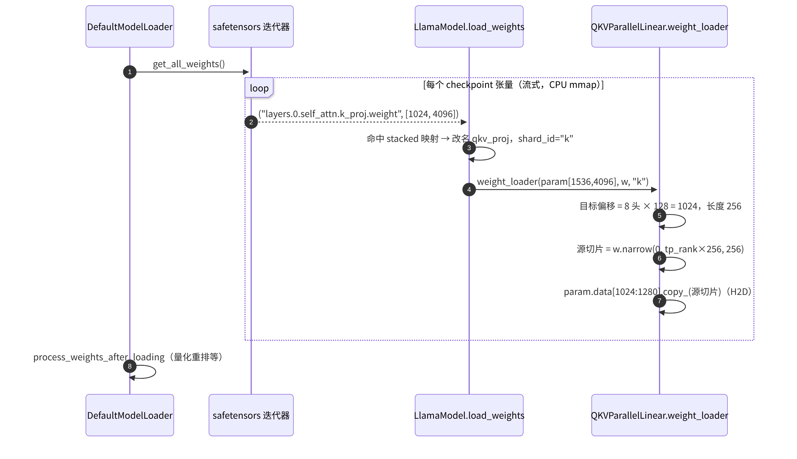

# B5 · ModelRunner 与权重加载

> **版本**：vLLM 0.30.x（V1 引擎）｜**模块**：B-运行时内核｜**对应原课**：第 6 课
> **导航**：上一课：[B4-PagedAttention] → **本课 B5** → 下一课：[B6-架构总览]
> **练习**：`exercises/B5_weight_loader_stub`｜**源码标注**：标有【待核】之处以 0.30.x tag 的源码为准。

## 0. 先修要求与学习目标

先修要求：B2（Worker 在握手过程中调用 `load_model`）；PyTorch 中 `nn.Module`、`nn.Parameter`、`state_dict` 的基本概念；对 safetensors 文件格式有初步了解。

完成本课学习后，学习者应能够：

1. 阐明 HF checkpoint 中的权重名称如何映射至 vLLM 模型中的参数，以及 q/k/v、gate/up 被"合并"的原因；
2. 按调用顺序复述 `GPUModelRunner.load_model → get_model_loader → BaseModelLoader.load_model → initialize_model → load_weights → process_weights_after_loading`；
3. 说明每个参数上挂载的 `weight_loader` 如何按张量并行（TP）rank 进行切片，并能手工计算各层的分片形状；
4. 了解权重加载完成后 ModelRunner 仍需完成的键值缓存（KV Cache）张量分配与绑定；
5. 能够使用 `--load-format dummy` 等手段，在缺少真实权重的条件下进行调试。

---

## 1. 动机：不能直接调用 `model.load_state_dict()` 的原因

HF Transformers 中的 Llama 具有三个独立的线性层 `q_proj`、`k_proj`、`v_proj`；vLLM 为减少 kernel 启动次数并增大 GEMM 规模，将它们合并为一个 `qkv_proj`，并将 `gate_proj`、`up_proj` 合并为 `gate_up_proj`。同时，在张量并行条件下，每个 rank 仅应持有完整权重的一个切片。此外，量化模型的 checkpoint 中存储的是 `qweight`、`scales`、`qzeros` 等形状完全不同的张量。因此，加载过程不可能是简单的"按名称对应、整块拷贝"，而须分为三步：**名称重映射 → 按 rank 切片 → 写入合并参数的正确偏移位置**。vLLM 的解决方案是"参数自带加载器"：每个 `nn.Parameter` 上挂载一个 `weight_loader` 函数，由该函数决定自身的切分方式与写入位置。

另一项动机涉及速度与显存。8B 模型约为 16 GB，70B 模型约为 140 GB。若先在 CPU 上构造完整的 state_dict 再行拷贝，CPU 内存峰值将翻倍；vLLM 因此采用**流式迭代**：逐个张量地从 safetensors（内存映射）中读出，立即切片并拷贝至 GPU，CPU 侧仅保留单个张量的临时副本。

## 2. 架构图：加载链路中的各个角色



<p align="center"><em>图1：权重加载链路中的角色：ModelRunner、ModelLoader、模型与 weight_loader</em></p>

## 3. 源码分析（按调用顺序）

1. `vllm/v1/worker/gpu_worker.py`：`Worker.load_model()` → `self.model_runner.load_model(eep_scale_up=...)`（同时处理 sleep 模式下的显存池上下文）。
2. `vllm/v1/worker/gpu_model_runner.py`：`GPUModelRunner.load_model()`：
   - `model_loader = get_model_loader(self.load_config)`；
   - `self.model = model_loader.load_model(vllm_config=self.vllm_config, model_config=self.model_config)`；
   - 若使用 LoRA，则执行 `self.model = self.load_lora_model(...)`；若使用投机解码，则执行 `self.drafter.load_model(self.model)`；
   - 记录 `self.model_memory_usage`，并在日志中打印 `Model loading took X GiB and Y seconds`；
   - 若启用 torch.compile / CUDA Graph，则包装 `CUDAGraphWrapper`（C2/C3）。
3. `vllm/model_executor/model_loader/base_loader.py`：`BaseModelLoader.load_model()`：
   - `with set_default_torch_dtype(model_config.dtype), target_device:` → `model = initialize_model(vllm_config=..., model_config=...)`：此时参数已在 GPU 上按**分片后的形状**分配完毕（为未初始化的空张量）；
   - `self.load_weights(model, model_config)`：在 `DefaultModelLoader` 中为 `weights_to_load = {name for name, _ in model.named_parameters()}`、`loaded = model.load_weights(self.get_all_weights(model_config, model))`，并检查是否存在未加载的参数（严格模式下报错）；
   - `process_weights_after_loading(model, model_config, target_device)`：遍历所有子模块，若存在 `quant_method`，则调用其 `process_weights_after_loading(module)`（D2），例如将 GPTQ 权重重排为 Marlin 格式、合并 fp8 scale；
   - `return model.eval()`。
4. `vllm/model_executor/model_loader/utils.py`：`initialize_model()` → `get_model_architecture(model_config)` → `ModelRegistry.resolve_model_cls(architectures)`（`vllm/model_executor/models/registry.py`；HF config 中的 `"architectures": ["LlamaForCausalLM"]` 映射至 `vllm/model_executor/models/llama.py` 中的同名类）。若 vLLM 不具备原生实现，可回退至 Transformers 后端实现。
5. `vllm/model_executor/model_loader/default_loader.py`：`DefaultModelLoader._prepare_weights()` 负责选择文件（优先选择 `*.safetensors`；存在 index 时仅读取所需的分片）；`_get_weights_iterator()` → `weight_utils.safetensors_weights_iterator()` 逐个 `yield (name, tensor)`；可选使用 `fastsafetensors` 与多线程加载。
6. `vllm/model_executor/models/llama.py`：`LlamaForCausalLM.load_weights()` → `AutoWeightsLoader(self, skip_prefixes=...)` → `LlamaModel.load_weights()`。其核心为 `stacked_params_mapping`：

```python
stacked_params_mapping = [
    # (vLLM 参数名片段, checkpoint 名片段, shard_id)
    (".qkv_proj", ".q_proj", "q"),
    (".qkv_proj", ".k_proj", "k"),
    (".qkv_proj", ".v_proj", "v"),
    (".gate_up_proj", ".gate_proj", 0),
    (".gate_up_proj", ".up_proj", 1),
]
# 对 checkpoint 中每个 (name, w)：命中映射则改名并调用
#   param.weight_loader(param, w, shard_id)
# 否则 weight_loader = getattr(param, "weight_loader", default_weight_loader)
```

7. `vllm/model_executor/layers/linear.py`：各并行线性层的 `weight_loader`（或新版的 `weight_loader_v2`，配合 `vllm/model_executor/parameter.py` 中的 `ModelWeightParameter` 等参数类使用）：
   - `ColumnParallelLinear.weight_loader`：`shard_size = param.shape[output_dim]`，`start = tp_rank × shard_size`，执行 `loaded_weight.narrow(output_dim, start, shard_size)` 后调用 `param.data.copy_()`；
   - `RowParallelLinear.weight_loader`：在 `input_dim` 上执行 narrow；
   - `MergedColumnParallelLinear.weight_loader(param, w, loaded_shard_id)`：先根据 shard_id 计算目标参数中的偏移（gate 在前、up 在后），再对源张量按 rank 切片；
   - `QKVParallelLinear.weight_loader`：q 的偏移为 0，k 的偏移为 `num_heads_per_rank × head_size`，v 位于其后；当 KV 头数小于 TP 大小时，按 `tp_rank // num_kv_head_replicas` 选择 KV 头（复制）。
8. `vllm/model_executor/layers/vocab_parallel_embedding.py`：`VocabParallelEmbedding` 与 `ParallelLMHead` 按词表维度切分，并将词表大小填充至 64 的倍数。
9. 加载完成后，执行 B2 中所述的 `initialize_from_config()` → `GPUModelRunner.initialize_kv_cache(kv_cache_config)`：`initialize_attn_backend()`、`_allocate_kv_cache_tensors()`（按块数分配原始 int8 缓冲区）、`_reshape_kv_cache_tensors()`（按后端的 `get_kv_cache_shape` 构造视图）、`bind_kv_cache()`（将每层的 KV 张量挂载至对应 `Attention` 模块的 `kv_cache` 属性，并记录于 `forward_context`）。


**参数在加载前即为"分片后形状"的原因**：`initialize_model` 在目标设备上直接按每个 rank 的切片形状分配参数，而非先分配完整矩阵再行切分。由此，每张卡自始至终仅占用其所属份额的显存：70B 模型在 TP=8 下每卡仅需约 17.5 GB 的权重空间，否则任何一张卡都无法容纳完整的 140 GB。这也意味着加载器获得的每个 checkpoint 张量都是"完整的"，切片操作必须在拷贝至参数之前完成——这正是 `weight_loader` 存在的根本原因。

## 4. 数值示例：Llama-3-8B 在 TP=4 下的分片形状

模型配置：hidden 为 4 096；32 个 Q 头、8 个 KV 头、head_dim 为 128；intermediate 为 14 336；词表大小为 128 256。PyTorch 线性层的权重形状为 `[out_features, in_features]`。

| 参数 | 完整形状 | 并行方式 | 每 rank 形状 | 说明 |
|---|---|---|---|---|
| `qkv_proj.weight` | [(32+8+8)×128, 4096] = [6144, 4096] | 列并行（dim0） | [1536, 4096] | 每 rank：8 个 Q 头（1024）+ 2 个 K 头（256）+ 2 个 V 头（256） |
| `o_proj.weight` | [4096, 4096] | 行并行（dim1） | [4096, 1024] | 输出需执行 all-reduce |
| `gate_up_proj.weight` | [2×14336, 4096] = [28672, 4096] | 列并行 | [7168, 4096] | 前 3584 行来自 gate，后 3584 行来自 up |
| `down_proj.weight` | [4096, 14336] | 行并行 | [4096, 3584] | 输出需执行 all-reduce |
| `embed_tokens.weight` | [128256, 4096] | 词表并行 | [32064, 4096] | 128256 已是 64 的倍数 |

**合并参数偏移的手工计算**：在 rank 1 上，`qkv_proj` 的 [1536, 4096] 中，第 0～1023 行来自 checkpoint `q_proj.weight` 的第 1024～2047 行；第 1024～1279 行来自 `k_proj.weight` 的第 256～511 行；第 1280～1535 行来自 `v_proj.weight` 的第 256～511 行。`gate_up_proj` 在 rank 1 上：第 0～3583 行来自 `gate_proj.weight` 的第 3584～7167 行，第 3584～7167 行来自 `up_proj.weight` 的同一区间。需注意，切片方式为"先按 shard_id 确定目标区段，再在源张量上按 rank 取切片"，**而非**将合并后的完整矩阵整体四等分——后一种做法将使 rank 0 获得全部 q 与部分 k，结果完全错误。

**KV 头复制**：若 TP=16 而 KV 头仅有 8 个，则每个 KV 头被复制到 2 个 rank 上（`num_kv_head_replicas = 2`），rank 0 与 rank 1 均持有 KV 头 0。此时 KV Cache 的总量并不随 TP 线性减少，在 B4 的显存估算中应考虑这一点。

**加载时间估算**：对于 16 GB 的权重，从本地 NVMe（约 3 GB/s）读取约需 5～6 s；从网络盘（约 300 MB/s）读取约需 55 s。TP=4 时，每个 rank 均须从完整文件中读取其所需的切片；safetensors 内存映射仅读取所需的字节范围，但列并行切片在行优先存储中是连续的，而行并行切片则为跨步读取，因此实际读取量可能接近整个文件。这正是 `ShardedStateLoader`（预先按 rank 存储分片）能够显著加速大模型启动的原因。

## 4.5 列并行与行并行成对出现的原因

练习仅要求实现两种切分方式，但必须理解二者总是成对使用的原因。以 MLP 为例：`gate_up_proj` 按输出维度切分（列并行），每个 rank 得到中间激活的一段；激活函数 SiLU 与逐元素乘法仅依赖本段数据，因此可在各 rank 上独立完成，无需通信。随后，`down_proj` 按输入维度切分（行并行），每个 rank 恰好持有与其所属中间激活段相乘所需的权重切片，所得结果为最终输出的一个**部分和**，最后通过一次 all-reduce 将各 rank 的部分和相加。整个 MLP 仅需通信一次。注意力模块同理：`qkv_proj` 采用列并行，使每个 rank 负责若干完整的注意力头；注意力计算本身按头独立进行；`o_proj` 采用行并行，之后再执行一次 all-reduce。

若顺序颠倒，即先行并行、后列并行，则中间激活须先执行 all-reduce 方可进入非线性函数，通信次数将翻倍。因此，"列并行 + 行并行"是张量并行的基本单元；关于每层两次 all-reduce 的通信代价分析，将在 E2 中详细展开。对于权重加载而言，这意味着：**列并行层在输出维度（dim 0）上切分，偏置亦须切分；行并行层在输入维度（dim 1）上切分，偏置不切分，仅由一个 rank 相加（或在 all-reduce 之后相加）**，这是自行实现时另一处常见的疏漏。

## 5. 加载数据流时序



<p align="center"><em>图2：权重加载数据流时序：从 safetensors 到按 TP 切片的参数</em></p>

## 6. 调试方法

- **`--load-format dummy`**：不读取文件，使用随机值初始化参数。适用于调试显存、并行拓扑与性能（输出不具有实际意义），启动仅需数秒。
- **小模型 + `--max-model-len 512` + `--enforce-eager`**：最快速的源码调试组合。
- **打印映射关系**：在 `load_weights` 的循环中临时打印 `(name, loaded_weight.shape, param.shape)`，即可直接识别名称未能匹配的条目。
- **未加载参数检查**：在严格模式下，加载结束时将报告未被任何 checkpoint 张量写入的参数名；新增模型时，这是最常见的提示信息。

## 6.5 GPUModelRunner 的状态构成

本课标题为"ModelRunner 与权重加载"，而权重仅是 ModelRunner 所持有状态中的一类。建立完整的状态构成图，有助于在 B6、F4 中理解每一步推理所读写的具体内容。按生命周期划分，GPUModelRunner 持有以下四类状态：

**第一类：启动时一次性构造、此后只读的状态。** 包括模型本身（权重）、注意力后端及其元数据构造器、采样器、投机解码的 drafter、LoRA 管理器，以及结构化输出所需的词表信息。这些状态在 `load_model` 与 `initialize_kv_cache` 中构造完成，运行期间不再变化（LoRA 权重可能被换入换出，但其容器保持不变）。

**第二类：启动时分配、运行时原地写入的大块显存。** 其中最重要的是每层的 KV Cache 张量，它占据了显存的绝大部分。其次是一组"持久输入缓冲区"：`input_ids`、`positions`、`query_start_loc`、`seq_lens`、`slot_mapping` 等，按 `max_num_batched_tokens` 或 `max_num_reqs` 的最大尺寸预先分配，且每个缓冲区通常同时具有 CPU 端（pinned 内存）与 GPU 端两份副本。这些缓冲区的地址固定不变，这一点对 CUDA Graph 至关重要：图捕获时记录的是指针，回放时仅能改写缓冲区的内容，而不能更换其地址（C2）。

**第三类：跨步保持的请求状态。** 即 `self.requests`（每个请求的 token、采样参数、块号等缓存信息）与 `InputBatch`（将当前活跃请求按"槽位"紧凑排列的批状态，包括块表、采样参数张量、惩罚计算所需的输出 token 计数等）。调度器仅发送增量，ModelRunner 利用这些状态将增量还原为完整视图。请求结束时须将其从批中移除并"压缩"槽位，这是 V1 ModelRunner 中最复杂、最易产生缺陷的部分，也是 F4 中 ModelRunner V2 重点重构的对象。

**第四类：每步临时产生的中间结果。** 包括注意力元数据、隐藏状态、logits 与采样结果。它们仅在单步之内存在。

掌握上述状态构成后即可看出，所谓"一步推理"在本质上是：利用第三类状态与调度增量填写第二类缓冲区；利用第一类中的模型与后端读写第二类中的 KV Cache，产生第四类结果；再将采样结果写回第三类状态。

## 6.6 实践：为 vLLM 新增模型所需修改的部分

将本课知识融会贯通的有效方式，是设想为一种新的类 Llama 架构添加支持。按顺序需完成以下五项工作：

1. **编写模型类**：在 `vllm/model_executor/models/` 下新建文件，使用 vLLM 的并行层（`QKVParallelLinear`、`MergedColumnParallelLinear`、`RowParallelLinear`、`VocabParallelEmbedding`）与统一的 `Attention` 层构建网络。构造函数统一接收 `vllm_config` 与 `prefix`，其中 `prefix` 用于使量化配置依据层名决定是否量化（D2）。
2. **实现 `load_weights`**：编写 `stacked_params_mapping`，处理特殊命名（例如需跳过旋转位置编码的缓存张量、处理共享词嵌入），并返回已加载参数名的集合，以便框架检查遗漏。
3. **注册架构**：在 `models/registry.py` 中将 HF 配置中的架构名映射至新模型类；亦可通过插件机制在外部包中注册，而无需修改 vLLM 源码。
4. **声明能力接口**：若支持 LoRA、PP、多模态等特性，则实现相应的接口协议（例如 `SupportsLoRA`、`SupportsPP`），框架据此决定是否允许启用这些特性。
5. **对齐验证**：使用相同的 prompt 与贪心解码，对比 HF Transformers 与 vLLM 的输出 token 及 logprobs；再在 TP=2 下重复一次，以发现切片错误。在 bf16 精度下，前数十个 token 应完全一致，此后可能因累积误差而出现分叉。

上述五步中，第 2 步与第 5 步最能检验对本课内容的理解：切片错误不会引发报错，仅会导致输出质量在无提示的情况下下降，唯有严格的对齐测试方能发现。

## 7. 常见问题与故障模式

1. **名称映射遗漏前缀**：例如，多模态模型的语言部分在 checkpoint 中命名为 `language_model.model.layers...`，需使用 `WeightsMapper` 进行前缀替换，否则所有参数均为"未加载"状态，输出为乱码。
2. **对合并参数整体切片**：自行实现模型时若对 `qkv_proj` 直接整体执行 narrow，各 rank 的 q/k/v 比例将发生错乱，模型能够运行但输出没有意义——此类缺陷不会报错，只能通过与 HF 输出对比来发现。
3. **`tie_word_embeddings`**：小模型通常共享词嵌入与 lm_head，checkpoint 中不包含 `lm_head.weight`，因此需跳过该名称并绑定参数。
4. **无法整除**：hidden 维度或头数无法被 TP 整除时将直接报错；词表维度则通过填充解决。练习中要求对无法整除的输入抛出 `ValueError`，正是对这一检查的模拟。
5. **量化模型遗漏调用 `process_weights_after_loading`**：权重格式仍为 checkpoint 的原始布局，kernel 读取到错误的布局，导致结果错误甚至非法内存访问。
6. **CPU 内存不足**：TP 多进程同时加载时，每个进程均在执行 mmap 与临时拷贝；若节点内存较小，进程将被 OOM killer 终止，表现为"Worker 无明显原因退出"。

## 8. 实践练习

- 目录：`exercises/B5_weight_loader_stub`
- 任务：实现 `shard_column_parallel(weight, tp_size, tp_rank)`（沿 dim=0 均分）与 `shard_row_parallel(weight, tp_size, tp_rank)`（沿 dim=1 均分）；无法整除或 rank 越界时应抛出错误。
- 运行方式：

```bash
python -m pytest exercises/B5_weight_loader_stub -q
```

- 验收标准：上述测试全部通过。
- 进阶任务：实现 `load_qkv_shard(q, k, v, tp_size, tp_rank)`，返回本 rank 的合并 qkv 切片；以第 4 节的数值（32/8/8 个头、head_dim 为 128、TP=4）编写测试，预期每 rank 切片形状为 [1536, 4096]；再测试 TP=16 时的 KV 头复制情形。

## 9. 自测题

- [ ] 能否写出 `stacked_params_mapping` 的含义，并解释"先按 shard_id 定位、再按 rank 切片"的原因
- [ ] 能否手工计算 Llama-3-8B 在 TP=4/8 下 qkv、o、gate_up、down 的每 rank 形状
- [ ] 能否陈述权重加载完成后 ModelRunner 初始化 KV Cache 的四个步骤

## 10. 延伸阅读

- 源码：`vllm/model_executor/model_loader/`、`vllm/model_executor/layers/linear.py`、`vllm/model_executor/parameter.py`、`vllm/model_executor/models/llama.py`、`vllm/model_executor/models/utils.py`（`AutoWeightsLoader`、`WeightsMapper`）
- vLLM 文档：Adding a New Model（新增模型指南）
- Megatron-LM 论文（张量并行线性层的列/行切分）

---

**课程导航**　上一课：[B4 · PagedAttention 与 KV Cache 显存管理](https://qcngm3vce6yt.feishu.cn/docx/OOo7d5yZvoKv2ZxauPOcBDOincb)｜下一课：[B6 · V1 架构总览与推理主路径](https://qcngm3vce6yt.feishu.cn/docx/FV3gdoLxEo55VtxFlnkc41Lhn6g)｜[返回索引](https://qcngm3vce6yt.feishu.cn/docx/KUn5dKSejoQSAJxaf7YcvNVDnCd)

相关章节：
- [B2 · Worker 与 Executor](https://qcngm3vce6yt.feishu.cn/docx/VnbqdbxnnojzIQxyLJCc0x5bnI2)——见本课「0. 先修要求与学习目标」：“先修要求：B2（Worker 在握手过程中调用 load_model）”
- [C2 · CUDA Graph](https://qcngm3vce6yt.feishu.cn/docx/HXw7ddUYQo9DaTxs9DzcJDwYnOc)——见本课「3. 源码分析（按调用顺序）」：“则包装 CUDAGraphWrapper（C2/C3）。”
- [D2 · vLLM 量化模块实践](https://qcngm3vce6yt.feishu.cn/docx/Dvaddy2dgowrRRxjwc2cWEpwnrh)——见本课「3. 源码分析（按调用顺序）」：“process_weights_after_loading(module)（D2），例如将 GPTQ 权重重排为 Marlin 格式”
