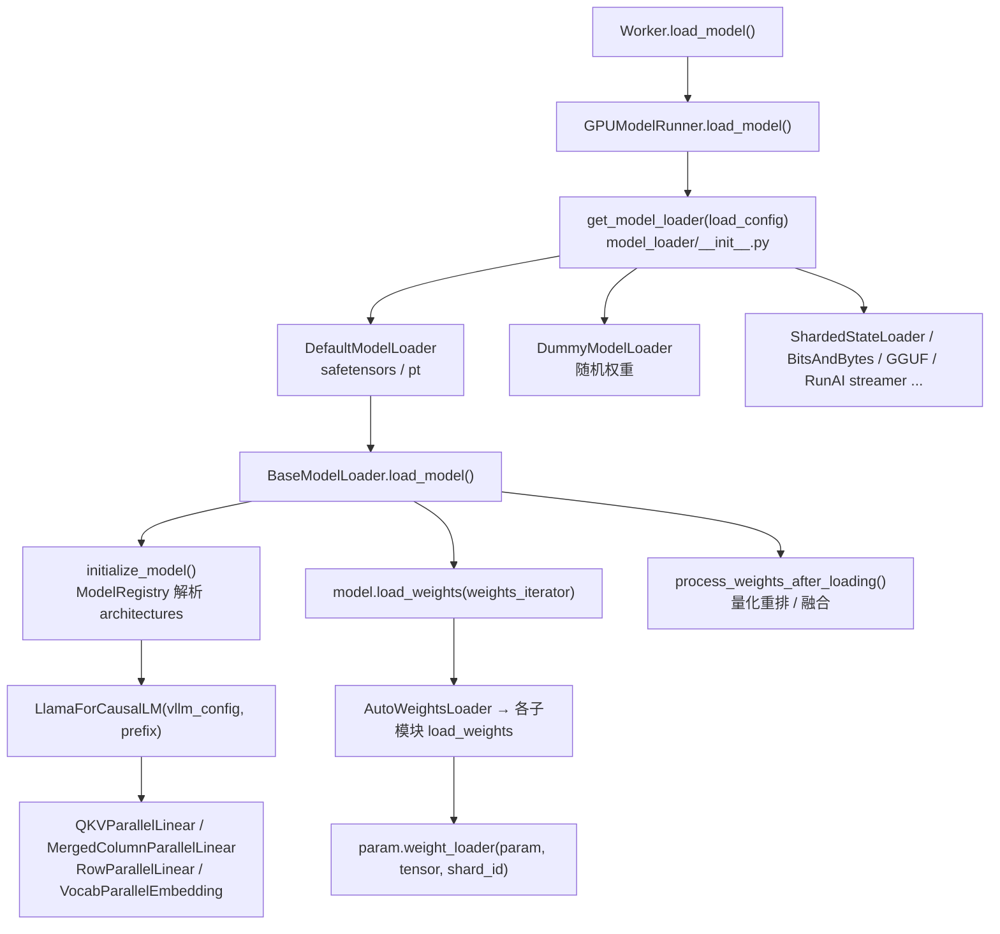
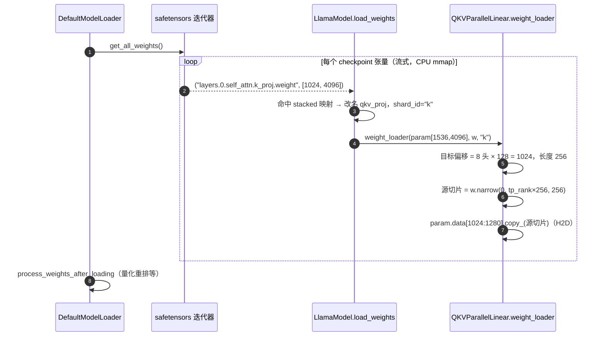

# B5 · ModelRunner 与权重加载（深度版）

> **版本**：vLLM 0.30.x（V1 引擎）｜**模块**：B-运行时内核｜**对应原课**：第 6 课
> **导航**：上一课：[B4-PagedAttention] → **本课 B5** → 下一课：[B6-架构总览]
> **练习**：`exercises/B5_weight_loader_stub`｜**源码标注**：标【待核】处以 0.30.x tag 为准。

## 0. 先修与本课目标

先修：B2（Worker 在握手中调用 `load_model`）；PyTorch `nn.Module`、`nn.Parameter`、`state_dict` 的基本概念；safetensors 文件格式的大致印象。

学完本课你应能：

1. 说清 HF checkpoint 中的权重名如何映射到 vLLM 模型中的参数，以及 q/k/v、gate/up 为什么会被"合并"；
2. 按调用顺序复述 `GPUModelRunner.load_model → get_model_loader → BaseModelLoader.load_model → initialize_model → load_weights → process_weights_after_loading`；
3. 理解每个参数上挂的 `weight_loader` 如何按 TP rank 切片，并能手算各层分片形状；
4. 知道权重加载后 ModelRunner 还要完成的 KV 张量分配与绑定；
5. 能用 `--load-format dummy` 等手段在没有真实权重的情况下调试。

---

## 1. 动机：为什么不能直接 `model.load_state_dict()`

HF Transformers 的 Llama 有独立的 `q_proj`、`k_proj`、`v_proj` 三个线性层；vLLM 为了少发 kernel、让 GEMM 更大，把它们合并成一个 `qkv_proj`，把 `gate_proj`、`up_proj` 合并成 `gate_up_proj`。同时在张量并行下，每个 rank 只应持有完整权重的一个切片。量化模型的 checkpoint 里存的又是 `qweight`、`scales`、`qzeros` 等完全不同形状的张量。因此加载不可能是简单的"名字对名字、整块拷贝"，而是三步：**名字重映射 → 按 rank 切片 → 写入合并参数的正确偏移**。vLLM 的解决方式是"参数自带加载器"：每个 `nn.Parameter` 上挂一个 `weight_loader` 函数，它最清楚自己该怎么切、写在哪。

另一个动机是速度与显存。8B 模型约 16 GB，70B 模型约 140 GB。如果先在 CPU 上把完整 state_dict 构造出来再拷贝，CPU 内存峰值会翻倍；vLLM 采用**流式迭代**：逐个张量从 safetensors（内存映射）读出，立即切片并拷到 GPU，CPU 侧只保留一个张量的临时副本。

## 2. 架构图：加载链路中的角色



## 3. 源码走读（调用顺序）

1. `vllm/v1/worker/gpu_worker.py`：`Worker.load_model()` → `self.model_runner.load_model(eep_scale_up=...)`（还会处理 sleep 模式的显存池上下文）。
2. `vllm/v1/worker/gpu_model_runner.py`：`GPUModelRunner.load_model()`：
   - `model_loader = get_model_loader(self.load_config)`；
   - `self.model = model_loader.load_model(vllm_config=self.vllm_config, model_config=self.model_config)`；
   - 如有 LoRA，`self.model = self.load_lora_model(...)`；如有投机解码，`self.drafter.load_model(self.model)`；
   - 记录 `self.model_memory_usage`，日志打印 `Model loading took X GiB and Y seconds`；
   - 若开启 torch.compile / CUDA Graph，包装 `CUDAGraphWrapper`（C2/C3）。
3. `vllm/model_executor/model_loader/base_loader.py`：`BaseModelLoader.load_model()`：
   - `with set_default_torch_dtype(model_config.dtype), target_device:` → `model = initialize_model(vllm_config=..., model_config=...)`：此时参数已在 GPU 上按**分片后的形状**分配好（未初始化的空张量）；
   - `self.load_weights(model, model_config)`：`DefaultModelLoader` 中为 `weights_to_load = {name for name, _ in model.named_parameters()}`，`loaded = model.load_weights(self.get_all_weights(model_config, model))`，并检查是否有未加载的参数（严格模式下报错）；
   - `process_weights_after_loading(model, model_config, target_device)`：遍历所有子模块，若有 `quant_method` 则调用其 `process_weights_after_loading(module)`（D2），例如把 GPTQ 权重重排为 Marlin 格式、把 fp8 scale 合并；
   - `return model.eval()`。
4. `vllm/model_executor/model_loader/utils.py`：`initialize_model()` → `get_model_architecture(model_config)` → `ModelRegistry.resolve_model_cls(architectures)`（`vllm/model_executor/models/registry.py`，HF config 中 `"architectures": ["LlamaForCausalLM"]` 映射到 `vllm/model_executor/models/llama.py` 的同名类）。若 vLLM 没有原生实现，可回退到 Transformers 后端实现。
5. `vllm/model_executor/model_loader/default_loader.py`：`DefaultModelLoader._prepare_weights()` 选文件（优先 `*.safetensors`，有 index 时只读需要的分片）；`_get_weights_iterator()` → `weight_utils.safetensors_weights_iterator()` 逐个 `yield (name, tensor)`；可选 `fastsafetensors`、多线程加载。
6. `vllm/model_executor/models/llama.py`：`LlamaForCausalLM.load_weights()` → `AutoWeightsLoader(self, skip_prefixes=...)` → `LlamaModel.load_weights()`。核心是 `stacked_params_mapping`：

```python
stacked_params_mapping = [
    # (vLLM 参数名片段, checkpoint 名片段, shard_id)
    (".qkv_proj", ".q_proj", "q"),
    (".qkv_proj", ".k_proj", "k"),
    (".qkv_proj", ".v_proj", "v"),
    (".gate_up_proj", ".gate_proj", 0),
    (".gate_up_proj", ".up_proj", 1),
]
# 对 checkpoint 中每个 (name, w)：命中映射则改名并调用
#   param.weight_loader(param, w, shard_id)
# 否则 weight_loader = getattr(param, "weight_loader", default_weight_loader)
```

7. `vllm/model_executor/layers/linear.py`：各并行线性层的 `weight_loader`（或新版 `weight_loader_v2` 搭配 `vllm/model_executor/parameter.py` 中的 `ModelWeightParameter` 等参数类）：
   - `ColumnParallelLinear.weight_loader`：`shard_size = param.shape[output_dim]`，`start = tp_rank × shard_size`，`loaded_weight.narrow(output_dim, start, shard_size)` 后 `param.data.copy_()`；
   - `RowParallelLinear.weight_loader`：在 `input_dim` 上 narrow；
   - `MergedColumnParallelLinear.weight_loader(param, w, loaded_shard_id)`：先根据 shard_id 算出目标参数中的偏移（gate 在前、up 在后），再对源张量按 rank 切片；
   - `QKVParallelLinear.weight_loader`：q 的偏移为 0，k 的偏移为 `num_heads_per_rank × head_size`，v 再往后；当 KV 头数小于 TP 大小时，按 `tp_rank // num_kv_head_replicas` 选择 KV 头（复制）。
8. `vllm/model_executor/layers/vocab_parallel_embedding.py`：`VocabParallelEmbedding` 与 `ParallelLMHead` 按词表维切分，并把词表大小填充到 64 的倍数。
9. 加载完成后，B2 中的 `initialize_from_config()` → `GPUModelRunner.initialize_kv_cache(kv_cache_config)`：`initialize_attn_backend()`、`_allocate_kv_cache_tensors()`（按块数分配原始 int8 缓冲）、`_reshape_kv_cache_tensors()`（按后端的 `get_kv_cache_shape` 视图化）、`bind_kv_cache()`（把每层的 KV 张量挂到对应 `Attention` 模块的 `kv_cache` 属性上，并记录到 `forward_context`）。


**为什么参数在加载前就是"分片后形状"**：`initialize_model` 在目标设备上直接按每个 rank 的切片形状分配参数，而不是先分配完整矩阵再切。这样每张卡从一开始就只占自己那份显存，70B 模型在 TP=8 下每卡只需约 17.5 GB 的权重空间，否则任何一张卡都放不下完整的 140 GB。这也意味着加载器拿到的每个 checkpoint 张量都是"完整的"，切片动作必须发生在拷贝进参数之前——这正是 `weight_loader` 存在的根本原因。

## 4. 数字例子：Llama-3-8B 在 TP=4 下的分片形状

模型配置：hidden 4 096；32 个 Q 头、8 个 KV 头、head_dim 128；intermediate 14 336；词表 128 256。PyTorch 线性层权重形状是 `[out_features, in_features]`。

| 参数 | 完整形状 | 并行方式 | 每 rank 形状 | 说明 |
|---|---|---|---|---|
| `qkv_proj.weight` | [(32+8+8)×128, 4096] = [6144, 4096] | 列并行（dim0） | [1536, 4096] | 每 rank：8 个 Q 头（1024）+ 2 个 K 头（256）+ 2 个 V 头（256） |
| `o_proj.weight` | [4096, 4096] | 行并行（dim1） | [4096, 1024] | 输出需 all-reduce |
| `gate_up_proj.weight` | [2×14336, 4096] = [28672, 4096] | 列并行 | [7168, 4096] | 前 3584 行来自 gate，后 3584 行来自 up |
| `down_proj.weight` | [4096, 14336] | 行并行 | [4096, 3584] | 输出需 all-reduce |
| `embed_tokens.weight` | [128256, 4096] | 词表并行 | [32064, 4096] | 128256 已是 64 的倍数 |

**合并参数的偏移手算**：rank 1 上 `qkv_proj` 的 [1536, 4096] 中，行 0～1023 来自 checkpoint `q_proj.weight` 的第 1024～2047 行；行 1024～1279 来自 `k_proj.weight` 的第 256～511 行；行 1280～1535 来自 `v_proj.weight` 的第 256～511 行。`gate_up_proj` 在 rank 1 上：行 0～3583 来自 `gate_proj.weight` 的第 3584～7167 行，行 3584～7167 来自 `up_proj.weight` 的同一区间。注意切片是"先按 shard_id 找到目标区段，再在源张量上按 rank 取片"，**不是**把合并后的完整矩阵整体四等分——后者会让 rank 0 拿到全部 q 和一部分 k，结果完全错误。

**KV 头复制**：若 TP=16 而 KV 头只有 8 个，每个 KV 头复制到 2 个 rank 上（`num_kv_head_replicas = 2`），rank 0、1 都持有 KV 头 0。此时 KV Cache 总量并不随 TP 线性减少，这在 B4 的显存估算中要考虑。

**加载时间估算**：16 GB 权重，从本地 NVMe（约 3 GB/s）读取约 5～6 s；从网络盘（约 300 MB/s）读取约 55 s；TP=4 时每个 rank 都要读完整文件中自己需要的切片，safetensors 内存映射只读取所需的字节范围，但列并行切片在行优先存储中是连续的，行并行切片则是跨步读取，实际读取量可能接近全文件。这就是 `ShardedStateLoader`（预先按 rank 存好分片）在大模型上能显著加速启动的原因。

## 4.5 列并行与行并行为什么要成对出现

练习只要求你实现两种切法，但必须理解它们为什么总是成对使用。以 MLP 为例：`gate_up_proj` 按输出维切（列并行），每个 rank 得到中间激活的一段，激活函数 SiLU 与逐元素乘法只依赖本段数据，可以在各 rank 上独立完成，不需要通信；随后 `down_proj` 按输入维切（行并行），每个 rank 正好拿着与自己那段中间激活相乘所需的权重切片，得到的是最终输出的一个**部分和**，最后通过一次 all-reduce 把各 rank 的部分和相加。整个 MLP 只通信一次。注意力块同理：`qkv_proj` 列并行使每个 rank 负责若干完整的注意力头，注意力计算本身按头独立，`o_proj` 行并行后再做一次 all-reduce。

如果反过来先行并行再列并行，中间激活就需要先 all-reduce 才能进入非线性函数，通信次数翻倍。所以"列并行 + 行并行"是张量并行的基本单元，每层两次 all-reduce 的通信代价分析放在 E2 详细展开。对于权重加载而言，这意味着：**列并行层在输出维（dim 0）切，偏置也要切；行并行层在输入维（dim 1）切，偏置不切，只由一个 rank 加（或在 all-reduce 之后加）**，这是自己实现时另一个常见疏漏。

## 5. 加载数据流时序



## 6. 调试技巧

- **`--load-format dummy`**：不读文件，用随机值初始化参数。适合调试显存、并行拓扑、性能（输出无意义），启动只需几秒。
- **小模型 + `--max-model-len 512` + `--enforce-eager`**：最快的源码调试组合。
- **打印映射**：在 `load_weights` 的循环里临时打印 `(name, loaded_weight.shape, param.shape)`，一眼看出哪个名字没对上。
- **未加载参数检查**：严格模式下，加载结束会报出未被任何 checkpoint 张量写入的参数名；新增模型时，这是最常见的提示。

## 6.5 GPUModelRunner 的"状态版图"

本课标题是"ModelRunner 与权重加载"，权重只是 ModelRunner 持有的状态之一。建立一张完整的版图，有助于你在 B6、F4 中理解每一步推理到底读写了哪些东西。按生命周期划分，GPUModelRunner 持有四类状态：

**第一类：启动时一次性构造、之后只读的状态。** 包括模型本身（权重）、注意力后端及其元数据构造器、采样器、投机解码的 drafter、LoRA 管理器、结构化输出所需的词表信息。这些在 `load_model` 与 `initialize_kv_cache` 中完成，运行期不再变化（LoRA 权重可能被换入换出，但容器不变）。

**第二类：启动时分配、运行时原地写入的大块显存。** 最重要的是每层的 KV Cache 张量，它占据了显存的绝大部分。其次是一组"持久输入缓冲区"：`input_ids`、`positions`、`query_start_loc`、`seq_lens`、`slot_mapping` 等，按 `max_num_batched_tokens` 或 `max_num_reqs` 的最大尺寸预先分配，并且每个缓冲区通常同时有 CPU 端（pinned 内存）与 GPU 端两份。它们地址固定，这一点对 CUDA Graph 至关重要：图捕获时记录的是指针，回放时只能改写缓冲区的内容而不能换地址（C2）。

**第三类：跨步保持的请求状态。** 即 `self.requests`（每个请求的 token、采样参数、块号等缓存信息）与 `InputBatch`（把当前活跃请求按"槽位"紧凑排列的批状态，包括块表、采样参数张量、惩罚所需的输出 token 计数等）。调度器只发增量，ModelRunner 用这些状态把增量还原为完整视图。请求结束时要从批中移除并"压缩"槽位，这是 V1 ModelRunner 中最复杂、最容易出 bug 的部分，也是 F4 中 ModelRunner V2 重点重构的对象。

**第四类：每步临时产生的中间结果。** 注意力元数据、隐藏状态、logits、采样结果。它们只在一步之内存在。

记住这张版图后，你会发现所谓"一步推理"本质上是：用第三类状态和调度增量，填写第二类缓冲区；用第一类的模型与后端，读写第二类中的 KV Cache，产生第四类结果；再把采样结果写回第三类状态。

## 6.6 实战：给 vLLM 新增一个模型要动哪些地方

把本课知识串起来的最好方式，是想象你要为一个新的类 Llama 架构添加支持。按顺序需要做五件事：

1. **写模型类**：在 `vllm/model_executor/models/` 下新建文件，用 vLLM 的并行层（`QKVParallelLinear`、`MergedColumnParallelLinear`、`RowParallelLinear`、`VocabParallelEmbedding`）和统一的 `Attention` 层搭建网络。构造函数统一接收 `vllm_config` 与 `prefix`，`prefix` 用于让量化配置根据层名决定是否量化（D2）。
2. **实现 `load_weights`**：写好 `stacked_params_mapping`，处理特殊命名（如旋转位置编码的缓存张量需要跳过、共享词嵌入），返回已加载参数名集合，方便框架检查遗漏。
3. **注册架构**：在 `models/registry.py` 中把 HF 配置里的架构名映射到你的类；也可以通过插件机制在外部包中注册，不必修改 vLLM 源码。
4. **声明能力接口**：若支持 LoRA、PP、多模态等，实现对应的接口协议（例如 `SupportsLoRA`、`SupportsPP`），框架据此决定是否允许开启这些特性。
5. **对齐验证**：用同一 prompt、贪心解码，对比 HF Transformers 与 vLLM 的输出 token 与 logprobs；再在 TP=2 下重复一次，以发现切片错误。数值上 bf16 下前几十个 token 应完全一致，后续因累积误差可能出现分叉。

这五步中，第 2 步和第 5 步最能检验你对本课的理解：切片写错不会报错，只会让输出悄悄变差，只有严格的对齐测试能发现。

## 7. 常见坑 / 故障模式

1. **名字映射漏掉前缀**：例如多模态模型的语言部分在 checkpoint 中叫 `language_model.model.layers...`，需要 `WeightsMapper` 做前缀替换，否则参数全部"未加载"，输出乱码。
2. **合并参数整体切片**：自己实现模型时对 `qkv_proj` 直接整体 narrow，各 rank 的 q/k/v 比例错乱，模型能跑但输出无意义——这类 bug 不会报错，只能靠对比 HF 输出发现。
3. **`tie_word_embeddings`**：小模型常共享词嵌入与 lm_head，checkpoint 中没有 `lm_head.weight`，需要跳过该名并绑定参数。
4. **不能整除**：hidden 或头数不能被 TP 整除时直接报错；词表维度通过填充解决。练习中对不能整除的输入要求抛 `ValueError`，正是在模拟这一检查。
5. **量化模型漏调 `process_weights_after_loading`**：权重格式仍是 checkpoint 原始布局，kernel 读到错误布局，结果错误甚至非法访问。
6. **CPU 内存不足**：TP 多进程同时加载，每个进程都在 mmap 和临时拷贝，节点内存小时会被 OOM killer 杀掉，看起来像"Worker 莫名退出"。

## 8. 动手练习

- 目录：`exercises/B5_weight_loader_stub`
- 任务：实现 `shard_column_parallel(weight, tp_size, tp_rank)`（沿 dim=0 均分）与 `shard_row_parallel(weight, tp_size, tp_rank)`（沿 dim=1 均分），不能整除或 rank 越界时报错。
- 运行：

```bash
python -m pytest exercises/B5_weight_loader_stub -q
```

- 进阶：实现 `load_qkv_shard(q, k, v, tp_size, tp_rank)`，返回本 rank 的合并 qkv 切片；用第 4 节的数字（32/8/8 头、head_dim 128、TP=4）写测试，再测试 TP=16 的 KV 头复制情形。

## 9. 自测清单

- [ ] 我能写出 `stacked_params_mapping` 的含义，并解释为什么"先按 shard_id 定位，再按 rank 切片"
- [ ] 我能手算 Llama-3-8B 在 TP=4/8 下 qkv、o、gate_up、down 的每 rank 形状
- [ ] 我能说出权重加载完成后 ModelRunner 初始化 KV Cache 的四个步骤

## 10. 延伸阅读

- 源码：`vllm/model_executor/model_loader/`、`vllm/model_executor/layers/linear.py`、`vllm/model_executor/parameter.py`、`vllm/model_executor/models/llama.py`、`vllm/model_executor/models/utils.py`（`AutoWeightsLoader`、`WeightsMapper`）
- vLLM 文档：Adding a New Model（新增模型指南）
- Megatron-LM 论文（张量并行线性层的列/行切分）
