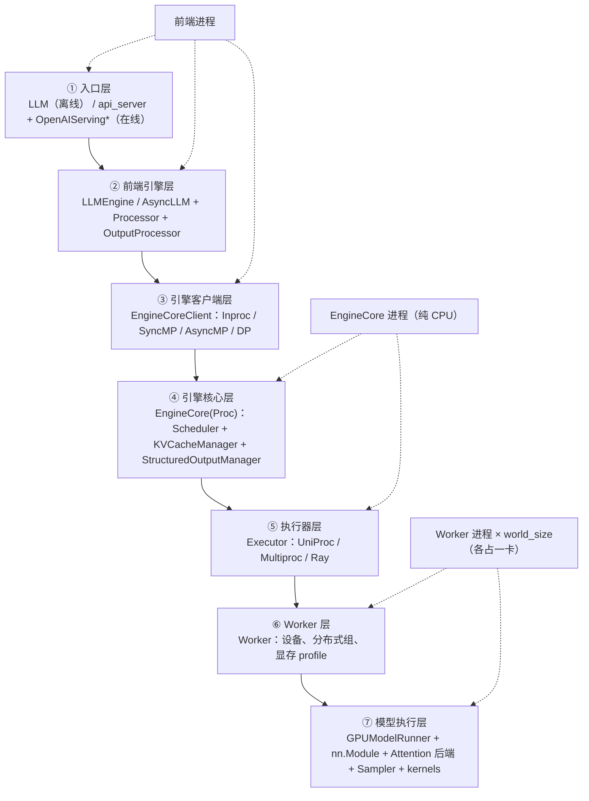
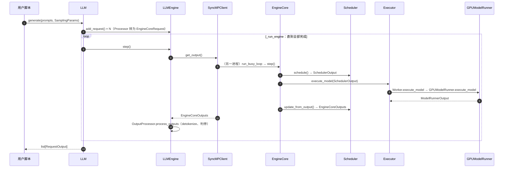

# B6 · V1 架构总览与推理主路径（深度版）

> **版本**：vLLM 0.30.x（V1 引擎）｜**模块**：B-运行时内核｜**对应原课**：第 7 课
> **导航**：上一课：[B5-ModelRunner加载] → **本课 B6** → 下一课：[C1-Triton算子]
> **练习**：本课无独立目录，用模块 B 全部练习做综合回归（见第 9 节）｜**源码标注**：标【待核】处以 0.30.x tag 为准。

## 0. 先修与本课目标

先修：B1～B5 全部内容。本课不引入新组件，而是把前五课串成一条完整的主路径，并补上前面刻意跳过的最核心环节：**`GPUModelRunner.execute_model()` 内部一步推理到底做了什么**。

学完本课你应能：

1. 默写 V1 的七层结构，并说出每层的输入、输出与所在进程；
2. 跟踪一个请求从 `LLM.generate()` 到返回文本，跨越的全部关键方法（约 25 个）；
3. 手算一个混合批次（新 prefill + chunked prefill + decode）被"压平"后的 `input_ids`、`positions`、`query_start_loc`、`seq_lens`、`slot_mapping`、`logits_indices`；
4. 解释 V1 相比 V0 的五个关键设计变化，以及每个变化解决的问题；
5. 在读到任何新特性的代码时，能迅速判断它挂在七层中的哪一层。

---

## 1. 动机：为什么需要一张"全景图"

前五课分别深入了引擎进程模型、执行器、调度器、KV 管理、权重加载。每一课单独看都不难，但读源码时真正的困难在于：一个变量从哪里来、到哪里去，往往跨越三四个文件和两个进程。例如 `num_computed_tokens` 在调度器中被乐观更新，经 `SchedulerOutput` 传到 Worker，在 ModelRunner 中变成 `positions` 与 `seq_lens`，再被注意力后端用于决定读多少 KV。没有全景图，就很容易在某一层迷路。本课的目标就是给出这张图，并用一组具体数字把它"跑一遍"。

## 2. 七层结构



每层只与相邻层对话，交换的数据结构是固定的：

| 边界 | 下行数据 | 上行数据 |
|---|---|---|
| ②→④（经③） | `EngineCoreRequest`（token id + 采样参数） | `EngineCoreOutputs`（新 token id、完成原因、logprobs） |
| ④→⑦（经⑤⑥） | `SchedulerOutput`（每请求本步 token 数、新块号） | `ModelRunnerOutput`（采样 token、logprobs、投机草稿） |
| ⑦ 内部 | 张量：input_ids、positions、attn_metadata | hidden_states → logits → sampled ids |

**记忆口诀**：前端管字符串，核心管账本，执行器管进程，Worker 管设备，ModelRunner 管张量。

## 3. 一个请求的端到端旅程（离线路径）



在线路径只是把 ①② 换成 api_server 与 AsyncLLM，把同步拉取换成后台 `output_handler`（B1）。

## 4. 主路径核心：GPUModelRunner.execute_model 一步做什么

这是整个系统最"热"的函数，每一步都要执行。按调用顺序（`vllm/v1/worker/gpu_model_runner.py`）：

1. **`_update_states(scheduler_output)`**：删除已完成请求（`finished_req_ids`）；为 `scheduled_new_reqs` 建 `CachedRequestState` 并加入 `InputBatch`；对 `scheduled_cached_reqs` 追加新块号、更新 `num_computed_tokens`、处理从抢占中恢复的请求；最后压缩 InputBatch 的空槽位。
2. **`_prepare_inputs(scheduler_output)`**：在 CPU（numpy）上为本步全部 token 计算 `positions`、`input_ids`（从 token_ids_cpu 中按索引 gather）、`query_start_loc`、`seq_lens`、`slot_mapping`（调用块表的 `compute_slot_mapping`），然后异步拷贝到 GPU 持久缓冲区；同时算出 `logits_indices`（每个请求最后一个位置，投机解码时还包括草稿位置）。
3. **构造注意力元数据**：对每个 KV cache group，`attn_metadata_builder.build(common_prefix_len, common_attn_metadata)` 产出后端专用元数据（例如 FlashAttention 的 `cu_seqlens_q`、`max_seq_len`、`block_table`）。
4. **决定 padding 与 CUDA Graph 模式**：`num_input_tokens` 按捕获尺寸向上取整；`cudagraph_dispatcher.dispatch(BatchDescriptor(...))` 选 FULL / PIECEWISE / NONE（C2）。【待核：0.30.x 中 dispatch 的签名】
5. **前向**：`with set_forward_context(attn_metadata, vllm_config, num_tokens=..., cudagraph_runtime_mode=..., batch_descriptor=...):` → `hidden_states = self.model(input_ids, positions, intermediate_tensors, inputs_embeds)`。每个 `Attention` 层从 forward context 取元数据与本层 KV Cache，先 `reshape_and_cache` 写入新 K/V，再计算注意力。
6. **PP 非最后一段**：直接返回 `IntermediateTensors`（E2）。
7. **logits**：`sample_hidden_states = hidden_states[logits_indices]`；`logits = self.model.compute_logits(sample_hidden_states)`（lm_head + 可能的 TP all-gather）。
8. **结构化输出**：若有语法约束，`apply_grammar_bitmask` 把不合法 token 的 logits 置为 −inf。
9. **采样**：`sampler_output = self.sampler(logits, sampling_metadata)`（F1）；投机解码时改走 `rejection_sampler`。
10. **收尾**：把采样结果写回 InputBatch 的 token 缓冲；如有投机解码，`drafter.propose(...)` 生成下一步草稿；构造 `ModelRunnerOutput`（`req_ids`、`sampled_token_ids`、`logprobs`、`spec_token_ids`、`prompt_logprobs_dict` 等）。【待核：新版本中第 7～10 步可能被拆入单独的 `sample_tokens()`，以配合异步调度】


**一个读源码的建议路线**：第一遍只读"主干"，即本课第 3、4 节列出的方法，遇到特性分支（LoRA、多模态、投机、PD、结构化输出）一律跳过；第二遍挑一个你关心的特性，沿着七层自上而下追它在每层的改动；第三遍再看性能相关的细节（持久缓冲、异步拷贝、图捕获）。按这个顺序，几千行的 `gpu_model_runner.py` 也能在一两天内读出主线。

## 5. 数字例子：把一个混合批次"压平"

V1 中所有请求的 token 被拼成**一维**序列，没有 padding 到相同长度的二维批。设 block_size=4（为了好算），本步调度：

- **R0**：新请求，prompt 5 token `[11,12,13,14,15]`，前缀无命中，本步全算，`num_computed=0`，块表 `[3, 8]`；
- **R1**：chunked prefill，prompt 共 10 token，已算 4，本步算 3 个（位置 4,5,6），块表 `[5, 2]`；
- **R2**：decode，已有 6 token（已算 6），本步算 1 个新 token（位置 6），块表 `[7, 1]`。

本步 `total_num_scheduled_tokens = 5 + 3 + 1 = 9`。压平结果：

| 索引 | 0 | 1 | 2 | 3 | 4 | 5 | 6 | 7 | 8 |
|---|---|---|---|---|---|---|---|---|---|
| 所属请求 | R0 | R0 | R0 | R0 | R0 | R1 | R1 | R1 | R2 |
| positions | 0 | 1 | 2 | 3 | 4 | 4 | 5 | 6 | 6 |
| slot_mapping | 12 | 13 | 14 | 15 | 32 | 8 | 9 | 10 | 6 |

slot 计算举例：R0 位置 4 → 块表第 1 项（8）→ 8×4+0 = 32；R1 位置 4 → 块表第 1 项（2）→ 2×4+0 = 8；R2 位置 6 → 块表第 1 项（1）→ 1×4+2 = 6。

- `query_start_loc = [0, 5, 8, 9]`（每个请求本步 query 在一维序列中的起点，最后一项为总数）；
- `seq_lens = [5, 7, 7]`（计算后的总上下文长度：R0 为 0+5，R1 为 4+3，R2 为 6+1）；
- `logits_indices = [4, 7, 8]`（每个请求最后一个位置）。注意 R1 的 chunk 还没到 prompt 末尾，它的 logits 会被算出但采样结果被丢弃（调度器知道这是部分 prefill，不会把采样 token 追加给它）；
- 若 CUDA Graph 捕获尺寸为 [1,2,4,8,16]，9 个 token 会被 pad 到 16（PIECEWISE 模式下只有非注意力部分走图）。

这张表就是注意力后端看到的全部输入：同一个 kernel 调用里，R0 做的是"5 个 query 看 5 个 key"的因果注意力，R1 是"3 个 query 看 7 个 key"，R2 是"1 个 query 看 7 个 key"。**prefill 与 decode 在 V1 里只是 query 长度不同的同一种计算**，这也是 B3 中调度器不必区分二者的底层原因。

## 5.5 Forward Context：注意力层如何"隐式"拿到元数据

细心的同学会发现，模型的 `forward(input_ids, positions, ...)` 签名里根本没有注意力元数据和 KV Cache，那每个 `Attention` 层是怎么知道该读写哪些块的？答案是 **forward context**（`vllm/forward_context.py`）：ModelRunner 在调用模型前用 `set_forward_context(...)` 把本步的注意力元数据、各层 KV Cache 的引用、batch 描述等放进一个全局（线程局部）上下文；`Attention` 层在前向时通过 `get_forward_context()` 按自己的层名取出对应元数据与缓存。

这样设计有两个好处。其一，模型代码保持与 HF 相近的简洁签名，新增模型时不需要层层传递元数据。其二，也是更关键的：在 torch.compile 下，注意力被注册为一个自定义算子（`unified_attention_with_output` 之类），编译器只看到"一个不透明的算子调用"，元数据不进入计算图，因此图的结构与具体批次的序列长度无关，可以被缓存并复用（C3）。代价是"隐式全局状态"让调试变难：如果你在 forward context 之外单独调用模型（例如自己写测试），注意力层会因取不到上下文而报错。

## 5.6 一步耗时拆账：CPU 与 GPU 各占多少

以 8B 模型、H100、batch 为 128 个 decode 请求、平均上下文 2 000 token 为例，给出一个量级参考，帮助你建立"哪里值得优化"的直觉：

| 环节 | 位置 | 量级 | 备注 |
|---|---|---|---|
| `schedule()` | EngineCore CPU | 0.3～1 ms | 与请求数近似线性 |
| 广播 SchedulerOutput | 共享内存 | 0.05～0.1 ms | B2 |
| `_update_states` + `_prepare_inputs` | Worker CPU | 0.5～1.5 ms | numpy 向量化后仍不可忽略 |
| H2D 拷贝输入 | PCIe/异步 | 0.05 ms | 数据量仅几十 KB |
| 前向（权重读取主导） | GPU | 约 5～6 ms | 16 GB 权重 / 3.35 TB/s ≈ 4.8 ms 的下界 |
| 注意力 KV 读取 | GPU | 3～10 ms | 随平均上下文线性增长，见下文计算 |
| 采样 + D2H | GPU/CPU | 0.2～0.5 ms | 需要同步 |
| `update_from_output` | EngineCore CPU | 0.3～0.8 ms | |

关于 KV 读取量：128 个请求 × 2 000 token × 每 token 128 KiB ≈ 31.25 GiB，按 3.35 TB/s 需要约 10 ms——这比读权重还多！这个计算揭示了长上下文 decode 的本质：**batch 大、上下文长时，瓶颈从读权重转移到读 KV**。表中下限 3 ms 对应平均上下文约 600 token（3 ms × 3.35 TB/s ≈ 10 GB，再除以 128 个请求与每 token 128 KiB），读者可以自行改数复算。这也是 fp8 KV Cache、GQA/MLA、稀疏注意力等技术的根本价值：减少每步必须搬运的字节数。

从拆账中还能看出：CPU 部分合计约 1.5～4 ms，若与 GPU 串行，会占一步总时间的 15%～30%。这正是异步调度、ModelRunner V2（F4）以及 CUDA Graph（C2，减少 kernel 启动开销）要解决的问题。

## 5.7 后续模块在全景图中的位置

有了七层图，后面四个模块的位置一目了然：模块 C（Triton 算子、CUDA Graph、torch.compile）全部发生在第 ⑦ 层内部，目标是让同样的计算更快；模块 D（量化）横跨第 ⑦ 层的权重加载与线性层计算，同时通过 KV dtype 影响第 ④ 层的块数；模块 E（数据、张量、流水、专家并行）改变的是第 ③⑤⑥ 层的拓扑，DP 在第 ③ 层复制引擎，TP/PP/EP 在第 ⑤⑥⑦ 层切分模型；模块 F 的采样与投机解码在第 ④⑦ 层协作，性能分析贯穿所有层，PD 分离在第 ④ 层（调度侧 connector）和第 ⑦ 层（传输侧 connector）各开一个接口。学习后续课程时，建议每学一课就回到这张图上标注一次。

## 6. V1 相对 V0 的五个关键设计变化

1. **进程拆分**：前端与 EngineCore 分进程（B1），消除 CPU 后处理对 GPU 的阻塞。
2. **统一调度抽象**：只有 `num_computed_tokens`，chunked prefill、前缀缓存、投机解码统一表达（B3）。
3. **增量式调度输出 + 持久批**：调度器只发增量，Worker 维护 `InputBatch` 持久状态，每步通信量与 CPU 开销都大幅降低（B5、F4）。
4. **前缀缓存默认开启且近乎零开销**：O(1) 的空闲队列与延迟驱逐，即使命中率为 0 也几乎不损失性能（B4）。
5. **编译与图优先**：torch.compile 分段编译 + 分段 CUDA Graph 默认开启，注意力作为分割点保持灵活性（C2、C3）。

## 6.5 设计问答

**问：为什么调度器不直接下发完整的 input_ids，而让 Worker 自己拼？** 因为 decode 请求每步只新增一个 token，若每步都重发完整上下文，数百个请求的 token 列表会让消息体积放大上千倍。增量协议让 SchedulerOutput 通常只有几十 KB，而 Worker 端的持久状态负责还原完整视图。代价是两端状态必须严格一致，任何不同步都会导致错误的 positions 或 slot，这也是为什么抢占恢复、请求结束等路径都要显式通知 Worker。

**问：为什么要把所有请求压成一维而不是 padding 成二维？** 二维 padding 会让短请求浪费大量计算（与最长请求对齐），在混合 prefill 与 decode 的批次中浪费尤其严重：一个 2 000 token 的 prefill 与 100 个 decode 拼成二维，需要 101×2 000 的矩阵，而实际只有 2 100 个有效 token。一维压平配合 `query_start_loc` 这种"变长批"表示，使线性层的计算量严格等于有效 token 数，注意力 kernel 则按请求边界分段处理。

**问：为什么 logits 只对 `logits_indices` 计算？** lm_head 是一个 hidden×vocab 的大矩阵（8B 模型约 4096×128256），对 prefill 的每个位置都算 logits 是巨大浪费。只对每个请求需要采样的位置算，一个 2 000 token 的 prefill 只需算 1 行而不是 2 000 行，节省的计算量与显存都非常可观（需要 prompt logprobs 时例外）。

## 7. 如何给任何新特性"定位"

读到一段陌生代码时，问三个问题：它改变的是**字符串/请求**（②），**账本/调度决策**（④），还是**张量/计算**（⑦）？它在哪个进程运行？它通过哪个数据结构跨越边界？例如：

- 结构化输出：语法编译在 ④ 的后台线程，bitmask 经 `SchedulerOutput` 下发，⑦ 在采样前应用；
- LoRA：请求级 LoRA 名在 ② 校验，④ 用它参与前缀哈希与 batch 内 LoRA 数量限制，⑦ 用 Punica 类 kernel 计算；
- PD 分离：connector 的调度侧接口在 ④，传输侧接口在 ⑦（F3）。

## 8. 常见坑 / 理解误区

1. **以为 batch 是二维的**：V1 的输入是一维压平的 token 序列，"batch size"在不同语境下可能指请求数或 token 数，读代码时务必区分 `num_reqs` 与 `num_tokens`。
2. **以为 prefill 一定在一步内完成**：chunked prefill 下，部分 prefill 的请求也会产生 logits，但采样结果被丢弃。
3. **在 EngineCore 进程里找 GPU 张量**：EngineCore 只有块号与 token id，所有张量在 Worker 进程中。
4. **忽视 padding**：性能分析时看到的 token 数可能比调度数大，多出来的是 CUDA Graph padding。
5. **以为 TP 的每个 rank 都返回结果**：只有一个 output rank 回传（B2）。

## 9. 综合练习

本课无独立练习目录，用模块 B 全部练习做一次回归，确保前五课的基础件都正确：

```bash
python -m pytest exercises/B1_zmq_patterns exercises/B2_executor_handshake_sim exercises/B3_scheduler_token_budget exercises/B4_block_pool exercises/B5_weight_loader_stub -q
```

纸面练习（建议写在笔记中）：

1. 把第 5 节例子中 R2 改为投机解码、带 2 个草稿 token，重新计算本步 token 数、`positions`、`slot_mapping` 与 `logits_indices`（提示：R2 本步算 3 个 token，logits 位置有 3 个）。
2. 在第 2 节七层图上，用不同颜色标出 `num_computed_tokens` 被读写的所有位置。
3. 用 `VLLM_ENABLE_V1_MULTIPROCESSING=0` 运行一个小模型，在 `_prepare_inputs` 末尾打印 `query_start_loc` 与 `slot_mapping`，与手算结果对照。

## 10. 自测清单

- [ ] 我能默写七层结构及每层所在进程
- [ ] 我能手算一个混合批次压平后的 positions、slot_mapping、query_start_loc、logits_indices
- [ ] 我能说出 V1 相对 V0 的五个设计变化各自解决什么问题

## 11. 延伸阅读

- 源码：`vllm/v1/worker/gpu_model_runner.py`、`vllm/v1/worker/gpu_input_batch.py`、`vllm/forward_context.py`、`vllm/v1/attention/backends/utils.py`（`CommonAttentionMetadata`）
- vLLM 官方博客：V1 alpha 发布说明（2025）及后续架构文章
