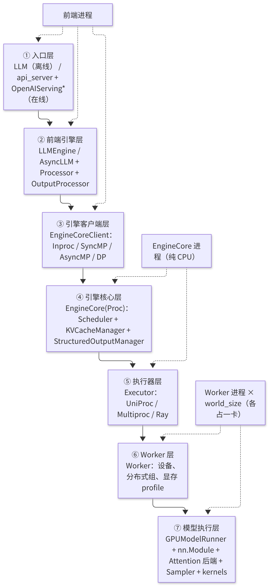
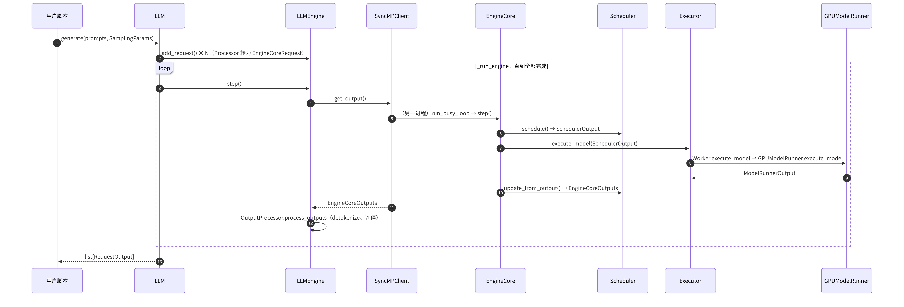

# B6 · V1 架构总览与推理主路径

> **版本**：vLLM 0.30.x（V1 引擎）｜**模块**：B-运行时内核｜**对应原课**：第 7 课
> **导航**：上一课：[B5-ModelRunner加载] → **本课 B6** → 下一课：[C1-Triton算子]
> **练习**：本课不设独立目录，以模块 B 的全部练习进行综合回归测试（见第 9 节）｜**源码标注**：标有【待核】之处以 0.30.x tag 的源码为准。

## 0. 先修要求与学习目标

先修要求：B1～B5 全部内容。本课不引入新组件，而是将前五课内容串联为一条完整的主路径，并补充此前有意略过的最核心环节：**`GPUModelRunner.execute_model()` 内部单步推理的具体过程**。

完成本课学习后，学习者应能够：

1. 默写 V1 的七层结构，并陈述每层的输入、输出及其所在进程；
2. 追踪一个请求从 `LLM.generate()` 至返回文本所经过的全部关键方法（约 25 个）；
3. 手工计算一个混合批次（新请求的预填充（Prefill）+ 分块预填充（chunked prefill）+ 解码（Decode））经"压平"后的 `input_ids`、`positions`、`query_start_loc`、`seq_lens`、`slot_mapping`、`logits_indices`；
4. 解释 V1 相较 V0 的五项关键设计变化，以及每项变化所解决的问题；
5. 在阅读任何新特性的代码时，能够迅速判断其位于七层结构中的哪一层。

---

## 1. 动机：全景图的必要性

前五课分别深入讨论了引擎进程模型、执行器、调度器、KV 管理与权重加载。单独阅读每一课并不困难，但阅读源码时的真正难点在于：一个变量的来源与去向通常跨越三四个文件与两个进程。例如，`num_computed_tokens` 在调度器（Scheduler）中被乐观更新，经 `SchedulerOutput` 传递至 Worker，在 ModelRunner 中转化为 `positions` 与 `seq_lens`，再由注意力后端用于确定需读取的 KV 数量。若缺少全景图，则容易在某一层失去方向。本课的目标即是给出这张全景图，并以一组具体数值完整演算一遍。

## 2. 七层结构



<p align="center"><em>图1：V1 七层结构：前端、EngineCore、Executor、Worker、ModelRunner 等</em></p>

每一层仅与相邻层交互，所交换的数据结构是固定的：

| 边界 | 下行数据 | 上行数据 |
|---|---|---|
| ②→④（经③） | `EngineCoreRequest`（token id + 采样参数） | `EngineCoreOutputs`（新 token id、完成原因、logprobs） |
| ④→⑦（经⑤⑥） | `SchedulerOutput`（每个请求本步的 token 数、新块号） | `ModelRunnerOutput`（采样 token、logprobs、投机草稿） |
| ⑦ 内部 | 张量：input_ids、positions、attn_metadata | hidden_states → logits → sampled ids |

**归纳**：前端管理字符串，EngineCore 管理块号记录与调度状态，执行器管理进程，Worker 管理设备，ModelRunner 管理张量。

## 3. 单个请求的端到端处理过程（离线路径）



<p align="center"><em>图2：单个请求的端到端处理过程（离线路径）</em></p>

在线路径仅将 ①② 替换为 api_server 与 AsyncLLM，并将同步拉取替换为后台的 `output_handler`（B1）。

## 4. 主路径核心：GPUModelRunner.execute_model 的单步流程

该函数是整个系统中执行最频繁的函数，每一步均需执行。按调用顺序（`vllm/v1/worker/gpu_model_runner.py`）说明如下：

1. **`_update_states(scheduler_output)`**：删除已完成的请求（`finished_req_ids`）；为 `scheduled_new_reqs` 创建 `CachedRequestState` 并加入 `InputBatch`；对 `scheduled_cached_reqs` 追加新块号、更新 `num_computed_tokens`，并处理从抢占中恢复的请求；最后压缩 InputBatch 中的空槽位。
2. **`_prepare_inputs(scheduler_output)`**：在 CPU（numpy）上为本步全部词元（token）计算 `positions`、`input_ids`（按索引从 token_ids_cpu 中 gather）、`query_start_loc`、`seq_lens`、`slot_mapping`（调用块表的 `compute_slot_mapping`），然后异步拷贝至 GPU 持久缓冲区；同时计算 `logits_indices`（每个请求的最后一个位置；投机解码时还包括草稿位置）。
3. **构造注意力元数据**：对每个 KV cache group，由 `attn_metadata_builder.build(common_prefix_len, common_attn_metadata)` 生成后端专用的元数据（例如 FlashAttention 的 `cu_seqlens_q`、`max_seq_len`、`block_table`）。
4. **确定 padding 与 CUDA Graph 模式**：`num_input_tokens` 按捕获尺寸向上取整；`cudagraph_dispatcher.dispatch(BatchDescriptor(...))` 在 FULL / PIECEWISE / NONE 之间进行选择（C2）。【待核：0.30.x 中 dispatch 的签名】
5. **前向计算**：`with set_forward_context(attn_metadata, vllm_config, num_tokens=..., cudagraph_runtime_mode=..., batch_descriptor=...):` → `hidden_states = self.model(input_ids, positions, intermediate_tensors, inputs_embeds)`。每个 `Attention` 层从 forward context 中获取元数据与本层的键值缓存（KV Cache），先通过 `reshape_and_cache` 写入新的 K/V，再计算注意力。
6. **非最后一段的流水线并行（PP）stage**：直接返回 `IntermediateTensors`（E2）。
7. **logits**：`sample_hidden_states = hidden_states[logits_indices]`；`logits = self.model.compute_logits(sample_hidden_states)`（lm_head，可能附加 TP all-gather）。
8. **结构化输出**：若存在语法约束，`apply_grammar_bitmask` 将不合法 token 的 logits 置为 −inf。
9. **采样**：`sampler_output = self.sampler(logits, sampling_metadata)`（F1）；投机解码时改为调用 `rejection_sampler`。
10. **收尾**：将采样结果写回 InputBatch 的 token 缓冲区；若启用投机解码，则由 `drafter.propose(...)` 生成下一步的草稿；构造 `ModelRunnerOutput`（`req_ids`、`sampled_token_ids`、`logprobs`、`spec_token_ids`、`prompt_logprobs_dict` 等）。【待核：新版本中第 7～10 步可能被拆分至独立的 `sample_tokens()`，以配合异步调度】


**建议的源码阅读路线**：第一遍仅阅读"主干"，即本课第 3、4 节所列的方法，遇到特性分支（LoRA、多模态、投机解码、PD 分离、结构化输出）一律跳过；第二遍选择一项所关注的特性，沿七层结构自上而下追踪其在每一层的改动；第三遍再阅读与性能相关的细节（持久缓冲区、异步拷贝、图捕获）。遵循这一顺序，即使是长达数千行的 `gpu_model_runner.py`，也可在一至两天内梳理出主线。

## 5. 数值示例：混合批次的"压平"

V1 中所有请求的 token 被拼接为**一维**序列，而非被填充至相同长度的二维批次。为便于计算，设 block_size=4，本步调度如下：

- **R0**：新请求，prompt 为 5 个 token `[11,12,13,14,15]`，前缀无命中，本步全部计算，`num_computed=0`，块表为 `[3, 8]`；
- **R1**：chunked prefill，prompt 共 10 个 token，已计算 4 个，本步计算 3 个（位置 4,5,6），块表为 `[5, 2]`；
- **R2**：Decode，已有 6 个 token（已计算 6 个），本步计算 1 个新 token（位置 6），块表为 `[7, 1]`。

本步 `total_num_scheduled_tokens = 5 + 3 + 1 = 9`。压平结果如下：

| 索引 | 0 | 1 | 2 | 3 | 4 | 5 | 6 | 7 | 8 |
|---|---|---|---|---|---|---|---|---|---|
| 所属请求 | R0 | R0 | R0 | R0 | R0 | R1 | R1 | R1 | R2 |
| positions | 0 | 1 | 2 | 3 | 4 | 4 | 5 | 6 | 6 |
| slot_mapping | 12 | 13 | 14 | 15 | 32 | 8 | 9 | 10 | 6 |

slot 计算示例：R0 位置 4 → 块表第 1 项（8）→ 8×4+0 = 32；R1 位置 4 → 块表第 1 项（2）→ 2×4+0 = 8；R2 位置 6 → 块表第 1 项（1）→ 1×4+2 = 6。

- `query_start_loc = [0, 5, 8, 9]`（每个请求本步 query 在一维序列中的起始位置，最后一项为总数）；
- `seq_lens = [5, 7, 7]`（计算完成后的总上下文长度：R0 为 0+5，R1 为 4+3，R2 为 6+1）；
- `logits_indices = [4, 7, 8]`（每个请求的最后一个位置）。需注意，R1 的分块尚未到达 prompt 末尾，其 logits 虽被计算，但采样结果将被丢弃（调度器知道这是部分 Prefill，不会将采样 token 追加至该请求）；
- 若 CUDA Graph 的捕获尺寸为 [1,2,4,8,16]，则 9 个 token 将被填充至 16（PIECEWISE 模式下仅非注意力部分经由图执行）。

上表即为注意力后端所获得的全部输入：在同一次 kernel 调用中，R0 执行"5 个 query 对 5 个 key"的因果注意力，R1 执行"3 个 query 对 7 个 key"，R2 执行"1 个 query 对 7 个 key"。**在 V1 中，Prefill 与 Decode 只是 query 长度不同的同一种计算**，这也是 B3 中调度器无需区分二者的底层原因。

## 5.5 Forward Context：注意力层隐式获取元数据的机制

模型的 `forward(input_ids, positions, ...)` 签名中并不包含注意力元数据与 KV Cache，由此产生一个问题：每个 `Attention` 层如何获知应读写哪些块。其机制为 **forward context**（`vllm/forward_context.py`）：ModelRunner 在调用模型之前，通过 `set_forward_context(...)` 将本步的注意力元数据、各层 KV Cache 的引用、batch 描述等存入一个全局（线程局部）上下文；`Attention` 层在前向计算时通过 `get_forward_context()`，按其层名取出对应的元数据与缓存。

该设计具有两项优点。其一，模型代码得以保持与 HF 相近的简洁签名，新增模型时无需逐层传递元数据。其二，也是更为关键的一点：在 torch.compile 下，注意力被注册为一个自定义算子（`unified_attention_with_output` 一类），编译器所见仅为"一次不透明的算子调用"，元数据不进入计算图，因此图的结构与具体批次的序列长度无关，可被缓存与复用（C3）。其代价是"隐式全局状态"增加了调试难度：若在 forward context 之外单独调用模型（例如自行编写测试时），注意力层将因无法获取上下文而报错。

## 5.6 单步耗时分解：CPU 与 GPU 的占比

以 8B 模型、H100、batch 为 128 个 Decode 请求、平均上下文长度 2 000 token 为例，下表给出量级参考，用于判断优化的重点所在：

| 环节 | 位置 | 量级 | 备注 |
|---|---|---|---|
| `schedule()` | EngineCore CPU | 0.3～1 ms | 与请求数近似呈线性关系 |
| 广播 SchedulerOutput | 共享内存 | 0.05～0.1 ms | B2 |
| `_update_states` + `_prepare_inputs` | Worker CPU | 0.5～1.5 ms | 经 numpy 向量化后仍不可忽略 |
| H2D 拷贝输入 | PCIe/异步 | 0.05 ms | 数据量仅为数十 KB |
| 前向计算（以权重读取为主） | GPU | 约 5～6 ms | 下界为 16 GB 权重 / 3.35 TB/s ≈ 4.8 ms |
| 注意力 KV 读取 | GPU | 3～10 ms | 随平均上下文长度线性增长，计算见下文 |
| 采样 + D2H | GPU/CPU | 0.2～0.5 ms | 需要同步 |
| `update_from_output` | EngineCore CPU | 0.3～0.8 ms | |

关于 KV 读取量：128 个请求 × 2 000 token × 每 token 128 KiB ≈ 31.25 GiB，按 3.35 TB/s 计算约需 10 ms，超过读取权重所需的时间。这一计算揭示了长上下文 Decode 的本质：**当 batch 较大且上下文较长时，瓶颈由读取权重转移至读取 KV**。表中下限 3 ms 对应的平均上下文约为 600 token（3 ms × 3.35 TB/s ≈ 10 GB，再除以 128 个请求与每 token 128 KiB），读者可自行代入其他数值复算。这也是 fp8 KV Cache、GQA/MLA、稀疏注意力等技术的根本价值所在：减少每一步必须搬运的字节数。

从上述分解还可看出：CPU 部分合计约 1.5～4 ms，若与 GPU 串行执行，将占单步总时间的 15%～30%。这正是异步调度、ModelRunner V2（F4）以及 CUDA Graph（C2，用于减少 kernel 启动开销）所要解决的问题。

## 5.7 后续模块在全景图中的位置

基于七层结构图，后续四个模块的位置可以明确界定：模块 C（Triton 算子、CUDA Graph、torch.compile）全部位于第 ⑦ 层内部，其目标是使相同的计算更快地完成；模块 D（量化）横跨第 ⑦ 层的权重加载与线性层计算，并通过 KV dtype 影响第 ④ 层的块数；模块 E（数据并行、张量并行、流水线并行、专家并行）改变的是第 ③⑤⑥ 层的拓扑，其中 DP 在第 ③ 层复制引擎，TP/PP/EP 在第 ⑤⑥⑦ 层切分模型；模块 F 中，采样与投机解码在第 ④⑦ 层协同工作，性能分析贯穿所有层，PD 分离则在第 ④ 层（调度侧 connector）与第 ⑦ 层（传输侧 connector）各提供一个接口。学习后续课程时，建议每完成一课即在该图上进行一次标注。

## 6. V1 相较 V0 的五项关键设计变化

1. **进程拆分**：前端与 EngineCore 分属不同进程（B1），消除了 CPU 后处理对 GPU 的阻塞。
2. **统一的调度抽象**：仅使用 `num_computed_tokens` 一个状态量，统一表达 chunked prefill、前缀缓存与投机解码（B3）。
3. **增量式调度输出与持久批**：调度器仅发送增量，Worker 维护 `InputBatch` 的持久状态，每步的通信量与 CPU 开销均大幅降低（B5、F4）。
4. **前缀缓存默认开启且开销近乎为零**：借助 O(1) 的空闲队列与延迟驱逐，即使命中率为 0，性能损失亦可忽略（B4）。
5. **编译与图优先**：torch.compile 分段编译与分段 CUDA Graph 默认开启，注意力作为分割点以保持灵活性（C2、C3）。

## 6.5 设计问答

**问：调度器为何不直接下发完整的 input_ids，而由 Worker 自行拼接？** 答：Decode 请求每步仅新增一个 token；若每步都重发完整上下文，数百个请求的 token 列表将使消息体积扩大上千倍。增量协议使 SchedulerOutput 通常仅为数十 KB，而 Worker 端的持久状态负责还原完整视图。其代价是两端状态必须严格一致，任何不同步都会导致错误的 positions 或 slot，这也是抢占恢复、请求结束等路径均需显式通知 Worker 的原因。

**问：为何将所有请求压平为一维，而不是填充为二维？** 答：二维填充会使短请求浪费大量计算（需与最长请求对齐），在混合 Prefill 与 Decode 的批次中浪费尤为严重：将一个 2 000 token 的 Prefill 与 100 个 Decode 拼成二维，需要 101×2 000 的矩阵，而有效 token 仅有 2 100 个。一维压平配合 `query_start_loc` 这一"变长批"表示，使线性层的计算量严格等于有效 token 数，注意力 kernel 则按请求边界分段处理。

**问：为何 logits 仅对 `logits_indices` 计算？** 答：lm_head 是一个 hidden×vocab 的大矩阵（8B 模型约为 4096×128256），若对 Prefill 的每个位置均计算 logits，将造成大量浪费。若仅对每个请求需要采样的位置进行计算，则一个 2 000 token 的 Prefill 仅需计算 1 行而非 2 000 行，所节省的计算量与显存均十分可观（需要 prompt logprobs 时例外）。

## 7. 新特性在七层结构中的定位方法

阅读一段陌生代码时，可依次提出三个问题：它改变的是**字符串/请求**（②）、**块号记录/调度决策**（④），还是**张量/计算**（⑦）？它运行于哪个进程？它通过哪个数据结构跨越层间边界？例如：

- 结构化输出：语法编译在 ④ 的后台线程中进行，bitmask 经由 `SchedulerOutput` 下发，⑦ 在采样前将其应用；
- LoRA：请求级 LoRA 名称在 ② 中校验，④ 将其用于前缀哈希与 batch 内 LoRA 数量限制，⑦ 使用 Punica 类 kernel 进行计算；
- PD 分离：connector 的调度侧接口位于 ④，传输侧接口位于 ⑦（F3）。

## 8. 常见问题与理解误区

1. **误认为 batch 是二维的**：V1 的输入是一维压平的 token 序列；"batch size"在不同语境下可能指请求数或 token 数，阅读代码时务必区分 `num_reqs` 与 `num_tokens`。
2. **误认为 Prefill 必定在一步内完成**：在 chunked prefill 下，处于部分 Prefill 状态的请求同样会产生 logits，但其采样结果被丢弃。
3. **在 EngineCore 进程中查找 GPU 张量**：EngineCore 仅持有块号与 token id，所有张量均位于 Worker 进程中。
4. **忽视 padding**：性能分析中观察到的 token 数可能大于调度数，多出的部分为 CUDA Graph padding。
5. **误认为 TP 的每个 rank 均返回结果**：仅有一个 output rank 回传结果（B2）。

## 9. 综合练习

本课不设独立的练习目录，应以模块 B 的全部练习执行一次回归测试，以确保前五课的基础组件均正确无误：

```bash
python -m pytest exercises/B1_zmq_patterns exercises/B2_executor_handshake_sim exercises/B3_scheduler_token_budget exercises/B4_block_pool exercises/B5_weight_loader_stub -q
```

验收标准：上述测试全部通过。

书面练习（建议记录于笔记中）：

1. 将第 5 节示例中的 R2 改为投机解码并携带 2 个草稿 token，重新计算本步的 token 数、`positions`、`slot_mapping` 与 `logits_indices`（提示：R2 本步计算 3 个 token，logits 位置共 3 个）。
2. 在第 2 节的七层结构图上，以不同颜色标出 `num_computed_tokens` 被读写的所有位置。
3. 使用 `VLLM_ENABLE_V1_MULTIPROCESSING=0` 运行一个小模型，在 `_prepare_inputs` 末尾打印 `query_start_loc` 与 `slot_mapping`，并与手工计算结果进行对照，二者应一致。

## 10. 自测题

- [ ] 能否默写七层结构及每层所在的进程
- [ ] 能否手工计算一个混合批次压平后的 positions、slot_mapping、query_start_loc、logits_indices
- [ ] 能否陈述 V1 相较 V0 的五项设计变化各自解决的问题

## 11. 延伸阅读

- 源码：`vllm/v1/worker/gpu_model_runner.py`、`vllm/v1/worker/gpu_input_batch.py`、`vllm/forward_context.py`、`vllm/v1/attention/backends/utils.py`（`CommonAttentionMetadata`）
- vLLM 官方博客：V1 alpha 发布说明（2025）及后续架构文章

---

**课程导航**　上一课：[B5 · ModelRunner 与权重加载](https://qcngm3vce6yt.feishu.cn/docx/FWYldjMhdomAz0xTxOTcBfYpn7e)｜下一课：[C1 · Triton 算子入门与 Attention 后端](https://qcngm3vce6yt.feishu.cn/docx/Msn0d9x8ioVNfvx3ESFcUhelnQ9)｜[返回索引](https://qcngm3vce6yt.feishu.cn/docx/KUn5dKSejoQSAJxaf7YcvNVDnCd)

相关章节：
- [B1 · Engine 与流式执行](https://qcngm3vce6yt.feishu.cn/docx/Sg5hdyoxqoE9nZx10DAcrGCknph)——见本课「0. 先修要求与学习目标」：“先修要求：B1～B5 全部内容。”
- [C2 · CUDA Graph](https://qcngm3vce6yt.feishu.cn/docx/HXw7ddUYQo9DaTxs9DzcJDwYnOc)——见本课「4. 主路径核心：GPUModelRunner.execute_model 的单步流程」：“在 FULL / PIECEWISE / NONE 之间进行选择（C2）。【待核：0.30.x 中 dispatch 的签名】”
- [B3 · 调度器 Scheduler](https://qcngm3vce6yt.feishu.cn/docx/PgNQdFEp2oajjSxApwKcSUIvnTb)——见本课「5. 数值示例：混合批次的"压平"」：“这也是 B3 中调度器无需区分二者的底层原因。”
