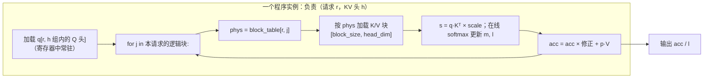
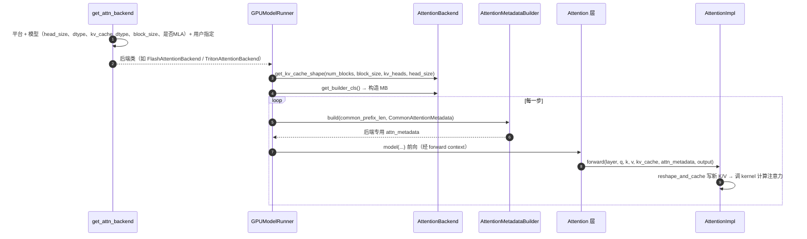

# C1 · Triton 算子入门与 Attention 后端（深度版）

> **版本**：vLLM 0.30.x（V1 引擎）｜**模块**：C-算子与图优化｜**对应原课**：第 8 课（Triton 正课；原错标为"第 8 课"的外部框架 torch.compile 文档已归档，不在本课范围）
> **导航**：上一课：[B6-架构总览] → **本课 C1** → 下一课：[C2-CUDAGraph]
> **练习**：`exercises/C1_triton_vector_add`（默认 numpy 路径，GPU 可选）｜**源码标注**：标【待核】处以 0.30.x tag 为准。

## 0. 先修与本课目标

先修：B6（知道注意力层通过 forward context 拿元数据、slot_mapping 与块表的含义）；GPU 基本执行模型（SM、线程块、全局显存与共享内存）；会写 PyTorch 张量运算。

学完本课你应能：

1. 用 Triton 的"程序实例 + 块"编程模型写出向量加法，并解释 mask、BLOCK_SIZE、grid 的作用；
2. 用 roofline 思维判断一个算子是访存受限还是计算受限，并手算理论耗时；
3. 理解 decode 注意力为什么是访存受限，以及分页 KV 如何改变 kernel 的访存模式；
4. 掌握 vLLM V1 注意力后端的抽象（Backend / MetadataBuilder / Impl）与选择流程；
5. 知道 vLLM 中有哪些 Triton kernel，以及何时会走 Triton 后端。

---

## 1. 动机：为什么推理框架需要自己写 kernel

PyTorch 的标准算子是"通用"的：每个算子读一次输入、写一次输出。推理中大量操作是逐元素或归约类（RMSNorm、SiLU×乘、RoPE、量化、采样中的 top-p），如果每个都单独发一个 kernel，就会产生大量中间张量的读写与 kernel 启动开销。更重要的是，分页注意力这类操作根本没有现成算子：它需要按块表间接寻址读取不连续的 KV，必须自定义 kernel。

CUDA C++ 可以写出极致性能的 kernel，但开发成本高、可移植性差。Triton 提供了一个折中：用 Python 语法描述"一个程序实例处理一块数据"，由编译器负责线程映射、合并访存、共享内存分配、流水线化。vLLM 中相当一部分 kernel（统一注意力的 Triton 实现、MoE 的 fused_experts、投机解码的拒绝采样、部分量化与采样 kernel）都用 Triton 写成，并且在 AMD、Intel 等非 NVIDIA 平台上 Triton 后端往往是重要的可用路径。

## 2. Triton 编程模型：从向量加法开始

```python
import triton
import triton.language as tl

@triton.jit
def add_kernel(x_ptr, y_ptr, out_ptr, n, BLOCK: tl.constexpr):
    pid = tl.program_id(axis=0)              # 第几个程序实例
    offs = pid * BLOCK + tl.arange(0, BLOCK)  # 本实例负责的下标向量
    mask = offs < n                           # 越界保护：最后一块可能不满
    x = tl.load(x_ptr + offs, mask=mask)
    y = tl.load(y_ptr + offs, mask=mask)
    tl.store(out_ptr + offs, x + y, mask=mask)

def add(x, y):
    out = torch.empty_like(x)
    n = x.numel()
    grid = lambda meta: (triton.cdiv(n, meta["BLOCK"]),)
    add_kernel[grid](x, y, out, n, BLOCK=1024)
    return out
```

逐行理解：

- **程序实例（program）**：Triton 中的并行单位，对应 CUDA 的一个线程块。`tl.program_id(0)` 相当于 `blockIdx.x`。
- **块（block）**：每个实例一次处理 `BLOCK` 个元素，`tl.arange(0, BLOCK)` 产生一个向量，后续所有操作都是向量化的。你不需要写"线程 i 处理元素 i"，编译器会把这个向量分配给实例内的线程（由 `num_warps` 控制，默认 4 个 warp 即 128 线程）。
- **`tl.constexpr`**：编译期常量，不同 BLOCK 会编译出不同的二进制（JIT 缓存在 `~/.triton/cache`）。
- **mask**：n 不是 BLOCK 的整数倍时，最后一个实例的部分下标越界，必须屏蔽，否则读写非法地址。
- **grid**：启动多少个实例。

**数字例子**：n = 98 432，BLOCK = 1 024 → 实例数 = ceil(98432/1024) = 97；最后一个实例负责下标 98 304～99 327，其中只有前 128 个有效，mask 屏蔽另外 896 个。


**写 kernel 前的三问**：在动手写任何一个 Triton kernel 之前，先回答三个问题。第一，这个算子是访存受限还是计算受限？这决定了你该盯着带宽还是算力。第二，一个程序实例负责多大粒度的数据？是一段连续元素、一行、一个注意力头，还是一个输出矩阵块？粒度决定了并行度与寄存器压力。第三，哪些中间结果可以留在寄存器或共享内存里而不写回显存？这决定了融合能省下多少字节。本课后面讨论的分页注意力、融合 RMSNorm、MoE kernel，都可以用这三问来拆解。

## 3. Roofline：判断算子的瓶颈

**算术强度** = 浮点运算数 / 访存字节数。GPU 的"拐点"= 峰值算力 / 显存带宽。以 H100 SXM 为例：bf16 稠密约 989 TFLOPS，HBM3 约 3.35 TB/s，拐点 ≈ 295 FLOP/B。算术强度低于拐点则访存受限，高于则计算受限。

- **向量加法（fp32）**：每元素 1 次加法，读 8 B 写 4 B，强度 = 1/12 ≈ 0.083 FLOP/B，极度访存受限。n = 1 亿时搬运 1.2 GB，理论耗时 1.2 GB / 3.35 TB/s ≈ 0.36 ms。实际能达到带宽的 80%～90% 就是一个好 kernel。
- **decode 的线性层（batch=1）**：权重 [4096, 4096] bf16，计算 2×4096×4096 FLOP，读权重 32 MiB，强度 ≈ 1 FLOP/B，访存受限。batch=64 时强度 ≈ 64，仍低于拐点；batch 达到数百以上才接近计算受限。这就是 decode 要"攒批"的根本原因。
- **prefill 的线性层（8 192 token）**：强度数千，计算受限。
- **decode 注意力**：每个请求的 query 只有 1 个 token（GQA 下一组 4 个 Q 头共享一个 KV 头），要读全部历史 KV。强度约等于每个 KV 头上的 Q 头数（几个 FLOP/B 量级），永远访存受限，且 batch 增大不能提高强度——因为每个请求读的是自己的 KV，无法复用。

**decode 注意力耗时手算**：Llama-3-8B，batch 64，平均上下文 2 048。每层 KV 读取 = 64 × 2 048 × 4 KiB = 512 MiB；32 层共 16 GiB；按 3.35 TB/s 约 5.1 ms。这比同一步读权重（约 4.8 ms）还多。所以 decode 注意力 kernel 优化的核心目标只有一个：**把显存带宽吃满**。

## 3.5 从向量加法到算子融合：一个 RMSNorm 的账

向量加法本身没有优化空间，但它教会我们一个最重要的判断：**访存受限算子的耗时 ≈ 搬运字节数 / 带宽**。于是优化的方向就是"少搬字节"，最有效的手段是融合。

以 Llama 每层都有的"残差相加 + RMSNorm"为例，输入 x 与残差 r 的形状都是 [num_tokens, 4096]，bf16。设本步 num_tokens = 8 192，则单个张量为 8 192 × 4 096 × 2 B = 64 MiB。

- **不融合**：先 `r = x + r`（读 2 个、写 1 个，共 192 MiB），再算平方均值（读 64 MiB），再归一化乘权重（读 64 MiB、写 64 MiB），合计约 384 MiB，还要启动 3～4 个 kernel；
- **融合为一个 kernel**：每个程序实例负责一行（一个 token 的 4 096 维），把 x 与 r 读进寄存器，相加后写回新残差，同时在寄存器里算平方和与归一化，最后写出结果。合计读 128 MiB、写 128 MiB，共 256 MiB，节省三分之一，而且只启动一次。

按 3.35 TB/s 计，384 MiB 约 0.12 ms，256 MiB 约 0.08 ms，每层省 0.04 ms，32 层就是 1.3 ms，对于一个 30 ms 的 prefill 步来说约 4%。若再把后面的 fp8 量化也融合进来（输出直接写 1 字节而不是 2 字节），还能再省一些。vLLM 中 `fused_add_rms_norm` 这类自定义算子，以及 C3 中编译器自动做的 RMSNorm + 量化融合，本质上都是这笔账。

这里还有一个容易被忽略的设计点：RMSNorm 需要对一整行求和，属于"行内归约"。在 Triton 里，只要 BLOCK 不小于行宽（4 096 维取 BLOCK = 4 096），一个程序实例就能在寄存器中完成整行的归约，不需要跨实例通信；若行宽太大放不下，则要在实例内循环分块累加。理解"一个程序实例处理什么粒度的数据"，是设计任何 Triton kernel 的第一步。

## 4. 分页注意力 kernel 的访存模式



要点：

1. **间接寻址**：每个块先查块表得到物理块号，再计算该块 K/V 的基址。块内 16 个 token 的 K 是连续的，因此一次加载仍是合并访存。
2. **在线 softmax（FlashAttention 思想）**：不必先算出全部分数再 softmax，而是维护运行最大值 m 与归一化和 l，逐块更新，避免把长度为上下文长度的分数向量写回显存。
3. **长上下文的并行度问题**：batch 小、上下文长时（如 batch=1、上下文 128K），只有 KV 头数个程序实例，远不足以填满 132 个 SM。解决方法是 **split-KV**（Flash-Decoding）：把上下文切成多段并行计算，最后用 log-sum-exp 合并。vLLM 的 Triton 统一注意力 kernel 对 decode 有类似的分段策略。【待核：0.30.x 中具体启发式】
4. **prefill 与 decode 统一**：V1 的 `triton_unified_attention` 用同一个 kernel 处理一维压平的变长批（B6），每个程序实例处理某个请求的一段 query（若干 token），对 decode（query 长度 1）与 prefill 都适用。

## 5. vLLM V1 注意力后端抽象



源码要点：

1. `vllm/attention/selector.py`：`get_attn_backend(head_size, dtype, kv_cache_dtype, block_size, use_mla, ...)` → `current_platform.get_attn_backend_cls(...)`（`vllm/platforms/cuda.py` 中按计算能力与特性选择优先级：如 FlashAttention、FlashInfer、Triton、FlexAttention 及多种 MLA 后端）。用户可通过 `VLLM_ATTENTION_BACKEND=TRITON_ATTN` 等强制指定。【待核：0.30.x 可能改为 `--attention-backend` 或 `attention_config` 配置项】
2. `vllm/v1/attention/backends/`：每个后端文件包含三类：`XxxBackend`（静态描述：名字、支持的 head size 与 dtype、KV 形状、builder 与 impl 类）、`XxxMetadataBuilder`（每步把通用元数据转为后端专用元数据；声明 `cudagraph_support` 能力级别，C2 会用到）、`XxxImpl`（`forward` 真正调用 kernel）。
3. `vllm/v1/attention/backends/triton_attn.py`：`TritonAttentionBackend` / `TritonAttentionImpl`，核心 kernel 在 `vllm/attention/ops/triton_unified_attention.py`（`unified_attention`）；KV 写入用 `triton_reshape_and_cache_flash` 或 CUDA 版 `reshape_and_cache_flash`。【待核：ops 目录在 0.30.x 可能迁移到 `vllm/v1/attention/ops/`】
4. `vllm/attention/layer.py`：`Attention` 层的 `forward` 调用 `torch.ops.vllm.unified_attention_with_output(...)`，这是一个注册的自定义算子，内部取 forward context 再调 `self.impl.forward`。它同时是 torch.compile 的分割点（C3）。
5. 其他 Triton kernel 举例：`vllm/model_executor/layers/fused_moe/fused_moe.py`（`fused_moe_kernel`，E3）、`vllm/v1/sample/rejection_sampler.py`（拒绝采样 kernel，F1）、`vllm/model_executor/layers/quantization/` 下若干量化 kernel。

## 5.5 Triton 后端与 CUDA 后端怎么选

既然有 FlashAttention、FlashInfer 这些高度优化的 CUDA 实现，为什么还要维护 Triton 注意力后端？可以从三个角度理解：

**可移植性**。Triton 同时支持 NVIDIA 与 AMD 等平台，同一份 kernel 代码稍加调整即可在不同硬件上运行。对于新硬件或旧架构（例如不被某些 CUDA 库支持的计算能力），Triton 后端常常是唯一可用的选项。

**可读性与可修改性**。统一注意力的 Triton 实现只有几百行 Python，研究人员可以快速修改以支持新的注意力变体（例如新的位置编码、稀疏模式），验证正确后再决定是否投入 CUDA 优化。学习 vLLM 注意力机制时，读 Triton 版本远比读 CUDA 模板代码容易。

**性能权衡**。在主流 NVIDIA 数据中心 GPU 上，成熟的 CUDA 后端通常更快，特别是在 prefill 与 FP8 场景；但随着 Triton 编译器进步，差距在缩小，某些 decode 形状下 Triton 版本已经相当接近。实践中的建议是：生产环境使用平台默认选择；遇到某个后端不支持的特性组合、或怀疑后端有数值问题时，切换到 Triton 后端做对照，这是定位注意力相关 bug 的有效手段。

## 6. 调优要素：BLOCK、num_warps、num_stages 与 autotune

Triton kernel 的性能对三个元参数非常敏感：

- **BLOCK 大小**：太小则每个实例工作量少、启动开销占比高；太大则寄存器压力大、占用率（occupancy）下降。向量加法中 1 024～4 096 通常都能接近带宽上限；注意力 kernel 中 query 块与 KV 块的大小要结合 head_dim 和共享内存容量选择。
- **num_warps**：每个实例的线程数。访存受限 kernel 通常 4～8 个 warp 即可。
- **num_stages**：软件流水线深度，决定"加载下一块时同时计算当前块"的程度，对注意力、GEMM 类 kernel 影响明显。

`@triton.autotune(configs=[...], key=["n"])` 可以在首次调用时对多组配置计时并缓存最优者。vLLM 的 fused MoE 采用另一种做法：针对常见 GPU 与形状**离线调优**，把最优配置存为 JSON（`fused_moe/configs/` 下按 E、N、设备名命名的文件），运行时直接查表，避免在线 autotune 带来的首请求延迟。

## 7. 常见坑 / 故障模式

1. **忘记 mask**：长度恰好是 BLOCK 整数倍时测试通过，换个长度就越界写坏相邻内存，表现为偶发错误结果。
2. **指针类型与 dtype 不一致**：传入 bf16 张量却按 fp32 解释，结果完全错误但不报错。
3. **首次调用很慢**：Triton JIT 编译加 autotune，可能需要数秒。在线服务中应在启动预热阶段触发（vLLM 的 `compile_or_warm_up_model` 会对常用形状预热）。
4. **在 CUDA Graph 捕获中触发编译**：如果某个形状首次出现在捕获区域内，会触发 JIT 编译导致捕获失败；预热必须先于捕获。
5. **后端不支持某些特性**：例如某 head size、fp8 KV、滑动窗口、级联注意力在某个后端未实现，选择器会回退到其他后端，性能可能突变。启动日志中 `Using XXX backend` 必看。
6. **用错误的指标评估 kernel**：访存受限 kernel 应看"达到的带宽 / 峰值带宽"，而不是 TFLOPS。

## 8. 动手练习

- 目录：`exercises/C1_triton_vector_add`
- 任务：实现 `vector_add_numpy(a, b)`（形状不一致抛 `ValueError`，结果为 float32），可选实现 `vector_add_torch`；GPU 环境可把第 2 节的 Triton kernel 接入并对比结果。
- 运行：

```bash
python -m pytest exercises/C1_triton_vector_add -q
# 有 CUDA 与 triton 时，运行 GPU 标记用例：
python -m pytest exercises/C1_triton_vector_add -q -m gpu
```

- 进阶：在 GPU 上对 n = 2²⁰～2²⁸ 测量 Triton 向量加法的耗时，计算达到的带宽（3×4×n 字节 / 耗时），与第 3 节的理论值对比，并尝试 BLOCK = 256/1 024/4 096 观察差异。

## 9. 自测清单

- [ ] 我能解释 program_id、arange、mask、grid 各自的含义，并算出给定 n 和 BLOCK 的实例数
- [ ] 我能用 roofline 判断 decode 注意力为什么访存受限，并手算其理论耗时
- [ ] 我能说出 V1 注意力后端的三个组成部分，以及如何确认当前用的是哪个后端

## 10. 延伸阅读

- Triton 官方教程：Vector Addition、Fused Softmax、Matrix Multiplication、Fused Attention
- 论文：FlashAttention / FlashAttention-2、Flash-Decoding 技术博客
- 源码：`vllm/v1/attention/backends/`、`vllm/attention/ops/`、`vllm/attention/selector.py`、`vllm/platforms/cuda.py`
