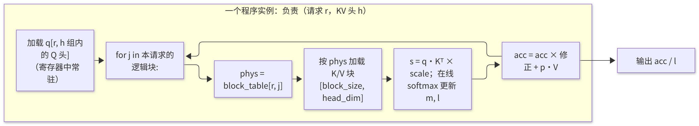
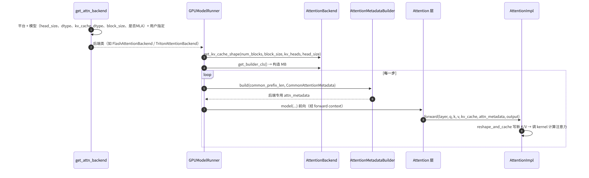

# C1 · Triton 算子入门与 Attention 后端

> **版本**：vLLM 0.30.x（V1 引擎）｜**模块**：C-算子与图优化｜**对应原课**：第 8 课（Triton 正式课程；原先错误标注为"第 8 课"的外部框架 torch.compile 文档已归档，不属于本课范围）
> **导航**：上一课：[B6-架构总览] → **本课 C1** → 下一课：[C2-CUDAGraph]
> **练习**：`exercises/C1_triton_vector_add`（默认使用 numpy 路径，GPU 路径为可选）｜**源码标注**：标有【待核】之处以 0.30.x tag 的源码为准。

## 0. 先修要求与学习目标

先修要求：B6（了解注意力层通过 forward context 获取元数据，以及 slot_mapping 与块表的含义）；GPU 的基本执行模型（SM、线程块、全局显存与共享内存）；能够编写 PyTorch 张量运算。

完成本课学习后，学习者应能够：

1. 使用 Triton 的"程序实例 + 块"编程模型编写向量加法，并解释 mask、BLOCK_SIZE 与 grid 的作用；
2. 运用 roofline 模型判断一个算子属于访存受限还是计算受限，并手工计算其理论耗时；
3. 说明解码（Decode）阶段的注意力计算属于访存受限的原因，以及分页键值缓存（KV Cache）如何改变 kernel 的访存模式；
4. 掌握 vLLM V1 注意力后端的抽象（Backend / MetadataBuilder / Impl）及其选择流程；
5. 了解 vLLM 中包含哪些 Triton 内核（kernel），以及在何种条件下会使用 Triton 后端。

---

## 1. 动机：推理框架自行编写 kernel 的必要性

PyTorch 的标准算子具有"通用"性质：每个算子读取一次输入、写出一次输出。推理过程中存在大量逐元素或归约类操作（RMSNorm、SiLU 与乘法、RoPE、量化、采样中的 top-p），若每个操作都单独启动一个 kernel，将产生大量中间张量的读写以及 kernel 启动开销。更重要的是，分页注意力这类操作根本不存在现成的算子：它需要按块表间接寻址读取不连续的 KV，因此必须自定义 kernel。

CUDA C++ 能够实现性能极致的 kernel，但开发成本高、可移植性差。Triton 提供了一种折中方案：以 Python 语法描述"一个程序实例处理一块数据"，并由编译器负责线程映射、合并访存、共享内存分配与流水线化。vLLM 中相当一部分 kernel（统一注意力的 Triton 实现、MoE 的 fused_experts、投机解码的拒绝采样，以及部分量化与采样 kernel）均以 Triton 编写；此外，在 AMD、Intel 等非 NVIDIA 平台上，Triton 后端通常是重要的可用路径。

## 2. Triton 编程模型：以向量加法为例

```python
import triton
import triton.language as tl

@triton.jit
def add_kernel(x_ptr, y_ptr, out_ptr, n, BLOCK: tl.constexpr):
    pid = tl.program_id(axis=0)              # 第几个程序实例
    offs = pid * BLOCK + tl.arange(0, BLOCK)  # 本实例负责的下标向量
    mask = offs < n                           # 越界保护：最后一块可能不满
    x = tl.load(x_ptr + offs, mask=mask)
    y = tl.load(y_ptr + offs, mask=mask)
    tl.store(out_ptr + offs, x + y, mask=mask)

def add(x, y):
    out = torch.empty_like(x)
    n = x.numel()
    grid = lambda meta: (triton.cdiv(n, meta["BLOCK"]),)
    add_kernel[grid](x, y, out, n, BLOCK=1024)
    return out
```

逐行说明如下：

- **程序实例（program）**：Triton 中的并行单位，对应 CUDA 中的一个线程块。`tl.program_id(0)` 相当于 `blockIdx.x`。
- **块（block）**：每个实例一次处理 `BLOCK` 个元素，`tl.arange(0, BLOCK)` 生成一个向量，后续所有操作均为向量化操作。编程时无需编写"线程 i 处理元素 i"的逻辑，编译器会将该向量分配给实例内的各线程（由 `num_warps` 控制，默认值为 4 个 warp，即 128 个线程）。
- **`tl.constexpr`**：编译期常量；不同的 BLOCK 取值会编译出不同的二进制代码（JIT 缓存位于 `~/.triton/cache`）。
- **mask**：当 n 不是 BLOCK 的整数倍时，最后一个实例的部分下标越界，必须加以屏蔽，否则将读写非法地址。
- **grid**：所启动的实例数量。

**数值示例**：n = 98 432，BLOCK = 1 024 → 实例数 = ceil(98432/1024) = 97；最后一个实例负责下标 98 304～99 327，其中仅前 128 个有效，mask 屏蔽其余 896 个。


**编写 kernel 前需明确的三个问题**：在编写任何 Triton kernel 之前，应首先回答以下三个问题。第一，该算子属于访存受限还是计算受限？这决定了优化应关注带宽还是算力。第二，一个程序实例负责多大粒度的数据？即一段连续元素、一行、一个注意力头，抑或一个输出矩阵块？粒度决定了并行度与寄存器压力。第三，哪些中间结果可以保留在寄存器或共享内存中而无需写回显存？这决定了算子融合能够节省的字节数。本课后续讨论的分页注意力、融合 RMSNorm 与 MoE kernel，均可依据这三个问题进行分析。

## 3. Roofline 模型：判断算子的性能瓶颈

**算术强度** = 浮点运算数 / 访存字节数。GPU 的"拐点" = 峰值算力 / 显存带宽。以 H100 SXM 为例：bf16 稠密算力约为 989 TFLOPS，HBM3 带宽约为 3.35 TB/s，拐点 ≈ 295 FLOP/B。算术强度低于拐点时为访存受限，高于拐点时为计算受限。

- **向量加法（fp32）**：每个元素执行 1 次加法，读取 8 B、写入 4 B，强度 = 1/12 ≈ 0.083 FLOP/B，属于极度访存受限。当 n = 1 亿时需搬运 1.2 GB 数据，理论耗时为 1.2 GB / 3.35 TB/s ≈ 0.36 ms。实际达到带宽的 80%～90% 即为性能良好的 kernel。
- **Decode 阶段的线性层（batch=1）**：权重为 [4096, 4096] bf16，计算量为 2×4096×4096 FLOP，读取权重 32 MiB，强度 ≈ 1 FLOP/B，属于访存受限。batch=64 时强度 ≈ 64，仍低于拐点；batch 达到数百以上时方才接近计算受限。这正是 Decode 阶段需要积累批次的根本原因。
- **预填充（Prefill）阶段的线性层（8 192 个词元（token））**：强度达数千，属于计算受限。
- **Decode 阶段的注意力**：每个请求的 query 仅有 1 个 token（在 GQA 下，一组 4 个 Q 头共享一个 KV 头），但须读取全部历史 KV。其强度约等于每个 KV 头所对应的 Q 头数（量级为数 FLOP/B），因此始终属于访存受限；并且增大 batch 也无法提高强度——原因在于每个请求读取的是其自身的 KV，无法复用。

**Decode 注意力耗时的手工计算**：Llama-3-8B，batch 为 64，平均上下文长度为 2 048。每层 KV 读取量 = 64 × 2 048 × 4 KiB = 512 MiB；32 层共计 16 GiB；按 3.35 TB/s 计算约需 5.1 ms，多于同一步读取权重所需的时间（约 4.8 ms）。因此，Decode 注意力 kernel 优化的核心目标只有一个：**充分利用显存带宽**。

## 3.5 从向量加法到算子融合：RMSNorm 的访存量分析

向量加法本身不存在优化空间，但它揭示了一项最重要的判断依据：**访存受限算子的耗时 ≈ 搬运字节数 / 带宽**。因此优化方向即为"减少搬运的字节数"，其中最有效的手段是算子融合。

以 Llama 每层均包含的"残差相加 + RMSNorm"为例，输入 x 与残差 r 的形状均为 [num_tokens, 4096]，数据类型为 bf16。设本步 num_tokens = 8 192，则单个张量大小为 8 192 × 4 096 × 2 B = 64 MiB。

- **不融合**：先执行 `r = x + r`（读取 2 个张量、写入 1 个张量，共 192 MiB），再计算平方均值（读取 64 MiB），再执行归一化并乘以权重（读取 64 MiB、写入 64 MiB），合计约 384 MiB，且需启动 3～4 个 kernel；
- **融合为一个 kernel**：每个程序实例负责一行（一个 token 的 4 096 维），将 x 与 r 读入寄存器，相加后写回新的残差，同时在寄存器中计算平方和并完成归一化，最后写出结果。合计读取 128 MiB、写入 128 MiB，共 256 MiB，节省三分之一，且仅需启动一次 kernel。

按 3.35 TB/s 计算，384 MiB 约需 0.12 ms，256 MiB 约需 0.08 ms，每层节省 0.04 ms，32 层共计 1.3 ms，对于一个耗时 30 ms 的 Prefill 步而言约占 4%。若进一步将其后的 fp8 量化一并融合（输出直接写入 1 字节而非 2 字节），还可进一步节省。vLLM 中 `fused_add_rms_norm` 一类的自定义算子，以及 C3 中编译器自动执行的 RMSNorm + 量化融合，其本质均为上述访存量的节省。

此处还有一个易被忽视的设计要点：RMSNorm 需要对整行求和，属于"行内归约"。在 Triton 中，只要 BLOCK 不小于行宽（对于 4 096 维，取 BLOCK = 4 096），一个程序实例即可在寄存器中完成整行归约，无需跨实例通信；若行宽过大而无法容纳，则需在实例内循环分块累加。明确"一个程序实例处理何种粒度的数据"，是设计任何 Triton kernel 的第一步。

## 4. 分页注意力 kernel 的访存模式



<p align="center"><em>图1：分页注意力 kernel 的访存模式：按块表间接加载 K/V 并在线 softmax</em></p>

要点如下：

1. **间接寻址**：对每个块，先查询块表得到物理块号，再计算该块 K/V 的基址。由于块内 16 个 token 的 K 是连续存储的，一次加载仍为合并访存。
2. **在线 softmax（FlashAttention 的思想）**：无需先计算全部分数再执行 softmax，而是维护运行最大值 m 与归一化和 l，并逐块更新，从而避免将长度等于上下文长度的分数向量写回显存。
3. **长上下文下的并行度问题**：当 batch 较小而上下文较长时（如 batch=1、上下文为 128K），程序实例数仅等于 KV 头数，远不足以占满 132 个 SM。解决方法是 **split-KV**（Flash-Decoding）：将上下文切分为多段并行计算，最后通过 log-sum-exp 合并。vLLM 的 Triton 统一注意力 kernel 对 Decode 采用了类似的分段策略。【待核：0.30.x 中具体启发式】
4. **Prefill 与 Decode 的统一**：V1 的 `triton_unified_attention` 以同一个 kernel 处理一维压平的变长批次（B6），每个程序实例处理某一请求的一段 query（若干 token），同时适用于 Decode（query 长度为 1）与 Prefill。

## 5. vLLM V1 注意力后端抽象



<p align="center"><em>图2：vLLM V1 注意力后端抽象：元数据构建与 forward 调用</em></p>

源码要点：

1. `vllm/attention/selector.py`：`get_attn_backend(head_size, dtype, kv_cache_dtype, block_size, use_mla, ...)` → `current_platform.get_attn_backend_cls(...)`（`vllm/platforms/cuda.py` 中按计算能力与特性确定选择优先级，候选包括 FlashAttention、FlashInfer、Triton、FlexAttention 及多种 MLA 后端）。用户可通过 `VLLM_ATTENTION_BACKEND=TRITON_ATTN` 等方式强制指定。【待核：0.30.x 可能改为 `--attention-backend` 或 `attention_config` 配置项】
2. `vllm/v1/attention/backends/`：每个后端文件包含三类组件：`XxxBackend`（静态描述：名称、支持的 head size 与 dtype、KV 形状、builder 与 impl 类）、`XxxMetadataBuilder`（每步将通用元数据转换为后端专用元数据；声明 `cudagraph_support` 能力级别，C2 中将用到）、`XxxImpl`（其 `forward` 实际调用 kernel）。
3. `vllm/v1/attention/backends/triton_attn.py`：`TritonAttentionBackend` / `TritonAttentionImpl`，核心 kernel 位于 `vllm/attention/ops/triton_unified_attention.py`（`unified_attention`）；KV 写入使用 `triton_reshape_and_cache_flash` 或 CUDA 版本的 `reshape_and_cache_flash`。【待核：ops 目录在 0.30.x 中可能已迁移至 `vllm/v1/attention/ops/`】
4. `vllm/attention/layer.py`：`Attention` 层的 `forward` 调用 `torch.ops.vllm.unified_attention_with_output(...)`，这是一个已注册的自定义算子，其内部获取 forward context 后再调用 `self.impl.forward`。该算子同时也是 torch.compile 的分割点（C3）。
5. 其他 Triton kernel 示例：`vllm/model_executor/layers/fused_moe/fused_moe.py`（`fused_moe_kernel`，E3）、`vllm/v1/sample/rejection_sampler.py`（拒绝采样 kernel，F1），以及 `vllm/model_executor/layers/quantization/` 下的若干量化 kernel。

## 5.5 Triton 后端与 CUDA 后端的选择

既然已有 FlashAttention、FlashInfer 等高度优化的 CUDA 实现，vLLM 仍维护 Triton 注意力后端的原因可从以下三个方面理解：

**可移植性**。Triton 同时支持 NVIDIA 与 AMD 等平台，同一份 kernel 代码经少量调整即可在不同硬件上运行。对于新硬件或旧架构（例如某些 CUDA 库所不支持的计算能力），Triton 后端往往是唯一可用的选项。

**可读性与可修改性**。统一注意力的 Triton 实现仅有数百行 Python 代码，研究人员可以快速修改以支持新的注意力变体（例如新的位置编码、稀疏模式），在验证正确性之后再决定是否投入 CUDA 优化。学习 vLLM 的注意力机制时，阅读 Triton 版本远比阅读 CUDA 模板代码容易。

**性能权衡**。在主流 NVIDIA 数据中心 GPU 上，成熟的 CUDA 后端通常更快，在 Prefill 与 FP8 场景下尤为明显；但随着 Triton 编译器的进步，二者差距正在缩小，在某些 Decode 形状下 Triton 版本的性能已相当接近。实践建议如下：生产环境使用平台的默认选择；若遇到某后端不支持的特性组合，或怀疑某后端存在数值问题，可切换至 Triton 后端进行对照，这是定位注意力相关缺陷的有效手段。

## 6. 调优要素：BLOCK、num_warps、num_stages 与 autotune

Triton kernel 的性能对以下三个元参数高度敏感：

- **BLOCK 大小**：过小则每个实例的工作量少，启动开销占比高；过大则寄存器压力增大，占用率（occupancy）下降。在向量加法中，1 024～4 096 的取值通常均可接近带宽上限；在注意力 kernel 中，query 块与 KV 块的大小需结合 head_dim 与共享内存容量进行选择。
- **num_warps**：每个实例的线程数。访存受限的 kernel 通常使用 4～8 个 warp 即可。
- **num_stages**：软件流水线深度，决定"加载下一块的同时计算当前块"的重叠程度，对注意力、GEMM 类 kernel 的影响较为明显。

`@triton.autotune(configs=[...], key=["n"])` 可在首次调用时对多组配置计时，并缓存其中的最优配置。vLLM 的 fused MoE 采用另一种方式：针对常见的 GPU 与形状进行**离线调优**，将最优配置存储为 JSON（位于 `fused_moe/configs/` 下，文件按 E、N 与设备名命名），运行时直接查表，从而避免在线 autotune 带来的首个请求时延。

## 7. 常见问题与故障模式

1. **遗漏 mask**：当长度恰为 BLOCK 的整数倍时测试能够通过，而改变长度后将越界写坏相邻内存，表现为偶发的错误结果。
2. **指针类型与 dtype 不一致**：传入 bf16 张量却按 fp32 解释，结果完全错误但不报错。
3. **首次调用耗时较长**：Triton JIT 编译加上 autotune 可能需要数秒。在线服务中应在启动预热阶段触发（vLLM 的 `compile_or_warm_up_model` 会对常用形状进行预热）。
4. **在 CUDA Graph 捕获过程中触发编译**：若某一形状首次出现在捕获区域内，将触发 JIT 编译并导致捕获失败；因此预热必须先于捕获完成。
5. **后端不支持某些特性**：例如某种 head size、fp8 KV、滑动窗口或级联注意力在某后端中未实现时，选择器将回退至其他后端，性能可能发生突变。启动日志中的 `Using XXX backend` 必须查看。
6. **使用错误的指标评估 kernel**：评估访存受限 kernel 时，应考察"实际达到的带宽 / 峰值带宽"，而非 TFLOPS。

## 8. 实践练习

- 目录：`exercises/C1_triton_vector_add`
- 任务：实现 `vector_add_numpy(a, b)`（形状不一致时抛出 `ValueError`，结果类型为 float32），可选实现 `vector_add_torch`；在具备 GPU 的环境中，可接入第 2 节的 Triton kernel 并对比结果。
- 运行方式：

```bash
python -m pytest exercises/C1_triton_vector_add -q
# 有 CUDA 与 triton 时，运行 GPU 标记用例：
python -m pytest exercises/C1_triton_vector_add -q -m gpu
```

- 验收标准：上述测试全部通过；若接入 Triton kernel，其结果应与 numpy 实现一致。
- 进阶任务：在 GPU 上针对 n = 2²⁰～2²⁸ 测量 Triton 向量加法的耗时，计算实际达到的带宽（3×4×n 字节 / 耗时），并与第 3 节的理论值对比；同时尝试 BLOCK = 256/1 024/4 096，记录并分析差异。

## 9. 自测题

- [ ] 能否解释 program_id、arange、mask、grid 各自的含义，并计算给定 n 与 BLOCK 时的实例数
- [ ] 能否运用 roofline 模型说明 Decode 注意力属于访存受限的原因，并手工计算其理论耗时
- [ ] 能否陈述 V1 注意力后端的三个组成部分，以及确认当前所用后端的方法

## 10. 延伸阅读

- Triton 官方教程：Vector Addition、Fused Softmax、Matrix Multiplication、Fused Attention
- 论文：FlashAttention / FlashAttention-2、Flash-Decoding 技术博客
- 源码：`vllm/v1/attention/backends/`、`vllm/attention/ops/`、`vllm/attention/selector.py`、`vllm/platforms/cuda.py`

---

**课程导航**　上一课：[B6 · V1 架构总览与推理主路径](https://qcngm3vce6yt.feishu.cn/docx/FV3gdoLxEo55VtxFlnkc41Lhn6g)｜下一课：[C2 · CUDA Graph](https://qcngm3vce6yt.feishu.cn/docx/HXw7ddUYQo9DaTxs9DzcJDwYnOc)｜[返回索引](https://qcngm3vce6yt.feishu.cn/docx/KUn5dKSejoQSAJxaf7YcvNVDnCd)

相关章节：
- [C3 · torch.compile 与 vLLM 编译栈](https://qcngm3vce6yt.feishu.cn/docx/Ybd2d5XAyobiqXxrgazcBtEentc)——见本课「3.5 从向量加法到算子融合：RMSNorm 的访存量分析」：“以及 C3 中编译器自动执行的 RMSNorm + 量化融合”
- [E3 · 专家并行 EP](https://qcngm3vce6yt.feishu.cn/docx/Qe9tdBCrhoAtrVxG4SDcrcuwnfg)——见本课「5. vLLM V1 注意力后端抽象」：“fused_moe_kernel，E3）”
- [F1 · 采样与投机解码](https://qcngm3vce6yt.feishu.cn/docx/HCfVd3TDLo9JIRx0nRuckXjvnUf)——见本课「5. vLLM V1 注意力后端抽象」：“（拒绝采样 kernel，F1）”
