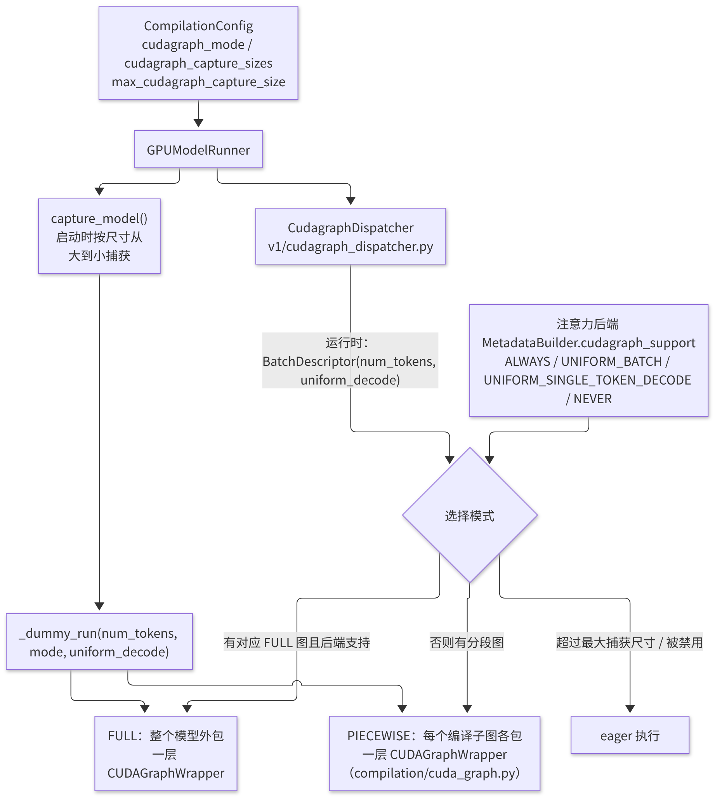
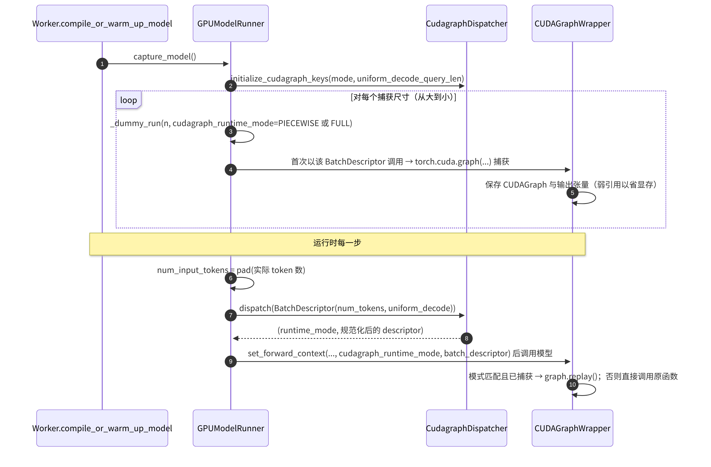

# C2 · CUDA Graph

> **版本**：vLLM 0.30.x（V1 引擎）｜**模块**：C-算子与图优化｜**对应原课**：第 9 课
> **导航**：上一课：[C1-Triton算子] → **本课 C2** → 下一课：[C3-模型编译]
> **练习**：`exercises/C2_cudagraph_constraints`｜**源码标注**：文中涉及的源码路径、符号与参数已对照 vLLM v0.30.0 tag 的源码核实。

## 0. 先修要求与学习目标

先修要求：C1（kernel、kernel 启动、访存受限）；B6（单步推理中 padding、forward context 与注意力元数据的来源）；CUDA stream 的基本概念。

完成本课学习后，学习者应能够：

1. 以定量数据说明解码（Decode）阶段 kernel 启动开销的严重程度，以及 CUDA Graph 能够节省的开销；
2. 阐明捕获（capture）与回放（replay）的语义，以及由此产生的四条硬性约束；
3. 区分 vLLM 的 FULL、PIECEWISE、FULL_DECODE_ONLY、FULL_AND_PIECEWISE 等模式，并解释注意力成为"分段"边界的原因；
4. 按调用顺序复述 `capture_model → _dummy_run → CUDAGraphWrapper` 的捕获过程，以及运行时 `CudagraphDispatcher` 的分发过程；
5. 计算 padding 造成的浪费，并据此设置捕获尺寸。

---

## 1. 动机：CPU 发射 kernel 的速度低于 GPU 的执行速度

一个 Transformer 层在 Decode 时约发射 10～20 个内核（kernel）（norm、qkv GEMM、RoPE、写入 KV、注意力、o_proj、all-reduce、norm、gate_up GEMM、激活、down GEMM、残差等）。32 层即为 300～600 个 kernel，再加上 embedding、lm_head 与采样，单步可达 500 个以上。

每个 kernel 从 Python 经 PyTorch 分发至 CUDA 驱动，CPU 侧开销约为 5～10 µs。**数值示例**：500 个 kernel × 8 µs ≈ 4 ms 的 CPU 时间。而在小 batch 的 Decode 中，8B 模型单步的 GPU 计算仅需约 5～6 ms（读取权重的下界约为 4.8 ms），且许多小 kernel 的 GPU 执行时间仅为数微秒，短于发射该 kernel 所需的 CPU 时间。其结果是 GPU 经常处于等待下一个 kernel 到达的状态，实测利用率可能低于 60%。模型越小、TP 规模越大（每卡计算量越少）、batch 越小，该问题越严重；对于 1B 级模型，Decode 甚至可能完全受限于 CPU 的发射速度。

CUDA Graph 的思路是：将一整串 kernel 及其参数**录制**下来，此后通过一次 `cudaGraphLaunch` **回放**整串操作，使 CPU 开销由数百次发射降至一次（约 10～20 µs），同时 GPU 端 kernel 之间的间隙也更小。实测中，小模型 Decode 的吞吐量可提升 1.5～3 倍，大模型亦有 10%～30% 的收益。

## 2. 捕获与回放的语义及由此产生的约束

捕获时，CUDA 并不"理解"Python 代码，它仅记录发生在捕获 stream 上的 GPU 操作：所调用的 kernel、网格配置与参数（包括**指针值**）。回放时，这些操作被原样重放。由此得出四条硬性约束，这也正是练习中需要检查的内容：

1. **静态形状（static_shapes）**：kernel 的网格大小与参数在捕获时即已固定，形状变化意味着需要另一张图。因此，vLLM 为若干离散的 batch 尺寸各捕获一张图，运行时将实际 token 数**向上填充**至最近的捕获尺寸。
2. **固定地址**：图中记录的是指针，回放时读写相同的地址。因此输入必须先拷贝至**持久缓冲区**（B5 所述的 `input_ids`、`positions` 等预分配张量），输出亦从固定缓冲区读出。在图外改写缓冲区的内容是合法的，但将其替换为另一个张量则不合法。
3. **捕获区域内不得存在 CPU 同步（no_cpu_sync_in_region）**：`.item()`、`.cpu()`、`torch.cuda.synchronize()` 以及依赖 GPU 结果的 Python `if` 语句，均会在捕获时报错或导致图不正确，原因在于捕获期间 kernel 并未实际执行，其结果不可获得。
4. **不得存在数据相关的动态控制流（no_dynamic_control_flow）**：Python 分支在捕获时仅执行一次，回放时不会重新判断。根据序列长度选择不同 kernel 的逻辑必须在图外完成，或须保证捕获时所走的分支对所有回放情形均正确。

此外还存在一类"与图不兼容的操作"（uses_graph_incompatible_ops）：例如某些会在内部分配显存或执行主机同步的库调用，以及在未正确配置时普通 NCCL 调用与图捕获之间的冲突。vLLM 为张量并行（TP）通信提供了可在图中使用的自定义 all-reduce，并在捕获期间通过 `graph_capture()` 上下文切换通信器的状态。

## 2.5 最小示例：手动捕获一张图

以下 PyTorch 代码展示了 vLLM 使用 CUDA Graph 的全部核心模式，建议在具备 GPU 的机器上运行一次：

```python
import torch
lin = torch.nn.Linear(4096, 4096, device="cuda", dtype=torch.bfloat16)
static_x = torch.zeros(16, 4096, device="cuda", dtype=torch.bfloat16)  # 持久输入缓冲

# 1) 预热：在侧流上先跑几次，触发 cuBLAS 选算法、Triton JIT 等一次性工作
s = torch.cuda.Stream(); s.wait_stream(torch.cuda.current_stream())
with torch.cuda.stream(s):
    for _ in range(3):
        lin(static_x)
torch.cuda.current_stream().wait_stream(s)

# 2) 捕获：只记录 GPU 操作，不真正计算
g = torch.cuda.CUDAGraph()
with torch.cuda.graph(g):
    static_y = lin(static_x)          # static_y 也是固定地址

# 3) 回放：改写输入缓冲内容，然后一次性重放
real = torch.randn(13, 4096, device="cuda", dtype=torch.bfloat16)
static_x[:13].copy_(real); static_x[13:].zero_()   # 13 行 pad 到 16 行
g.replay()
out = static_y[:13]                    # 只取有效行
```

该代码对应 vLLM 中的四个概念：预热对应 `compile_or_warm_up_model` 中首先执行的 dummy run；`static_x` 对应 ModelRunner 的持久输入缓冲区；捕获对应 `capture_model`；"拷入前 13 行、取出前 13 行"对应运行时的 padding 与切片。需注意，若第 3 步写作 `static_x = real`，则 Python 变量指向了新的张量，而图仍读取旧地址，回放结果与 `real` 无关——这正是第 7 节所列的第 2 个问题。

## 3. 架构图：vLLM 中的 CUDA Graph 组件



<p align="center"><em>图1：vLLM 中的 CUDA Graph 组件与 ModelRunner 的关系</em></p>

## 4. FULL 与 PIECEWISE："分段"的必要性

**FULL 模式**将整个前向计算（包括注意力）录制为一张图。该模式收益最大，但注意力 kernel 的行为高度依赖每步的元数据：请求数、每个请求的 query 长度、上下文长度，以及是否包含预填充（Prefill）。仅当注意力后端能够保证"在固定 token 数下，任意元数据组合均可由同一张图正确处理"时，FULL 图才是安全的。这即是后端 `cudagraph_support` 等级的含义：

- `ALWAYS`：任意批次均可整图捕获；
- `UNIFORM_BATCH`：仅支持每个请求 query 长度相同的批次（例如纯 Decode，或投机解码中每个请求均为 1+k）；
- `UNIFORM_SINGLE_TOKEN_DECODE`：仅支持纯 Decode（每个请求 1 个 token）；
- `NEVER`：不能整图捕获。

**PIECEWISE 模式**借助 torch.compile 在注意力算子处将模型图切开（C3）：注意力之前、之间与之后的部分（GEMM、norm、激活、all-reduce）的形状仅依赖于 token 数，因此各自被捕获为小图；注意力本身在图外以 eager 方式执行，因而可处理任意混合批次。其代价是每层仍存在一次"图外"的注意力调用，CPU 开销未能完全消除。

**组合模式**：`FULL_DECODE_ONLY` 仅为纯 Decode 批次捕获整图，混合批次以 eager 方式执行；`FULL_AND_PIECEWISE` 对纯 Decode 批次使用整图、对混合批次使用分段图，兼顾二者的优势，是 v0.30.0 在默认优化级别（`-O2`，`-O3` 相同）下的默认选择；`-O1` 时默认为 `PIECEWISE`，`-O0` 时为 `NONE`。旧参数 `full_cuda_graph` 已不再是 `CompilationConfig` 的字段，其效果应改用 `cudagraph_mode`（如 `FULL` 或 `FULL_AND_PIECEWISE`）表达。`--enforce-eager` 则完全关闭图。

## 5. 捕获与分发的调用顺序



<p align="center"><em>图2：CUDA Graph 捕获与运行时分发的调用顺序</em></p>

源码要点：

1. `vllm/config/compilation.py`：`CompilationConfig.cudagraph_mode`（`CUDAGraphMode` 枚举）、`cudagraph_capture_sizes`、`max_cudagraph_capture_size`（与 `max_num_seqs` 相关）；默认捕获尺寸为 `[1, 2, 4] + list(range(8, 256, 8)) + list(range(256, max_cudagraph_capture_size + 1, 16))`，即 1、2、4 之后以 8 为步长至 248，自 256 起以 16 为步长，直至上限；未显式设置时，上限取 `min(max_num_seqs × uniform_decode_query_len × 2, 512)`（数据中心级 Blackwell GPU 上为 1 024），且 `max_num_batched_tokens` 若不超过上限也会被加入列表。
2. `vllm/v1/worker/gpu_model_runner.py`：`capture_model()`（在 `graph_capture()` 上下文中，按尺寸降序调用 `_capture_cudagraphs`，其内部调用 `_dummy_run`）；`_dummy_run()` 构造虚拟的注意力元数据，FULL 模式下还须为后端构造"可捕获"的元数据；`execute_model` 中执行 padding 并调用 `dispatch`。
3. `vllm/v1/cudagraph_dispatcher.py`：`CudagraphDispatcher.dispatch()`，根据 `BatchDescriptor` 查找已捕获的键，优先选择 FULL，其次为 PIECEWISE，最后为 NONE。
4. `vllm/compilation/cuda_graph.py`：`CUDAGraphWrapper.__call__()`，从 forward context 中读取当前运行时模式与 descriptor；若与自身模式一致，则执行捕获或回放，否则直接透传。PIECEWISE 模式下由编译后端为每个子图进行包装（C3）。
5. `vllm/distributed/parallel_state.py`：`graph_capture()` 上下文，为自定义 all-reduce 注册捕获期间所使用的缓冲区。

**按从大到小的顺序捕获的原因**：所有图共享同一个显存池。先捕获最大的图，其分配的中间缓冲区可被后续的小图复用，因此总显存占用约等于最大一张图的需求，而非所有图的需求之和。

## 6. 数值示例：padding 浪费与捕获尺寸的选择

捕获尺寸为 [1, 2, 4, 8, 16, 24, 32, 40, 48, 56, 64]：

- 实际为 13 个 Decode token → 填充至 16，浪费 3 行，占比 3/16 ≈ 19%；
- 实际为 33 → 填充至 40，浪费 7/40 = 17.5%；
- 实际为 65 → 超过最大尺寸 64，回退至 eager（或视配置使用分段图/更大尺寸）。

线性层的计算量与 token 数成正比，但小 batch 的 Decode 属于访存受限（以读取权重为主），多计算几行几乎不增加耗时：16 行与 13 行读取的是同一份权重。因此，padding 浪费的实际代价远小于上述百分比。真正需要警惕的是第三种情况：**流量高峰时 batch 超过最大捕获尺寸，系统突然回退至 eager，单步耗时增加 2～4 ms**，表现为高并发下词元间时延（ITL）异常上升。对策是使 `max_cudagraph_capture_size` 覆盖实际的 `max_num_seqs`（纯 Decode 时 token 数等于请求数；投机解码时为请求数 ×(1+k)）。

**捕获开销**：每张图的捕获约需数十至数百毫秒；当存在 67 个尺寸且 FULL 与 PIECEWISE 两种模式各捕获一套时，捕获可能耗时 10～60 秒，占用显存数百 MB 至 1～2 GB（见日志中的 `Graph capturing finished in X secs, took Y GiB`）。这部分显存需在 B2 所述的 profile 中预留，否则键值缓存（KV Cache）的块数将被高估。

## 6.5 CUDA Graph 与其他特性的交互

**投机解码**。启用投机解码后，Decode 批次中每个请求的 query 长度为 1+k（k 为草稿 token 数）；只要所有请求的该值相同，该批次仍属于"uniform batch"，可使用 FULL 图；捕获尺寸应以 token 数计，即请求数乘以 1+k。drafter 模型（如 EAGLE 头）亦具有其自身的图捕获逻辑。

**异步调度**。异步调度要求上一步的采样结果能够直接在 GPU 上作为下一步的输入，而无需经过 CPU。这与 CUDA Graph 的固定地址要求天然契合：采样结果写入一个固定缓冲区，下一步的图从该缓冲区读取。二者结合后，一个 Decode 步的 CPU 关键路径可缩短至仅包含调度与一次图启动。

**数据并行与专家并行**。在数据并行（DP）场景下，各引擎的 batch 大小不同，但 MoE 层的集合通信要求各 rank 的形状对齐；因此，vLLM 会在 DP 组内同步各 rank 的 token 数，并在填充至相同大小后再选择图尺寸（E1、E3）。这意味着负载很轻的 rank 也会以较大的尺寸运行，这是 DP+EP 部署中额外的 padding 来源。

**LoRA**。LoRA 权重的切换会改变 kernel 参数；vLLM 通过固定的 LoRA 槽位与索引张量，使不同请求组合下的 LoRA 计算同样能够在固定地址的图中运行。

## 7. 常见问题与故障模式

1. **自定义算子中隐式调用 `.item()`**：捕获时将抛出 "operation not permitted when stream is capturing"，或在 PIECEWISE 编译时导致图断裂。排查方法：先使用 `--enforce-eager` 确认功能正确，再逐步启用图模式。
2. **在图外替换了持久缓冲区**：例如写作 `self.input_ids = new_tensor` 而非 `self.input_ids[:n].copy_(new_tensor)`，回放时读取的是旧地址中的数据，输出错乱但不报错。
3. **高并发下 ITL 骤增**：超过最大捕获尺寸后回退至 eager，见第 6 节。
4. **TP 下捕获过程挂起**：通信器未进入图捕获模式，或自定义 all-reduce 不可用（例如不具备 P2P 访问能力），导致 NCCL 调用在捕获过程中挂起。应检查 `disable_custom_all_reduce` 与 P2P 检测日志。
5. **显存不足**：捕获尺寸或模式过多导致图占用的显存过大，KV 块数随之下降。应缩减尺寸列表或降低 `max_cudagraph_capture_size`。
6. **随机数**：若采样中的随机数生成位于图内，则需要采用图安全的生成器状态管理；vLLM 将采样置于图外以规避这一问题。

## 7.5 排障路线：疑似图相关问题的排查方法

当线上出现"输出偶发错乱"或"高并发下时延异常"，且怀疑与 CUDA Graph 相关时，建议按以下顺序逐步缩小范围。第一步，添加 `--enforce-eager` 并以相同负载重新运行：若问题消失，基本可以确定与图相关；若问题仍然存在，则应排查注意力后端、量化 kernel 或调度逻辑。第二步，将 `cudagraph_mode` 由组合模式降级为 PIECEWISE：若问题消失，则说明整图捕获的注意力路径存在问题，通常是某个后端在特定元数据组合下不满足其所声明的 `cudagraph_support` 等级。第三步，缩减捕获尺寸列表，仅保留少数几个尺寸，观察问题是否仅在特定 batch 大小下出现，这有助于确定是否为某一尺寸的图在捕获时状态有误。第四步，检查最近修改的自定义算子是否在图内引入了同步、内存分配或依赖 Python 状态的分支。整个过程的核心思想是：**图仅忠实地回放捕获时的行为，因此问题的原因必然可在"捕获时的状态"中找到**。

## 8. 实践练习

- 目录：`exercises/C2_cudagraph_constraints`
- 任务：实现 `validate_capture_config(cfg) -> (ok, violations)`：`static_shapes`、`no_cpu_sync_in_region`、`no_dynamic_control_flow` 必须为 True；`uses_graph_incompatible_ops` 必须为 False（缺省时视为违规）；若提供了 `max_batch`，则其值必须 > 0。函数应返回全部违规信息的列表，而非在遇到第一条违规时即返回。
- 运行方式：

```bash
python -m pytest exercises/C2_cudagraph_constraints -q
```

- 验收标准：上述测试全部通过。
- 进阶任务：编写函数 `pad_to_capture_size(n, sizes)`，返回 n 应填充至的尺寸（超过最大值时返回 None，表示回退至 eager）；计算一组真实负载（例如 1～256 的均匀分布）下的平均 padding 浪费率，并比较"2 的幂"与"8 的倍数"两种尺寸列表的结果。

## 9. 自测题

- [ ] 能否以"kernel 数 × 单次发射开销"估算 CUDA Graph 的收益
- [ ] 能否陈述 FULL 与 PIECEWISE 的区别，以及注意力后端的 `cudagraph_support` 等级如何影响模式选择
- [ ] 能否解释按从大到小顺序捕获的原因，以及超过最大捕获尺寸时系统的行为

## 10. 延伸阅读

- NVIDIA 文档：CUDA Graphs 编程指南；PyTorch `torch.cuda.graph` 与 `make_graphed_callables`
- 源码：`vllm/compilation/cuda_graph.py`、`vllm/v1/cudagraph_dispatcher.py`、`vllm/config/compilation.py`、`vllm/v1/worker/gpu_model_runner.py`
- vLLM 文档：CUDA Graphs 设计说明（V1）

---

**课程导航**　上一课：[C1 · Triton 算子入门与 Attention 后端](https://qcngm3vce6yt.feishu.cn/docx/Msn0d9x8ioVNfvx3ESFcUhelnQ9)｜下一课：[C3 · torch.compile 与 vLLM 编译栈](https://qcngm3vce6yt.feishu.cn/docx/Ybd2d5XAyobiqXxrgazcBtEentc)｜[返回索引](https://qcngm3vce6yt.feishu.cn/docx/KUn5dKSejoQSAJxaf7YcvNVDnCd)

相关章节：
- [B6 · V1 架构总览与推理主路径](https://qcngm3vce6yt.feishu.cn/docx/FV3gdoLxEo55VtxFlnkc41Lhn6g)——见本课「0. 先修要求与学习目标」：“B6（单步推理中 padding、forward context 与注意力元数据的来源）”
- [B5 · ModelRunner 与权重加载](https://qcngm3vce6yt.feishu.cn/docx/FWYldjMhdomAz0xTxOTcBfYpn7e)——见本课「2. 捕获与回放的语义及由此产生的约束」：“因此输入必须先拷贝至持久缓冲区（B5 所述的 input_ids、positions 等预分配张量）”
- [B2 · Worker 与 Executor](https://qcngm3vce6yt.feishu.cn/docx/VnbqdbxnnojzIQxyLJCc0x5bnI2)——见本课「6. 数值示例：padding 浪费与捕获尺寸的选择」：“这部分显存需在 B2 所述的 profile 中预留”
