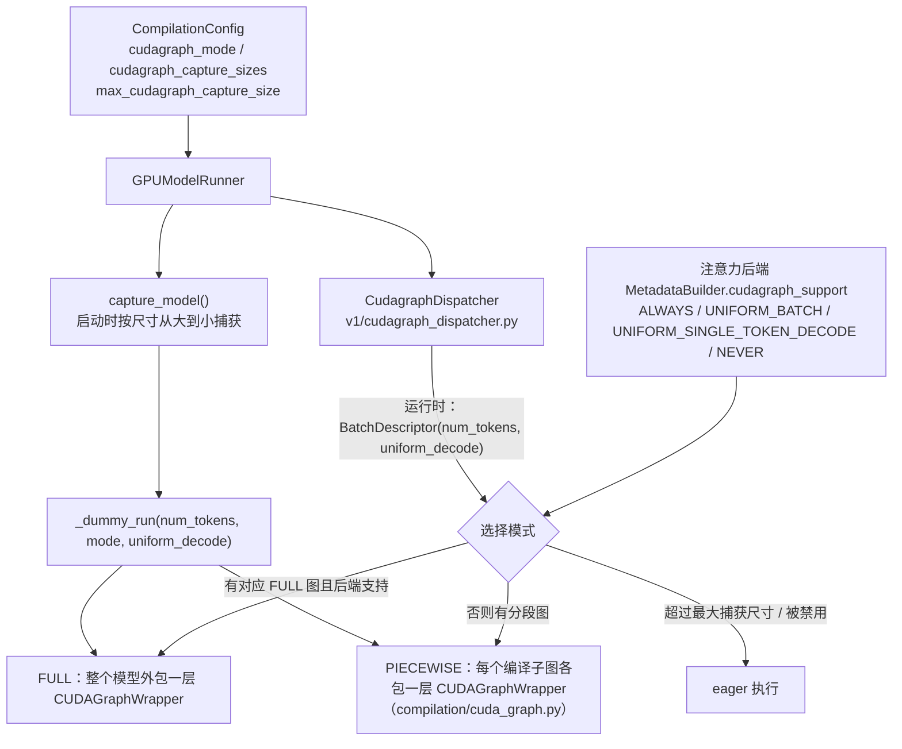
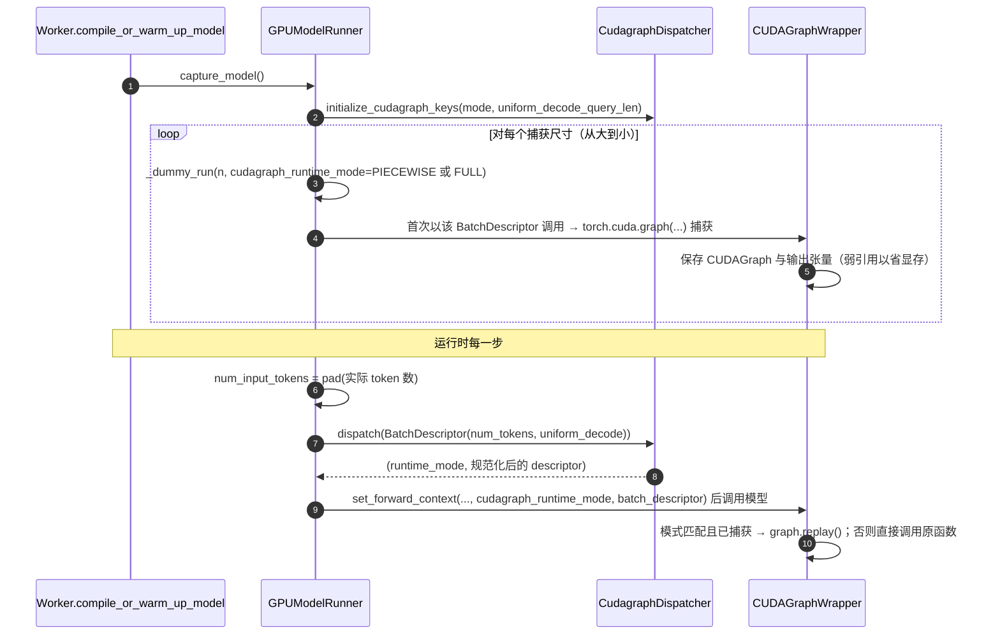

# C2 · CUDA Graph（深度版）

> **版本**：vLLM 0.30.x（V1 引擎）｜**模块**：C-算子与图优化｜**对应原课**：第 9 课
> **导航**：上一课：[C1-Triton算子] → **本课 C2** → 下一课：[C3-模型编译]
> **练习**：`exercises/C2_cudagraph_constraints`｜**源码标注**：标【待核】处以 0.30.x tag 为准。

## 0. 先修与本课目标

先修：C1（kernel、启动、访存受限）；B6（一步推理中 padding、forward context、注意力元数据的来源）；CUDA stream 的基本概念。

学完本课你应能：

1. 用数字说明 kernel 启动开销在 decode 中有多严重，以及 CUDA Graph 能节省多少；
2. 说清捕获（capture）与回放（replay）的语义，以及由此产生的四条硬约束；
3. 区分 vLLM 的 FULL、PIECEWISE、FULL_DECODE_ONLY、FULL_AND_PIECEWISE 等模式，并解释为什么注意力是"分段"的边界；
4. 按调用顺序复述 `capture_model → _dummy_run → CUDAGraphWrapper` 的捕获过程与运行时 `CudagraphDispatcher` 的分发过程；
5. 计算 padding 浪费，并据此设置捕获尺寸。

---

## 1. 动机：CPU 发射 kernel 的速度跟不上 GPU

一个 Transformer 层在 decode 时大约发射 10～20 个 kernel（norm、qkv GEMM、RoPE、写 KV、注意力、o_proj、all-reduce、norm、gate_up GEMM、激活、down GEMM、残差……）。32 层就是 300～600 个 kernel，再加上 embedding、lm_head、采样，一步可达 500 个以上。

每个 kernel 从 Python 经 PyTorch 分发到 CUDA 驱动，CPU 侧开销约 5～10 µs。**数字例子**：500 个 kernel × 8 µs ≈ 4 ms 的 CPU 时间。而小 batch decode 时，8B 模型一步的 GPU 计算只需约 5～6 ms（读权重的下界约 4.8 ms），许多小 kernel 的 GPU 执行时间只有几微秒——比发射它的 CPU 时间还短。结果是 GPU 经常在等下一个 kernel 到达，实测利用率可能不到 60%。模型越小、TP 越大（每卡计算越少）、batch 越小，问题越严重；1B 级模型的 decode 甚至可能完全被 CPU 发射速度限制。

CUDA Graph 的思路是：把一整串 kernel 及其参数**录制**下来，之后用一次 `cudaGraphLaunch` **回放**整串操作，CPU 开销从数百次发射降到一次（约 10～20 µs），GPU 端 kernel 之间的间隙也更小。实测中小模型 decode 吞吐提升可达 1.5～3 倍，大模型也有 10%～30% 的收益。

## 2. 捕获与回放的语义，以及由此而来的约束

捕获时，CUDA 并不真正"理解"你的 Python 代码，它只记录发生在捕获 stream 上的 GPU 操作：哪个 kernel、什么网格配置、什么参数（包括**指针值**）。回放时，按原样重放这些操作。由此得出四条硬约束，也正是练习中要检查的内容：

1. **静态形状（static_shapes）**：kernel 的网格大小和参数在捕获时就固定了，形状变化意味着需要另一张图。因此 vLLM 为若干离散的 batch 尺寸各捕获一张图，运行时把实际 token 数**向上 pad** 到最近的捕获尺寸。
2. **固定地址**：图里记录的是指针，回放时读写同样的地址。所以输入必须先拷进**持久缓冲区**（B5 提到的 `input_ids`、`positions` 等预分配张量），输出也从固定缓冲区读出。在图外改写缓冲区内容是合法的，替换成另一个张量则不行。
3. **捕获区内不能有 CPU 同步（no_cpu_sync_in_region）**：`.item()`、`.cpu()`、`torch.cuda.synchronize()`、依赖 GPU 结果的 Python `if` 都会在捕获时报错或导致图不正确，因为捕获期间 kernel 并未真正执行，结果不可得。
4. **无数据相关的动态控制流（no_dynamic_control_flow）**：Python 分支在捕获时只走了一次，回放时不会重新判断。根据序列长度选择不同 kernel 的逻辑必须在图外完成，或保证捕获时的分支对所有回放情形都正确。

此外还有一类"图不兼容操作"（uses_graph_incompatible_ops）：例如某些会在内部分配显存或做主机同步的库调用、普通 NCCL 调用在未正确配置时与图捕获冲突。vLLM 为 TP 通信提供了可在图中使用的自定义 all-reduce，并在捕获期间使用 `graph_capture()` 上下文切换通信器状态。

## 2.5 最小示例：亲手捕获一张图

下面这段 PyTorch 代码展示了 vLLM 使用 CUDA Graph 的全部核心套路，建议在有 GPU 的机器上运行一次：

```python
import torch
lin = torch.nn.Linear(4096, 4096, device="cuda", dtype=torch.bfloat16)
static_x = torch.zeros(16, 4096, device="cuda", dtype=torch.bfloat16)  # 持久输入缓冲

# 1) 预热：在侧流上先跑几次，触发 cuBLAS 选算法、Triton JIT 等一次性工作
s = torch.cuda.Stream(); s.wait_stream(torch.cuda.current_stream())
with torch.cuda.stream(s):
    for _ in range(3):
        lin(static_x)
torch.cuda.current_stream().wait_stream(s)

# 2) 捕获：只记录 GPU 操作，不真正计算
g = torch.cuda.CUDAGraph()
with torch.cuda.graph(g):
    static_y = lin(static_x)          # static_y 也是固定地址

# 3) 回放：改写输入缓冲内容，然后一次性重放
real = torch.randn(13, 4096, device="cuda", dtype=torch.bfloat16)
static_x[:13].copy_(real); static_x[13:].zero_()   # 13 行 pad 到 16 行
g.replay()
out = static_y[:13]                    # 只取有效行
```

这段代码对应 vLLM 中的四个概念：预热对应 `compile_or_warm_up_model` 中先做的 dummy run；`static_x` 对应 ModelRunner 的持久输入缓冲；捕获对应 `capture_model`；"拷入前 13 行、取出前 13 行"对应运行时的 padding 与切片。注意第 3 步中如果写成 `static_x = real`，Python 变量指向了新张量，但图仍读旧地址，回放结果与 `real` 无关——这正是第 7 节第 2 个坑。

## 3. 架构图：vLLM 中的 CUDA Graph 组件



## 4. FULL 与 PIECEWISE：为什么要"分段"

**FULL 模式**把整个前向（包括注意力）录进一张图。收益最大，但注意力 kernel 的行为强依赖每步的元数据：请求数、每个请求的 query 长度、上下文长度、是否有 prefill。只有当注意力后端能保证"在固定 token 数下，任意元数据组合都能被同一张图正确处理"，FULL 图才安全。这就是后端 `cudagraph_support` 等级的含义：

- `ALWAYS`：任意批次都可整图捕获；
- `UNIFORM_BATCH`：只支持每个请求 query 长度相同的批次（例如纯 decode，或投机解码中每个请求都是 1+k）；
- `UNIFORM_SINGLE_TOKEN_DECODE`：只支持纯 decode（每个请求 1 个 token）；
- `NEVER`：不能整图捕获。

**PIECEWISE 模式**利用 torch.compile 把模型图在注意力算子处切开（C3）：注意力之前、之间、之后的部分（GEMM、norm、激活、all-reduce）形状只依赖 token 数，各自捕获成小图；注意力本身在图外以 eager 方式执行，因此可以处理任意混合批次。代价是每层仍有一次"图外"的注意力调用，CPU 开销没有完全消除。

**组合模式**：`FULL_DECODE_ONLY` 只为纯 decode 批次捕获整图，混合批次走 eager；`FULL_AND_PIECEWISE` 对纯 decode 批次用整图、对混合批次用分段图，两全其美，是较新版本中的默认选择。【待核：0.30.x 默认值；以及 `cudagraph_mode` 与旧参数 `full_cuda_graph` 的对应关系】`--enforce-eager` 则完全关闭图。

## 5. 捕获与分发的调用顺序



源码要点：

1. `vllm/config/compilation.py`：`CompilationConfig.cudagraph_mode`（`CUDAGraphMode` 枚举）、`cudagraph_capture_sizes`、`max_cudagraph_capture_size`（与 `max_num_seqs` 相关）；默认捕获尺寸形如 1, 2, 4, 8, 16, 24, 32, …（8 以后以 8 为步长，再往上步长增大）直到上限。【待核：0.30.x 的确切默认序列】
2. `vllm/v1/worker/gpu_model_runner.py`：`capture_model()`（在 `graph_capture()` 上下文中，按尺寸降序调用 `_capture_cudagraphs`，内部 `_dummy_run`）；`_dummy_run()` 构造假的注意力元数据，FULL 模式下还要为后端构造"可捕获"的元数据；`execute_model` 中 padding 与 `dispatch` 调用。
3. `vllm/v1/cudagraph_dispatcher.py`：`CudagraphDispatcher.dispatch()`，根据 `BatchDescriptor` 查找已捕获的键，优先 FULL，其次 PIECEWISE，最后 NONE。
4. `vllm/compilation/cuda_graph.py`：`CUDAGraphWrapper.__call__()`，从 forward context 读取当前运行时模式与 descriptor，若与自身模式一致则捕获或回放；不一致则透传。PIECEWISE 时由编译后端为每个子图包装（C3）。
5. `vllm/distributed/parallel_state.py`：`graph_capture()` 上下文，为自定义 all-reduce 注册捕获期间使用的缓冲区。

**为什么从大到小捕获**：所有图共享同一个显存池。先捕获最大的图，它分配的中间缓冲区可以被后面的小图复用，总显存占用约等于最大那张图的需求，而不是所有图之和。

## 6. 数字例子：padding 浪费与捕获尺寸选择

捕获尺寸 [1, 2, 4, 8, 16, 24, 32, 40, 48, 56, 64]：

- 实际 13 个 decode token → pad 到 16，浪费 3 行，占 3/16 ≈ 19%；
- 实际 33 → pad 到 40，浪费 7/40 = 17.5%；
- 实际 65 → 超过最大尺寸 64，回退 eager（或分段/更大尺寸，视配置）。

线性层的计算量与 token 数成正比，但小 batch decode 是访存受限的（读权重为主），多算几行几乎不增加耗时：16 行与 13 行读的是同一份权重。因此 padding 浪费的真实代价远小于百分比所示。真正要警惕的是第三种情况：**流量高峰时 batch 超过最大捕获尺寸，突然回退到 eager，单步耗时增加 2～4 ms**，表现为高并发下 ITL 反常上升。对策是让 `max_cudagraph_capture_size` 覆盖实际的 `max_num_seqs`（纯 decode 时 token 数等于请求数；投机解码时为请求数 ×(1+k)）。

**捕获开销**：每张图捕获约需几十到几百毫秒，67 个尺寸、FULL 与 PIECEWISE 两种模式各一套时，捕获可能耗时 10～60 秒，占用显存数百 MB 到 1～2 GB（日志中 `Graph capturing finished in X secs, took Y GiB`）。这部分显存在 B2 的 profile 中需要预留，否则 KV 块数会被高估。

## 6.5 CUDA Graph 与其他特性的交互

**投机解码**。开启投机解码后，decode 批次中每个请求的 query 长度为 1+k（k 为草稿数），只要所有请求都相同，就仍属于"uniform batch"，可以使用 FULL 图；捕获尺寸要以 token 数计，即请求数乘以 1+k。drafter 模型（如 EAGLE 头）也有自己的图捕获逻辑。

**异步调度**。异步调度要求上一步的采样结果能直接在 GPU 上作为下一步的输入，而不经过 CPU。这与 CUDA Graph 的固定地址要求天然契合：采样结果写入一个固定缓冲，下一步的图从这个缓冲读取。两者结合后，一个 decode 步的 CPU 关键路径可以缩短到只剩调度和一次图启动。

**数据并行与专家并行**。DP 场景下各引擎的 batch 大小不同，但 MoE 层的集合通信要求各 rank 形状对齐，vLLM 会在 DP 组内同步各 rank 的 token 数，并 pad 到相同大小后再选择图尺寸（E1、E3）。这意味着一个负载很轻的 rank 也会以较大尺寸运行，是 DP+EP 部署中额外的 padding 来源。

**LoRA**。LoRA 的权重切换会改变 kernel 参数，vLLM 通过固定的 LoRA 槽位与索引张量，使不同请求组合下的 LoRA 计算也能在固定地址的图中运行。

## 7. 常见坑 / 故障模式

1. **自定义算子里偷偷 `.item()`**：在捕获时抛出 "operation not permitted when stream is capturing"，或者在 PIECEWISE 编译时导致图断裂。排查方法：先 `--enforce-eager` 确认功能正确，再逐步开启。
2. **在图外替换了持久缓冲区**：例如写成 `self.input_ids = new_tensor` 而不是 `self.input_ids[:n].copy_(new_tensor)`，回放读到旧地址的数据，输出错乱但不报错。
3. **高并发下 ITL 突增**：超过最大捕获尺寸回退 eager，见第 6 节。
4. **TP 下捕获卡死**：通信器未进入图捕获模式或自定义 all-reduce 不可用（例如没有 P2P 访问），NCCL 调用在捕获中挂住。检查 `disable_custom_all_reduce` 与 P2P 检测日志。
5. **显存不足**：捕获尺寸太多或模式太多导致图占用显存过大，KV 块数下降。减少尺寸列表或降低 `max_cudagraph_capture_size`。
6. **随机数**：采样中的随机数生成若在图中，需要使用图安全的生成器状态管理；vLLM 把采样放在图外以避免这一问题。

## 7.5 排障路线：怀疑是图的问题时怎么查

线上遇到"输出偶尔错乱"或"高并发下延迟异常"，而你怀疑与 CUDA Graph 有关时，建议按以下顺序缩小范围。第一步，加 `--enforce-eager` 重跑同样的负载：如果问题消失，基本可以确定与图有关；如果仍然存在，就去查注意力后端、量化 kernel 或调度逻辑。第二步，把 `cudagraph_mode` 从组合模式降为 PIECEWISE：若问题消失，说明是整图捕获的注意力路径有问题，通常是某个后端在特定元数据组合下不满足它声明的 `cudagraph_support` 等级。第三步，缩小捕获尺寸列表，只保留少数几个尺寸，观察问题是否只在特定 batch 大小出现，这有助于定位是某个尺寸的图捕获时状态不对。第四步，检查最近改动的自定义算子是否在图内引入了同步、分配或依赖 Python 状态的分支。整个过程的核心思想是：**图只是忠实回放捕获时的行为，所以问题一定能在"捕获时的状态"中找到原因**。

## 8. 动手练习

- 目录：`exercises/C2_cudagraph_constraints`
- 任务：实现 `validate_capture_config(cfg) -> (ok, violations)`：`static_shapes`、`no_cpu_sync_in_region`、`no_dynamic_control_flow` 必须为 True；`uses_graph_incompatible_ops` 必须为 False（缺省视为违规）；若提供 `max_batch` 则必须 > 0。返回所有违规信息的列表，而不是遇到第一个就返回。
- 运行：

```bash
python -m pytest exercises/C2_cudagraph_constraints -q
```

- 进阶：写一个函数 `pad_to_capture_size(n, sizes)`，返回 n 应 pad 到的尺寸（超过最大值返回 None 表示回退 eager），并计算一组真实负载（例如 1～256 的均匀分布）下的平均 padding 浪费率，比较"2 的幂"与"8 的倍数"两种尺寸列表。

## 9. 自测清单

- [ ] 我能用"kernel 数 × 单次发射开销"估算 CUDA Graph 的收益
- [ ] 我能说出 FULL 与 PIECEWISE 的区别，以及注意力后端 `cudagraph_support` 等级如何影响模式选择
- [ ] 我能解释为什么从大到小捕获，以及超过最大捕获尺寸会发生什么

## 10. 延伸阅读

- NVIDIA 文档：CUDA Graphs 编程指南；PyTorch `torch.cuda.graph` 与 `make_graphed_callables`
- 源码：`vllm/compilation/cuda_graph.py`、`vllm/v1/cudagraph_dispatcher.py`、`vllm/config/compilation.py`、`vllm/v1/worker/gpu_model_runner.py`
- vLLM 文档：CUDA Graphs 设计说明（V1）
