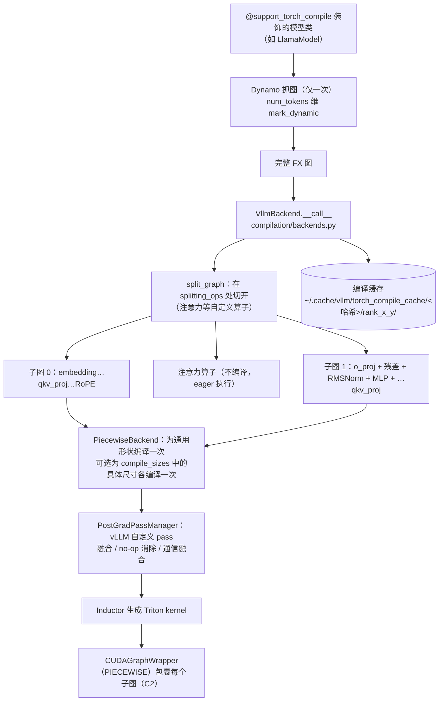
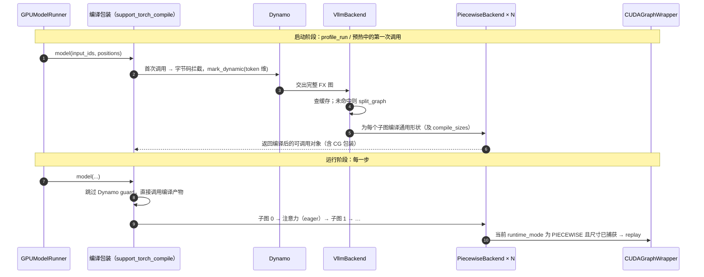

# C3 · torch.compile 与 vLLM 编译栈（深度版）

> **版本**：vLLM 0.30.x（V1 引擎）｜**模块**：C-算子与图优化｜**对应原课**：第 17 课（合并原错标"第 8 课"中与 vLLM 相关的部分；外部框架的同主题材料不在主路径）
> **导航**：上一课：[C2-CUDAGraph] → **本课 C3** → 下一课：[D1-量化基础]
> **练习**：本课无独立目录，复用 `exercises/C2_cudagraph_constraints`（编译与分段图共享同一套约束）｜**源码标注**：标【待核】处以 0.30.x tag 为准。

## 0. 先修与本课目标

先修：C1（算子融合的收益账）、C2（PIECEWISE 模式依赖编译切图）；PyTorch 2.x 中 `torch.compile` 的基本用法。

学完本课你应能：

1. 说出 Dynamo（抓图）、FX 图、Inductor（生成代码）三者的分工；
2. 解释 vLLM 为什么只"抓一次图"、只把 token 数作为动态维度，以及它如何规避 Dynamo 的 guard 开销；
3. 按调用顺序复述 `@support_torch_compile → VllmBackend → split_graph → PiecewiseBackend → CUDAGraphWrapper` 的编译流水线；
4. 列举 vLLM 自定义的编译 pass（融合、消除、通信重叠），并用数字估计其收益；
5. 理解编译缓存的键与目录结构，能排查"每次启动都重新编译"等问题。

---

## 1. 动机：手写融合 kernel 不可持续

C1 中我们手算过"残差 + RMSNorm"融合的收益。问题在于，这样的融合机会在每个模型、每种量化方案、每种并行方式下都不一样：fp8 量化时希望把 RMSNorm 和激活量化融合；TP 时希望把 all-reduce 与后面的 RMSNorm 融合；SiLU×乘之后接 fp8 量化时又是另一种组合。如果每种组合都手写 kernel 并在模型代码里手动调用，模型代码会被大量 `if quant == ... and tp > 1` 污染，维护成本不可承受。

torch.compile 提供了另一条路：模型代码保持朴素写法（逐个算子），由编译器拿到整张计算图后自动做融合、消除冗余、生成 Triton kernel。vLLM 在此基础上加入了推理专用的约束和 pass，使"编写简单的模型代码 + 自动获得融合性能"成为默认路径。

## 2. PyTorch 编译栈速览

- **Dynamo**：在 Python 字节码层面拦截函数执行，把张量运算记录成 FX 图；遇到无法追踪的 Python 代码会"断图"（graph break），并为图生成 **guard**（检查输入形状、类型、全局变量是否与抓图时一致的条件），每次调用都要先检查 guard。
- **FX 图**：一个由算子节点组成的 Python 层中间表示，便于做图变换（pass）。
- **AOTAutograd / functionalization**：把带原地修改的图转换为函数式图（推理时不需要反向）。
- **Inductor**：把图降低为 Triton kernel（GPU）或 C++（CPU），自动做逐元素与归约融合，并调用 cuBLAS 等库处理矩阵乘。

默认的 `torch.compile` 在推理服务中有两个问题：一是 guard 检查在每一步都有 CPU 开销；二是形状变化可能触发重新编译，在线服务中出现几十秒的卡顿是不可接受的。vLLM 的编译集成正是围绕这两点做了定制。

## 3. 架构图：vLLM 编译流水线



## 4. 源码走读（调用顺序）

1. `vllm/compilation/decorators.py`：`@support_torch_compile` 装饰模型类（例如 `vllm/model_executor/models/llama.py` 中的 `LlamaModel`）。它根据 `forward` 签名推断哪些参数的第 0 维是动态的（`input_ids`、`positions`、`intermediate_tensors`、`inputs_embeds` 的 token 维），首次调用时对这些维度 `torch._dynamo.mark_dynamic`，然后走 Dynamo。
2. 同文件中的包装类（`TorchCompileWrapperWithCustomDispatcher`，【待核：0.30.x 可能重命名】）在第一次编译完成后，**直接调用编译产物的字节码**，跳过 Dynamo 的 guard 检查。前提是 vLLM 自己保证：后续调用只有 token 数会变，其余形状、dtype、配置都不会变——这个保证来自"一个进程只服务一个模型配置"的事实。
3. `vllm/compilation/backends.py`：`VllmBackend.__call__(graph, example_inputs)`：
   - 计算缓存哈希（配置哈希 + 模型代码哈希 + 编译器版本等），查找/写入缓存目录；
   - `split_graph(graph, splitting_ops)` 在注意力类自定义算子处把图切成多个子图（`splitting_ops` 默认包括 `vllm.unified_attention`、`vllm.unified_attention_with_output` 以及 MLA、Mamba 等对应算子）；
   - 对每个可编译子图创建 `PiecewiseBackend`（`compilation/piecewise_backend.py`）：先为"通用动态形状"编译一次；若配置了 `compile_sizes`，再为这些具体 token 数分别编译（具体形状下 Inductor 可做更激进的优化，如选择更优的 GEMM 配置）；
   - PIECEWISE 图模式下，用 `CUDAGraphWrapper` 包裹每个子图的可调用对象。
4. `vllm/compilation/compiler_interface.py`：`InductorAdaptor` / `InductorStandaloneAdaptor`，封装对 Inductor 的调用与产物的保存、加载。【待核：类名】
5. `vllm/compilation/pass_manager.py`：`PostGradPassManager`，按配置注册 vLLM 的自定义 pass（在 Inductor 的 post-grad 阶段运行），例如：
   - `NoOpEliminationPass`：消除无意义的 reshape/slice；
   - `FusionPass`（RMSNorm + 静态/动态 fp8 量化融合）、`ActivationQuantFusionPass`（SiLU×乘 + fp8 量化融合）；
   - `AllReduceFusionPass`（TP all-reduce + 残差 + RMSNorm 融合，依赖特定通信库支持）；
   - `SequenceParallelismPass` 与 `AsyncTPPass`（把 all-reduce 拆为 reduce-scatter + all-gather，并与 GEMM 重叠）；
   - `AttnFusionPass`（注意力输出直接量化）。
   每个 pass 用"模式匹配 + 替换"的方式工作：在图中找到特定算子序列，替换为 vLLM 提供的融合自定义算子。
6. `vllm/config/compilation.py`：`CompilationConfig`：`mode`（旧名 `level`，0 不编译，3 为 vLLM 完整编译流程）、`custom_ops`、`splitting_ops`、`compile_sizes`、`pass_config`、`cudagraph_mode` 等；命令行可用 `-O` 或 `--compilation-config '{...}'` 设置。【待核：0.30.x 中 `mode`/`level` 的命名与 `-O` 级别语义】

## 4.5 时序：首次调用与后续调用走的是两条路



这张时序图的关键在于两条路径的差异：**首次调用**承担了抓图、切图、编译、缓存的全部成本，发生在启动阶段（B2 握手中的 `compile_or_warm_up_model` 与 profile run）；**后续调用**绕过 Dynamo，直接执行编译产物，每一步的 Python 开销仅相当于依次调用几十个子图的可调用对象，在 PIECEWISE 图模式下这些调用又会变成图回放。因此，只要启动完成，编译本身不会给运行期增加任何"编译"开销；若你在运行期间的日志中看到重新编译的信息，那一定是某个假设被打破了（例如出现了未预期的动态维度），应当作为 bug 处理。

还要注意，vLLM 编译的是"语言模型主干"（被装饰的 `XxxModel` 类），而 lm_head、采样、多模态编码器等通常不在这张图里，它们按各自的方式执行。在分析性能时，不要期望编译能优化整个推理步骤中的所有 kernel。

## 5. 为什么"在注意力处切图"

注意力是唯一一个计算行为强依赖每步元数据（请求划分、上下文长度、块表）的算子。如果把它编进图里，图就会对这些元数据产生依赖，要么频繁重编译，要么无法用 CUDA Graph 捕获任意批次。把注意力作为自定义算子"黑盒"留在子图之间，带来三个好处：

1. 编译图只依赖 token 数一个动态维度，抓一次、编译一次即可服务所有批次；
2. 子图可以被分段 CUDA Graph 捕获，注意力以 eager 方式处理任意混合批次（C2 的 PIECEWISE）；
3. 注意力后端可以自由切换（FlashAttention、FlashInfer、Triton……），无需重新编译模型其余部分。

**数字例子**：32 层模型在 32 个注意力处切开，得到 33 个子图。每个子图在 PIECEWISE 模式下对每个捕获尺寸各有一张 CUDA Graph；若有 67 个捕获尺寸，则共有 33 × 67 ≈ 2 211 张小图。它们共享显存池，因此显存可控，但捕获时间会随之增加——这是启动时间的重要组成部分。

## 6. 自定义算子与 `custom_ops`

vLLM 的很多层（RMSNorm、SiLU×乘、RoPE、量化）既有"手写 CUDA kernel"实现，也有"纯 PyTorch"实现（`CustomOp` 基类的 `forward_cuda` 与 `forward_native`）。在编译模式下，默认倾向于使用 `forward_native`，让 Inductor 看到原始算子从而能做跨算子融合；不编译时则使用手写 kernel。`custom_ops` 配置可以显式控制，例如 `"none"` 表示全部用 native 实现，`"+rms_norm"` 表示 RMSNorm 强制使用自定义 kernel，`"-silu_and_mul"` 表示禁用某个自定义 kernel。【待核：默认值随版本变化】

理解这一点很重要：**开启编译后，你在 profiler 中看到的 kernel 名可能变成 `triton_red_fused_add_mul_rsqrt_...` 之类的 Inductor 生成名**，而不是 `rms_norm_kernel`。这不是 bug，而是融合生效的标志。

## 7. 数字例子：融合 pass 的收益估算

以 Llama-3-8B fp8 量化、prefill 8 192 token 为例（隐层 4 096，中间维 14 336）。

**RMSNorm + fp8 量化融合**：不融合时，RMSNorm 输出 bf16 写出 64 MiB，量化 kernel 再读 64 MiB、写 fp8 32 MiB；融合后 RMSNorm 直接写 fp8 32 MiB。每处节省 128 MiB 访存，每层 2 处（注意力前、MLP 前），32 层共约 8 GiB，按 3.35 TB/s 约 2.5 ms。

**SiLU×乘 + fp8 量化融合**：gate_up 输出 [8192, 28672] bf16 为 448 MiB，激活后的中间结果 [8192, 14336] bf16 为 224 MiB。不融合时激活写出 224 MiB、量化再读 224 MiB 并写 112 MiB；融合后直接写 112 MiB fp8。每层节省约 448 MiB，32 层约 14 GiB，约 4.2 ms。

一个 8 192 token 的 prefill 步总耗时约 150～250 ms（计算受限），这两项合计约 3%～4%；但在小 batch decode（访存受限、单步 6～10 ms）中，同类融合节省的比例会显著更高。**AllReduce 融合**在 TP 场景下收益更明显：它把 all-reduce 与后续残差、RMSNorm 合并，省掉一次完整的激活读写，同时减少 kernel 数量。


**一个对比实验帮助建立直觉**：同样的 8B 模型、同样的负载，在三种配置下运行——完全 eager（`--enforce-eager -O0`）、只开编译不开图、编译加分段图。通常会看到：小 batch decode 时，CUDA Graph 贡献了大部分加速，编译融合贡献较小；大 batch prefill 时，CUDA Graph 几乎没有作用（GPU 本来就忙），编译融合带来的访存节省才是收益来源。把这两类收益分开理解，才能在性能出问题时知道该去关闭哪一个开关来定位。

## 8. 编译缓存

首次启动时编译可能需要 30～120 秒。vLLM 把编译产物缓存到 `~/.cache/vllm/torch_compile_cache/<哈希>/rank_<i>_<j>/`（可用 `VLLM_CACHE_ROOT` 修改根目录）。哈希包含：影响计算图的配置项（模型、dtype、量化、并行度、编译配置等）、vLLM 与 PyTorch 版本、相关源码文件内容。再次启动若命中缓存，编译阶段只需数秒加载。

**常见现象**：在容器中每次都重新编译——因为缓存目录在容器内且未挂载持久卷。生产部署应把缓存目录挂载出来，或在镜像构建时预热。

## 9. 常见坑 / 故障模式

1. **模型代码中有 Dynamo 无法追踪的逻辑**：例如在 forward 中根据张量值做 Python 分支、调用不支持的第三方库。表现为编译报错或日志中出现图断裂警告。vLLM 要求被编译的 forward 是"单图"，有断裂通常直接报错。
2. **误以为编译能处理动态控制流**：只有 token 数是动态的，其他维度变化（例如运行时改变 batch 内 LoRA 数量导致形状变化）必须在图外处理。
3. **启动时间过长**：编译 + 捕获合计数分钟。调试阶段可用 `-O0` 或 `--enforce-eager`，生产阶段依赖缓存。
4. **数值差异**：融合改变了计算顺序和中间精度（例如在 fp32 寄存器中完成更多运算），输出与 eager 模式在低位上可能不同。验证正确性时应比较 logprobs 的接近程度，而非要求逐位一致。
5. **缓存污染**：手动修改了 vLLM 源码但缓存哈希未覆盖到改动文件，导致加载旧的编译产物。调试时可删除缓存目录或设置 `VLLM_DISABLE_COMPILE_CACHE=1`。
6. **profiler 中找不到熟悉的 kernel 名**：见第 6 节，融合后名称改变。

## 10. 动手练习

本课没有独立练习目录。因为分段编译的子图最终会被 CUDA Graph 捕获，编译图同样必须满足"静态形状（除 token 维）、无 CPU 同步、无数据相关控制流"等约束，所以复用 C2 的约束检查练习：

```bash
python -m pytest exercises/C2_cudagraph_constraints -q
```

纸面与实验练习：

1. 用 `VLLM_ENABLE_V1_MULTIPROCESSING=0` 启动一个小模型，在 `VllmBackend.__call__` 中打印切分后子图的数量，验证"层数 + 1"规律。
2. 分别以 `-O0`（不编译）与默认编译级别启动同一模型，用 `vllm bench latency` 比较 batch=1 与 batch=64 的单步延迟差异，并解释差异来源（融合、CUDA Graph 各贡献多少）。
3. 在 PyTorch profiler 中找到一个 Inductor 生成的融合 kernel，推断它融合了哪些算子。

## 11. 自测清单

- [ ] 我能说出 Dynamo、FX、Inductor 的分工，以及 vLLM 如何避免 guard 检查开销
- [ ] 我能解释为什么在注意力处切图，以及子图数量与 CUDA Graph 数量的关系
- [ ] 我能估算 RMSNorm + 量化融合在给定 token 数下节省的访存量

## 12. 延伸阅读

- PyTorch 文档：torch.compile 教程、Dynamo 与 Inductor 设计说明
- vLLM 文档：torch.compile integration（V1）设计说明
- 源码：`vllm/compilation/`（`decorators.py`、`backends.py`、`piecewise_backend.py`、`pass_manager.py`、`fusion.py`、`cuda_graph.py`）、`vllm/config/compilation.py`
