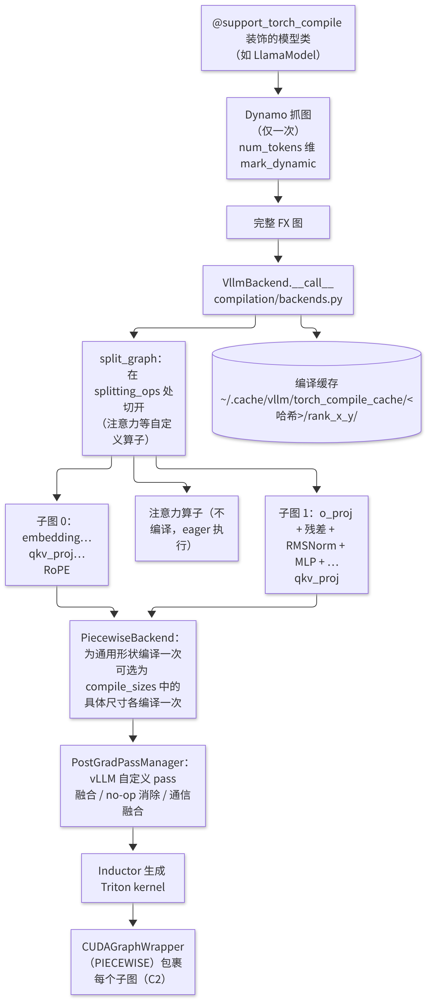
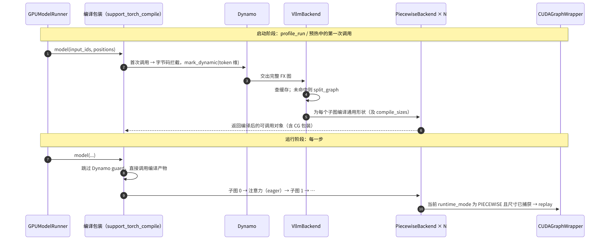

# C3 · torch.compile 与 vLLM 编译栈

> **版本**：vLLM 0.30.x（V1 引擎）｜**模块**：C-算子与图优化｜**对应原课**：第 17 课（合并了原先错误标注为"第 8 课"的材料中与 vLLM 相关的部分；外部框架的同主题材料不属于主路径）
> **导航**：上一课：[C2-CUDAGraph] → **本课 C3** → 下一课：[D1-量化基础]
> **练习**：本课不设独立目录，复用 `exercises/C2_cudagraph_constraints`（编译与分段图共用同一套约束）｜**源码标注**：文中涉及的源码路径、符号与参数已对照 vLLM v0.30.0 tag 的源码核实。

## 0. 先修要求与学习目标

先修要求：C1（算子融合的访存收益分析）、C2（PIECEWISE 模式依赖编译切图）；PyTorch 2.x 中 `torch.compile` 的基本用法。

完成本课学习后，学习者应能够：

1. 陈述 Dynamo（捕获计算图）、FX 图、Inductor（生成代码）三者的分工；
2. 解释 vLLM 仅"捕获一次计算图"、仅将 token 数作为动态维度的原因，以及其规避 Dynamo guard 开销的方式；
3. 按调用顺序复述 `@support_torch_compile → VllmBackend → split_graph → PiecewiseBackend → CUDAGraphWrapper` 的编译流水线；
4. 列举 vLLM 自定义的编译 pass（融合、消除、通信重叠），并以定量数据估计其收益；
5. 说明编译缓存的键与目录结构，并能排查"每次启动均重新编译"等问题。

---

## 1. 动机：手写融合 kernel 的方式难以持续

C1 中已手工计算了"残差 + RMSNorm"融合的收益。问题在于，此类融合机会随模型、量化方案与并行方式的不同而各不相同：fp8 量化时需要将 RMSNorm 与激活量化融合；张量并行（TP）时需要将 all-reduce 与其后的 RMSNorm 融合；SiLU 与乘法之后接 fp8 量化时又构成另一种组合。若对每种组合都手写内核（kernel）并在模型代码中手动调用，模型代码将充斥大量 `if quant == ... and tp > 1` 之类的分支，其维护成本难以承受。

torch.compile 提供了另一种途径：模型代码保持朴素的写法（逐个算子），由编译器在获得整张计算图后自动执行融合、消除冗余并生成 Triton kernel。vLLM 在此基础上加入了推理专用的约束与 pass，使"编写简单的模型代码并自动获得融合性能"成为默认路径。

## 2. PyTorch 编译栈概述

- **Dynamo**：在 Python 字节码层面拦截函数执行，将张量运算记录为 FX 图；遇到无法追踪的 Python 代码时会产生"图断裂"（graph break），并为图生成 **guard**（即检查输入形状、类型、全局变量是否与捕获时一致的条件），每次调用前均须检查 guard。
- **FX 图**：一种由算子节点构成的 Python 层中间表示，便于执行图变换（pass）。
- **AOTAutograd / functionalization**：将包含原地修改的图转换为函数式图（推理时无需反向计算）。
- **Inductor**：将图降低（lower）为 Triton kernel（GPU）或 C++（CPU），自动执行逐元素与归约融合，并调用 cuBLAS 等库处理矩阵乘法。

默认的 `torch.compile` 在推理服务中存在两个问题：其一，guard 检查在每一步都会带来 CPU 开销；其二，形状变化可能触发重新编译，而在线服务中出现数十秒的停顿是不可接受的。vLLM 的编译集成正是针对这两点进行了定制。

## 3. 架构图：vLLM 编译流水线



<p align="center"><em>图1：vLLM 编译流水线：Dynamo 捕获计算图、切图、Inductor 编译与缓存</em></p>

## 4. 源码分析（按调用顺序）

1. `vllm/compilation/decorators.py`：`@support_torch_compile` 装饰模型类（例如 `vllm/model_executor/models/llama.py` 中的 `LlamaModel`）。它根据 `forward` 的签名推断哪些参数的第 0 维是动态的（`input_ids`、`positions`、`intermediate_tensors`、`inputs_embeds` 的 token 维），首次调用时对这些维度执行 `torch._dynamo.mark_dynamic`，然后交由 Dynamo 处理。
2. `vllm/compilation/wrapper.py` 中的包装类 `TorchCompileWithNoGuardsWrapper`（由 `@support_torch_compile` 注入为模型类的基类；编译时通过 `guard_filter_fn` 丢弃 guard）在首次编译完成后，**直接调用编译产物的字节码**，从而跳过 Dynamo 的 guard 检查。其前提是由 vLLM 自身保证：后续调用中仅 token 数会变化，其余形状、dtype 与配置均不变——这一保证源于"一个进程仅服务于一种模型配置"这一事实。
3. `vllm/compilation/backends.py`：`VllmBackend.__call__(graph, example_inputs)`：
   - 计算缓存哈希（配置哈希 + 模型代码哈希 + 编译器版本等），并查找/写入缓存目录；
   - `split_graph(graph, splitting_ops)` 在注意力类自定义算子处将图切分为多个子图（`splitting_ops` 默认包括 `vllm.unified_attention`、`vllm.unified_attention_with_output`，以及 MLA、Mamba 等对应的算子）；
   - 为每个可编译的子图创建 `PiecewiseBackend`（`compilation/piecewise_backend.py`）：先针对"通用动态形状"编译一次；若配置了 `compile_sizes`，再针对这些具体 token 数分别编译（在具体形状下，Inductor 可执行更激进的优化，例如选择更优的 GEMM 配置）；
   - 在 PIECEWISE 图模式下，以 `CUDAGraphWrapper` 包裹每个子图的可调用对象。
4. `vllm/compilation/compiler_interface.py`：`InductorAdaptor` / `InductorStandaloneAdaptor`，封装对 Inductor 的调用以及编译产物的保存与加载。
5. `vllm/compilation/passes/pass_manager.py`：`PostGradPassManager`，按配置注册 vLLM 的自定义 pass（在 Inductor 的 post-grad 阶段运行），例如：
   - `NoOpEliminationPass`：消除无实际作用的 reshape/slice；
   - `RMSNormQuantFusionPass`（RMSNorm 与静态/动态 fp8 量化的融合，旧版本中名为 `FusionPass`）、`ActivationQuantFusionPass`（SiLU 与乘法同 fp8 量化的融合）；
   - `AllReduceFusionPass`（TP all-reduce、残差与 RMSNorm 的融合，依赖特定通信库的支持）；
   - `SequenceParallelismPass` 与 `AsyncTPPass`（将 all-reduce 拆分为 reduce-scatter + all-gather，并与 GEMM 重叠执行）；
   - `AttnQuantFusionPass`（对注意力输出直接执行量化，旧版本中名为 `AttnFusionPass`）。
   每个 pass 均以"模式匹配 + 替换"的方式工作：在图中查找特定的算子序列，并将其替换为 vLLM 提供的融合自定义算子。
6. `vllm/config/compilation.py`：`CompilationConfig`：`mode`（`CompilationMode` 枚举：0 = `NONE` 不编译，1 = `STOCK_TORCH_COMPILE`，2 = `DYNAMO_TRACE_ONCE`，3 = `VLLM_COMPILE` 即 vLLM 完整编译流程；旧名 `level` 在 v0.30.0 中已不再是配置字段）、`custom_ops`、`splitting_ops`、`compile_sizes`、`pass_config`、`cudagraph_mode` 等；命令行中可通过 `--compilation-config '{...}'` 进行设置。需注意，`-O` 在 v0.30.0 中是 `--optimization-level` 的简写（取值 0～3，默认为 2），用于整体设定编译模式、CUDA Graph 模式与融合 pass 等默认值：`-O0` 关闭编译与 CUDA Graph，`-O1` 启用编译与 PIECEWISE 图，`-O2`/`-O3` 启用编译与 FULL_AND_PIECEWISE 图；未显式设置 `mode` 时，优化级别高于 `-O0` 即采用 `VLLM_COMPILE`。

## 4.5 时序：首次调用与后续调用的两条执行路径



<p align="center"><em>图2：首次调用与后续调用的两条执行路径</em></p>

该时序图的关键在于两条路径的差异：**首次调用**承担了捕获计算图、切图、编译与缓存的全部成本，发生于启动阶段（B2 所述握手过程中的 `compile_or_warm_up_model` 与 profile run）；**后续调用**绕过 Dynamo，直接执行编译产物，每一步的 Python 开销仅相当于依次调用数十个子图的可调用对象，而在 PIECEWISE 图模式下，这些调用又会转化为图回放。因此，只要启动完成，编译本身不会在运行期增加任何"编译"开销；若在运行期间的日志中出现重新编译的信息，则必然是某项假设被打破（例如出现了预期之外的动态维度），应将其作为缺陷处理。

还需注意，vLLM 编译的对象是"语言模型主干"（被装饰的 `XxxModel` 类），而 lm_head、采样、多模态编码器等通常不在该计算图中，它们按各自的方式执行。因此在分析性能时，不应期望编译能够优化整个推理步骤中的所有 kernel。

## 5. 在注意力处切图的原因

注意力是唯一一个计算行为高度依赖每步元数据（请求划分、上下文长度、块表）的算子。若将其编入图中，图将依赖这些元数据，其结果是要么频繁重新编译，要么无法以 CUDA Graph 捕获任意批次。将注意力作为自定义算子以"黑盒"形式保留在子图之间，可带来三项优势：

1. 编译图仅依赖 token 数这一个动态维度，捕获一次、编译一次即可服务于所有批次；
2. 子图可被分段 CUDA Graph 捕获，注意力以 eager 方式处理任意混合批次（即 C2 所述的 PIECEWISE）；
3. 注意力后端可自由切换（FlashAttention、FlashInfer、Triton 等），而无需重新编译模型的其余部分。

**数值示例**：32 层模型在 32 个注意力处切开，得到 33 个子图。在 PIECEWISE 模式下，每个子图针对每个捕获尺寸各有一张 CUDA Graph；若存在 67 个捕获尺寸，则共有 33 × 67 ≈ 2 211 张小图。由于它们共享显存池，显存占用可控，但捕获时间随之增加，这是启动时间的重要组成部分。

## 6. 自定义算子与 `custom_ops`

vLLM 的许多层（RMSNorm、SiLU 与乘法、RoPE、量化）同时具有"手写 CUDA kernel"实现与"纯 PyTorch"实现（`CustomOp` 基类的 `forward_cuda` 与 `forward_native`）。在编译模式下，默认倾向于使用 `forward_native`，使 Inductor 能够观察到原始算子并据此执行跨算子融合；不编译时则使用手写 kernel。`custom_ops` 配置可对此进行显式控制，例如 `"none"` 表示全部使用 native 实现，`"+rms_norm"` 表示 RMSNorm 强制使用自定义 kernel，`"-silu_and_mul"` 表示禁用某一自定义 kernel。在 v0.30.0 中，若用户未在 `custom_ops` 中给出 `"all"` 或 `"none"`，则在使用 Inductor 后端且开启编译时默认追加 `"none"`，否则默认追加 `"all"`。

理解这一点十分重要：**启用编译后，profiler 中显示的 kernel 名称可能变为 `triton_red_fused_add_mul_rsqrt_...` 之类由 Inductor 生成的名称**，而非 `rms_norm_kernel`。这并非缺陷，而是融合已生效的标志。

## 7. 数值示例：融合 pass 的收益估算

以 Llama-3-8B fp8 量化、预填充（Prefill）8 192 个词元（token）为例（隐藏层维度 4 096，中间维度 14 336）。

**RMSNorm + fp8 量化融合**：不融合时，RMSNorm 以 bf16 写出 64 MiB，量化 kernel 再读取 64 MiB 并写出 fp8 结果 32 MiB；融合后，RMSNorm 直接写出 fp8 结果 32 MiB。每处节省 128 MiB 访存，每层 2 处（注意力之前、MLP 之前），32 层共计约 8 GiB，按 3.35 TB/s 计算约为 2.5 ms。

**SiLU 与乘法 + fp8 量化融合**：gate_up 的输出 [8192, 28672] bf16 为 448 MiB，激活后的中间结果 [8192, 14336] bf16 为 224 MiB。不融合时，激活写出 224 MiB，量化再读取 224 MiB 并写出 112 MiB；融合后直接写出 112 MiB 的 fp8 结果。每层节省约 448 MiB，32 层约 14 GiB，约为 4.2 ms。

一个 8 192 token 的 Prefill 步总耗时约为 150～250 ms（计算受限），上述两项合计约占 3%～4%；但在小 batch 的解码（Decode）中（访存受限，单步 6～10 ms），同类融合所节省的比例将显著更高。**AllReduce 融合**在 TP 场景下收益更为明显：它将 all-reduce 与后续的残差、RMSNorm 合并，省去一次完整的激活读写，同时减少 kernel 数量。


**对比实验**：对同一 8B 模型施加相同负载，分别在三种配置下运行——完全 eager（`--enforce-eager -O0`）、仅启用编译而不启用图、编译加分段图。通常可观察到：在小 batch 的 Decode 中，CUDA Graph 贡献了大部分加速，编译融合的贡献较小；在大 batch 的 Prefill 中，CUDA Graph 几乎不起作用（GPU 本身已处于高负载状态），编译融合带来的访存节省才是收益的来源。将这两类收益分开理解，方能在出现性能问题时确定应关闭哪一个开关以进行定位。

## 8. 编译缓存

首次启动时，编译可能需要 30～120 秒。vLLM 将编译产物缓存至 `~/.cache/vllm/torch_compile_cache/<哈希>/rank_<i>_<j>/`（可通过 `VLLM_CACHE_ROOT` 修改根目录）。哈希包括：影响计算图的配置项（模型、dtype、量化、并行度、编译配置等）、vLLM 与 PyTorch 的版本，以及相关源码文件的内容。再次启动时若命中缓存，编译阶段仅需数秒即可完成加载。

**常见现象**：在容器中每次启动均重新编译——原因在于缓存目录位于容器内部，且未挂载持久卷。生产部署应将缓存目录挂载至外部，或在镜像构建时进行预热。

## 9. 常见问题与故障模式

1. **模型代码中存在 Dynamo 无法追踪的逻辑**：例如在 forward 中依据张量值执行 Python 分支，或调用不受支持的第三方库。表现为编译报错，或日志中出现图断裂警告。vLLM 要求被编译的 forward 为"单图"，出现断裂时通常直接报错。
2. **误认为编译能够处理动态控制流**：仅 token 数为动态维度，其他维度的变化（例如运行时 batch 内 LoRA 数量的变化导致形状改变）必须在图外处理。
3. **启动时间过长**：编译与捕获合计需数分钟。调试阶段可使用 `-O0` 或 `--enforce-eager`，生产阶段则依赖缓存。
4. **数值差异**：融合改变了计算顺序与中间精度（例如在 fp32 寄存器中完成更多运算），因此输出与 eager 模式在低位上可能不同。验证正确性时，应比较 logprobs 的接近程度，而非要求逐位一致。
5. **缓存污染**：手动修改了 vLLM 源码，但缓存哈希未覆盖所修改的文件，导致加载了旧的编译产物。调试时可删除缓存目录，或设置 `VLLM_DISABLE_COMPILE_CACHE=1`。
6. **profiler 中找不到熟悉的 kernel 名称**：见第 6 节，融合后名称会发生改变。

## 10. 实践练习

本课不设独立的练习目录。由于分段编译的子图最终会被 CUDA Graph 捕获，编译图同样必须满足"静态形状（token 维除外）、无 CPU 同步、无数据相关控制流"等约束，因此复用 C2 的约束检查练习：

```bash
python -m pytest exercises/C2_cudagraph_constraints -q
```

验收标准：上述测试全部通过。

书面与实验练习：

1. 使用 `VLLM_ENABLE_V1_MULTIPROCESSING=0` 启动一个小模型，在 `VllmBackend.__call__` 中打印切分后的子图数量，验证其符合"层数 + 1"的规律。
2. 分别以 `-O0`（不编译）与默认编译级别启动同一模型，使用 `vllm bench latency` 比较 batch=1 与 batch=64 时的单步时延差异，并说明差异的来源（融合与 CUDA Graph 各自的贡献）。
3. 在 PyTorch profiler 中找到一个由 Inductor 生成的融合 kernel，并推断其融合了哪些算子。

## 11. 自测题

- [ ] 能否陈述 Dynamo、FX、Inductor 的分工，以及 vLLM 避免 guard 检查开销的方式
- [ ] 能否解释在注意力处切图的原因，以及子图数量与 CUDA Graph 数量之间的关系
- [ ] 能否估算 RMSNorm + 量化融合在给定 token 数下所节省的访存量

## 12. 延伸阅读

- PyTorch 文档：torch.compile 教程、Dynamo 与 Inductor 设计说明
- vLLM 文档：torch.compile integration（V1）设计说明
- 源码：`vllm/compilation/`（`decorators.py`、`backends.py`、`piecewise_backend.py`、`passes/pass_manager.py`、`passes/fusion/`、`cuda_graph.py`）、`vllm/config/compilation.py`

---

**课程导航**　上一课：[C2 · CUDA Graph](https://qcngm3vce6yt.feishu.cn/docx/HXw7ddUYQo9DaTxs9DzcJDwYnOc)｜下一课：[D1 · 量化基础](https://qcngm3vce6yt.feishu.cn/docx/AvIrd245wonO76xJSQ6cVlvAnVh)｜[返回索引](https://qcngm3vce6yt.feishu.cn/docx/KUn5dKSejoQSAJxaf7YcvNVDnCd)

相关章节：
- [C1 · Triton 算子入门与 Attention 后端](https://qcngm3vce6yt.feishu.cn/docx/Msn0d9x8ioVNfvx3ESFcUhelnQ9)——见本课「0. 先修要求与学习目标」：“先修要求：C1（算子融合的访存收益分析）”
- [B2 · Worker 与 Executor](https://qcngm3vce6yt.feishu.cn/docx/VnbqdbxnnojzIQxyLJCc0x5bnI2)——见本课「4.5 时序：首次调用与后续调用的两条执行路径」：“发生于启动阶段（B2 所述握手过程中的 compile_or_warm_up_model 与 profile run）”
