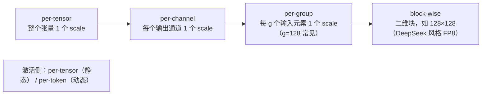
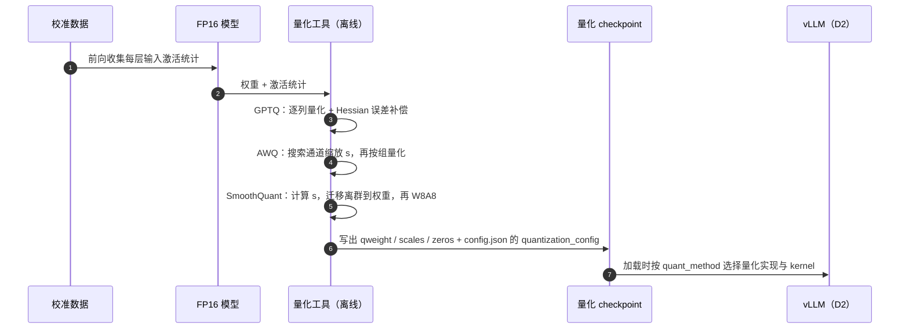

# D1 · 量化基础（深度版）

> **版本**：vLLM 0.30.x（V1 引擎）；本课理论部分与框架无关，vLLM 映射以 0.30.x 为准｜**模块**：D-量化｜**对应原课**：第 10 课（必须与 D2 连读）
> **导航**：上一课：[C3-模型编译] → **本课 D1** → 下一课：[D2-量化实践]
> **练习**：`exercises/D1_quant_math`｜**源码标注**：标【待核】处以 0.30.x tag 为准。

## 0. 先修与本课目标

先修：C1 的 roofline（访存受限 vs 计算受限）；浮点数的符号、指数、尾数表示；矩阵乘法的维度约定。

学完本课你应能：

1. 用 roofline 说清"量化为什么能加速"——以及在什么情况下不能加速；
2. 手算对称/非对称量化的 scale、零点、量化值与反量化误差；
3. 区分 per-tensor、per-channel、per-group、per-token 粒度，并估算它们的元数据开销；
4. 理解 FP8（E4M3/E5M2）与 INT8/INT4 的本质区别；
5. 讲清 GPTQ、AWQ、SmoothQuant 三种主流方法各自解决什么问题；
6. 判断 W4A16、W8A8、FP8、KV Cache 量化分别适合哪类部署场景。

---

## 1. 动机：推理的瓶颈是"搬字节"

C1 与 B6 反复出现一个结论：decode 阶段每一步都要把全部权重从显存读一遍，batch 不够大时是访存受限的。8B 模型 bf16 权重 16 GB，H100 带宽 3.35 TB/s，单步读权重的下界约 4.8 ms，即单请求最多约 200 token/s。**若权重变为 int4（约 4.3 GB，含 scale），下界降到约 1.3 ms，理论上限约 770 token/s**。量化的第一个收益就是减少搬运字节数。

第二个收益是**显存容量**：70B 模型 bf16 需要 140 GB，单张 80 GB 卡放不下；int4 只需约 38 GB，单卡可放，且剩余显存全部用于 KV Cache，并发能力大增。第三个收益是**计算吞吐**：若权重与激活都是 8 位（W8A8 或 FP8），可以使用 Tensor Core 的 8 位矩阵乘，峰值算力约为 bf16 的两倍，这对计算受限的 prefill 有效。

但量化不是免费午餐：精度会下降，且某些组合在特定场景下反而更慢。例如 W4A16 在大 batch 的 prefill 中是计算受限的，需要先把 int4 反量化成 bf16 再算，反量化本身是额外开销，速度可能不如 FP8 甚至不如 bf16。理解这些取舍，是本课的核心。


本课只讲"原理与取舍"，刻意不涉及 vLLM 代码；下一课 D2 会把这里的每个概念对应到 vLLM 的配置类、权重参数与 kernel 上。建议两课连续学习，并在学 D2 时随时回看本课的数字例子。

## 2. 量化的数学：对称与非对称

**对称量化**（零点为 0）：

```
scale = max(|x|) / Qmax          # int8 时 Qmax = 127
q     = round(clip(x / scale, −Qmax, Qmax))
x̂    = q × scale                 # 反量化
```

**数字例子**（与练习一致）：x = [0.5, −1.27, 0.03, 2.54]。

- max|x| = 2.54，scale = 2.54 / 127 = 0.02；
- x / scale = [25, −63.5, 1.5, 127]；
- round（numpy 的 `rint` 采用"四舍六入五成双"，即银行家舍入）：−63.5 → −64，1.5 → 2，得 q = [25, −64, 2, 127]；
- 反量化 x̂ = [0.50, −1.28, 0.04, 2.54]；
- 误差 = [0, −0.01, +0.01, 0]，最大绝对误差 0.01 = scale/2，这是舍入误差的理论上界。

关键观察：**误差上界由 scale 决定，而 scale 由最大绝对值决定**。只要张量中有一个离群值（outlier），比如把 2.54 换成 25.4，scale 就变成 0.2，0.03 会被量化成 0，1.27 量化为 6（反量化 1.2），小数值的信息几乎全部丢失。离群值问题是 LLM 量化中最核心的难点。

**非对称量化**（引入零点 z）：

```
scale = (max(x) − min(x)) / (2^b − 1)
z     = round(−min(x) / scale)
q     = clip(round(x / scale) + z, 0, 2^b − 1)
x̂    = (q − z) × scale
```

当分布不以 0 为中心时（例如 ReLU 后全为非负的激活），非对称量化能用满整个整数范围。代价是计算中多出与零点相关的修正项。权重量化（如 GPTQ、AWQ 的 int4）常用非对称或带零点的形式；激活与 FP8 常用对称形式。

## 3. 量化粒度：精度与元数据的权衡



**元数据开销手算**（权重 [4096, 4096]，int4，scale 用 fp16）：

| 粒度 | scale 个数 | scale 字节 | 相对权重（8 MiB）开销 |
|---|---|---|---|
| per-tensor | 1 | 2 B | ≈0 |
| per-channel | 4 096 | 8 KiB | 0.1% |
| per-group g=128 | 4 096 × 32 = 131 072 | 256 KiB | 3.1%（约 0.125 bit/权重） |
| per-group g=32 | 524 288 | 1 MiB | 12.5% |

粒度越细，每组的最大值越"局部"，离群值的影响越小，精度越好；但元数据越多，反量化的计算与访存也越多。g=128 是 int4 权重量化最常见的折中：每个权重平均多 0.125 bit，实际等效 4.125 bit（若有零点再加一些）。

**静态与动态**：静态量化在离线用校准数据算好激活的 scale，推理时直接用；动态量化在每次推理时实时计算（如对每个 token 求最大值），精度更好但多一次归约。权重总是静态的；激活常用动态 per-token。

## 4. 浮点 8 位：FP8 为什么好用

FP8 有两种格式：

- **E4M3**：4 位指数、3 位尾数，最大值 448，精度较高，常用于权重与前向激活；
- **E5M2**：5 位指数、2 位尾数，最大值 57 344，范围大精度低，常用于训练中的梯度。

与 INT8 相比，FP8 的关键优势是**非均匀量化**：数值越接近 0，可表示的点越密。LLM 的权重和激活大多集中在 0 附近，少量离群值较大，这种分布恰好与浮点格式匹配。因此 FP8 通常只需 per-tensor 或 per-channel 的 scale 就能获得接近 bf16 的精度，而 INT8 往往需要 SmoothQuant 之类的技巧。

**数字例子**：E4M3 在 [1, 2) 区间内的间隔是 2⁻³ = 0.125，在 [0.0625, 0.125) 区间内间隔约 0.0078；而 INT8（scale = 448/127 ≈ 3.53，若用同样的范围）在全范围内间隔都是 3.53。对于大量集中在 ±1 附近的数值，FP8 的分辨率高出一个数量级以上。实践中 FP8 需要先乘以 scale 把数值映射到合适范围（scale = max|x| / 448）。

Hopper（H100）及更新的 GPU 原生支持 FP8 Tensor Core，Ada（L40S、4090）也支持；更早的 Ampere（A100）不支持 FP8 矩阵乘，只能用"FP8 存储 + 反量化计算"的 weight-only 方式（例如 Marlin 类 kernel），收益仅在显存与带宽上。

## 5. 三种主流方法

**GPTQ（权重量化，二阶信息补偿）**。逐列量化权重，每量化一列，就利用输入激活的二阶统计（近似 Hessian，H = 2XXᵀ）把该列的量化误差分摊补偿到尚未量化的列上，使输出误差最小。需要少量校准数据（几百条样本），量化一个 70B 模型需要数小时 GPU 时间。常配合 `act_order`（按激活重要性排序列）提高精度，但会让推理时的 group 索引不连续（`g_idx`），对 kernel 不友好。

**AWQ（权重量化，激活感知缩放）**。观察到只有约 1% 的权重通道"显著"（对应的输入激活幅度大），保护它们就能保住大部分精度。做法是对每个输入通道乘一个缩放因子 s：W' = W · diag(s)，X' = diag(s)⁻¹ · X，乘积不变，但显著通道的权重被放大，量化相对误差变小。s 通过在校准集上网格搜索得到。比 GPTQ 量化更快，泛化通常更好。

**SmoothQuant（W8A8，迁移激活难度）**。激活中存在比权重严重得多的离群通道，直接 per-tensor 量化激活误差很大。SmoothQuant 同样利用"等价缩放"，但方向相反：s_j = max|X_j|^α / max|W_j|^(1−α)（α 常取 0.5），把激活中的离群幅度迁移一部分到权重上，使二者都容易量化。缩放可以融合进前一层的 LayerNorm/RMSNorm 权重，推理时无额外开销。




**反量化发生在哪里？** 理解这一点才能真正判断量化能否加速。weight-only 方案（W4A16）中，int4 权重以压缩形式从显存读入，在 kernel 内部的寄存器或共享内存里被展开为 bf16，再与 bf16 激活做矩阵乘，最后输出 bf16。显存读取量减少了，但 Tensor Core 做的仍是 bf16 计算，并且多了解包与乘 scale 的指令。因此它在访存受限区（小 batch）收益大，在计算受限区（大 batch prefill）收益消失甚至变负。W8A8 方案中，激活在进入矩阵乘前被动态量化为 8 位，矩阵乘直接在 8 位 Tensor Core 上进行，累加在 int32 或 fp32 中完成，最后乘以"权重 scale × 激活 scale"得到输出。它在两个区间都有收益，但多了一次激活量化的开销——这正是 C3 中"RMSNorm + 量化融合"要消除的那部分开销。

## 6. KV Cache 量化

前面讨论的都是权重与激活。B4 与 B6 告诉我们：长上下文、大 batch 下，**decode 的主要访存是 KV**。把 KV 从 bf16 改为 fp8，KV 容量翻倍、注意力读取字节减半。Llama-3-8B 每 token KV 从 128 KiB 降到 64 KiB，53 GB 预算从 43 万 token 增至 87 万 token。KV 量化通常使用 per-tensor 或 per-head 的 scale（可来自 checkpoint 中的校准值，或使用默认值 1.0）。它与权重量化是正交的：一个 W4A16 模型也可以同时用 fp8 KV。

## 7. 场景选择速查

| 方案 | 权重 | 激活 | 典型收益 | 适用 |
|---|---|---|---|---|
| W4A16（GPTQ/AWQ） | int4 | bf16 | 显存 ÷3.5～4，小 batch decode 显著加速 | 单卡放大模型、低并发、延迟敏感 |
| W8A8 INT8（SmoothQuant） | int8 | int8 | 显存 ÷2，计算 ×2 | 无 FP8 的 GPU（A100）上的高吞吐 |
| FP8（W8A8） | fp8 | fp8（动态） | 显存 ÷2，计算 ×2，精度损失小 | H100 等新硬件的默认首选 |
| FP8 KV | — | KV fp8 | KV 容量 ×2 | 长上下文、高并发 |
| W4A8 / FP4 | 4 位 | 8/4 位 | 进一步压缩 | 新硬件（如 Blackwell 的 FP4）【待核：0.30.x 支持范围】 |

## 7.5 一笔完整的部署账：70B 模型放到哪里

把本课的概念合起来算一次。目标：部署一个 70B 级稠密模型（80 层、8 个 KV 头、head_dim 128），希望支持 32 个并发、每个请求平均 8 000 token 上下文。

- **KV 需求**：每 token KV = 2 × 80 × 8 × 128 × 2 B = 320 KiB（bf16）。32 × 8 000 = 25.6 万 token，需要约 78 GiB；若用 fp8 KV，约 39 GiB。
- **方案一：bf16 权重 + bf16 KV**。权重 140 GB + KV 78 GiB + 激活与图约 10 GB，总计约 230 GB，至少需要 4 张 80 GB 卡（TP=4），每卡约 57 GB，余量充足。
- **方案二：FP8 权重 + fp8 KV**。权重约 70 GB + KV 39 GiB + 其他约 8 GB，总计约 120 GB，2 张卡（TP=2）即可，且 FP8 矩阵乘使 prefill 更快。
- **方案三：int4 权重（g=128）+ fp8 KV**。权重约 37 GB + KV 39 GiB + 其他约 6 GB，约 85 GB，单卡放不下但非常接近；若把并发降到 24，单卡可行。代价是在高并发下 int4 反量化 kernel 的计算开销，以及更明显的精度损失。

这笔账说明，量化方案的选择不只是"精度与速度"，还直接决定了**需要几张卡、用什么并行方式**，进而影响通信开销（E2）。在实际项目中，先用这种方式粗算出候选方案，再用 F2 的方法实测，比直接试错高效得多。

## 7.6 如何评估量化后的模型

量化后模型"能跑"不代表"能用"，评估要分层进行。第一层是**数值层面**：对同一批 prompt，比较量化模型与原模型在每个位置上的 logprobs，计算 KL 散度或 top-1 一致率，这是最灵敏的指标，能在下游任务分数变化之前发现问题。第二层是**困惑度**：在一个与业务相近的文本集上比较 perplexity，通常 FP8 的上升在 1% 以内，int4 在 2%～5% 之间，若显著更高则要检查校准或实现。第三层是**下游任务**：选取与业务相关的评测集（问答、代码、数学、长文本），特别关注推理链条长、对数值精度敏感的任务，例如数学推理与长上下文检索往往比常识问答更早暴露量化损伤。第四层是**线上对照**：小流量灰度，比较用户侧指标。

一个常见误区是只看一两个通用基准的平均分。量化误差往往集中在少数困难样本或特定能力上，平均分掩盖了这些退化。另一个误区是忽略长输出：误差会随着生成长度累积，短问答几乎无差异，长篇生成却可能明显变差。因此评估集中一定要包含长输出任务。

## 8. 常见坑 / 故障模式

1. **只看精度不看速度**：W4A16 在高并发、大 batch 下可能比 FP8 慢，因为它在计算受限区还要做反量化。选方案前先确定工作点（batch 大小、prompt 长度）。
2. **校准集与业务不匹配**：用英文百科校准、用于中文代码生成，离群通道分布不同，精度下降明显。
3. **舍入方式差异**：不同实现采用"四舍五入"或"银行家舍入"，结果在 .5 处不同；验证时要知道参考实现用哪种（练习用 numpy `rint`）。
4. **全零张量**：max|x| = 0 时 scale 为 0 会导致除零，练习中约定返回 scale = 1.0。
5. **忽视元数据**：g=32 的 int4 量化等效 4.5 bit 以上，显存收益比预期少。
6. **以为 FP8 在所有 GPU 上都更快**：在不支持 FP8 Tensor Core 的 GPU 上，FP8 只能作为存储格式，计算前要转换。

## 9. 动手练习

- 目录：`exercises/D1_quant_math`
- 任务：实现 `symmetric_scale(x)`（全零时返回 1.0）、`quantize_symmetric(x) -> (q_int8, scale)`、`dequantize_symmetric(q, scale)`，Qmax = 127。
- 运行：

```bash
python -m pytest exercises/D1_quant_math -q
```

- 进阶 1：实现 per-group 量化 `quantize_per_group(w, g)`，对随机矩阵中人为加入一个 50 倍的离群值，比较 per-tensor 与 g=128 的均方误差。
- 进阶 2：实现 SmoothQuant 的缩放 `s = max|X|^α / max|W|^(1−α)`，验证 `(X/s) @ (W*s)ᵀ` 与原始乘积一致，并比较缩放前后 W8A8 量化的误差。

## 10. 自测清单

- [ ] 我能手算一组数据的对称 int8 量化与反量化，并说出误差上界
- [ ] 我能估算 int4 per-group g=128 的元数据开销，以及 8B/70B 模型量化后的显存
- [ ] 我能说清 GPTQ、AWQ、SmoothQuant 的核心思想与各自适用场景

## 11. 延伸阅读

- 论文：GPTQ（ICLR'23）、AWQ（MLSys'24）、SmoothQuant（ICML'23）、FP8 Formats for Deep Learning（2022）、LLM.int8()
- NVIDIA 文档：Transformer Engine 中的 FP8 说明
- 本课程 D2：这些格式在 vLLM 中如何被加载与执行
