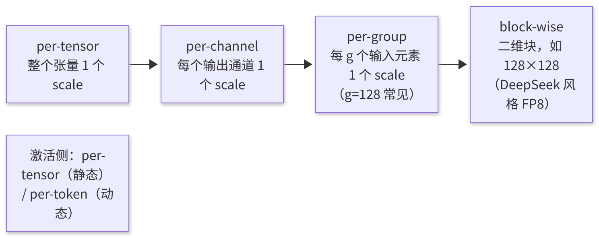
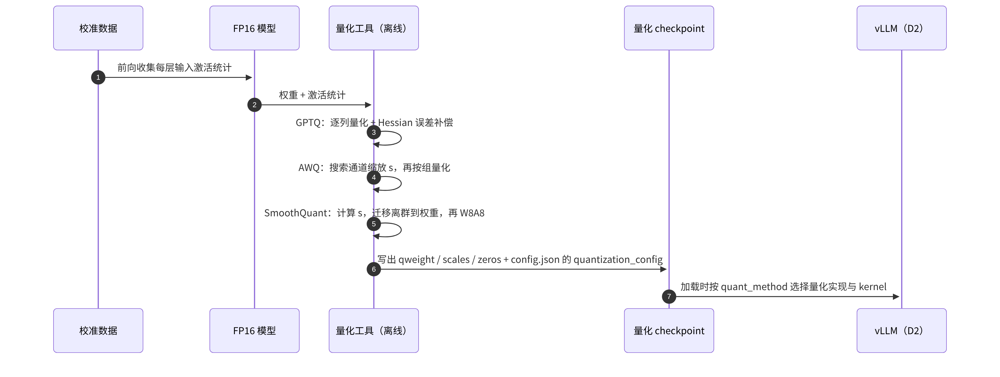

# D1 · 量化基础

> **版本**：vLLM 0.30.x（V1 引擎）；本课理论部分与具体框架无关，vLLM 映射以 0.30.x 为准｜**模块**：D-量化｜**对应原课**：第 10 课（须与 D2 连续学习）
> **导航**：上一课：[C3-模型编译] → **本课 D1** → 下一课：[D2-量化实践]
> **练习**：`exercises/D1_quant_math`｜**源码标注**：标有【待核】之处以 0.30.x tag 的源码为准。

## 0. 先修要求与学习目标

先修要求：C1 中的 roofline 模型（访存受限与计算受限）；浮点数的符号位、指数位与尾数位表示；矩阵乘法的维度约定。

完成本课学习后，学习者应能够：

1. 运用 roofline 模型阐明"量化能够加速的原因"，以及量化无法加速的情形；
2. 手工计算对称/非对称量化的缩放因子（scale）、零点、量化值与反量化误差；
3. 区分 per-tensor、per-channel、per-group、per-token 四种粒度，并估算其元数据开销；
4. 说明 FP8（E4M3/E5M2）与 INT8/INT4 的本质区别；
5. 阐明 GPTQ、AWQ、SmoothQuant 三种主流方法各自解决的问题；
6. 判断 W4A16、W8A8、FP8 与键值缓存（KV Cache）量化分别适用的部署场景。

---

## 1. 动机：推理的瓶颈在于数据搬运量

C1 与 B6 多次得出同一结论：解码（Decode）阶段每一步都须从显存中完整读取一遍全部权重，batch 不够大时属于访存受限。8B 模型的 bf16 权重为 16 GB，H100 带宽为 3.35 TB/s，单步读取权重的下界约为 4.8 ms，即单请求的生成速度上限约为 200 词元（token）/s。**若权重改为 int4（约 4.3 GB，含 scale），则下界降至约 1.3 ms，理论上限约为 770 token/s**。量化的第一项收益即为减少搬运的字节数。

第二项收益是**显存容量**：70B 模型以 bf16 存储需要 140 GB，单张 80 GB 显卡无法容纳；以 int4 存储仅需约 38 GB，单卡即可容纳，且剩余显存可全部用于 KV Cache，并发能力因此大幅提高。第三项收益是**计算吞吐量**：若权重与激活均为 8 位（W8A8 或 FP8），则可使用 Tensor Core 的 8 位矩阵乘法，其峰值算力约为 bf16 的两倍，这对计算受限的预填充（Prefill）阶段有效。

然而，量化并非没有代价：精度会下降，且某些组合在特定场景下反而更慢。例如，W4A16 在大 batch 的 Prefill 中处于计算受限状态，须先将 int4 反量化为 bf16 再进行计算，反量化本身构成额外开销，其速度可能不及 FP8，甚至不及 bf16。理解上述取舍是本课的核心内容。


本课仅讨论"原理与取舍"，有意不涉及 vLLM 代码；下一课 D2 将把本课的每个概念对应至 vLLM 的配置类、权重参数与 kernel。建议两课连续学习，并在学习 D2 时随时回顾本课的数值示例。

## 2. 量化的数学基础：对称与非对称

**对称量化**（零点为 0）：

```
scale = max(|x|) / Qmax          # int8 时 Qmax = 127
q     = round(clip(x / scale, −Qmax, Qmax))
x̂    = q × scale                 # 反量化
```

**数值示例**（与练习一致）：x = [0.5, −1.27, 0.03, 2.54]。

- max|x| = 2.54，scale = 2.54 / 127 = 0.02；
- x / scale = [25, −63.5, 1.5, 127]；
- 舍入（numpy 的 `rint` 采用"四舍六入五成双"，即银行家舍入）：−63.5 → −64，1.5 → 2，得到 q = [25, −64, 2, 127]；
- 反量化结果 x̂ = [0.50, −1.28, 0.04, 2.54]；
- 误差 = [0, −0.01, +0.01, 0]，最大绝对误差为 0.01 = scale/2，这是舍入误差的理论上界。

关键结论：**误差上界由 scale 决定，而 scale 由最大绝对值决定**。只要张量中存在一个离群值（outlier），例如将 2.54 替换为 25.4，scale 即变为 0.2，此时 0.03 将被量化为 0，1.27 将被量化为 6（反量化为 1.2），较小数值的信息几乎全部丢失。离群值问题是大语言模型量化中最核心的难点。

**非对称量化**（引入零点 z）：

```
scale = (max(x) − min(x)) / (2^b − 1)
z     = round(−min(x) / scale)
q     = clip(round(x / scale) + z, 0, 2^b − 1)
x̂    = (q − z) × scale
```

当分布不以 0 为中心时（例如经 ReLU 后全部非负的激活），非对称量化能够充分利用整个整数范围。其代价是计算中需增加与零点相关的修正项。权重量化（如 GPTQ、AWQ 的 int4）通常采用非对称或带零点的形式；激活与 FP8 通常采用对称形式。

## 3. 量化粒度：精度与元数据之间的权衡



<p align="center"><em>图1：量化粒度由粗到细：per-tensor → per-channel → per-group → block-wise</em></p>

**元数据开销的手工计算**（权重为 [4096, 4096]，int4，scale 采用 fp16）：

| 粒度 | scale 个数 | scale 字节 | 相对权重（8 MiB）的开销 |
|---|---|---|---|
| per-tensor | 1 | 2 B | ≈0 |
| per-channel | 4 096 | 8 KiB | 0.1% |
| per-group g=128 | 4 096 × 32 = 131 072 | 256 KiB | 3.1%（约 0.125 bit/权重） |
| per-group g=32 | 524 288 | 1 MiB | 12.5% |

粒度越细，每组的最大值越具"局部性"，离群值的影响越小，精度越高；但元数据越多，反量化所需的计算与访存也越多。g=128 是 int4 权重量化中最常见的折中方案：每个权重平均增加 0.125 bit，实际等效于 4.125 bit（若含零点则再略有增加）。

**静态与动态**：静态量化在离线阶段使用校准数据计算激活的 scale，推理时直接使用；动态量化在每次推理时实时计算（如对每个 token 求最大值），精度更高，但需额外执行一次归约。权重总是采用静态量化；激活通常采用动态的 per-token 量化。

## 4. 8 位浮点：FP8 的优势

FP8 有两种格式：

- **E4M3**：4 位指数、3 位尾数，最大值为 448，精度较高，通常用于权重与前向激活；
- **E5M2**：5 位指数、2 位尾数，最大值为 57 344，范围较大而精度较低，通常用于训练中的梯度。

与 INT8 相比，FP8 的关键优势在于**非均匀量化**：数值越接近 0，可表示的点越密集。大语言模型的权重与激活大多集中于 0 附近，仅有少量离群值较大，这种分布恰好与浮点格式相匹配。因此，FP8 通常仅需 per-tensor 或 per-channel 的 scale 即可获得接近 bf16 的精度，而 INT8 往往需要借助 SmoothQuant 一类的技术。

**数值示例**：E4M3 在 [1, 2) 区间内的间隔为 2⁻³ = 0.125，在 [0.0625, 0.125) 区间内的间隔约为 0.0078；而 INT8（若采用相同范围，scale = 448/127 ≈ 3.53）在全范围内的间隔均为 3.53。对于大量集中在 ±1 附近的数值，FP8 的分辨率高出一个数量级以上。实践中，FP8 需先乘以 scale，将数值映射至合适的范围（scale = max|x| / 448）。

Hopper（H100）及更新的 GPU 原生支持 FP8 Tensor Core，Ada（L40S、4090）亦提供支持；更早的 Ampere（A100）不支持 FP8 矩阵乘法，只能采用"FP8 存储 + 反量化计算"的 weight-only 方式（例如 Marlin 类 kernel），其收益仅体现在显存与带宽方面。

## 5. 三种主流方法

**GPTQ（权重量化，基于二阶信息的误差补偿）**。该方法逐列量化权重，每量化一列，即利用输入激活的二阶统计量（近似 Hessian，H = 2XXᵀ）将该列的量化误差分摊补偿至尚未量化的列，从而使输出误差最小。该方法需要少量校准数据（数百条样本），量化一个 70B 模型需要数小时的 GPU 时间。通常配合 `act_order`（按激活重要性对列排序）以提高精度，但这会使推理时的 group 索引不连续（`g_idx`），对 kernel 不友好。

**AWQ（权重量化，激活感知缩放）**。该方法基于以下观察：仅约 1% 的权重通道是"显著"的（其对应的输入激活幅度较大），保护这些通道即可保留大部分精度。具体做法是对每个输入通道乘以缩放因子 s：W' = W · diag(s)，X' = diag(s)⁻¹ · X，乘积保持不变，但显著通道的权重被放大，量化的相对误差随之减小。s 通过在校准集上进行网格搜索得到。该方法的量化速度快于 GPTQ，泛化性能通常也更好。

**SmoothQuant（W8A8，迁移激活的量化难度）**。激活中存在比权重严重得多的离群通道，直接对激活进行 per-tensor 量化将产生较大误差。SmoothQuant 同样利用"等价缩放"，但方向相反：s_j = max|X_j|^α / max|W_j|^(1−α)（α 通常取 0.5），将激活中的部分离群幅度迁移至权重，使二者均易于量化。该缩放可融合进前一层 LayerNorm/RMSNorm 的权重中，因此推理时不产生额外开销。



<p align="center"><em>图2：离线量化流程：校准 → GPTQ / AWQ / SmoothQuant → 量化 checkpoint → vLLM 加载</em></p>


**反量化的发生位置**。理解这一点，方能准确判断量化能否带来加速。在 weight-only 方案（W4A16）中，int4 权重以压缩形式从显存读入，在 kernel 内部的寄存器或共享内存中被展开为 bf16，再与 bf16 激活执行矩阵乘法，最终输出 bf16。显存读取量虽然减少，但 Tensor Core 执行的仍是 bf16 计算，且增加了解包与乘以 scale 的指令。因此，该方案在访存受限区间（小 batch）收益显著，而在计算受限区间（大 batch 的 Prefill）收益消失甚至变为负值。在 W8A8 方案中，激活在进入矩阵乘法之前被动态量化为 8 位，矩阵乘法直接在 8 位 Tensor Core 上执行，累加在 int32 或 fp32 中完成，最后乘以"权重 scale × 激活 scale"得到输出。该方案在两个区间均有收益，但增加了一次激活量化的开销——这正是 C3 中"RMSNorm + 量化融合"所要消除的开销。

## 6. KV Cache 量化

前文讨论的均为权重与激活。B4 与 B6 表明：在长上下文、大 batch 条件下，**Decode 阶段的主要访存来自 KV**。将 KV 由 bf16 改为 fp8 后，KV 容量翻倍，注意力读取的字节数减半。Llama-3-8B 每个 token 的 KV 占用由 128 KiB 降至 64 KiB，53 GB 预算可容纳的 token 数由 43 万增至 87 万。KV 量化通常使用 per-tensor 或 per-head 的 scale（可取自 checkpoint 中的校准值，或使用默认值 1.0）。KV 量化与权重量化相互正交：一个 W4A16 模型亦可同时使用 fp8 KV。

## 7. 场景选择速查

| 方案 | 权重 | 激活 | 典型收益 | 适用场景 |
|---|---|---|---|---|
| W4A16（GPTQ/AWQ） | int4 | bf16 | 显存 ÷3.5～4，小 batch Decode 显著加速 | 单卡部署大模型、低并发、时延敏感 |
| W8A8 INT8（SmoothQuant） | int8 | int8 | 显存 ÷2，计算 ×2 | 不支持 FP8 的 GPU（A100）上的高吞吐场景 |
| FP8（W8A8） | fp8 | fp8（动态） | 显存 ÷2，计算 ×2，精度损失小 | H100 等新硬件的默认首选 |
| FP8 KV | — | KV fp8 | KV 容量 ×2 | 长上下文、高并发 |
| W4A8 / FP4 | 4 位 | 8/4 位 | 进一步压缩 | 新硬件（如 Blackwell 的 FP4）【待核：0.30.x 支持范围】 |

## 7.5 完整的部署估算：70B 模型的部署方案

以下综合本课概念进行一次完整估算。目标：部署一个 70B 级稠密模型（80 层、8 个 KV 头、head_dim 为 128），要求支持 32 个并发请求，每个请求的平均上下文长度为 8 000 token。

- **KV 需求**：每 token KV = 2 × 80 × 8 × 128 × 2 B = 320 KiB（bf16）。32 × 8 000 = 25.6 万 token，约需 78 GiB；若使用 fp8 KV，则约需 39 GiB。
- **方案一：bf16 权重 + bf16 KV**。权重 140 GB + KV 78 GiB + 激活与图约 10 GB，合计约 230 GB，至少需要 4 张 80 GB 显卡（TP=4），每卡约 57 GB，余量充足。
- **方案二：FP8 权重 + fp8 KV**。权重约 70 GB + KV 39 GiB + 其他约 8 GB，合计约 120 GB，2 张显卡（TP=2）即可满足，且 FP8 矩阵乘法使 Prefill 更快。
- **方案三：int4 权重（g=128）+ fp8 KV**。权重约 37 GB + KV 39 GiB + 其他约 6 GB，约 85 GB，单卡无法容纳但已十分接近；若将并发数降至 24，则单卡可行。其代价是高并发下 int4 反量化 kernel 的计算开销，以及更明显的精度损失。

上述估算表明，量化方案的选择不仅关乎"精度与速度"，还直接决定了**所需的显卡数量与并行方式**，进而影响通信开销（E2）。在实际项目中，先以上述方式粗略估算出候选方案，再按照 F2 的方法进行实测，其效率远高于直接试错。

## 7.6 量化模型的评估方法

量化后的模型"能够运行"并不意味着"能够使用"，评估应分层进行。第一层为**数值层面**：对同一批 prompt，比较量化模型与原模型在每个位置上的 logprobs，计算 KL 散度或 top-1 一致率；这是最灵敏的指标，能够在下游任务分数发生变化之前发现问题。第二层为**困惑度**：在与业务相近的文本集上比较 perplexity；通常 FP8 的上升幅度在 1% 以内，int4 在 2%～5% 之间，若显著高于此范围，则应检查校准过程或实现。第三层为**下游任务**：选取与业务相关的评测集（问答、代码、数学、长文本），并重点关注推理链条长、对数值精度敏感的任务，例如数学推理与长上下文检索往往比常识问答更早暴露量化造成的损伤。第四层为**线上对照**：以小流量灰度发布，比较用户侧指标。

一个常见误区是仅关注一两个通用基准的平均分。量化误差往往集中于少数困难样本或特定能力上，平均分会掩盖这些退化。另一个误区是忽略长输出：误差会随生成长度累积，短问答中几乎无差异，而长篇生成的质量却可能明显下降。因此，评估集中必须包含长输出任务。

## 8. 常见问题与故障模式

1. **仅关注精度而忽视速度**：W4A16 在高并发、大 batch 下可能慢于 FP8，原因在于其在计算受限区间仍需执行反量化。选择方案前应先确定工作点（batch 大小、prompt 长度）。
2. **校准集与业务不匹配**：以英文百科数据校准而用于中文代码生成时，离群通道的分布不同，精度下降明显。
3. **舍入方式的差异**：不同实现分别采用"四舍五入"或"银行家舍入"，二者在 .5 处的结果不同；验证时应明确参考实现所采用的方式（练习使用 numpy `rint`）。
4. **全零张量**：max|x| = 0 时 scale 为 0，将导致除零错误；练习中约定此时返回 scale = 1.0。
5. **忽视元数据**：g=32 的 int4 量化等效于 4.5 bit 以上，显存收益低于预期。
6. **误认为 FP8 在所有 GPU 上均更快**：在不支持 FP8 Tensor Core 的 GPU 上，FP8 仅能作为存储格式，计算前须进行转换。

## 9. 实践练习

- 目录：`exercises/D1_quant_math`
- 任务：实现 `symmetric_scale(x)`（全零时返回 1.0）、`quantize_symmetric(x) -> (q_int8, scale)` 与 `dequantize_symmetric(q, scale)`，其中 Qmax = 127。
- 运行方式：

```bash
python -m pytest exercises/D1_quant_math -q
```

- 验收标准：上述测试全部通过；对第 2 节示例输入，应得到 scale = 0.02、q = [25, −64, 2, 127]。
- 进阶任务 1：实现 per-group 量化 `quantize_per_group(w, g)`，在随机矩阵中人为加入一个 50 倍的离群值，比较 per-tensor 与 g=128 两种方式的均方误差。
- 进阶任务 2：实现 SmoothQuant 的缩放 `s = max|X|^α / max|W|^(1−α)`，验证 `(X/s) @ (W*s)ᵀ` 与原始乘积一致，并比较缩放前后 W8A8 量化的误差。

## 10. 自测题

- [ ] 能否手工计算一组数据的对称 int8 量化与反量化，并给出误差上界
- [ ] 能否估算 int4 per-group g=128 的元数据开销，以及 8B/70B 模型量化后的显存占用
- [ ] 能否阐明 GPTQ、AWQ、SmoothQuant 的核心思想及各自的适用场景

## 11. 延伸阅读

- 论文：GPTQ（ICLR'23）、AWQ（MLSys'24）、SmoothQuant（ICML'23）、FP8 Formats for Deep Learning（2022）、LLM.int8()
- NVIDIA 文档：Transformer Engine 中的 FP8 说明
- 本课程 D2：上述格式在 vLLM 中的加载与执行方式

---

**课程导航**　上一课：[C3 · torch.compile 与 vLLM 编译栈](https://qcngm3vce6yt.feishu.cn/docx/Ybd2d5XAyobiqXxrgazcBtEentc)｜下一课：[D2 · vLLM 量化模块实践](https://qcngm3vce6yt.feishu.cn/docx/Dvaddy2dgowrRRxjwc2cWEpwnrh)｜[返回索引](https://qcngm3vce6yt.feishu.cn/docx/KUn5dKSejoQSAJxaf7YcvNVDnCd)

相关章节：
- [C1 · Triton 算子入门与 Attention 后端](https://qcngm3vce6yt.feishu.cn/docx/Msn0d9x8ioVNfvx3ESFcUhelnQ9)——见本课「0. 先修要求与学习目标」：“先修要求：C1 中的 roofline 模型（访存受限与计算受限）”
- [B6 · V1 架构总览与推理主路径](https://qcngm3vce6yt.feishu.cn/docx/FV3gdoLxEo55VtxFlnkc41Lhn6g)——见本课「1. 动机：推理的瓶颈在于数据搬运量」：“C1 与 B6 多次得出同一结论”
- [B4 · PagedAttention 与 KV Cache 显存管理](https://qcngm3vce6yt.feishu.cn/docx/OOo7d5yZvoKv2ZxauPOcBDOincb)——见本课「6. KV Cache 量化」：“前文讨论的均为权重与激活。B4 与 B6 表明”
