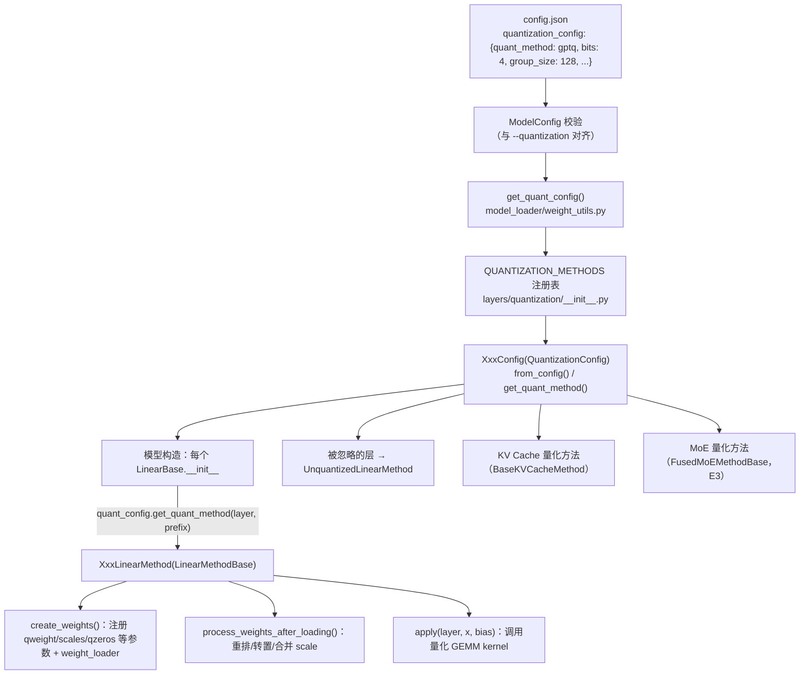
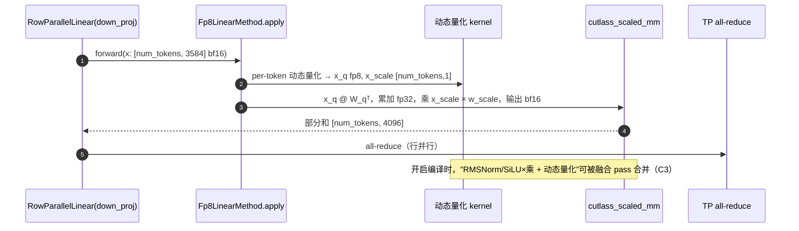

# D2 · vLLM 量化模块实践（深度版）

> **版本**：vLLM 0.30.x（V1 引擎）｜**模块**：D-量化｜**对应原课**：第 11 课（与 D1 连读）
> **导航**：上一课：[D1-量化基础] → **本课 D2** → 下一课：[E1-数据并行]
> **练习**：`exercises/D2_quant_config_parse`｜**源码标注**：量化方法注册表变化频繁，标【待核】处以 0.30.x tag 为准。

## 0. 先修与本课目标

先修：D1（scale、粒度、GPTQ/AWQ/FP8 的原理）；B5（`initialize_model`、`weight_loader`、`process_weights_after_loading`）；C3（融合 pass）。

学完本课你应能：

1. 说清一个量化 checkpoint 从 `config.json` 到 GPU kernel 的完整路径；
2. 掌握 vLLM 量化的两个核心抽象：`QuantizationConfig`（模型级）与 `QuantizeMethodBase`（层级），以及它们的五个关键方法；
3. 手算 GPTQ int4 线性层的 `qweight`、`scales`、`qzeros`、`g_idx` 形状与字节数；
4. 理解"加载后重排"（如转为 Marlin 格式）的意义；
5. 会用在线 FP8 量化、预量化 checkpoint、FP8 KV Cache 三种方式部署，并能排查常见错误。

---

## 1. 动机：一套框架接住几十种量化格式

社区中存在大量量化格式：AutoGPTQ 与 AutoAWQ 产出的 int4、llm-compressor 产出的 compressed-tensors（覆盖 W8A8、FP8、W4A16 等多种方案）、ModelOpt 产出的 FP8/FP4、bitsandbytes、GGUF……每种格式的张量命名、打包方式、scale 布局都不同，对应的高性能 kernel 也不同（Marlin、Machete、CUTLASS scaled_mm、Triton 等）。如果在模型代码里为每种格式写分支，模型代码将不可维护。

vLLM 的解法是把"量化"完全从模型代码中剥离：模型只使用标准的并行线性层（B5），每个线性层在构造时询问量化配置"我该用什么方法"，由方法对象负责创建参数、加载后处理、前向计算。新增一种量化格式只需实现一对配置类与方法类，并注册名字，所有模型自动获得支持。


**一句话串起 D1 与 D2**：D1 中的每个概念在 vLLM 中都有确定的落点——"scale 与粒度"落在 `create_weights` 注册的 scale 参数形状上；"静态与动态"落在 `apply` 中是否对激活实时求最大值；"GPTQ/AWQ/SmoothQuant"决定的是离线工具产出什么张量，vLLM 只负责读取；"FP8 与 INT8"决定了能用哪类 Tensor Core 指令，进而决定 kernel 选择；"KV 量化"则落在 KV Cache 张量的 dtype 与块数上（B4）。带着这张对应表读源码，你会发现量化模块虽然文件众多，结构却高度一致。

## 2. 架构图：两层抽象



## 3. 源码走读（调用顺序）

1. **配置来源**：`vllm/config/model.py`（或 `config.py`）中 `ModelConfig._verify_quantization()` 读取 HF 配置中的 `quantization_config.quant_method`，与命令行 `--quantization` 比对；对于有"更快变体"的方法会自动升级，例如检测到 GPU 支持时把 `gptq` 升级为 `gptq_marlin`、把 `awq` 升级为 `awq_marlin`（通过各配置类的 `override_quantization_method()`）。【待核：0.30.x 的升级规则】
2. **构造配置对象**：`vllm/model_executor/model_loader/weight_utils.py`：`get_quant_config(model_config, load_config)` → `get_quantization_config(name)` 从注册表取类 → `cls.from_config(hf_quant_config)`；若 HF 配置中没有，则尝试读取 `cls.get_config_filenames()` 指定的独立文件（如 `quantize_config.json`）。在线量化（如 `--quantization fp8` 加载 bf16 checkpoint）则直接用默认参数构造。
3. **能力检查**：`QuantizationConfig.get_min_capability()`（如 FP8 W8A8 需要 89 即 Ada/Hopper；Marlin 需要 80）与 `get_supported_act_dtypes()`，不满足时启动报错或回退。
4. **注入到层**：`vllm/model_executor/layers/linear.py` 中 `LinearBase.__init__`：`self.quant_method = quant_config.get_quant_method(self, prefix=prefix)`，若返回 None 或层名在忽略列表中，则用 `UnquantizedLinearMethod`。`prefix`（如 `model.layers.0.mlp.down_proj`）就是 B5 中模型构造时层层传入的名字，量化配置据此判断这一层是否量化、用什么精度。
5. **创建参数**：`quant_method.create_weights(layer, input_size_per_partition, output_partition_sizes, input_size, output_size, params_dtype, weight_loader=...)`。注意它拿到的已经是 **TP 分片后的尺寸**，并为每个参数挂上 `weight_loader` 以及打包维度、输入/输出维度等属性，使 B5 中的分片加载逻辑对量化参数同样适用。
6. **加载后处理**：`BaseModelLoader.load_model()` 末尾调用每层 `quant_method.process_weights_after_loading(layer)`：GPTQ Marlin 在此把 checkpoint 布局的 `qweight` 重排成 Marlin kernel 需要的分块交错布局，并处理 `g_idx` 排序；FP8 在此把多个合并分片（q/k/v）的 per-tensor scale 统一为最大值并重新量化，或把权重转置为 CUTLASS 需要的布局。
7. **前向**：`LinearBase.forward(x)` → `self.quant_method.apply(self, x, bias)`：FP8 方法先对激活动态量化（per-token 或 per-tensor）再调用 `cutlass_scaled_mm`；Marlin 方法直接调用 `gptq_marlin_gemm`（在 kernel 内部反量化）。
8. **相关目录**：`vllm/model_executor/layers/quantization/`：`fp8.py`、`gptq_marlin.py`、`awq_marlin.py`、`compressed_tensors/`（含多种 scheme）、`modelopt.py`、`bitsandbytes.py`、`gguf.py`、`kv_cache.py`；`utils/` 下有 Marlin、FP8、W8A8 等通用工具；`kernels/` 下按"线性层 kernel 选择器"组织不同后端。【待核：目录结构】

## 4. 数字例子：一个 GPTQ int4 线性层的张量形状

以 `down_proj`：in = 14 336，out = 4 096，bits = 4，group_size = 128，TP = 1 为例。GPTQ checkpoint 的约定是沿**输入维**按 32 位整数打包 8 个 int4：

| 张量 | 形状 | dtype | 字节数 |
|---|---|---|---|
| `qweight` | [14336 / 8, 4096] = [1792, 4096] | int32 | 28 MiB |
| `scales` | [14336 / 128, 4096] = [112, 4096] | fp16 | 896 KiB |
| `qzeros` | [112, 4096 / 8] = [112, 512] | int32 | 224 KiB |
| `g_idx`（act_order 时） | [14336] | int32 | 56 KiB |
| 对照：bf16 原权重 | [4096, 14336] | bf16 | 112 MiB |

压缩比约 112 / 29.2 ≈ 3.8 倍。注意 GPTQ 的 `qweight` 是 [in, out] 方向（与 PyTorch 的 [out, in] 相反），这就是为什么必须由量化方法自己定义 `input_dim`、`output_dim`、`packed_dim` 等属性，让 `weight_loader` 在正确的维度上做 TP 切片。

**TP=4 时的切片**：`down_proj` 是行并行，沿输入维切分，每个 rank 的 in = 3 584：`qweight` → [448, 4096]，`scales` → [28, 4096]，`qzeros` → [28, 512]。3 584 / 128 = 28 正好整除；若 group_size 不能整除每 rank 的输入维，就无法切分——这是量化模型 TP 配置受限的常见原因。

**FP8 的情形**：同一层 FP8 per-tensor 量化，`weight` 为 [4096, 14336] fp8（56 MiB）+ 1 个 `weight_scale`（fp32），若是静态激活量化再加一个 `input_scale`。合并层（如 `qkv_proj`）在 checkpoint 中有 3 个独立的 weight_scale，加载后需要统一（第 3 节第 6 步）。

## 4.5 为什么要"加载后重排"

初学者常疑惑：既然 checkpoint 里已经是量化好的权重，为什么不直接拿来算，还要在 `process_weights_after_loading` 里再处理一遍？原因在于**存储格式与计算格式的目标不同**。checkpoint 格式追求通用与可移植：GPTQ 的打包方式是多年前为通用 CUDA kernel 设计的，按输入维简单地把 8 个 int4 塞进一个 int32；而高性能 kernel 追求的是"一次访存正好喂饱一组 Tensor Core 指令"，需要把权重按特定的分块、交错顺序重新排列，使每个线程束加载到的数据无需再做跨线程交换就能直接解包使用。

重排是一次性的启动开销（几秒到几十秒），换来的是此后每一步的高效计算。类似地，FP8 方法在加载后统一合并层的 scale：`qkv_proj` 由三个独立量化的矩阵合并而成，checkpoint 中各有自己的 scale，而 kernel 希望整个合并矩阵只有一个 per-tensor scale，所以要取三者最大值并对其余两段重新量化。这一步会引入极小的额外误差，但换来一次 GEMM 完成三个投影。

还有一个工程上的好处：重排逻辑与模型代码、加载逻辑完全解耦。B5 中的 `weight_loader` 只负责"按 TP 切片后原样拷贝"，所有格式转换都在加载结束后集中完成，这让分片逻辑对所有量化格式通用。

## 5. 一次前向的数据流



## 6. 三种部署方式

```bash
# ① 在线 FP8：加载 bf16 checkpoint，启动时动态量化权重（无需校准，精度通常可接受）
vllm serve meta-llama/Llama-3.1-8B-Instruct --quantization fp8

# ② 预量化 checkpoint：自动从 config.json 识别方法（GPTQ/AWQ/compressed-tensors/ModelOpt…）
vllm serve <某个 AWQ 或 FP8 量化后的模型目录>

# ③ FP8 KV Cache：可与 ① ② 叠加
vllm serve <模型> --kv-cache-dtype fp8
```

方式 ① 最方便，但权重 scale 是简单的 per-tensor 或 per-channel 最大值，不做校准；方式 ② 用离线工具（例如 llm-compressor 生成 compressed-tensors 格式）做了校准，精度更好，是生产推荐路径。KV fp8 的 scale 若 checkpoint 中没有提供，会使用默认值，精度可能略差，可通过校准得到更合适的 scale。

## 6.5 读懂一份 compressed-tensors 配置

生产中最常见的预量化格式之一是 llm-compressor 产出的 compressed-tensors。它的 `quantization_config` 结构比 GPTQ 复杂，但逻辑清晰，读懂它就能判断 vLLM 会选择哪种实现。一份典型的 FP8 动态量化配置包含以下要素：

- **config_groups**：若干量化组，每组用 `targets` 指定作用的层类型（通常是 `Linear`），并分别描述 `weights` 与 `input_activations` 的量化方式：位数（8）、类型（float 或 int）、是否对称、粒度策略（tensor、channel、group、token、block）、是否动态。
- **ignore**：不量化的层名列表，常见如 `lm_head`，MoE 模型还会包含路由 gate，多模态模型包含视觉塔。
- **kv_cache_scheme**：可选，描述 KV Cache 的量化方式。
- **format**：权重的存储格式，例如 `float-quantized`、`pack-quantized`（int4 打包）等。

vLLM 的 `CompressedTensorsConfig` 读取这些信息后，为每个线性层匹配一个"方案"（scheme），例如"权重 FP8 per-channel + 激活 FP8 动态 per-token"对应 W8A8 FP8 方案，"权重 int4 group=128 + 激活不量化"对应 W4A16 方案，再由方案决定创建哪些参数、调用哪种 kernel。理解这一点后，遇到"同一个模型不同层用了不同精度"（混合精度量化）也不会困惑：每层的 prefix 匹配到哪个组，就用哪个方案。

## 6.6 kernel 选择：同一种格式，不同的执行路径

同一份 int4 权重，在不同 GPU 与 batch 下可能由不同 kernel 执行，这是很多人忽略的地方：

- **Marlin 系列**：为 weight-only 混合精度矩阵乘设计，int4/int8/fp8 权重 + fp16/bf16 激活，在小到中等 batch 下接近理论带宽上限，支持 Ampere 及更新的 GPU。GPTQ 与 AWQ 在满足条件时会被自动升级为 Marlin 实现。
- **Machete**：面向 Hopper 的新一代混合精度 kernel，利用新硬件特性在更大 batch 下表现更好。【待核：0.30.x 中的启用条件】
- **CUTLASS scaled_mm**：W8A8（int8 或 fp8）的主力，激活与权重都是 8 位，直接使用 8 位 Tensor Core。
- **Triton 实现**：作为可移植的后备，或用于某些 MoE 量化路径。

vLLM 通过"线性层 kernel 选择器"按硬件能力、量化类型、形状约束依次尝试候选实现，选中第一个满足条件的。启动日志会打印所选 kernel，例如"Using MarlinLinearKernel"。当你看到量化模型性能与预期不符时，第一步就是确认日志里的 kernel 是否是你预想的那个——很多性能问题的根源是因为形状不满足某个 kernel 的对齐要求，悄悄回退到了更慢的实现。

## 6.7 实战：新增一种量化方法需要做什么

假设你要接入一种新的权重格式，按照 vLLM 的抽象只需四步，这也是检验你是否真正理解本课的最好方式：

1. **实现配置类**：继承 `QuantizationConfig`，实现 `get_name`（注册名）、`get_supported_act_dtypes`、`get_min_capability`、`get_config_filenames`、`from_config`（从 checkpoint 配置中解析位数、组大小等）以及 `get_quant_method`（根据层类型与 prefix 返回方法对象，对忽略层返回非量化方法）。
2. **实现线性层方法类**：继承 `LinearMethodBase`，在 `create_weights` 中按分片后的尺寸注册压缩权重、scale、零点等参数，并正确设置每个参数的输入维、输出维、打包维与 `weight_loader`，使 B5 的分片加载对它们同样适用；在 `process_weights_after_loading` 中把权重转换为 kernel 需要的布局；在 `apply` 中调用 kernel。
3. **注册**：把名字加入量化方法注册表，或通过插件机制在外部注册。
4. **验证**：先在单卡 eager 模式下对比反量化后的权重与原始权重，再对比整模型输出，最后在 TP=2 下验证切片是否正确。

如果新格式也要支持 MoE 模型，还需要实现对应的 MoE 方法类，因为 MoE 的专家权重是三维张量并由专门的 fused MoE kernel 计算（E3），与普通线性层的路径不同。

## 7. 常见坑 / 故障模式

1. **`--quantization` 与 checkpoint 冲突**：checkpoint 是 AWQ 却指定 `--quantization gptq`，启动报错。预量化模型通常不需要指定该参数。
2. **GPU 能力不足**：在 A100 上使用 FP8 W8A8，会回退到 weight-only FP8（Marlin）或报错；日志中会提示所用 kernel，务必确认。
3. **TP 切分与 group_size 不整除**：如上节所述，改 TP 或换 group_size 更小的 checkpoint。
4. **忽略列表写错层名**：某些层（如 lm_head、MoE 的路由 gate、视觉编码器）通常不量化，checkpoint 的 `ignore`/`modules_to_not_convert` 若与 vLLM 的层名前缀不一致，这些层会被错误地按量化参数创建，加载时报形状不匹配。
5. **激活 scale 缺失**：静态量化方案要求 checkpoint 提供 `input_scale`，缺失时加载失败或回退动态量化。
6. **以为量化一定更快**：参见 D1 第 1 节；在高并发下用 F2 的方法实测 W4A16 与 FP8。
7. **精度问题定位**：先把 `--kv-cache-dtype` 改回 auto 排除 KV 量化的影响，再对比 eager 与编译模式排除融合 pass 的影响，最后才怀疑权重量化本身。

8. **把在线 FP8 当成最终方案**：在线量化省去了离线流程，但没有校准，对离群值敏感的模型可能出现可感知的质量下降；上线前务必按 D1 第 7.6 节分层评估，必要时改用离线校准的 checkpoint。

## 8. 动手练习

- 目录：`exercises/D2_quant_config_parse`
- 任务：实现 `parse_quant_config(data)`：接受 dict 或 JSON 字符串；`method` 不区分大小写且必须属于 {fp8, awq, gptq, smoothquant, int8}；`bits` 缺省为 8 且必须为 4/8/16；`ignore_layers` 必须是字符串列表；非 dict 输入抛 `TypeError`，其他非法输入抛 `ValueError`。
- 运行：

```bash
python -m pytest exercises/D2_quant_config_parse -q
```

- 进阶 1：仿照 vLLM 的 `get_quant_method(layer, prefix)`，实现 `method_for_layer(cfg, prefix)`：prefix 匹配 `ignore_layers` 中任一项（支持前缀匹配）时返回 `"unquantized"`，否则返回 `cfg.method`。
- 进阶 2：实现 `gptq_shapes(in_features, out_features, bits, group_size, tp_size, tp_rank, row_parallel)`，返回第 4 节表格中的各张量形状，并对不整除情形抛错。

## 9. 自测清单

- [ ] 我能说出 `QuantizationConfig` 与 `QuantizeMethodBase` 各自的职责，以及 `create_weights → process_weights_after_loading → apply` 的调用时机
- [ ] 我能手算 GPTQ int4 层在给定 TP 下的 qweight、scales、qzeros 形状
- [ ] 我能根据 GPU 型号与负载选择在线 FP8、预量化 checkpoint 或 FP8 KV

## 10. 延伸阅读

- vLLM 文档：Quantization 章节（支持的方法与硬件矩阵）
- llm-compressor 文档（生成 compressed-tensors 格式）；Marlin kernel 论文/仓库说明
- 源码：`vllm/model_executor/layers/quantization/`、`vllm/model_executor/layers/linear.py`、`vllm/model_executor/parameter.py`
