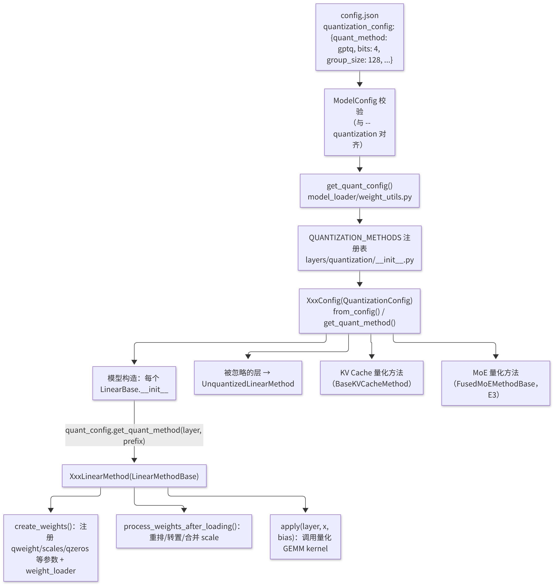
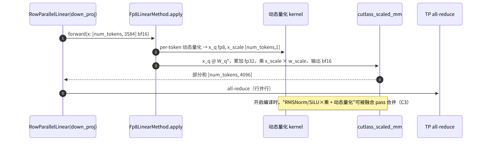

# D2 · vLLM 量化模块实践

> **版本**：vLLM 0.30.x（V1 引擎）｜**模块**：D-量化｜**对应原课**：第 11 课（须与 D1 连续学习）
> **导航**：上一课：[D1-量化基础] → **本课 D2** → 下一课：[E1-数据并行]
> **练习**：`exercises/D2_quant_config_parse`｜**源码标注**：量化方法注册表变化频繁，标有【待核】之处以 0.30.x tag 的源码为准。

## 0. 先修要求与学习目标

先修要求：D1（scale、量化粒度以及 GPTQ/AWQ/FP8 的原理）；B5（`initialize_model`、`weight_loader`、`process_weights_after_loading`）；C3（融合 pass）。

完成本课学习后，学习者应能够：

1. 阐明一个量化 checkpoint 从 `config.json` 到 GPU 内核（kernel）的完整路径；
2. 掌握 vLLM 量化的两个核心抽象，即 `QuantizationConfig`（模型级）与 `QuantizeMethodBase`（层级），以及二者的五个关键方法；
3. 手工计算 GPTQ int4 线性层中 `qweight`、`scales`、`qzeros`、`g_idx` 的形状与字节数；
4. 说明"加载后重排"（如转换为 Marlin 格式）的意义；
5. 能够以在线 FP8 量化、预量化 checkpoint、FP8 键值缓存（KV Cache）三种方式部署模型，并排查常见错误。

---

## 1. 动机：以统一框架支持数十种量化格式

社区中存在大量量化格式：AutoGPTQ 与 AutoAWQ 产出的 int4、llm-compressor 产出的 compressed-tensors（覆盖 W8A8、FP8、W4A16 等多种方案）、ModelOpt 产出的 FP8/FP4，以及 bitsandbytes、GGUF 等。每种格式的张量命名、打包方式与 scale 布局均不相同，所对应的高性能 kernel 亦各不相同（Marlin、Machete、CUTLASS scaled_mm、Triton 等）。若在模型代码中为每种格式编写分支，模型代码将无法维护。

vLLM 的解决方案是将"量化"完全从模型代码中剥离：模型仅使用标准的并行线性层（B5），每个线性层在构造时向量化配置查询所应采用的方法，并由方法对象负责创建参数、执行加载后处理与前向计算。新增一种量化格式时，仅需实现一对配置类与方法类并注册其名称，所有模型即可自动获得支持。


**D1 与 D2 的对应关系**：D1 中的每个概念在 vLLM 中均有确定的对应位置——"scale 与粒度"对应于 `create_weights` 所注册的 scale 参数的形状；"静态与动态"对应于 `apply` 中是否对激活实时求最大值；"GPTQ/AWQ/SmoothQuant"决定离线工具产出何种张量，vLLM 仅负责读取；"FP8 与 INT8"决定可使用何种 Tensor Core 指令，进而决定 kernel 的选择；"KV 量化"则对应于 KV Cache 张量的 dtype 与块数（B4）。依据这一对应关系阅读源码可以发现，量化模块虽然文件众多，但结构高度一致。

## 2. 架构图：两层抽象



<p align="center"><em>图1：vLLM 量化模块的两层抽象：QuantizationConfig 与 QuantizeMethod</em></p>

## 3. 源码分析（按调用顺序）

1. **配置来源**：`vllm/config/model.py`（或 `config.py`）中的 `ModelConfig._verify_quantization()` 读取 HF 配置中的 `quantization_config.quant_method`，并与命令行参数 `--quantization` 进行比对；对于存在"更快变体"的方法，将自动升级，例如在检测到 GPU 支持时，将 `gptq` 升级为 `gptq_marlin`、将 `awq` 升级为 `awq_marlin`（通过各配置类的 `override_quantization_method()` 实现）。【待核：0.30.x 的升级规则】
2. **构造配置对象**：`vllm/model_executor/model_loader/weight_utils.py`：`get_quant_config(model_config, load_config)` → `get_quantization_config(name)` 从注册表中取得类 → `cls.from_config(hf_quant_config)`；若 HF 配置中不包含相关信息，则尝试读取 `cls.get_config_filenames()` 所指定的独立文件（如 `quantize_config.json`）。在线量化（如使用 `--quantization fp8` 加载 bf16 checkpoint）则直接以默认参数构造。
3. **能力检查**：`QuantizationConfig.get_min_capability()`（如 FP8 W8A8 需要 89，即 Ada/Hopper；Marlin 需要 80）与 `get_supported_act_dtypes()`；条件不满足时，启动报错或回退至其他实现。
4. **注入到层**：`vllm/model_executor/layers/linear.py` 中的 `LinearBase.__init__`：`self.quant_method = quant_config.get_quant_method(self, prefix=prefix)`；若返回 None 或层名位于忽略列表中，则使用 `UnquantizedLinearMethod`。`prefix`（如 `model.layers.0.mlp.down_proj`）即为 B5 中模型构造时逐层传入的名称，量化配置据此判断该层是否量化以及所用精度。
5. **创建参数**：`quant_method.create_weights(layer, input_size_per_partition, output_partition_sizes, input_size, output_size, params_dtype, weight_loader=...)`。需注意，该方法获得的已是 **TP 分片后的尺寸**，并为每个参数挂载 `weight_loader` 以及打包维度、输入/输出维度等属性，使 B5 中的分片加载逻辑同样适用于量化参数。
6. **加载后处理**：`BaseModelLoader.load_model()` 末尾对每一层调用 `quant_method.process_weights_after_loading(layer)`：GPTQ Marlin 在此将 checkpoint 布局的 `qweight` 重排为 Marlin kernel 所需的分块交错布局，并处理 `g_idx` 排序；FP8 在此将多个合并分片（q/k/v）的 per-tensor scale 统一为最大值并重新量化，或将权重转置为 CUTLASS 所需的布局。
7. **前向计算**：`LinearBase.forward(x)` → `self.quant_method.apply(self, x, bias)`：FP8 方法先对激活进行动态量化（per-token 或 per-tensor），再调用 `cutlass_scaled_mm`；Marlin 方法直接调用 `gptq_marlin_gemm`（在 kernel 内部完成反量化）。
8. **相关目录**：`vllm/model_executor/layers/quantization/`：`fp8.py`、`gptq_marlin.py`、`awq_marlin.py`、`compressed_tensors/`（包含多种 scheme）、`modelopt.py`、`bitsandbytes.py`、`gguf.py`、`kv_cache.py`；`utils/` 下为 Marlin、FP8、W8A8 等通用工具；`kernels/` 下按"线性层 kernel 选择器"组织不同的后端。【待核：目录结构】

## 4. 数值示例：GPTQ int4 线性层的张量形状

以 `down_proj` 为例：in = 14 336，out = 4 096，bits = 4，group_size = 128，TP = 1。GPTQ checkpoint 的约定是沿**输入维度**将 8 个 int4 打包为一个 32 位整数：

| 张量 | 形状 | dtype | 字节数 |
|---|---|---|---|
| `qweight` | [14336 / 8, 4096] = [1792, 4096] | int32 | 28 MiB |
| `scales` | [14336 / 128, 4096] = [112, 4096] | fp16 | 896 KiB |
| `qzeros` | [112, 4096 / 8] = [112, 512] | int32 | 224 KiB |
| `g_idx`（启用 act_order 时） | [14336] | int32 | 56 KiB |
| 对照：bf16 原始权重 | [4096, 14336] | bf16 | 112 MiB |

压缩比约为 112 / 29.2 ≈ 3.8 倍。需注意，GPTQ 的 `qweight` 为 [in, out] 方向（与 PyTorch 的 [out, in] 相反），因此必须由量化方法自行定义 `input_dim`、`output_dim`、`packed_dim` 等属性，使 `weight_loader` 在正确的维度上执行 TP 切片。

**TP=4 时的切片**：`down_proj` 为行并行，沿输入维度切分，每个 rank 的 in = 3 584：`qweight` → [448, 4096]，`scales` → [28, 4096]，`qzeros` → [28, 512]。3 584 / 128 = 28，恰好整除；若 group_size 无法整除每个 rank 的输入维度，则无法切分——这是量化模型的张量并行（TP）配置受限的常见原因。

**FP8 的情形**：同一层采用 FP8 per-tensor 量化时，`weight` 为 [4096, 14336] fp8（56 MiB），外加 1 个 `weight_scale`（fp32）；若采用静态激活量化，则再增加一个 `input_scale`。合并层（如 `qkv_proj`）在 checkpoint 中具有 3 个独立的 weight_scale，加载后需要统一（见第 3 节第 6 步）。

## 4.5 "加载后重排"的必要性

一个常见的疑问是：既然 checkpoint 中已是量化完成的权重，为何不直接用于计算，而需在 `process_weights_after_loading` 中再处理一次。原因在于**存储格式与计算格式的目标不同**。checkpoint 格式追求通用性与可移植性：GPTQ 的打包方式是多年前为通用 CUDA kernel 设计的，仅按输入维度将 8 个 int4 简单地打包进一个 int32；而高性能 kernel 追求的是"一次访存恰好满足一组 Tensor Core 指令的数据需求"，因此需要按特定的分块与交错顺序重新排列权重，使每个线程束加载的数据无需跨线程交换即可直接解包使用。

重排是一次性的启动开销（数秒至数十秒），换取的是此后每一步的高效计算。类似地，FP8 方法在加载后统一合并层的 scale：`qkv_proj` 由三个独立量化的矩阵合并而成，checkpoint 中各自具有 scale，而 kernel 要求整个合并矩阵仅有一个 per-tensor scale，因此需取三者中的最大值，并对其余两段重新量化。这一步骤会引入极小的额外误差，但换取了以一次 GEMM 完成三个投影的效率。

此外还有一项工程上的优势：重排逻辑与模型代码、加载逻辑完全解耦。B5 中的 `weight_loader` 仅负责"按 TP 切片后原样拷贝"，所有格式转换均在加载结束后集中完成，从而使分片逻辑对所有量化格式通用。

## 5. 单次前向计算的数据流



<p align="center"><em>图2：量化线性层单次前向计算的数据流</em></p>

## 6. 三种部署方式

```bash
# ① 在线 FP8：加载 bf16 checkpoint，启动时动态量化权重（无需校准，精度通常可接受）
vllm serve meta-llama/Llama-3.1-8B-Instruct --quantization fp8

# ② 预量化 checkpoint：自动从 config.json 识别方法（GPTQ/AWQ/compressed-tensors/ModelOpt…）
vllm serve <某个 AWQ 或 FP8 量化后的模型目录>

# ③ FP8 KV Cache：可与 ① ② 叠加
vllm serve <模型> --kv-cache-dtype fp8
```

方式 ① 最为便捷，但其权重 scale 仅为简单的 per-tensor 或 per-channel 最大值，未经校准；方式 ② 使用离线工具（例如由 llm-compressor 生成 compressed-tensors 格式）进行了校准，精度更高，是生产环境推荐的路径。若 checkpoint 中未提供 KV fp8 的 scale，则将使用默认值，精度可能略差，可通过校准获得更合适的 scale。

## 6.5 compressed-tensors 配置的解读

生产环境中最常见的预量化格式之一是由 llm-compressor 产出的 compressed-tensors。其 `quantization_config` 的结构比 GPTQ 复杂，但逻辑清晰；理解该配置后，即可判断 vLLM 将选用何种实现。一份典型的 FP8 动态量化配置包含以下要素：

- **config_groups**：若干量化组，每组以 `targets` 指定其作用的层类型（通常为 `Linear`），并分别描述 `weights` 与 `input_activations` 的量化方式：位数（8）、类型（float 或 int）、是否对称、粒度策略（tensor、channel、group、token、block）以及是否动态。
- **ignore**：不进行量化的层名列表，常见的如 `lm_head`；MoE 模型还会包含路由 gate，多模态模型则包含视觉塔。
- **kv_cache_scheme**：可选项，描述 KV Cache 的量化方式。
- **format**：权重的存储格式，例如 `float-quantized`、`pack-quantized`（int4 打包）等。

vLLM 的 `CompressedTensorsConfig` 读取上述信息后，为每个线性层匹配一个"方案"（scheme），例如"权重 FP8 per-channel + 激活 FP8 动态 per-token"对应 W8A8 FP8 方案，"权重 int4 group=128 + 激活不量化"对应 W4A16 方案，再由方案决定创建哪些参数、调用何种 kernel。理解这一机制后，对于"同一模型的不同层采用不同精度"（混合精度量化）的情形亦可清晰把握：每一层的 prefix 匹配到哪个组，即采用该组的方案。

## 6.6 kernel 选择：同一格式的不同执行路径

同一份 int4 权重在不同的 GPU 与 batch 条件下，可能由不同的 kernel 执行，这一点常被忽视：

- **Marlin 系列**：专为 weight-only 混合精度矩阵乘法设计，支持 int4/int8/fp8 权重与 fp16/bf16 激活，在小至中等 batch 下接近理论带宽上限，支持 Ampere 及更新的 GPU。GPTQ 与 AWQ 在满足条件时将被自动升级为 Marlin 实现。
- **Machete**：面向 Hopper 的新一代混合精度 kernel，利用新硬件特性在更大的 batch 下表现更优。【待核：0.30.x 中的启用条件】
- **CUTLASS scaled_mm**：W8A8（int8 或 fp8）的主要实现，激活与权重均为 8 位，直接使用 8 位 Tensor Core。
- **Triton 实现**：作为可移植的后备实现，或用于某些 MoE 量化路径。

vLLM 通过"线性层 kernel 选择器"，按硬件能力、量化类型与形状约束依次尝试候选实现，并选用第一个满足条件者。启动日志会打印所选的 kernel，例如"Using MarlinLinearKernel"。当量化模型的性能与预期不符时，首先应确认日志中的 kernel 是否为预期的实现——许多性能问题的根源在于形状不满足某一 kernel 的对齐要求，导致系统在无明显提示的情况下回退至更慢的实现。

## 6.7 实践：新增一种量化方法所需的工作

假设需要接入一种新的权重格式，依照 vLLM 的抽象仅需四个步骤，这也是检验是否真正理解本课内容的有效方式：

1. **实现配置类**：继承 `QuantizationConfig`，实现 `get_name`（注册名）、`get_supported_act_dtypes`、`get_min_capability`、`get_config_filenames`、`from_config`（从 checkpoint 配置中解析位数、组大小等）以及 `get_quant_method`（根据层类型与 prefix 返回方法对象，对忽略层返回非量化方法）。
2. **实现线性层方法类**：继承 `LinearMethodBase`，在 `create_weights` 中按分片后的尺寸注册压缩权重、scale、零点等参数，并正确设置每个参数的输入维度、输出维度、打包维度与 `weight_loader`，使 B5 的分片加载逻辑同样适用于这些参数；在 `process_weights_after_loading` 中将权重转换为 kernel 所需的布局；在 `apply` 中调用 kernel。
3. **注册**：将名称加入量化方法注册表，或通过插件机制在外部注册。
4. **验证**：先在单卡 eager 模式下对比反量化后的权重与原始权重，再对比整个模型的输出，最后在 TP=2 下验证切片是否正确。

若新格式还需支持 MoE 模型，则须实现对应的 MoE 方法类，原因在于 MoE 的专家权重为三维张量，并由专用的 fused MoE kernel 计算（E3），其路径与普通线性层不同。

## 7. 常见问题与故障模式

1. **`--quantization` 与 checkpoint 冲突**：checkpoint 为 AWQ 格式却指定了 `--quantization gptq`，启动时报错。预量化模型通常无需指定该参数。
2. **GPU 能力不足**：在 A100 上使用 FP8 W8A8 时，将回退至 weight-only FP8（Marlin）或直接报错；日志中会提示所用的 kernel，务必加以确认。
3. **TP 切分与 group_size 无法整除**：如前一节所述，应调整 TP 或改用 group_size 更小的 checkpoint。
4. **忽略列表中的层名有误**：某些层（如 lm_head、MoE 的路由 gate、视觉编码器）通常不量化；若 checkpoint 中的 `ignore`/`modules_to_not_convert` 与 vLLM 的层名前缀不一致，这些层将被错误地按量化参数创建，加载时报告形状不匹配。
5. **缺少激活 scale**：静态量化方案要求 checkpoint 提供 `input_scale`，缺失时将加载失败或回退至动态量化。
6. **误认为量化必然更快**：参见 D1 第 1 节；应在高并发条件下，按照 F2 的方法实测 W4A16 与 FP8 的性能。
7. **精度问题的定位**：先将 `--kv-cache-dtype` 恢复为 auto，以排除 KV 量化的影响；再对比 eager 与编译模式，以排除融合 pass 的影响；最后再考虑权重量化本身的问题。

8. **将在线 FP8 视为最终方案**：在线量化省去了离线流程，但未经校准，对离群值敏感的模型可能出现可感知的质量下降；上线前务必按 D1 第 7.6 节进行分层评估，必要时改用经离线校准的 checkpoint。

## 8. 实践练习

- 目录：`exercises/D2_quant_config_parse`
- 任务：实现 `parse_quant_config(data)`：接受 dict 或 JSON 字符串；`method` 不区分大小写，且必须属于 {fp8, awq, gptq, smoothquant, int8}；`bits` 缺省值为 8，且必须为 4/8/16；`ignore_layers` 必须为字符串列表；对非 dict 输入抛出 `TypeError`，对其他非法输入抛出 `ValueError`。
- 运行方式：

```bash
python -m pytest exercises/D2_quant_config_parse -q
```

- 验收标准：上述测试全部通过。
- 进阶任务 1：仿照 vLLM 的 `get_quant_method(layer, prefix)`，实现 `method_for_layer(cfg, prefix)`：当 prefix 与 `ignore_layers` 中任一项匹配（支持前缀匹配）时返回 `"unquantized"`，否则返回 `cfg.method`。
- 进阶任务 2：实现 `gptq_shapes(in_features, out_features, bits, group_size, tp_size, tp_rank, row_parallel)`，返回第 4 节表格中各张量的形状，并在无法整除时抛出错误；以 TP=4、行并行为例，应返回 `qweight` [448, 4096]、`scales` [28, 4096]、`qzeros` [28, 512]。

## 9. 自测题

- [ ] 能否陈述 `QuantizationConfig` 与 `QuantizeMethodBase` 各自的职责，以及 `create_weights → process_weights_after_loading → apply` 的调用时机
- [ ] 能否手工计算 GPTQ int4 层在给定 TP 下的 qweight、scales、qzeros 形状
- [ ] 能否根据 GPU 型号与负载，在在线 FP8、预量化 checkpoint 与 FP8 KV 之间作出选择

## 10. 延伸阅读

- vLLM 文档：Quantization 章节（所支持的方法与硬件矩阵）
- llm-compressor 文档（生成 compressed-tensors 格式）；Marlin kernel 论文/仓库说明
- 源码：`vllm/model_executor/layers/quantization/`、`vllm/model_executor/layers/linear.py`、`vllm/model_executor/parameter.py`

---

**课程导航**　上一课：[D1 · 量化基础](https://qcngm3vce6yt.feishu.cn/docx/AvIrd245wonO76xJSQ6cVlvAnVh)｜下一课：[E1 · 数据并行 DP](https://qcngm3vce6yt.feishu.cn/docx/WmsNdoxVDoVE0ix9DchclYB8nYe)｜[返回索引](https://qcngm3vce6yt.feishu.cn/docx/KUn5dKSejoQSAJxaf7YcvNVDnCd)

相关章节：
- [B5 · ModelRunner 与权重加载](https://qcngm3vce6yt.feishu.cn/docx/FWYldjMhdomAz0xTxOTcBfYpn7e)——见本课「0. 先修要求与学习目标」：“B5（initialize_model、weight_loader、process_weights_after_loading）”
- [C3 · torch.compile 与 vLLM 编译栈](https://qcngm3vce6yt.feishu.cn/docx/Ybd2d5XAyobiqXxrgazcBtEentc)——见本课「0. 先修要求与学习目标」：“C3（融合 pass）。”
- [B4 · PagedAttention 与 KV Cache 显存管理](https://qcngm3vce6yt.feishu.cn/docx/OOo7d5yZvoKv2ZxauPOcBDOincb)——见本课「1. 动机：以统一框架支持数十种量化格式」：““KV 量化”则对应于 KV Cache 张量的 dtype 与块数（B4）。”
