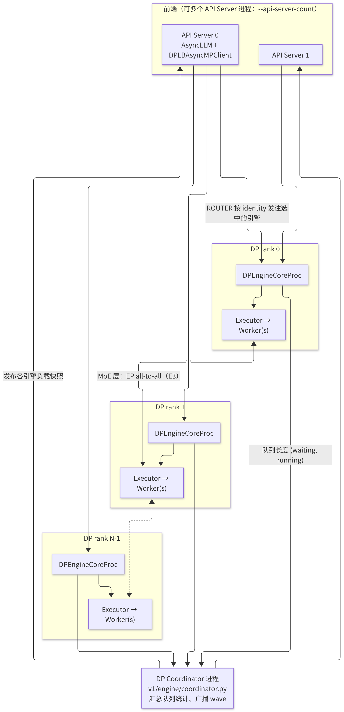
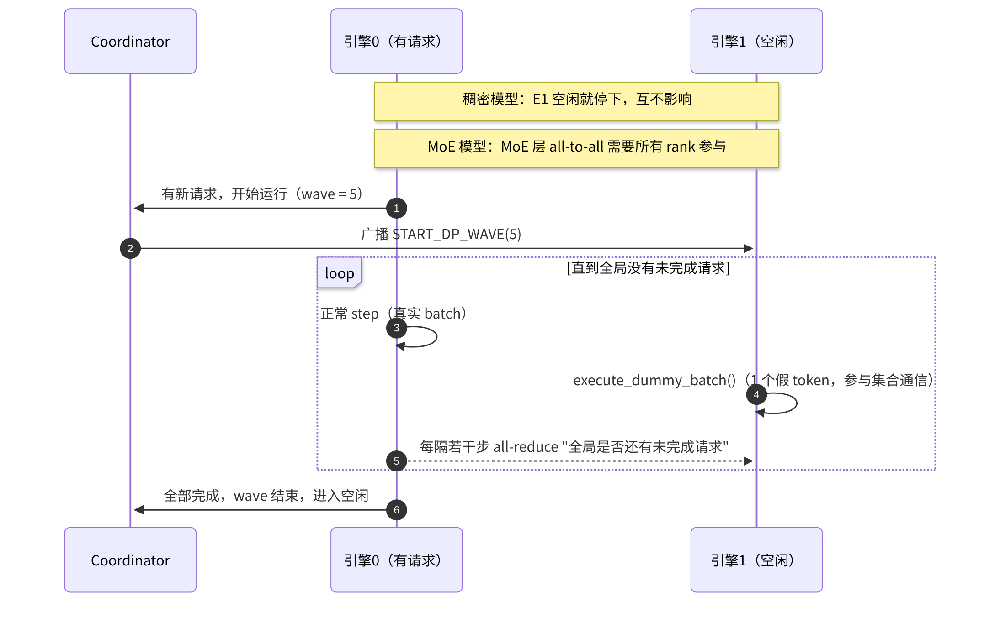

# E1 · 数据并行 DP

> **版本**：vLLM 0.30.x（V1 引擎）｜**模块**：E-分布式｜**对应原课**：第 12 课
> **导航**：上一课：[D2-量化实践] → **本课 E1** → 下一课：[E2-张量与流水并行]
> **练习**：`exercises/E1_dp_lb_modes`｜**源码标注**：DP 相关参数与协调器在近期若干版本中变化较多，标有【待核】之处以 0.30.x tag 的源码为准。

## 0. 先修要求与学习目标

先修要求：B1（EngineCoreClient 与 ZMQ ROUTER/DEALER）、B2（Executor 与 Worker）、B3（调度器的 waiting/running 队列）；了解 MoE 的基本结构（E3 将深入讨论）。

完成本课学习后，学习者应能够：

1. 区分"多个独立 vLLM 副本"与"vLLM 内置数据并行（DP）"，并阐明内置 DP 存在的主要理由（MoE 的 DP+EP）；
2. 绘制内置 DP 的进程拓扑：API Server、DP Coordinator、多个 EngineCore 及其 Worker；
3. 说明三种负载均衡模式（internal、hybrid、external）的适用场景，并完成练习中的分类函数；
4. 解释 MoE 模型下各 DP 引擎必须"步调一致"的原因，以及 dummy batch 与 wave 机制；
5. 手工计算 DP 负载均衡的打分，以及 DP+EP 部署的资源需求。

---

## 1. 动机：推理框架内置 DP 的必要性

对于稠密模型，实现数据并行最简单的方式是**启动多个独立的 vLLM 实例，并在其前端部署一个负载均衡器**。每个实例完整持有模型，实例之间互不通信，因而扩展性最好。vLLM 仍内置 `--data-parallel-size`，主要原因有以下两点：

**原因一：MoE 模型的"注意力 DP + 专家 EP"**。以 DeepSeek-V3 这类大型 MoE 模型为例，其注意力部分（尤其是 MLA）参数较少、KV 头较少，采用张量并行（TP）切分的收益很低（KV 头无法切分，只能复制，见 E2），更优的方式是使每张卡各自处理一部分请求（DP）；而专家部分参数规模巨大，必须分布到多张卡上（专家并行，EP，见 E3）。这意味着**多个 DP 引擎在注意力部分各自独立计算，而在 MoE 层又必须共同参与 all-to-all 通信**。这种"半独立"的关系只能在框架内部协调，独立副本无法实现。

**原因二：统一入口与更精细的负载均衡**。内置 DP 使一个 API Server 能够管理多个引擎，并依据各引擎实时的 waiting/running 队列长度进行路由，比仅依据连接数的外部负载均衡器更为精确；同时，KV 缓存感知、统一指标等能力也更易实现。


在进入细节之前，应首先明确以下对比：**TP 使单个请求执行得更快，DP 使更多请求能够同时执行**。TP 将每一层切分至多张卡上，每一步都需要卡间通信；DP 将请求分配至多张卡上，对于稠密模型，卡间几乎不需要通信。二者可组合使用，总卡数等于二者的乘积。

## 2. 架构图：内置 DP 的进程拓扑



<p align="center"><em>图1：内置数据并行（DP）的进程拓扑</em></p>

要点如下：

- 每个 DP rank 是一个完整的 EngineCore（具有其自身的调度器（Scheduler）与 KV 块池），其下可进一步采用 TP（每个 DP rank 内含 TP 个 Worker）。总 GPU 数 = DP × TP（× PP）。
- 前端通过 ZMQ ROUTER 套接字按引擎 identity 定向发送消息（B1 所述输入通道采用 ROUTER/DEALER 即出于这一目的）。在输出通道中，各引擎以 PUSH 方式将结果发送至前端。
- Coordinator 是一个独立的轻量级进程，负责收集与广播负载信息，并管理 MoE 的同步 wave。

## 3. 三种负载均衡模式

| 模式 | 路由执行者 | 典型启动方式 | 适用场景 |
|---|---|---|---|
| **internal**（内部 LB） | vLLM 前端，依据引擎负载 | 单节点：`vllm serve ... -dp 8`；多节点：主节点启动 API，其余节点使用 `--headless` | 统一入口，单节点或中小规模多节点 |
| **hybrid**（混合 LB） | 节点内由 vLLM 路由，节点间由外部 LB 路由 | 每个节点各自启动 API Server 以管理本地 DP rank，`--data-parallel-hybrid-lb` | 大规模多节点，避免单个 API Server 成为瓶颈 |
| **external**（外部 LB） | 外部路由器（如 Kubernetes 网关或 KV 感知路由器） | 每个 DP rank 独立暴露端口，`--data-parallel-external-lb` 并指定 rank | 需要自定义路由策略、需与外部调度系统集成 |

练习中的分类规则即为上表的抽象：`external=True` → external；否则，若启用内部 LB 且跨节点 → hybrid；仅启用内部 LB → internal；其余组合无法分类，抛出 `ValueError`。在真实系统中，无论采用何种模式，MoE 层的 EP 通信均发生于全部 DP rank 之间，LB 模式仅决定"请求从何处进入、由何者决定将其发往哪个引擎"。

常用参数：`--data-parallel-size`（`-dp`）、`--data-parallel-size-local`（本节点上的 DP rank 数）、`--data-parallel-start-rank`、`--data-parallel-address`、`--data-parallel-rpc-port`、`--headless`（不启动 API Server，仅运行引擎）、`--api-server-count`。【待核：0.30.x 中参数名与 hybrid/external 开关】

## 4. 负载均衡的打分机制

前端的 `DPLBAsyncMPClient`（`vllm/v1/engine/core_client.py`）为每个新请求选择分数最低的引擎。分数基于 Coordinator 发布的各引擎 `(waiting, running)` 计数，其中 waiting 的权重高于 running，原因在于排队中的请求表明该引擎已经饱和（实现中大致为 `score = waiting × 4 + running`）【待核：权重】。前端在发送请求后，还会在本地递增该引擎的 waiting 计数，以避免在两次统计刷新之间将一批请求全部发往同一引擎。

**数值示例**：4 个 DP 引擎的快照为 E0 (waiting 0, running 30)、E1 (2, 28)、E2 (0, 35)、E3 (1, 20)。分数分别为：E0 = 30，E1 = 36，E2 = 35，E3 = 24。新请求被发往 E3，前端在本地将 E3 的 waiting 加 1，其分数变为 28；下一个请求仍选择 E3（28 < 30）；再下一个请求到达时 E3 的分数变为 32，此时 E0 的 30 为最低，请求被转发至 E0。由此可见，该打分机制能够自然地将请求分散至负载最轻的引擎。

**与前缀缓存的冲突**：单纯依据负载打分会将共享同一前缀的请求分散至不同引擎，导致每个引擎都需各自计算一遍该前缀。对于大量请求共享系统提示词的场景，external 模式配合 KV 感知路由器（订阅 B4 所述的 KV 事件）通常能够获得更高的命中率。

## 5. MoE 下的步调一致：dummy batch 与 wave



<p align="center"><em>图2：MoE 下 DP 引擎的步调一致：dummy batch 与 wave</em></p>

MoE 层的 all-to-all 属于集合通信：每个 rank 都必须参与调用，否则其他 rank 将无限期等待。若 E0 有请求而 E1 没有，E1 也必须执行仅包含 1 个虚拟 token 的 dummy batch，以参与每一层的 dispatch/combine。为避免在空闲时所有引擎持续执行无意义的 dummy batch，vLLM 引入了 **wave** 机制：当全局不存在任何请求时，所有引擎同步进入空闲状态；当新请求到达某个引擎时，由 Coordinator 通知其他引擎开始新一轮 wave。`DPEngineCoreProc` 每隔若干步执行一次轻量级 all-reduce，以确认"全局是否仍有未完成的请求"。

另一个同步点是 **batch 大小对齐**：MoE all-to-all 与 CUDA Graph 均要求各 rank 的词元（token）数一致，vLLM 会在 DP 组内同步各 rank 的 token 数，并填充至最大值（C2 第 6.5 节）。这意味着负载很轻的 rank 也须按负载最重的 rank 的尺寸运行，因此**在 MoE 下，DP 负载不均衡的代价大于稠密模型**，这也说明了第 4 节所述负载均衡的重要性。

## 6. 源码分析（按调用顺序）

1. `vllm/entrypoints/cli/serve.py`：依据 DP 参数确定启动方式——单个 API Server、多个 API Server（`run_multi_api_server`），或使用 `--headless` 仅启动引擎。
2. `vllm/v1/engine/utils.py`：`launch_core_engines()`（上下文管理器）为本节点的每个 DP rank 启动 `EngineCoreProc` 子进程，按需启动 `DPCoordinator`，并完成与前端的握手（交换 ZMQ 地址）。【待核：函数位置】
3. `vllm/v1/engine/core.py`：`DPEngineCoreProc`（继承自 `EngineCoreProc`）：初始化时设置 DP 相关的分布式组（`stateless_init_dp_group`），并重写 `run_busy_loop()`：当本地无请求但处于 wave 中时，调用 `execute_dummy_batch()`；周期性调用 `_has_global_unfinished_reqs()` 执行 all-reduce；向 Coordinator 上报队列统计信息。
4. `vllm/v1/engine/coordinator.py`：`DPCoordinator` 启动 `DPCoordinatorProc`，通过 ZMQ 收集各引擎的统计信息，向前端发布负载快照，并处理 wave 的开始与结束通知。
5. `vllm/v1/engine/core_client.py`：`DPAsyncMPClient`（外部 LB 时，每个前端仅连接一个引擎）、`DPLBAsyncMPClient`（内部 LB，由 `get_core_engine_for_request()` 实现打分选择）。
6. `vllm/forward_context.py` 与 `vllm/v1/worker/gpu_model_runner.py`：在前向计算之前于 DP 组内同步 token 数（`DPMetadata`），用于 MoE 的 padding 与 chunking。【待核：0.30.x 中的同步方式】

## 7. 数值示例：DP+EP 部署的资源估算

目标：在 2 个节点、每节点 8 张 H100 上部署一个大型 MoE 模型，采用 DP=16、TP=1、EP=16（专家并行组跨越全部 16 张卡）。

- **专家分布**：256 个路由专家 / 16 = 每卡 16 个专家；共享专家与注意力权重在每张卡上各有一份（复制）。
- **KV 容量**：每张卡拥有独立的 KV 池。若每卡可用的键值缓存（KV Cache）约为 30 GB，按 MLA 每 token 约 70 KiB（R1 中的数值）计算，每卡约可容纳 45 万个 token，全系统约 720 万个 token。
- **每步 token 数**：若每个 DP rank 每步处理 128 个解码（Decode）token，则全系统每步处理 2 048 个 token；MoE 层中每个 token 选择 8 个专家，每步共计 16 384 次 token-专家分派，其中大部分跨卡，相当一部分跨节点（E3 将详细计算通信量）。
- **与 TP=16 的对比**：若改用 TP=16，由于 MLA 的潜向量 KV 无法按头切分，每张卡均须存储完整的 KV，全系统 KV 容量将缩小约 16 倍，并发能力大幅下降。这正是此类模型推荐采用"注意力 DP + 专家 EP"的根本原因。

## 7.5 设计问答

**问：内置 DP 的各引擎是否共享 KV 缓存？** 答：不共享。每个 DP rank 具有其独立的调度器与块池，一个请求仅在一个引擎上运行，其 KV 仅存在于该引擎所在的卡上。这与 TP 不同：在 TP 下，各 rank 共享一个调度器与一份块号记录表，KV 按头切分。因此，DP 扩展的是"并发请求数与总 KV 容量"，而非"单个请求的速度"。降低单请求时延需依靠 TP（E2）或投机解码（F1）。

**问：DP 与多副本在故障域上有何不同？** 答：独立副本之间完全隔离，一个副本崩溃不会影响其他副本，由负载均衡器自动将其摘除即可。在内置 DP 下，稠密模型的各引擎虽在计算上相互独立，但共享前端与协调器，前端崩溃将影响全部引擎；MoE 模型的情况更为严重，任何一个 rank 发生故障，都会经由集合通信导致全体停止工作。在生产环境中，MoE 的 DP+EP 部署应具备"整组重启"的预案，并在健康检查中覆盖集合通信挂起的情形。

**问：DP 规模能否动态调整？** 答：对于独立副本，扩缩容仅涉及实例的增减。对于 MoE 的 DP+EP，扩缩容意味着专家需重新分布到新的卡数上，并重建通信组，其复杂度高得多。vLLM 在新版本中提供了弹性专家并行的实验性支持，可在不中断服务的前提下调整规模，其核心步骤为：新 rank 启动并加载权重、重新计算专家放置（与 E4 的负载均衡共用重排机制）、迁移专家权重、切换通信组。【待核：0.30.x 中的稳定程度与参数】

**问：多个 API Server 进程如何共享同一组引擎？** 答：每个 API Server 均与全部引擎建立 ZMQ 连接，均订阅 Coordinator 发布的负载快照，并各自独立执行打分选择。由于快照存在刷新间隔，多个前端可能在同一时刻都认为某一引擎最为空闲，这正是前端需在本地递增 waiting 计数、且快照需要较高刷新频率的原因。即便如此，多前端下的负载均衡精度仍略低于单前端，这是以前端扩展性换取的代价。

## 7.6 选型速查

将本课结论归纳为如下判断流程：若模型为稠密模型，且单卡或单节点 TP 即可容纳，则优先采用**多副本 + 外部负载均衡**；若需要统一入口与更精确的队列感知路由，可采用**内置 DP 的 internal 模式**；若模型为大型 MoE 且其注意力部分不适合 TP，则采用**内置 DP + EP**，单节点使用 internal 模式，多节点使用 hybrid 模式，或采用配合外部 KV 感知路由器的 external 模式。无论采用何种方案，均应使用 F2 的方法观测各 rank 的负载是否均衡。

## 8. 常见问题与故障模式

1. **对稠密模型不加分析地使用内置 DP**：稠密模型不存在 EP 通信，独立副本 + 外部 LB 更为简单，故障隔离性也更好；内置 DP 的收益主要在于统一入口与更精确的负载打分。
2. **跨节点握手失败**：`--data-parallel-address` 被误设为 127.0.0.1、RPC 端口被防火墙拦截，或各节点的 `--data-parallel-start-rank` 存在重叠，表现为引擎启动后长时间等待握手。
3. **单个 API Server 成为瓶颈**：DP 规模很大时，前端的 tokenize 与 detokenize 会使单个进程饱和（B1），此时需要使用 `--api-server-count` 或 hybrid 模式。
4. **MoE 下单个 rank 挂起导致全体挂起**：由集合通信的特性所决定，任何一个 rank 出现问题（OOM、异常）都会使其他 rank 停滞于 all-to-all 中；排查时应找到最先出错的 rank 的日志。
5. **负载不均衡**：长 prompt 集中于某一引擎，因 padding 对齐而拖慢全体。应关注各 rank 的 waiting 分布，必要时启用更细粒度的分块预填充（chunked prefill）。
6. **DP 与 TP 的 GPU 数计算错误**：每个 DP rank 需要 TP×PP 张卡，`CUDA_VISIBLE_DEVICES` 与 local size 必须匹配。

## 9. 实践练习

- 目录：`exercises/E1_dp_lb_modes`
- 任务：实现 `classify_dp_lb_mode(flags)`：`external=True` → `"external"`；否则，`internal_lb=True` 且 `cross_node=True` → `"hybrid"`；仅 `internal_lb=True` → `"internal"`；其余情形抛出 `ValueError`。缺省的键按 False 处理。
- 运行方式：

```bash
python -m pytest exercises/E1_dp_lb_modes -q
```

- 验收标准：上述测试全部通过。
- 进阶任务：实现 `pick_engine(stats, pending)`：`stats` 为各引擎的 `(waiting, running)` 列表，按 `waiting×4 + running` 选择最小者（分数相同时取下标较小者），选中后在本地将该引擎的 waiting 加 1；以第 4 节的数值编写测试，验证连续三个请求的分配顺序为 E3、E3、E0。

## 10. 自测题

- [ ] 能否陈述在稠密模型与 MoE 模型下使用内置 DP 的不同理由
- [ ] 能否区分 internal、hybrid、external 三种模式的路由职责与启动方式
- [ ] 能否解释 MoE 下空闲引擎须执行 dummy batch 的原因，以及 wave 机制如何避免无意义的空转

## 11. 延伸阅读

- vLLM 文档：Data Parallel Deployment、Expert Parallel Deployment
- 源码：`vllm/v1/engine/coordinator.py`、`vllm/v1/engine/core.py`（`DPEngineCoreProc`）、`vllm/v1/engine/core_client.py`（DP 客户端）
- DeepSeek-V3 技术报告中关于推理部署（注意力 DP + 专家 EP）的章节

---

**课程导航**　上一课：[D2 · vLLM 量化模块实践](https://qcngm3vce6yt.feishu.cn/docx/Dvaddy2dgowrRRxjwc2cWEpwnrh)｜下一课：[E2 · 张量并行 TP 与流水并行 PP](https://qcngm3vce6yt.feishu.cn/docx/SORgdnCh8ojUyyxzam7cXu7AnMW)｜[返回索引](https://qcngm3vce6yt.feishu.cn/docx/KUn5dKSejoQSAJxaf7YcvNVDnCd)

相关章节：
- [B1 · Engine 与流式执行](https://qcngm3vce6yt.feishu.cn/docx/Sg5hdyoxqoE9nZx10DAcrGCknph)——见本课「0. 先修要求与学习目标」：“先修要求：B1（EngineCoreClient 与 ZMQ ROUTER/DEALER）”
- [E3 · 专家并行 EP](https://qcngm3vce6yt.feishu.cn/docx/Qe9tdBCrhoAtrVxG4SDcrcuwnfg)——见本课「0. 先修要求与学习目标」：“了解 MoE 的基本结构（E3 将深入讨论）。”
- [B2 · Worker 与 Executor](https://qcngm3vce6yt.feishu.cn/docx/VnbqdbxnnojzIQxyLJCc0x5bnI2)——见本课「0. 先修要求与学习目标」：“B2（Executor 与 Worker）”
