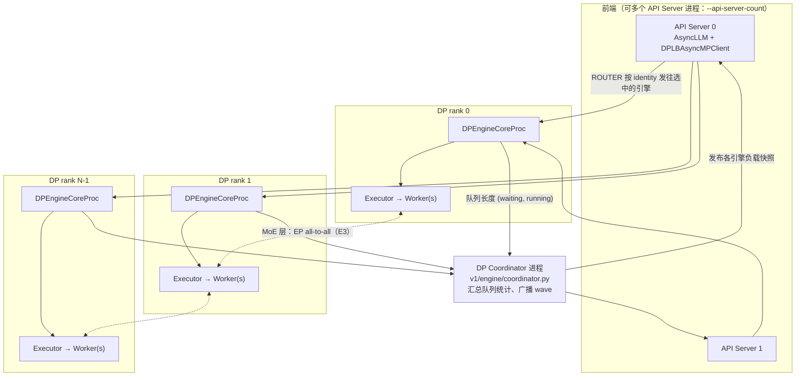
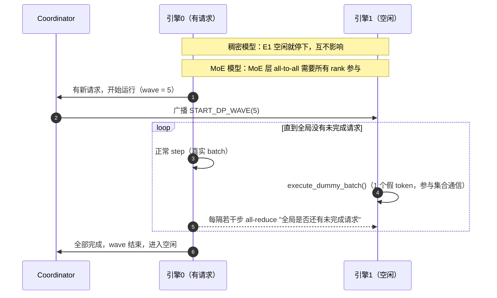

# E1 · 数据并行 DP（深度版）

> **版本**：vLLM 0.30.x（V1 引擎）｜**模块**：E-分布式｜**对应原课**：第 12 课
> **导航**：上一课：[D2-量化实践] → **本课 E1** → 下一课：[E2-张量与流水并行]
> **练习**：`exercises/E1_dp_lb_modes`｜**源码标注**：DP 相关参数与协调器在近几个版本中变化较多，标【待核】处以 0.30.x tag 为准。

## 0. 先修与本课目标

先修：B1（EngineCoreClient 与 ZMQ ROUTER/DEALER）、B2（Executor 与 Worker）、B3（调度器的 waiting/running 队列）；了解 MoE 的基本结构（E3 会深入）。

学完本课你应能：

1. 区分"多个独立 vLLM 副本"与"vLLM 内置 DP"，说清内置 DP 存在的主要理由（MoE 的 DP+EP）；
2. 画出内置 DP 的进程拓扑：API Server、DP Coordinator、多个 EngineCore 及其 Worker；
3. 理解三种负载均衡模式（internal、hybrid、external）的适用场景，并完成练习中的分类函数；
4. 解释 MoE 模型下 DP 引擎为何必须"步调一致"，以及 dummy batch 与 wave 机制；
5. 手算 DP 负载均衡的打分与 DP+EP 部署的资源需求。

---

## 1. 动机：为什么推理框架里还要内置 DP

对稠密模型来说，数据并行最简单的做法就是**起多个独立的 vLLM 实例，前面放一个负载均衡器**。每个实例完整持有模型，互不通信，扩展性最好。那 vLLM 为什么还要内置 `--data-parallel-size`？主要有两个原因：

**原因一：MoE 模型的"注意力 DP + 专家 EP"**。以 DeepSeek-V3 这类大 MoE 模型为例，注意力部分（尤其是 MLA）参数较少、KV 头少，用 TP 切分收益很低（KV 头无法切分只能复制，见 E2），更好的方式是让每张卡各自处理一部分请求（DP）；而专家部分参数巨大，必须分布到多卡上（EP，E3）。这意味着**多个 DP 引擎在注意力部分各算各的，到了 MoE 层又必须一起参与 all-to-all 通信**。这种"半独立"的关系只能在框架内部协调，独立副本做不到。

**原因二：统一入口与更精细的负载均衡**。内置 DP 让一个 API Server 管理多个引擎，基于各引擎实时的 waiting/running 队列长度做路由，比外部负载均衡器只看连接数更精确；同时 KV 缓存感知、统一指标等能力也更容易实现。


在进入细节前先记住一个对比：**TP 让一个请求跑得更快，DP 让更多请求同时跑**。TP 把每一层切到多张卡上，每步都需要卡间通信；DP 把请求分到多张卡上，稠密模型下卡间几乎不通信。两者可以组合使用，总卡数等于二者的乘积。

## 2. 架构图：内置 DP 的进程拓扑



要点：

- 每个 DP rank 是一个完整的 EngineCore（有自己的调度器与 KV 块池），下面可以再有 TP（每个 DP rank 内 TP 个 Worker）。总 GPU 数 = DP × TP（× PP）。
- 前端通过 ZMQ ROUTER 套接字按引擎 identity 定向发送（B1 提到输入通道用 ROUTER/DEALER 正是为此）。输出通道各引擎 PUSH 到前端。
- Coordinator 是一个独立的轻量进程，负责收集与广播负载、管理 MoE 的同步 wave。

## 3. 三种负载均衡模式

| 模式 | 谁做路由 | 典型启动方式 | 适用场景 |
|---|---|---|---|
| **internal**（内部 LB） | vLLM 前端，按引擎负载 | 单节点：`vllm serve ... -dp 8`；多节点：主节点带 API，其余节点 `--headless` | 统一入口，单节点或中小规模多节点 |
| **hybrid**（混合 LB） | 节点内由 vLLM 路由，节点间由外部 LB | 每个节点各起 API Server 管理本地 DP rank，`--data-parallel-hybrid-lb` | 多节点大规模，避免单点 API Server 成为瓶颈 |
| **external**（外部 LB） | 外部路由器（如 Kubernetes 网关或 KV 感知路由器） | 每个 DP rank 独立暴露端口，`--data-parallel-external-lb` 并指定 rank | 需要自定义路由策略、与外部调度系统集成 |

练习中的分类规则就是这张表的抽象：`external=True` → external；否则若开启内部 LB 且跨节点 → hybrid；仅内部 LB → internal；其余组合无法分类，抛 `ValueError`。真实系统中，无论哪种模式，MoE 层的 EP 通信都发生在全部 DP rank 之间，LB 模式只决定"请求从哪里进来、由谁决定发给哪个引擎"。

常用参数：`--data-parallel-size`（`-dp`）、`--data-parallel-size-local`（本节点上的 DP rank 数）、`--data-parallel-start-rank`、`--data-parallel-address`、`--data-parallel-rpc-port`、`--headless`（不启动 API Server，只运行引擎）、`--api-server-count`。【待核：0.30.x 中参数名与 hybrid/external 开关】

## 4. 负载均衡的打分

前端的 `DPLBAsyncMPClient`（`vllm/v1/engine/core_client.py`）为每个新请求选择分数最低的引擎。分数基于 Coordinator 发布的各引擎 `(waiting, running)` 计数，waiting 的权重高于 running，因为排队中的请求意味着该引擎已经饱和（实现中大致为 `score = waiting × 4 + running`）【待核：权重】。前端在发送后还会本地递增该引擎的 waiting 计数，避免在两次统计刷新之间把一批请求全部发给同一引擎。

**数字例子**：4 个 DP 引擎的快照为 E0 (waiting 0, running 30)、E1 (2, 28)、E2 (0, 35)、E3 (1, 20)。分数：E0 = 30，E1 = 36，E2 = 35，E3 = 24。新请求发往 E3，前端本地把 E3 的 waiting 加 1，分数变为 28；下一个请求仍选 E3（28 < 30），再下一个 E3 变为 32，此时 E0 的 30 最低，转发 E0。可以看到，打分天然把请求分散到负载最轻的引擎。

**与前缀缓存的冲突**：纯负载打分会把共享同一前缀的请求分散到不同引擎，导致每个引擎都要各自算一遍前缀。对于大量共享系统提示词的场景，external 模式配合 KV 感知路由器（订阅 B4 中提到的 KV 事件）通常能获得更高的命中率。

## 5. MoE 下的步调一致：dummy batch 与 wave



MoE 层的 all-to-all 是集合通信：每个 rank 都必须调用，否则其他 rank 永远等待。如果 E0 有请求而 E1 没有，E1 也必须"陪跑"——执行只有 1 个假 token 的 dummy batch，以参与每一层的 dispatch/combine。为了避免空闲时所有引擎无休止地陪跑，vLLM 引入 **wave**：当全局没有任何请求时，所有引擎同步进入空闲；有新请求到达某个引擎时，Coordinator 通知其他引擎开始新一轮 wave。`DPEngineCoreProc` 每隔若干步做一次轻量 all-reduce，确认"全局是否还有未完成请求"。

另一个同步点是 **batch 大小对齐**：MoE all-to-all 与 CUDA Graph 都希望各 rank 的 token 数一致，vLLM 会在 DP 组内同步各 rank 的 token 数并 pad 到最大值（C2 第 6.5 节）。这意味着一个负载很轻的 rank 也按最重 rank 的尺寸运行，**DP 负载不均衡在 MoE 下的代价比稠密模型更大**，这也是第 4 节负载均衡的重要性所在。

## 6. 源码走读（调用顺序）

1. `vllm/entrypoints/cli/serve.py`：根据 DP 参数决定启动方式——单 API Server、多 API Server（`run_multi_api_server`）、或 `--headless` 只起引擎。
2. `vllm/v1/engine/utils.py`：`launch_core_engines()`（上下文管理器）为本节点的每个 DP rank 启动 `EngineCoreProc` 子进程，按需启动 `DPCoordinator`，完成与前端的握手（交换 ZMQ 地址）。【待核：函数位置】
3. `vllm/v1/engine/core.py`：`DPEngineCoreProc`（继承 `EngineCoreProc`）：初始化时设置 DP 相关的分布式组（`stateless_init_dp_group`），重写 `run_busy_loop()`：无本地请求但处于 wave 中时调用 `execute_dummy_batch()`；周期性调用 `_has_global_unfinished_reqs()` 做 all-reduce；向 Coordinator 上报队列统计。
4. `vllm/v1/engine/coordinator.py`：`DPCoordinator` 启动 `DPCoordinatorProc`，用 ZMQ 收集各引擎的统计、向前端发布负载快照、处理 wave 的开始与结束通知。
5. `vllm/v1/engine/core_client.py`：`DPAsyncMPClient`（外部 LB 时，每个前端只连一个引擎）、`DPLBAsyncMPClient`（内部 LB，`get_core_engine_for_request()` 实现打分选择）。
6. `vllm/forward_context.py` 与 `vllm/v1/worker/gpu_model_runner.py`：前向前在 DP 组内同步 token 数（`DPMetadata`），用于 MoE 的 padding 与 chunking。【待核：0.30.x 中同步方式】

## 7. 数字例子：一次 DP+EP 部署的资源账

目标：在 2 个节点、每节点 8 张 H100 上部署一个大 MoE 模型，使用 DP=16、TP=1、EP=16（专家并行组跨越全部 16 张卡）。

- **专家分布**：256 个路由专家 / 16 = 每卡 16 个专家；共享专家与注意力权重每卡各有一份（复制）。
- **KV 容量**：每卡独立 KV 池。若每卡可用 KV 约 30 GB，以 MLA 每 token 约 70 KiB（R1 中的数字）计，每卡约 45 万 token，全系统约 720 万 token。
- **每步 token**：若每个 DP rank 每步处理 128 个 decode token，全系统每步 2 048 个 token；MoE 层每个 token 选 8 个专家，每步共 16 384 次 token-专家分派，其中大部分跨卡、相当部分跨节点（E3 详算通信量）。
- **对比 TP=16**：若改用 TP=16，MLA 的潜向量 KV 不能按头切分，每卡都要存完整 KV，全系统 KV 容量缩小约 16 倍，并发能力大幅下降。这就是此类模型推荐"注意力 DP + 专家 EP"的根本原因。

## 7.5 设计问答

**问：内置 DP 的各引擎共享 KV 缓存吗？** 不共享。每个 DP rank 有自己独立的调度器与块池，一个请求只在一个引擎上运行，其 KV 只存在于该引擎的卡上。这与 TP 不同：TP 下各 rank 共享一个调度器、一份块账本，KV 按头切分。所以 DP 扩展的是"并发请求数与总 KV 容量"，而不是"单个请求的速度"。想降低单请求延迟要靠 TP（E2）或投机解码（F1）。

**问：DP 和多副本的故障域有什么不同？** 独立副本之间完全隔离，一个副本崩溃不影响其他副本，负载均衡器自动摘除即可。内置 DP 下，稠密模型的各引擎虽然计算上独立，但共享前端与协调器，前端崩溃会影响全部引擎；MoE 模型更进一步，任何一个 rank 出问题都会通过集合通信让全体停摆。生产环境中对 MoE 的 DP+EP 部署要有"整组重启"的预案，并在健康检查中覆盖集合通信卡死的情形。

**问：DP 规模能动态调整吗？** 对于独立副本，扩缩容只是增减实例。对于 MoE 的 DP+EP，扩缩容意味着专家要重新分布到新的卡数上，并重建通信组，复杂度高得多。vLLM 在新版本中提供了弹性专家并行的实验性支持，在不中断服务的前提下调整规模，其核心步骤是：新 rank 启动并加载权重、重新计算专家放置（与 E4 的负载均衡共用重排机制）、迁移专家权重、切换通信组。【待核：0.30.x 中的稳定程度与参数】

**问：多个 API Server 进程如何共享同一组引擎？** 每个 API Server 都与全部引擎建立 ZMQ 连接，都订阅 Coordinator 发布的负载快照，各自独立做打分选择。由于快照有刷新间隔，多个前端可能在同一时刻都认为某个引擎最空闲，这就是前端在本地递增 waiting 计数、以及快照需要较高刷新频率的原因。即便如此，多前端下的负载均衡精度仍略低于单前端，这是用前端扩展性换取的代价。

## 7.6 选型速查

把本课结论压缩成一个判断流程：如果模型是稠密的、单卡或单节点 TP 就能放下，优先**多副本 + 外部负载均衡**；如果需要统一入口与更精准的队列感知路由，可以用**内置 DP 的 internal 模式**；如果模型是大 MoE，注意力部分不适合 TP，就用**内置 DP + EP**，单节点用 internal，多节点用 hybrid 或配合外部 KV 感知路由器的 external 模式。无论哪种，都要用 F2 的方法观测各 rank 负载是否均衡。

## 8. 常见坑 / 故障模式

1. **稠密模型盲目用内置 DP**：稠密模型没有 EP 通信，独立副本 + 外部 LB 更简单、故障隔离更好；内置 DP 的收益主要在于统一入口与更精准的负载打分。
2. **跨节点握手失败**：`--data-parallel-address` 写成了 127.0.0.1、RPC 端口被防火墙拦截、各节点的 `--data-parallel-start-rank` 重叠，表现为引擎启动后长时间等待握手。
3. **单 API Server 成为瓶颈**：DP 很大时，前端的 tokenize、detokenize 会饱和单个进程（B1），需要 `--api-server-count` 或 hybrid 模式。
4. **MoE 下某个 rank 卡死导致全体卡死**：集合通信的特性决定了任何一个 rank 出问题（OOM、异常）都会让其他 rank 卡在 all-to-all 中，排查时要找到最先出错的那个 rank 的日志。
5. **负载不均**：长 prompt 集中到某个引擎，因 padding 对齐拖慢全体。关注各 rank 的 waiting 分布，必要时启用更细的 chunked prefill。
6. **把 DP 与 TP 的 GPU 数算错**：每个 DP rank 需要 TP×PP 张卡，`CUDA_VISIBLE_DEVICES` 与 local size 要匹配。

## 9. 动手练习

- 目录：`exercises/E1_dp_lb_modes`
- 任务：实现 `classify_dp_lb_mode(flags)`：`external=True` → `"external"`；否则 `internal_lb=True` 且 `cross_node=True` → `"hybrid"`；仅 `internal_lb=True` → `"internal"`；其余抛 `ValueError`。缺省键按 False 处理。
- 运行：

```bash
python -m pytest exercises/E1_dp_lb_modes -q
```

- 进阶：实现 `pick_engine(stats, pending)`：`stats` 为各引擎 `(waiting, running)` 列表，按 `waiting×4 + running` 选择最小者（并列取下标小的），选中后在本地把该引擎 waiting 加 1；用第 4 节的数字写测试，验证连续三个请求的分配顺序为 E3、E3、E0。

## 10. 自测清单

- [ ] 我能说出稠密模型与 MoE 模型下使用内置 DP 的不同理由
- [ ] 我能区分 internal、hybrid、external 三种模式的路由责任与启动方式
- [ ] 我能解释 MoE 下空闲引擎为何要执行 dummy batch，以及 wave 机制如何避免无谓陪跑

## 11. 延伸阅读

- vLLM 文档：Data Parallel Deployment、Expert Parallel Deployment
- 源码：`vllm/v1/engine/coordinator.py`、`vllm/v1/engine/core.py`（`DPEngineCoreProc`）、`vllm/v1/engine/core_client.py`（DP 客户端）
- DeepSeek-V3 技术报告中关于推理部署（注意力 DP + 专家 EP）的章节
