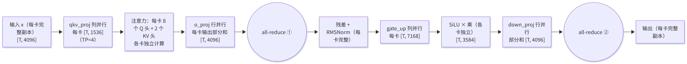
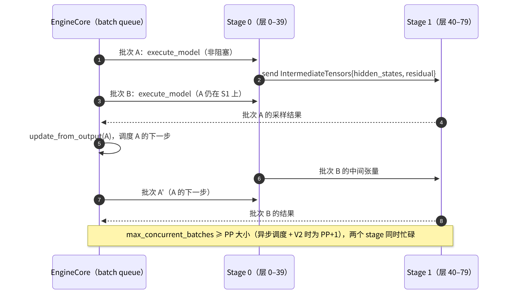

# E2 · 张量并行 TP 与流水并行 PP

> **版本**：vLLM 0.30.x（V1 引擎）｜**模块**：E-分布式｜**对应原课**：第 13 课（本版补全了原课标题中列出但正文缺失的流水线并行部分）
> **导航**：上一课：[E1-数据并行] → **本课 E2** → 下一课：[E3-专家并行]
> **练习**：`exercises/E2_tp_shard_math`｜**源码标注**：文中涉及的源码路径、符号与参数已对照 vLLM v0.30.0 tag 的源码核实。

## 0. 先修要求与学习目标

先修要求：B5（列并行、行并行的 `weight_loader`，以及"列并行与行并行成对出现"的原因）；B2（Executor、`collective_rpc`、output rank）；集合通信的基本语义（all-reduce、all-gather、reduce-scatter、send/recv）。

完成本课学习后，学习者应能够：

1. 推导一个 Transformer 层在张量并行（TP）下的全部分片形状与通信点，并手工计算每步的通信量与耗时；
2. 说明 Ring All-Reduce 的通信量公式，以及 vLLM 自定义 all-reduce 在小消息下的优势；
3. 处理 KV 头数少于 TP 规模时的复制问题，并估算其对键值缓存（KV Cache）容量的影响；
4. 说明流水线并行（PP）的层切分与 `IntermediateTensors` 传递机制，以及 V1 通过多批次同时在途消除流水线气泡的方式；
5. 依据模型大小、显卡数量与互联带宽，在 TP、PP 与数据并行（DP）之间作出选择。

---

## 1. 动机：单卡无法容纳模型，或单卡速度不足

70B 模型的 bf16 权重为 140 GB，单张 80 GB 显卡无法容纳，因此必须切分。切分方式存在两种根本不同的思路：**横向切分**每一层（TP，每张卡持有每一层的一部分）与**纵向切分**层序列（PP，每张卡持有若干完整的层）。TP 在每一层都需要通信，但可将单请求时延降低至接近 1/N；PP 仅在 stage 边界通信，通信量小，但单个请求须依次经过所有 stage，时延并不降低，需依靠多批次并行来填满流水线。理解这两者的通信模式与时延特性，是作出部署决策的基础。


**类比说明**（仅用于辅助理解，不替代下文的定量分析）：TP 类似于多人分工抄写同一页文本，每人负责一栏，每完成一行都须对齐一次；PP 类似于流水线装配，第一道工序完成后即交给下一道工序，并立即开始处理下一件。前者使每件产品完成得更快，但协调频繁；后者协调很少，但单件产品须经过全部工序，仅当同时有多件产品在线时效率才高。结合这一类比阅读后续的数值分析，有助于理解二者的取舍。

## 2. TP 的结构：每层两次 all-reduce



<p align="center"><em>图1：张量并行（TP）结构：列并行 + 行并行，每层两次 all-reduce</em></p>

每层恰好执行两次 all-reduce，消息大小均为 [T, hidden]。此外，embedding 采用词表并行（每张卡持有一段词表，查表后需执行一次 all-reduce）；lm_head 同样按词表切分，计算得到 logits 后需执行 all-gather（或 gather 至一张卡）方可采样。

## 3. 数值示例：Llama-3-8B 在 TP=4 下的情形

**分片形状**（与 B5 第 4 节一致，此处从通信角度再作分析）：qkv [1536, 4096]、o [4096, 1024]、gate_up [7168, 4096]、down [4096, 3584]，每卡权重约为 16 GB / 4 = 4 GB（加上复制的 norm 与部分 embedding，实际略多）。

**通信量**：在 Ring All-Reduce 中，每张卡发送与接收的数据量均为 `2 × (N−1)/N × S`，其中 S 为消息大小。

- **解码（Decode），batch 为 64**：T = 64，S = 64 × 4096 × 2 B = 512 KiB；每卡每次发送 2 × 3/4 × 512 KiB = 768 KiB；每步执行 64 次 all-reduce（32 层 × 2），共计约 48 MiB。若 NVLink 有效带宽约为 200 GB/s，则纯传输时间约为 0.25 ms；但小消息的瓶颈在于**时延**而非带宽：每次 all-reduce 的启动与同步开销约为 10～20 µs，64 次即为 0.6～1.3 ms，相对于 Decode 单步约 3～5 ms 的耗时不可忽视。
- **预填充（Prefill），8 192 个词元（token）**：S = 8192 × 4096 × 2 B = 64 MiB；每次每卡发送 96 MiB，64 次共计 6 GiB，按 200 GB/s 计算约需 32 ms，而该步计算约需 60～80 ms（经 4 卡分摊后），通信占比相当可观。若卡间仅有 PCIe（有效带宽约 20 GB/s），则通信需 300 ms 以上，TP 反而使 Prefill 变慢——**在不具备 NVLink 的机器上，TP>2 通常得不偿失**。

**时延收益**：Decode 属于访存受限；TP=4 后每卡仅读取 4 GB 权重，读取权重的下界由 4.8 ms 降至 1.2 ms，加上约 1 ms 的通信，单步约为 2.5～3 ms，单请求速度提升约 2 倍（而非 4 倍，原因在于通信与固定开销）。

## 3.5 Ring All-Reduce：通信量公式的推导

公式 `2 × (N−1)/N × S` 形式较为抽象，经推导即可理解。设 N 张卡排成一个环，每张卡上有一个大小为 S 的向量，目标是使每张卡最终都得到所有向量之和。将每个向量切分为 N 段，每段大小为 S/N。

**第一阶段 reduce-scatter**：共 N−1 轮。每一轮中，每张卡将其持有的某一段发送给右侧相邻的卡，后者将收到的段累加到自身对应的段上。经过 N−1 轮后，每张卡恰好拥有某一段的完整总和（不同的卡拥有不同的段）。每张卡每轮发送 S/N，共发送 (N−1)/N × S。

**第二阶段 all-gather**：再进行 N−1 轮，每张卡将其拥有的完整段沿环传递，最终每张卡均收齐全部 N 段的总和。同样，每张卡发送 (N−1)/N × S。

两阶段合计为 `2 × (N−1)/N × S`。该结果具有两项重要含义：第一，当 N 很大时，每卡通信量趋近于 2S，**几乎不随卡数增长**，因此 Ring 算法在带宽意义上是最优的；第二，轮数为 2(N−1)，每一轮均存在固定的启动时延，因此**对于小消息而言，轮数所带来的时延才是主要成本**。Decode 时消息仅为数百 KiB，N=8 时需要 14 轮，每轮数微秒的时延累加后远超传输时间本身。这正是 vLLM 自定义 all-reduce 采用"一次性读取所有卡数据"的 one-shot 算法的原因：它仅需一轮同步，代价是每张卡需读取 (N−1) × S 的数据，但在 NVLink 的高带宽条件下，对于小消息而言这一交换是合算的。当消息增大后，带宽重新成为瓶颈，此时切换至 two-shot 或 NCCL 的 Ring 实现。

## 3.6 进阶：序列并行与通信重叠

在 TP 的基本结构中，all-reduce 之后每张卡都持有完整的激活，随后执行的残差相加与 RMSNorm 在每张卡上被重复计算 N 次，这构成了浪费。**序列并行**将 all-reduce 拆分为 reduce-scatter 与 all-gather 两部分：reduce-scatter 之后，每张卡仅持有 1/N 个 token 的结果，在这 1/N 的数据上执行残差与 RMSNorm，然后通过 all-gather 恢复完整激活，再进入下一个列并行层。总通信量不变，但逐元素计算量与激活显存均降至 1/N。

更进一步，**异步 TP** 将 all-gather 与其后的 GEMM 拆分为若干块交错执行：在接收下一块数据的同时，计算已到达的数据块，从而使通信与计算重叠。这两种优化在 vLLM 中由 C3 所介绍的编译 pass（序列并行 pass、异步 TP pass）自动完成，无需修改模型代码；但通常仅在 token 数较大（以 Prefill 为主）时才有收益，且依赖特定通信库的支持，需要显式启用。在 v0.30.0 中，可通过 `--compilation-config '{"pass_config": {"enable_sp": true, "fuse_gemm_comms": true}}'` 开启（`fuse_gemm_comms` 即异步 TP，开启时会自动开启 `enable_sp`）；二者在各优化级别下默认关闭，要求 TP>1，且当模型 hidden_size 过小、无法得出 `sp_min_token_num` 阈值时会被自动关闭；此外，在未启用 Inductor 图分区时，开启序列并行会将 `splitting_ops` 置空，并将 CUDA Graph 模式改为 FULL。

## 4. 自定义 all-reduce 与通信器

vLLM 的 TP 通信由 `GroupCoordinator`（`vllm/distributed/parallel_state.py`）统一管理，模型代码仅调用 `tensor_model_parallel_all_reduce(x)`。底层依据消息大小与硬件条件选择具体实现：

- **自定义 all-reduce**（`vllm/distributed/device_communicators/custom_all_reduce.py`）：在 NVLink 全互联的单机上，利用 CUDA IPC 使每张卡直接读写其他卡的缓冲区，以一个 kernel 完成"一次性读取所有卡的数据并求和"（one-shot）或"两阶段 reduce-scatter + all-gather"（two-shot），从而避免 NCCL 多轮协议的开销。在小消息（Decode）条件下，其时延明显低于 NCCL，且与 CUDA Graph 兼容（C2）。
- **NCCL / PyNccl**（`pynccl.py`）：通用路径，用于大消息与跨机通信。vLLM 对 NCCL 调用进行了自行封装，以便在 CUDA Graph 中使用。
- **其他**：对称内存（symmetric memory）实现、FlashInfer 的 all-reduce 融合（与 RMSNorm 合并，即 C3 中的 AllReduceFusionPass）等。在 v0.30.0 中，TP 组的 `CudaCommunicator.all_reduce()` 按以下顺序逐一检查，并采用首个满足条件的实现：NCCL 对称内存（`VLLM_USE_NCCL_SYMM_MEM`，默认关闭）→ QuickReduce（ROCm）→ FlashInfer PCIe IPC all-reduce（`VLLM_ALLREDUCE_USE_FLASHINFER_PCIE_IPC`，默认关闭）→ FlashInfer all-reduce（`VLLM_ALLREDUCE_USE_FLASHINFER`，默认开启）→ AITER 自定义 all-reduce（ROCm）→ vLLM 自定义 all-reduce → PyTorch 对称内存（`VLLM_ALLREDUCE_USE_SYMM_MEM`，默认开启）→ PyNccl；每种实现依据消息大小与硬件条件自行判断是否适用。

就自定义 all-reduce 与 NCCL 二者而言，`CudaCommunicator`（`cuda_communicator.py`）按照"自定义 all-reduce 可用且消息足够小 → 使用自定义 all-reduce；否则 → 使用 NCCL"的规则进行分发。`--disable-custom-all-reduce` 可强制使用 NCCL，用于排查通信问题。

## 5. KV 头复制

GQA 模型的 KV 头数通常为 8。TP 以"头"为单位切分注意力，每张卡应持有 `num_kv_heads / tp` 个 KV 头：

- TP = 2、4、8：每卡分别持有 4、2、1 个 KV 头，KV Cache 随卡数线性减小；
- TP = 16：KV 头数量不足以分配，每个 KV 头被复制到 2 张卡上（每卡 1 个），每卡的 KV 占用与 TP=8 时相同，**全系统 KV 容量不再随 TP 增长**，且存在冗余。

**数值示例**：Llama-3-70B（80 层、8 个 KV 头、head_dim 为 128）每 token 的全模型 KV 占用为 320 KiB。TP=8 时，每卡每 token 占用 40 KiB；TP=16 时，每卡仍为 40 KiB（因复制所致），16 张卡共存储了两份 KV。这说明了 70B 级模型很少采用 TP=16，而是采用 TP=8 加 PP=2 或 DP=2 的原因。对于 MLA 模型（KV 仅为一个潜向量，相当于 1 个"头"），采用 TP 时每张卡都须存储完整的 KV，这正是 E1 中"注意力 DP"的动机。

## 6. 流水线并行 PP



<p align="center"><em>图2：流水线并行（PP）中两个 stage 交替执行批次的时序</em></p>

**层切分**：`vllm/distributed/utils.py` 中的 `get_pp_indices(num_layers, pp_rank, pp_size)` 计算每个 stage 所负责的层区间，默认均分（可通过 `VLLM_PP_LAYER_PARTITION` 自定义，例如由于首个 stage 包含 embedding，可为其少分配若干层）。模型构造时通过 `make_layers()` 仅为本 stage 的层创建实际模块，其余位置以 `PPMissingLayer` 占位，不占用显存。

**中间张量**：非最后一个 stage 的 `forward` 返回 `IntermediateTensors`（在 Llama 中为 `hidden_states` 与 `residual`），由 `get_pp_group().send_tensor_dict()` 发送至下一个 stage，下一个 stage 通过 `recv_tensor_dict()` 接收后继续执行前向计算。仅最后一个 stage 计算 logits 并执行采样，同时作为 output rank 回传结果（B2）。

**消除气泡**：若同一时刻流水线中仅有一个批次，则 PP=2 时每个 stage 有一半时间处于空闲状态。V1 的 EngineCore 在 PP>1 时使用 `step_with_batch_queue()`：`VllmConfig.max_concurrent_batches` 一般等于 PP 大小（启用异步调度且使用 ModelRunner V2 时为 PP 大小加 1），EngineCore 在前一个批次尚未返回时即调度并提交下一个批次（两个批次包含不同的请求，因为同一请求的下一步依赖于上一步的结果），从而使各 stage 同时处理不同的批次。

**数值示例：PP 通信量**。PP=2，每步 T = 64 个 Decode token，`hidden_states` 与 `residual` 各为 64 × 8192 × 2 B = 1 MiB（70B 模型的 hidden 为 8192），每步跨 stage 传输 2 MiB，即使经由 25 GB/s 的跨机网络亦仅需约 0.08 ms。相比之下，若同样的两台机器采用跨机 TP=16，每步需要执行 160 次 all-reduce，跨机时延将使 Decode 慢一个数量级。**PP 适用于跨节点，TP 适用于节点内**，这是最重要的部署经验法则。

## 7. 源码分析要点

1. `vllm/distributed/parallel_state.py`：`initialize_model_parallel(tp, pp, ...)` 建立 TP 组、PP 组（以及 DP、EP 组）；`get_tp_group()`、`get_pp_group()`；`GroupCoordinator.all_reduce / all_gather / send_tensor_dict / recv_tensor_dict`。
2. `vllm/distributed/communication_op.py`：`tensor_model_parallel_all_reduce`、`tensor_model_parallel_all_gather` 等便捷函数。
3. `vllm/model_executor/layers/linear.py`：`ColumnParallelLinear`（`gather_output` 参数）、`RowParallelLinear`（`reduce_results` 参数，可延迟或融合 all-reduce）、`QKVParallelLinear`（KV 头复制逻辑 `num_kv_head_replicas`）。
4. `vllm/model_executor/models/utils.py`：`make_layers`、`PPMissingLayer`、`is_pp_missing_parameter`（权重加载时跳过不属于本 stage 的参数）。
5. `vllm/v1/engine/core.py`：`step_with_batch_queue()`；`vllm/config/vllm.py`：`VllmConfig.max_concurrent_batches`。

## 8. 选型：TP、PP 与 DP 的组合方式

- **单卡可容纳模型**：优先采用 DP（多副本），无需 TP；若追求单请求的低时延，可再增加 TP=2。
- **单节点可容纳（≤8 卡）且具备 NVLink**：TP = 节点内卡数；
- **需要多个节点**：节点内采用 TP，节点间采用 PP（如 2 节点 × 8 卡：TP=8、PP=2）；
- **大型 MoE 模型**：注意力 DP + 专家 EP（E1、E3），必要时结合 TP；
- **不具备 NVLink 的 PCIe 机器**：TP 应尽量小（≤2），可考虑以 PP 替代更大的 TP。

## 8.5 设计问答

**问：在 TP 下每张卡都具有完整的输入，为何不会重复计算注意力？** 答：注意力按头切分，每张卡仅计算其负责的若干个头；输入虽然完整，但经投影后得到的 Q、K、V 仅为本卡所负责的头的部分。真正被重复计算的只有 RMSNorm、残差这类逐元素运算以及 embedding 查表后的结果，其计算量很小。

**问：调度器是否感知 TP？** 答：基本不感知。调度器所见仅为一个逻辑上的大 GPU：块数取各卡的最小值（B2），每步的 SchedulerOutput 被广播至所有 TP rank，各 rank 执行相同的调度结果。这使 TP 对调度逻辑完全透明，同时也意味着 TP 的各 rank 必须严格同步执行，任何一个 rank 变慢都会拖慢所有 rank。

**问：PP 与 TP 能否同时使用？** 答：可以，总卡数为二者的乘积，每个 PP stage 内部为一个 TP 组。典型的两节点部署是节点内 TP=8、节点间 PP=2：前者使用 NVLink，后者仅在 stage 边界传输少量中间张量，从而充分利用了不同链路的特点。

## 9. 常见问题与故障模式

1. **头数无法整除**：Q 头数必须能被 TP 整除，否则启动时报错；KV 头数小于 TP 时会自动复制，但造成容量浪费。练习中在无法整除时抛出 `ValueError`，即为对这一检查的模拟。
2. **自定义 all-reduce 未启用**：在不具备 P2P 访问能力的环境中（某些虚拟化环境或 PCIe 拓扑不支持），系统将自动回退至 NCCL，小 batch 的 Decode 明显变慢。启动日志中会给出提示。
3. **跨节点使用 TP**：通信时延导致性能急剧下降，应改用 PP。
4. **PP 下吞吐量未提升**：并发请求过少，无法同时组成 PP 个批次，流水线中仍存在气泡；PP 需要足够的并发才能发挥作用。
5. **PP stage 负载不均衡**：首尾 stage 额外承担 embedding、lm_head 与采样，可能成为瓶颈，应通过自定义层切分进行调整。
6. **NCCL 环境问题**：多网卡环境下选错了接口或未启用 IB，表现为通信极慢或挂起；应使用 `NCCL_DEBUG=INFO` 确认所使用的传输方式。

## 10. 实践练习

- 目录：`exercises/E2_tp_shard_math`
- 任务：实现 `column_parallel_shape(out_features, in_features, tp_size)` → `(out/tp, in)` 与 `row_parallel_shape(out_features, in_features, tp_size)` → `(out, in/tp)`，无法整除时抛出 `ValueError`。
- 运行方式：

```bash
python -m pytest exercises/E2_tp_shard_math -q
```

- 验收标准：上述测试全部通过。
- 进阶任务 1：编写 `layer_shapes(hidden, inter, n_q, n_kv, head_dim, tp)`，输出单层中 qkv、o、gate_up、down 的每卡形状，并处理 KV 头复制；以 Llama-3-8B 的 TP=4 与 Llama-3-70B 的 TP=16 编写测试。
- 进阶任务 2：编写 `allreduce_bytes_per_step(tokens, hidden, layers, tp, dtype_bytes)`，按 Ring 公式计算每卡每步发送的字节数，其结果应复现第 3 节中的 48 MiB 与 6 GiB。

## 11. 自测题

- [ ] 能否绘制一个 TP 层中两次 all-reduce 的位置，并手工计算 Decode 与 Prefill 的通信量
- [ ] 能否解释 KV 头复制发生的条件及其对 KV 容量的影响
- [ ] 能否说明 PP 气泡的来源、V1 以 batch queue 消除气泡的方式，以及 PP 适用于跨节点场景的原因

## 12. 延伸阅读

- 论文：Megatron-LM（张量并行）、GPipe（流水线并行）
- NCCL 文档：Ring/Tree 算法与环境变量
- 源码：`vllm/distributed/parallel_state.py`、`vllm/distributed/device_communicators/`、`vllm/model_executor/layers/linear.py`、`vllm/model_executor/models/utils.py`

---

**课程导航**　上一课：[E1 · 数据并行 DP](https://qcngm3vce6yt.feishu.cn/docx/WmsNdoxVDoVE0ix9DchclYB8nYe)｜下一课：[E3 · 专家并行 EP](https://qcngm3vce6yt.feishu.cn/docx/Qe9tdBCrhoAtrVxG4SDcrcuwnfg)｜[返回索引](https://qcngm3vce6yt.feishu.cn/docx/KUn5dKSejoQSAJxaf7YcvNVDnCd)

相关章节：
- [B2 · Worker 与 Executor](https://qcngm3vce6yt.feishu.cn/docx/VnbqdbxnnojzIQxyLJCc0x5bnI2)——见本课「0. 先修要求与学习目标」：“B2（Executor、collective_rpc、output rank）”
- [B5 · ModelRunner 与权重加载](https://qcngm3vce6yt.feishu.cn/docx/FWYldjMhdomAz0xTxOTcBfYpn7e)——见本课「0. 先修要求与学习目标」：“先修要求：B5（列并行、行并行的 weight_loader”
- [C3 · torch.compile 与 vLLM 编译栈](https://qcngm3vce6yt.feishu.cn/docx/Ybd2d5XAyobiqXxrgazcBtEentc)——见本课「3.6 进阶：序列并行与通信重叠」：“这两种优化在 vLLM 中由 C3 所介绍的编译 pass（序列并行 pass、异步 TP pass）自动完成”
