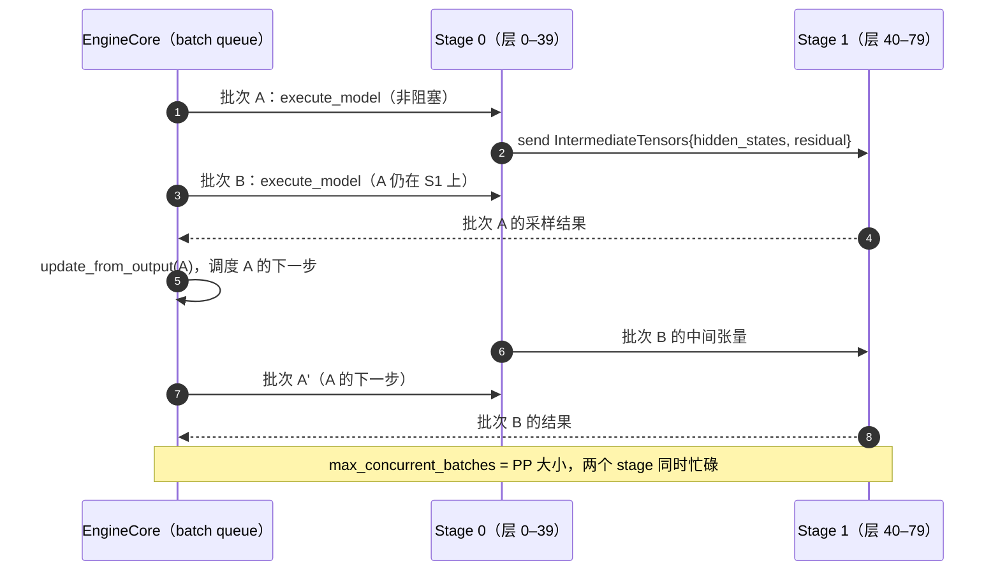

# E2 · 张量并行 TP 与流水并行 PP（深度版）

> **版本**：vLLM 0.30.x（V1 引擎）｜**模块**：E-分布式｜**对应原课**：第 13 课（本版补全了原课标题承诺但正文缺失的流水并行部分）
> **导航**：上一课：[E1-数据并行] → **本课 E2** → 下一课：[E3-专家并行]
> **练习**：`exercises/E2_tp_shard_math`｜**源码标注**：标【待核】处以 0.30.x tag 为准。

## 0. 先修与本课目标

先修：B5（列并行、行并行的 `weight_loader`，以及"列 + 行成对出现"的原因）；B2（Executor、`collective_rpc`、output rank）；集合通信的基本语义（all-reduce、all-gather、reduce-scatter、send/recv）。

学完本课你应能：

1. 推导一个 Transformer 层在 TP 下的全部分片形状与通信点，并手算每步通信量与耗时；
2. 理解 Ring All-Reduce 的通信量公式，以及 vLLM 自定义 all-reduce 在小消息下的优势；
3. 处理 KV 头数少于 TP 时的复制问题，并估算其对 KV 容量的影响；
4. 理解 PP 的层切分、`IntermediateTensors` 传递，以及 V1 用多批次在途消除流水线气泡的方式；
5. 根据模型大小、卡数、互联带宽在 TP、PP、DP 之间做选择。

---

## 1. 动机：一张卡放不下，或者一张卡太慢

70B 模型 bf16 权重 140 GB，单张 80 GB 卡放不下，必须切分。切分方式有两种根本不同的思路：**横切**每一层（TP，每张卡持有每层的一部分）和**纵切**层序列（PP，每张卡持有若干完整的层）。TP 每层都要通信，但能把单请求延迟降低到接近 1/N；PP 只在 stage 边界通信，通信量小，但单请求要依次经过所有 stage，延迟不降，需要靠多批次并行来填满流水线。理解这两者的通信模式与延迟特性，是做部署决策的基础。


**一个直观类比**：TP 像几个人合抄同一页书，每人抄一栏，抄完每一行都要对齐一次；PP 像流水线装配，第一个人做完前半道工序交给第二个人，自己立刻开始下一件。前者每件产品完成得更快，但交流频繁；后者交流很少，但单件产品要经过所有人，只有同时有多件产品在线上时效率才高。带着这个类比读后面的数字，会更容易理解两者的取舍。

## 2. TP 的结构：一层两次 all-reduce

```mermaid
flowchart LR
  X["输入 x（每卡完整副本）<br/>[T, 4096]"] --> QKV["qkv_proj 列并行<br/>每卡 [T, 1536]（TP=4）"]
  QKV --> ATT["注意力：每卡 8 个 Q 头 + 2 个 KV 头<br/>各卡独立计算"]
  ATT --> O["o_proj 行并行<br/>每卡输出部分和 [T, 4096]"]
  O --> AR1(("all-reduce ①"))
  AR1 --> N2["残差 + RMSNorm（每卡完整）"]
  N2 --> GU["gate_up 列并行<br/>每卡 [T, 7168]"]
  GU --> ACT["SiLU × 乘（各卡独立）<br/>[T, 3584]"]
  ACT --> DN["down_proj 行并行<br/>部分和 [T, 4096]"]
  DN --> AR2(("all-reduce ②"))
  AR2 --> Y["输出（每卡完整副本）"]
```



每层恰好两次 all-reduce，消息大小都是 [T, hidden]。此外，embedding 采用词表并行（每卡持有一段词表，查表后需要一次 all-reduce），lm_head 也按词表切分，算出 logits 后需要 all-gather（或 gather 到一张卡）才能采样。

## 3. 数字例子：Llama-3-8B 在 TP=4 下

**分片形状**（与 B5 第 4 节一致，这里从通信角度再看一次）：qkv [1536, 4096]、o [4096, 1024]、gate_up [7168, 4096]、down [4096, 3584]，每卡权重约 16 GB / 4 = 4 GB（加上复制的 norm 与部分 embedding 略多）。

**通信量**：Ring All-Reduce 中每卡发送与接收的数据量都是 `2 × (N−1)/N × S`，S 为消息大小。

- **decode，batch 64**：T = 64，S = 64 × 4096 × 2 B = 512 KiB；每卡每次发送 2 × 3/4 × 512 KiB = 768 KiB；每步 64 次 all-reduce（32 层 × 2），共约 48 MiB。若 NVLink 有效带宽约 200 GB/s，纯传输约 0.25 ms，但小消息的瓶颈是**延迟**而不是带宽：每次 all-reduce 的启动与同步开销约 10～20 µs，64 次就是 0.6～1.3 ms，与 decode 一步约 3～5 ms 相比不可忽视。
- **prefill，8 192 token**：S = 8192 × 4096 × 2 B = 64 MiB；每次每卡发送 96 MiB，64 次共 6 GiB，按 200 GB/s 约 32 ms，而这步计算约 60～80 ms（4 卡分摊后），通信占比可观。若卡间只有 PCIe（约 20 GB/s 有效），通信要 300 ms 以上，TP 反而让 prefill 变慢——**没有 NVLink 的机器上 TP>2 往往不划算**。

**延迟收益**：decode 是访存受限的，TP=4 后每卡只读 4 GB 权重，读权重下界从 4.8 ms 降到 1.2 ms，加上通信约 1 ms，单步约 2.5～3 ms，单请求速度提升约 2 倍（不是 4 倍，因为通信与固定开销）。

## 3.5 Ring All-Reduce：通信量公式从哪来

公式 `2 × (N−1)/N × S` 看起来抽象，推导一遍就能记住。设 N 张卡排成一个环，每张卡上有一个大小为 S 的向量，目标是每张卡最终都得到所有向量之和。把每个向量切成 N 段，每段大小 S/N。

**第一阶段 reduce-scatter**：共 N−1 轮。每一轮，每张卡把自己手中的某一段发给右邻居，右邻居把收到的段加到自己对应的段上。经过 N−1 轮后，每张卡恰好拥有某一段的完整总和（不同卡拥有不同段）。每张卡每轮发送 S/N，共发送 (N−1)/N × S。

**第二阶段 all-gather**：再进行 N−1 轮，每张卡把自己拥有的完整段沿环传递，最终每张卡都收齐全部 N 段的总和。同样每张卡发送 (N−1)/N × S。

两阶段合计 `2 × (N−1)/N × S`。这个结果有两个重要含义：第一，当 N 很大时每卡通信量趋近于 2S，**几乎不随卡数增长**，所以 Ring 在带宽上是最优的；第二，轮数是 2(N−1)，每一轮都有固定的启动延迟，所以**对小消息而言，轮数带来的延迟才是主要成本**。decode 时消息只有几百 KiB，N=8 时要 14 轮，每轮几微秒的延迟累加起来远超传输时间本身。这正是 vLLM 自定义 all-reduce 采用"一次性读取所有卡数据"的 one-shot 算法的原因：它只需一轮同步，代价是每张卡要读取 (N−1) × S 的数据，但在 NVLink 的高带宽下，对小消息来说这是划算的交换。消息变大后，带宽重新成为瓶颈，就切换到 two-shot 或 NCCL 的 Ring 实现。

## 3.6 进阶：序列并行与通信重叠

在 TP 的基本结构中，all-reduce 之后每张卡都持有完整的激活，接着做的残差相加与 RMSNorm 在每张卡上重复计算了 N 次，这是一种浪费。**序列并行**把 all-reduce 拆成 reduce-scatter 与 all-gather 两半：reduce-scatter 之后每张卡只持有 1/N 个 token 的结果，在这 1/N 上做残差与 RMSNorm，然后 all-gather 恢复完整激活再进入下一个列并行层。总通信量不变，但逐元素计算与激活显存都降为 1/N。

更进一步，**异步 TP** 把 all-gather 与随后的 GEMM 拆成若干块交错执行：一边接收下一块数据，一边计算已到达的那块，使通信与计算重叠。这两种优化在 vLLM 中由 C3 介绍的编译 pass（序列并行 pass、异步 TP pass）自动完成，不需要修改模型代码，但通常只在大 token 数（prefill 为主）时才有收益，并且依赖特定的通信库支持，需要显式开启。【待核：0.30.x 中的开启方式】

## 4. 自定义 all-reduce 与通信器

vLLM 的 TP 通信由 `GroupCoordinator`（`vllm/distributed/parallel_state.py`）统一管理，模型代码只调用 `tensor_model_parallel_all_reduce(x)`。底层按消息大小与硬件选择实现：

- **自定义 all-reduce**（`vllm/distributed/device_communicators/custom_all_reduce.py`）：在 NVLink 全互联的单机上，利用 CUDA IPC 让每张卡直接读写其他卡的缓冲区，用一个 kernel 完成"一次性读取所有卡的数据并求和"（one-shot）或"两阶段 reduce-scatter + all-gather"（two-shot），避免 NCCL 的多轮协议开销。小消息（decode）下延迟比 NCCL 低很多，且兼容 CUDA Graph（C2）。
- **NCCL / PyNccl**（`pynccl.py`）：通用路径，大消息与跨机通信使用。vLLM 封装了自己的 NCCL 调用以便在 CUDA Graph 中使用。
- **其他**：对称内存（symmetric memory）实现、FlashInfer 的 all-reduce 融合（与 RMSNorm 合并，C3 中的 AllReduceFusionPass）等。【待核：0.30.x 中默认选择逻辑】

`CudaCommunicator`（`cuda_communicator.py`）按"自定义 all-reduce 可用且消息足够小 → 用它；否则 → NCCL"的规则分发。`--disable-custom-all-reduce` 可强制走 NCCL，用于排查通信问题。

## 5. KV 头复制

GQA 模型的 KV 头数常为 8。TP 切分注意力时以"头"为单位，每卡应持有 `num_kv_heads / tp` 个 KV 头：

- TP = 2、4、8：每卡 4、2、1 个 KV 头，KV Cache 按卡线性减小；
- TP = 16：KV 头不够分，每个 KV 头复制到 2 张卡上（每卡 1 个），每卡 KV 与 TP=8 时相同，**全系统 KV 容量不再随 TP 增长**，且存在冗余。

**数字例子**：Llama-3-70B（80 层、8 KV 头、head_dim 128）每 token KV 全模型为 320 KiB。TP=8 时每卡每 token 40 KiB；TP=16 时每卡仍为 40 KiB（复制），16 卡总共存了两份 KV。这也是为什么 70B 级模型很少用 TP=16，而是 TP=8 加 PP=2 或 DP=2。对于 MLA 模型（KV 只有一个潜向量，相当于 1 个"头"），TP 时每卡都要存完整 KV，这正是 E1 中"注意力 DP"的动机。

## 6. 流水并行 PP



**层切分**：`vllm/distributed/utils.py` 中 `get_pp_indices(num_layers, pp_rank, pp_size)` 计算每个 stage 负责的层区间，默认均分（可用 `VLLM_PP_LAYER_PARTITION` 自定义，例如首 stage 因有 embedding 少分几层）。模型构造时用 `make_layers()` 只为本 stage 的层创建真实模块，其余位置放 `PPMissingLayer` 占位，不占显存。

**中间张量**：非最后 stage 的 `forward` 返回 `IntermediateTensors`（Llama 中为 `hidden_states` 与 `residual`），由 `get_pp_group().send_tensor_dict()` 发送给下一 stage，下一 stage 用 `recv_tensor_dict()` 接收后继续前向。只有最后一个 stage 计算 logits 与采样，并作为 output rank 回传结果（B2）。

**消除气泡**：若同一时刻只有一个批次在流水线中，PP=2 时每个 stage 一半时间空闲。V1 的 EngineCore 在 PP>1 时使用 `step_with_batch_queue()`：Executor 的 `max_concurrent_batches` 等于 PP 大小，EngineCore 在前一个批次尚未返回时就调度并提交下一个批次（两个批次包含不同的请求，因为同一请求的下一步依赖上一步结果），使各 stage 同时处理不同批次。

**数字例子：PP 通信量**。PP=2，每步 T = 64 个 decode token，`hidden_states` 与 `residual` 各为 64 × 8192 × 2 B = 1 MiB（70B 模型 hidden 8192），每步跨 stage 传 2 MiB，即使走 25 GB/s 的跨机网络也只需约 0.08 ms。相比之下，若同样两台机器用 TP=16 跨机，每步需要 160 次 all-reduce，跨机延迟会让 decode 慢一个数量级。**PP 适合跨节点、TP 适合节点内**，这是最重要的部署经验法则。

## 7. 源码走读要点

1. `vllm/distributed/parallel_state.py`：`initialize_model_parallel(tp, pp, ...)` 建立 TP 组、PP 组（以及 DP、EP 组）；`get_tp_group()`、`get_pp_group()`；`GroupCoordinator.all_reduce / all_gather / send_tensor_dict / recv_tensor_dict`。
2. `vllm/distributed/communication_op.py`：`tensor_model_parallel_all_reduce`、`tensor_model_parallel_all_gather` 等便捷函数。
3. `vllm/model_executor/layers/linear.py`：`ColumnParallelLinear`（`gather_output` 参数）、`RowParallelLinear`（`reduce_results` 参数，可延迟或融合 all-reduce）、`QKVParallelLinear`（KV 头复制逻辑 `num_kv_head_replicas`）。
4. `vllm/model_executor/models/utils.py`：`make_layers`、`PPMissingLayer`、`is_pp_missing_parameter`（权重加载时跳过非本 stage 的参数）。
5. `vllm/v1/engine/core.py`：`step_with_batch_queue()`；`vllm/v1/executor/multiproc_executor.py`：`max_concurrent_batches`。

## 8. 选型：TP、PP、DP 怎么组合

- **模型单卡放得下**：优先 DP（多副本），不需要 TP；若追求单请求低延迟，再加 TP=2。
- **单节点放得下（≤8 卡），有 NVLink**：TP=节点内卡数；
- **需要多个节点**：节点内 TP、节点间 PP（如 2 节点 × 8 卡：TP=8、PP=2）；
- **MoE 大模型**：注意力 DP + 专家 EP（E1、E3），必要时结合 TP；
- **没有 NVLink 的 PCIe 机器**：TP 尽量小（≤2），可考虑用 PP 替代更大的 TP。

## 8.5 设计问答

**问：TP 下每张卡都有完整的输入，为什么不会重复计算注意力？** 因为注意力按头切分，每张卡只计算自己负责的那几个头，输入虽然完整，但投影后得到的 Q、K、V 只是本卡头的部分。真正重复的只有 RMSNorm、残差这类逐元素运算，以及 embedding 查表后的结果，它们计算量很小。

**问：调度器知道 TP 吗？** 几乎不知道。调度器只看到一个逻辑上的大 GPU：块数取各卡最小值（B2），每步的 SchedulerOutput 广播给所有 TP rank，各 rank 执行同样的调度结果。这使得 TP 对调度逻辑完全透明，也意味着 TP 的各 rank 必须严格同步执行，任何一个 rank 变慢都会拖慢所有 rank。

**问：PP 与 TP 能同时用吗？** 可以，总卡数为二者乘积，每个 PP stage 内部是一个 TP 组。典型的两节点部署是节点内 TP=8、节点间 PP=2，前者用 NVLink，后者只在 stage 边界传少量中间张量，充分利用了不同链路的特点。

## 9. 常见坑 / 故障模式

1. **头数不能整除**：Q 头数必须能被 TP 整除，否则启动报错；KV 头数小于 TP 时自动复制但浪费容量。练习中不能整除时抛 `ValueError` 即在模拟这一检查。
2. **自定义 all-reduce 未启用**：没有 P2P 访问（某些虚拟化环境、PCIe 拓扑不支持）时自动回退 NCCL，小 batch decode 明显变慢。启动日志会提示。
3. **跨节点 TP**：通信延迟导致性能崩溃，改用 PP。
4. **PP 下吞吐不升**：并发请求太少，无法同时组成 PP 个批次，流水线依然有气泡；PP 需要足够的并发才有效。
5. **PP stage 不均衡**：首尾 stage 多了 embedding、lm_head 与采样，可能成为瓶颈，用自定义层切分调整。
6. **NCCL 环境问题**：多网卡时选错接口、IB 未启用，表现为通信极慢或挂起；用 `NCCL_DEBUG=INFO` 确认所用传输方式。

## 10. 动手练习

- 目录：`exercises/E2_tp_shard_math`
- 任务：实现 `column_parallel_shape(out_features, in_features, tp_size)` → `(out/tp, in)`、`row_parallel_shape(out_features, in_features, tp_size)` → `(out, in/tp)`，不能整除时抛 `ValueError`。
- 运行：

```bash
python -m pytest exercises/E2_tp_shard_math -q
```

- 进阶 1：写 `layer_shapes(hidden, inter, n_q, n_kv, head_dim, tp)`，输出一层中 qkv、o、gate_up、down 的每卡形状，并处理 KV 头复制；用 Llama-3-8B 的 TP=4 与 Llama-3-70B 的 TP=16 写测试。
- 进阶 2：写 `allreduce_bytes_per_step(tokens, hidden, layers, tp, dtype_bytes)`，按 Ring 公式计算每卡每步发送字节数，复现第 3 节的 48 MiB 与 6 GiB。

## 11. 自测清单

- [ ] 我能画出一个 TP 层的两次 all-reduce 位置，并手算 decode 与 prefill 的通信量
- [ ] 我能解释 KV 头复制何时发生、对 KV 容量有什么影响
- [ ] 我能说明 PP 的气泡从哪里来、V1 如何用 batch queue 消除，以及为什么 PP 适合跨节点

## 12. 延伸阅读

- 论文：Megatron-LM（张量并行）、GPipe（流水并行）
- NCCL 文档：Ring/Tree 算法与环境变量
- 源码：`vllm/distributed/parallel_state.py`、`vllm/distributed/device_communicators/`、`vllm/model_executor/layers/linear.py`、`vllm/model_executor/models/utils.py`
