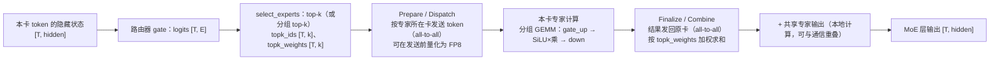
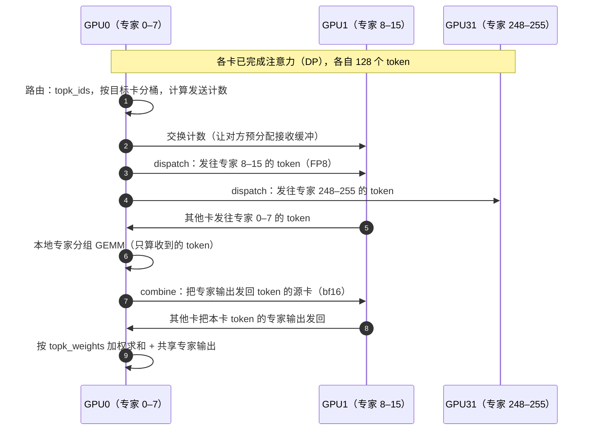

# E3 · 专家并行 EP（深度版）

> **版本**：vLLM 0.30.x（V1 引擎）｜**模块**：E-分布式｜**对应原课**：第 14 课
> **导航**：上一课：[E2-张量与流水并行] → **本课 E3** → 下一课：[E4-EP负载均衡]
> **练习**：`exercises/E3_moe_dispatch_sim`｜**源码标注**：MoE 模块在近几个版本中重构频繁（modular kernel、all2all 后端），标【待核】处以 0.30.x tag 为准。

## 0. 先修与本课目标

先修：E1（注意力 DP 的动机与 dummy batch）、E2（TP 的切分与通信）、C1（Triton kernel 与离线调优配置）；MoE 的基本概念（路由器、top-k 专家选择、共享专家）。

学完本课你应能：

1. 说明 MoE 推理的特点：参数大、每 token 激活少、计算稀疏而不规则；
2. 比较 MoE 层的三种切分方式（TP 切专家内部、EP 切专家集合、二者组合），并说出 vLLM 中 EP 规模的计算方式；
3. 按调用顺序复述 `FusedMoE.forward → 路由 select_experts → prepare（dispatch）→ 专家计算 → finalize（combine）`；
4. 手算 dispatch/combine 的通信量与每个专家收到的 token 数，并计算负载不均衡比例；
5. 了解 all2all 后端（naive、allgather-reducescatter、DeepEP 高吞吐/低延迟等）的取舍。

---

## 1. 动机：MoE 让"参数量"与"计算量"脱钩

稠密模型每个 token 都要经过全部参数；MoE 模型把 FFN 换成 E 个专家，路由器为每个 token 只选 k 个专家。以 DeepSeek-V3 为例：每层 256 个路由专家 + 1 个共享专家，每 token 选 8 个路由专家，总参数约 671B，而每 token 激活的参数约 37B。计算量像一个 37B 的稠密模型，显存却需要容纳 671B 参数（FP8 约 700 GB）。

这给推理带来三个挑战：**放得下**（必须分布到多卡）、**算得快**（每个专家只分到一小部分 token，矩阵乘很"瘦"，Tensor Core 利用率低）、**传得动**（token 要被送到持有对应专家的卡上，再把结果送回来）。专家并行（EP）就是为这三个挑战设计的。


**本课的主线**可以概括为一句话：MoE 用"稀疏激活"换来了巨大的参数量，而 EP 的全部工程难题都源于这种稀疏性——token 要被搬到专家所在的卡上（通信），每个专家只分到少量 token（瘦 GEMM），不同专家受欢迎程度不同（负载不均）。后面的每一节都可以归入这三个问题之一。

## 2. 三种切分方式

| 方式 | 每卡持有 | 通信 | 适合 |
|---|---|---|---|
| TP 切专家内部 | 全部 E 个专家，每个专家的 1/N | 每层 all-reduce（同稠密 TP） | 专家数少、单个专家大（如 8 专家模型） |
| EP 切专家集合 | E/N 个完整专家 | dispatch + combine（all-to-all） | 专家数多（64～256），大规模部署 |
| 组合 | 若干专家的部分 | 两类都有 | 大型多节点部署中的折中 |

在 vLLM 中，默认情况下 MoE 层按 TP 方式切分；加上 `--enable-expert-parallel` 后改为 EP，**EP 组的大小等于 DP × TP**（即参与该模型的全部 GPU），注意力部分仍按原来的 DP/TP 运行。例如 `-dp 8 -tp 1 --enable-expert-parallel` 得到 EP=8：注意力是 8 路 DP，MoE 层每卡持有 1/8 的专家。【待核：0.30.x 是否支持独立设置 EP 大小】

## 3. 架构图：一个 MoE 层的数据流（EP）



## 4. 源码走读（调用顺序）

1. `vllm/model_executor/models/deepseek_v2.py`（或 `qwen3_moe.py`、`mixtral.py` 等）：MoE 块中构造 `FusedMoE(num_experts, top_k, hidden_size, intermediate_size, ...)` 与路由 gate（一个普通线性层）。
2. `vllm/model_executor/layers/fused_moe/layer.py`：`FusedMoE.__init__` 根据并行配置计算本卡的 `local_num_experts` 与 `expert_map`（长度为全局专家数的张量，本卡持有的专家映射到本地编号，其余为 −1）；通过量化配置获取 `quant_method`（如 `UnquantizedFusedMoEMethod`、`Fp8MoEMethod`），调用其 `create_weights` 创建三维权重 `w13_weight [local_E, 2×inter, hidden]`、`w2_weight [local_E, hidden, inter]`。
3. 前向：`FusedMoE.forward(hidden_states, router_logits)` → 自定义算子包装（便于编译切分）→ `forward_impl` → `self.quant_method.apply(layer, x, router_logits, top_k, renormalize, use_grouped_topk, ...)`。
4. 路由：`FusedMoE.select_experts(...)`：普通 top-k softmax（`fused_topk`）或 DeepSeek 的分组 top-k（`grouped_topk`：先选若干专家组，再在组内选专家，限制每个 token 涉及的节点数以降低通信）；可选 `e_score_correction_bias`。若启用 EPLB（E4），在此把逻辑专家 id 映射为物理副本 id 并记录负载。
5. 计算：通过"模块化 kernel"组织——`FusedMoEModularKernel` = `FusedMoEPrepareAndFinalize`（负责 dispatch/combine 与量化）+ `FusedMoEPermuteExpertsUnpermute`（负责本地专家计算，如 Triton 的 `fused_experts`、CUTLASS 或 DeepGEMM 分组 GEMM）。不开 EP 时，prepare/finalize 退化为本地操作。【待核：0.30.x 类名与目录 `fused_moe/modular_kernel.py`】
6. Triton 实现：`fused_moe/fused_moe.py` 中的 `fused_experts` → `moe_align_block_size`（把 token 按专家排序并填充到 BLOCK 的倍数）→ `fused_moe_kernel` 两次（w13 与 w2）→ `moe_sum`。离线调优的配置 JSON 位于 `fused_moe/configs/`，文件名包含专家数、中间维、设备名与 dtype（C1 第 6 节）。
7. all2all 后端：`vllm/distributed/device_communicators/all2all.py` 中的多种 manager，由 `--all2all-backend`（旧版为环境变量 `VLLM_ALL2ALL_BACKEND`）选择：`naive`（广播式，仅用于调试）、`allgather_reducescatter`（简单通用）、`deepep_high_throughput`（DeepEP 普通模式，适合 prefill 大批量）、`deepep_low_latency`（DeepEP 低延迟模式，适合 decode，兼容 CUDA Graph）、`pplx` 等。【待核：0.30.x 可选值】

## 4.5 路由的细节：为什么要"分组 top-k"

路由器本身很简单：一个 [hidden, E] 的线性层输出每个 token 对每个专家的分数，经过 softmax 或 sigmoid 后取 top-k，并把选中的 k 个分数归一化作为加权系数。但在大规模 EP 下，一个看似无关紧要的细节会显著影响通信：**一个 token 选中的 8 个专家分布在多少张卡、多少个节点上**。如果完全自由选择，8 个专家可能分布在 8 个不同节点，这个 token 就要被复制发送到 8 个节点，跨节点流量巨大。

DeepSeek 系列模型在训练时就引入了**分组路由**：把 256 个专家分成若干组（例如 8 组，每组 32 个，恰好对应一个节点上的专家），先根据每组内最高的几个专家分数选出得分最高的若干组（例如 4 组），再在这些组内选 top-8 专家。这样每个 token 最多涉及 4 个节点，跨节点副本数被限制住。推理时必须使用与训练一致的路由方式，否则模型输出会变化——这就是 vLLM 中 `use_grouped_topk`、`num_expert_group`、`topk_group` 等参数的来源，它们从模型配置中读取，用户通常不需要修改。

另一个细节是**偏置校正**：部分模型在路由分数上加一个可学习的偏置（`e_score_correction_bias`），用于训练时的负载均衡，偏置只影响"选哪些专家"，不影响加权系数。读模型代码时如果看到两套分数，一套用于选择、一套用于加权，就是这个原因。

## 4.6 共享专家与计算通信重叠

DeepSeek 类模型除了路由专家，每层还有一个所有 token 都要经过的**共享专家**。它本质上是一个小的稠密 MLP，每张卡都持有完整副本，不需要任何通信。这为性能优化提供了一个天然的机会：在 dispatch 的 all-to-all 进行时，GPU 的计算单元是空闲的，此时正好可以计算共享专家；combine 时同理。vLLM 在支持的 all2all 后端上会安排这种重叠，使共享专家的计算几乎"免费"。

更进一步的优化是**双批次重叠**：把一个 batch 拆成两半，当前一半在做 all-to-all 通信时，后一半做注意力或专家计算，两者交替推进。理想情况下通信时间可以被计算完全掩盖。代价是每一半的 batch 变小，GEMM 效率下降，并且实现复杂度显著增加。它在通信占比很高的大规模跨节点 EP 中收益最明显。

## 5. 数字例子

**例 1：练习中的计数**。4 个 token、k = 2、E = 4，`topk_indices = [[0,1],[1,2],[1,3],[0,1]]`。按专家计数：专家 0 收到 2 次、专家 1 收到 4 次、专家 2 收到 1 次、专家 3 收到 1 次，`counts = [2, 4, 1, 1]`，总 8 = T × k。均值 2，最大 4，**不均衡比例 max/mean = 2.0**。若每卡一个专家（EP=4），持有专家 1 的卡要处理其他卡两倍的 token，整层的耗时由它决定，其余卡有一半时间在等待。

**例 2：DeepSeek-V3 量级的 decode 通信**。EP = 32，每卡每步 128 个 token，hidden = 7168，k = 8。每卡每步发出 128 × 8 = 1 024 份 token 副本（若同一 token 选中的多个专家在同一张卡上可合并发送，实际更少）。dispatch 用 FP8 时每份 7 168 B（加少量 scale），约 7.3 MB；combine 用 bf16 每份 14 336 B，约 14.7 MB。每层合计约 22 MB，58 个 MoE 层约 1.28 GB 每步。若跨节点网卡为 400 Gb/s（约 50 GB/s），纯传输约 25 ms——这比 decode 的计算时间还长，所以必须：使用低延迟的 all-to-all 实现、用分组路由限制跨节点数、让共享专家计算与通信重叠、或采用双批次重叠（two-batch overlap，一批计算时另一批通信）。【待核：0.30.x 中双批次重叠的开关】

**例 3：专家 GEMM 的"瘦"问题**。全局每步 32 × 128 = 4 096 个 token，每 token 8 个专家，共 32 768 份分派，平均每个专家（256 个）分到 128 份。每个专家的 GEMM 是 [128, 7168] × [7168, 4096]（w13，2 × 2048），算术强度约为 128 FLOP/B 量级，仍低于 H100 的拐点（C1），属于访存受限——**每个专家每步都要完整读一次自己的权重，但只用于 128 个 token**。增大 batch 是提升 MoE decode 效率的关键，这也是 MoE 部署通常需要大规模 EP 与高并发的原因。

## 6. 一次 dispatch/combine 的时序



## 6.5 设计问答

**问：既然 TP 切专家实现简单，为什么大模型都用 EP？** 以 256 个专家为例，TP=32 切专家内部时，每个专家的中间维 2048 被切成每卡 64，矩阵乘极其细碎；而且每层的 all-reduce 消息大小与 token 数和 hidden 成正比，跨节点时成本很高。EP 下每卡持有完整专家，GEMM 形状更合理，通信量只与"实际被路由的 token 副本"成正比，并且可以在发送前量化为 FP8 进一步减半。规模越大，EP 的优势越明显。

**问：为什么 decode 用低延迟模式、prefill 用高吞吐模式？** decode 每步 token 少，通信消息小，瓶颈是延迟与 kernel 启动次数；低延迟模式使用预分配的固定大小缓冲区，形状固定，可被 CUDA Graph 捕获，并通过 GPU 直接发起的 RDMA 减少 CPU 参与。prefill 每步 token 多，消息大，瓶颈是带宽；高吞吐模式按实际数量动态分配，充分利用节点内 NVLink 与节点间 RDMA 的分层传输，但形状不固定，不能捕获图。这也是 F3 中 PD 分离与 EP 经常组合使用的原因之一：P 与 D 实例可以各自选择最合适的后端。

**问：EP 下注意力部分怎么办？** 注意力部分通常使用 DP（E1）：每张卡处理自己的那部分请求，持有完整的注意力权重与自己的 KV Cache。所以一个典型的大 MoE 部署，在每一层中都经历"注意力阶段各卡独立 → MoE 阶段全体 all-to-all → 下一层注意力各卡独立"的交替，这就是 E1 中所有 DP rank 必须步调一致的根本原因。

## 7. 常见坑 / 故障模式

1. **忘记 `--enable-expert-parallel`**：大 MoE 模型默认走 TP 切专家内部，每层 all-reduce 的消息很大，跨节点时性能极差。
2. **all2all 后端与场景不匹配**：prefill 用低延迟模式会因缓冲区限制吞吐受限，decode 用高吞吐模式则无法使用 CUDA Graph、延迟高。生产中常按 PD 分离（F3）给 P 与 D 配不同后端。
3. **DeepEP 等依赖未安装或网卡不支持**：启动报错或回退，需要按官方指南安装对应库并确认 RDMA 环境（如 IBGDA）。
4. **专家负载不均**：热门专家所在卡成为瓶颈，见 E4。
5. **专家数不能被 EP 整除**：例如 E=60、EP=8 时无法均分，需要冗余专家（E4）或调整 EP。
6. **缺少 fused MoE 调优配置**：新 GPU 或新形状下没有现成 JSON，使用默认配置性能可能差一截，可用仓库中的 benchmark 脚本离线调优生成。
7. **DP 各 rank token 数不均**：dispatch 前需要按最大值对齐缓冲区或 padding（E1），轻负载 rank 也承担同样的通信轮次。

## 8. 动手练习

- 目录：`exercises/E3_moe_dispatch_sim`
- 任务：实现 `expert_token_counts(topk_indices, num_experts)`（输入形状 [T, k]，返回长度为 E 的计数列表，id 越界或 E ≤ 0 抛 `ValueError`）与 `load_imbalance_ratio(counts)`（max / mean，全零或空列表返回 1.0）。
- 运行：

```bash
python -m pytest exercises/E3_moe_dispatch_sim -q
```

- 进阶 1：实现 `rank_token_counts(counts, ep_size)`，把专家计数聚合到卡（专家 i 在卡 i // (E/ep)），计算卡级不均衡比例；比较专家级与卡级比例的差异（多个专家聚合后通常更均衡）。
- 进阶 2：用 numpy 模拟 Zipf 分布的路由（少数专家极热），计算 E = 256、EP = 32 时的卡级不均衡比例，为 E4 做准备。

## 9. 自测清单

- [ ] 我能说出 TP 切专家与 EP 切专家的通信差异，以及 vLLM 中 EP 大小如何确定
- [ ] 我能按顺序说出一次 MoE 前向中路由、dispatch、专家计算、combine 的位置与数据形状
- [ ] 我能手算给定 batch 下的 dispatch/combine 字节数与每个专家的平均 token 数

## 10. 延伸阅读

- 论文：GShard、Switch Transformer、DeepSeekMoE、DeepSeek-V3 技术报告
- DeepEP、DeepGEMM 项目文档
- 源码：`vllm/model_executor/layers/fused_moe/`、`vllm/distributed/device_communicators/all2all.py`
