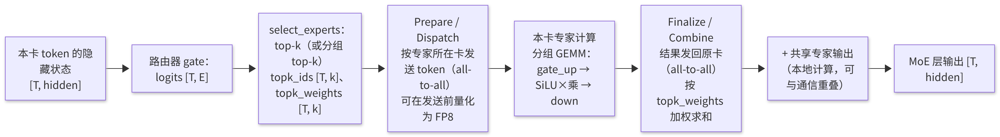
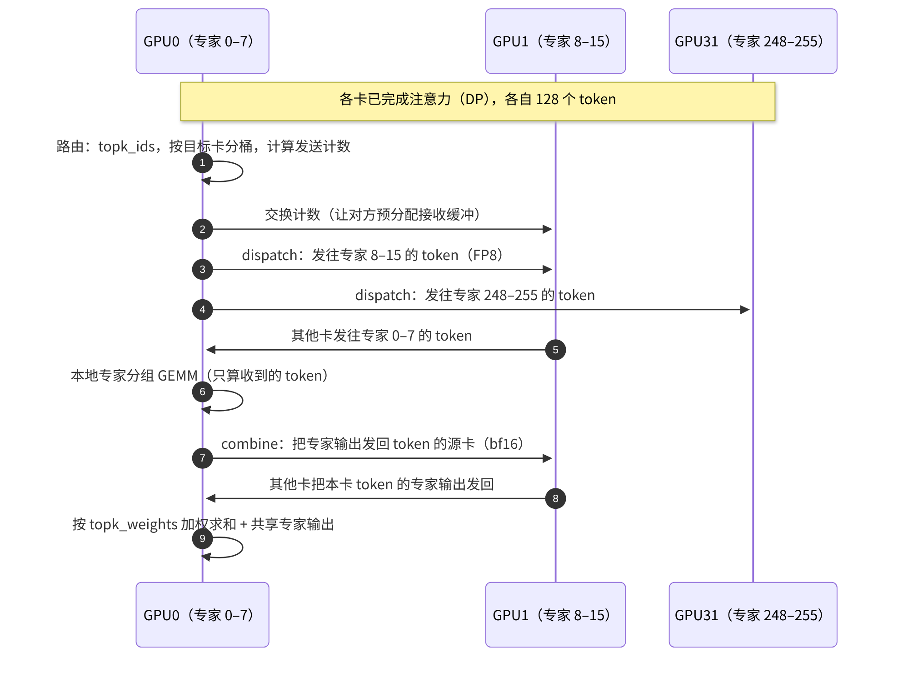

# E3 · 专家并行 EP

> **版本**：vLLM 0.30.x（V1 引擎）｜**模块**：E-分布式｜**对应原课**：第 14 课
> **导航**：上一课：[E2-张量与流水并行] → **本课 E3** → 下一课：[E4-EP负载均衡]
> **练习**：`exercises/E3_moe_dispatch_sim`｜**源码标注**：MoE 模块在近期若干版本中频繁重构（modular kernel、all2all 后端），标有【待核】之处以 0.30.x tag 的源码为准。

## 0. 先修要求与学习目标

先修要求：E1（注意力 DP 的动机与 dummy batch）、E2（TP 的切分与通信）、C1（Triton kernel 与离线调优配置）；MoE 的基本概念（路由器、top-k 专家选择、共享专家）。

完成本课学习后，学习者应能够：

1. 说明 MoE 推理的特点：参数量大、每个词元（token）激活的参数少、计算稀疏且不规则；
2. 比较 MoE 层的三种切分方式（以张量并行（TP）切分专家内部、以专家并行（EP）切分专家集合、二者组合），并陈述 vLLM 中 EP 规模的计算方式；
3. 按调用顺序复述 `FusedMoE.forward → 路由 select_experts → prepare（dispatch）→ 专家计算 → finalize（combine）`；
4. 手工计算 dispatch/combine 的通信量与每个专家接收的 token 数，并计算负载不均衡比例；
5. 了解各 all2all 后端（naive、allgather-reducescatter、DeepEP 高吞吐/低时延等）之间的取舍。

---

## 1. 动机：MoE 使"参数量"与"计算量"解耦

稠密模型中每个 token 都须经过全部参数；MoE 模型将 FFN 替换为 E 个专家，路由器为每个 token 仅选择 k 个专家。以 DeepSeek-V3 为例：每层包含 256 个路由专家与 1 个共享专家，每个 token 选择 8 个路由专家，总参数约为 671B，而每个 token 激活的参数约为 37B。其计算量相当于一个 37B 的稠密模型，而显存却须容纳 671B 参数（FP8 下约 700 GB）。

这为推理带来三项挑战：**容纳**（参数必须分布至多张卡）、**计算效率**（每个专家仅分配到一小部分 token，矩阵乘法的形状很"窄"，Tensor Core 利用率低）以及**传输**（token 须被发送至持有对应专家的卡上，结果再被送回）。专家并行（EP）正是针对这三项挑战而设计的。


**本课主线**可概括如下：MoE 以"稀疏激活"换取了巨大的参数量，而 EP 的全部工程难题均源于这种稀疏性——token 须被传输至专家所在的卡上（通信），每个专家仅分配到少量 token（窄 GEMM），不同专家被选中的频率不同（负载不均衡）。后续各节均可归入这三个问题之一。

## 2. 三种切分方式

| 方式 | 每卡持有 | 通信 | 适用场景 |
|---|---|---|---|
| TP 切分专家内部 | 全部 E 个专家，每个专家的 1/N | 每层 all-reduce（与稠密 TP 相同） | 专家数少、单个专家规模大（如 8 专家模型） |
| EP 切分专家集合 | E/N 个完整专家 | dispatch + combine（all-to-all） | 专家数多（64～256），大规模部署 |
| 组合 | 若干专家的部分 | 两类通信均存在 | 大型多节点部署中的折中方案 |

在 vLLM 中，默认情况下 MoE 层按 TP 方式切分；添加 `--enable-expert-parallel` 后改为 EP，**EP 组的大小等于 DP × TP**（即参与该模型的全部 GPU），而注意力部分仍按原有的 DP/TP 方式运行。例如，`-dp 8 -tp 1 --enable-expert-parallel` 得到 EP=8：注意力为 8 路 DP，MoE 层中每张卡持有 1/8 的专家。【待核：0.30.x 是否支持独立设置 EP 大小】

## 3. 架构图：EP 下单个 MoE 层的数据流



<p align="center"><em>图1：专家并行（EP）下单个 MoE 层的数据流：路由、dispatch、专家计算、combine</em></p>

## 4. 源码分析（按调用顺序）

1. `vllm/model_executor/models/deepseek_v2.py`（或 `qwen3_moe.py`、`mixtral.py` 等）：在 MoE 块中构造 `FusedMoE(num_experts, top_k, hidden_size, intermediate_size, ...)` 与路由 gate（一个普通的线性层）。
2. `vllm/model_executor/layers/fused_moe/layer.py`：`FusedMoE.__init__` 根据并行配置计算本卡的 `local_num_experts` 与 `expert_map`（长度等于全局专家数的张量，本卡持有的专家映射为本地编号，其余为 −1）；通过量化配置获取 `quant_method`（如 `UnquantizedFusedMoEMethod`、`Fp8MoEMethod`），并调用其 `create_weights` 创建三维权重 `w13_weight [local_E, 2×inter, hidden]` 与 `w2_weight [local_E, hidden, inter]`。
3. 前向计算：`FusedMoE.forward(hidden_states, router_logits)` → 自定义算子包装（便于编译时切分）→ `forward_impl` → `self.quant_method.apply(layer, x, router_logits, top_k, renormalize, use_grouped_topk, ...)`。
4. 路由：`FusedMoE.select_experts(...)`：普通的 top-k softmax（`fused_topk`），或 DeepSeek 的分组 top-k（`grouped_topk`：先选择若干专家组，再在组内选择专家，以限制每个 token 所涉及的节点数，从而降低通信量）；可选使用 `e_score_correction_bias`。若启用 EPLB（E4），则在此处将逻辑专家 id 映射为物理副本 id，并记录负载。
5. 计算：通过"模块化 kernel"组织——`FusedMoEModularKernel` = `FusedMoEPrepareAndFinalize`（负责 dispatch/combine 与量化）+ `FusedMoEPermuteExpertsUnpermute`（负责本地专家计算，如 Triton 的 `fused_experts`、CUTLASS 或 DeepGEMM 分组 GEMM）。未启用 EP 时，prepare/finalize 退化为本地操作。【待核：0.30.x 类名与目录 `fused_moe/modular_kernel.py`】
6. Triton 实现：`fused_moe/fused_moe.py` 中的 `fused_experts` → `moe_align_block_size`（按专家对 token 排序，并填充至 BLOCK 的整数倍）→ 两次调用 `fused_moe_kernel`（w13 与 w2）→ `moe_sum`。离线调优的配置 JSON 位于 `fused_moe/configs/`，文件名包含专家数、中间维度、设备名与 dtype（C1 第 6 节）。
7. all2all 后端：`vllm/distributed/device_communicators/all2all.py` 中的多种 manager，由 `--all2all-backend`（旧版本中为环境变量 `VLLM_ALL2ALL_BACKEND`）选择：`naive`（广播式，仅用于调试）、`allgather_reducescatter`（简单通用）、`deepep_high_throughput`（DeepEP 普通模式，适用于大批量 Prefill）、`deepep_low_latency`（DeepEP 低时延模式，适用于 Decode，兼容 CUDA Graph）、`pplx` 等。【待核：0.30.x 可选值】

## 4.5 路由细节："分组 top-k"的必要性

路由器本身十分简单：一个 [hidden, E] 的线性层输出每个 token 对每个专家的分数，经 softmax 或 sigmoid 后取 top-k，并将选中的 k 个分数归一化作为加权系数。然而在大规模 EP 下，一个看似次要的细节会显著影响通信：**一个 token 选中的 8 个专家分布于多少张卡、多少个节点上**。若完全自由选择，这 8 个专家可能分布于 8 个不同的节点，该 token 就须被复制并发送至 8 个节点，跨节点流量巨大。

DeepSeek 系列模型在训练阶段即引入了**分组路由**：将 256 个专家划分为若干组（例如 8 组，每组 32 个，恰好对应一个节点上的专家），先依据每组内最高的若干专家分数选出得分最高的若干组（例如 4 组），再在这些组内选择 top-8 专家。由此，每个 token 最多涉及 4 个节点，跨节点副本数受到限制。推理时必须采用与训练一致的路由方式，否则模型输出将发生变化——这即是 vLLM 中 `use_grouped_topk`、`num_expert_group`、`topk_group` 等参数的来源；这些参数从模型配置中读取，用户通常无需修改。

另一项细节是**偏置校正**：部分模型在路由分数上加上一个可学习的偏置（`e_score_correction_bias`），用于训练时的负载均衡；该偏置仅影响"选择哪些专家"，而不影响加权系数。阅读模型代码时若发现存在两套分数，一套用于选择、一套用于加权，其原因即在于此。

## 4.6 共享专家与计算通信重叠

DeepSeek 类模型除路由专家外，每层还包含一个所有 token 都须经过的**共享专家**。它本质上是一个小型稠密 MLP，每张卡均持有完整副本，无需任何通信。这为性能优化提供了自然的机会：在 dispatch 的 all-to-all 进行期间，GPU 的计算单元处于空闲状态，此时恰好可以计算共享专家；combine 阶段同理。vLLM 在支持的 all2all 后端上会安排此类重叠，使共享专家的计算开销几乎被完全隐藏。

更进一步的优化是**双批次重叠**：将一个 batch 拆分为两半，当前一半执行 all-to-all 通信时，后一半执行注意力或专家计算，二者交替推进。理想情况下，通信时间可被计算完全掩盖。其代价是每一半的 batch 变小、GEMM 效率下降，且实现复杂度显著增加。该优化在通信占比很高的大规模跨节点 EP 中收益最为明显。

## 5. 数值示例

**例 1：练习中的计数**。4 个 token、k = 2、E = 4，`topk_indices = [[0,1],[1,2],[1,3],[0,1]]`。按专家计数：专家 0 被选中 2 次、专家 1 被选中 4 次、专家 2 被选中 1 次、专家 3 被选中 1 次，`counts = [2, 4, 1, 1]`，总计 8 = T × k。均值为 2，最大值为 4，**不均衡比例 max/mean = 2.0**。若每张卡一个专家（EP=4），则持有专家 1 的卡须处理其他卡两倍的 token，整层耗时由该卡决定，其余卡有一半时间处于等待状态。

**例 2：DeepSeek-V3 量级的 Decode 通信**。EP = 32，每卡每步 128 个 token，hidden = 7168，k = 8。每卡每步发出 128 × 8 = 1 024 份 token 副本（若同一 token 选中的多个专家位于同一张卡上，可合并发送，实际数量更少）。dispatch 采用 FP8 时每份为 7 168 B（另加少量 scale），合计约 7.3 MB；combine 采用 bf16 时每份为 14 336 B，合计约 14.7 MB。每层合计约 22 MB，58 个 MoE 层每步约 1.28 GB。若跨节点网卡为 400 Gb/s（约 50 GB/s），纯传输约需 25 ms，超过 Decode 的计算时间；因此必须采取以下措施：使用低时延的 all-to-all 实现、以分组路由限制跨节点数、使共享专家计算与通信重叠，或采用双批次重叠（two-batch overlap，一批计算时另一批进行通信）。【待核：0.30.x 中双批次重叠的开关】

**例 3：专家 GEMM 的"窄矩阵"问题**。全局每步共 32 × 128 = 4 096 个 token，每个 token 选择 8 个专家，共计 32 768 份分派，平均每个专家（共 256 个）分配到 128 份。每个专家的 GEMM 为 [128, 7168] × [7168, 4096]（w13，2 × 2048），算术强度约为 128 FLOP/B 量级，仍低于 H100 的拐点（C1），属于访存受限——**每个专家每步都须完整读取一次自身的权重，但仅用于 128 个 token**。增大 batch 是提高 MoE Decode 效率的关键，这也是 MoE 部署通常需要大规模 EP 与高并发的原因。

## 6. 单次 dispatch/combine 的时序



<p align="center"><em>图2：单次 dispatch/combine 的时序</em></p>

## 6.5 设计问答

**问：既然以 TP 切分专家的实现较为简单，为何大型模型普遍采用 EP？** 答：以 256 个专家为例，采用 TP=32 切分专家内部时，每个专家的中间维度 2048 被切分为每卡 64，矩阵乘法极为细碎；此外，每层 all-reduce 的消息大小与 token 数及 hidden 成正比，跨节点时成本很高。在 EP 下，每张卡持有完整的专家，GEMM 形状更为合理，通信量仅与"实际被路由的 token 副本数"成正比，并且可在发送前量化为 FP8 以进一步减半。规模越大，EP 的优势越明显。

**问：为何解码（Decode）采用低时延模式、预填充（Prefill）采用高吞吐模式？** 答：Decode 每步的 token 数少、通信消息小，瓶颈在于时延与 kernel 启动次数；低时延模式使用预分配的固定大小缓冲区，形状固定，可被 CUDA Graph 捕获，并通过由 GPU 直接发起的 RDMA 减少 CPU 的参与。Prefill 每步的 token 数多、消息大，瓶颈在于带宽；高吞吐模式按实际数量动态分配缓冲区，充分利用节点内 NVLink 与节点间 RDMA 的分层传输，但形状不固定，无法捕获图。这也是 F3 中 PD 分离与 EP 经常组合使用的原因之一：P 实例与 D 实例可各自选择最合适的后端。

**问：EP 下注意力部分如何处理？** 答：注意力部分通常采用数据并行（DP）（E1）：每张卡处理其所分配的请求，持有完整的注意力权重及其自身的键值缓存（KV Cache）。因此，在一个典型的大型 MoE 部署中，每一层都经历"注意力阶段各卡独立 → MoE 阶段全体 all-to-all → 下一层注意力各卡独立"的交替过程，这正是 E1 中所有 DP rank 必须步调一致的根本原因。

## 7. 常见问题与故障模式

1. **遗漏 `--enable-expert-parallel`**：大型 MoE 模型默认以 TP 方式切分专家内部，每层 all-reduce 的消息很大，跨节点时性能极差。
2. **all2all 后端与场景不匹配**：Prefill 使用低时延模式时，吞吐量受缓冲区限制；Decode 使用高吞吐模式时，无法使用 CUDA Graph，时延较高。生产环境中通常按 PD 分离（F3）为 P 与 D 配置不同的后端。
3. **DeepEP 等依赖未安装或网卡不支持**：启动报错或回退至其他实现，需按官方指南安装相应的库，并确认 RDMA 环境（如 IBGDA）。
4. **专家负载不均衡**：热门专家所在的卡成为瓶颈，见 E4。
5. **专家数无法被 EP 整除**：例如 E=60、EP=8 时无法均分，需要使用冗余专家（E4）或调整 EP。
6. **缺少 fused MoE 调优配置**：在新 GPU 或新形状下不存在现成的 JSON 配置，使用默认配置时性能可能明显下降，可使用仓库中的 benchmark 脚本进行离线调优并生成配置。
7. **DP 各 rank 的 token 数不均衡**：dispatch 之前须按最大值对齐缓冲区或进行填充（E1），负载较轻的 rank 也须承担相同的通信轮次。

## 8. 实践练习

- 目录：`exercises/E3_moe_dispatch_sim`
- 任务：实现 `expert_token_counts(topk_indices, num_experts)`（输入形状为 [T, k]，返回长度为 E 的计数列表；id 越界或 E ≤ 0 时抛出 `ValueError`）与 `load_imbalance_ratio(counts)`（max / mean；全零或空列表时返回 1.0）。
- 运行方式：

```bash
python -m pytest exercises/E3_moe_dispatch_sim -q
```

- 验收标准：上述测试全部通过；对第 5 节例 1 的输入，应返回 `counts = [2, 4, 1, 1]` 与不均衡比例 2.0。
- 进阶任务 1：实现 `rank_token_counts(counts, ep_size)`，将专家计数聚合至卡（专家 i 位于卡 i // (E/ep)），计算卡级不均衡比例，并比较专家级与卡级比例的差异（多个专家聚合后通常更为均衡）。
- 进阶任务 2：使用 numpy 模拟服从 Zipf 分布的路由（少数专家被频繁选中），计算 E = 256、EP = 32 时的卡级不均衡比例，为 E4 做准备。

## 9. 自测题

- [ ] 能否陈述以 TP 切分专家与以 EP 切分专家在通信上的差异，以及 vLLM 中 EP 大小的确定方式
- [ ] 能否按顺序陈述一次 MoE 前向计算中路由、dispatch、专家计算、combine 的位置与数据形状
- [ ] 能否手工计算给定 batch 下 dispatch/combine 的字节数与每个专家的平均 token 数

## 10. 延伸阅读

- 论文：GShard、Switch Transformer、DeepSeekMoE、DeepSeek-V3 技术报告
- DeepEP、DeepGEMM 项目文档
- 源码：`vllm/model_executor/layers/fused_moe/`、`vllm/distributed/device_communicators/all2all.py`

---

**课程导航**　上一课：[E2 · 张量并行 TP 与流水并行 PP](https://qcngm3vce6yt.feishu.cn/docx/SORgdnCh8ojUyyxzam7cXu7AnMW)｜下一课：[E4 · EP 负载均衡 EPLB](https://qcngm3vce6yt.feishu.cn/docx/VNJEdOLkHo0dubxr2xxce4Vbnae)｜[返回索引](https://qcngm3vce6yt.feishu.cn/docx/KUn5dKSejoQSAJxaf7YcvNVDnCd)

相关章节：
- [E1 · 数据并行 DP](https://qcngm3vce6yt.feishu.cn/docx/WmsNdoxVDoVE0ix9DchclYB8nYe)——见本课「0. 先修要求与学习目标」：“先修要求：E1（注意力 DP 的动机与 dummy batch）”
- [C1 · Triton 算子入门与 Attention 后端](https://qcngm3vce6yt.feishu.cn/docx/Msn0d9x8ioVNfvx3ESFcUhelnQ9)——见本课「0. 先修要求与学习目标」：“C1（Triton kernel 与离线调优配置）”
- [F3 · PD 分离部署](https://qcngm3vce6yt.feishu.cn/docx/AXNadrgJYoxuwmxYzDAc15lXnpd)——见本课「6.5 设计问答」：“这也是 F3 中 PD 分离与 EP 经常组合使用的原因之一”
