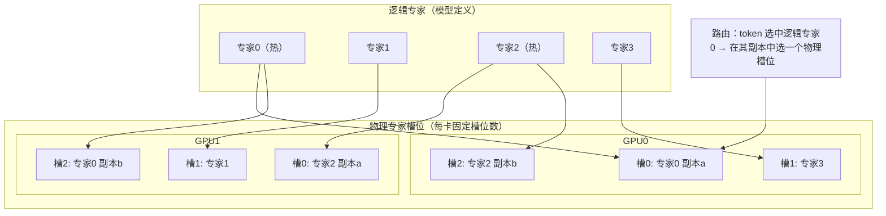
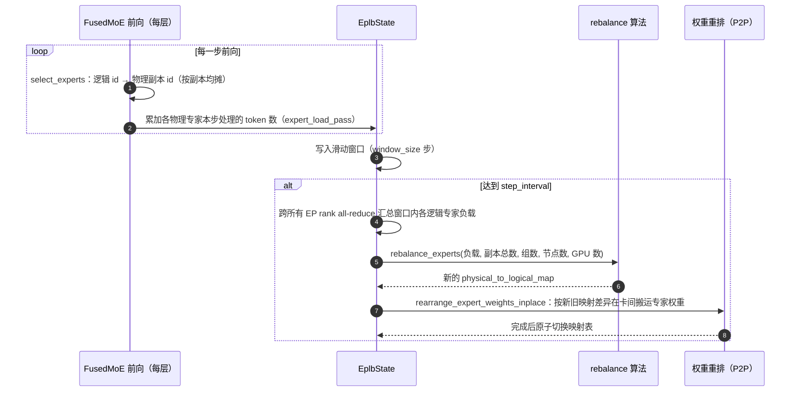

# E4 · EP 负载均衡 EPLB（深度版）

> **版本**：vLLM 0.30.x（V1 引擎）｜**模块**：E-分布式｜**对应原课**：第 15 课
> **导航**：上一课：[E3-专家并行] → **本课 E4** → 下一课：[F1-采样与投机解码]
> **练习**：无独立目录，复用 `exercises/E3_moe_dispatch_sim` 的负载统计函数（见第 9 节）｜**源码标注**：EPLB 参数在近几个版本中从多个独立参数收敛为一个配置对象，标【待核】处以 0.30.x tag 为准。

## 0. 先修与本课目标

先修：E3（专家计数、不均衡比例 max/mean、dispatch/combine）；E1（DP 各 rank 步调一致）；基本的贪心装箱算法。

学完本课你应能：

1. 用数字说明专家负载不均衡对 MoE 层耗时的影响；
2. 区分"逻辑专家"与"物理专家"，理解冗余专家（副本）如何分摊热点；
3. 复述 EPLB 的完整闭环：负载统计 → 滑动窗口 → 周期性重算放置 → 权重原地重排 → 路由映射更新；
4. 手算一个小规模例子中的副本分配与装箱结果，并计算均衡度的提升；
5. 知道 EPLB 的代价（额外显存、重排停顿）与适用条件。

---

## 1. 动机：一层的耗时由最忙的那张卡决定

E3 的练习告诉我们，不均衡比例 = 最大负载 / 平均负载。MoE 层是集合通信同步的：所有卡必须等最慢的那张卡完成专家计算，才能开始 combine。因此**MoE 层的有效耗时 ∝ 最大负载**，不均衡比例 1.8 意味着这一层的计算时间是理想情况的 1.8 倍，其他卡有 44% 的时间在空等。

真实负载有多不均？路由器在训练时有负载均衡约束，但推理时的数据分布与训练不同（例如某业务全是代码、某业务全是中文），热门专家的负载可能是平均值的数倍。并且负载会随时间漂移：白天和夜里的流量构成不同，热点专家也不同。这决定了均衡策略必须是**基于实测负载的、周期性动态调整的**。


可以把 EPLB 理解为一个运行在推理服务内部的"自适应缓存系统"：热门的专家被"缓存"出多份副本，冷门专家只保留一份；访问统计决定谁该被复制，周期性的重排相当于缓存替换。这个类比也提示了它的局限：和任何缓存一样，当访问模式剧烈变化或没有明显热点时，它的收益会大打折扣，而副本占用的显存却是实打实的成本。

## 2. 核心思想：逻辑专家与物理专家



- **逻辑专家**：模型定义中的 E 个专家，路由器输出的是逻辑 id。
- **物理专家**：实际部署在卡上的专家槽位，共 E + R 个（R 为冗余专家数），每卡槽位数相同 (E + R) / EP。
- **映射**：`logical_to_physical_map`（每个逻辑专家对应哪些物理槽位）、`physical_to_logical_map`、`logical_replica_count`。热门专家被复制多份，其流量被分摊到多个副本上。

## 3. EPLB 闭环



源码要点：

1. `vllm/distributed/eplb/eplb_state.py`：`EplbState`（`build()` 初始化映射；`step()` 每步调用，记录负载并在到达间隔时触发 `rearrange()`）；保存 `expert_load_pass`、`expert_load_window`、三个映射表。
2. `vllm/distributed/eplb/rebalance_algo.py`：`rebalance_experts(weight, num_replicas, num_groups, num_nodes, num_gpus)`，实现层次化均衡（hierarchical）与全局均衡两种策略（源自 DeepSeek 开源的 EPLB 算法）。
3. `vllm/distributed/eplb/rebalance_execute.py`：`rearrange_expert_weights_inplace()`，计算每张卡需要发送/接收哪些专家权重，使用 P2P 通信原地完成交换，尽量复用已在本卡的专家以减少搬运。
4. `vllm/model_executor/layers/fused_moe/layer.py`：`select_experts` 中启用 EPLB 时的映射与负载记录。
5. 启用参数：`--enable-eplb` 与 `--eplb-config '{"window_size": 1000, "step_interval": 3000, "num_redundant_experts": 32, "log_balancedness": true}'`（旧版本为 `--num-redundant-experts`、`--eplb-window-size`、`--eplb-step-interval` 等独立参数）。【待核：0.30.x 的字段名与默认值】

## 4. 均衡算法：先复制、再装箱

**第一步：决定每个逻辑专家复制几份**。目标是让"每个副本的平均负载"尽量平均。贪心做法：初始每个专家 1 份，然后重复 R 次：找到当前"负载 / 副本数"最大的专家，给它加一份。

**第二步：把所有副本装进各卡的槽位**。每卡槽位数固定，目标是各卡总负载尽量接近。经典贪心：按副本负载从大到小排序，依次放进当前总负载最小且还有空槽的卡。

**层次化策略**（节点数能整除专家组数时使用）：先把专家组均衡地分配到各节点（让分组路由的流量尽量留在节点内），再在节点内做复制与装箱。这样既均衡了负载，又保持了 E3 中分组路由限制跨节点流量的效果。

**数字例子**：4 个逻辑专家，窗口负载 [60, 20, 100, 20]（总 200），2 张卡，每卡 3 个槽位，即 R = 2 个冗余。

- 不做 EPLB（每卡 2 个专家、无冗余）：最佳分法 {专家2, 专家1} = 120 与 {专家0, 专家3} = 80，最大 120，均值 100，比例 1.20；若按顺序放置 {0, 1} = 80 与 {2, 3} = 120，结果相同。
- 复制：第一次选"负载/副本"最大的专家 2（100/1），变为 2 份，每份 50；第二次比较专家 0（60）与专家 2（50），选专家 0，变为 2 份，每份 30。副本负载：专家 2 两份各 50、专家 0 两份各 30、专家 1 为 20、专家 3 为 20，共 6 个副本。
- 装箱（从大到小）：50 → GPU0（0）；50 → GPU1（0）；30 → GPU0（50）；30 → GPU1（50）；20 → GPU0（80）；20 → GPU1（80）。结果 GPU0 = 100、GPU1 = 100，比例 1.00。

这个例子正好对应第 2 节的示意图。均衡度（balancedness）常定义为 均值 / 最大值，从 0.83 提升到 1.0。

**代价**：每卡从 2 个专家增加到 3 个专家，专家权重显存增加 50%。在真实部署中（如 256 + 32 个专家、EP = 32），每卡从 8 个变为 9 个专家，专家显存增加 12.5%，换来的是热点专家被分摊。

## 5. 负载统计的细节

- **统计什么**：每个物理专家在每一步实际处理的 token 数，按层分别统计（每层的热点专家不同，均衡是逐层进行的）。
- **为什么用滑动窗口**：单步负载噪声很大，窗口平均（如最近 1 000 步）反映稳定的流量模式，又能跟随负载漂移。
- **为什么间隔很长才重排**：重排需要在卡间搬运专家权重（每个专家可能几十 MB），会造成短暂停顿；频繁重排的收益抵不上代价。
- **副本间如何分流**：token 选中某个逻辑专家后，需要在其多个副本中选一个。简单做法是按 token 序号或 rank 轮转，使各副本流量大致相等；更精细的做法会优先选同节点的副本以减少跨节点流量。【待核：0.30.x 的副本选择策略】

## 6. 数字例子：重排的停顿代价

DeepSeek-V3 量级：每个专家 FP8 权重约 3 × 7168 × 2048 B ≈ 44 MB。假设一次重排平均每卡需要换入 3 个专家、每层都调整，58 层共约 7.6 GB 的跨卡搬运；节点内 NVLink 约 200 GB/s 时约 40 ms，若有一半跨节点（约 50 GB/s）则增加到约 90 ms。每 3 000 步重排一次、每步约 50 ms，即每 150 秒停顿约 0.1 秒，开销约 0.07%，而 MoE 层的耗时因均衡下降了 10%～30%，非常划算。但如果把间隔缩短到 100 步，开销上升到约 2%，收益却未必增加。

## 6.5 如何观测与验证 EPLB 的效果

开启 EPLB 之前和之后，都应该用数据说话。建议分三层观测。第一层是**专家级负载**：打开均衡度日志后，每次重排会打印各层的均衡度（均值 / 最大值），你应该看到重排后均衡度明显提升并保持稳定；如果均衡度在两次重排之间迅速回落，说明负载漂移很快，窗口与间隔需要调整。第二层是**卡级耗时**：用 F2 的 profiler 在多张卡上同时采集一段 trace，比较各卡 MoE 层专家计算 kernel 的耗时差异，以及 combine 前的等待时间；均衡后各卡的专家计算时间应接近，等待时间应缩短。第三层是**端到端指标**：在相同负载下比较 ITL 的 P50/P99 与吞吐，这才是最终目标。

一个常见的误判是只看第一层：均衡度从 0.6 提升到 0.95，但端到端几乎没有变化。这往往说明 MoE 层并不是瓶颈（例如瓶颈在注意力或通信延迟），此时 EPLB 增加的显存与重排停顿反而是净损失。所以 EPLB 应当在"profile 证明专家计算不均衡确实是瓶颈"之后再开启，而不是作为默认配置。

## 6.6 EPLB 与其他机制的关系

EPLB 与前几课的机制有几处交叉，理解这些交叉能避免配置冲突。与**分组路由**（E3）：层次化均衡先按组分配节点，保证分组路由的"每 token 最多涉及若干节点"的性质在重排后仍然成立；若使用全局均衡策略，副本可能被放到任意节点，跨节点流量可能上升。与**CUDA Graph**（C2）：重排改变的是权重内容与映射表内容，而不是张量地址与形状，因此已捕获的图仍然有效，这也是实现中坚持"原地重排"的原因。与**量化**（D2）：专家权重若是量化格式，搬运时 scale 等元数据要一起搬运，映射关系必须同步更新。与**弹性扩缩容**（E1）：改变 EP 规模时需要重新计算放置，弹性扩缩容复用了同一套重排执行逻辑。

## 7. 常见坑 / 故障模式

1. **冗余专家数导致槽位不能整除**：(E + R) 必须能被 EP 大小整除，否则启动报错。
2. **显存预算没有包含冗余专家**：开启 EPLB 后可用 KV 显存减少，并发能力下降，要在容量规划中计入。
3. **流量太少时统计无意义**：低负载下窗口内 token 很少，重排可能基于噪声做出糟糕决策；EPLB 主要适用于持续高负载的大规模部署。
4. **以为 EPLB 能解决 DP 层面的不均衡**：EPLB 均衡的是"专家所在卡"的负载，各 DP rank 收到的请求不均（E1）是另一个问题，需要前端负载均衡解决。
5. **重排期间的一致性**：映射表必须在所有 rank 上同时切换，否则同一 token 在不同卡上按不同映射路由，结果错误。实现中重排是一个全体同步的操作。
6. **只看平均不均衡**：应逐层观察（`log_balancedness` 打印的均衡度），个别层的严重不均衡会决定整体性能。

## 8. 选型速查

- 专家数少（≤ 16）、单节点部署：通常不需要 EPLB，TP 或小规模 EP 即可；
- 专家数多（≥ 64）、EP ≥ 16、持续高负载：建议开启 EPLB，冗余专家数取每卡 1 个左右；
- 流量构成变化剧烈（多租户、多业务混合）：窗口适当缩短，但重排间隔不宜过短；
- 显存紧张：减少冗余专家，或先确认不均衡比例确实较高（> 1.3）再开启。

## 9. 动手练习

本课无独立练习目录，使用 E3 的负载统计函数作为基础：

```bash
python -m pytest exercises/E3_moe_dispatch_sim -q
```

在此基础上完成以下扩展（建议写在 `exercises/E3_moe_dispatch_sim` 的本地副本或自己的文件中，并配套 pytest 测试）：

1. `replicate(loads, num_redundant)`：按第 4 节的贪心规则返回每个逻辑专家的副本数，用 [60, 20, 100, 20]、R = 2 验证结果为 [2, 1, 2, 1]。
2. `pack(replica_loads, num_gpus, slots_per_gpu)`：按"从大到小、放入负载最小且有空槽的卡"装箱，返回各卡负载，验证得到 [100, 100]。
3. 用 E3 的 `load_imbalance_ratio` 计算装箱前后卡级不均衡比例，验证从 1.2 降到 1.0。
4. 进阶：用 Zipf 分布生成 256 个专家的负载，在 EP = 32、R = 32 下比较不做 EPLB 与做 EPLB 的卡级不均衡比例。

## 10. 自测清单

- [ ] 我能解释为什么 MoE 层耗时由最大负载决定，以及不均衡比例与空等时间的关系
- [ ] 我能区分逻辑专家与物理专家，并说出三张映射表的作用
- [ ] 我能手算第 4 节的复制与装箱，并估算冗余专家的显存代价与重排停顿

## 11. 延伸阅读

- DeepSeek 开源 EPLB 算法说明（层次化负载均衡）
- DeepSeek-V3 技术报告中关于推理部署与冗余专家的章节
- 源码：`vllm/distributed/eplb/`、`vllm/model_executor/layers/fused_moe/layer.py`
