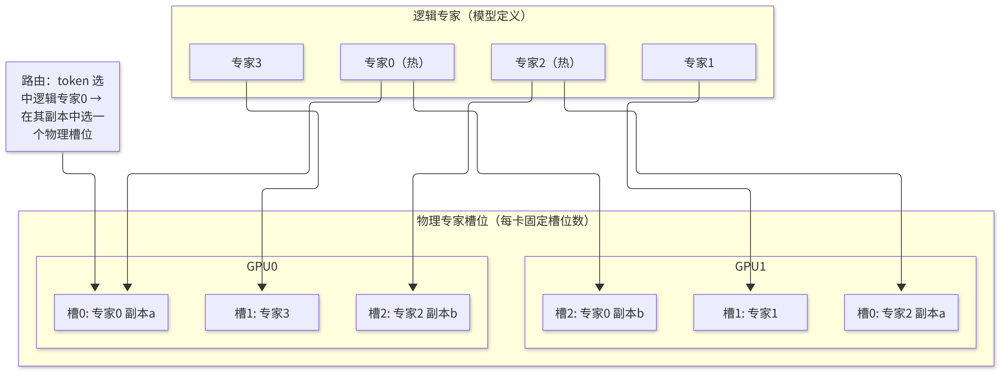
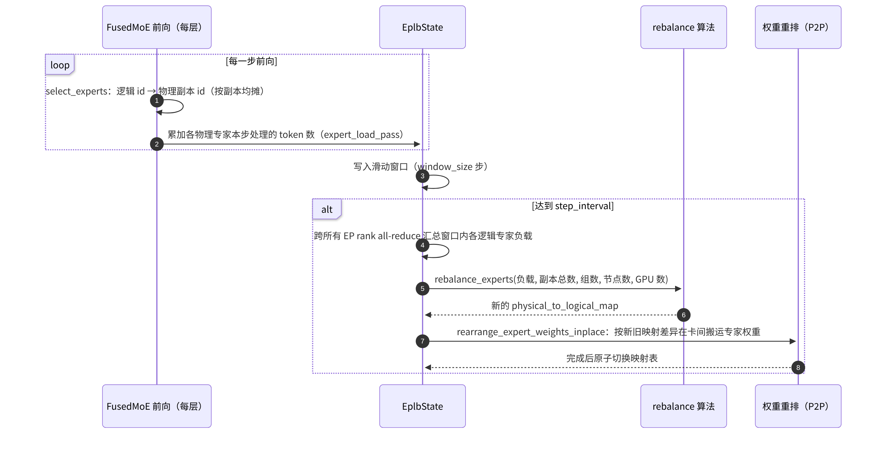

# E4 · EP 负载均衡 EPLB

> **版本**：vLLM 0.30.x（V1 引擎）｜**模块**：E-分布式｜**对应原课**：第 15 课
> **导航**：上一课：[E3-专家并行] → **本课 E4** → 下一课：[F1-采样与投机解码]
> **练习**：不设独立目录，复用 `exercises/E3_moe_dispatch_sim` 中的负载统计函数（见第 9 节）｜**源码标注**：EPLB 参数在近期若干版本中已由多个独立参数收敛为一个配置对象，文中涉及的源码路径、符号与参数已对照 vLLM v0.30.0 tag 的源码核实。

## 0. 先修要求与学习目标

先修要求：E3（专家计数、不均衡比例 max/mean、dispatch/combine）；E1（DP 各 rank 步调一致）；基本的贪心装箱算法。

完成本课学习后，学习者应能够：

1. 以定量数据说明专家负载不均衡对 MoE 层耗时的影响；
2. 区分"逻辑专家"与"物理专家"，并说明冗余专家（副本）分摊热点负载的方式；
3. 复述专家并行负载均衡（EPLB）的完整闭环：负载统计 → 滑动窗口 → 周期性重新计算放置 → 权重原地重排 → 路由映射更新；
4. 手工计算一个小规模示例中的副本分配与装箱结果，并计算均衡度的提升；
5. 了解 EPLB 的代价（额外显存、重排停顿）及其适用条件。

---

## 1. 动机：单层耗时由负载最重的卡决定

E3 的练习表明，不均衡比例 = 最大负载 / 平均负载。MoE 层通过集合通信同步：所有卡必须等待最慢的卡完成专家计算后，方能开始 combine。因此，**MoE 层的有效耗时与最大负载成正比**；不均衡比例为 1.8 意味着该层的计算时间是理想情况的 1.8 倍，其他卡有 44% 的时间处于空闲等待状态。

实际负载的不均衡程度取决于以下因素：路由器在训练时受负载均衡约束，但推理时的数据分布与训练数据不同（例如某一业务全部为代码、另一业务全部为中文），热门专家的负载可能达到平均值的数倍。此外，负载会随时间漂移：白天与夜间的流量构成不同，热点专家亦随之变化。因此，均衡策略必须**基于实测负载，并周期性地动态调整**。


**类比说明**（仅用于辅助理解）：可将 EPLB 视为运行于推理服务内部的一种"自适应缓存系统"：热门专家被"缓存"为多份副本，冷门专家仅保留一份；访问统计决定哪些专家应被复制，周期性重排相当于缓存替换。该类比同时揭示了其局限：与任何缓存一样，当访问模式剧烈变化或不存在明显热点时，其收益将大幅降低，而副本所占用的显存则是确定的成本。

## 2. 核心思想：逻辑专家与物理专家



<p align="center"><em>图1：EPLB 核心思想：逻辑专家与物理专家（冗余副本）映射</em></p>

- **逻辑专家**：模型定义中的 E 个专家，路由器输出的是逻辑 id。
- **物理专家**：实际部署于卡上的专家槽位，共 E + R 个（R 为冗余专家数），每张卡的槽位数相同，均为 (E + R) / EP。
- **映射**：`logical_to_physical_map`（每个逻辑专家对应的物理槽位）、`physical_to_logical_map`、`logical_replica_count`。热门专家被复制为多份，其流量被分摊至多个副本。

## 3. EPLB 闭环



<p align="center"><em>图2：EPLB 闭环：负载统计、重排计算与权重迁移</em></p>

源码要点：

1. `vllm/distributed/eplb/eplb_state.py`：`EplbState`（`add_model()` 初始化映射，旧版本中为 `build()`；`step()` 在每一步调用，记录负载，并在达到间隔时触发 `rearrange()`）；并按模型（`EplbModelState`）保存 `expert_load_pass`、`expert_load_window` 以及三张映射表。
2. `vllm/distributed/eplb/policy/default.py`（旧版本中为 `rebalance_algo.py`）：`DefaultEplbPolicy.rebalance_experts(weight, num_replicas, num_groups, num_nodes, num_ranks, ...)`（策略由 `EPLBConfig.policy` 选择，抽象接口为 `policy/abstract.py` 中的 `AbstractEplbPolicy`），实现层次化均衡（hierarchical）与全局均衡两种策略（源自 DeepSeek 开源的 EPLB 算法）。
3. `vllm/distributed/eplb/rebalance_execute.py`：`rearrange_expert_weights_inplace()`，计算每张卡需要发送/接收的专家权重，使用 P2P 通信原地完成交换，并尽量复用已位于本卡的专家以减少搬运量。
4. `vllm/model_executor/layers/fused_moe/router/base_router.py`：`BaseRouter._apply_eplb_mapping()`，在 `select_experts` 的路由过程中完成启用 EPLB 时的映射与负载记录（旧版本中位于 `fused_moe/layer.py`）。
5. 启用参数：`--enable-eplb` 与 `--eplb-config '{"window_size": 1000, "step_interval": 3000, "num_redundant_experts": 32, "log_balancedness": true}'`（旧版本为 `--num-redundant-experts`、`--eplb-window-size`、`--eplb-step-interval` 等独立参数，v0.30.0 中已移除）。`EPLBConfig` 的默认值为 `window_size=1000`、`step_interval=3000`、`num_redundant_experts=0`、`log_balancedness=false`，此外还包括 `use_async`（默认 `true`，即非阻塞重排）、`policy` 与 `communicator` 等字段。

## 4. 均衡算法：先复制、再装箱

**第一步：确定每个逻辑专家的副本数**。目标是使"每个副本的平均负载"尽可能均匀。贪心做法：初始时每个专家 1 份，然后重复 R 次：找出当前"负载 / 副本数"最大的专家，为其增加一份副本。

**第二步：将所有副本装入各卡的槽位**。每张卡的槽位数固定，目标是使各卡的总负载尽可能接近。经典的贪心方法：按副本负载从大到小排序，依次放入当前总负载最小且仍有空槽的卡。

**层次化策略**（节点数能够整除专家组数时使用）：先将专家组均衡地分配至各节点（使分组路由的流量尽量保留在节点内），再在节点内执行复制与装箱。如此既均衡了负载，又保持了 E3 中分组路由限制跨节点流量的效果。

**数值示例**：4 个逻辑专家，窗口负载为 [60, 20, 100, 20]（总计 200），2 张卡，每卡 3 个槽位，即 R = 2 个冗余专家。

- 不启用 EPLB（每卡 2 个专家、无冗余）：最佳分配为 {专家2, 专家1} = 120 与 {专家0, 专家3} = 80，最大值 120，均值 100，比例为 1.20；若按顺序放置为 {0, 1} = 80 与 {2, 3} = 120，结果相同。
- 复制：第一次选择"负载/副本数"最大的专家 2（100/1），使其变为 2 份，每份 50；第二次比较专家 0（60）与专家 2（50），选择专家 0，使其变为 2 份，每份 30。副本负载为：专家 2 两份各 50、专家 0 两份各 30、专家 1 为 20、专家 3 为 20，共 6 个副本。
- 装箱（从大到小）：50 → GPU0（0）；50 → GPU1（0）；30 → GPU0（50）；30 → GPU1（50）；20 → GPU0（80）；20 → GPU1（80）。结果为 GPU0 = 100、GPU1 = 100，比例为 1.00。

该示例恰好对应第 2 节的示意图。均衡度（balancedness）通常定义为 均值 / 最大值，此例中由 0.83 提升至 1.0。

**代价**：每张卡由 2 个专家增加至 3 个，专家权重显存增加 50%。在实际部署中（如 256 + 32 个专家、EP = 32），每卡由 8 个专家变为 9 个，专家显存增加 12.5%，以此换取热点专家负载的分摊。

## 5. 负载统计的细节

- **统计对象**：每个物理专家在每一步实际处理的词元（token）数，按层分别统计（各层的热点专家不同，因此均衡是逐层进行的）。
- **采用滑动窗口的原因**：单步负载的噪声很大，窗口平均（如最近 1 000 步）既能反映稳定的流量模式，又能跟随负载漂移。
- **重排间隔较长的原因**：重排需要在卡间搬运专家权重（每个专家可能达数十 MB），会造成短暂停顿；频繁重排的收益不足以抵消其代价。
- **副本间的分流方式**：token 选中某一逻辑专家后，需在其多个副本中选择一个。v0.30.0 的做法是按 token 序号进行哈希分流：以 Knuth 乘法哈希计算 `(token_idx × 2654435769) mod 2^32`，再对该逻辑专家的副本数取模，得到所用副本，从而使各副本的流量大致相等；当前实现并不优先选择同一节点上的副本。

## 6. 数值示例：重排的停顿代价

以 DeepSeek-V3 量级为例：每个专家的 FP8 权重约为 3 × 7168 × 2048 B ≈ 44 MB。假设一次重排平均每卡需换入 3 个专家，且每层均需调整，则 58 层共计约 7.6 GB 的跨卡搬运；节点内 NVLink 约为 200 GB/s 时耗时约 40 ms，若其中一半跨节点（约 50 GB/s），则增加至约 90 ms。每 3 000 步重排一次、每步约 50 ms，即每 150 秒停顿约 0.1 秒，开销约为 0.07%；而 MoE 层的耗时因负载均衡下降了 10%～30%，收益远大于代价。但若将间隔缩短至 100 步，开销将上升至约 2%，而收益未必随之增加。

## 6.5 EPLB 效果的观测与验证

启用 EPLB 前后均应以数据为依据进行评估。建议分三个层次进行观测。第一层为**专家级负载**：启用均衡度日志后，每次重排均会打印各层的均衡度（均值 / 最大值），预期可观察到重排后均衡度明显提升并保持稳定；若均衡度在两次重排之间迅速回落，则说明负载漂移较快，需调整窗口与间隔。第二层为**卡级耗时**：使用 F2 所述的 profiler 在多张卡上同时采集一段 trace，比较各卡 MoE 层专家计算 kernel 的耗时差异，以及 combine 之前的等待时间；均衡后，各卡的专家计算时间应相互接近，等待时间应缩短。第三层为**端到端指标**：在相同负载下比较词元间时延（ITL）的 P50/P99 与吞吐量，这才是最终目标。

一种常见的误判是仅关注第一层：均衡度由 0.6 提升至 0.95，但端到端指标几乎没有变化。这通常说明 MoE 层并非瓶颈（例如瓶颈在于注意力或通信时延），此时 EPLB 所增加的显存占用与重排停顿反而构成净损失。因此，EPLB 应在"profile 结果证明专家计算不均衡确为瓶颈"之后再启用，而不应作为默认配置。

## 6.6 EPLB 与其他机制的关系

EPLB 与前几课所述的机制存在若干交叉，理解这些交叉可避免配置冲突。与**分组路由**（E3）的关系：层次化均衡先按组分配节点，以保证分组路由"每个 token 最多涉及若干节点"的性质在重排后仍然成立；若采用全局均衡策略，副本可能被放置于任意节点，跨节点流量可能上升。与 **CUDA Graph**（C2）的关系：重排改变的是权重内容与映射表内容，而非张量的地址与形状，因此已捕获的图仍然有效，这也是实现中坚持"原地重排"的原因。与**量化**（D2）的关系：若专家权重为量化格式，则搬运时须一并搬运 scale 等元数据，且映射关系必须同步更新。与**弹性扩缩容**（E1）的关系：改变 EP 规模时需要重新计算放置，弹性扩缩容复用了同一套重排执行逻辑。

## 7. 常见问题与故障模式

1. **冗余专家数导致槽位无法整除**：(E + R) 必须能被 EP 大小整除，否则启动时报错。
2. **显存预算未计入冗余专家**：启用 EPLB 后可用于键值缓存（KV Cache）的显存减少，并发能力随之下降，应在容量规划中计入。
3. **流量过少时统计失去意义**：低负载下窗口内的 token 很少，重排可能基于噪声作出不当决策；EPLB 主要适用于持续高负载的大规模部署。
4. **误认为 EPLB 能够解决 DP 层面的不均衡**：EPLB 均衡的是"专家所在卡"的负载；各 DP rank 收到的请求不均衡（E1）是另一个问题，需由前端负载均衡解决。
5. **重排期间的一致性**：映射表必须在所有 rank 上同时切换，否则同一 token 在不同卡上将按不同的映射进行路由，导致结果错误。实现中，重排是一个全体同步的操作。
6. **仅关注平均不均衡程度**：应逐层观察（`log_balancedness` 所打印的均衡度），个别层的严重不均衡将决定整体性能。

## 8. 选型速查

- 专家数较少（≤ 16）且为单节点部署：通常无需 EPLB，采用 TP 或小规模 EP 即可；
- 专家数较多（≥ 64）、EP ≥ 16 且持续高负载：建议启用 EPLB，冗余专家数取每卡约 1 个；
- 流量构成变化剧烈（多租户、多业务混合）：可适当缩短窗口，但重排间隔不宜过短；
- 显存紧张：减少冗余专家数，或先确认不均衡比例确实较高（> 1.3）后再启用。

## 9. 实践练习

本课不设独立的练习目录，以 E3 的负载统计函数作为基础：

```bash
python -m pytest exercises/E3_moe_dispatch_sim -q
```

在此基础上完成以下扩展（建议在 `exercises/E3_moe_dispatch_sim` 的本地副本或自建文件中实现，并配套编写 pytest 测试）：

1. 实现 `replicate(loads, num_redundant)`：按第 4 节的贪心规则返回每个逻辑专家的副本数；以 [60, 20, 100, 20]、R = 2 验证，预期结果为 [2, 1, 2, 1]。
2. 实现 `pack(replica_loads, num_gpus, slots_per_gpu)`：按"从大到小、放入负载最小且有空槽的卡"的规则装箱，返回各卡负载；预期结果为 [100, 100]。
3. 使用 E3 的 `load_imbalance_ratio` 计算装箱前后的卡级不均衡比例，预期由 1.2 降至 1.0。
4. 进阶任务：使用 Zipf 分布生成 256 个专家的负载，在 EP = 32、R = 32 的条件下，比较不启用与启用 EPLB 时的卡级不均衡比例。

验收标准：第 1～3 项的测试全部通过，且输出与上述预期一致。

## 10. 自测题

- [ ] 能否解释 MoE 层耗时由最大负载决定的原因，以及不均衡比例与空闲等待时间之间的关系
- [ ] 能否区分逻辑专家与物理专家，并陈述三张映射表的作用
- [ ] 能否手工计算第 4 节中的复制与装箱过程，并估算冗余专家的显存代价与重排停顿

## 11. 延伸阅读

- DeepSeek 开源 EPLB 算法说明（层次化负载均衡）
- DeepSeek-V3 技术报告中关于推理部署与冗余专家的章节
- 源码：`vllm/distributed/eplb/`、`vllm/model_executor/layers/fused_moe/layer.py`

---

**课程导航**　上一课：[E3 · 专家并行 EP](https://qcngm3vce6yt.feishu.cn/docx/Qe9tdBCrhoAtrVxG4SDcrcuwnfg)｜下一课：[F1 · 采样与投机解码](https://qcngm3vce6yt.feishu.cn/docx/HCfVd3TDLo9JIRx0nRuckXjvnUf)｜[返回索引](https://qcngm3vce6yt.feishu.cn/docx/KUn5dKSejoQSAJxaf7YcvNVDnCd)

相关章节：
- [E1 · 数据并行 DP](https://qcngm3vce6yt.feishu.cn/docx/WmsNdoxVDoVE0ix9DchclYB8nYe)——见本课「0. 先修要求与学习目标」：“E1（DP 各 rank 步调一致）”
- [F2 · 性能分析与瓶颈定位](https://qcngm3vce6yt.feishu.cn/docx/EA3EdAAINoqBhKx2VpKc5f3tnzq)——见本课「6.5 EPLB 效果的观测与验证」：“第二层为卡级耗时：使用 F2 所述的 profiler 在多张卡上同时采集一段 trace”
- [C2 · CUDA Graph](https://qcngm3vce6yt.feishu.cn/docx/HXw7ddUYQo9DaTxs9DzcJDwYnOc)——见本课「6.6 EPLB 与其他机制的关系」：“与 CUDA Graph（C2）的关系：重排改变的是权重内容与映射表内容”
