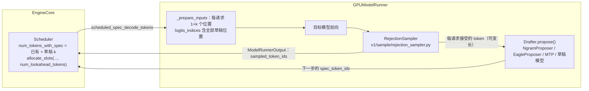
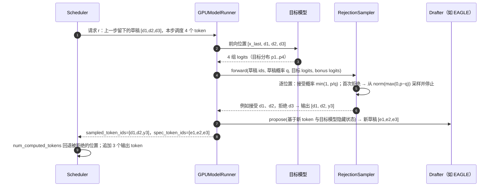

# F1 · 采样与投机解码（深度版）

> **版本**：vLLM 0.30.x（V1 引擎）｜**模块**：F-高级特性与性能｜**对应原课**：第 16 课
> **导航**：上一课：[E4-EP负载均衡] → **本课 F1** → 下一课：[F2-性能分析]
> **练习**：`exercises/F1_rejection_sampler_sim`｜**源码标注**：投机解码方法更新快，标【待核】处以 0.30.x tag 为准。

## 0. 先修与本课目标

先修：B3（`num_tokens_with_spec`、lookahead 槽位、拒绝后回退 `num_computed_tokens`）；B6（`logits_indices`、一维压平的批次）；A1（`SamplingParams` 各字段含义）；概率论中的拒绝采样。

学完本课你应能：

1. 按顺序说出 V1 `Sampler.forward` 对 logits 做的每一步处理及其原因；
2. 理解 top-k/top-p 的高效实现与"指数分布技巧"的随机采样；
3. 说清投机解码为什么能在不改变输出分布的前提下加速，并推导期望接受长度公式；
4. 按调用顺序复述 drafter 提议 → 调度器分配 → 目标模型验证 → `RejectionSampler` 接受/拒绝 → 回退的完整流程；
5. 比较 n-gram、EAGLE/EAGLE-3、MTP、独立草稿模型等方法的适用场景，并用数字评估收益。

---


**本课结构**：前半部分讲"一次采样"如何把 logits 变成一个 token，这是每个请求每一步都要经历的路径；后半部分讲投机解码如何让"一次前向"产出多个 token。两部分通过拒绝采样连接：投机解码的验证本质上就是在目标分布上做一次特殊的采样，所以必须先理解普通采样，才能理解为什么投机解码不改变输出分布。

## 1. 采样：从 logits 到 token

### 1.1 Sampler 的处理流水线

`vllm/v1/sample/sampler.py` 中 `Sampler.forward(logits, sampling_metadata)` 对一个批次的 logits（形状 [num_reqs, vocab]，投机解码时行数更多）依次执行：

1. **保存原始 logprobs**（若请求需要返回 logprobs，按配置在处理前或处理后计算）；
2. **转为 fp32**：后续的 softmax 与累加在低精度下误差大；
3. **允许/禁止 token**：`allowed_token_ids`、`bad_words`，以及结构化输出的 bitmask（在 ModelRunner 中先行应用，B6）；
4. **logits processors**：`min_tokens`（屏蔽 EOS）、`logit_bias`、`min_p` 等，V1 中以批量化的 `LogitsProcessor` 实现，避免逐请求的 Python 循环；【待核：0.30.x 中内置处理器列表】
5. **惩罚**：`apply_all_penalties`：presence / frequency（基于已输出 token 的计数，加性）、repetition（基于 prompt 与输出中出现过的 token，乘性：正 logit 除以惩罚、负 logit 乘以惩罚）；
6. **采样**：贪心请求直接 `argmax`；随机请求先除以 temperature，再经 `TopKTopPSampler` 截断并采样；混合批次中两类请求分别处理后按掩码合并。

### 1.2 两个实现技巧

**top-k/top-p 的实现**。朴素做法是对整个词表排序（128K 词表 × 数百请求），代价很高。vLLM 在可用时使用 FlashInfer 的基于拒绝采样的 top-k/top-p kernel，它不需要完整排序；否则走 PyTorch 实现（排序、累加、掩码）。【待核：0.30.x 默认实现】

**指数分布技巧**。从分布 p 中采样，等价于：为每个 token 独立生成 q_i ~ Exp(1)，取 argmax(p_i / q_i)。这样采样就变成了"逐元素除法 + argmax"，完全并行、无需累积分布函数，且每个请求可以用自己的随机数生成器（`seed`）。

**数字例子**：词表 4 个 token，p = [0.5, 0.3, 0.15, 0.05]，抽到的 q = [1.2, 0.2, 0.9, 0.01]。p/q = [0.417, 1.5, 0.167, 5.0]，argmax 为 token 3。虽然 token 3 概率只有 5%，但这次它的 q 很小。从长期看，token i 胜出的概率恰好等于 p_i——这是指数分布的性质，可以用 numpy 做一万次实验验证。


**为什么采样放在 CUDA Graph 之外**：采样涉及每个请求不同的随机数生成器状态、可变的惩罚参数和可选的 logprobs 输出，形状与行为随批次组成变化，难以满足图捕获的静态约束（C2）。把采样留在图外以 eager 方式执行，代价是多几次 kernel 启动，但换来了灵活性与正确性。

## 2. 投机解码：动机与原理

decode 是访存受限的：读一次全部权重只算 1 个 token，GPU 算力大量闲置（C1）。如果能让目标模型**一次验证多个候选 token**，读一次权重就能产出多个 token，单请求速度就能成倍提升。投机解码的做法是：用一个便宜的方法（小模型、额外的预测头、文本中的 n-gram）先**猜** k 个 token，再让目标模型对这 k 个位置做一次前向（相当于一个长度 k+1 的小 prefill），根据目标模型的分布决定接受多少个。

**无损性**：对第 i 个草稿 token x（草稿分布 q，目标分布 p），以概率 min(1, p(x)/q(x)) 接受；一旦拒绝，从修正分布 norm(max(0, p − q)) 中重新采样一个 token 并停止；若 k 个全部接受，再从目标分布在第 k+1 个位置采样一个"奖励 token"（bonus）。可以证明这样得到的每个 token 都严格服从目标分布 p，因此**输出质量与不使用投机解码完全相同**（在随机采样意义下同分布；贪心时则逐 token 一致，但浮点误差可能使极少数情况出现分叉）。

贪心解码时规则更简单：草稿 token 等于目标模型 argmax 则接受，否则用 argmax 替换并停止。练习中的 `accept_mask` 就是把"每个位置是否接受"预先给定后，实现"接受最长前缀、遇到第一个拒绝即停止、全部接受时需要 bonus"的逻辑。

## 3. 期望收益的数字推导

设每个草稿 token 被接受的概率为 α（假设独立），草稿长度为 k。一次验证产出的 token 数 = 接受的前缀长度 + 1（拒绝位置的修正 token 或全部接受时的 bonus token）。期望值为：

```
E[tokens] = 1 + α + α² + … + α^k = (1 − α^(k+1)) / (1 − α)
```

| α | k = 1 | k = 3 | k = 5 |
|---|---|---|---|
| 0.6 | 1.60 | 2.18 | 2.38 |
| 0.8 | 1.80 | 2.95 | 3.69 |
| 0.9 | 1.90 | 3.44 | 4.69 |

**代价**：一次验证步比普通 decode 步更贵（要算 k+1 个位置，并加上草稿开销）。设普通 decode 步耗时 T，验证步约 T × (1 + c_k)，草稿开销 d。加速比 ≈ E[tokens] × T / (T(1+c_k) + d)。小 batch 时验证 k+1 个位置几乎不增加耗时（访存受限，c_k 很小），例如 α = 0.8、k = 3、c_k = 0.1、d = 0.15T，加速比 ≈ 2.95 / 1.25 ≈ 2.36 倍。**大 batch 时**每步本就接近计算受限，c_k 变大，同时被拒绝的 token 计算全部浪费，加速比会迅速下降甚至小于 1。这是投机解码最重要的工程结论：**它是低并发、延迟敏感场景的利器，高吞吐场景要谨慎**。

## 4. 架构与调用顺序





源码要点：

1. 配置：`--speculative-config '{"method": "eagle3", "model": "<草稿头路径>", "num_speculative_tokens": 3}'`；方法还包括 `ngram`（配 `prompt_lookup_min/max`）、`eagle`、`mtp`（DeepSeek、Qwen 等模型自带的多 token 预测层）、`medusa`、独立草稿模型等。【待核：0.30.x 方法名与新增方法】
2. `vllm/v1/spec_decode/`：`ngram_proposer.py`（在 CPU 上用 KMP 风格匹配在 prompt+输出中找最近的相同 n-gram，把其后续 token 作为草稿，零 GPU 开销）、`eagle.py`（`EagleProposer`：使用目标模型最后的隐藏状态 + 一个轻量 Transformer 层自回归生成草稿，可捕获 CUDA Graph）、`medusa.py`、`metadata.py`（`SpecDecodeMetadata`：每请求草稿数、目标 logits 索引、bonus 索引）。
3. `vllm/v1/sample/rejection_sampler.py`：`RejectionSampler.forward()`；Triton kernel `rejection_greedy_sample_kernel`（贪心）、`rejection_random_sample_kernel`（随机）、`sample_recovered_tokens_kernel`（从修正分布采样）；输出形状 [num_reqs, k+1]，未使用的位置填占位值（如 −1），再由 `parse_output` 转为每请求可变长列表。对没有草稿概率的方法（如 n-gram），按草稿分布为确定性分布处理（即以 p(x) 的概率接受）。【待核】
4. `vllm/v1/worker/gpu_model_runner.py`：`_calc_spec_decode_metadata()`、`propose_draft_token_ids()`；调度器侧 `update_from_output()` 中根据 `len(generated_token_ids)` 回退 `num_computed_tokens`（B3）。

## 4.5 数字走查：一个请求连续三步投机

把调度、KV 与拒绝采样串起来走一遍，k = 3，block_size = 16。设请求 r 当前已有 100 个 token（`num_computed_tokens` = 99，最后一个 token 尚未写入 KV），上一步 drafter 已给出草稿 [d1, d2, d3]。

**第 1 步**：调度器计算 `num_tokens_with_spec = 100 + 3 = 103`，本步需要计算 103 − 99 = 4 个位置（位置 99～102）。`allocate_slots` 确保位置 0～102 都有槽位：103 个 token 需要 7 个块（112 个槽位），若原来只有 7 块则无需新分配。调度后乐观地把 `num_computed_tokens` 设为 103。ModelRunner 前向 4 个位置并写入它们的 KV。拒绝采样结果：接受 d1、d2，拒绝 d3，修正 token 为 y。输出 [d1, d2, y] 共 3 个 token，请求现有 103 个 token。调度器在 `update_from_output` 中发现本步只产出 3 个 token（而调度时假设了 4 个位置都有效），把 `num_computed_tokens` 回退为 102：位置 102 写入的是被拒绝的 d3 的 KV，下一步会被 y 的 KV 覆盖。

**第 2 步**：drafter 基于 y 给出新草稿 [e1, e2, e3]。本步计算位置 102～105 共 4 个位置；需要 106 个槽位，仍在 7 块内。假设三个全部接受并得到 bonus token z，输出 4 个 token，请求共 107 个 token，`num_computed_tokens` = 106，无需回退。

**第 3 步**：新草稿后需要 107 + 3 = 110 个槽位，仍在 7 块（112 槽位）内；若下一步再全部接受，需要 114 个槽位，就会分配第 8 块。

这个走查展示了几个要点：被拒绝位置的 KV 不需要显式删除，只需回退计数，下一步自然覆盖；lookahead 槽位让调度器提前为草稿预留空间，若 KV 不足，带草稿的请求也可能触发抢占；每步产出的 token 数是可变的，所以前端收到的增量长度不固定，这对流式输出完全透明（B1）。

## 5. 方法对比

| 方法 | 草稿来源 | 典型接受率 | 额外开销 | 适合 |
|---|---|---|---|---|
| n-gram | 上下文中的重复片段 | 差异极大（代码修改、文档改写中很高，开放生成中很低） | 几乎为 0 | 输出与输入高度重叠的任务 |
| EAGLE / EAGLE-3 | 目标模型隐藏状态 + 轻量头 | 较高且稳定 | 小（一层 Transformer） | 通用聊天，需要对应的草稿头权重 |
| MTP | 模型自带的多 token 预测层 | 高 | 小 | 原生带 MTP 的模型 |
| 独立草稿模型 | 同族小模型 | 中 | 中（完整小模型前向） | 有合适小模型且显存充裕 |

## 5.5 怎样判断该不该开投机解码

一个务实的决策流程：先在不开启的情况下测出目标负载下的 ITL 与吞吐（F2）；再以 k = 2～3 开启最适合模型的方法（有 MTP 用 MTP，有现成 EAGLE 头用 EAGLE，输入输出重叠度高的任务试 n-gram），观察接受率指标与 ITL。如果平均接受长度低于 1.5，或者高峰期吞吐明显下降，就应该缩小 k、改用别的方法，或者只在低负载时段开启。还要注意不同业务流量的接受率差别很大：代码补全、文档改写类任务往往很高，开放式创作较低。按业务分组部署，往往比一套配置服务所有流量效果更好。

最后提醒一点：投机解码改变的是"每步产出几个 token"，而不改变"每个 token 的分布"，所以它与量化、编译、并行等优化是正交的，可以叠加。但它与这些优化共享同一份 GPU 时间预算：当 TP 已经把每步时间压得很短、或者 batch 已经很大时，投机解码的边际收益会显著变小。

## 6. 常见坑 / 故障模式

1. **高并发下开启投机解码导致吞吐下降**：见第 3 节，大 batch 时验证不再"免费"。按负载决定是否开启，或使用动态调整草稿长度的策略。
2. **草稿头与目标模型不匹配**：EAGLE 头必须为特定目标模型训练，换了基座（哪怕是同系列不同版本）接受率会暴跌。
3. **以为接受率低只是变慢**：接受率极低时每步都在浪费 k 个位置的计算和 KV 槽位，比不开还慢。监控 `vllm:spec_decode_num_accepted_tokens` 与草稿 token 数的比值。【待核：指标名】
4. **与某些特性不兼容**：部分采样参数（如某些 logits processor）、结构化输出或 PP 组合可能不支持或自动关闭投机解码，留意启动日志。
5. **CUDA Graph 尺寸未覆盖 (1+k) × 并发**：投机解码下 decode 批次的 token 数是请求数的 1+k 倍，超过最大捕获尺寸会回退 eager（C2）。
6. **复现性误解**：随机采样时开启与关闭投机解码在分布上等价，但具体某次输出不同是正常的。

## 7. 动手练习

- 目录：`exercises/F1_rejection_sampler_sim`
- 任务：实现 `apply_rejection(draft_tokens, accept_mask) -> RejectResult`：接受最长的连续 True 前缀；遇到第一个 False 停止且 `needs_bonus=False`；全部接受（包括草稿为空）时 `needs_bonus=True`；长度不一致抛 `ValueError`。
- 运行：

```bash
python -m pytest exercises/F1_rejection_sampler_sim -q
```

- 进阶 1：实现概率版 `accept_mask_from_probs(p, q, draft, rng)`：对每个位置以 min(1, p[x]/q[x]) 接受；并用一万次模拟验证"贪心 α 与理论 E[tokens] 公式一致"。
- 进阶 2：实现修正分布采样 `recover(p, q, rng)`，并用蒙特卡罗验证：整个投机流程产生的第一个 token 的经验分布与 p 一致（卡方检验或最大绝对误差 < 0.01）。

## 8. 自测清单

- [ ] 我能按顺序说出 Sampler 的六步处理，以及指数分布技巧为什么等价于按 p 采样
- [ ] 我能推导期望接受长度公式，并估算给定 α、k、batch 下的加速比
- [ ] 我能说出调度器、ModelRunner、RejectionSampler、Drafter 在一次投机步中的分工与数据流

## 9. 延伸阅读

- 论文：Fast Inference from Transformers via Speculative Decoding（Leviathan 等）、Accelerating LLM Decoding with Speculative Sampling（Chen 等）、EAGLE / EAGLE-3、Medusa
- vLLM 文档：Speculative Decoding
- 源码：`vllm/v1/sample/`、`vllm/v1/spec_decode/`
