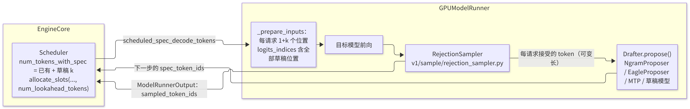
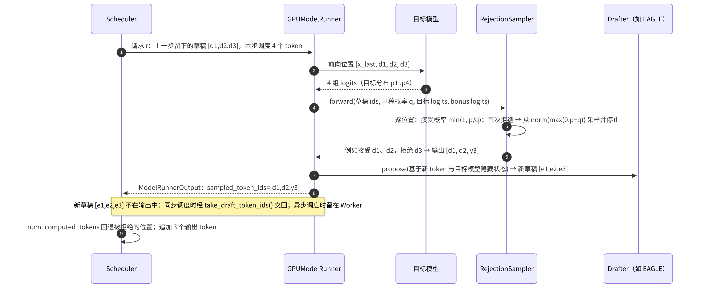

# F1 · 采样与投机解码

> **版本**：vLLM 0.30.x（V1 引擎）｜**模块**：F-高级特性与性能｜**对应原课**：第 16 课
> **导航**：上一课：[E4-EP负载均衡] → **本课 F1** → 下一课：[F2-性能分析]
> **练习**：`exercises/F1_rejection_sampler_sim`｜**源码标注**：投机解码方法更新较快，文中涉及的源码路径、符号与参数已对照 vLLM v0.30.0 tag 的源码核实。

## 0. 先修要求与学习目标

先修要求：B3（`num_tokens_with_spec`、lookahead 槽位、拒绝后回退 `num_computed_tokens`）；B6（`logits_indices`、一维压平的批次）；A1（`SamplingParams` 各字段的含义）；概率论中的拒绝采样。

完成本课学习后，学习者应能够：

1. 按顺序陈述 V1 `Sampler.forward` 对 logits 执行的每一步处理及其原因；
2. 说明 top-k/top-p 的高效实现，以及基于"指数分布技巧"的随机采样；
3. 阐明投机解码能够在不改变输出分布的前提下实现加速的原因，并推导期望接受长度公式；
4. 按调用顺序复述 drafter 提议 → 调度器分配 → 目标模型验证 → `RejectionSampler` 接受/拒绝 → 回退的完整流程；
5. 比较 n-gram、EAGLE/EAGLE-3、MTP、独立草稿模型等方法的适用场景，并以定量数据评估其收益。

---


**本课结构**：前半部分讨论"一次采样"如何将 logits 转换为一个词元（token），这是每个请求在每一步均须经历的路径；后半部分讨论投机解码如何使"一次前向计算"产出多个 token。两部分通过拒绝采样相互衔接：投机解码的验证在本质上是在目标分布上执行的一次特殊采样，因此必须先理解普通采样，方能理解投机解码不改变输出分布的原因。

## 1. 采样：从 logits 到 token

### 1.1 Sampler 的处理流水线

`vllm/v1/sample/sampler.py` 中的 `Sampler.forward(logits, sampling_metadata)` 对一个批次的 logits（形状为 [num_reqs, vocab]，投机解码时行数更多）依次执行以下处理：

1. **保存原始 logprobs**（若请求需要返回 logprobs，则按配置在处理前或处理后计算）；
2. **转换为 fp32**：后续的 softmax 与累加在低精度下误差较大；
3. **允许/禁止的 token**：`allowed_token_ids`、`bad_words`，以及结构化输出的 bitmask（已在 ModelRunner 中预先应用，见 B6）；
4. **logits processors**：`min_tokens`（屏蔽 EOS）、`logit_bias`、`min_p` 等；V1 中以批量化的 `LogitsProcessor` 实现，以避免逐请求的 Python 循环；v0.30.0 内置的批量处理器为 `MinTokensLogitsProcessor`、`LogitBiasLogitsProcessor` 与 `MinPLogitsProcessor` 三个；
5. **惩罚**：`apply_all_penalties`：presence / frequency（基于已输出 token 的计数，为加性惩罚）、repetition（基于 prompt 与输出中出现过的 token，为乘性惩罚：正 logit 除以惩罚系数，负 logit 乘以惩罚系数）；
6. **采样**：贪心请求直接执行 `argmax`；随机请求先除以 temperature，再经 `TopKTopPSampler` 截断并采样；在混合批次中，两类请求分别处理后按掩码合并。

### 1.2 两项实现技巧

**top-k/top-p 的实现**。朴素的做法是对整个词表排序（128K 词表 × 数百个请求），代价很高。vLLM 在条件允许时使用 FlashInfer 基于拒绝采样的 top-k/top-p kernel，该 kernel 无需完整排序；否则回退至原生路径：Triton 可用时采用 Triton 实现，不可用时采用 PyTorch 实现（排序、累加、掩码）。在 v0.30.0 中，CUDA 平台默认启用 FlashInfer 路径（`VLLM_USE_FLASHINFER_SAMPLER` 默认为 1），前提是 GPU 计算能力受 FlashInfer 支持，且 `logprobs_mode` 不要求返回经 top-k/top-p 处理后的 logits 或 logprobs。

**指数分布技巧**。从分布 p 中采样，等价于：为每个 token 独立生成 q_i ~ Exp(1)，再取 argmax(p_i / q_i)。由此，采样转化为"逐元素除法 + argmax"，可完全并行执行，无需计算累积分布函数，且每个请求均可使用其自身的随机数生成器（`seed`）。

**数值示例**：词表包含 4 个 token，p = [0.5, 0.3, 0.15, 0.05]，抽取得到 q = [1.2, 0.2, 0.9, 0.01]。p/q = [0.417, 1.5, 0.167, 5.0]，argmax 为 token 3。尽管 token 3 的概率仅为 5%，但本次其 q 值很小。从长期来看，token i 被选中的概率恰好等于 p_i——这是指数分布的性质，可通过 numpy 进行一万次实验加以验证。


**采样置于 CUDA Graph 之外的原因**：采样涉及每个请求各不相同的随机数生成器状态、可变的惩罚参数以及可选的 logprobs 输出，其形状与行为随批次组成而变化，难以满足图捕获的静态约束（C2）。将采样保留在图外以 eager 方式执行，其代价是增加若干次 kernel 启动，但换取了灵活性与正确性。

## 2. 投机解码：动机与原理

解码（Decode）属于访存受限：读取一次全部权重仅计算 1 个 token，GPU 算力大量闲置（C1）。若能使目标模型**一次验证多个候选 token**，则读取一次权重即可产出多个 token，单请求速度可成倍提升。投机解码的做法是：先以低成本的方法（小模型、额外的预测头、文本中的 n-gram）**预测** k 个草稿 token，再由目标模型对这 k 个位置执行一次前向计算（相当于一次长度为 k+1 的小规模预填充（Prefill）），并依据目标模型的分布决定接受其中的多少个。

**无损性**：对于第 i 个草稿 token x（草稿分布为 q，目标分布为 p），以概率 min(1, p(x)/q(x)) 接受；一旦拒绝，则从修正分布 norm(max(0, p − q)) 中重新采样一个 token 并停止；若 k 个草稿 token 全部被接受，则再从目标分布在第 k+1 个位置采样一个"奖励 token"（bonus）。可以证明，按此方式得到的每个 token 都严格服从目标分布 p，因此**输出质量与不使用投机解码时完全相同**（在随机采样的意义下同分布；在贪心解码下则逐 token 一致，但浮点误差可能使极少数情况出现分叉）。

贪心解码时规则更为简单：若草稿 token 等于目标模型的 argmax 则接受，否则以 argmax 替换并停止。练习中的 `accept_mask` 即在预先给定"每个位置是否接受"的前提下，实现"接受最长前缀、遇到第一个拒绝即停止、全部接受时需要 bonus"的逻辑。

## 3. 期望收益的定量推导

设每个草稿 token 被接受的概率为 α（假设相互独立），草稿长度为 k。一次验证产出的 token 数 = 被接受的前缀长度 + 1（拒绝位置上的修正 token，或全部接受时的 bonus token）。其期望值为：

```
E[tokens] = 1 + α + α² + … + α^k = (1 − α^(k+1)) / (1 − α)
```

| α | k = 1 | k = 3 | k = 5 |
|---|---|---|---|
| 0.6 | 1.60 | 2.18 | 2.38 |
| 0.8 | 1.80 | 2.95 | 3.69 |
| 0.9 | 1.90 | 3.44 | 4.69 |

**代价**：一次验证步比普通的 Decode 步代价更高（须计算 k+1 个位置，另加草稿开销）。设普通 Decode 步耗时为 T，验证步约为 T × (1 + c_k)，草稿开销为 d，则加速比 ≈ E[tokens] × T / (T(1+c_k) + d)。在小 batch 下，验证 k+1 个位置几乎不增加耗时（访存受限，c_k 很小），例如当 α = 0.8、k = 3、c_k = 0.1、d = 0.15T 时，加速比 ≈ 2.95 / 1.25 ≈ 2.36 倍。**在大 batch 下**，每一步本已接近计算受限，c_k 增大，同时被拒绝 token 的计算全部被浪费，加速比将迅速下降，甚至小于 1。这是投机解码最重要的工程结论：**它适用于低并发、时延敏感的场景，在高吞吐场景中应审慎使用**。

## 4. 架构与调用顺序



<p align="center"><em>图1：投机解码在 V1 中的架构：Scheduler 预留草稿位置、目标模型验证、RejectionSampler 与 Drafter</em></p>



<p align="center"><em>图2：投机解码单步的调用顺序</em></p>

源码要点：

1. 配置：`--speculative-config '{"method": "eagle3", "model": "<草稿头路径>", "num_speculative_tokens": 3}'`；方法还包括 `ngram`（配合 `prompt_lookup_min/max`）、`eagle`、`mtp`（DeepSeek、Qwen 等模型自带的多 token 预测层）、`medusa` 以及独立草稿模型（`draft_model`）等。v0.30.0 中 `method` 的完整取值还包括 `ngram_gpu`（GPU 上的 n-gram）、`suffix`（后缀解码）、`mlp_speculator`、`dflash`、`dspark`、`extract_hidden_states`、`custom_class`，以及 `deepseek_mtp`、`qwen3_next_mtp` 等按模型命名的 MTP 变体（加载时统一归一为 `mtp`）。
2. `vllm/v1/spec_decode/`：`ngram_proposer.py`（在 CPU 上以类似 KMP 的匹配方式，在 prompt 与输出中查找最近的相同 n-gram，并将其后续 token 作为草稿，不产生 GPU 开销）、`eagle.py`（`EagleProposer`：利用目标模型最后的隐藏状态与一个轻量 Transformer 层自回归地生成草稿，可被 CUDA Graph 捕获）、`medusa.py`、`metadata.py`（`SpecDecodeMetadata`：每个请求的草稿数、目标 logits 索引与 bonus 索引）。
3. `vllm/v1/sample/rejection_sampler.py`：`RejectionSampler.forward()`；Triton kernel 包括 `rejection_greedy_sample_kernel`（贪心）、`rejection_random_sample_kernel`（随机）与 `sample_recovered_tokens_kernel`（从修正分布采样）；输出形状为 [num_reqs, k+1]，未使用的位置填充占位值（如 −1），再由 `parse_output` 转换为每个请求的可变长度列表。对于不提供草稿概率的方法（如 n-gram），将草稿分布视为确定性分布处理（即以 p(x) 的概率接受）。
4. `vllm/v1/worker/gpu_model_runner.py`：`_calc_spec_decode_metadata()`、`propose_draft_token_ids()`；调度器侧在 `update_from_output()` 中根据 `len(generated_token_ids)` 回退 `num_computed_tokens`（B3）。

## 4.5 数值演算：单个请求连续三步的投机解码

以下将调度、键值缓存（KV Cache）与拒绝采样串联起来完整演算一遍，取 k = 3，block_size = 16。设请求 r 当前已有 100 个 token（`num_computed_tokens` = 99，最后一个 token 尚未写入 KV），上一步 drafter 已给出草稿 [d1, d2, d3]。

**第 1 步**：调度器（Scheduler）计算 `num_tokens_with_spec = 100 + 3 = 103`，本步需计算 103 − 99 = 4 个位置（位置 99～102）。`allocate_slots` 确保位置 0～102 均有槽位：103 个 token 需要 7 个块（112 个槽位），若原先已有 7 个块则无需新分配。调度后乐观地将 `num_computed_tokens` 设为 103。ModelRunner 对 4 个位置执行前向计算，并写入其 KV。拒绝采样结果为：接受 d1、d2，拒绝 d3，修正 token 为 y。输出 [d1, d2, y] 共 3 个 token，该请求现有 103 个 token。调度器在 `update_from_output` 中发现本步仅产出 3 个 token（而调度时假设 4 个位置均有效），因此将 `num_computed_tokens` 回退为 102：位置 102 写入的是被拒绝的 d3 的 KV，将在下一步被 y 的 KV 覆盖。

**第 2 步**：drafter 基于 y 给出新草稿 [e1, e2, e3]。本步计算位置 102～105 共 4 个位置；需要 106 个槽位，仍在 7 个块之内。假设三个草稿全部被接受并得到 bonus token z，则输出 4 个 token，该请求共有 107 个 token，`num_computed_tokens` = 106，无需回退。

**第 3 步**：新草稿生成后需要 107 + 3 = 110 个槽位，仍在 7 个块（112 个槽位）之内；若下一步草稿再次全部被接受，则需要 114 个槽位，届时将分配第 8 个块。

该演算揭示了以下要点：被拒绝位置的 KV 无需显式删除，仅需回退计数，下一步即自然覆盖；lookahead 槽位使调度器能够提前为草稿预留空间，若 KV 不足，携带草稿的请求同样可能触发抢占；每步产出的 token 数是可变的，因此前端收到的增量长度不固定，但这对流式输出完全透明（B1）。

## 5. 方法对比

| 方法 | 草稿来源 | 典型接受率 | 额外开销 | 适用场景 |
|---|---|---|---|---|
| n-gram | 上下文中的重复片段 | 差异极大（在代码修改、文档改写中很高，在开放式生成中很低） | 几乎为 0 | 输出与输入高度重叠的任务 |
| EAGLE / EAGLE-3 | 目标模型隐藏状态 + 轻量头 | 较高且稳定 | 小（一层 Transformer） | 通用对话，需要对应的草稿头权重 |
| MTP | 模型自带的多 token 预测层 | 高 | 小 | 原生具备 MTP 的模型 |
| 独立草稿模型 | 同系列的小模型 | 中 | 中（完整的小模型前向计算） | 具备合适的小模型且显存充裕 |

## 5.5 是否启用投机解码的判断方法

建议采用以下决策流程：首先在不启用投机解码的条件下，测出目标负载下的词元间时延（ITL）与吞吐量（F2）；然后以 k = 2～3 启用最适合该模型的方法（具备 MTP 则使用 MTP，具备现成 EAGLE 头则使用 EAGLE，输入与输出重叠度高的任务可尝试 n-gram），并观察接受率指标与 ITL。若平均接受长度低于 1.5，或高峰期吞吐量明显下降，则应减小 k、改用其他方法，或仅在低负载时段启用。此外需注意，不同业务流量的接受率差异很大：代码补全、文档改写类任务的接受率通常很高，开放式创作则较低。按业务分组部署，其效果往往优于以一套配置服务所有流量。

最后需指出：投机解码改变的是"每步产出的 token 数"，而不改变"每个 token 的分布"，因此它与量化、编译、并行等优化相互正交，可叠加使用。但它与这些优化共享同一份 GPU 时间预算：当 TP 已将每步时间压缩得很短，或 batch 已经很大时，投机解码的边际收益将显著减小。

## 6. 常见问题与故障模式

1. **高并发下启用投机解码导致吞吐量下降**：见第 3 节，在大 batch 下验证不再是几乎无代价的。应依据负载决定是否启用，或采用动态调整草稿长度的策略。
2. **草稿头与目标模型不匹配**：EAGLE 头必须针对特定的目标模型训练；更换基座模型后（即使是同一系列的不同版本），接受率将急剧下降。
3. **误认为接受率低仅导致速度变慢**：接受率极低时，每一步都在浪费 k 个位置的计算与 KV 槽位，速度甚至低于不启用时。应监控 `vllm:spec_decode_num_accepted_tokens_total` 与 `vllm:spec_decode_num_draft_tokens_total` 的比值（即接受率）。
4. **与某些特性不兼容**：部分采样参数（如某些 logits processor）、结构化输出或 PP 组合可能不受支持，或会自动关闭投机解码，应留意启动日志。
5. **CUDA Graph 尺寸未覆盖 (1+k) × 并发数**：在投机解码下，Decode 批次的 token 数为请求数的 1+k 倍，超过最大捕获尺寸时将回退至 eager（C2）。
6. **对可复现性的误解**：在随机采样下，启用与关闭投机解码在分布上等价，但某一次具体的输出不同属于正常现象。

## 7. 实践练习

- 目录：`exercises/F1_rejection_sampler_sim`
- 任务：实现 `apply_rejection(draft_tokens, accept_mask) -> RejectResult`：接受最长的连续 True 前缀；遇到第一个 False 时停止，且 `needs_bonus=False`；全部接受（包括草稿为空的情形）时 `needs_bonus=True`；长度不一致时抛出 `ValueError`。
- 运行方式：

```bash
python -m pytest exercises/F1_rejection_sampler_sim -q
```

- 验收标准：上述测试全部通过。
- 进阶任务 1：实现概率版本 `accept_mask_from_probs(p, q, draft, rng)`：对每个位置以 min(1, p[x]/q[x]) 的概率接受；并通过一万次模拟验证"贪心条件下的 α 与理论 E[tokens] 公式一致"。
- 进阶任务 2：实现修正分布采样 `recover(p, q, rng)`，并以蒙特卡罗方法验证：整个投机流程所产生的第一个 token 的经验分布与 p 一致（通过卡方检验，或最大绝对误差 < 0.01）。

## 8. 自测题

- [ ] 能否按顺序陈述 Sampler 的六步处理，并说明指数分布技巧等价于按 p 采样的原因
- [ ] 能否推导期望接受长度公式，并估算给定 α、k 与 batch 条件下的加速比
- [ ] 能否陈述调度器、ModelRunner、RejectionSampler 与 Drafter 在一次投机步中的分工与数据流

## 9. 延伸阅读

- 论文：Fast Inference from Transformers via Speculative Decoding（Leviathan 等）、Accelerating LLM Decoding with Speculative Sampling（Chen 等）、EAGLE / EAGLE-3、Medusa
- vLLM 文档：Speculative Decoding
- 源码：`vllm/v1/sample/`、`vllm/v1/spec_decode/`

---

**课程导航**　上一课：[E4 · EP 负载均衡 EPLB](https://qcngm3vce6yt.feishu.cn/docx/VNJEdOLkHo0dubxr2xxce4Vbnae)｜下一课：[F2 · 性能分析与瓶颈定位](https://qcngm3vce6yt.feishu.cn/docx/EA3EdAAINoqBhKx2VpKc5f3tnzq)｜[返回索引](https://qcngm3vce6yt.feishu.cn/docx/KUn5dKSejoQSAJxaf7YcvNVDnCd)

相关章节：
- [B3 · 调度器 Scheduler](https://qcngm3vce6yt.feishu.cn/docx/PgNQdFEp2oajjSxApwKcSUIvnTb)——见本课「0. 先修要求与学习目标」：“先修要求：B3（num_tokens_with_spec、lookahead 槽位、拒绝后回退 num_computed_tokens）”
- [B6 · V1 架构总览与推理主路径](https://qcngm3vce6yt.feishu.cn/docx/FV3gdoLxEo55VtxFlnkc41Lhn6g)——见本课「0. 先修要求与学习目标」：“B6（logits_indices、一维压平的批次）”
- [C2 · CUDA Graph](https://qcngm3vce6yt.feishu.cn/docx/HXw7ddUYQo9DaTxs9DzcJDwYnOc)——见本课「1.2 两项实现技巧」：“难以满足图捕获的静态约束（C2）。”
