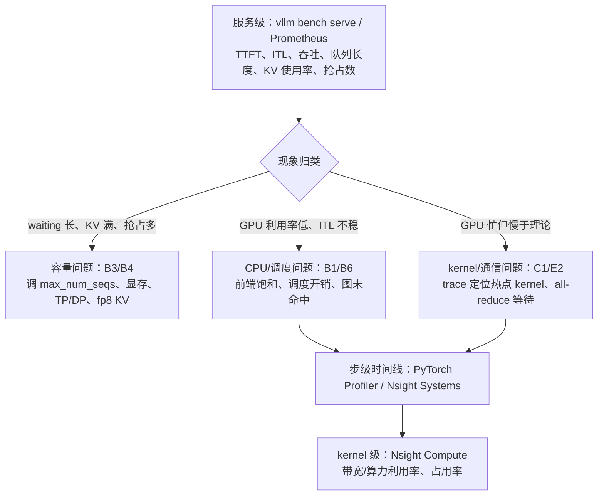
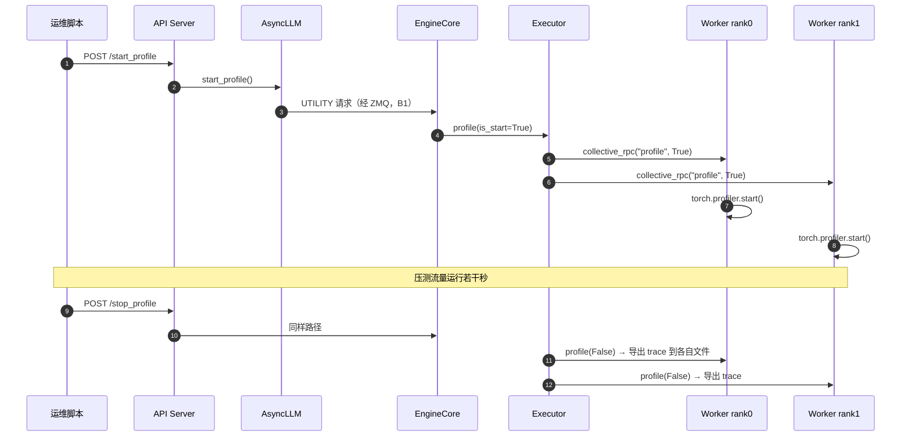

# F2 · 性能分析与瓶颈定位（深度版）

> **版本**：vLLM 0.30.x（V1 引擎）｜**模块**：F-高级特性与性能｜**对应原课**：第 18 课（原课仅有 Profiler 与 Nsight 两条线，本版补全方法论、指标体系、瓶颈清单与 trace 解读）
> **导航**：上一课：[F1-采样与投机解码] → **本课 F2** → 下一课：[F3-PD分离]
> **练习**：`exercises/F2_profiler_checklist`｜**源码标注**：profiler 的开启方式在近版本中有调整，标【待核】处以 0.30.x tag 为准。

## 0. 先修与本课目标

先修：A1（`vllm bench`）、B6（一步推理的 CPU/GPU 拆账）、C1（roofline）、C2（CUDA Graph 与 padding）、E2（TP 通信量）。

学完本课你应能：

1. 用"自顶向下"的方法定位瓶颈：先看服务级指标，再看步级时间线，最后看 kernel；
2. 读懂 vLLM 的 Prometheus 指标，并把 TTFT、ITL 的异常对应到调度、显存、计算或通信问题；
3. 用 `vllm bench` 系列工具做可复现的压测，正确选择数据集与请求速率；
4. 用 PyTorch Profiler 与 Nsight Systems 采集 trace，并能在时间线上识别 CPU 空泡、通信等待、eager 回退、padding 浪费；
5. 用 roofline 估算的"理论下界"判断优化空间。

---


本课是模块 F 的方法论枢纽：前面所有课程中出现的"数字例子"——KV 容量、通信量、padding 浪费、接受长度——在这里都变成了可以测量和验证的指标。建议学完本课后，挑选前面任意一课的数字例子，在真实环境中测一次，看看理论估算与实测相差多少，以及差距来自哪里。

## 1. 方法论：先测量、再假设、后验证

性能优化最常见的失败模式是"凭感觉改参数"。正确的流程是一个闭环：

1. **定义目标与工作点**：优化的是吞吐、TTFT 还是 ITL？负载是多少并发、什么输入输出长度？没有工作点的性能数字没有意义。
2. **建立基线**：固定版本、配置、数据集与随机种子，测出基线，记录 P50/P90/P99 而不只是平均值。
3. **自顶向下定位**：服务指标 → 步级时间线 → kernel 级。
4. **形成假设并估算上限**：例如"decode 是读权重瓶颈，理论下界 4.8 ms，实测 9 ms，差距在哪里？"
5. **一次只改一个变量**并复测。



## 2. 服务级：指标与压测

**Prometheus 指标**（`/metrics` 端点，常用项）：

| 指标 | 含义 | 异常时指向 |
|---|---|---|
| `vllm:num_requests_running` / `vllm:num_requests_waiting` | 运行中 / 排队请求数 | waiting 持续 > 0：容量不足或 `max_num_seqs` 太小 |
| `vllm:kv_cache_usage_perc` | KV 块使用率 | 接近 100%：KV 不足，可能伴随抢占 |
| `vllm:num_preemptions_total` | 抢占累计 | 持续增长：KV 不足或并发过高（B3） |
| `vllm:time_to_first_token_seconds` | TTFT 直方图 | 排队 + prefill |
| `vllm:inter_token_latency_seconds` | ITL 直方图 | 步长；混入 prefill 时尖刺 |
| `vllm:e2e_request_latency_seconds` | 端到端延迟 | |
| `vllm:prefix_cache_queries` / `vllm:prefix_cache_hits` | 前缀缓存查询/命中 token 数 | 命中率低：prompt 结构问题（B4） |
| 投机解码接受数相关指标 | 接受长度 | F1 |

【待核：0.30.x 中各指标的确切名称，旧版本中 KV 使用率为 `gpu_cache_usage_perc`、ITL 为 `time_per_output_token_seconds`】

**压测工具**：`vllm bench serve`（对在线服务压测）、`vllm bench throughput`（离线吞吐）、`vllm bench latency`（单批次延迟）。要点：

- **数据集**：random 数据集可精确控制输入/输出长度，适合定位；真实分布（如 ShareGPT 类对话数据）适合评估；前缀缓存相关测试要用带共享前缀的数据集。
- **请求速率**：`--request-rate` 为泊松到达速率，`--max-concurrency` 限制并发。只用 `inf`（一次性全部发出）测得的是最大吞吐，不代表线上延迟。应该扫描多个速率画出"吞吐-延迟曲线"。
- **预热**：首批请求包含编译、图捕获后的首次运行，应剔除或单独统计。

**数字例子：读懂一条吞吐-延迟曲线**。8B 模型、单卡 H100、输入 1 024、输出 256：速率 2 req/s 时 TTFT P50 约 40 ms、ITL 约 9 ms；8 req/s 时 TTFT 60 ms、ITL 14 ms；16 req/s 时 TTFT 骤增到 2 s、waiting 持续不为 0。说明拐点在 8～16 req/s 之间。拐点之前，延迟主要由步长决定；拐点之后，延迟由排队决定，此时调任何 kernel 都无济于事，只能加容量或减少每请求的资源占用。

## 3. 步级：PyTorch Profiler

vLLM 内置了对 PyTorch Profiler 的支持：设置 trace 输出目录后启动服务，通过 HTTP 接口 `/start_profile` 与 `/stop_profile`（离线时 `llm.start_profile()` / `llm.stop_profile()`）控制采集区间，每个 Worker rank 写出各自的 trace 文件，可用 Perfetto（ui.perfetto.dev）或 TensorBoard 打开。

```bash
# 旧版本方式：环境变量指定目录【待核：0.30.x 可能改为 --profiler-config】
VLLM_TORCH_PROFILER_DIR=/tmp/vllm_trace vllm serve Qwen/Qwen3-8B
curl -X POST localhost:8000/start_profile
vllm bench serve --model Qwen/Qwen3-8B --dataset-name random --num-prompts 50 ...
curl -X POST localhost:8000/stop_profile
```

源码位置：`vllm/v1/worker/gpu_worker.py` 中 `Worker.profile(is_start)`，Worker 初始化时根据配置创建 `torch.profiler.profile` 对象；EngineCore 通过 `collective_rpc("profile", ...)` 通知所有 rank（B2）。

**在 trace 中要找的东西**：

1. **步与步之间的 GPU 空白**：CPU 的调度、准备输入、采样同步占用的时间。若空白占比超过 15%，考虑异步调度、减少 logits processor、检查前端是否饱和。
2. **大量细碎 kernel 且间隙明显**：说明未命中 CUDA Graph（eager 回退），对照 C2 检查 batch 是否超过最大捕获尺寸。
3. **`nccl` 或 all-reduce kernel 占比**：TP 通信占比，结合 E2 的估算判断是否合理；若某个 rank 的 all-reduce 特别长，说明它在等待其他 rank（其他 rank 更慢）。
4. **注意力 kernel 时间随上下文增长**：长上下文 decode 的 KV 读取（B6 第 5.6 节）。
5. **GEMM 时间**：与理论值对比。

## 3.5 profile 指令如何穿过多个进程



这张时序图有两个实用含义。第一，profiler 运行在 **Worker 进程**中，因此 trace 里看到的是 GPU kernel 与 Worker 侧的 CPU 活动（准备输入、采样等），**看不到** EngineCore 的调度与前端的 detokenize。要分析这两者，需要用 py-spy 对 EngineCore 与前端进程采样（B1 第 7.6 节），或使用 Nsight Systems 同时追踪全部进程。第二，start/stop 是一个跨进程的控制消息，从发出到所有 rank 真正开始采集有一定延迟，所以采集区间的头尾会有不完整的步，分析时应只看中间的稳定部分。

## 4. 系统级：Nsight Systems

Nsight Systems 能同时看到 CPU 线程、CUDA API、kernel、内存拷贝、NVTX 标记，适合分析 CPU 与 GPU 的交互以及多进程问题：

```bash
nsys profile -o vllm_report --trace=cuda,nvtx,osrt \
  --trace-fork-before-exec=true --cuda-graph-trace=node \
  --delay 60 --duration 20 \
  vllm serve Qwen/Qwen3-8B
```

要点：`--trace-fork-before-exec` 才能追踪到 Worker 子进程；`--cuda-graph-trace=node` 展开 CUDA Graph 内部的 kernel，否则只能看到一个整体的图启动；用 `--delay` 跳过启动阶段。也可以配合 CUDA profiler API 只采集指定区间（vLLM 提供相应开关）【待核】。在 Nsight 中特别容易看清的问题有：Python GIL 竞争导致的线程阻塞、主机到设备拷贝是否与计算重叠、不同 rank 进程的步调是否一致。

## 5. 理论下界：判断还有多少优化空间

**decode 下界**（访存受限）：每步至少读一次权重 + 本批次全部 KV。8B 模型 bf16、batch 32、平均上下文 1 000：权重 16 GB，KV 32 × 1 000 × 128 KiB ≈ 3.9 GiB，合计约 20.2 GB，在 3.35 TB/s 下约 6 ms。若实测步长 9 ms，效率约 67%，差距来自 kernel 未跑满带宽、CPU 空泡与通信；若实测 6.5 ms，已接近极限，继续优化 kernel 意义不大，应考虑量化（减字节）或投机解码（一次读多产出）。

**prefill 下界**（计算受限）：每 token 约 2 × 参数量 FLOPs（不含注意力）。8B 模型 8 192 token：2 × 8 × 10⁹ × 8 192 ≈ 131 TFLOP，H100 bf16 稠密峰值约 989 TFLOPS，下界约 133 ms；实际 MFU 能到 50%～70%，即 190～270 ms。长 prompt 时还要加上注意力的二次项。

**用下界做决策**：下界给出"这一类优化最多能带来多少收益"，避免在已经接近极限的地方浪费时间。


## 5.5 三个工具各自回答什么问题

初学者常把各种工具混用，结果数据很多却得不出结论。建议按"问题"选工具：**服务指标与压测**回答"有没有问题、问题有多大、在什么负载下出现"，这是唯一能直接对应用户体验的层次；**PyTorch Profiler** 回答"一步之内 GPU 时间花在哪些算子上、步与步之间是否有空白"，它与 PyTorch 算子名对应，最适合定位模型内部的热点；**Nsight Systems** 回答"多个进程、多个线程、CPU 与 GPU 之间如何交互"，最适合分析调度开销、同步等待与多 rank 步调；**Nsight Compute** 回答"某一个 kernel 为什么慢"，给出带宽利用率、占用率、指令瓶颈等细节，只在已经锁定具体 kernel 后使用。按照从上到下的顺序使用这些工具，每一层都只回答一个问题，再决定是否需要下一层。

## 6. 瓶颈清单（症状 → 原因 → 对策）

| 症状 | 可能原因 | 对策 / 参考课 |
|---|---|---|
| TTFT 高、waiting 长、KV 使用率高 | KV 容量不足 | 降 `max_model_len`、fp8 KV、加卡（B4、D2、E1） |
| TTFT 高、GPU 不忙 | 前端 tokenize 慢或事件循环阻塞 | 多 API Server、检查自定义处理器（B1） |
| ITL 周期性尖刺 | 长 prompt 混入 decode 步 | 调小 `max_num_batched_tokens`、`long_prefill_token_threshold`，或 PD 分离（B3、F3） |
| 高并发下 ITL 突增 | 超过最大 CUDA Graph 尺寸 | 增大捕获上限（C2） |
| 吞吐随并发上升而下降 | 抢占风暴 | 降 `max_num_seqs`（B3） |
| 多卡比单卡更慢 | 无 NVLink 下 TP 通信过重 | 减 TP、改 PP 或 DP（E2） |
| MoE 层某些卡耗时长 | 专家负载不均 | EPLB（E4） |
| 首次请求极慢 | 编译/JIT 未预热 | 使用编译缓存、预热（C3） |
| 前缀缓存命中率低 | 动态内容在 prompt 前部 | 调整 prompt 结构（B4） |

## 6.5 把 trace 现象映射回源码

在时间线上看到异常之后，下一步是把它映射回源码中的具体位置，才能动手修改。几个常见的映射关系：步与步之间的 CPU 空白，对应 Worker 中的 `_update_states`、`_prepare_inputs`、采样后的结果拷贝与同步（B6 第 4 节），以及 EngineCore 中的 `schedule` 与 `update_from_output`；如果空白中有明显的 `cudaMemcpy` 或 `cudaStreamSynchronize`，说明有某处把 GPU 结果拉回 CPU 并等待，常见于 logprobs 计算、停止条件判断或自定义处理器。在一步之内，若看到同一个层的 kernel 序列重复出现且间隔均匀、没有 CUDA Graph 启动标记，说明当前批次走了 eager 路径（C2）；若看到 Inductor 生成的 `triton_` 前缀 kernel，说明编译融合生效（C3）；若注意力 kernel 的耗时在不同步之间差异巨大，往往是批次中混入了长 prefill。

另一个实用技巧是使用 NVTX 标记：vLLM 在部分关键路径上添加了标记区间，自己调试时也可以在怀疑的函数周围临时加上 `torch.cuda.nvtx.range_push/range_pop`，在 Nsight Systems 中就能看到这些函数在时间线上的精确位置与耗时。这比在代码中到处打印时间戳更准确，因为它能与 GPU 活动对齐显示。

最后，所有分析结论都应回到第 1 节的闭环中验证：改动之后在同一工作点复测服务级指标，确认改善真实存在，并更新基线。没有复测的优化只是猜测。

## 7. 一次完整的定位示例

**现象**：8B 模型 TP=2，压测 64 并发时 ITL P50 为 22 ms，预期约 12 ms。

1. 服务指标：waiting 为 0、KV 使用率 40%、无抢占 → 排除容量问题。
2. PyTorch trace：每步 GPU 活动约 11 ms，步与步之间空白约 9 ms → CPU 侧问题。
3. 放大空白：发现 Worker 在一个 logits processor 中逐请求做 Python 循环（自定义插件），64 个请求约 8 ms。
4. 对策：改为批量化实现后空白降到约 1.5 ms，ITL P50 降到 13 ms。
5. 复测并记录：更新基线。

这个例子说明，**大部分"GPU 推理慢"的问题，第一步要先确认 GPU 到底忙不忙**。

## 8. 常见坑 / 故障模式

1. **profiler 开销扭曲结果**：开启 profiler（尤其记录调用栈、形状时）会显著拖慢 CPU 侧，只用于定位比例与时间线，不用于报告绝对性能。
2. **采集区间包含预热**：编译与图捕获后的首次运行混在 trace 中，得出错误结论。
3. **只看 rank 0**：TP 下慢的可能是其他 rank，所有 rank 的 trace 都要看。
4. **只看平均值**：P99 问题常被平均值掩盖，务必看分位数。
5. **CUDA Graph 下 kernel 不可见**：Nsight 未加 `--cuda-graph-trace=node` 时只看到图启动，误以为 GPU 空闲。
6. **压测客户端成为瓶颈**：单进程客户端在极高 QPS 下自身饱和，测得的是客户端上限。

## 9. 动手练习

- 目录：`exercises/F2_profiler_checklist`
- 任务：实现 `validate_profiler_report(report) -> (ok, problems)`：必须包含 `trace_path`、`device`、`num_steps`、`avg_latency_ms`、`framework` 五个字段（缺失记为 `missing:<字段>`）；`num_steps` 必须 > 0；`avg_latency_ms` 必须 ≥ 0；`framework` 必须是 pytorch / nsight / vllm 之一（不区分大小写）；返回全部问题而不是第一个。
- 运行：

```bash
python -m pytest exercises/F2_profiler_checklist -q
```

- 进阶 1：扩展报告格式，加入 `gpu_busy_ratio`（GPU 活动时间 / 总时间）与 `theoretical_floor_ms`（按第 5 节公式估算的下界），并实现 `diagnose(report)`：`gpu_busy_ratio < 0.8` 时返回"CPU 瓶颈"，实测与下界之比 < 1.2 时返回"接近极限"。
- 进阶 2：写一个脚本解析 PyTorch Profiler 导出的 Chrome trace JSON，统计每步之间的 GPU 空白时间，并输出符合本练习格式的报告。

## 10. 自测清单

- [ ] 我能根据服务指标把一个性能问题归入容量、CPU/调度、kernel/通信三类之一
- [ ] 我能用 PyTorch Profiler 或 Nsight Systems 采集多 rank trace，并在时间线上找出 CPU 空泡与图回退
- [ ] 我能手算 decode 与 prefill 的理论下界，并据此判断优化空间

## 11. 延伸阅读

- vLLM 文档：Profiling vLLM、Metrics、Benchmark CLI
- PyTorch Profiler 文档；Perfetto UI 使用指南；NVIDIA Nsight Systems / Nsight Compute 用户指南
- 论文/博客：Roofline 模型；LLM 推理性能工程相关文章
