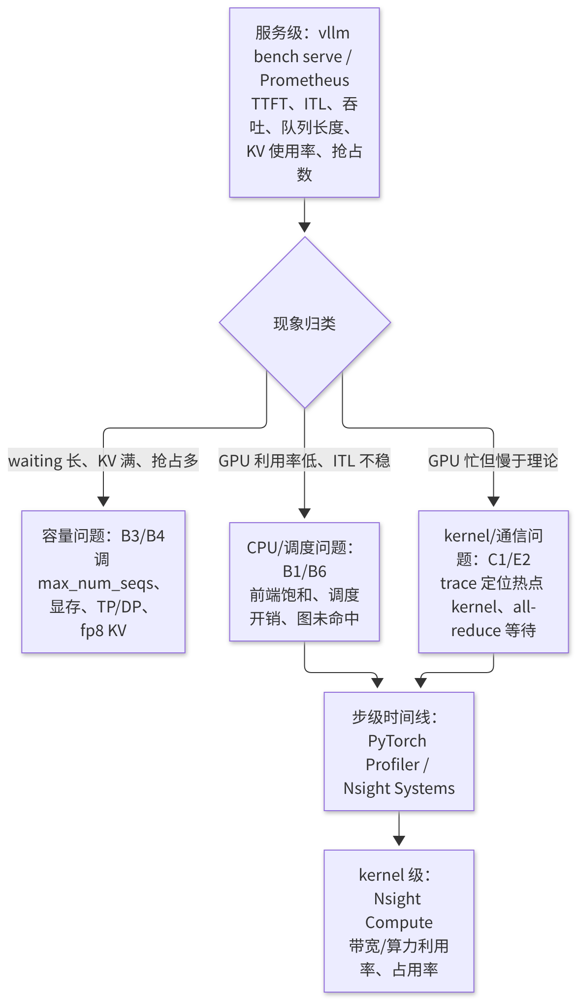
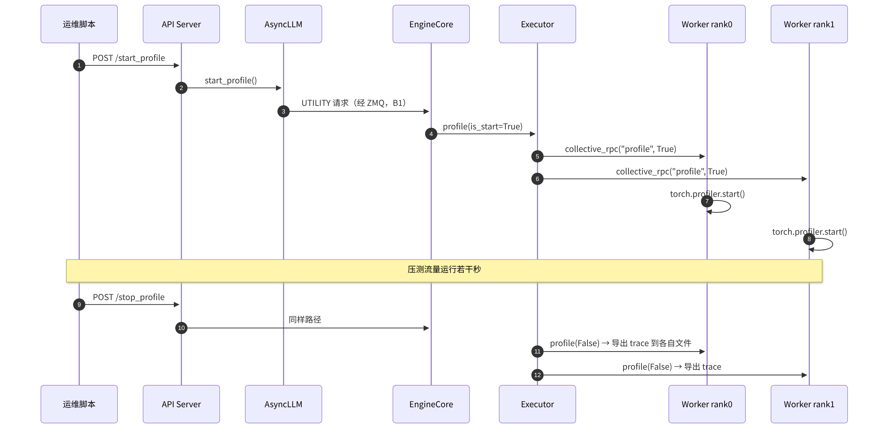

# F2 · 性能分析与瓶颈定位

> **版本**：vLLM 0.30.x（V1 引擎）｜**模块**：F-高级特性与性能｜**对应原课**：第 18 课（原课仅涵盖 Profiler 与 Nsight 两部分；本版补充了方法论、指标体系、瓶颈清单与 trace 解读）
> **导航**：上一课：[F1-采样与投机解码] → **本课 F2** → 下一课：[F3-PD分离]
> **练习**：`exercises/F2_profiler_checklist`｜**源码标注**：profiler 的启用方式在近期版本中有所调整，文中涉及的源码路径、符号与参数已对照 vLLM v0.30.0 tag 的源码核实。

## 0. 先修要求与学习目标

先修要求：A1（`vllm bench`）、B6（单步推理中 CPU/GPU 耗时的分解）、C1（roofline）、C2（CUDA Graph 与 padding）、E2（TP 通信量）。

完成本课学习后，学习者应能够：

1. 按照"自顶向下"的方法定位瓶颈：首先考察服务级指标，其次考察步级时间线，最后考察 kernel；
2. 解读 vLLM 的 Prometheus 指标，并将首词元时延（TTFT）、词元间时延（ITL）的异常对应到调度、显存、计算或通信问题；
3. 使用 `vllm bench` 系列工具开展可复现的压测，并正确选择数据集与请求速率；
4. 使用 PyTorch Profiler 与 Nsight Systems 采集 trace，并在时间线上识别 CPU 空泡、通信等待、eager 回退与 padding 浪费；
5. 依据 roofline 估算的"理论下界"判断剩余的优化空间。

---


本课是模块 F 的方法论枢纽：此前各课中出现的数值示例——KV 容量、通信量、padding 浪费、接受长度——在本课中均转化为可测量、可验证的指标。建议在完成本课后，任选此前某一课的数值示例，在真实环境中进行一次测量，比较理论估算与实测结果的差距，并分析差距的来源。

## 1. 方法论：先测量、再假设、后验证

性能优化中最常见的失败模式是"依据直觉调整参数"。正确的流程是一个闭环：

1. **定义目标与工作点**：优化目标是吞吐量、TTFT 还是 ITL？负载的并发数是多少，输入与输出长度如何？脱离工作点的性能数据不具有意义。
2. **建立基线**：固定版本、配置、数据集与随机种子，测出基线，并记录 P50/P90/P99，而不仅是平均值。
3. **自顶向下定位**：服务指标 → 步级时间线 → kernel 级。
4. **形成假设并估算上限**：例如"解码（Decode）受限于权重读取，理论下界为 4.8 ms，实测为 9 ms，差距来自何处？"
5. **每次仅改变一个变量**，并重新测量。



<p align="center"><em>图1：性能分析方法论：先测量、再假设、后验证</em></p>

## 2. 服务级：指标与压测

**Prometheus 指标**（`/metrics` 端点，常用项）：

| 指标 | 含义 | 异常时的指向 |
|---|---|---|
| `vllm:num_requests_running` / `vllm:num_requests_waiting` | 运行中 / 排队中的请求数 | waiting 持续大于 0：容量不足或 `max_num_seqs` 过小 |
| `vllm:kv_cache_usage_perc` | KV 块使用率 | 接近 100%：KV 不足，可能伴随抢占 |
| `vllm:num_preemptions_total` | 抢占累计次数 | 持续增长：KV 不足或并发过高（B3） |
| `vllm:time_to_first_token_seconds` | TTFT 直方图 | 排队 + prefill |
| `vllm:inter_token_latency_seconds` | ITL 直方图 | 步长；混入 prefill 时出现尖峰 |
| `vllm:e2e_request_latency_seconds` | 端到端时延 | |
| `vllm:prefix_cache_queries` / `vllm:prefix_cache_hits` | 前缀缓存查询/命中的 token 数 | 命中率低：prompt 结构存在问题（B4） |
| 投机解码接受数相关指标 | 接受长度 | F1 |

上表指标名已对照 v0.30.0 源码（`vllm/v1/metrics/loggers.py`）核实。旧版本中的 `vllm:gpu_cache_usage_perc` 与 `vllm:time_per_output_token_seconds` 在 v0.30.0 中已不存在，分别对应 `vllm:kv_cache_usage_perc` 与 `vllm:inter_token_latency_seconds`；Counter 类型指标在 `/metrics` 输出中带有 `_total` 后缀（如 `vllm:prefix_cache_queries_total`）。投机解码相关指标为 `vllm:spec_decode_num_drafts_total`、`vllm:spec_decode_num_draft_tokens_total` 与 `vllm:spec_decode_num_accepted_tokens_total`。

**压测工具**：`vllm bench serve`（针对在线服务的压测）、`vllm bench throughput`（离线吞吐量）、`vllm bench latency`（单批次时延）。要点如下：

- **数据集**：random 数据集可精确控制输入/输出长度，适用于问题定位；真实分布（如 ShareGPT 类对话数据）适用于效果评估；与前缀缓存相关的测试须使用带共享前缀的数据集。
- **请求速率**：`--request-rate` 为泊松到达速率，`--max-concurrency` 用于限制并发数。若仅以 `inf`（一次性发出全部请求）进行测试，所得结果为最大吞吐量，不能代表线上时延。应扫描多个速率，绘制"吞吐量-时延曲线"。
- **预热**：首批请求包含编译以及图捕获后的首次运行，应予以剔除或单独统计。

**数值示例：吞吐量-时延曲线的解读**。8B 模型、单卡 H100、输入 1 024、输出 256：速率为 2 req/s 时，TTFT P50 约为 40 ms，ITL 约为 9 ms；8 req/s 时，TTFT 为 60 ms，ITL 为 14 ms；16 req/s 时，TTFT 骤增至 2 s，waiting 持续不为 0。由此可知拐点位于 8～16 req/s 之间。在拐点之前，时延主要由步长决定；在拐点之后，时延由排队决定，此时对任何 kernel 的调优均无效，只能增加容量或减少每个请求的资源占用。

## 3. 步级：PyTorch Profiler

vLLM 内置对 PyTorch Profiler 的支持：设置 trace 输出目录后启动服务，通过 HTTP 接口 `/start_profile` 与 `/stop_profile`（离线场景下为 `llm.start_profile()` / `llm.stop_profile()`）控制采集区间；每个 Worker rank 分别写出各自的 trace 文件，可使用 Perfetto（ui.perfetto.dev）或 TensorBoard 打开。

```bash
# v0.30.0：以 --profiler-config 指定 profiler 类型与 trace 目录（旧版本的环境变量 VLLM_TORCH_PROFILER_DIR 已移除）
vllm serve Qwen/Qwen3-8B --profiler-config '{"profiler": "torch", "torch_profiler_dir": "/tmp/vllm_trace"}'
curl -X POST localhost:8000/start_profile
vllm bench serve --model Qwen/Qwen3-8B --dataset-name random --num-prompts 50 ...
curl -X POST localhost:8000/stop_profile
```

源码位置：`vllm/v1/worker/gpu_worker.py` 中的 `Worker.profile(is_start)`；Worker 初始化时根据配置创建 `torch.profiler.profile` 对象；EngineCore 通过 `collective_rpc("profile", ...)` 通知所有 rank（B2）。

**在 trace 中应重点考察的内容**：

1. **步与步之间的 GPU 空白**：即 CPU 进行调度、准备输入、采样同步所占用的时间。若空白占比超过 15%，应考虑异步调度、减少 logits processor，并检查前端是否已饱和。
2. **大量细碎的 kernel 且间隙明显**：表明未命中 CUDA Graph（eager 回退），应对照 C2 检查 batch 是否超过最大捕获尺寸。
3. **`nccl` 或 all-reduce kernel 的占比**：即 TP 通信的占比，应结合 E2 的估算判断其是否合理；若某个 rank 的 all-reduce 耗时特别长，表明该 rank 在等待其他 rank（即其他 rank 更慢）。
4. **注意力 kernel 的耗时随上下文增长**：对应长上下文 decode 的 KV 读取（B6 第 5.6 节）。
5. **GEMM 耗时**：应与理论值进行对比。

## 3.5 profile 指令在多个进程间的传递



<p align="center"><em>图2：profile 指令跨越多个进程到达 Worker 的过程</em></p>

该时序图具有两方面的实际意义。第一，profiler 运行于 **Worker 进程**中，因此 trace 中呈现的是 GPU kernel 与 Worker 侧的 CPU 活动（准备输入、采样等），**不包含** EngineCore 的调度与前端的 detokenize。若需分析这两部分，应使用 py-spy 对 EngineCore 与前端进程进行采样（B1 第 7.6 节），或使用 Nsight Systems 同时追踪全部进程。第二，start/stop 是一条跨进程的控制消息，从发出到所有 rank 实际开始采集存在一定延迟，因此采集区间的首尾会包含不完整的步，分析时应仅考察中间的稳定部分。

## 4. 系统级：Nsight Systems

Nsight Systems 可同时呈现 CPU 线程、CUDA API、kernel、内存拷贝与 NVTX 标记，适用于分析 CPU 与 GPU 之间的交互以及多进程问题：

```bash
nsys profile -o vllm_report --trace=cuda,nvtx,osrt \
  --trace-fork-before-exec=true --cuda-graph-trace=node \
  --delay 60 --duration 20 \
  vllm serve Qwen/Qwen3-8B
```

要点：须使用 `--trace-fork-before-exec` 方能追踪 Worker 子进程；`--cuda-graph-trace=node` 用于展开 CUDA Graph 内部的 kernel，否则仅能看到一次整体的图启动；使用 `--delay` 跳过启动阶段。也可配合 CUDA profiler API 仅采集指定区间：以 `nsys profile --capture-range=cudaProfilerApi --capture-range-end repeat` 启动，并为 vLLM 设置 `--profiler-config.profiler cuda`，随后由 `/start_profile` 与 `/stop_profile` 控制采集区间（参见 vLLM 文档 `docs/contributing/profiling.md`）。在 Nsight 中尤其易于识别的问题包括：Python GIL 竞争导致的线程阻塞、主机到设备的拷贝是否与计算重叠，以及不同 rank 进程的步调是否一致。

## 5. 理论下界：评估剩余的优化空间

**decode 下界**（访存受限）：每步至少读取一次权重以及本批次的全部 KV。8B 模型 bf16、batch 32、平均上下文 1 000：权重 16 GB，KV 32 × 1 000 × 128 KiB ≈ 3.9 GiB，合计约 20.2 GB，在 3.35 TB/s 带宽下约需 6 ms。若实测步长为 9 ms，则效率约为 67%，差距来自 kernel 未充分利用带宽、CPU 空泡与通信；若实测为 6.5 ms，则已接近极限，继续优化 kernel 的意义有限，应考虑量化（减少字节数）或投机解码（一次读取产出多个 token）。

**prefill 下界**（计算受限）：每个 token 约需 2 × 参数量 FLOPs（不含注意力）。8B 模型、8 192 个 token：2 × 8 × 10⁹ × 8 192 ≈ 131 TFLOP；H100 bf16 稠密峰值约为 989 TFLOPS，下界约为 133 ms；实际 MFU 可达 50%～70%，即 190～270 ms。对于长 prompt，还须计入注意力的二次项。

**基于下界进行决策**：下界给出了"此类优化最多能够带来的收益"，可避免在已接近极限之处投入无效的工作。


## 5.5 各工具所对应的问题

初学者常将各类工具混合使用，导致数据量很大却无法得出结论。建议依据"所要回答的问题"选择工具：**服务指标与压测**回答"是否存在问题、问题的严重程度、在何种负载下出现"，这是唯一能够直接对应用户体验的层次；**PyTorch Profiler** 回答"一步之内 GPU 时间消耗在哪些算子上、步与步之间是否存在空白"，其结果与 PyTorch 算子名称对应，最适用于定位模型内部的热点；**Nsight Systems** 回答"多个进程、多个线程以及 CPU 与 GPU 之间如何交互"，最适用于分析调度开销、同步等待与多 rank 步调；**Nsight Compute** 回答"某一特定 kernel 为何缓慢"，给出带宽利用率、占用率、指令瓶颈等细节，仅应在已锁定具体 kernel 之后使用。应按照自上而下的顺序使用这些工具，每一层只回答一个问题，再决定是否需要进入下一层。

## 6. 瓶颈清单（症状 → 原因 → 对策）

| 症状 | 可能原因 | 对策 / 参考课 |
|---|---|---|
| TTFT 高、waiting 长、KV 使用率高 | KV 容量不足 | 降低 `max_model_len`、使用 fp8 KV、增加 GPU（B4、D2、E1） |
| TTFT 高、GPU 负载不高 | 前端 tokenize 缓慢或事件循环阻塞 | 部署多个 API Server，检查自定义处理器（B1） |
| ITL 周期性出现尖峰 | 长 prompt 混入 decode 步 | 调小 `max_num_batched_tokens`、`long_prefill_token_threshold`，或采用 PD 分离（B3、F3） |
| 高并发下 ITL 突增 | 超过最大 CUDA Graph 尺寸 | 增大捕获上限（C2） |
| 吞吐量随并发上升而下降 | 频繁抢占（抢占风暴） | 降低 `max_num_seqs`（B3） |
| 多卡比单卡更慢 | 无 NVLink 时 TP 通信负担过重 | 减小 TP，改用 PP 或 DP（E2） |
| MoE 层部分 GPU 耗时较长 | 专家负载不均衡 | EPLB（E4） |
| 首次请求极慢 | 编译/JIT 未预热 | 使用编译缓存并进行预热（C3） |
| 前缀缓存命中率低 | 动态内容位于 prompt 前部 | 调整 prompt 结构（B4） |

## 6.5 将 trace 现象映射回源码

在时间线上发现异常之后，下一步须将其映射到源码中的具体位置，方可着手修改。常见的映射关系如下：步与步之间的 CPU 空白，对应 Worker 中的 `_update_states`、`_prepare_inputs`、采样后的结果拷贝与同步（B6 第 4 节），以及 EngineCore 中的 `schedule` 与 `update_from_output`；若空白中存在明显的 `cudaMemcpy` 或 `cudaStreamSynchronize`，表明某处将 GPU 结果拷回 CPU 并进行等待，常见于 logprobs 计算、停止条件判断或自定义处理器。在一步之内，若同一层的 kernel 序列重复出现、间隔均匀且没有 CUDA Graph 启动标记，表明当前批次执行的是 eager 路径（C2）；若出现 Inductor 生成的以 `triton_` 为前缀的 kernel，表明编译融合已生效（C3）；若注意力 kernel 的耗时在不同步之间差异极大，通常是因为批次中混入了长 prefill。

另一项实用技巧是使用 NVTX 标记：vLLM 在部分关键路径上添加了标记区间；调试时也可在可疑函数周围临时添加 `torch.cuda.nvtx.range_push/range_pop`，从而在 Nsight Systems 中观察这些函数在时间线上的精确位置与耗时。该方法比在代码中大量打印时间戳更为准确，因为其结果能够与 GPU 活动对齐显示。

最后，所有分析结论均应回到第 1 节所述的闭环中加以验证：完成修改后，在同一工作点重新测量服务级指标，确认改善确实存在，并更新基线。未经复测的优化仅是推测。

## 7. 完整的定位示例

**现象**：8B 模型、TP=2，在 64 并发下压测时，ITL P50 为 22 ms，预期约为 12 ms。

1. 服务指标：waiting 为 0、KV 使用率为 40%、无抢占 → 排除容量问题。
2. PyTorch trace：每步 GPU 活动约 11 ms，步与步之间的空白约 9 ms → 属于 CPU 侧问题。
3. 放大空白区域：发现 Worker 在某个 logits processor（自定义插件）中对每个请求执行 Python 循环，64 个请求共耗时约 8 ms。
4. 对策：改为批量化实现后，空白降至约 1.5 ms，ITL P50 降至 13 ms。
5. 复测并记录：更新基线。

该示例表明，**对于多数"GPU 推理缓慢"的问题，第一步应首先确认 GPU 是否处于繁忙状态**。

## 8. 常见问题与故障模式

1. **profiler 开销导致结果失真**：启用 profiler（尤其是记录调用栈与形状时）会显著降低 CPU 侧的速度，因此其结果仅用于定位比例与分析时间线，不应用于报告绝对性能。
2. **采集区间包含预热阶段**：编译与图捕获后的首次运行混入 trace，将导致错误的结论。
3. **仅考察 rank 0**：在 TP 下，较慢的可能是其他 rank，因此须考察所有 rank 的 trace。
4. **仅考察平均值**：P99 问题常被平均值掩盖，必须考察分位数。
5. **CUDA Graph 下 kernel 不可见**：Nsight 未添加 `--cuda-graph-trace=node` 时仅显示图启动，易被误判为 GPU 空闲。
6. **压测客户端成为瓶颈**：单进程客户端在极高 QPS 下自身即已饱和，此时测得的是客户端的上限。

## 9. 实践练习

- 目录：`exercises/F2_profiler_checklist`
- 任务：实现 `validate_profiler_report(report) -> (ok, problems)`：报告必须包含 `trace_path`、`device`、`num_steps`、`avg_latency_ms`、`framework` 五个字段（缺失时记为 `missing:<字段>`）；`num_steps` 必须大于 0；`avg_latency_ms` 必须大于或等于 0；`framework` 必须为 pytorch / nsight / vllm 之一（不区分大小写）；须返回全部问题，而非仅返回第一个问题。
- 运行方式：

```bash
python -m pytest exercises/F2_profiler_checklist -q
```

- 验收标准：上述测试全部通过。
- 进阶任务 1：扩展报告格式，加入 `gpu_busy_ratio`（GPU 活动时间 / 总时间）与 `theoretical_floor_ms`（按第 5 节公式估算的下界），并实现 `diagnose(report)`：当 `gpu_busy_ratio < 0.8` 时返回"CPU 瓶颈"；当实测值与下界之比小于 1.2 时返回"接近极限"。
- 进阶任务 2：编写脚本，解析 PyTorch Profiler 导出的 Chrome trace JSON，统计每两步之间的 GPU 空白时间，并输出符合本练习格式的报告。

## 10. 自测题

- [ ] 能否依据服务指标，将一个性能问题归入容量、CPU/调度、kernel/通信三类中的一类
- [ ] 能否使用 PyTorch Profiler 或 Nsight Systems 采集多 rank 的 trace，并在时间线上找出 CPU 空泡与图回退
- [ ] 能否手工计算 decode 与 prefill 的理论下界，并据此判断优化空间

## 11. 延伸阅读

- vLLM 文档：Profiling vLLM、Metrics、Benchmark CLI
- PyTorch Profiler 文档；Perfetto UI 使用指南；NVIDIA Nsight Systems / Nsight Compute 用户指南
- 论文/博客：Roofline 模型；LLM 推理性能工程相关文章

---

**课程导航**　上一课：[F1 · 采样与投机解码](https://qcngm3vce6yt.feishu.cn/docx/HCfVd3TDLo9JIRx0nRuckXjvnUf)｜下一课：[F3 · PD 分离部署](https://qcngm3vce6yt.feishu.cn/docx/AXNadrgJYoxuwmxYzDAc15lXnpd)｜[返回索引](https://qcngm3vce6yt.feishu.cn/docx/KUn5dKSejoQSAJxaf7YcvNVDnCd)

相关章节：
- [C2 · CUDA Graph](https://qcngm3vce6yt.feishu.cn/docx/HXw7ddUYQo9DaTxs9DzcJDwYnOc)——见本课「0. 先修要求与学习目标」：“C1（roofline）、C2（CUDA Graph 与 padding）”
- [B6 · V1 架构总览与推理主路径](https://qcngm3vce6yt.feishu.cn/docx/FV3gdoLxEo55VtxFlnkc41Lhn6g)——见本课「0. 先修要求与学习目标」：“A1（vllm bench）、B6（单步推理中 CPU/GPU 耗时的分解）”
- [E2 · 张量并行 TP 与流水并行 PP](https://qcngm3vce6yt.feishu.cn/docx/SORgdnCh8ojUyyxzam7cXu7AnMW)——见本课「0. 先修要求与学习目标」：“E2（TP 通信量）。”
