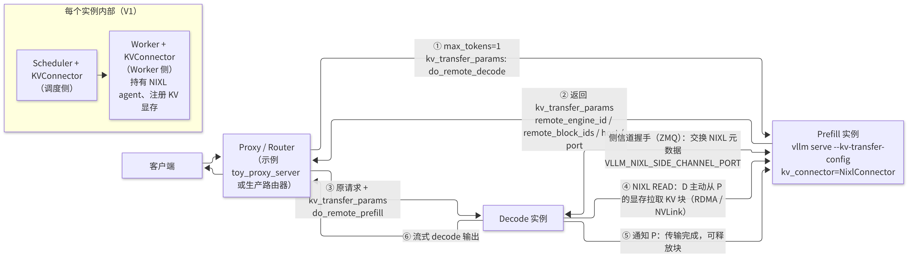
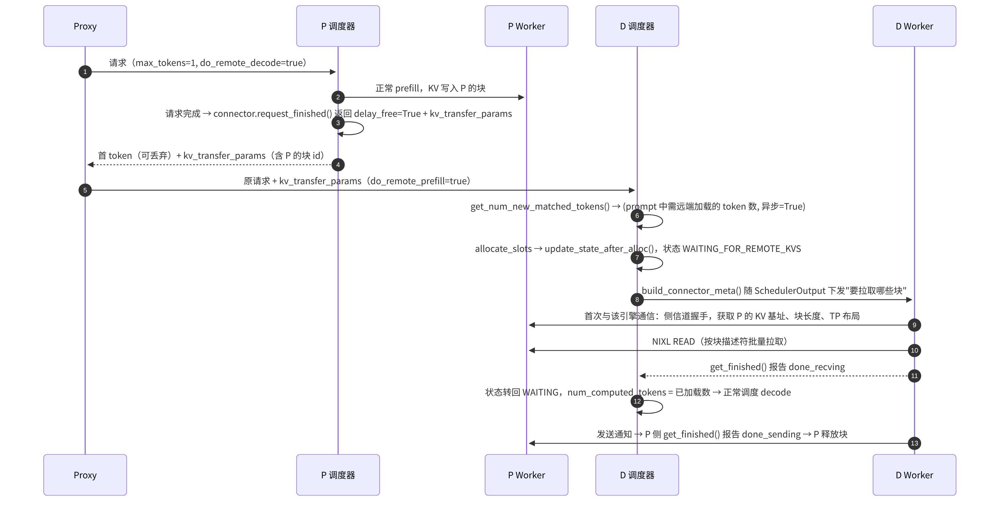
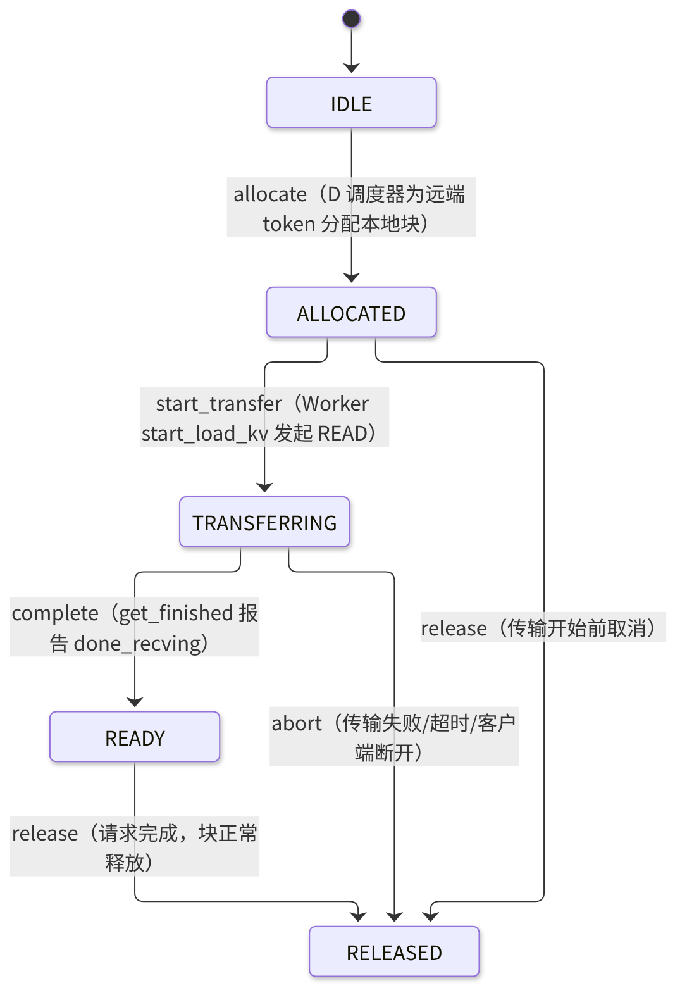

# F3 · PD 分离部署

> **版本**：vLLM 0.30.x（V1 引擎）｜**模块**：F-高级特性与性能｜**对应原课**：第 19 课（以"新精修版"为准；旧版以及 0.17～0.22 时期的历史实现仅作归档，不属于主线内容）
> **导航**：上一课：[F2-性能分析] → **本课 F3** → 下一课：[F4-ModelRunnerV2]
> **练习**：`exercises/F3_kv_state_machine`｜**源码标注**：KV Connector 是 vLLM 中演进最快的子系统之一，标有【待核】之处必须以 0.30.x tag 的源码为准。

## 0. 先修要求与学习目标

先修要求：B3（调度器的 `WAITING_FOR_REMOTE_KVS` 状态、`num_computed_tokens`）、B4（块、块表、延迟释放）、F2（TTFT 与 ITL 的度量）；RDMA 的基本概念（单边读写、内存注册）。

完成本课学习后，学习者应能够：

1. 以首词元时延（TTFT）与词元间时延（ITL）的数值说明将预填充（Prefill）与解码（Decode）分置于不同实例的原因；
2. 绘制 proxy、Prefill 实例、Decode 实例三方之间的请求流转与 KV 流转时序；
3. 按调度侧与 Worker 侧两组方法，复述 `KVConnectorBase_V1` 的接口及其在调度循环中的调用时机；
4. 阐述 `NixlConnector` 的握手、拉取（READ）、通知与延迟释放机制；
5. 手工计算 KV 传输量与传输时间，判断网络是否会成为瓶颈；
6. 使用状态机对单个请求的 KV 传输生命周期进行建模，并处理中止与超时。

---

## 1. 动机：prefill 与 decode 之间的相互干扰

prefill 是计算受限的大块计算，一条 8 000 token 的 prompt 在 8B 模型上约需 150～300 ms；decode 是访存受限的小步计算，每步耗时 10～30 ms。当两者混合运行于同一实例时：

- **prefill 拖慢 decode**：即使采用分块预填充（chunked prefill，B3），每一步混入大量 prefill token 也会使 decode 用户的 ITL 从 15 ms 上升至 40 ms 以上，P99 ITL 难以控制；
- **decode 拖慢 prefill**：大量 decode 请求长期占用 KV 与 batch 名额，新请求排队等待，TTFT 随之上升；
- **最优并行配置不同**：prefill 倾向于更大的 TP（以降低单请求时延）或更多的算力，decode 倾向于更大的 batch 与 KV 容量（更多显存，可能采用 DP），同一实例只能在两者之间折中。

**PD 分离**将两类工作分置于不同实例：P 实例仅执行 prefill，计算完成后将 KV 交给 D 实例，D 实例从第一个 decode 步开始接管请求。该方案将 TTFT 与 ITL 两个目标解耦，使两类实例能够各自独立扩缩容。其代价包括：增加一次 KV 传输、需要一个路由代理，以及系统复杂度显著上升。PD 分离并非在所有情况下均更优——在低负载或短 prompt 场景下，单实例的 chunked prefill 通常更为简单，且性能已经足够。

## 2. 架构图



<p align="center"><em>图1：PD 分离部署架构：P 实例、D 实例与 KV 传输</em></p>

## 3. 端到端时序



<p align="center"><em>图2：PD 分离的端到端请求时序</em></p>

说明如下：

- **由 D 侧"拉取"而非由 P 侧"推送"**：D 在分配好本地块之后才能确定目标地址，因此由 D 发起 READ 最为合理；P 只需"保持相关块不被释放"，直至 D 通知传输完成。
- **最后一个 token 的处理**：与前缀缓存相同，D 至少须对最后一个位置执行一次前向计算才能得到 logits，因此通常仅从远端加载至 prompt 的最后一个完整块或 `len−1` 的位置，剩余部分在 D 本地计算。【待核：0.30.x 中 NixlConnector 对部分块的处理细节】
- **P 的首个 token**：proxy 通常丢弃 P 返回的那个 token，由 D 重新生成第一个输出 token，以保证采样的一致性。

## 4. KVConnector 接口：调度侧与 Worker 侧

`vllm/distributed/kv_transfer/kv_connector/v1/base.py` 中的 `KVConnectorBase_V1` 会被实例化两次：一次位于 EngineCore 的调度器中（角色为 SCHEDULER），一次位于每个 Worker 中（角色为 WORKER）。两侧通过每步随 `SchedulerOutput` 下发的 `KVConnectorMetadata` 进行通信。

**调度侧方法（EngineCore 进程，CPU）**：

1. `get_num_new_matched_tokens(request, num_computed_tokens) -> (int | None, bool)`：返回除本地前缀缓存命中之外，还可从外部加载的 token 数；第二个返回值表示是否异步加载（异步加载时，请求进入 `WAITING_FOR_REMOTE_KVS`）。该方法在 `Scheduler.schedule()` 处理 waiting 请求时被调用（B3 第 4 节）。
2. `update_state_after_alloc(request, blocks, num_external_tokens)`：在本地块分配成功后调用，connector 据此记录"这些本地块需以远端数据填充"。
3. `build_connector_meta(scheduler_output) -> KVConnectorMetadata`：在每步调度结束时调用，将本步需要加载/保存的请求与块信息打包，随 `SchedulerOutput` 发送给 Worker。
4. `request_finished(request, block_ids) -> (bool, dict | None)`：在请求结束时调用。P 侧返回 `True` 表示"延迟释放这些块"，并返回需回传给 proxy 的 `kv_transfer_params`。
5. `update_connector_output(connector_output)`：处理 Worker 回报的完成情况。【待核：方法名】

**Worker 侧方法（Worker 进程，持有 GPU）**：

1. `register_kv_caches(kv_caches)`：在 KV 张量分配完成后调用（B5 第 3 节末尾）；NixlConnector 在此将 KV 显存注册到 NIXL，并启动侧信道监听线程。
2. `start_load_kv(forward_context)`：在前向计算开始前发起加载（NixlConnector 在此发起异步 READ）。
3. `wait_for_layer_load(layer_name)` / `save_kv_layer(layer_name, kv_layer, attn_metadata)`：逐层流水线化加载/保存的钩子（适用于"边计算边保存"的 connector，例如某些存储型 connector）。
4. `wait_for_save()`：在前向计算结束时确保保存已完成。
5. `get_finished(finished_req_ids) -> (done_sending, done_recving)`：返回传输已完成的请求 id 集合，随 `ModelRunnerOutput` 上报给调度器。

**生态中的 connector**（位于 `kv_connector/v1/` 下）：`NixlConnector`（PD 分离的主要实现，基于 NVIDIA NIXL，支持 UCX/RDMA/NVLink）、`P2pNcclConnector`、`LMCacheConnectorV1`（对接 LMCache，常用于 KV 卸载与跨实例共享）、`OffloadingConnector`（CPU 卸载）、`SharedStorageConnector`（用于教学/调试，将 KV 写入磁盘文件）、`MultiConnector`（组合多个 connector）。注册表位于 `kv_connector/factory.py`。【待核：0.30.x 中的完整列表】

## 5. NixlConnector 的关键机制

1. **元数据握手**：D 首次需要从某个 P 引擎拉取数据时，通过 ZMQ 侧信道（端口由 `VLLM_NIXL_SIDE_CHANNEL_PORT` 指定，按 rank 偏移）向 P 请求 `NixlAgentMetadata`，内容包括：引擎 id、NIXL agent 元数据、每层 KV 的基地址、块数、块字节长度、TP 大小、KV 布局等。握手结果会被缓存，后续请求不再重复握手。
2. **描述符**：双方各自将"每层 × 每块"的显存区域预先登记为传输描述符列表；传输时只需提交"源块 id 列表 → 目标块 id 列表"，由 NIXL 生成批量 READ。
3. **异构 TP**：P 与 D 的 TP 可以不同（例如 P 采用 TP=4，D 采用 TP=2）。由于 KV 按注意力头切分在各 rank 上，D 的一个 rank 需要从 P 的多个 rank 分别拉取一部分头。NixlConnector 根据双方的 TP 计算映射关系。【待核：支持的组合与约束，如要求 D 的 TP 能整除 P 的 TP 或反之】
4. **延迟释放与超时**：P 在 `request_finished` 中返回延迟释放后，相关块的引用将保持至收到 D 的通知；若因 D 崩溃或请求被取消而导致通知始终未到达，P 将在超时（`VLLM_NIXL_ABORT_REQUEST_TIMEOUT`，默认值为数分钟量级）后强制释放，以防止块泄漏。
5. **布局与连续性**：若 KV 布局使同一块中各注意力头的数据不连续，一次块传输将被拆分为多个小段，描述符数量与传输效率均会受到影响。部分后端提供 HND 布局（头维在前），以改善 PD 传输的连续性。

## 5.5 统一视角：PD 分离、前缀缓存与 KV 卸载在本质上是同一机制

回到 B3 的核心抽象——每个请求仅有一个 `num_computed_tokens`——可以发现，PD 分离在调度器看来并无特殊之处：它仅意味着"部分 token 的 KV 并非由本实例计算，而是来自外部"。本地前缀缓存命中是从本机空闲块中"恢复"KV；KV 卸载命中是将 KV 从 CPU 内存或磁盘拷回显存；PD 分离则是将 KV 从另一台机器的显存拉取过来。三者对调度器的影响完全相同：增加 `num_computed_tokens`，减少需要计算的 token。其区别仅在于数据来源的时延与带宽不同，并由此决定采用同步还是异步加载，以及是否需要进入等待状态。

这种统一使 vLLM 能够以同一个 `KVConnectorBase_V1` 接口支持上述所有场景，甚至可以通过 `MultiConnector` 将其组合使用：例如，D 实例同时配置 NIXL（从 P 拉取）与 CPU 卸载（将不常用的前缀换出至内存）。基于这一认识，阅读任何新的 connector 实现时，只需回答两个问题：其一，它在 `get_num_new_matched_tokens` 中如何判断"外部可用的 token 数"；其二，它在 Worker 侧通过何种通道将数据搬入本地块。其余逻辑均由调度器与块管理器统一处理。

这也解释了 PD 分离的调试为何经常需要回到 B4：传输完成后，这些块在 D 侧即为普通的已计算块，会被计算哈希并登记到前缀缓存中，后续请求亦可命中；若块号映射有误，受影响的不仅是当前请求，还会污染缓存，导致后续命中该前缀的请求同样输出错误。因此，开发自定义 connector 时，必须首先在关闭前缀缓存的条件下验证正确性，再开启缓存测试复用路径。

## 6. 数值示例：KV 传输量与传输时间

**例 1：Llama-3-8B，prompt 为 8 000 token，bf16**。每个 token 的 KV 为 128 KiB（B4）→ 8 000 × 128 KiB = 1 000 MiB ≈ 1.05 GB。

| 链路 | 有效带宽（量级） | 传输时间 |
|---|---|---|
| 同机 NVLink（H100，单向数百 GB/s） | ~200 GB/s | ~5 ms |
| 400 Gb/s RDMA（InfiniBand/RoCE） | ~45 GB/s | ~23 ms |
| 100 Gb/s RDMA | ~11 GB/s | ~95 ms |
| 25 Gb/s TCP | ~2.5 GB/s | ~420 ms |

对比：该 prompt 的 prefill 本身约需 150～300 ms。在 400 Gb/s RDMA 下，传输仅占 TTFT 的约 10%，采用 PD 分离是合理的；在 25 Gb/s TCP 下，传输耗时甚至超过 prefill 本身，采用 PD 分离得不偿失。

**例 2：传输粒度**。block_size=16 时，8 000 token 对应 500 个块；模型共 32 层，若按"层 × 块"分别描述，则有 16 000 个描述符，每个 64 KiB。描述符数量较大时，NIXL 的批量提交能力与后端的合并能力直接决定能否充分利用带宽——这正是 KV 布局与块大小会影响 PD 性能的原因。

**例 3：fp8 KV**：传输量减半，在 100 Gb/s 下降至约 48 ms。PD 两端的 `kv_cache_dtype` 必须一致。

**例 4：容量规划**。设 P 实例每秒完成 10 个 8 000 token 的 prefill，则需外发 10.5 GB/s 的 KV，100 Gb/s 网卡已接近饱和。每个 P 实例应至少配置 200～400 Gb/s 的网络带宽，否则网络将成为整个系统的瓶颈。

## 7. 状态机：D 侧单个请求的 KV 生命周期



<p align="center"><em>图3：D 侧单个请求的 KV 生命周期状态机</em></p>

练习中的状态机即为此图。其与真实系统的对应关系如下：ALLOCATED 对应 `update_state_after_alloc` 之后、请求处于 `WAITING_FOR_REMOTE_KVS` 的阶段；TRANSFERRING 对应 Worker 已提交 NIXL 传输；READY 对应调度器收到完成信号、将请求恢复为可调度状态；abort 路径对应传输失败时的处理——较新版本可选择将失败的块标记为无效，并回退为在本地重新计算 prefill，而不是使整个请求失败。【待核：0.30.x 的失败恢复策略】

**READY 之后不允许 abort 回到传输状态、IDLE 不允许直接 complete 的原因**：这些非法转移在真实系统中分别对应"重复释放块"与"使用尚未传输的 KV"，前者导致块引用计数错乱，后者导致输出乱码。通过状态机显式拒绝非法事件，是在分布式异步系统中保持块记账一致性的基本手段。

## 8. 部署示例（单机两卡演示）

```bash
# P 实例（GPU 0）
CUDA_VISIBLE_DEVICES=0 VLLM_NIXL_SIDE_CHANNEL_PORT=5600 \
vllm serve Qwen/Qwen3-8B --port 8100 \
  --kv-transfer-config '{"kv_connector":"NixlConnector","kv_role":"kv_both"}'

# D 实例（GPU 1）
CUDA_VISIBLE_DEVICES=1 VLLM_NIXL_SIDE_CHANNEL_PORT=5601 \
vllm serve Qwen/Qwen3-8B --port 8200 \
  --kv-transfer-config '{"kv_connector":"NixlConnector","kv_role":"kv_both"}'

# 代理：vLLM 仓库中的示例代理（路径以 0.30.x 为准【待核】）
python tests/v1/kv_connector/nixl_integration/toy_proxy_server.py \
  --prefiller-hosts localhost --prefiller-ports 8100 \
  --decoder-hosts localhost --decoder-ports 8200 --port 8000
```

验证要点：向代理发送请求后，P 的日志中应显示该请求以 1 个 token 结束，D 的日志中应显示远端 KV 加载完成；在两端的 `vllm:` 指标中，P 的 prefill 吞吐量与 D 的 decode 吞吐量应分别上升。

## 9. 常见问题与故障模式

1. **两端配置不一致**：模型、dtype、`kv_cache_dtype`、block_size、注意力后端布局不一致时，将导致握手失败或传输后输出乱码。部署前应逐项核对。
2. **侧信道端口冲突或不可达**：同机部署多个实例、多 rank 端口偏移重叠或防火墙阻断时，表现为 D 端请求始终停留在 `WAITING_FOR_REMOTE_KVS`。
3. **P 端块泄漏**：若 D 崩溃，或代理未将 `kv_transfer_params` 转发给 D，P 的块须等到超时方可释放，P 的 KV 使用率将持续偏高，新请求排队等待。
4. **网络未使用 RDMA**：UCX 回退至 TCP 时，传输时间将增加一个数量级。应检查 UCX 环境变量与网卡配置，并使用 F2 的方法测量实际传输带宽。
5. **P/D 配比失衡**：P 过少则 D 空闲等待，D 过少则 P 的 KV 积压。应依据输入/输出长度比进行估算：每个请求的 prefill 耗时与 decode 总耗时之比，决定 P 与 D 的实例数之比。
6. **期望 PD 分离提升吞吐量**：PD 分离的主要收益在于**时延可控**（尤其是 P99 ITL），总吞吐量不一定提高，有时还会因传输开销与资源切分而下降。

## 10. 实践练习

- 目录：`exercises/F3_kv_state_machine`
- 任务：实现 `KVTransferSM`：状态转移为 `IDLE → ALLOCATED → TRANSFERRING → READY → RELEASED`；允许 `ALLOCATED --release--> RELEASED` 与 `TRANSFERRING --abort--> RELEASED`；其余事件一律抛出 `IllegalKVTransition`。
- 运行方式：

```bash
python -m pytest exercises/F3_kv_state_machine -q
```

- 验收标准：上述测试全部通过。
- 进阶任务 1：增加 `fail` 事件（TRANSFERRING → FALLBACK_RECOMPUTE），表示传输失败后回退为本地 prefill，并编写相应测试。
- 进阶任务 2：实现 P 侧的 `DelayedFreeTracker`：`finish(req, blocks, now)` 登记延迟释放，`notify(req)` 执行释放，`expire(now, timeout)` 返回因超时被强制释放的请求；使用 B4 的 `BlockPool` 验证引用计数最终归零。

## 11. 自测题

- [ ] 能否以数值说明在何种网络条件下采用 PD 分离是合理的，在何种条件下不合理
- [ ] 能否按时序陈述调度侧五个方法与 Worker 侧五个方法的调用时机
- [ ] 能否解释 P 侧需要延迟释放的原因，以及超时机制所防止的问题

## 12. 延伸阅读

- 论文：DistServe（OSDI'24）、Splitwise（ISCA'24）、Mooncake（以 KV 为中心的分离架构）
- 源码：`vllm/distributed/kv_transfer/kv_connector/v1/`（`base.py`、`nixl_connector.py`、`factory.py`）、`vllm/v1/core/sched/scheduler.py` 中与 connector 相关的分支
- vLLM 文档：Disaggregated Prefilling、NixlConnector 使用说明；NVIDIA NIXL 项目文档

---

**课程导航**　上一课：[F2 · 性能分析与瓶颈定位](https://qcngm3vce6yt.feishu.cn/docx/EA3EdAAINoqBhKx2VpKc5f3tnzq)｜下一课：[F4 · ModelRunner V2](https://qcngm3vce6yt.feishu.cn/docx/PqDDd9fn4osb2VxTI11crymonxd)｜[返回索引](https://qcngm3vce6yt.feishu.cn/docx/KUn5dKSejoQSAJxaf7YcvNVDnCd)

相关章节：
- [B3 · 调度器 Scheduler](https://qcngm3vce6yt.feishu.cn/docx/PgNQdFEp2oajjSxApwKcSUIvnTb)——见本课「0. 先修要求与学习目标」：“先修要求：B3（调度器的 WAITING_FOR_REMOTE_KVS 状态、num_computed_tokens）”
- [B4 · PagedAttention 与 KV Cache 显存管理](https://qcngm3vce6yt.feishu.cn/docx/OOo7d5yZvoKv2ZxauPOcBDOincb)——见本课「0. 先修要求与学习目标」：“B4（块、块表、延迟释放）”
- [B5 · ModelRunner 与权重加载](https://qcngm3vce6yt.feishu.cn/docx/FWYldjMhdomAz0xTxOTcBfYpn7e)——见本课「4. KVConnector 接口：调度侧与 Worker 侧」：“在 KV 张量分配完成后调用（B5 第 3 节末尾）”
