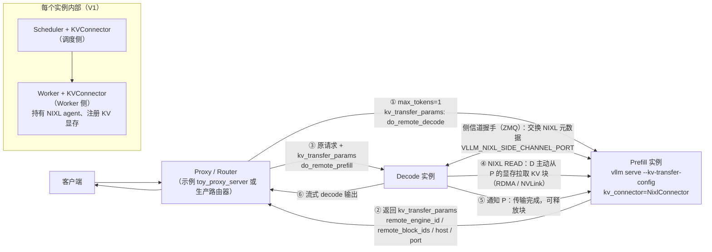
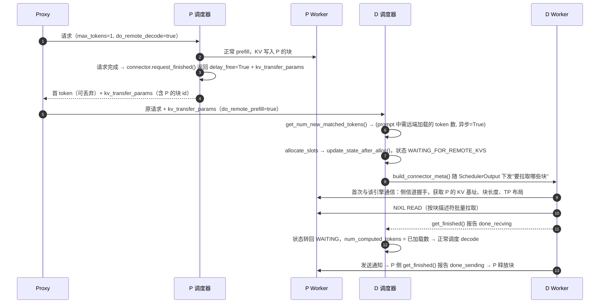
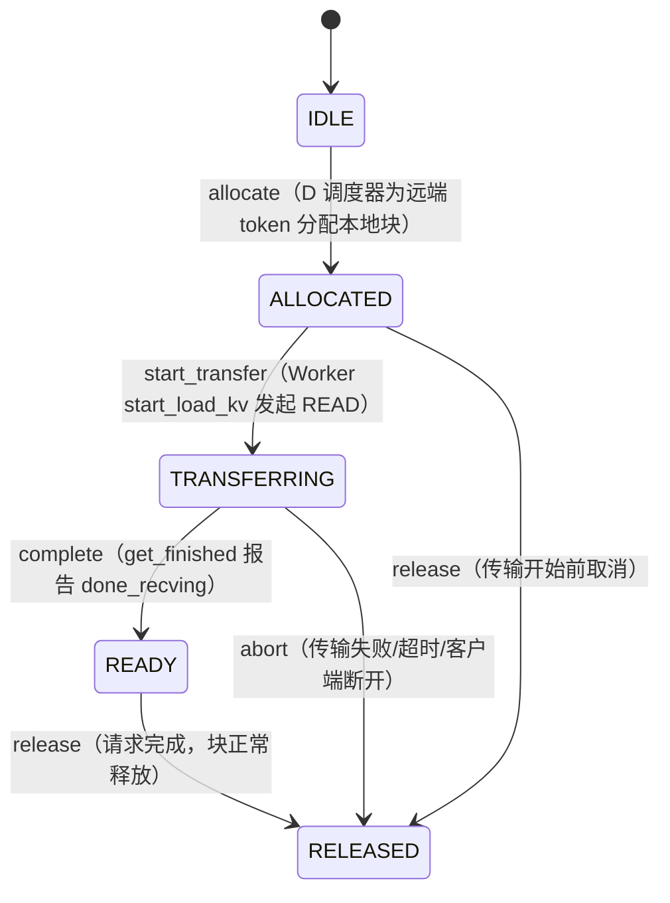

# F3 · PD 分离部署（深度版）

> **版本**：vLLM 0.30.x（V1 引擎）｜**模块**：F-高级特性与性能｜**对应原课**：第 19 课（以"新精修版"为准；旧版及 0.17～0.22 时期的历史实现仅作归档，不在主路径）
> **导航**：上一课：[F2-性能分析] → **本课 F3** → 下一课：[F4-ModelRunnerV2]
> **练习**：`exercises/F3_kv_state_machine`｜**源码标注**：KV Connector 是 vLLM 演进最快的子系统之一，标【待核】处务必以 0.30.x tag 为准。

## 0. 先修与本课目标

先修：B3（调度器的 `WAITING_FOR_REMOTE_KVS` 状态、`num_computed_tokens`）、B4（块、块表、延迟释放）、F2（TTFT 与 ITL 的度量）；RDMA 的基本概念（单边读写、内存注册）。

学完本课你应能：

1. 用 TTFT/ITL 的数字说明为什么要把 prefill 与 decode 分到不同实例；
2. 画出 proxy、Prefill 实例、Decode 实例三方的请求与 KV 流转时序；
3. 按调度侧与 Worker 侧两组方法，复述 `KVConnectorBase_V1` 的接口及其在调度循环中的调用时机；
4. 理解 `NixlConnector` 的握手、拉取（READ）、通知与延迟释放机制；
5. 手算 KV 传输量与传输时间，判断网络是否会成为瓶颈；
6. 用状态机建模单个请求的 KV 传输生命周期，并处理中止与超时。

---

## 1. 动机：prefill 与 decode 互相干扰

prefill 是计算受限的大块计算，一条 8 000 token 的 prompt 在 8B 模型上需要约 150～300 ms；decode 是访存受限的小步计算，每步 10～30 ms。两者混在同一实例中时：

- **prefill 拖慢 decode**：即使有 chunked prefill（B3），每一步混入大量 prefill token 都会让 decode 用户的 ITL 从 15 ms 升到 40 ms 以上，P99 ITL 很难控制；
- **decode 拖慢 prefill**：大量 decode 请求长期占据 KV 与 batch 名额，新请求排队，TTFT 上升；
- **最优并行配置不同**：prefill 偏好更大的 TP（压低单请求延迟）或更多算力，decode 偏好更大的 batch 与 KV 容量（更多显存、可能用 DP），同一实例只能折中。

**PD 分离**把两类工作放到不同实例：P 实例只做 prefill，算完把 KV 交给 D 实例，D 实例从第一个 decode 步开始接管。它把 TTFT 和 ITL 两个目标解耦，各自独立扩缩容。代价是：多了一次 KV 传输、需要一个路由代理、系统复杂度显著上升。PD 分离并非总是更优——低负载或短 prompt 场景下，单实例 chunked prefill 往往更简单且足够好。

## 2. 架构图



## 3. 端到端时序



几点说明：

- **D 侧"拉"而不是 P 侧"推"**：D 在分配好本地块之后才知道目标地址，由 D 发起 READ 最自然；P 只需"保持块不被释放"直到 D 通知完成。
- **最后一个 token 的处理**：与前缀缓存相同，D 至少要对最后一个位置做一次前向才能得到 logits，因此通常只从远端加载到 prompt 的最后一个完整块或 `len−1` 的位置，最后一部分在 D 本地计算。【待核：0.30.x 中 NixlConnector 对部分块的处理细节】
- **P 的首 token**：proxy 通常丢弃 P 返回的那个 token，由 D 重新生成第一个输出 token，以保证采样一致性。

## 4. KVConnector 接口：调度侧与 Worker 侧

`vllm/distributed/kv_transfer/kv_connector/v1/base.py` 中的 `KVConnectorBase_V1` 被实例化两次：一次在 EngineCore 的调度器中（角色 SCHEDULER），一次在每个 Worker 中（角色 WORKER）。两侧通过每步随 `SchedulerOutput` 下发的 `KVConnectorMetadata` 沟通。

**调度侧方法（EngineCore 进程，CPU）**：

1. `get_num_new_matched_tokens(request, num_computed_tokens) -> (int | None, bool)`：除本地前缀缓存命中外，还能从外部加载多少 token；第二个返回值表示是否异步加载（异步时请求进入 `WAITING_FOR_REMOTE_KVS`）。在 `Scheduler.schedule()` 处理 waiting 请求时调用（B3 第 4 节）。
2. `update_state_after_alloc(request, blocks, num_external_tokens)`：本地块分配成功后调用，connector 记下"这些本地块要用远端数据填充"。
3. `build_connector_meta(scheduler_output) -> KVConnectorMetadata`：每步调度末尾调用，把本步需要加载/保存的请求与块信息打包，随 `SchedulerOutput` 发给 Worker。
4. `request_finished(request, block_ids) -> (bool, dict | None)`：请求结束时调用。P 侧返回 `True` 表示"延迟释放这些块"，并返回要回传给 proxy 的 `kv_transfer_params`。
5. `update_connector_output(connector_output)`：处理 Worker 回报的完成情况。【待核：方法名】

**Worker 侧方法（Worker 进程，持有 GPU）**：

1. `register_kv_caches(kv_caches)`：KV 张量分配完成后调用（B5 第 3 节末尾），NixlConnector 在此把 KV 显存注册到 NIXL，并启动侧信道监听线程。
2. `start_load_kv(forward_context)`：前向开始前发起加载（NixlConnector 中发起异步 READ）。
3. `wait_for_layer_load(layer_name)` / `save_kv_layer(layer_name, kv_layer, attn_metadata)`：逐层流水线化加载/保存的钩子（适用于"边算边存"的 connector，如某些存储型 connector）。
4. `wait_for_save()`：前向结束时确保保存完成。
5. `get_finished(finished_req_ids) -> (done_sending, done_recving)`：返回传输完成的请求 id 集合，随 `ModelRunnerOutput` 上报调度器。

**生态中的 connector**（`kv_connector/v1/` 下）：`NixlConnector`（PD 分离主力，基于 NVIDIA NIXL，支持 UCX/RDMA/NVLink）、`P2pNcclConnector`、`LMCacheConnectorV1`（对接 LMCache，常用于 KV 卸载与跨实例共享）、`OffloadingConnector`（CPU 卸载）、`SharedStorageConnector`（教学/调试用，把 KV 写到磁盘文件）、`MultiConnector`（组合多个 connector）。注册表在 `kv_connector/factory.py`。【待核：0.30.x 中的完整列表】

## 5. NixlConnector 的关键机制

1. **元数据握手**：D 第一次需要从某个 P 引擎拉数据时，通过 ZMQ 侧信道（端口由 `VLLM_NIXL_SIDE_CHANNEL_PORT` 指定，按 rank 偏移）向 P 请求 `NixlAgentMetadata`：引擎 id、NIXL agent 元数据、每层 KV 基地址、块数、块字节长度、TP 大小、KV 布局等。握手结果被缓存，后续请求不再重复。
2. **描述符**：双方各自把"每层 × 每块"的显存区域预先登记为传输描述符列表，传输时只需提交"源块 id 列表 → 目标块 id 列表"，NIXL 生成批量 READ。
3. **异构 TP**：P 与 D 的 TP 可以不同（例如 P 用 TP=4、D 用 TP=2）。由于 KV 按头切分在各 rank 上，D 的一个 rank 需要从 P 的多个 rank 各拉一部分头。NixlConnector 根据双方 TP 计算映射。【待核：支持的组合与约束，如要求 D 的 TP 能整除 P 的 TP 或反之】
4. **延迟释放与超时**：P 在 `request_finished` 中返回延迟释放后，块的引用保持到收到 D 的通知；若 D 崩溃或请求被取消导致通知永远不来，P 在超时（`VLLM_NIXL_ABORT_REQUEST_TIMEOUT`，默认量级为数分钟）后强制释放，防止块泄漏。
5. **布局与连续性**：若 KV 布局让同一块中各头的数据不连续，一次块传输会被拆成多个小段，描述符数量与传输效率都会受影响。部分后端提供 HND 布局（头维在前）以改善 PD 传输的连续性。

## 5.5 统一视角：PD 分离、前缀缓存与 KV 卸载是同一件事

如果回到 B3 的核心抽象——每个请求只有一个 `num_computed_tokens`——会发现 PD 分离在调度器眼里并不特殊：它只是"有一部分 token 的 KV 不是本实例算出来的，而是从外部来的"。本地前缀缓存命中是从本机空闲块中"复活"KV；KV 卸载命中是从 CPU 内存或磁盘把 KV 拷回显存；PD 分离是从另一台机器的显存把 KV 拉过来。三者对调度器的影响完全一样：增加 `num_computed_tokens`，减少需要计算的 token。区别只在于数据来源的延迟与带宽不同，因此是同步还是异步加载、要不要进入等待状态。

这种统一使 vLLM 能用同一个 `KVConnectorBase_V1` 接口支持所有这些场景，甚至用 `MultiConnector` 把它们组合起来：例如 D 实例同时配置 NIXL（从 P 拉取）与 CPU 卸载（把不常用的前缀换出到内存）。理解了这一点，你在阅读任何新的 connector 实现时，只需要回答两个问题：它在 `get_num_new_matched_tokens` 中如何判断"外部有多少可用 token"，以及它在 Worker 侧通过什么通道把数据搬进本地块。其余逻辑都由调度器与块管理器统一处理。

这也解释了为什么 PD 分离的调试经常要回到 B4：传输完成后，那些块在 D 侧就是普通的已计算块，会被计算哈希、登记到前缀缓存中，之后的请求也可以命中它们；若块号映射错误，影响的不只是当前请求，还会污染缓存，导致后续命中该前缀的请求同样输出错误。所以在开发自定义 connector 时，务必先在关闭前缀缓存的条件下验证正确性，再打开缓存测试复用路径。

## 6. 数字例子：KV 要传多少、要多久

**例 1：Llama-3-8B，prompt 8 000 token，bf16**。每 token KV 128 KiB（B4）→ 8 000 × 128 KiB = 1 000 MiB ≈ 1.05 GB。

| 链路 | 有效带宽（量级） | 传输时间 |
|---|---|---|
| 同机 NVLink（H100，单向数百 GB/s） | ~200 GB/s | ~5 ms |
| 400 Gb/s RDMA（InfiniBand/RoCE） | ~45 GB/s | ~23 ms |
| 100 Gb/s RDMA | ~11 GB/s | ~95 ms |
| 25 Gb/s TCP | ~2.5 GB/s | ~420 ms |

对比：该 prompt 的 prefill 本身约 150～300 ms。在 400 Gb/s RDMA 下传输只占 TTFT 的约 10%，PD 分离划算；在 25 Gb/s TCP 下传输比 prefill 还慢，PD 分离得不偿失。

**例 2：传输粒度**。block_size=16，8 000 token = 500 块；32 层，若按"层 × 块"分别描述则有 16 000 个描述符，每个 64 KiB。描述符数量大时，NIXL 的批量提交与后端的合并能力直接决定能否跑满带宽——这就是为什么 KV 布局与块大小会影响 PD 性能。

**例 3：fp8 KV**：传输量减半，100 Gb/s 下降到约 48 ms。PD 两端的 `kv_cache_dtype` 必须一致。

**例 4：容量规划**。设 P 实例每秒完成 10 个 8 000 token 的 prefill，则需要外发 10.5 GB/s 的 KV，100 Gb/s 网卡已接近饱和。每个 P 实例应至少配 200～400 Gb/s 的网络带宽，否则网络会成为整个系统的瓶颈。

## 7. 状态机：一个请求在 D 侧的 KV 生命周期



练习中的状态机就是这张图。与真实系统的对应：ALLOCATED 对应 `update_state_after_alloc` 之后、请求处于 `WAITING_FOR_REMOTE_KVS`；TRANSFERRING 对应 Worker 已提交 NIXL 传输；READY 对应调度器收到完成信号，把请求转回可调度状态；abort 路径对应传输失败时的处理——较新版本可以选择把失败的块标记为无效并回退为本地重算 prefill，而不是让整个请求失败。【待核：0.30.x 的失败恢复策略】

**为什么 READY 之后不能再 abort 回传输状态、为什么 IDLE 不能直接 complete**：这些非法转移在真实系统中分别对应"重复释放块"与"使用未传输的 KV"，前者导致块引用计数错乱，后者导致输出乱码。用状态机显式拒绝非法事件，是在分布式异步系统中保持块账本一致的基本手段。

## 8. 部署示例（单机两卡演示）

```bash
# P 实例（GPU 0）
CUDA_VISIBLE_DEVICES=0 VLLM_NIXL_SIDE_CHANNEL_PORT=5600 \
vllm serve Qwen/Qwen3-8B --port 8100 \
  --kv-transfer-config '{"kv_connector":"NixlConnector","kv_role":"kv_both"}'

# D 实例（GPU 1）
CUDA_VISIBLE_DEVICES=1 VLLM_NIXL_SIDE_CHANNEL_PORT=5601 \
vllm serve Qwen/Qwen3-8B --port 8200 \
  --kv-transfer-config '{"kv_connector":"NixlConnector","kv_role":"kv_both"}'

# 代理：vLLM 仓库中的示例代理（路径以 0.30.x 为准【待核】）
python tests/v1/kv_connector/nixl_integration/toy_proxy_server.py \
  --prefiller-hosts localhost --prefiller-ports 8100 \
  --decoder-hosts localhost --decoder-ports 8200 --port 8000
```

验证要点：对代理发请求后，P 的日志中应看到请求以 1 个 token 结束，D 的日志中应看到远端 KV 加载完成；两端 `vllm:` 指标中 P 的 prefill 吞吐与 D 的 decode 吞吐分别上升。

## 9. 常见坑 / 故障模式

1. **两端配置不一致**：模型、dtype、`kv_cache_dtype`、block_size、注意力后端布局不一致时，握手失败或传输后输出乱码。部署前逐项对齐。
2. **侧信道端口冲突或不可达**：多实例同机、多 rank 端口偏移重叠，或防火墙阻断，表现为 D 端请求一直停在 `WAITING_FOR_REMOTE_KVS`。
3. **P 端块泄漏**：D 崩溃或代理没把 `kv_transfer_params` 转发给 D，P 的块要等到超时才释放，P 的 KV 使用率持续偏高，新请求排队。
4. **网络未走 RDMA**：UCX 回退到 TCP，传输时间增加一个数量级。检查 UCX 环境变量与网卡配置，并用 F2 的方法测量实际传输带宽。
5. **P/D 配比失衡**：P 太少则 D 空等，D 太少则 P 的 KV 积压。根据输入/输出长度比估算：每个请求 prefill 耗时与 decode 总耗时之比，决定 P:D 实例数之比。
6. **期望 PD 分离提升吞吐**：PD 分离的主要收益是**延迟可控**（尤其是 P99 ITL），总吞吐不一定提高，有时因传输与资源切分反而下降。

## 10. 动手练习

- 目录：`exercises/F3_kv_state_machine`
- 任务：实现 `KVTransferSM`：状态 `IDLE → ALLOCATED → TRANSFERRING → READY → RELEASED`；允许 `ALLOCATED --release--> RELEASED` 与 `TRANSFERRING --abort--> RELEASED`；其余事件抛 `IllegalKVTransition`。
- 运行：

```bash
python -m pytest exercises/F3_kv_state_machine -q
```

- 进阶 1：增加 `fail` 事件（TRANSFERRING → FALLBACK_RECOMPUTE），表示传输失败后回退为本地 prefill，并写测试。
- 进阶 2：实现一个 P 侧的 `DelayedFreeTracker`：`finish(req, blocks, now)` 登记延迟释放，`notify(req)` 释放，`expire(now, timeout)` 返回超时被强制释放的请求；用 B4 的 `BlockPool` 验证引用计数最终归零。

## 11. 自测清单

- [ ] 我能用数字说明在什么网络条件下 PD 分离划算、什么条件下不划算
- [ ] 我能按时序说出调度侧五个方法与 Worker 侧五个方法的调用时机
- [ ] 我能解释 P 侧为什么要延迟释放、超时机制防止了什么问题

## 12. 延伸阅读

- 论文：DistServe（OSDI'24）、Splitwise（ISCA'24）、Mooncake（KV 为中心的分离架构）
- 源码：`vllm/distributed/kv_transfer/kv_connector/v1/`（`base.py`、`nixl_connector.py`、`factory.py`）、`vllm/v1/core/sched/scheduler.py` 中 connector 相关分支
- vLLM 文档：Disaggregated Prefilling、NixlConnector 使用说明；NVIDIA NIXL 项目文档
