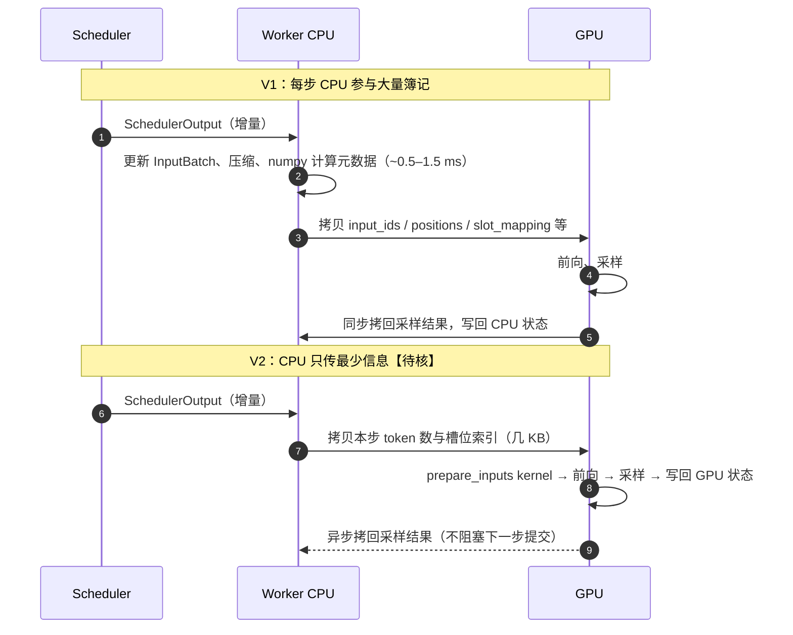

# F4 · ModelRunner V2（深度版）

> **版本**：vLLM 0.30.x（V1 引擎）｜**模块**：F-高级特性与性能｜**对应原课**：第 20 课
> **导航**：上一课：[F3-PD分离] → **本课 F4** → 下一课：无（课程终点，回到《00-学习路径与总索引》复盘）
> **练习**：无独立目录，用 B3 + B4 + C2 三个练习做组合回归（见第 9 节）｜**源码标注**：ModelRunner V2 是正在演进的新实现，**本课所有具体路径、类名、开关均标为【待核】**，请以 0.30.x tag 中 `vllm/v1/worker/gpu/` 目录（或同等位置）的实际代码为准；本课重点讲设计动机与思路，它们比具体命名稳定得多。

## 0. 先修与本课目标

先修：B5（GPUModelRunner 的四类状态）、B6（`execute_model` 十步流程与 CPU/GPU 拆账）、C2（持久缓冲与 CUDA Graph）、F1（采样与投机解码）、B3（异步调度与 `num_output_placeholders`）。

学完本课你应能：

1. 说出 V1 的 GPUModelRunner 在 CPU 开销、代码复杂度、与异步调度配合方面的三类痛点；
2. 理解 V2 的核心设计：请求状态常驻 GPU、输入准备在 GPU 上用 kernel 完成、异步优先、组件解耦；
3. 对比 V1 与 V2 一步推理的数据流，指出哪些 CPU 工作被移到了 GPU 或被消除；
4. 用数字估算 CPU 开销降低对 ITL 与吞吐的影响；
5. 知道如何启用、对照与验证 V2，以及迁移中可能遇到的问题。

---


**为什么值得专门学一课正在演进的代码**：一方面，ModelRunner 是每一步推理都要经过的最热路径，它的设计直接决定了 CPU 开销的下限；另一方面，V1 到 V2 的重构过程完整展示了一个成熟系统如何识别瓶颈、确定边界、在保持上下游接口不变的前提下重写核心。即便将来具体实现再次变化，这种"保持边界、重写内部"的工程方法也同样适用于你自己的项目。

## 1. 动机：V1 ModelRunner 的三类痛点

B6 第 5.6 节的拆账显示，一个 decode 步中 Worker 侧 CPU 工作（`_update_states` + `_prepare_inputs` + 采样后处理）约 0.5～1.5 ms。在 GPU 越来越快、模型越来越"薄"（小模型、大 TP、FP8）的趋势下，这部分开销的占比越来越高。具体来说：

**痛点一：持久批（InputBatch）的 CPU 簿记**。V1 用 `InputBatch` 在 CPU 上维护所有活跃请求的紧凑视图：token 缓冲、块表、采样参数数组、惩罚所需的计数等。请求加入时要写入槽位，结束时要"压缩"（把后面的请求搬到空槽），每步还要用 numpy 计算 positions、slot_mapping 等，再拷贝到 GPU。请求数越多，这些 CPU 操作越多；而且压缩逻辑复杂，涉及几十个数组的同步移动，是 bug 的高发区。

**痛点二：与异步调度的配合别扭**。异步调度要求上一步的采样结果不经过 CPU 就作为下一步的输入。V1 是在"CPU 为中心"的设计上打补丁实现的：需要占位符、需要在 GPU 上回填、需要额外的同步点，代码路径分叉多。

**痛点三：功能耦合**。投机解码、结构化输出、多模态、LoRA、PP、各种注意力后端的元数据都在同一个巨大的类里交织，`gpu_model_runner.py` 有数千行，任何改动都可能影响其他特性。

## 1.5 用一个小例子感受"压缩"的成本

假设 InputBatch 有 8 个槽位，当前请求 A～H 依次占据槽位 0～7。本步请求 B（槽位 1）与 E（槽位 4）结束，同时有一个新请求 I 加入。V1 的做法大致是：新请求优先填入空出的槽位 1；剩下的空槽位 4 需要被"压缩"掉，即把最后一个有效请求 H 从槽位 7 搬到槽位 4，使活跃请求始终占据连续的槽位 0～6。

"搬一个请求"意味着什么？它的 token 缓冲（可能有几千个 token）、块表的一整行、温度、top-p、top-k、惩罚参数、随机数生成器状态、已输出 token 的计数、LoRA 映射、结构化输出状态……几十个数组中对应的那一行都要搬移，并且要保证全部同步，否则某个数组漏搬就会导致请求 H 用上别人的采样参数或块表。这正是痛点一中"bug 高发区"的由来。连续槽位的好处是 GPU 端可以直接按前 N 行切片使用；代价就是这些 CPU 搬移与复杂的一致性维护。

V2 的"稳定槽位"思路则是：请求一旦分配了槽位就不再移动，结束时只把该槽位标记为空闲；每步由 CPU 传给 GPU 一个"本步参与计算的槽位索引列表"，GPU kernel 按这个列表间接读取各请求的状态。用一次间接寻址（GPU 上几乎免费）换掉了 CPU 上的大量搬移，这与 B4 中 PagedAttention 用块表间接寻址替代连续分配，是同一种思想在不同层次上的体现。

## 2. V2 的设计原则

ModelRunner V2 的思路可以概括为四条（以下为设计层面的描述，实现细节【待核】）：

1. **状态常驻 GPU**：每个请求的关键状态（已有 token、`num_computed_tokens`、块表、采样参数）存放在 GPU 上按请求索引的张量中。请求加入时一次性写入，之后每步只需传输极少的增量（例如本步调度的 token 数）。不再需要 CPU 端的"压缩"操作——请求用稳定的槽位索引，空槽位直接跳过。
2. **输入准备 kernel 化**：positions、input_ids（从 GPU 上的 token 缓冲 gather）、query_start_loc、seq_lens、slot_mapping 等用一两个 Triton kernel 在 GPU 上直接算出，CPU 只提供"本步每个请求调度几个 token"这一小段信息。
3. **异步优先**：采样结果直接写入 GPU 上的 token 缓冲，下一步的输入准备 kernel 直接读取，天然支持异步调度；CPU 侧只在需要返回结果给调度器时异步拷贝，不阻塞下一步的提交。
4. **组件解耦**：把注意力元数据构造、CUDA Graph 管理、采样器、投机解码等拆成独立模块，通过清晰的接口与主循环交互。

## 3. 架构对比

```mermaid
flowchart TB
  subgraph V1["V1 GPUModelRunner（CPU 为中心）"]
    A1["SchedulerOutput 增量"] --> B1["_update_states：CPU 上增删请求、压缩 InputBatch"]
    B1 --> C1["_prepare_inputs：numpy 计算 positions / slot_mapping 等"]
    C1 --> D1["H2D 拷贝到持久缓冲"]
    D1 --> E1["前向 + 采样"]
    E1 --> F1["D2H 拷贝采样结果 → 写回 CPU InputBatch"]
  end
  subgraph V2["ModelRunner V2（GPU 为中心）【待核】"]
    A2["SchedulerOutput 增量"] --> B2["新请求：一次性写入 GPU 请求状态表"]
    B2 --> C2["小张量 H2D：本步每请求 token 数、槽位索引"]
    C2 --> D2["prepare_inputs Triton kernel：GPU 上生成全部输入"]
    D2 --> E2["前向 + 采样：结果直接写入 GPU token 缓冲"]
    E2 --> F2["异步 D2H：仅为返回调度器"]
    E2 -.->|"下一步直接读取"| D2
  end
```



## 4. 一步推理的数据流对比



## 5. 数字例子：CPU 开销降低值多少

设 8B 模型、TP=1、256 个并发 decode 请求，GPU 一步约 14 ms。

- **V1**：Worker CPU 簿记约 1.5 ms、调度约 0.8 ms、结果处理约 0.5 ms，若不重叠，单步约 16.8 ms；
- **V2 + 异步调度**：Worker 侧 CPU 工作降到约 0.2 ms，并且调度与上一步 GPU 执行重叠，单步接近 14.2 ms。

ITL 从 16.8 ms 降到约 14.2 ms，下降约 15%，吞吐相应提升约 18%。在更小的模型或更大的 TP 下（GPU 步长 5 ms 左右），同样的 CPU 开销占比更高，收益可达 30% 以上；而在 GPU 步长很长的大模型 prefill 场景，收益则可以忽略。**V2 的价值与"CPU 开销占步长的比例"成正比**，这也是评估它是否值得在你的场景中启用的依据。

**输入准备 kernel 的代价**：为 256 个请求生成全部输入元数据，在 GPU 上只是几个微秒级的小 kernel，并且可以被 CUDA Graph 捕获或与其他操作一起提交；相比之下，在 CPU 上用 numpy 处理同样规模的数据需要数百微秒，再加上 H2D 拷贝与同步。

## 6. 关键模块（全部【待核】）

以下为 V2 可能的代码组织方式，阅读 0.30.x 源码时按"职责"对号入座即可，不要依赖具体文件名：

- **主循环**：新的 ModelRunner 类，负责 `execute_model` 的编排，接口与 V1 保持一致（接收 `SchedulerOutput`，返回 `ModelRunnerOutput`），使 Worker、Executor、EngineCore 无需改动；
- **请求状态**：GPU 上的请求状态表（每请求一行：token 缓冲、长度、采样参数索引等）与槽位分配器；
- **输入批构造**：基于 Triton 的 `prepare_inputs` 类 kernel；
- **块表**：GPU 端维护的块表与 slot_mapping 计算；
- **注意力元数据**：复用 V1 的后端抽象（C1），由独立模块从 GPU 上的通用元数据构造；
- **CUDA Graph 管理**：独立模块负责捕获与分发（C2 的概念不变）；
- **采样器与投机解码**：直接读写 GPU 状态的采样器，以及适配后的 drafter 接口；
- **启用方式**：可能通过环境变量（如 `VLLM_USE_V2_MODEL_RUNNER=1`）或配置项开启，默认值与支持的特性范围以 0.30.x 文档为准。【待核】

## 7. 迁移与验证

由于 V2 是对执行核心的重写，启用时应当像对待一次大版本升级一样验证：

1. **功能对照**：同一模型、贪心解码、固定 prompt 集，对比 V1 与 V2 的输出 token 与 logprobs；
2. **特性矩阵**：逐项确认你依赖的特性（投机解码、结构化输出、多模态、LoRA、PP、特定注意力后端、PD connector）在 V2 中是否已支持；不支持时可能报错，也可能自动回退到 V1；
3. **性能对照**：用 F2 的方法在相同工作点比较 ITL、吞吐，并在 trace 中确认步间 CPU 空白是否缩小；
4. **长稳测试**：长时间运行，覆盖请求取消、抢占、超长上下文等边缘路径，这些在重写中最容易出问题。

## 8. 常见坑 / 理解误区

1. **以为 V2 改变了调度或 KV 管理**：V2 只重写 Worker 内部的执行编排，调度器、KV 块管理、Executor 协议都不变；`SchedulerOutput` 与 `ModelRunnerOutput` 仍是边界（B6）。
2. **在 GPU 已饱和的场景期待大幅提升**：收益来自 CPU 开销，GPU 步长越长收益越小（第 5 节）。
3. **混淆"V1 引擎"与"ModelRunner V2"**：前者是整个引擎架构的代号（相对于已移除的 V0），后者是 V1 引擎内部 ModelRunner 的第二代实现，两者不是同一层级的概念。
4. **自定义插件依赖 InputBatch 内部字段**：基于 V1 内部数据结构写的插件（例如自定义 logits processor 直接读 InputBatch）在 V2 中可能失效，应改用公开接口。
5. **调试方式变化**：V2 中更多逻辑在 GPU kernel 里，单步打印 CPU 变量不再能看到全部状态，需要显式把 GPU 张量拷回检查，或借助 F2 的工具。

## 9. 组合练习

本课无独立练习目录。V2 的核心思想——按 token 预算准入、按引用计数管理块、满足图捕获约束——分别对应 B3、B4、C2 三个练习，用它们做一次组合回归：

```bash
python -m pytest exercises/B3_scheduler_token_budget exercises/B4_block_pool exercises/C2_cudagraph_constraints -q
```

纸面与编程练习：

1. 用 numpy 实现一个"GPU 风格"的 `prepare_inputs(num_computed, num_scheduled, block_table, block_size)`：完全向量化（不写 Python 循环），输出 positions、query_start_loc、seq_lens、slot_mapping，并用 B6 第 5 节的例子验证结果（R0、R1、R2 三个请求）。这正是 V2 在 GPU 上用 kernel 做的事情。
2. 对比"压缩式持久批"（请求结束时搬移后续请求）与"稳定槽位 + 跳过空槽"两种设计，在 256 个槽位、每步随机结束 5% 请求的模拟中，统计每步需要移动的数据量。
3. 用第 5 节的公式，代入你自己环境中测得的 GPU 步长与 CPU 开销，估算启用 V2 的潜在收益。

## 9.5 课程总复盘：一张图串起全部模块

作为课程的最后一课，建议用本课的视角回顾整个课程。B 模块建立了七层结构与"一步推理"的完整路径；C 模块让第 ⑦ 层的计算更快（kernel、图、编译）；D 模块减少每一步需要搬运的字节；E 模块把计算分布到更多卡上；F 模块处理采样与投机、性能度量、跨实例的 KV 流动，以及本课的执行核心重构。贯穿始终的有三条主线：**一是 `num_computed_tokens` 这一个数字统一了调度、缓存、投机与 PD 分离；二是"访存受限还是计算受限"的 roofline 判断决定了几乎所有优化的方向；三是 CPU 与 GPU 的分工——从 B1 的进程拆分、C2 的 CUDA Graph，到本课的 GPU 常驻状态——vLLM 的演进史很大程度上就是不断把 CPU 从关键路径上移走的历史。** 能用这三条主线解释任意一个新特性，你就真正读懂了 vLLM。

## 10. 自测清单

- [ ] 我能说出 V1 ModelRunner 的三类痛点，以及 V2 的四条设计原则分别解决哪一类
- [ ] 我能画出 V1 与 V2 一步推理的数据流差异，并指出被移到 GPU 上的计算
- [ ] 我能根据"CPU 开销占步长比例"估算 V2 在某个场景下的收益

## 11. 延伸阅读

- 源码：`vllm/v1/worker/gpu_model_runner.py`（V1，对照阅读）与 `vllm/v1/worker/gpu/`（V2，【待核】）
- vLLM 官方博客与 RFC 中关于 ModelRunner 重构、异步调度的讨论
- 本课程 B5、B6、C2、F2 的相关章节
