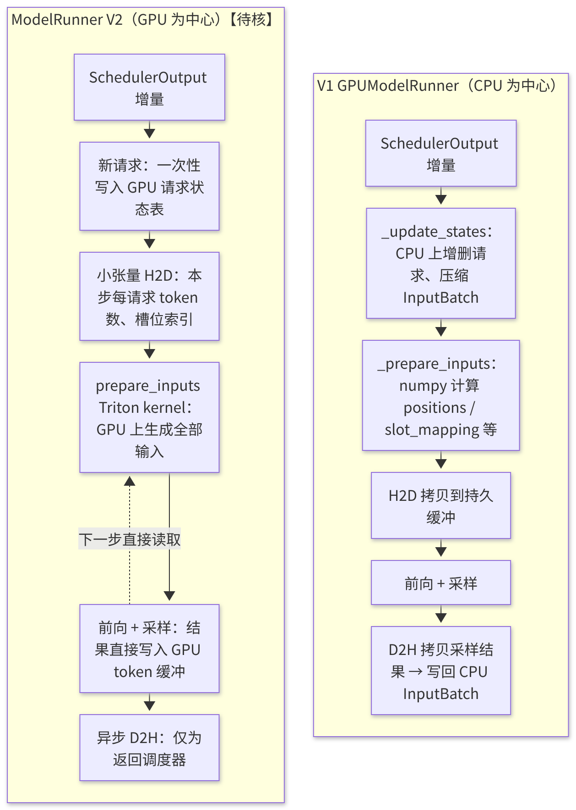
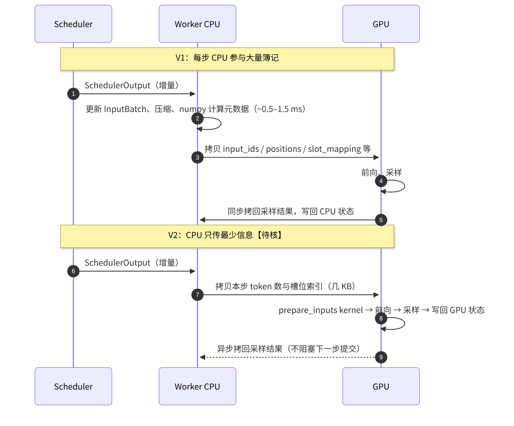

# F4 · ModelRunner V2

> **版本**：vLLM 0.30.x（V1 引擎）｜**模块**：F-高级特性与性能｜**对应原课**：第 20 课
> **导航**：上一课：[F3-PD分离] → **本课 F4** → 下一课：无（课程终点，请回到《00-学习路径与总索引》进行复盘）
> **练习**：无独立目录，以 B3、B4、C2 三个练习进行组合回归（见第 9 节）｜**源码标注**：ModelRunner V2 是仍在演进中的新实现，**本课所有具体路径、类名与开关均标为【待核】**，请以 0.30.x tag 中 `vllm/v1/worker/gpu/` 目录（或同等位置）的实际代码为准；本课重点讲解设计动机与思路，二者远比具体命名稳定。

## 0. 先修要求与学习目标

先修要求：B5（GPUModelRunner 的四类状态）、B6（`execute_model` 十步流程与 CPU/GPU 耗时分解）、C2（持久缓冲与 CUDA Graph）、F1（采样与投机解码）、B3（异步调度与 `num_output_placeholders`）。

完成本课学习后，学习者应能够：

1. 指出 V1 的 GPUModelRunner 在 CPU 开销、代码复杂度以及与异步调度配合三个方面存在的问题；
2. 阐述 V2 的核心设计：请求状态常驻 GPU、输入准备在 GPU 上以 kernel 完成、异步优先、组件解耦；
3. 对比 V1 与 V2 单步推理的数据流，指出哪些 CPU 工作被移至 GPU 或被消除；
4. 以数值估算 CPU 开销的降低对词元间时延（ITL）与吞吐量的影响；
5. 掌握启用、对照与验证 V2 的方法，以及迁移过程中可能出现的问题。

---


**专门学习一份仍在演进的代码的意义**：一方面，ModelRunner 是每一步推理都必须经过的最热路径，其设计直接决定了 CPU 开销的下限；另一方面，从 V1 到 V2 的重构过程完整地展示了一个成熟系统如何识别瓶颈、确定边界，并在保持上下游接口不变的前提下重写核心。即使具体实现在将来再次变化，这种"保持边界、重写内部"的工程方法同样适用于其他项目。

## 1. 动机：V1 ModelRunner 的三类问题

B6 第 5.6 节的耗时分解表明，一个解码（Decode）步中 Worker 侧的 CPU 工作（`_update_states` + `_prepare_inputs` + 采样后处理）约为 0.5～1.5 ms。在 GPU 不断提速、模型日益"轻薄"（小模型、大 TP、FP8）的趋势下，该部分开销的占比持续上升。具体而言：

**问题一：持久批次（InputBatch）的 CPU 簿记**。V1 使用 `InputBatch` 在 CPU 上维护所有活跃请求的紧凑视图：token 缓冲、块表、采样参数数组、惩罚所需的计数等。请求加入时须写入槽位，结束时须执行"压缩"（将后续请求移入空槽），每步还须使用 numpy 计算 positions、slot_mapping 等，再拷贝至 GPU。请求数越多，此类 CPU 操作越多；此外，压缩逻辑较为复杂，涉及数十个数组的同步移动，是缺陷的高发区域。

**问题二：与异步调度的配合不够自然**。异步调度要求上一步的采样结果不经过 CPU 即作为下一步的输入。V1 是在"以 CPU 为中心"的设计之上以补丁方式实现这一点的：需要占位符、需要在 GPU 上回填、需要额外的同步点，代码路径分支较多。

**问题三：功能耦合**。投机解码、结构化输出、多模态、LoRA、PP 以及各类注意力后端的元数据均交织于同一个庞大的类中，`gpu_model_runner.py` 长达数千行，任何修改都可能影响其他特性。

## 1.5 示例：评估"压缩"操作的成本

设 InputBatch 有 8 个槽位，当前请求 A～H 依次占据槽位 0～7。本步请求 B（槽位 1）与 E（槽位 4）结束，同时有一个新请求 I 加入。V1 的处理方式大致如下：新请求优先填入空出的槽位 1；剩余的空槽位 4 需要被"压缩"，即将最后一个有效请求 H 从槽位 7 移至槽位 4，使活跃请求始终占据连续的槽位 0～6。

"移动一个请求"涉及以下内容：其 token 缓冲（可能包含数千个 token）、块表的一整行、温度、top-p、top-k、惩罚参数、随机数生成器状态、已输出 token 的计数、LoRA 映射、结构化输出状态等——数十个数组中对应的行均须移动，且必须保证全部同步；若某个数组遗漏移动，请求 H 就会使用其他请求的采样参数或块表。这正是问题一中"缺陷高发区域"的成因。连续槽位的优点在于 GPU 端可以直接按前 N 行切片使用；其代价则是上述 CPU 搬移操作与复杂的一致性维护。

V2 的"稳定槽位"思路是：请求一旦分配了槽位便不再移动，结束时仅将该槽位标记为空闲；每步由 CPU 向 GPU 传递一个"本步参与计算的槽位索引列表"，GPU kernel 按该列表间接读取各请求的状态。以一次间接寻址（在 GPU 上开销极小）替代 CPU 上的大量搬移操作，与 B4 中 PagedAttention 以块表间接寻址替代连续分配，是同一思想在不同层次上的体现。

## 2. V2 的设计原则

ModelRunner V2 的思路可归纳为以下四条（以下为设计层面的描述，实现细节【待核】）：

1. **状态常驻 GPU**：每个请求的关键状态（已有 token、`num_computed_tokens`、块表、采样参数）存放于 GPU 上按请求索引的张量中。请求加入时一次性写入，此后每步只需传输极少量的增量（例如本步调度的 token 数）。CPU 端不再需要"压缩"操作——请求使用稳定的槽位索引，空槽位直接跳过。
2. **输入准备 kernel 化**：positions、input_ids（从 GPU 上的 token 缓冲 gather 得到）、query_start_loc、seq_lens、slot_mapping 等由一至两个 Triton kernel 在 GPU 上直接计算，CPU 仅提供"本步每个请求调度的 token 数"这一少量信息。
3. **异步优先**：采样结果直接写入 GPU 上的 token 缓冲，由下一步的输入准备 kernel 直接读取，因此天然支持异步调度；CPU 侧仅在需要向调度器返回结果时执行异步拷贝，不阻塞下一步的提交。
4. **组件解耦**：将注意力元数据构造、CUDA Graph 管理、采样器、投机解码等拆分为独立模块，通过清晰的接口与主循环交互。

## 3. 架构对比



<p align="center"><em>图1：ModelRunner V1 与 V2 的架构对比</em></p>

## 4. 单步推理的数据流对比



<p align="center"><em>图2：单步推理的数据流对比（V1 vs V2）</em></p>

## 5. 数值示例：CPU 开销降低的收益

设 8B 模型、TP=1、256 个并发 decode 请求，GPU 单步耗时约 14 ms。

- **V1**：Worker CPU 簿记约 1.5 ms、调度约 0.8 ms、结果处理约 0.5 ms；若三者不重叠，单步约为 16.8 ms；
- **V2 + 异步调度**：Worker 侧 CPU 工作降至约 0.2 ms，且调度与上一步的 GPU 执行重叠，单步接近 14.2 ms。

ITL 由 16.8 ms 降至约 14.2 ms，降幅约 15%，吞吐量相应提升约 18%。在更小的模型或更大的 TP 下（GPU 步长约 5 ms），同样的 CPU 开销所占比例更高，收益可达 30% 以上；而在 GPU 步长很长的大模型 prefill 场景中，收益可以忽略不计。**V2 的价值与"CPU 开销占步长的比例"成正比**，这也是评估在特定场景中是否值得启用 V2 的依据。

**输入准备 kernel 的代价**：为 256 个请求生成全部输入元数据，在 GPU 上仅需若干微秒级的小 kernel，并且可被 CUDA Graph 捕获或与其他操作一同提交；相比之下，在 CPU 上以 numpy 处理同等规模的数据需要数百微秒，此外还须计入 H2D 拷贝与同步的开销。

## 6. 关键模块（全部【待核】）

以下为 V2 可能的代码组织方式。阅读 0.30.x 源码时，应按"职责"进行对应，而不应依赖具体的文件名：

- **主循环**：新的 ModelRunner 类，负责 `execute_model` 的编排，其接口与 V1 保持一致（接收 `SchedulerOutput`，返回 `ModelRunnerOutput`），从而使 Worker、Executor、EngineCore 无需修改；
- **请求状态**：GPU 上的请求状态表（每个请求一行：token 缓冲、长度、采样参数索引等）以及槽位分配器；
- **输入批次构造**：基于 Triton 的 `prepare_inputs` 类 kernel；
- **块表**：在 GPU 端维护的块表与 slot_mapping 计算；
- **注意力元数据**：复用 V1 的后端抽象（C1），由独立模块基于 GPU 上的通用元数据构造；
- **CUDA Graph 管理**：由独立模块负责捕获与分发（C2 中的概念不变）；
- **采样器与投机解码**：直接读写 GPU 状态的采样器，以及经适配的 drafter 接口；
- **启用方式**：可能通过环境变量（如 `VLLM_USE_V2_MODEL_RUNNER=1`）或配置项启用，默认值与所支持的特性范围以 0.30.x 文档为准。【待核】

## 7. 迁移与验证

由于 V2 是对执行核心的重写，启用时应按照对待一次大版本升级的标准进行验证：

1. **功能对照**：使用同一模型、贪心解码与固定的 prompt 集，对比 V1 与 V2 的输出 token 与 logprobs；
2. **特性矩阵**：逐项确认所依赖的特性（投机解码、结构化输出、多模态、LoRA、PP、特定注意力后端、PD connector）在 V2 中是否已获支持；对于不支持的特性，系统可能报错，也可能自动回退至 V1；
3. **性能对照**：使用 F2 的方法在相同工作点比较 ITL 与吞吐量，并在 trace 中确认步间 CPU 空白是否缩小；
4. **长期稳定性测试**：长时间运行，覆盖请求取消、抢占、超长上下文等边缘路径，这些路径在重写中最易出现问题。

## 8. 常见问题与理解误区

1. **误认为 V2 改变了调度或 KV 管理**：V2 仅重写 Worker 内部的执行编排，调度器、KV 块管理与 Executor 协议均保持不变；`SchedulerOutput` 与 `ModelRunnerOutput` 仍然是边界（B6）。
2. **在 GPU 已饱和的场景中期待大幅提升**：收益来自 CPU 开销的降低，GPU 步长越长，收益越小（第 5 节）。
3. **混淆"V1 引擎"与"ModelRunner V2"**：前者是整个引擎架构的代号（相对于已移除的 V0），后者是 V1 引擎内部 ModelRunner 的第二代实现，二者不属于同一层级的概念。
4. **自定义插件依赖 InputBatch 的内部字段**：基于 V1 内部数据结构编写的插件（例如直接读取 InputBatch 的自定义 logits processor）在 V2 中可能失效，应改用公开接口。
5. **调试方式的变化**：V2 中更多的逻辑位于 GPU kernel 内，单步打印 CPU 变量已无法观察全部状态，须显式将 GPU 张量拷回进行检查，或借助 F2 中的工具。

## 9. 组合练习

本课无独立的练习目录。V2 的核心思想——按 token 预算准入、按引用计数管理块、满足图捕获约束——分别对应 B3、B4、C2 三个练习，可利用它们进行一次组合回归：

```bash
python -m pytest exercises/B3_scheduler_token_budget exercises/B4_block_pool exercises/C2_cudagraph_constraints -q
```

验收标准：上述三组测试全部通过。

书面与编程练习：

1. 使用 numpy 实现一个"GPU 风格"的 `prepare_inputs(num_computed, num_scheduled, block_table, block_size)`：要求完全向量化（不使用 Python 循环），输出 positions、query_start_loc、seq_lens、slot_mapping，并以 B6 第 5 节的示例（R0、R1、R2 三个请求）验证结果。这正是 V2 在 GPU 上以 kernel 完成的工作。
2. 对比"压缩式持久批次"（请求结束时移动后续请求）与"稳定槽位 + 跳过空槽"两种设计：在 256 个槽位、每步随机结束 5% 请求的模拟中，统计每步需要移动的数据量。
3. 使用第 5 节的公式，代入在自身环境中测得的 GPU 步长与 CPU 开销，估算启用 V2 的潜在收益。

## 9.5 课程总结：以一张图串联全部模块

作为课程的最后一课，建议以本课的视角回顾整个课程。B 模块建立了七层结构与"单步推理"的完整路径；C 模块使第 ⑦ 层的计算更快（kernel、图、编译）；D 模块减少每一步需要搬运的字节数；E 模块将计算分布到更多 GPU 上；F 模块处理采样与投机解码、性能度量、跨实例的 KV 流动，以及本课所讨论的执行核心重构。贯穿始终的主线有三条：**其一，`num_computed_tokens` 这一个数值统一了调度、缓存、投机解码与 PD 分离；其二，"访存受限还是计算受限"的 roofline 判断决定了几乎所有优化的方向；其三，CPU 与 GPU 的分工——从 B1 的进程拆分、C2 的 CUDA Graph，到本课的 GPU 常驻状态——vLLM 的演进史在很大程度上就是不断将 CPU 从关键路径上移除的历史。** 若能以这三条主线解释任意一项新特性，即表明已真正理解 vLLM 的设计。

## 10. 自测题

- [ ] 能否指出 V1 ModelRunner 的三类问题，以及 V2 的四条设计原则分别针对其中哪一类
- [ ] 能否绘制 V1 与 V2 单步推理的数据流差异，并指出被移至 GPU 上的计算
- [ ] 能否依据"CPU 开销占步长的比例"估算 V2 在特定场景下的收益

## 11. 延伸阅读

- 源码：`vllm/v1/worker/gpu_model_runner.py`（V1，用于对照阅读）与 `vllm/v1/worker/gpu/`（V2，【待核】）
- vLLM 官方博客与 RFC 中关于 ModelRunner 重构与异步调度的讨论
- 本课程 B5、B6、C2、F2 的相关章节

---

**课程导航**　上一课：[F3 · PD 分离部署](https://qcngm3vce6yt.feishu.cn/docx/AXNadrgJYoxuwmxYzDAc15lXnpd)｜下一课：无（课程终点）｜[返回索引](https://qcngm3vce6yt.feishu.cn/docx/KUn5dKSejoQSAJxaf7YcvNVDnCd)

相关章节：
- [B6 · V1 架构总览与推理主路径](https://qcngm3vce6yt.feishu.cn/docx/FV3gdoLxEo55VtxFlnkc41Lhn6g)——见本课「0. 先修要求与学习目标」：“B6（execute_model 十步流程与 CPU/GPU 耗时分解）”
- [C2 · CUDA Graph](https://qcngm3vce6yt.feishu.cn/docx/HXw7ddUYQo9DaTxs9DzcJDwYnOc)——见本课「0. 先修要求与学习目标」：“C2（持久缓冲与 CUDA Graph）”
- [F2 · 性能分析与瓶颈定位](https://qcngm3vce6yt.feishu.cn/docx/EA3EdAAINoqBhKx2VpKc5f3tnzq)——见本课「7. 迁移与验证」：“性能对照：使用 F2 的方法在相同工作点比较 ITL 与吞吐量”
