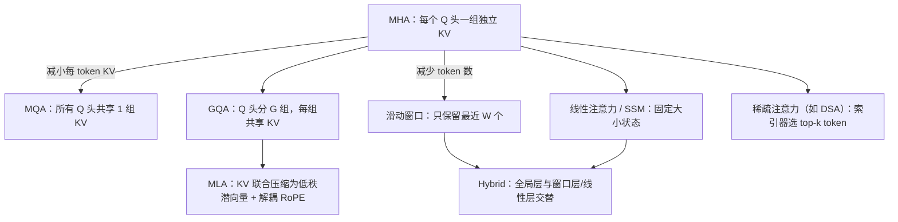
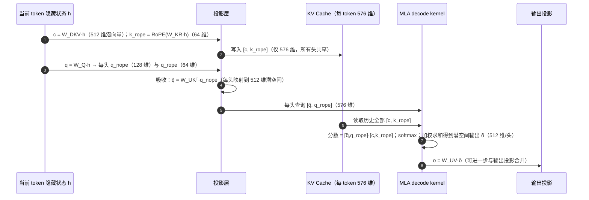

# R1 · 参考阅读：Attention 架构变体（深度版，非主路径）

> ⚠️ **非主路径**：本文是参考阅读，不属于 vLLM 正式课序，完成主线无需阅读。原"番外篇"内部标题误写为"第 10 课"并引用了外部课程，本版已去除所有串课引用，只保留通用原理与 vLLM 映射。
> **版本**：原理部分与框架无关；vLLM 映射以 0.30.x（V1）为准，标【待核】处以 tag 源码为准。
> **导航**：建议在完成 B4（KV 显存）与 C1（注意力后端）后选读；读完返回主线 [C2-CUDAGraph] 或继续后续模块。
> **练习**：无独立目录；可选回归 B4 块池练习（见第 8 节）。

## 0. 先修与本文目标

先修：多头注意力（MHA）公式；B4 的每 token KV 字节数公式；C1 的 roofline 与 decode 注意力访存受限结论。

读完本文你应能：

1. 用"每 token KV 字节数"这一个指标，统一理解 MHA → MQA → GQA → MLA 的演进；
2. 手算各变体在典型配置下的 KV 大小与 decode 读取量；
3. 理解 MLA 的低秩压缩、解耦 RoPE 与"矩阵吸收"；
4. 理解滑动窗口、混合（Hybrid）、线性注意力/状态空间模型、稀疏注意力的思路与代价；
5. 知道这些变体在 vLLM 中由哪些机制承接（KV 规格、块管理器、注意力后端）。

---

## 1. 动机：KV Cache 是推理的头号资源

B4 与 B6 已经说明：KV 容量决定并发，KV 读取量决定长上下文 decode 的步长。因此，过去几年注意力结构的演进，几乎都可以用一个问题概括：**如何在尽量不损失质量的前提下，减少每个 token 需要保存和读取的 KV**。可以沿两个方向着手：

- **减小每 token 的 KV**：共享 KV 头（MQA/GQA）、低秩压缩（MLA）；
- **减少需要保留/读取的 token 数**：滑动窗口、稀疏选择（DSA 等）、用固定大小状态替代逐 token 缓存（线性注意力/SSM）。




阅读本文时，建议始终带着两个问题：这种变体**省的是容量还是计算**？它**对并行切分有什么影响**？前者决定它在 vLLM 中由块管理器还是注意力后端来体现收益，后者决定它适合 TP 还是 DP 的部署方式。几乎所有变体的优缺点，都可以从这两个问题出发推导出来。另外要注意，结构选择是在训练阶段决定的，推理框架无法把一个 MHA 模型"改成"MLA；推理侧能做的，是为每种结构提供正确且高效的缓存管理与 kernel。

## 2. 每 token KV 的统一公式与数字

```
每 token KV 字节 = 层数 × 每层每 token 缓存元素数 × dtype 字节
MHA/GQA/MQA：每层元素数 = 2 × num_kv_heads × head_dim
MLA：      每层元素数 = kv_lora_rank + qk_rope_head_dim（K、V 共用一个潜向量，不乘 2）
```

**以一个 32 层、32 个 Q 头、head_dim 128 的 7B 级模型为例（bf16）**：

| 结构 | KV 头数 | 每层每 token 元素 | 每 token KV | 相对 MHA |
|---|---|---|---|---|
| MHA | 32 | 8 192 | 512 KiB | 1 |
| GQA（G=8） | 8 | 2 048 | 128 KiB | 1/4 |
| MQA | 1 | 256 | 16 KiB | 1/32 |
| MLA（512 + 64） | — | 576 | 36 KiB | ≈1/14 |

**DeepSeek-V3 量级的对比**（61 层、128 个头）：MLA 每 token 576 × 2 B × 61 ≈ 68.6 KiB；若用同样维度的 MHA（K 头维 192、V 头维 128），每 token 为 128 × (192 + 128) × 2 B × 61 ≈ 4.77 MiB，约为 MLA 的 71 倍。没有 MLA，这类模型在长上下文下几乎无法高并发服务。

**decode 读取量**：batch 64、上下文 8 192 时，GQA-8 的 7B 模型每步需读 64 × 8 192 × 128 KiB = 64 GiB，在 3.35 TB/s 下约 20 ms，远超读权重的时间；换成 MLA 则约 18 GiB、约 6 ms。这就是"KV 体积 = 长上下文 decode 速度"的直观含义。

## 3. GQA 与 MQA：共享 KV 头

GQA 把 H 个 Q 头分成 G 组，每组共享一组 K、V。计算上，每个 KV 头被 H/G 个 Q 头复用，decode 注意力的算术强度随之提升为约 H/G（C1），对访存受限的 decode 是直接利好。质量上，G=8 时与 MHA 差距很小，而 MQA（G=1）在大模型上有可感知的质量损失，所以 GQA 成为了主流折中。


**一个容易混淆的点**：GQA 的分组只影响 K、V 的投影与缓存，Q 的投影仍然是完整的 H 个头，所以模型参数量的变化很小（K、V 投影矩阵变小），质量损失也有限。从工程角度看，GQA 的价值几乎全部体现在推理阶段：KV 容量提升 H/G 倍、decode 读取量下降 H/G 倍。这也解释了为什么几乎所有近年的开源稠密模型都采用了 GQA。

**与 TP 的交互**（E2）：TP 按头切分，若 TP > G，KV 头必须复制，KV 容量不再随 TP 线性增长。例如 G=8、TP=16 时，每个 KV 头在两张卡上各存一份。

## 4. MLA：低秩压缩与矩阵吸收

MLA 的核心步骤：

1. **压缩**：对每个 token 的隐藏状态 h，计算一个低维潜向量 c = W_DKV · h（维度 512），只缓存 c；
2. **解耦 RoPE**：旋转位置编码与低秩压缩不兼容（RoPE 依赖位置，会破坏下面的"吸收"），因此另外为 K 计算一小段带 RoPE 的分量（64 维），所有头共享，并一起缓存；
3. **还原**：概念上，K = W_UK · c、V = W_UV · c，每个头各有自己的上投影；
4. **矩阵吸收**：decode 时并不真的还原 K、V。注意力分数 qᵀK = qᵀ W_UK c = (W_UKᵀ q)ᵀ c，可以先把 W_UK 吸收进 query，使 query 直接与潜向量 c 做点积；同理 W_UV 可以吸收进输出投影。于是 decode 注意力直接在 576 维的潜空间上计算，读取的 KV 只有潜向量。

**代价与后端**：吸收后注意力的形态变为"多个 Q 头 × 一个共享的 576 维 KV"，相当于 head_dim 很大的 MQA，需要专用 kernel 才高效；prefill 时吸收不划算（query 很多），通常反过来先还原 K、V 再做常规注意力。所以 MLA 后端要分别处理 prefill 与 decode 两条路径。vLLM 在 `vllm/v1/attention/backends/mla/` 下提供了通用实现（`common.py` 中的公共逻辑）与多个 decode 专用后端（如 FlashMLA、CUTLASS MLA、Triton MLA 等）。【待核：0.30.x 中的后端列表】

**与并行的交互**：潜向量不按头切分，TP 时每张卡都要存完整的潜向量 KV，这就是 E1 中大 MoE 模型采用"注意力 DP"的根本原因。

## 4.5 MLA 一步 decode 的数据流



从这张图可以看出 MLA 后端的特殊之处：kernel 读取的"KV"只是 576 维的共享向量，但每个头的查询也被映射到了 576 维，相当于"128 个 Q 头 × 1 个 KV 头、head_dim = 576"的 MQA。这种形状下，每读取一个 KV 元素可以与 128 个查询相乘，算术强度很高，decode 注意力甚至可能从访存受限转向计算受限，这与 C1 中 GQA 模型的结论完全不同，也是 MLA 需要专门设计 kernel 的原因。另外，由于 KV 中 c 与 V 的潜表示是同一个向量，"读 K"和"读 V"其实是同一份数据，只需读一次——这也是公式中不乘 2 的直观解释。

## 5. 滑动窗口与 Hybrid

**滑动窗口**：每个 token 只关注最近 W 个 token，窗口之外的 KV 可以丢弃。KV 与计算都从 O(L) 降为 O(W)。代价是单层无法直接看到远处信息，需要靠层层堆叠间接传递，长程依赖能力下降。

**Hybrid**：为了兼顾，许多模型让少数层保留全局注意力、多数层使用窗口（或线性注意力）。**数字例子**：每 6 层中 1 层全局、5 层窗口 W = 1 024，上下文 128K 时，平均每层需要保留的 token 数 ≈ (1/6) × 128K + (5/6) × 1K ≈ 22.2K，相比全部全局注意力的 128K 约节省 5.8 倍 KV。

**vLLM 的承接**：B4 第 7 节介绍的 KV cache group 机制。每层通过 `KVCacheSpec`（`vllm/v1/kv_cache_interface.py`：`FullAttentionSpec`、`SlidingWindowSpec`、`ChunkedLocalAttentionSpec` 等）声明需求，`HybridKVCacheCoordinator` 为每组分配块表，`SlidingWindowManager.remove_skipped_blocks()` 把窗口外的块替换为 null block 并释放。前缀缓存在混合模型中也需要特殊处理：一个前缀"命中"必须在所有组中都成立，窗口组只需要窗口内的块存在。

## 6. 线性注意力与状态空间模型

线性注意力与 Mamba 类 SSM 不保存逐 token 的 KV，而是维护一个**固定大小的状态**，每来一个 token 就更新一次状态。decode 时每步的计算与读取量与上下文长度无关，长上下文下优势巨大；prefill 可以用分块扫描（chunked scan）并行计算。代价是固定大小的状态是有损压缩，精确检索远处信息的能力较弱，因此实践中多与少量全局注意力层组成 Hybrid。

**vLLM 的承接**：`MambaSpec` 描述每个请求的状态大小，状态也以"块"的形式由块池管理（每个请求占用固定数量的块）；对应的层与 kernel 位于 `vllm/model_executor/layers/mamba/` 下。前缀缓存与这类状态的兼容性需要额外机制（只能在特定位置保存状态快照），以 0.30.x 实现为准。【待核】

## 7. 稀疏注意力（以 DSA 为例）

稀疏注意力保留完整的 KV，但每个 query 只与选出的少量 token 计算。以 DeepSeek 稀疏注意力（DSA）为例：一个轻量的"索引器"用低维、低精度的投影为每个 query 给所有历史 token 打分，选出 top-k（如 2 048 个）token，主注意力只在这些 token 上计算。

**数字例子**：上下文 128K、k = 2 048 时，主注意力每个 query 只看 1.6% 的 token，计算量下降约 64 倍；但索引器本身仍要扫描全部 128K 个 token（以很小的维度与 FP8 精度），其开销随长度线性增长，只是常数小得多。KV 容量并未减少（甚至多了索引器自己的小 KV），所以收益在**计算与读取带宽**，不在容量。

**vLLM 的承接**：需要专门的注意力后端与额外的索引器 KV 规格，以及调度器与块管理对两类缓存的协调。【待核：0.30.x 中的实现位置】

## 7.5 如何判断一个新模型在 vLLM 中走哪条路径

拿到一个新模型时，可以按下面的顺序判断它的注意力会落到哪种 KV 规格与后端，从而预估显存与性能。第一，查看模型配置：是否存在 `kv_lora_rank` 之类的字段（MLA）、`num_key_value_heads` 的取值（GQA/MQA）、`sliding_window` 或逐层的注意力类型列表（窗口/Hybrid）、是否有状态空间层的配置（Mamba 类）。第二，查看 vLLM 中对应的模型实现：每个注意力层在构造时会声明自己的类型，ModelRunner 汇总后生成每层的 `KVCacheSpec`，启动日志中通常能看到 KV cache group 的数量与每组的类型。第三，确认所选注意力后端：日志中的后端名称告诉你 decode 走的是哪种 kernel，若某种变体只有少数后端支持，强制指定其他后端可能导致启动失败。第四，用第 2 节的公式计算每 token KV，与启动日志中的 KV token 数对照，若差异很大，说明对模型结构的理解有误或存在复制（如 TP 大于 KV 头数）。

这个流程把本文的原理与主线课程（B4 的块管理、C1 的后端选择、E2 的头复制）联系在了一起：注意力变体不是孤立的论文知识，它们直接决定了你部署时的容量与速度。

## 8. 选读练习

本文没有独立练习目录。可以用 B4 的块池练习作为回归，并完成下面的计算练习：

```bash
python -m pytest exercises/B4_block_pool -q
```

1. 写一个函数 `kv_bytes_per_token(layers, kind, **cfg)`，支持 `mha/gqa/mqa`（参数 num_kv_heads、head_dim）与 `mla`（参数 kv_lora_rank、rope_dim），用第 2 节的表格写测试。
2. 计算一个 Hybrid 模型（每 6 层 1 层全局、窗口 1 024）在上下文 8K、32K、128K 下相对全全局注意力的 KV 节省倍数，观察节省倍数如何随上下文增长。
3. 用 B4 的块大小 16，计算第 2 节 7B 级 GQA 模型与 MLA 模型在 50 GB KV 预算下各能容纳多少块与多少 token。

## 9. 常见误区

1. **以为 MQA/GQA 降低了计算量**：主要降低的是 KV 容量与读取量；Q 头数不变，注意力的计算量变化不大。
2. **以为 MLA 在 prefill 中也走潜空间**：prefill 通常还原 K、V 走常规路径，吸收只对 decode 有利。
3. **以为滑动窗口模型能"记住"全部上下文**：窗口外信息只能通过多层间接传递，长程检索能力有限。
4. **以为稀疏注意力省显存**：DSA 类方法主要省计算，KV 仍需完整保存。
5. **忽视与并行的交互**：KV 头数、潜向量结构直接决定了 TP 是否有效（E1、E2）。

## 10. 自测清单

- [ ] 我能用统一公式手算 MHA、GQA、MQA、MLA 的每 token KV，并解释 MLA 为什么不乘 2
- [ ] 我能说清 MLA 矩阵吸收的数学依据，以及为什么需要专用的 decode 后端
- [ ] 我能说明 vLLM 如何为 Hybrid 模型的不同层组分别管理 KV 块

## 11. 参考

- 论文：Multi-Query Attention（Shazeer 2019）、GQA（2023）、DeepSeek-V2（MLA）、Longformer / Mistral（滑动窗口）、Mamba / Mamba-2、DeepSeek-V3.2（DSA）
- 源码：`vllm/v1/attention/backends/`（含 `mla/`）、`vllm/v1/kv_cache_interface.py`、`vllm/v1/core/single_type_kv_cache_manager.py`、`vllm/model_executor/layers/mamba/`
- 其他推理框架对上述变体也有实现，可作对照阅读，但不属于本课程主路径
