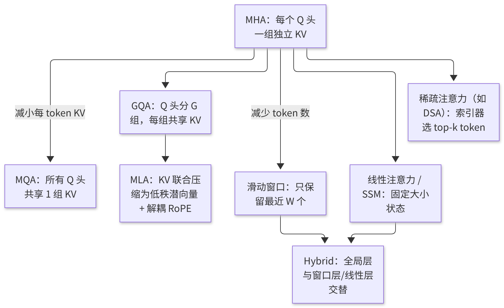
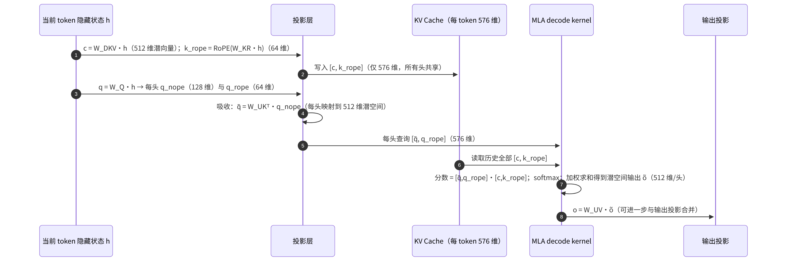

# R1 · 参考阅读：Attention 架构变体（非主线内容）

> 【注意】**非主线内容**：本文为参考阅读材料，不属于 vLLM 正式课程序列，完成主线课程无需阅读本文。原"番外篇"的内部标题误写为"第 10 课"，并引用了外部课程；本版已删除所有跨课程引用，仅保留通用原理及其在 vLLM 中的对应实现。
> **版本**：原理部分与框架无关；vLLM 对应实现以 0.30.x（V1）为准，相关源码路径与符号已对照 v0.30.0 tag 核实。
> **导航**：建议在完成 B4（KV 显存）与 C1（注意力后端）之后选读；读完后可返回主线课程 [C2-CUDAGraph]，或继续学习后续模块。
> **练习**：无独立目录；可选择以 B4 的块池练习进行回归（见第 8 节）。

## 0. 先修要求与学习目标

先修要求：多头注意力（MHA）公式；B4 中每个词元（token）的 KV 字节数公式；C1 中的 roofline 模型以及"decode 注意力属于访存受限"的结论。

完成本文学习后，学习者应能够：

1. 以"每 token 的 KV 字节数"这一指标，统一理解 MHA → MQA → GQA → MLA 的演进；
2. 手工计算各变体在典型配置下的 KV 大小与 decode 读取量；
3. 阐述 MLA 的低秩压缩、解耦 RoPE 与"矩阵吸收"；
4. 阐述滑动窗口、混合（Hybrid）注意力、线性注意力/状态空间模型以及稀疏注意力的思路与代价；
5. 指出这些变体在 vLLM 中由哪些机制承接（KV 规格、块管理器、注意力后端）。

---

## 1. 动机：键值缓存是推理中最关键的资源

B4 与 B6 已经说明：键值缓存（KV Cache）的容量决定并发数，KV 读取量决定长上下文解码（Decode）的步长。因此，近年来注意力结构的演进基本可以归结为一个问题：**如何在尽可能不损失质量的前提下，减少每个 token 需要保存与读取的 KV**。可从以下两个方向着手：

- **减小每个 token 的 KV**：共享 KV 头（MQA/GQA）、低秩压缩（MLA）；
- **减少需要保留/读取的 token 数**：滑动窗口、稀疏选择（DSA 等）、以固定大小的状态替代逐 token 的缓存（线性注意力/SSM）。



<p align="center"><em>图1：Attention 变体谱系：减小每个 token 的 KV（MQA/GQA/MLA）与减少 token 数（滑动窗口、线性注意力、Hybrid）</em></p>


阅读本文时，建议始终关注两个问题：该变体**节省的是容量还是计算**？它**对并行切分有何影响**？前者决定了其收益在 vLLM 中由块管理器还是注意力后端体现，后者决定了它适合 TP 还是 DP 的部署方式。几乎所有变体的优缺点都可以由这两个问题推导得出。此外需要注意，结构选择是在训练阶段确定的，推理框架无法将一个 MHA 模型"改为"MLA；推理侧所能做的，是为每种结构提供正确且高效的缓存管理与内核（kernel）。

## 2. 每 token KV 的统一公式与数值

```
每 token KV 字节 = 层数 × 每层每 token 缓存元素数 × dtype 字节
MHA/GQA/MQA：每层元素数 = 2 × num_kv_heads × head_dim
MLA：      每层元素数 = kv_lora_rank + qk_rope_head_dim（K、V 共用一个潜向量，不乘 2）
```

**以一个 32 层、32 个 Q 头、head_dim 为 128 的 7B 级模型为例（bf16）**：

| 结构 | KV 头数 | 每层每 token 元素数 | 每 token KV | 相对 MHA |
|---|---|---|---|---|
| MHA | 32 | 8 192 | 512 KiB | 1 |
| GQA（G=8） | 8 | 2 048 | 128 KiB | 1/4 |
| MQA | 1 | 256 | 16 KiB | 1/32 |
| MLA（512 + 64） | — | 576 | 36 KiB | ≈1/14 |

**DeepSeek-V3 量级的对比**（61 层、128 个头）：MLA 每个 token 为 576 × 2 B × 61 ≈ 68.6 KiB；若采用同等维度的 MHA（K 头维 192、V 头维 128），每个 token 为 128 × (192 + 128) × 2 B × 61 ≈ 4.77 MiB，约为 MLA 的 71 倍。若不采用 MLA，此类模型在长上下文下几乎无法实现高并发服务。

**decode 读取量**：batch 为 64、上下文为 8 192 时，GQA-8 的 7B 模型每步需读取 64 × 8 192 × 128 KiB = 64 GiB，在 3.35 TB/s 带宽下约需 20 ms，远超读取权重的时间；若改用 MLA，则约为 18 GiB、约 6 ms。这正是"KV 体积决定长上下文 decode 速度"的直观含义。

## 3. GQA 与 MQA：共享 KV 头

GQA 将 H 个 Q 头分为 G 组，每组共享一组 K、V。在计算上，每个 KV 头被 H/G 个 Q 头复用，decode 注意力的算术强度随之提升至约 H/G（C1），这对访存受限的 decode 直接有利。在质量上，G=8 时与 MHA 的差距很小，而 MQA（G=1）在大模型上存在可察觉的质量损失，因此 GQA 成为主流的折中方案。


**一个易混淆之处**：GQA 的分组仅影响 K、V 的投影与缓存，Q 的投影仍为完整的 H 个头，因此模型参数量的变化很小（仅 K、V 投影矩阵变小），质量损失也较为有限。从工程角度看，GQA 的价值几乎全部体现在推理阶段：KV 容量提升 H/G 倍，decode 读取量下降 H/G 倍。这也解释了近年来几乎所有开源稠密模型均采用 GQA 的原因。

**与张量并行（TP）的交互**（E2）：TP 按注意力头切分，若 TP > G，KV 头必须复制，KV 容量将不再随 TP 线性增长。例如，当 G=8、TP=16 时，每个 KV 头在两张 GPU 上各保存一份。

## 4. MLA：低秩压缩与矩阵吸收

MLA 的核心步骤如下：

1. **压缩**：对每个 token 的隐藏状态 h，计算一个低维潜向量 c = W_DKV · h（维度为 512），仅缓存 c；
2. **解耦 RoPE**：旋转位置编码与低秩压缩不兼容（RoPE 依赖位置，会破坏下文所述的"吸收"），因此另外为 K 计算一小段带 RoPE 的分量（64 维），由所有头共享，并一同缓存；
3. **还原**：在概念上，K = W_UK · c、V = W_UV · c，每个头各有其上投影矩阵；
4. **矩阵吸收**：decode 时并不实际还原 K、V。注意力分数 qᵀK = qᵀ W_UK c = (W_UKᵀ q)ᵀ c，因此可先将 W_UK 吸收进 query，使 query 直接与潜向量 c 进行点积；同理，W_UV 可吸收进输出投影。由此，decode 注意力直接在 576 维的潜空间上计算，读取的 KV 仅为潜向量。

**代价与后端**：吸收之后，注意力的形态变为"多个 Q 头 × 一个共享的 576 维 KV"，相当于 head_dim 很大的 MQA，需要专用 kernel 方能高效执行；prefill 时由于 query 数量很多，吸收并不划算，通常反过来先还原 K、V，再执行常规注意力。因此，MLA 后端须分别处理 prefill 与 decode 两条路径。在 v0.30.0 中，MLA 的公共逻辑（`MLACommonBackend`、`MLACommonMetadataBuilder`、`MLACommonImpl`）位于 `vllm/model_executor/layers/attention/mla_attention.py`；`vllm/v1/attention/backends/mla/` 下为各具体后端：decode 后端包括 FlashMLA、CUTLASS MLA、Triton MLA、FlashInfer MLA、FlashAttention MLA、TokenSpeed MLA 及 ROCm AITER MLA 等，另有面向稀疏注意力的 FlashMLA Sparse、FlashInfer MLA Sparse、FlashAttention MLA Sparse 等变体；prefill 路径的实现集中于该目录下的 `prefill/` 子目录。

**与并行的交互**：潜向量不按头切分，TP 时每张 GPU 都须保存完整的潜向量 KV，这正是 E1 中大型 MoE 模型采用"注意力 DP"的根本原因。

## 4.5 MLA 单步 decode 的数据流



<p align="center"><em>图2：MLA 单步 decode 的数据流</em></p>

由该图可以看出 MLA 后端的特殊之处：kernel 读取的"KV"仅为 576 维的共享向量，但每个头的查询也被映射至 576 维，相当于"128 个 Q 头 × 1 个 KV 头、head_dim = 576"的 MQA。在这种形状下，每读取一个 KV 元素即可与 128 个查询相乘，算术强度很高，decode 注意力甚至可能由访存受限转为计算受限。这与 C1 中关于 GQA 模型的结论完全不同，也是 MLA 需要专门设计 kernel 的原因。此外，由于 KV 中 c 与 V 的潜表示为同一向量，"读取 K"与"读取 V"实际上是同一份数据，只需读取一次——这也是公式中不乘以 2 的直观解释。

## 5. 滑动窗口与 Hybrid

**滑动窗口**：每个 token 仅关注最近的 W 个 token，窗口之外的 KV 可以丢弃。KV 与计算量均由 O(L) 降为 O(W)。其代价是单层无法直接获取远处的信息，需要依靠多层堆叠间接传递，长程依赖能力因此下降。

**Hybrid**：为兼顾二者，许多模型令少数层保留全局注意力、多数层使用窗口注意力（或线性注意力）。**数值示例**：每 6 层中 1 层为全局注意力、5 层为窗口注意力（W = 1 024），上下文为 128K 时，平均每层需保留的 token 数 ≈ (1/6) × 128K + (5/6) × 1K ≈ 22.2K，相比全部采用全局注意力时的 128K，KV 约节省 5.8 倍。

**vLLM 的承接**：即 B4 第 7 节介绍的 KV cache group 机制。每层通过 `KVCacheSpec`（`vllm/v1/kv_cache_interface.py`：`FullAttentionSpec`、`SlidingWindowSpec`、`ChunkedLocalAttentionSpec` 等）声明需求，`HybridKVCacheCoordinator` 为每组分配块表，`SlidingWindowManager.remove_skipped_blocks()` 将窗口外的块替换为 null block 并予以释放。前缀缓存在混合模型中同样需要特殊处理：一个前缀"命中"必须在所有组中均成立，而窗口组只需窗口内的块存在即可。

## 6. 线性注意力与状态空间模型

线性注意力与 Mamba 类 SSM 不保存逐 token 的 KV，而是维护一个**固定大小的状态**，每输入一个 token 即更新一次状态。decode 时每步的计算量与读取量均与上下文长度无关，因此在长上下文下优势显著；prefill 可采用分块扫描（chunked scan）并行计算。其代价是固定大小的状态属于有损压缩，精确检索远处信息的能力较弱，因此在实践中多与少量全局注意力层组成 Hybrid 结构。

**vLLM 的承接**：`MambaSpec` 描述每个请求的状态大小，状态同样以"块"的形式由块池管理（每个请求占用固定数量的块）；相应的层与 kernel 位于 `vllm/model_executor/layers/mamba/` 下。前缀缓存与此类状态的兼容需要额外的机制，即仅在特定位置保存状态快照：在 v0.30.0 中由 `mamba_cache_mode` 控制，启用前缀缓存时默认取 `"align"`（仅当某一调度步的最后一个 token 恰好位于块边界 `i × block_size` 时缓存其状态），`"all"` 则在每个块边界位置均缓存状态，`"none"` 对应关闭前缀缓存。

## 7. 稀疏注意力（以 DSA 为例）

稀疏注意力保留完整的 KV，但每个 query 仅与被选出的少量 token 进行计算。以 DeepSeek 稀疏注意力（DSA）为例：一个轻量的"索引器"以低维、低精度的投影为每个 query 对所有历史 token 打分，选出 top-k（如 2 048 个）token，主注意力仅在这些 token 上计算。

**数值示例**：上下文为 128K、k = 2 048 时，主注意力的每个 query 仅涉及 1.6% 的 token，计算量下降约 64 倍；但索引器本身仍须扫描全部 128K 个 token（以很小的维度与 FP8 精度），其开销随长度线性增长，只是常数要小得多。KV 容量并未减少（甚至增加了索引器自身的小规模 KV），因此其收益体现在**计算与读取带宽**上，而非容量上。

**vLLM 的承接**：需要专门的注意力后端与额外的索引器 KV 规格，以及调度器与块管理对两类缓存的协调。在 v0.30.0 中，索引器后端为 `vllm/v1/attention/backends/mla/indexer.py` 中的 `DeepseekV32IndexerBackend`（及其 V4 等派生类）；索引器缓存由 `DeepseekV32IndexerCache` 层（`vllm/model_executor/models/deepseek_v2.py`）以独立的 `MLAAttentionSpec` 声明，从而作为一类额外的 KV cache 交由块管理统一分配；主注意力则使用 FlashMLA Sparse、FlashInfer MLA Sparse 等稀疏 MLA 后端。

## 7.5 判断新模型在 vLLM 中所采用路径的方法

面对一个新模型时，可按以下顺序判断其注意力将对应何种 KV 规格与后端，从而预估显存与性能。第一，查看模型配置：是否存在 `kv_lora_rank` 之类的字段（MLA）、`num_key_value_heads` 的取值（GQA/MQA）、`sliding_window` 或逐层的注意力类型列表（窗口/Hybrid），以及是否存在状态空间层的配置（Mamba 类）。第二，查看 vLLM 中对应的模型实现：每个注意力层在构造时会声明自身类型，ModelRunner 汇总后生成每层的 `KVCacheSpec`，启动日志中通常可以看到 KV cache group 的数量以及每组的类型。第三，确认所选的注意力后端：日志中的后端名称指明了 decode 所使用的 kernel；若某种变体仅受少数后端支持，强制指定其他后端可能导致启动失败。第四，使用第 2 节的公式计算每个 token 的 KV，并与启动日志中的 KV token 数进行对照；若差异很大，则表明对模型结构的理解有误，或存在复制（例如 TP 大于 KV 头数）。

该流程将本文的原理与主线课程（B4 的块管理、C1 的后端选择、E2 的头复制）联系起来：注意力变体并非孤立的论文知识，它们直接决定了部署时的容量与速度。

## 8. 选读练习

本文没有独立的练习目录。可使用 B4 的块池练习作为回归，并完成以下计算练习：

```bash
python -m pytest exercises/B4_block_pool -q
```

1. 编写函数 `kv_bytes_per_token(layers, kind, **cfg)`，支持 `mha/gqa/mqa`（参数为 num_kv_heads、head_dim）与 `mla`（参数为 kv_lora_rank、rope_dim），并以第 2 节表格中的数值编写测试。验收标准：函数对表中四种结构的计算结果与表中"每 token KV"一列一致。
2. 计算一个 Hybrid 模型（每 6 层中 1 层为全局注意力、窗口为 1 024）在上下文为 8K、32K、128K 时相对于全部采用全局注意力的 KV 节省倍数，并说明节省倍数随上下文增长的变化规律。
3. 以 B4 的块大小 16，分别计算第 2 节中 7B 级 GQA 模型与 MLA 模型在 50 GB KV 预算下可容纳的块数与 token 数。

## 9. 常见误区

1. **误认为 MQA/GQA 降低了计算量**：其主要降低的是 KV 容量与读取量；Q 头数不变，注意力的计算量变化不大。
2. **误认为 MLA 在 prefill 中也使用潜空间**：prefill 通常还原 K、V 并采用常规路径，吸收仅对 decode 有利。
3. **误认为滑动窗口模型能够"记住"全部上下文**：窗口外的信息只能通过多层间接传递，长程检索能力有限。
4. **误认为稀疏注意力能够节省显存**：DSA 类方法主要节省计算，KV 仍须完整保存。
5. **忽视与并行的交互**：KV 头数与潜向量结构直接决定 TP 是否有效（E1、E2）。

## 10. 自测题

- [ ] 能否使用统一公式手工计算 MHA、GQA、MQA、MLA 每个 token 的 KV，并解释 MLA 不乘以 2 的原因
- [ ] 能否阐明 MLA 矩阵吸收的数学依据，以及需要专用 decode 后端的原因
- [ ] 能否说明 vLLM 如何为 Hybrid 模型的不同层组分别管理 KV 块

## 11. 参考文献

- 论文：Multi-Query Attention（Shazeer 2019）、GQA（2023）、DeepSeek-V2（MLA）、Longformer / Mistral（滑动窗口）、Mamba / Mamba-2、DeepSeek-V3.2（DSA）
- 源码：`vllm/v1/attention/backends/`（含 `mla/`）、`vllm/v1/kv_cache_interface.py`、`vllm/v1/core/single_type_kv_cache_manager.py`、`vllm/model_executor/layers/mamba/`
- 其他推理框架对上述变体亦有实现，可供对照阅读，但不属于本课程的主线内容

---

**课程导航**　[返回索引](https://qcngm3vce6yt.feishu.cn/docx/KUn5dKSejoQSAJxaf7YcvNVDnCd)

引用本文的课程：
- [B4 · PagedAttention 与 KV Cache 显存管理](https://qcngm3vce6yt.feishu.cn/docx/OOo7d5yZvoKv2ZxauPOcBDOincb)（3. 显存的手工计算：从模型配置到块数）
- [E1 · 数据并行 DP](https://qcngm3vce6yt.feishu.cn/docx/WmsNdoxVDoVE0ix9DchclYB8nYe)（7. 数值示例：DP+EP 部署的资源估算）
